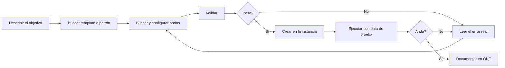

# Clase — Proyectos de n8n con Claude Code y Vibecoding

**Stack de la clase:** n8n self-hosted + Claude Code + n8n MCP + n8n Skills + documentación en OKF

---

## 1. Objetivo

Al final de la clase cada alumno tiene que poder:

1. Conectar su instancia local de n8n a Claude Code vía MCP.
2. Instalar y entender el pack de **skills** que le enseña al agente cómo se construye un workflow bien hecho.
3. Construir un workflow mediano **describiéndolo en lenguaje natural**, no arrastrando nodos.
4. Validarlo, ejecutarlo e iterar sin salir del agente.
5. Dejar el proyecto **documentado en un formato que el próximo agente pueda leer** (OKF).

El punto de la clase no es "n8n". Es: **cómo se construye un sistema de automatización cuando el que escribe el JSON es un agente y vos sos el arquitecto.**

---

## 2. Agenda sugerida

| Bloque | Tema | Foco |
|---|---|---|
| 0 | Video tutoría + arquitectura | Contexto y mapa del proyecto |
| 1 | Qué es vibecoding aplicado a n8n | Mentalidad y límites |
| 2 | n8n MCP: conectar el agente a la instancia | Setup, auth, tools |
| 3 | n8n Skills: darle criterio al agente | Por qué MCP solo no alcanza |
| 4 | El loop de construcción | Patrón → build → validate → run → fix |
| 5 | Documentación del proyecto con OKF | Que el conocimiento sobreviva a la sesión |
| 6 | Práctica guiada + entregable | Proyecto propio |

---

## 3. Recursos de la clase

- **Video tutoría:** https://www.youtube.com/watch?v=B6k_vAjndMo
- **Arquitectura del proyecto:** https://drive.google.com/file/d/1v3MBxmvbMhzcT8IoA2Kw1w0mBQ8_w40o/view
- **n8n Skills (repo):** https://github.com/czlonkowski/n8n-skills
- **n8n Skills (sitio):** https://www.n8n-skills.com/
- **n8n MCP (docs oficiales):** https://docs.n8n.io/connect/connect-to-n8n-mcp-server
- **n8n-mcp (proyecto de la comunidad):** https://github.com/czlonkowski/n8n-mcp
- **Open Knowledge Format:** https://cloud.google.com/blog/products/data-analytics/how-the-open-knowledge-format-can-improve-data-sharing

---

## 4. Bloque 1 — Vibecoding aplicado a n8n

### La idea

Vibecoding es describir el resultado y dejar que el agente produzca el artefacto. En n8n el artefacto es un **JSON de workflow**: nodos, parámetros, conexiones. Es un formato que ningún humano quiere escribir a mano y que un LLM puede generar perfectamente… **si tiene el contexto correcto.**

### Por qué falla si lo hacés naive

Si abrís Claude Code y le pedís "armame un workflow de n8n que haga X", sin MCP y sin skills, pasa esto:

- Inventa nodos que no existen o usa el `nodeType` con el formato equivocado.
- Configura parámetros con nombres de una versión vieja del nodo.
- Se olvida de que la data de un webhook vive bajo `$json.body`.
- Devuelve un JSON que n8n rechaza, y entra en un loop de validación infinito.

### El modelo mental correcto

Necesitás tres capas, y cada una resuelve un problema distinto:

| Capa | Qué aporta | Sin ella pasa que… |
|---|---|---|
| **MCP** | Manos y ojos: leer, crear, validar y ejecutar workflows en tu instancia | El agente escribe JSON al vacío y vos copiás y pegás |
| **Skills** | Criterio: cómo se configura cada nodo, qué patrón usar, cómo se maneja el error | Tiene acceso pero no sabe qué hacer bien |
| **Documentación (OKF)** | Memoria: qué construimos, por qué, con qué convenciones | Cada sesión arranca de cero y reinventa decisiones |

> **Punto para remarcar en clase:** el 90% de la calidad del output está en las capas 2 y 3, no en el modelo.

### Dónde vibecoding *no* aplica

- Credenciales y secretos → siempre a mano, nunca dictadas al agente.
- Workflows que tocan producción o mandan plata/mails a clientes reales → revisión humana obligatoria.
- Decisiones de arquitectura (qué se parte en sub-workflows, dónde va la cola) → las tomás vos, el agente ejecuta.

---

## 5. Bloque 2 — n8n MCP

### ⚠️ Aclaración importante: son dos cosas distintas

Este es el punto donde más se confunden los alumnos. Hay **dos servidores MCP** para n8n:

| | **MCP nativo de n8n** | **`czlonkowski/n8n-mcp`** |
|---|---|---|
| Qué es | Servidor MCP **integrado en tu instancia** | Servidor MCP de la comunidad, corre aparte |
| Se conecta a | Tu n8n (instance-level) | Base de conocimiento de nodos + tu n8n vía API |
| Fuerte en | Crear/editar/ejecutar workflows, data tables | Búsqueda de nodos, validación multinivel, ~2.600 templates |
| Auth | OAuth o Access Token desde la instancia | `N8N_API_URL` + `N8N_API_KEY` en el env |
| Docs | `docs.n8n.io/connect` | GitHub del proyecto |

No compiten: en la práctica se pueden usar los dos. Para la clase arrancamos con el **nativo**, que es el que corresponde al comando que van a correr.

### Qué habilita el MCP nativo

Cuando conectás un agente al MCP de tu instancia, tu n8n **se vuelve un lugar donde el agente puede construir directamente**. En vez de arrastrar nodos al canvas y cablearlos a mano, describís el workflow en lenguaje natural y el agente lo arma adentro de n8n. Después iterás en el mismo lugar: lo corrés, mirás el resultado, lo refinás.

Las tools que expone cubren tres familias:

- **Workflow management** — buscar, listar, leer workflows (con filtros por tags, límite de 200 resultados, ordenados por última actualización).
- **Workflow builder** — crear workflows desde una descripción y editar los existentes.
- **Data tables** — guardar y reusar datos entre workflows.

Un detalle de diseño que conviene explicar: el acceso es **por instancia y opt-in por workflow**. No expone todo tu n8n de una; vos elegís qué workflows habilitás. Es distinto del nodo **MCP Server Trigger**, que expone tools de *un solo* workflow.

### Setup — instancia local

**Paso 1.** Levantar n8n local (Docker) en `localhost:5678`.

**Paso 2.** En n8n: `Settings → Instance-level MCP`. Ahí está el popup de *Connection details* con dos opciones de auth: **OAuth** o **Access Token**. Para local, Access Token es más simple.

> La primera vez que entrás a la página de MCP Access, n8n genera automáticamente un token personal atado a tu usuario. **Copialo en ese momento** — después solo vas a poder regenerarlo.

**Paso 3.** Habilitar los workflows que quieras exponer.

**Paso 4.** Registrar el servidor en Claude Code:

```bash
claude mcp add --transport http n8n-mcp http://localhost:5678/mcp-server/http \
  --header "Authorization: Bearer <TU_TOKEN_N8N_MCP>"
```

Para Codex el equivalente es:

```bash
codex mcp add n8n-mcp --url https://<tu-instancia>/mcp-server/http
```

**Paso 5.** Verificar: `/mcp` dentro de Claude Code tiene que listar `n8n-mcp` como conectado.

### Bonus: MCP de la documentación

Aparte del MCP de la instancia, n8n publica **dos MCP servers de documentación**, ambos por HTTP (no soportan stdio ni SSE):

```bash
claude mcp add --transport http n8n-docs https://docs.n8n.io/~gitbook/mcp
claude mcp add --transport http n8n-kapa https://n8n.mcp.kapa.ai
```

- El de **GitBook** responde con las páginas exactas de la doc — es la fuente autoritativa.
- El de **Kapa.ai** cubre preguntas más amplias, troubleshooting y ejemplos reales (es el motor del AI Assistant del sitio). Pide autenticación por browser la primera vez.

Se pueden tener los dos. Regla práctica: GitBook cuando querés precisión, Kapa cuando estás debuggeando.

### Errores frecuentes de setup

| Síntoma | Causa típica |
|---|---|
| El MCP conecta pero no ve ningún workflow | No habilitaste ningún workflow para MCP access |
| `NOT_FOUND` en workflows que existen | Estás apuntando a otra instancia |
| 401 / Unauthorized | Token vencido o header mal formado |
| El agente crea workflows pero no puede ejecutarlos | Faltan permisos o credenciales del lado de n8n |

---

## 6. Bloque 3 — n8n Skills

### El problema que resuelven

Cuando conectás un coding agent al MCP, el agente **puede** construir y editar workflows, pero **no conoce las convenciones de n8n**: sintaxis de expresiones, configuración de nodos, manejo de errores, patrones. Las skills le dan ese conocimiento para que le salga bien a la primera.

Sin skills, los problemas típicos son: usar las tools MCP de forma ineficiente, quedar trabado en loops de error de validación, no saber qué patrón de workflow corresponde, y mal configurar nodos y sus dependencias.

### ⚠️ Otra vez: hay dos packs

| | **`czlonkowski/n8n-skills`** | **`n8n-io/skills`** (oficial) |
|---|---|---|
| Pensado para | El MCP de la comunidad (`n8n-mcp`) | El MCP nativo de la instancia |
| Contenido | 14 skills + router + hooks | 13 skills de capacidad + meta-skill + 50+ docs de referencia |
| Licencia | MIT | — |

Los links que circulan mezclan los dos. Para la clase usamos el de `czlonkowski`, que es el que está en el material. Si en tu proyecto usás el MCP nativo, el oficial encaja mejor.

### Las 14 skills

**Fundamentos**

1. **Expression Syntax** — sintaxis `{{ }}`, variables core (`$json`, `$node`, `$now`, `$env`), catálogo de errores comunes. El gotcha crítico: **la data del webhook vive bajo `$json.body`**.
2. **MCP Tools Expert** *(máxima prioridad)* — qué tool usar para cada cosa, diferencia entre `nodes-base.*` y `n8n-nodes-base.*`, perfiles de validación (minimal / runtime / ai-friendly / strict).
3. **Workflow Patterns** — 5 patrones probados: webhook processing, HTTP API, database, AI, scheduled. Con ejemplos sacados de más de 2.600 templates reales.
4. **Validation Expert** — cómo leer un error de validación, el loop de validación, falsos positivos.
5. **Node Configuration** — dependencias entre propiedades (ej. `sendBody` → `contentType`), requisitos por operación, los 8 tipos de conexión AI.

**Código**

6. **Code JavaScript** — `$input.all()` / `$input.first()`, formato de retorno `[{json: {...}}]`, y el detalle fino: `this.helpers.httpRequest()` (el global `$helpers` pelado es `undefined` en el sandbox del task-runner).
7. **Code Python** — el 95% de los casos se resuelven mejor en JS. Limitación crítica: **no hay librerías externas** (nada de `requests`, `pandas`, `numpy`).
8. **Code Tool** — el nodo callable por el AI Agent. Contrato distinto al Code node: devuelve **un string** (usá `JSON.stringify()`), el input llega por `query`, y `$fromAI()` **no funciona acá**.

**Producción**

9. **Error Handling** — `onError: continueErrorOutput` + cablear `main[1]`, `retryOnFail`, mapeo de respuestas 4xx/5xx (ojo: `responseCode` por default es 200).
10. **Binary & Data** — `$binary` vs `$json`: el contenido de un archivo **nunca** vive en `$json`.
11. **Sub-workflows** — cuándo partir (regla práctica: más de ~10 nodos), `mode: all` vs `each`, naming verb-first.
12. **AI Agents** — Agent vs LLM Chain vs Text Classifier, slots de model/memory/tools/outputParser, `$fromAI`, structured output, memoria + `sessionId`.
13. **Multi-Instance** — apuntar a la instancia correcta cuando hay prod y staging.
14. **Self-Hosting** — deploy end-to-end en una VM (Docker Compose detrás de Caddy, single vs queue mode).

### La capa de enforcement

Esto es lo interesante desde el punto de vista de diseño de agentes, y vale la pena detenerse:

- **Router skill** (`using-n8n-mcp-skills`) — se carga en cada sesión vía hook `SessionStart` y re-dispara en resume/clear/compact, así que **sobrevive a la compactación de contexto**.
- **PreToolUse hooks** — antes de una llamada MCP de alto impacto, tira un recordatorio apuntando a la skill relevante.
- **PostToolUse hook** — después de `validate_workflow`, inspecciona los tipos de nodo y te rutea a las skills que cubren los riesgos que quedan, con el recordatorio de que **que la validación pase es necesario, no suficiente**.

Los hooks solo corren en la instalación como plugin (Claude Code / Codex). En Claude.ai las skills igual se activan por descripción, pero sin los nudges proactivos. Todos los hooks fallan abierto: nunca bloquean una tool call.

### Instalación

```bash
# Recomendado: como plugin de Claude Code
/plugin install czlonkowski/n8n-skills
```

```bash
# Manual
git clone https://github.com/czlonkowski/n8n-skills.git
cp -r n8n-skills/skills/* ~/.claude/skills/
```

En Claude.ai: zippear cada carpeta de skill y subirla en `Settings → Capabilities → Skills`.

### Cómo componen

Las skills se activan **solas** según lo que pedís, y se combinan. Si pedís *"armá y validá un workflow de webhook a Slack"*:

1. **Workflow Patterns** identifica el patrón de webhook processing
2. **MCP Tools Expert** busca los nodos de webhook y Slack
3. **Node Configuration** guía el setup de cada nodo
4. **Code JavaScript** procesa la data del webhook con el `.body` correcto
5. **Expression Syntax** resuelve el mapeo de datos
6. **Validation Expert** valida el resultado final

> **Ejercicio de 5 minutos en clase:** que cada alumno tire una pregunta y adivine qué skill se va a activar antes de mandarla. Después la mandan y comparan.

---

## 7. Bloque 4 — El loop de construcción



### Reglas del loop

1. **Templates primero.** Siempre chequear si existe un template antes de construir de cero.
2. **Nunca confiar en los defaults.** Los valores por default de los parámetros son la causa número uno de fallas en runtime.
3. **Validación multinivel.** `validate_node(minimal)` → `validate_node(full)` → `validate_workflow`.
4. **Validar no es probar.** Un workflow que valida puede fallar igual en ejecución. Siempre correrlo con data real.
5. **Un cambio por vez** cuando estás debuggeando. Si el agente cambia cinco cosas y anda, no sabés cuál era.

---

## 8. Bloque 5 — Documentar el proyecto con OKF

### Por qué este bloque existe

Todo lo anterior funciona **dentro de una sesión**. Cuando cerrás Claude Code, se pierde: por qué elegiste ese patrón, qué convención de naming usaron, cuál es el sub-workflow que ya resuelve X, qué endpoint está deprecado.

Ese conocimiento hoy vive disperso: catálogos de metadata con APIs propietarias, wikis, drives compartidos, comentarios en el código, docstrings, y la cabeza de dos o tres personas del equipo.

### Qué es OKF

El **Open Knowledge Format** es una especificación abierta que formaliza el patrón "LLM-wiki" en un formato portable e interoperable. Es un estándar **neutral respecto al vendor**, legible por humanos y por agentes, para representar la metadata, el contexto y el conocimiento curado que los sistemas de IA necesitan.

En su versión 0.1, OKF representa el conocimiento como **un directorio de archivos markdown con YAML frontmatter**, más un conjunto chico de convenciones acordadas que permiten que wikis escritas por productores distintos sean consumidas por agentes distintos sin traducción.

La metáfora simple: los **documentos OKF** son los árboles (un `.md` por concepto: una tabla, una métrica, una API), y los **bundles OKF** son el bosque (el directorio completo).

### Los tres principios de diseño

1. **Mínimamente opinionado.** OKF exige exactamente una cosa de cada concepto: un campo `type`. Todo lo demás —qué tipos existen, qué otros campos incluir, qué secciones tiene el body— lo decide el productor. La spec define la superficie de interoperabilidad, no el modelo de contenido.
2. **Independencia productor/consumidor.** Un bundle escrito a mano puede ser consumido por un agente. Un bundle generado por un pipeline puede navegarse en un visualizador. Uno sintetizado por un LLM puede ser consultado por otro. **El formato es el contrato**; el tooling de cada punta es intercambiable.
3. **Formato, no plataforma.** No está atado a ningún cloud, base de datos, proveedor de modelos ni framework de agentes. Nunca va a requerir una cuenta o un SDK propietario para leer, escribir o servir.

### Cómo lo aplicamos al proyecto de n8n

La propuesta de la clase: que cada proyecto tenga un bundle OKF que el agente lea **antes** de tocar nada.

```
proyecto-n8n/
├── knowledge/
│   ├── workflows/
│   │   ├── ingesta-leads.md
│   │   └── notificador-telegram.md
│   ├── conceptos/
│   │   ├── convenciones-naming.md
│   │   └── manejo-errores.md
│   └── integraciones/
│       ├── telegram.md
│       └── crm-api.md
└── README.md
```

Ejemplo de documento:

```markdown
---
type: workflow
name: ingesta-leads
status: producción
owner: equipo-growth
depende_de: [crm-api, validador-email]
---

# Ingesta de leads

## Qué hace
Recibe un lead por webhook, valida el email, lo enriquece
contra el CRM y notifica al canal de ventas.

## Decisiones
- Se usa sub-workflow para la validación porque también la
  consume `alta-manual`.
- Retry activado en la llamada al CRM: la API tira 503 seguido.

## Gotchas
- La data del webhook llega bajo `$json.body`, no en la raíz.
- El CRM devuelve 200 con body de error. Hay que chequear
  `body.status`, no el status code.
```

Fijate que lo único obligatorio ahí es `type`. Todo el resto son convenciones que definís vos.

### El cierre conceptual de la clase

Las tres capas se cierran así:

- **MCP** = el agente puede actuar sobre tu instancia
- **Skills** = el agente sabe cómo hacerlo bien
- **OKF** = el agente sabe qué construimos nosotros y por qué

Sin la tercera, cada sesión es la primera sesión.

---

## 9. Práctica — entregable

### Consigna

Elegí un proyecto propio y construilo **enteramente vía agente**. Objetivo mínimo: 8–12 nodos, al menos un sub-workflow, y manejo de errores explícito.

Ideas si no se te ocurre nada:

- Bot de Telegram con menú dinámico que consulta una API y guarda en data table
- Pipeline de ingesta: webhook → validación → enriquecimiento → notificación
- Agente de research: scheduled trigger → búsqueda → resumen con LLM → envío
- Sincronizador entre dos APIs con detección de conflictos

### Qué entregar

1. **El workflow** funcionando en tu instancia (export del JSON).
2. **El bundle OKF** con mínimo 3 documentos: el workflow, una integración, y un documento de convenciones.
3. **Un log corto** (media carilla): dónde el agente se equivocó, qué skill lo corrigió, y qué tuviste que resolver vos a mano.

El punto 3 es el que más se corrige. Lo que interesa es que identifiques **dónde termina el vibecoding y empieza tu criterio**.

### Criterios de evaluación

| Criterio | Peso |
|---|---|
| El workflow ejecuta sin errores con data real | 25% |
| Manejo de errores explícito (no happy path solamente) | 20% |
| Descomposición razonable en sub-workflows | 15% |
| Calidad y utilidad del bundle OKF | 25% |
| Log de iteración: análisis, no narración | 15% |

---

## 10. Checklist rápida

**Antes de empezar a construir**

- [ ] n8n corriendo y accesible
- [ ] MCP conectado (`/mcp` lo lista)
- [ ] Workflows habilitados para MCP access
- [ ] Skills instaladas
- [ ] Credenciales cargadas a mano en n8n

**Durante**

- [ ] Buscar template antes de construir
- [ ] Validar antes de crear
- [ ] Ejecutar con data real, no asumir
- [ ] Un cambio por vez al debuggear

**Antes de cerrar**

- [ ] Documento OKF del workflow escrito
- [ ] Gotchas anotados (los que te costaron tiempo)
- [ ] Export del JSON versionado

---

## 11. Preguntas para discusión

Sirven para cerrar la clase o para la parte asincrónica:

1. ¿Dónde poner el límite entre lo que delegás al agente y lo que hacés a mano? ¿Cambia según el ambiente?
2. Los hooks del pack de skills reinyectan contexto en cada sesión. ¿Qué problema real están resolviendo y qué te dice eso sobre los límites de la ventana de contexto?
3. OKF exige un solo campo obligatorio. ¿Qué se gana y qué se pierde con un estándar tan poco opinionado?
4. Si el agente puede construir el workflow, ¿qué habilidad tenés que desarrollar vos que antes no importaba tanto?