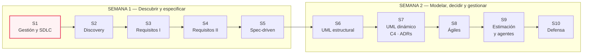
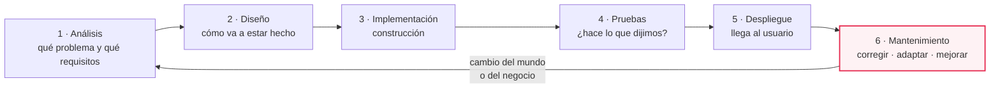
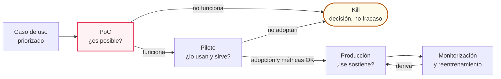

# MA·S01 — Gestión de proyectos y ciclo de vida del software

**Módulo:** A — Ingeniería de Software para AI Engineers *(módulo extra, transversal; se dicta entre el módulo 06 y el 07)*
**Sesión:** 01 de 10 · Semana 1 — Descubrir y especificar
**Fecha:** 24-08-2026
**Caso hilo conductor:** Proyecto VEGA — Nortia Energía
**Entregable:** `docs/00-charter.md`

**Duración estimada**

| Bloque | Tiempo |
|---|---|
| Clase presencial | 180 min |
| Lectura de los recursos imprescindibles | ~45 min |
| Lectura de los recursos recomendados | ~1 h 30 min |
| Trabajo del lab (charter de VEGA, en equipo) | ~1 h |
| **Total de estudio fuera de clase** | **≈ 3 h 15 min** |

**Artefacto:** [La sesión en versión web](https://claude.ai/code/artifact/7394d7fe-acf2-4422-bb0d-d1ba2469d3b4) — el apunte completo como página navegable.

---

## 1. Objetivos de aprendizaje

Al terminar esta sesión vas a poder:

1. **Explicar** qué es un proyecto, en qué se diferencia del trabajo operativo continuo, y por qué el software es un caso raro dentro de la disciplina de la gestión de proyectos.
2. **Comparar** los modelos de ciclo de vida —cascada, iterativo, incremental, espiral y ágil— identificando la fortaleza real de cada uno y en qué contexto sigue siendo la elección correcta, sin caricaturizar ninguno.
3. **Recorrer** las seis fases del SDLC (análisis, diseño, implementación, pruebas, despliegue, mantenimiento) y ubicar en cuál de ellas se está tomando una decisión concreta.
4. **Argumentar** por qué la triple restricción (alcance, tiempo, coste) no tiene a la calidad como cuarta punta, y qué pasa cuando un equipo la trata como si la tuviera.
5. **Identificar** el sponsor, los stakeholders y los usuarios finales de un proyecto real, distinguir sus agendas declaradas de las no declaradas, y ubicar cada rol (PM, Product Owner, tech lead) donde corresponde.
6. **Construir** un registro de riesgos: identificarlos de forma sistemática, puntuarlos en una matriz probabilidad/impacto y asignarles una de las cuatro respuestas posibles con un dueño.
7. **Explicar a un sponsor** por qué el ciclo de vida de un proyecto de IA es experimental y no determinista, y cómo la secuencia PoC → piloto → producción sirve para comprometerse sin mentir.
8. **Redactar** el project charter de una página de VEGA y entregarlo por Pull Request en el repositorio del equipo.

---

## 2. Resumen ejecutivo

Hasta acá el bootcamp te enseñó a **construir**: Python y Git en el módulo 01, prompting y APIs de LLM en el 02, automatizaciones con n8n en el 03 —incluido el pipeline de RAG completo de M03·S01, con su chunking, sus embeddings y su reranking—. Sabés levantar un sistema que funciona. Este módulo cubre lo otro: **decidir qué construir, escribirlo de forma que otro (humano o agente) pueda ejecutarlo, y sostenerlo como proyecto**.

Esta primera sesión da el vocabulario común del bloque y arranca el caso. El vocabulario es el clásico de la ingeniería de software —proyecto, ciclo de vida, SDLC, triple restricción, roles, riesgos— porque cuando entres a una empresa, esas son las palabras que va a usar la gente que decide si tu proyecto sigue o se cancela. Pero el eje de la sesión es más específico: **los proyectos de IA fracasan por gestión antes que por modelo**. El whitepaper de Fraunhofer USA que vas a leer enumera cinco causas raíz de fracaso de proyectos de IA y solo una de ellas es un límite técnico real; las otras cuatro son de organización, de datos o de proceso. Elegir bien el embedding model no te salva de haber definido mal el problema.

La segunda mitad de la sesión es lo que hace que este bloque no sea un curso genérico de gestión: el ciclo de vida de un proyecto de IA **es distinto**. Es experimental, el resultado depende de datos que cambian y no solo de código que se escribe, y el sistema se degrada solo aunque nadie toque nada. Eso obliga a prometer distinto, a estimar distinto y a mantener distinto.


### Dónde estás dentro del bloque



Cada sesión produce una pieza del mismo expediente. La de hoy produce `docs/00-charter.md`, que es el documento que en MA·S04 vas a **reabrir y reescribir** cuando sepas escribir criterios de éxito de verdad.
- - - 
## Caso hilo conductor: **Proyecto VEGA**

Todo el bloque se hace sobre un único caso. No hay ejercicios sueltos: cada sesión produce una pieza del mismo expediente de proyecto.

### El escenario

**Nortia Energía** es una comercializadora de electricidad y gas con 380 empleados y unos 210.000 clientes residenciales en España. Su departamento de Atención al Cliente tiene 42 agentes que atienden por teléfono, email y chat web.

Situación actual:

- ~1.900 contactos al día, con picos de 3.400 los días posteriores a la emisión de facturas.
- El tiempo medio de resolución es de 11 minutos; el 60 % del tiempo del agente se va en buscar información en una intranet con 4.100 documentos (tarifas, condiciones contractuales, procedimientos regulatorios, circulares internas) y en un CRM propietario.
- La rotación de agentes es alta: un agente nuevo tarda 7 semanas en ser autónomo.
- El 23 % de los contactos son sobre "no entiendo mi factura".

La Dirección ha aprobado un presupuesto para construir **VEGA**, un asistente interno que ayude a los agentes a resolver contactos más rápido. No ha definido nada más que eso.

### Los stakeholders (y sus conflictos)

|Stakeholder|Rol|Lo que quiere|Lo que no dice|
|---|---|---|---|
|**Marta Sedano**|Directora de Operaciones|Bajar el tiempo medio de resolución un 30 %|Su bonus depende del coste por contacto|
|**Iván Ferreras**|Responsable de Atención al Cliente|Que sus agentes no queden peor valorados|Teme que esto sea el paso previo a recortar plantilla|
|**Cristina Roa**|Asesora jurídica / DPO|Trazabilidad total y cumplimiento|No sabe todavía si el sistema entra en el AI Act|
|**Diego Amat**|IT Manager|Que nada toque el CRM de producción|Su equipo está saturado y no quiere mantener otra cosa|
|**Agentes de atención**|Usuarios finales|Que les quite trabajo, no que se lo añada|Nadie les ha preguntado|

### Por qué este caso

- Genera ambigüedad genuina: "ayudar a resolver contactos más rápido" no es un requisito.
- Los requisitos no funcionales son ineludibles y medibles: latencia, coste por conversación, tasa de alucinación tolerable sobre datos de facturación, retención de datos personales.
- Tiene un conflicto de stakeholders real que obliga a priorizar de verdad.
- Alimenta directamente los módulos posteriores: RAG sobre los 4.100 documentos (M4), agente con tool use sobre el CRM (M5), lectura de fotos de facturas y contadores (M6), backend con FastAPI (M7), evals y AI Act (M8).

### Expediente que se construye

Un único repositorio Git —`vega-project`— que al final del bloque contiene:

```
vega-project/
├── docs/
│   ├── 00-charter.md
│   ├── 01-discovery/          # mapa de stakeholders, journey, oportunidades
│   ├── 02-requirements.md     # funcionales, NFR, user stories
│   ├── 03-prd.md
│   ├── 04-specs/              # specs ejecutables por sesión de trabajo
│   ├── 05-diagrams/           # .md (Mermaid), .drawio, .excalidraw
│   ├── 06-adr/                # ADR-001, ADR-002...
│   ├── 07-c4/
│   └── 08-estimacion.md
├── CLAUDE.md
└── README.md
```


---

## 3. Conceptos clave / glosario

### Proyecto y gestión

| Término                                            | Definición                                                                                                                                                                                                                                                                                                                      |
| -------------------------------------------------- | ------------------------------------------------------------------------------------------------------------------------------------------------------------------------------------------------------------------------------------------------------------------------------------------------------------------------------- |
| **Proyecto**                                       | Un esfuerzo **único y transitorio** que se emprende para alcanzar objetivos planificados, definidos en términos de outputs, outcomes o beneficios. Tiene principio y fin definidos, produce algo nuevo o modificado, y se organiza con un equipo armado para eso. *Analogía:* una mudanza es un proyecto; vivir en la casa, no. |
| **Soporte a Produccion - Business-as-usual (BAU)** | El trabajo operativo continuo y repetitivo de una organización: no tiene fecha de fin, no produce algo nuevo y no se arma un equipo temporal para hacerlo. *En Nortia, "atender 1.900 contactos al día" es BAU; "construir VEGA" es proyecto.*                                                                                  |
| **Gestión de proyectos**                           | La aplicación de procesos, métodos, conocimiento y experiencia para alcanzar los objetivos del proyecto dentro de parámetros acordados (alcance, plazo, coste, calidad). No es "hacer un Gantt": es tomar y sostener decisiones bajo restricciones.                                                                             |
| **Entregable (deliverable)**                       | Un artefacto concreto y verificable que el proyecto produce y que alguien puede aceptar o rechazar. `docs/00-charter.md` es un entregable; "avanzar en el análisis" no lo es.                                                                                                                                                   |
| **Criterios de aceptación**                        | Las condiciones que un entregable tiene que cumplir para que el que lo recibe lo dé por bueno. Escribirlos antes de construir evita la discusión de "yo esperaba otra cosa".                                                                                                                                                    |
| **Project charter**                                | El documento de arranque de un proyecto: fija el problema, el objetivo, el alcance dentro y fuera, los criterios de éxito, los riesgos principales y los supuestos. Es el contrato de sentido común entre el sponsor y el equipo. *Analogía:* el acta de constitución.                                                          |
| **Supuesto (assumption)**                          | Algo que estás dando por cierto sin haberlo confirmado, y que si resulta falso rompe el plan. Un supuesto declarado es información; un supuesto no declarado es una bomba de tiempo.                                                                                                                                            |

### Ciclo de vida y SDLC

| Término | Definición |
|---|---|
| **SDLC** *(Software Development Life Cycle)* | El conjunto de fases por las que pasa un producto de software desde que se concibe hasta que se retira. En este bloque usamos seis: análisis, diseño, implementación, pruebas, despliegue y mantenimiento. |
| **Modelo de ciclo de vida** | La forma en que se **ordenan y repiten** esas fases a lo largo del tiempo. Las fases son casi siempre las mismas; lo que cambia entre cascada, espiral o ágil es cuántas veces las recorrés y en qué orden. |
| **Cascada (waterfall)** | Modelo secuencial: cada fase se completa y se aprueba antes de empezar la siguiente. Su fuerza es la trazabilidad y la previsibilidad documental; su límite es que asume que los requisitos se conocen bien de entrada. |
| **Iterativo** | Recorrés el ciclo varias veces **refinando lo mismo**: la versión 2 mejora lo que ya existía. *Analogía:* un boceto que redibujás con más detalle en cada pasada. |
| **Incremental** | Entregás el sistema **por partes funcionales**: cada incremento agrega una pieza nueva que antes no existía. *Analogía:* construir la casa habitación por habitación. Iterativo e incremental no son sinónimos y casi todos los procesos modernos son las dos cosas a la vez. |
| **Espiral** | Modelo **risk-driven**: cada ciclo empieza fijando objetivos y alternativas, sigue evaluando riesgos —típicamente con un prototipo— y solo después construye y planifica el ciclo siguiente. El riesgo, no el documento ni el código, es lo que dicta qué se hace primero. |
| **Ágil** | Familia de enfoques que entregan valor en ciclos cortos, aceptan que los requisitos van a cambiar y prefieren la colaboración continua con el cliente sobre la negociación de un alcance cerrado. Scrum, Kanban y XP son instancias; se ven en profundidad en MA·S08. |
| **Esencia vs. accidente** | Distinción de Brooks: las dificultades **esenciales** del software son inherentes a su naturaleza (complejidad, conformidad con el mundo exterior, cambiabilidad, invisibilidad); las **accidentales** son las de la práctica del momento (herramientas malas, lenguajes torpes). Las herramientas atacan lo accidental; el problema duro es lo esencial. |
| **Mantenimiento** | Todo lo que le pasa al software después del despliegue: corregir defectos, adaptarlo a cambios del entorno, mejorarlo y prevenir su degradación. No es un apéndice: en la vida de un sistema es donde se va la mayor parte del esfuerzo. |

### Restricciones y roles

| Término | Definición |
|---|---|
| **Triple restricción / triángulo de hierro** | Alcance, tiempo y coste están atados entre sí: si movés uno, alguno de los otros dos se mueve. Es un modelo de **restricciones**, no de objetivos. |
| **Triángulo ágil** | Reformulación de Highsmith: **valor** y **calidad** son las metas, y alcance/plazo/coste pasan a ser restricciones ajustables. Cambia la pregunta de "¿cumplimos el plan?" a "¿entregamos valor?". |
| **Scope creep** | El crecimiento silencioso del alcance por acumulación de pedidos chicos que nadie renegoció. Se combate con una sección de "alcance fuera" escrita y visible. |
| **Sponsor** | La persona que **paga y decide**: consigue el presupuesto, tiene autoridad para cambiar el alcance o cancelar el proyecto, y es a quien hay que rendirle cuentas. Si no podés nombrar al sponsor, el proyecto no existe todavía. |
| **Project Manager (PM)** | Responsable de que el proyecto llegue a su objetivo dentro de los parámetros acordados: planifica, coordina, gestiona riesgos y dependencias, y comunica el estado hacia arriba y hacia los costados. Se ocupa del **cómo y cuándo**. |
| **Product Owner (PO)** | En Scrum, responsable de **maximizar el valor** del producto: es dueño del Product Goal, del contenido y del orden del Product Backlog, y de que todo eso sea transparente para el resto. Se ocupa del **qué y en qué orden**. |
| **Tech lead** | El referente técnico del equipo: decide arquitectura y estándares, revisa el trabajo, arbitra los trade-offs técnicos y traduce entre la conversación de negocio y la de ingeniería. |
| **Stakeholder** | Cualquiera afectado por el proyecto o con capacidad de afectarlo, aunque no lo use ni lo pague: legal, seguridad, IT, sindicato, un equipo vecino. |
| **Usuario final** | Quien va a usar el sistema todos los días. En VEGA son los 42 agentes de atención — y nadie les preguntó nada. |
| **Agenda oculta** | Lo que un stakeholder quiere de verdad pero no dice en la reunión. No es maldad: es incentivos. El bonus de Marta atado al coste por contacto es una agenda oculta. |

### Riesgo

| Término | Definición |
|---|---|
| **Riesgo** | Un evento incierto que, si ocurre, afecta a los objetivos del proyecto. Se enuncia **antes** de puntuarse, con la forma "puede pasar X, y si pasa, el efecto es Y". Un problema que ya ocurrió no es un riesgo: es un issue. |
| **Identificación de riesgos** | El proceso de **encontrar** los riesgos. Hecho con método (una taxonomía, un cuestionario estructurado) es repetible; hecho como lluvia de ideas produce cinco riesgos obvios y ninguno de los caros. |
| **Matriz probabilidad/impacto** | Cuadrícula que cruza qué tan probable es un riesgo con qué tan grave sería, para ordenar a qué le prestás atención primero. |
| **Respuestas al riesgo** | Las cuatro estrategias estándar: **evitar** (cambiar el plan para que el riesgo desaparezca), **mitigar** (bajar probabilidad o impacto), **transferir** (pasárselo a un tercero: seguro, proveedor, contrato) y **aceptar** (convivir con él, idealmente con un plan de contingencia). |
| **Dueño del riesgo (risk owner)** | La persona concreta responsable de vigilar ese riesgo y ejecutar su respuesta. Un riesgo sin dueño no se gestiona: se contempla. |

### Ciclo de vida de un proyecto de IA

| Término | Definición |
|---|---|
| **PoC** *(proof of concept)* | Experimento acotado cuyo objetivo es **responder una pregunta**, no entregar un producto: ¿esto es técnicamente posible con nuestros datos? Su output legítimo puede ser "no". |
| **Piloto** | Uso real, con usuarios reales, pero en escala reducida y con salida controlada. Sirve para medir adopción y comportamiento en el mundo, no factibilidad. |
| **Producción** | El sistema disponible para todos los usuarios objetivo, con soporte, monitorización y un dueño operativo. |
| **MLOps** | El conjunto de prácticas para llevar sistemas de ML a producción y mantenerlos: además de CI/CD, incorpora **CT** (continuous training) y validación automática de datos y de modelo. |
| **Deriva de datos** | La degradación del rendimiento de un sistema porque el mundo del que vienen los datos cambió, aunque el código no se haya tocado. Es la razón por la que un sistema de IA se rompe solo. |
| **Training-serving skew** | Diferencia entre cómo se preparan los datos en entrenamiento y cómo llegan en producción. Provoca que un modelo excelente en el laboratorio rinda mal en vivo. |
| **Deuda técnica de ML** | El coste de mantenimiento oculto que acumulan los sistemas de ML: acoplamientos difusos, bucles de realimentación, consumidores no declarados de la salida del modelo, dependencias de datos frágiles. La victoria rápida del principio se paga después. |
| **Contingencia** | Margen extra que se añade a una estimación para absorber la incertidumbre conocida. En proyectos de IA es una práctica recomendada estándar, no un lujo. |

---

## 4. Notas de estudio por subtema

### El diagrama ancla: las seis fases del SDLC

Antes de discutir modelos, hace falta saber qué es lo que los modelos ordenan. Estas son las seis fases que usamos en todo el bloque:



Qué hace cada fase, en una línea cada una:

1. **Análisis.** Entender el problema y convertirlo en requisitos verificables. Es la fase donde se decide si estás construyendo lo correcto; todo lo que sale mal acá se paga multiplicado más adelante. (Todo MA·S02 a MA·S04 vive en esta fase.)
2. **Diseño.** Decidir la forma del sistema: arquitectura, componentes, interfaces, modelo de datos. (MA·S06 y MA·S07.)
3. **Implementación.** Escribir el código. Es la fase que el bootcamp ya te enseñó y, contra la intuición, no es la más cara del ciclo.
4. **Pruebas.** Verificar que el sistema hace lo que la especificación dice. En sistemas con LLM esta fase se transforma: la verificación se vuelve estadística y se llama **eval** (módulo 08).
5. **Despliegue.** Poner el sistema en manos de los usuarios: entorno, datos reales, formación, soporte.
6. **Mantenimiento.** Corregir defectos, adaptarse a cambios del entorno, mejorar y prevenir la degradación. Está resaltada a propósito: es la fase más larga de la vida de un sistema y la que más esfuerzo consume, y en IA es todavía más pesada porque el sistema se degrada aunque nadie lo toque.

> ⚠️ **Cuidado con el diagrama.** Este dibujo muestra las fases, **no un modelo de ciclo de vida**. Que las flechas vayan de izquierda a derecha no significa que haya que recorrerlas una sola vez: en un proceso iterativo recorrés las seis en cada iteración, y en un proceso ágil las recorrés cada dos semanas para un pedacito del producto. Confundir "las fases del SDLC" con "cascada" es el error número uno del tema.

> 💡 Este esquema de seis fases es un **modelo pedagógico**, no un estándar: la literatura de la disciplina usa listas de cinco, seis o siete fases con nombres distintos según la fuente, y ninguna coincide exactamente con otra. Lo importante no es la lista, es poder decir en qué fase estás cuando tomás una decisión.

---

### Subtema 1 · Qué es un proyecto y por qué el software es un caso raro

**Un proyecto es un esfuerzo único y transitorio, emprendido para alcanzar objetivos planificados** que pueden definirse en términos de outputs, outcomes o beneficios. Ésa es la definición de la Association for Project Management, el cuerpo profesional británico, y es la que vamos a usar. Las tres palabras que cargan el peso:

- **Único:** produce algo nuevo o modificado. Si ya lo hiciste veinte veces igual, no es un proyecto: es un procedimiento.
- **Transitorio:** tiene un principio y un fin definidos, y el equipo se arma y se desarma alrededor de eso.
- **Objetivos planificados:** hay un resultado esperado contra el que se puede juzgar si salió bien.

De ahí sale la distinción práctica con el **business-as-usual**: el trabajo operativo continuo. En Nortia, atender los ~1.900 contactos diarios es BAU —no termina nunca, no produce algo nuevo, no hay equipo temporal—. Construir VEGA es un proyecto. La distinción no es académica: es la que justifica que exista un charter. A un proceso operativo no se le escribe un charter; a un esfuerzo único con presupuesto, fin y riesgo, sí.

> 💡 Un proyecto exige, además, **gestión formal de riesgo y de cambio**. Es lo que lo distingue de "un par de sprints haciendo cosas": alguien tiene que estar mirando qué puede salir mal y quién autoriza que el alcance se mueva.

**Y ahora la parte rara.** Casi toda la disciplina de gestión de proyectos nació de construir cosas físicas: puentes, aviones, plantas. El software rompe varios supuestos de ese mundo, y la explicación canónica de por qué es el ensayo de Fred Brooks *No Silver Bullet* (1986). Brooks divide las dificultades del software, siguiendo a Aristóteles, en dos:

- **Dificultades esenciales:** inherentes a la naturaleza del software, que es una **construcción conceptual abstracta**. Son cuatro: **complejidad** (no hay dos partes iguales, y la complejidad crece más que lineal con el tamaño), **conformidad** (el software tiene que adaptarse a instituciones y sistemas humanos arbitrarios que no eligió), **cambiabilidad** (a nadie se le ocurre pedirle a un puente que cambie de forma, pero al software se le pide todo el tiempo) e **invisibilidad** (no tiene una representación geométrica natural: no podés "ver" un sistema como ves un plano).
- **Dificultades accidentales:** las de la práctica del momento —lenguajes torpes, entornos lentos, herramientas malas—. Son reales, pero no inherentes.

La tesis de Brooks es que las herramientas atacan lo accidental, y que por eso no habrá ninguna técnica única que dé una mejora de un orden de magnitud en una década. Escribió eso en 1986; el ensayo se publicó en las actas de la *IFIP Tenth World Computing Conference*, 1986, pp. 1069-76, y se reprodujo en la edición de aniversario de *The Mythical Man-Month* (Addison-Wesley, 1995).

**La pregunta que nos deja abierta y que este bootcamp tiene que responder:** los agentes de código, ¿atacan la esencia o el accidente? Si la parte dura es la construcción conceptual —decidir qué tiene que hacer el sistema y por qué— y no el tecleo, entonces un agente que teclea muy rápido no reduce el problema esencial: lo deja igual y hace más barato equivocarse a escala. Ése es exactamente el argumento que abre MA·S05 (spec-driven development) y MA·S09 (gestión de equipos con agentes). Brooks no dice nada de esto —es un texto de 1986—; el puente lo hacemos nosotros.

📖 Para profundizar: [APM — What is project management?](https://www.apm.org.uk/resources/what-is-project-management/) · [Fred Brooks — No Silver Bullet](http://worrydream.com/refs/Brooks-NoSilverBullet.pdf) (si vas corto de tiempo, leé solo la sección *Essential Difficulties*, ~10 min).

---

### Subtema 2 · Modelos de ciclo de vida

Un **modelo de ciclo de vida** describe cómo se ordenan y se repiten las fases en el tiempo. Empecemos por lo que había antes de que hubiera modelos: **code-and-fix** —escribir código y arreglar los problemas a medida que aparecen—. No es un chiste, es el estado natural de un equipo sin proceso, y Boehm lo documenta como punto de partida en su paper del modelo en espiral. Sus patologías son predecibles: después de un rato el código se vuelve tan enredado que cada arreglo cuesta más que el anterior, el software no encaja con lo que el usuario necesitaba, y arreglarlo es carísimo porque no hubo diseño previo.

Todos los modelos que siguen son intentos de resolver algún problema concreto de code-and-fix.

#### Cascada — sin caricaturizarla

La cascada organiza el proyecto en fases secuenciales con criterios de transición explícitos: no pasás a la siguiente fase hasta que la actual esté completa y aprobada. Su antepasado, el modelo **stagewise**, ya estaba en uso en 1956 con la experiencia de grandes sistemas como SAGE, según documenta el propio Boehm: es decir que la idea de ordenar el trabajo en etapas es bastante anterior a lo que la mitología del sector suele contar.

Y acá va el matiz que el sector suele omitir. La revisión de Saravanos (2025) sobre cómo la literatura describe la cascada muestra dos cosas incómodas:

- Las fuentes que se citan habitualmente (Petersen et al. 2009, Sommerville 2011/2016, Andrei et al. 2019) reducen el modelo a **cinco fases**, cuando el trabajo original de Royce describía **siete**.
- El modelo admite al menos **cuatro topologías** distintas: lineal de una sola pasada, de dos pasadas, con realimentación a la fase anterior, y con realimentación a cualquier fase anterior. Royce propuso varias variaciones, incluida la de dos pasadas.

O sea: **la "cascada rígida de una sola pasada" que todo el mundo critica es una simplificación posterior**, no la propuesta original. Y el mismo trabajo defiende que la cascada sigue vigente dentro de enfoques híbridos —lógica secuencial en las fases de planificación o de cumplimiento normativo, métodos ágiles a nivel de equipo o de sprint— y que sigue siendo adecuada cuando los requisitos son estables, el dominio está regulado y hace falta trazabilidad y documentación exhaustiva.

> ⚠️ En una entrevista técnica, decir "la cascada es mala" te marca como junior. Decir "la cascada es la respuesta correcta cuando los requisitos son estables y el dominio está regulado, y el problema real es aplicarla donde los requisitos no lo son" te marca como alguien que leyó.

#### Iterativo e incremental — no son sinónimos

Se usan como si fueran lo mismo y no lo son:

- **Iterativo:** recorrés el ciclo varias veces **refinando el mismo alcance**. La versión 2 es una mejor versión de lo que ya había. Sirve cuando no sabés todavía cómo tiene que ser la solución.
- **Incremental:** entregás el sistema **por porciones funcionales**. Cada incremento agrega algo que antes no existía. Sirve cuando sabés qué hay que construir pero querés entregar valor antes de terminarlo todo.

*Analogía:* pintar un retrato empezando por un boceto de la cara entera y refinándolo pasada a pasada es **iterativo**; pintarlo terminando primero un ojo, después el otro, después la boca, es **incremental**. En la práctica moderna casi todo es **iterativo e incremental a la vez**: cada sprint agrega funcionalidad nueva (incremental) y mejora lo entregado antes (iterativo).

#### Espiral — el ciclo de vida que gira alrededor del riesgo

El modelo en espiral de Boehm (IEEE *Computer*, 1988) organiza el proyecto en ciclos, y cada ciclo repite la misma secuencia: **fijar objetivos y restricciones → identificar alternativas → evaluar riesgos, típicamente construyendo un prototipo → desarrollar y verificar → planificar el ciclo siguiente**.

Su rasgo distintivo, que es lo que hay que retener, es que se trata de un proceso ***risk-driven***, frente a procesos *document-driven* (avanzás cuando el documento está aprobado) o *code-driven* (avanzás cuando el código compila). Lo que decide qué se hace primero es **qué es lo que más incertidumbre tiene**, y el prototipo es la herramienta para reducirla.

> 💡 Guardate esto, porque es la bisagra de la sesión: un proyecto de IA es, por naturaleza, un proyecto de alta incertidumbre técnica. La forma de gestionarlo se parece mucho más a una espiral que a una cascada — y una PoC es, literalmente, el prototipo reductor de riesgo del primer ciclo.

#### Ágil

Los enfoques ágiles parten de aceptar que **los requisitos van a cambiar** y que descubrirlos es parte del trabajo, no un fallo de planificación. En vez de cerrar el alcance por adelantado, entregan software funcionando en ciclos cortos, mantienen al cliente involucrado de forma continua y ajustan la dirección con lo que aprenden en cada entrega. Los cuatro valores del manifiesto priorizan a las personas y sus interacciones sobre los procesos y las herramientas, el software funcionando sobre la documentación exhaustiva, la colaboración con el cliente sobre la negociación contractual, y la respuesta al cambio sobre el seguimiento de un plan — reconociendo explícitamente que los elementos de la derecha también tienen valor. Scrum, Kanban y XP son instancias concretas; se ven en MA·S08.

#### Comparación

| Modelo | Fortaleza real | Cuándo elegirlo | Dónde se rompe |
|---|---|---|---|
| **Code-and-fix** | Velocidad inicial cero-fricción | Un script de 50 líneas, un throwaway | En cuanto el sistema crece o lo mantiene otro |
| **Cascada** | Trazabilidad, previsibilidad documental, control de cambios | Requisitos estables, dominio regulado, exigencia de auditoría | Cuando los requisitos se descubren construyendo |
| **Iterativo** | Permite equivocarse sobre *cómo* debe ser la solución | Interfaz de usuario, algoritmos, cualquier cosa que hay que afinar | Si no hay criterio de parada, se itera para siempre |
| **Incremental** | Valor entregado antes de terminar todo | Alcance grande y particionable, presión por resultados tempranos | Si las piezas no son separables de verdad, integrar sale carísimo |
| **Espiral** | Ataca primero lo más incierto | Alta incertidumbre técnica; **proyectos de IA** | Overhead alto: es caro para un proyecto chico y conocido |
| **Ágil** | Absorbe cambio de requisitos, feedback continuo | Producto en evolución, cliente disponible | Con alcance y fecha cerrados por contrato, o sin cliente disponible |

📖 Para profundizar: [Barry Boehm — A Spiral Model of Software Development and Enhancement (1988)](https://www.cse.msu.edu/~cse435/Homework/HW3/boehm.pdf) · [Antonios Saravanos — A Brief History of the Waterfall Model (2025)](https://arxiv.org/abs/2510.03894). Leelos como **par**: Boehm muestra que la cascada fue un avance real sobre lo anterior; Saravanos muestra qué pasó con su reputación después. Por separado, cada uno se lee como una toma de partido.

---

### Subtema 3 · Las fases del SDLC en la práctica

Las seis fases están en el diagrama ancla, arriba. Lo que agrega este subtema son tres cosas que la lista no dice y que en clase se discuten:

**1. Las fases no son bloques de calendario, son tipos de trabajo.** Un equipo ágil hace análisis, diseño, implementación y pruebas todas las semanas. Lo que cambia entre modelos no es qué actividades hacés, sino en qué granularidad y con qué frecuencia las recorrés.

**2. El ciclo de vida se adapta al proyecto, no al revés.** El cuerpo de conocimiento de la profesión —el SWEBOK, en su capítulo 10, sección *Life Cycles*— dedica espacio explícito a la **adaptación** del ciclo de vida del software al contexto. No existe "el proceso correcto": existe el proceso adecuado a este proyecto, este equipo, este dominio y este nivel de riesgo. Elegirlo es una decisión de ingeniería y, como tal, se documenta.

**3. Alrededor del ciclo técnico hay un ciclo de gestión.** El SWEBOK organiza la gestión de proyectos de software (capítulo 9) en cinco momentos: **iniciación y definición del alcance** → **planificación** (estimación de esfuerzo, plazo y coste; asignación de recursos; gestión de riesgos; gestión de calidad) → **ejecución** → **revisión y evaluación** → **cierre**. El charter que escribís hoy es el artefacto de la primera de esas cinco.

Y una cosa más, que el mismo cuerpo de conocimiento trata en su capítulo de mantenimiento con una sección dedicada a la distribución de sus costes: **el grueso del dinero de un sistema no se gasta construyéndolo**. Si tu charter no dice nada sobre quién mantiene VEGA y con qué presupuesto, tu charter está cubriendo la parte barata del proyecto.

> 💡 El SWEBOK **no se lee, se consulta**. Son cientos de páginas: se abre el índice, se busca la sección y se cierra. Está en su versión v4.0a, editada por Hironori Washizaki y liberada en agosto de 2026 (ISBN 978-0-7695-0000-3), y la propia guía declara que puede descargarse gratis para uso personal y académico.

📖 [SWEBOK v4.0a — IEEE Computer Society](https://ieeecs-media.computer.org/media/education/swebok/swebok-v4.pdf) — capítulos 10 (§2 *Life Cycles*), 9 (§2 *Planning*, §5 *Closure*) y 7 (*Software Maintenance*).

---

### Subtema 4 · Triple restricción y el lugar de la calidad

La **triple restricción** —también llamada triángulo de hierro— dice que **alcance, tiempo y coste** están atados: no podés mover uno sin que se muevan los otros. Si el sponsor te agrega alcance y no toca la fecha ni el presupuesto, no te dio más trabajo: te dio un problema que alguien va a pagar en otro lado.

Ese "otro lado" es siempre el mismo, y por eso hay que hablar de la calidad.

Mucha gente dibuja la calidad como una cuarta punta del triángulo. **No lo es, y ponerla ahí es peligroso**, porque una punta del triángulo es por definición una variable negociable. Si la calidad es negociable, entonces bajo presión de fecha "negociás" un poco de calidad; el problema es que la calidad no se negocia hacia abajo de forma gratuita ni reversible: se convierte en deuda técnica, en defectos, en un sistema que cuesta cada vez más cambiar. Lo que parece un ahorro en el trimestre es un impuesto permanente sobre todo lo que venga después. **La calidad no es una punta que se ajusta: es la consecuencia de cómo ajustaste las otras tres.** Si el alcance es demasiado grande para el tiempo y el coste disponibles, la calidad cae sola, la hayas negociado o no.

Highsmith —firmante del Manifiesto Ágil y autor de *Agile Project Management*— llega a una conclusión compatible por otro camino. Su argumento es que el triángulo de hierro, que sitúa en 1969 y cuya consolidación asocia a la era del *command-and-control*, no es malo como modelo de restricciones: es malo cuando se lo trata como **el objetivo**, porque entonces mide adherencia al plan en vez de resultado de negocio. De ahí la paradoja que describe: equipos a los que se les pide "sé ágil, pero cumplí el plan". Su propuesta, el **triángulo ágil** que introdujo en la segunda edición de su libro (2009), pone **valor** y **calidad** como las metas, y deja alcance, plazo y coste como las restricciones que se ajustan.

> ⚠️ Highsmith pone la calidad como **meta**; la formulación de este bloque es la calidad como **consecuencia**. No son la misma frase y no se la atribuyas a él. Lo que las dos comparten, y es lo que tenés que llevarte, es que **la calidad no vive en el triángulo de las variables negociables**.

**Cómo se usa esto en el charter.** La sección de "alcance fuera" es tu herramienta contra el scope creep. Y cuando en MA·S09 estimes el proyecto, la conversación con el sponsor no va a ser "¿cuánto tarda?" sino "con este presupuesto y esta fecha, esto es el alcance que entra".

📖 [Jim Highsmith — The ghosts of project management's Iron Triangle still haunt agile teams](https://jimhighsmith.com/the-ghosts-of-project-managements-iron-triangle-still-haunt-agile-teams/) · para el lado formal de la estimación de esfuerzo, plazo y coste como actividad de planificación, SWEBOK v4.0a cap. 9 §2.3.

---

### Subtema 5 · Roles

Un proyecto tiene más gente involucrada de la que aparece en el stand-up. Los seis roles que hay que saber nombrar:

| Rol | De qué es responsable | La pregunta que responde | Cómo falla si no está |
|---|---|---|---|
| **Sponsor** | Financiar el proyecto, darle autoridad, decidir cambios de alcance mayores y cancelarlo si deja de tener sentido | *¿Por qué invertimos en esto?* | Nadie desbloquea nada; el proyecto muere por asfixia política |
| **Project Manager** | Que el proyecto llegue al objetivo dentro de los parámetros acordados: plan, riesgos, dependencias, comunicación | *¿Cómo y cuándo?* | Los riesgos aparecen como sorpresas y las dependencias se descubren tarde |
| **Product Owner** | Maximizar el valor del producto: Product Goal, contenido y orden del backlog, transparencia | *¿Qué construimos y en qué orden?* | El equipo construye lo que le parece; se prioriza por quien grita más fuerte |
| **Tech lead** | Arquitectura, estándares, revisión, trade-offs técnicos, traducción negocio ↔ ingeniería | *¿Cómo está hecho y por qué así?* | Cada uno decide distinto; la coherencia técnica se pierde |
| **Stakeholder** | No es responsable del proyecto: es **afectado** por él o puede afectarlo (legal, IT, seguridad, negocio) | *¿A quién le importa esto y por qué?* | Aparece en el peor momento con un veto |
| **Usuario final** | Usar el sistema todos los días | *¿Esto me sirve de verdad?* | Se construye algo que nadie adopta |

**PM y PO no son la misma persona con dos nombres.** El PM se ocupa de la **entrega**; el PO se ocupa del **valor**. En organizaciones chicas se juntan en una persona, y está bien mientras esa persona sepa cuál de los dos sombreros se está poniendo.

**Dato importante para no repetir mitos:** el Scrum Guide (edición de noviembre de 2020, de Schwaber y Sutherland) define tres *accountabilities* y solo tres — **Product Owner**, **Scrum Master** y **Developers**—. Ni "project manager" ni "tech lead" existen en Scrum. Eso no significa que el trabajo no exista: significa que Scrum lo reparte de otra forma, y que cuando una organización dice "tenemos Scrum" y tiene un PM que asigna tareas, está haciendo otra cosa con ese nombre. Fijate también en la palabra que usa la guía: **accountability**, no "rol" ni "puesto". Es una responsabilidad, no una silla en el organigrama.

#### Los roles de VEGA — y el hueco

Aplicá la tabla al caso:

| Persona | Rol formal | Lo que quiere | Lo que no dice |
|---|---|---|---|
| **Marta Sedano** | Directora de Operaciones | Bajar el tiempo medio de resolución un 30 % | Su bonus depende del coste por contacto |
| **Iván Ferreras** | Responsable de Atención al Cliente | Que sus agentes no queden peor valorados | Teme que esto sea el paso previo a recortar plantilla |
| **Cristina Roa** | Asesora jurídica / DPO | Trazabilidad total y cumplimiento | No sabe todavía si el sistema entra en el AI Act |
| **Diego Amat** | IT Manager | Que nada toque el CRM de producción | Su equipo está saturado y no quiere mantener otra cosa |
| **Agentes de atención** | Usuarios finales | Que les quite trabajo, no que se lo añada | Nadie les ha preguntado |

Dos cosas faltan en esa tabla, y encontrarlas es medio ejercicio del lab:

1. **Nadie está haciendo de Product Owner.** Hay quien paga, hay quien tiene opiniones, hay quien pone vetos — pero no hay una persona responsable de decidir qué entra primero. Sin PO, la priorización la termina haciendo el equipo técnico por omisión, que es la peor forma de hacerla.
2. **A los usuarios finales nadie les preguntó nada.** Los 42 agentes son quienes van a decidir si VEGA se usa o se ignora, y no están en ninguna conversación. Eso es, en sí mismo, uno de tus riesgos top 5.

> 💡 Ojo con el **sponsor**: el enunciado dice que "la Dirección ha aprobado un presupuesto". Eso no es un sponsor: un sponsor es una persona con nombre. Identificar quién es —y si esa persona lo sabe— es parte del trabajo de hoy.

📖 [The Scrum Guide (nov. 2020)](https://scrumguides.org/scrum-guide.html) — 13 páginas, gratis, y contradice buena parte de lo que se enseña por ahí como Scrum. · [APM — What is project management?](https://www.apm.org.uk/resources/what-is-project-management/) para el marco dentro del cual se entiende el rol de PM.

---

### Subtema 6 · Riesgos

Gestionar riesgos son tres actividades distintas y la mayoría de los equipos solo hace la segunda.

#### 6.1 Identificación — la parte que se hace mal

Un riesgo es un **evento incierto** que, si ocurre, afecta a los objetivos del proyecto. Se enuncia así: *"puede ocurrir X; si ocurre, el efecto sobre el proyecto es Y"*. Enunciarlo bien importa: "el CRM" no es un riesgo, "la integración con el CRM propietario puede requerir un desarrollo del equipo de Diego que no está planificado, y eso retrasaría el piloto" sí lo es.

El problema típico es **cómo se encuentran**. Si la identificación es una lluvia de ideas de veinte minutos, salen los cinco riesgos obvios y ninguno de los caros, porque los riesgos caros están en las zonas del proyecto que nadie de los presentes conoce bien. La alternativa profesional es hacerlo **sistemático y repetible**: usar una **taxonomía de riesgos** con un cuestionario asociado, de forma que la identificación no dependa de a quién se le ocurre qué en la reunión. Ésa es la propuesta del informe **CMU/SEI-93-TR-006** del Software Engineering Institute (junio de 1993; Carr, Konda, Monarch, Walker y Ulrich), que separa además tres familias que conviene recorrer por separado:

- **Riesgo de producto** — el sistema en sí: requisitos, diseño, integración, rendimiento.
- **Riesgo de proceso** — cómo trabajamos: plan, gestión, método de desarrollo, entorno de trabajo.
- **Restricciones del programa** — lo que viene impuesto de afuera: recursos, contratos, interfaces con otras organizaciones.

> ⚠️ **Advertencia de época.** Es un informe de 1993 sobre software de defensa. Su **método** sigue vigente; su **catálogo** no tiene una sola línea sobre IA. Los riesgos propios de VEGA —alucinación sobre importes de factura, deriva del corpus de 4.100 documentos, coste de inferencia por encima de lo previsto, rechazo de los agentes de atención— no salen de ahí: los ponés vos. Usá la taxonomía como estructura de barrido, no como lista de respuestas.

#### 6.2 Análisis — la matriz probabilidad/impacto

Una vez que tenés la lista, hay que ordenarla, porque no podés atender veinte riesgos. La herramienta estándar es la **matriz probabilidad/impacto**: dos ejes, cada riesgo puntuado en los dos, y una lectura por zonas.

Una escala de 3 niveles alcanza y sobra para un charter:

| | **Impacto bajo** | **Impacto medio** | **Impacto alto** |
|---|---|---|---|
| **Prob. alta** | Vigilar | **Atacar** | **Atacar** |
| **Prob. media** | Aceptar | Vigilar | **Atacar** |
| **Prob. baja** | Aceptar | Aceptar | Vigilar (plan B) |

Cómo se lee:

- **Zona roja (atacar):** necesitan una respuesta activa **ahora**, con dueño y fecha. Son las que van en el charter sí o sí.
- **Zona intermedia (vigilar):** se definen un disparador y un plan B, y se revisan periódicamente. Especial atención a **probabilidad baja / impacto alto**: no se atacan, pero se les prepara plan B, porque son las que hunden proyectos.
- **Zona verde (aceptar):** se registran y se dejan estar. Registrarlas igual sirve, porque si suben de nivel más adelante ya están enunciadas.

> 💡 **Cómo puntuar sin engañarte.** Definí las escalas en palabras antes de puntuar nada: por ejemplo, impacto alto = "retrasa el proyecto más de un mes o compromete el objetivo"; probabilidad alta = "es más probable que ocurra que que no ocurra". Si no fijás las escalas primero, todo el equipo puntúa "medio-alto" en todo y la matriz no ordena nada.

#### 6.3 Respuesta — las cuatro estrategias

Para cada riesgo, una de estas cuatro:

| Estrategia | Qué hacés | Ejemplo en VEGA |
|---|---|---|
| **Evitar** | Cambiar el plan para que el riesgo deje de existir | No integrar con el CRM de producción en la fase 1: el asistente arranca solo sobre los documentos |
| **Mitigar** | Reducir la probabilidad o el impacto | Bajar la alucinación sobre importes citando siempre la fuente y escalando a humano cuando no hay evidencia |
| **Transferir** | Pasar el riesgo a un tercero que lo maneje mejor | Delegar la operación de la base vectorial en un servicio gestionado en vez de que lo sostenga el equipo saturado de Diego |
| **Aceptar** | Convivir con él, idealmente con un plan de contingencia y un disparador | Aceptar que el coste de inferencia puede subir, con el disparador "si supera X €/mes, se enruta a un modelo más chico" |

Y la regla que hace que todo esto sirva: **cada riesgo lleva un dueño con nombre**. Un riesgo sin dueño no está gestionado, está contemplado.

📖 [SEI — Taxonomy-Based Risk Identification (CMU/SEI-93-TR-006)](https://www.sei.cmu.edu/library/taxonomy-based-risk-identification/) · SWEBOK v4.0a cap. 9 §2.5 *Risk Management* para ubicar la gestión de riesgos dentro de la planificación.

---

### Subtema 7 · El ciclo de vida de un proyecto de IA es distinto

Éste es el subtema por el que existe la sesión.

#### 7.1 Por qué fracasan los proyectos de IA

El encuadre es incómodo y conviene que lo escuches al principio del bloque y no al final. Un whitepaper de **Fraunhofer USA Mid-Atlantic**, firmado por el Dr. Marcel Schaefer y fechado en julio de 2025, enumera **cinco causas raíz** del fracaso de proyectos de IA:

1. Métricas incorrectas y desalineación con el workflow real de la gente.
2. Datos de entrenamiento insuficientes.
3. Enfoque *technology-first* en vez de *problem-first*.
4. Infraestructura inadecuada.
5. Problemas que están genuinamente por encima del estado del arte.

Contá: **solo la quinta es un límite técnico real**. Las otras cuatro son de organización, de datos o de proceso. De ahí sale el orden de prioridades que el documento defiende explícitamente: ***People First, Processes Second, Technology Last***, con la idea de que el eslabón más débil de esos tres —personas, procesos o tecnología— determina el resultado. Cierra con un caso real: un proveedor automotriz Tier 1 de unos 250 empleados retiró un sistema de inspección por IA a las tres semanas, por datos de entrenamiento insuficientes.

Sobre la magnitud del problema, el mismo whitepaper afirma que más del 80 % de los proyectos de IA fracasan, y lo atribuye a un informe de RAND de 2024 (Ryseff, De Bruhl y Newberry, *The Root Causes of Failure for Artificial Intelligence Projects and How They Can Succeed*). Usá esa cifra siempre con su cadena de atribución completa y sin redondearla: es un dato tomado de un informe, no una medición nuestra.

> 💡 **Cómo se leen las cifras del sector — clase gratis.** El trabajo de Saravanos (2025) recoge dos datos clásicos sobre fracaso de proyectos de TI. Uno: según Bloch et al., los grandes proyectos de TI exceden en promedio el presupuesto un **45 %** y el plazo un **7 %**, y entregan un **56 %** menos de valor del previsto, sobre una revisión de más de **5.400** proyectos de más de 15 M USD cada uno. Dos: el informe CHAOS del Standish Group de **1994**, con **16 %** de proyectos exitosos, **53 %** con sobrecoste, sobreplazo o menos funcionalidad, y **31 %** cancelados. Pero el mismo trabajo recoge que **Cerpa y Verner, apoyándose en Jørgensen y Moløkken-Østvold, cuestionan la metodología del Standish Group y sugieren un sesgo hacia el reporte de fracasos**. Moraleja profesional: cuando alguien te tira una cifra dramática en una reunión, la pregunta correcta es *¿de dónde salió y cómo se midió?* — y eso vale también para el 80 % de arriba.

#### 7.2 Experimental y no determinista

La razón técnica de por qué no se puede prometer una funcionalidad de IA con la confianza de un CRUD está bien dicha en la documentación de arquitectura de MLOps de Google Cloud: ***"ML is experimental in nature"***. Hay que probar features, algoritmos, técnicas de modelado y configuraciones de parámetros para encontrar qué funciona, lo más rápido posible. Es decir: **hay una fase cuya duración no se conoce hasta que termina**, porque su output es conocimiento, no código.

El mismo documento enumera en qué se diferencia un sistema de ML de uno de software tradicional, y cada diferencia tiene consecuencia directa sobre la gestión:

| Diferencia | Consecuencia para el proyecto |
|---|---|
| El equipo es heterogéneo (datos, ML, ingeniería, negocio) | Más coordinación, más traducción, más riesgo de proceso |
| Hay que testear **datos y modelos**, no solo código | La fase de pruebas no se parece a la que conocés; aparecen los evals |
| Desplegar implica pipelines de reentrenamiento, no subir un binario | El despliegue es un sistema, no un evento |
| El rendimiento se degrada por *evolving data profiles*, no solo por bugs | **El sistema se rompe solo aunque nadie lo toque** |

Ese documento describe además tres **niveles de madurez de MLOps**: **nivel 0**, proceso manual con notebooks y despliegue artesanal, sin CI/CD; **nivel 1**, pipeline de entrenamiento automatizado con entrenamiento continuo, validación automática de datos y de modelo y gestión de metadatos; **nivel 2**, CI/CD completo del propio pipeline. Saber en qué nivel está tu organización te dice qué podés prometer de forma realista.

Y hay una segunda capa, la del coste que no se ve. El paper de **Sculley et al.**, *Hidden Technical Debt in Machine Learning Systems* (NeurIPS 2015), sostiene que es peligroso creer que las victorias rápidas del ML salen gratis: la velocidad inicial esconde un coste de mantenimiento sostenido. Cataloga los antipatrones —erosión de las fronteras entre componentes, *entanglement* (acoplamiento fuerte del modelo con el resto de la infraestructura), bucles de realimentación ocultos, consumidores no declarados de la salida del modelo, dependencias de datos frágiles, explosión de configuración, cambios del mundo exterior que degradan el modelo— y recoge el punto que quizás sea el más citado del área: *only a small fraction of a real-world ML system is composed of the ML code*.

> ⚠️ Sculley es de 2015 y habla de ML clásico, no de LLMs. Aun así, casi todos sus antipatrones aplican tal cual a un sistema RAG como el que va a ser VEGA: los 4.100 documentos son una **dependencia de datos**, el índice vectorial se **degrada** cuando cambian las tarifas, y si alguien enchufa un dashboard a la salida de VEGA sin avisar, tenés un **consumidor no declarado**. La traducción a LLM la hacemos nosotros; el paper no la hace.

#### 7.3 PoC → piloto → producción

La secuencia estándar para gestionar esa incertidumbre es reconocer que **no todo el proyecto tiene el mismo nivel de compromiso**:



- **PoC.** Responde **una** pregunta: *¿es técnicamente posible con nuestros datos?* Tiene timebox, alcance mínimo y un criterio de éxito definido **antes** de empezar. Su output legítimo puede ser "no", y eso no es un fracaso: es información barata. El marco de adopción de IA de Microsoft recomienda además empezar por **proyectos internos y no de cara al cliente**, para acotar el riesgo, y usar los resultados de la PoC para re-priorizar y para **estimar plazos**. VEGA encaja perfecto en ese perfil: es un asistente **interno** para 42 agentes.
- **Piloto.** Uso real, usuarios reales, escala reducida y salida controlada. Acá ya no medís factibilidad: medís **adopción y efecto**. Un modelo que funciona en el notebook y que los agentes no usan es un proyecto fracasado con métricas técnicas excelentes. Los criterios de salida del piloto son de negocio y de operación: ¿lo usan?, ¿mejora el indicador?, ¿lo podemos sostener?
- **Producción.** Todos los usuarios objetivo, con soporte, monitorización, dueño operativo y presupuesto de mantenimiento. Y con el bucle de abajo del diagrama funcionando, porque un sistema de IA sin monitorización de deriva es un sistema que se degrada en silencio.

**La puerta más importante del diagrama es la que va a `Kill`.** Definir el criterio de cancelación **antes** de empezar es lo que convierte una PoC en un experimento y no en un compromiso encubierto.

#### 7.4 Cómo se le comunica esto a un sponsor

Un sponsor no quiere oír "es que la IA es no determinista". Quiere saber a qué se está comprometiendo. Cinco movimientos que funcionan:

1. **Comprometete con el proceso, no con el resultado.** "En seis semanas vamos a saber si esto es viable, y vas a tener la respuesta con datos" es una promesa que podés cumplir. "En seis semanas el asistente responde bien el 90 % de las consultas" es una promesa que no controlás.
2. **Estimá por rangos, no por números únicos.** Un número único comunica una precisión que no tenés, y además es el número que te van a recordar. Un rango comunica la incertidumbre como parte del mensaje.
3. **Poné contingencia explícita.** El marco de adopción de IA de Microsoft recomienda añadir entre un **20 % y un 30 %** sobre la estimación inicial y planificar varios ciclos de desarrollo. Es una recomendación de un proveedor, no una medición, pero es un punto de partida razonable y —sobre todo— es una contingencia **declarada** en vez de un colchón escondido.
4. **Separá los tipos de trabajo.** El mismo documento señala que los Copilots suelen dar retorno en días o semanas, mientras que las cargas de IA/ML a medida tardan semanas o meses en llegar a producción. Mezclar las dos cosas en un mismo plan es cómo se generan expectativas imposibles.
5. **Acordá los criterios de kill de entrada.** Decir "si a la semana 6 la precisión sobre importes de factura no llega al umbral, paramos" convierte una mala noticia futura en una decisión ya tomada de común acuerdo.

> ⚠️ El documento de Microsoft es **documentación de proveedor** y empuja hacia productos Azure. El marco de decisión —madurez, priorización por impacto vs. factibilidad, PoC como reductor de riesgo, contingencia— es reutilizable en cualquier stack; las tablas de servicios concretos, no. Decirlo en voz alta es parte del uso honesto de una fuente.

📖 [Google Cloud — MLOps: Continuous delivery and automation pipelines in ML](https://docs.cloud.google.com/architecture/mlops-continuous-delivery-and-automation-pipelines-in-machine-learning) · [Sculley et al. — Hidden Technical Debt in ML Systems](https://proceedings.neurips.cc/paper/2015/file/86df7dcfd896fcaf2674f757a2463eba-Paper.pdf) · [Microsoft CAF — Plan for AI adoption](https://learn.microsoft.com/en-us/azure/cloud-adoption-framework/ai/plan)

---

## 5. Guía práctica: montar el expediente y escribir el charter

### Prerequisitos

- Git y una cuenta de GitHub configurada (visto en el módulo 01).
- Un editor de Markdown. Si usás Obsidian, apuntalo a la carpeta del repo.
- Haber leído el §2 del caso VEGA y el recurso de encuadre de Fraunhofer.
- Estar en un equipo formado.

### Paso 0 · Formación de equipos y repositorio

Trabajás en **equipos de 3 o 4 personas**, formados en esta sesión y **fijos para todo el módulo A**: el expediente de VEGA es acumulativo y cambiar de equipo a mitad de camino rompe la continuidad de los nueve artefactos. El reparto concreto lo hace el profesor en clase.

Cada equipo tiene **un repositorio `vega-project`**, con todos los integrantes como colaboradores. Cada uno trabaja en su rama y abre PR contra `main`.

### Paso 1 · Crear el repositorio y el árbol del expediente

```bash
# 1. Crear el repositorio del expediente del caso, local
mkdir vega-project && cd vega-project
git init

# 2. Árbol de carpetas del expediente completo del módulo A.
#    Se crea entero desde la primera sesión aunque hoy solo se llene 00-charter.md.
mkdir -p docs/01-discovery docs/04-specs docs/05-diagrams docs/06-adr docs/07-c4

# 3. El entregable de ESTA sesión
touch docs/00-charter.md

# 4. Primer commit
git add .
git commit -m "chore: estructura del expediente + charter inicial de VEGA"
```

Qué hace cada parte:

- `mkdir vega-project && cd vega-project` — el nombre **no es opcional**: el resto de las sesiones asume esa ruta.
- `git init` — inicializa el repo local. Si el equipo trabaja contra un repo ya creado en GitHub, reemplazalo por el `git clone` correspondiente.
- `mkdir -p docs/...` — `-p` crea los directorios padre que falten y no falla si ya existen. Ojo: `02-requirements.md`, `03-prd.md` y `08-estimacion.md` son **archivos**, no carpetas; se crean en su sesión.
- `touch docs/00-charter.md` — crea el entregable vacío.

> ⚠️ **Gotcha clásico de Git:** los directorios vacíos no se versionan. Si querés que la estructura entera entre en el primer commit, poné un `.gitkeep` dentro de cada carpeta vacía; si no, `git status` te va a mostrar solo `docs/00-charter.md`.

**Cómo verificás que funcionó:** `git log --oneline` muestra tu commit y `tree docs` (o `find docs`) muestra el árbol esperado.

### Paso 2 · Leer el caso e identificar quién es quién

Antes de escribir una línea del charter, con el equipo:

1. Leé el §2 del caso completo, incluidas las cifras: 380 empleados, 210.000 clientes residenciales, 42 agentes, ~1.900 contactos/día con picos de 3.400 tras la emisión de facturas, 11 min de tiempo medio de resolución, 60 % del tiempo del agente buscando información, 4.100 documentos en la intranet, 7 semanas hasta que un agente nuevo es autónomo, 23 % de contactos sobre "no entiendo mi factura".
2. Poné nombre al **sponsor**. Con argumento, no por descarte.
3. Listá **stakeholders** y **usuarios finales**, y al lado de cada uno su agenda declarada y su agenda probable no declarada.
4. Marcá **quién falta**. (Pista: revisá el subtema 5.)

> ⚠️ **Sobre los datos que no tenés.** El caso no dice cuál es el presupuesto aprobado, ni el plazo comprometido, ni el tamaño del equipo asignado, ni en qué estado está el CRM propietario. **No los inventes.** Un charter real se escribe con información incompleta: lo que corresponde es declararlo en la sección **Supuestos** ("suponemos un equipo de N personas durante M semanas; a confirmar con el sponsor"). Inventar un número y escribirlo como hecho es exactamente el error que este módulo te enseña a no cometer.

### Paso 3 · Identificar y puntuar los riesgos

1. **Barrido con taxonomía:** recorré las tres familias (producto, proceso, restricciones externas) y sacá una lista larga —15-20 riesgos— sin filtrar ni puntuar todavía.
2. **Enunciá cada uno bien:** "puede ocurrir X; si ocurre, el efecto es Y".
3. **Puntuá** probabilidad e impacto con la escala de tres niveles, habiendo definido antes qué significa cada nivel.
4. **Quedate con los cinco de la zona roja** y asignales estrategia (evitar / mitigar / transferir / aceptar), mitigación concreta y **dueño**.

> 💡 Al menos uno de tus cinco riesgos tiene que ser **específico de IA**, no un riesgo genérico de proyecto. "El equipo puede retrasarse" lo tiene cualquier proyecto; "el asistente puede afirmar un importe de factura incorrecto ante un cliente" es de éste.

### Paso 4 · Escribir el charter

Copiá esta plantilla en `docs/00-charter.md` y completala. **Una página**: si no entra, no está priorizado.

```markdown
# Project Charter — VEGA

**Sponsor:** <nombre y cargo>
**Stakeholders identificados:** <lista con rol y postura>
**Equipo:** <integrantes>
**Fecha:** <fecha> · **Versión:** 1.0

## 1. Problema
<3-5 líneas. Describe el problema, no la solución. Si aparece la palabra
"chatbot", "asistente" o "IA", probablemente estés describiendo una solución.>

## 2. Objetivo
<Una frase. Qué cambia en el mundo si esto sale bien.>

## 3. Alcance — dentro
- <...>

## 4. Alcance — fuera
- <Obligatorio. No puede quedar vacío. Mínimo tres ítems.>

## 5. Criterios de éxito
| Métrica | Valor objetivo | Plazo | Cómo se mide |
|---|---|---|---|
| | | | |

## 6. Riesgos top 5
| Riesgo | Prob. | Impacto | Respuesta y mitigación | Dueño |
|---|---|---|---|---|
| | | | | |

## 7. Supuestos
- <Lo que estás dando por cierto sin haberlo confirmado.>
```

### Paso 5 · Auto-revisión antes del PR

Pasá esta checklist antes de pedir revisión. Si algo falla, arreglalo primero:

- [ ] El **problema** está escrito sin colar una solución.
- [ ] El **alcance fuera** tiene al menos tres ítems.
- [ ] Cada **criterio de éxito** tiene métrica, valor objetivo y plazo.
- [ ] Hay al menos **un riesgo específico de IA**, no solo riesgos genéricos de proyecto.
- [ ] Cada riesgo tiene **mitigación y dueño con nombre**.
- [ ] Los **supuestos** están escritos como supuestos, no como hechos.
- [ ] El documento **entra en una página**.

### Paso 6 · Entregar

```bash
git checkout -b charter/<tu-nombre>
git add docs/00-charter.md
git commit -m "docs: project charter de VEGA v1"
git push -u origin charter/<tu-nombre>
```

Abrí un **Pull Request contra `main`** con el archivo `docs/00-charter.md`, **antes del inicio de MA·S02**. Lo revisa y mergea **otro integrante del equipo**.

La revisión cruzada del PR no es burocracia: es el primer ensayo del bucle de revisión que MA·S05 y MA·S09 convierten en tema central. El revisor tiene que usar la checklist del paso 5 y dejar al menos un comentario sustantivo.


---

## 6. Ejercicios

### 🟢 Básico 1 · Proyecto o business-as-usual

Para cada uno de estos ocho ítems, decidí si es un **proyecto** o **business-as-usual**, y justificá en una línea usando los tres criterios de la definición (único / transitorio / objetivos planificados):

1. Atender los ~1.900 contactos diarios del contact center de Nortia.
2. Construir VEGA.
3. Publicar la circular interna mensual de cambios regulatorios.
4. Migrar los 4.100 documentos de la intranet a un formato estructurado.
5. Reindexar el corpus de VEGA cada vez que cambia una tarifa, una vez que VEGA está en producción.
6. Formar a los agentes nuevos durante sus 7 semanas de rampa.
7. Rediseñar el proceso de formación para bajar esas 7 semanas a 4.
8. Monitorizar la tasa de escalado a humano de VEGA.

**Sabés que lo lograste cuando:** podés explicar por qué el ítem 5 y el ítem 8 son BAU aunque tengan que ver con un sistema de IA, y por qué el 4 y el 7 son proyectos aunque parezcan tareas operativas.

<details><summary>💡 Pista</summary>

La pregunta que ordena todo es: ¿tiene un final definido después del cual el equipo se desarma? Fijate también qué pasa con los ítems que nacen *dentro* de un proyecto pero siguen viviendo después.
</details>

---

### 🟢 Básico 2 · Riesgo mal enunciado

Estos cinco "riesgos" aparecieron en el charter de un equipo. Ninguno está bien enunciado. Para cada uno: decí qué le falta y reescribilo con la forma *"puede ocurrir X; si ocurre, el efecto sobre el proyecto es Y"*, asignale probabilidad e impacto en la escala de tres niveles, elegí una de las cuatro estrategias de respuesta y proponé un dueño.

1. "El CRM."
2. "Riesgo de alucinaciones."
3. "El equipo de Diego está saturado."
4. "Que el proyecto se retrase."
5. "Cristina todavía no sabe si esto entra en el AI Act."

**Sabés que lo lograste cuando:** ninguno de tus cinco enunciados se puede leer sin entender qué se rompe si ocurre, y podés justificar por qué el 3 y el 5 llevan estrategias distintas.

<details><summary>💡 Pista</summary>

Uno de los cinco no es un riesgo sino un hecho ya ocurrido — el riesgo es su consecuencia, no él. Otro está enunciado como el efecto (retraso) sin ninguna causa: preguntate "¿retraso *por qué*?" y vas a encontrar dos o tres riesgos distintos escondidos ahí.
</details>

---

### 🟡 Intermedio 1 · Elegir modelo de ciclo de vida y defenderlo

Escribí media página argumentando qué modelo de ciclo de vida —o qué combinación— usarías para VEGA, considerando que:

- El corpus de 4.100 documentos es de calidad desconocida.
- La DPO no sabe todavía si el sistema entra en el AI Act, lo que puede imponer requisitos de trazabilidad y documentación exigentes.
- IT no quiere que nada toque el CRM de producción.
- Los usuarios finales no fueron consultados.

Tu respuesta tiene que: (a) nombrar el modelo o la combinación, (b) explicar qué riesgo concreto de la lista ataca cada elección, y (c) decir explícitamente **qué parte del proyecto haría de forma más secuencial y por qué** — porque hay al menos una donde la lógica secuencial es la correcta.

**Sabés que lo lograste cuando:** tu texto no contiene la frase "porque ágil es mejor", y podés defender la elección ante alguien que te discuta desde el lado contrario.

<details><summary>💡 Pista</summary>

Releé el rasgo distintivo del modelo en espiral y preguntate cuál de los cuatro puntos de la lista tiene más incertidumbre. Para el punto (c), pensá en qué exige un dominio regulado según lo que vimos sobre cuándo la cascada sigue siendo adecuada.
</details>

---

### 🟡 Intermedio 2 · El mail al sponsor

El sponsor de VEGA te escribe: *"¿Para cuándo lo tenemos y cuánto va a bajar el tiempo de resolución?"*.

Escribí la respuesta, máximo 200 palabras, que:

- No prometa un resultado que no controlás.
- Proponga la secuencia PoC → piloto → producción con un objetivo claro para cada etapa.
- Incluya al menos una estimación por rango y mencione la contingencia de forma explícita.
- Proponga un criterio de kill concreto para la PoC.
- **No use jerga técnica.** El sponsor no sabe qué es un embedding y no tiene por qué.

Después, escribí tres líneas aparte explicando qué frase de tu mail es la que hace el trabajo de comunicar la incertidumbre sin sonar a excusa.

**Sabés que lo lograste cuando:** un compañero que no leyó el caso entiende tu mail, y no encuentra en él ninguna promesa que puedas incumplir sin haber avisado.

<details><summary>💡 Pista</summary>

El movimiento clave es cambiar el objeto del compromiso: no te comprometés con el resultado, te comprometés con tener la respuesta en una fecha. Y un criterio de kill acordado de entrada es un regalo para el sponsor, no una señal de debilidad — se lo podés decir así.
</details>

---

### 🔴 Desafío · El charter de VEGA (entregable de la sesión)

Con tu equipo, producí `docs/00-charter.md` completo siguiendo la guía práctica de la sección 5: sponsor y stakeholders identificados, problema, objetivo, alcance dentro y fuera, criterios de éxito, riesgos top 5 con respuesta y dueño, y supuestos. Una página. Entrega por PR contra `main`, revisado por otro integrante del equipo, antes del inicio de MA·S02.

Tres exigencias extra sobre el mínimo:

1. **Escribí primero el "alcance fuera"**, antes que el "alcance dentro". Es incómodo a propósito: obliga a decidir qué NO se hace antes de entusiasmarse.
2. **Al menos dos de tus cinco riesgos tienen que ser específicos de un sistema de IA** y no riesgos genéricos de proyecto.
3. **Agregá al final un apartado corto —máximo 5 líneas— titulado "Qué no sabemos todavía"**, distinto de los supuestos: los supuestos son cosas que damos por ciertas; esto son preguntas abiertas que hay que responder en discovery. Es el puente literal con MA·S02.

**Sabés que lo lograste cuando:**

- El charter pasa entera la checklist del paso 5 sin excepciones.
- Un compañero de otro equipo lo lee en dos minutos y puede decirte cuál es el problema, qué queda fuera y cuál es el riesgo más grave, sin preguntarte nada.
- No hay ni un solo número inventado sobre Nortia: todo lo que no está en el caso aparece como supuesto o como pregunta abierta.
- Tu PR tiene al menos un comentario sustantivo de revisión, y el charter cambió por ese comentario.

<details><summary>💡 Pista</summary>

Si te cuesta escribir el problema sin colar la solución, probá esta prueba: tapá la sección de objetivo y leé solo el problema. Si de esa lectura se deduce que la respuesta es "un asistente con IA", reescribilo — el problema es lo que le pasa a Nortia, no lo que vamos a construir. Y recordá que el 60 % del tiempo del agente se va buscando información: ahí hay un problema descrito en números, que es la mejor forma de describirlo.
</details>

---

## 7. Ruta de estudio sugerida

Los recursos son autónomos: podés leer cualquiera sin haber leído los otros. Pero este orden hace que se sumen, porque va de lo general a lo específico y termina en lo que tenés que producir.

**Antes de la clase (25 min)**

1. **Fraunhofer — Why Most AI Projects Fail** *(10 min)* — el encuadre. Contá vos mismo cuántas de las cinco causas son técnicas.
2. **APM — What is project management?** *(8 min)* — la definición de proyecto y la separación con business-as-usual.
3. **Caso VEGA, §2 del plan del módulo** *(7 min)* — leelo entero, incluidas las agendas ocultas.

**Después de la clase, núcleo (1 h 30 min)**

4. **Brooks — No Silver Bullet**, sección *Essential Difficulties* *(10 min; el ensayo completo, 30-40 min)* — por qué el software es un caso raro.
5. **Saravanos 2025 — A Brief History of the Waterfall Model** *(30 min)* — la cascada sin caricatura. §2.1 y §2.2 son las importantes.
6. **Highsmith — The ghosts of the Iron Triangle** *(12 min)* — triple restricción y el lugar de la calidad.
7. **Google Cloud — MLOps** *(35 min)* — por qué el ML es experimental y en qué se diferencia de un sistema tradicional.

**Antes de escribir el charter (25 min)**

8. **Microsoft CAF — Plan for AI adoption** *(15 min)* — PoC, priorización, contingencia y lenguaje de gestión para el sponsor.
9. **Atlassian — Project Poster** *(10 min)* — el andamiaje del documento de arranque de una página; mirá especialmente el bloque *Validation*.

**Opcional, para el que quiere el fondo del asunto (1 h 35 min)**

10. **Boehm 1988 — A Spiral Model** *(35 min)* — leelo junto con Saravanos, no por separado.
11. **Sculley et al. — Hidden Technical Debt in ML Systems** *(30 min)* — el coste oculto que vas a pagar en el mantenimiento.
12. **Scrum Guide 2020** *(25 min)* — 13 páginas; contá cuántas cosas que te dijeron que son Scrum no están ahí.
13. **SWEBOK v4.0a** *(5 min de navegación)* — abrí los índices del cap. 10 §2 y del cap. 9 §2 y cerralo. No se lee entero.

---

## 8. Checklist de autoevaluación

- [ ] Puedo definir **qué es un proyecto** y dar tres ejemplos de business-as-usual en Nortia, sin mirar los apuntes.
- [ ] Puedo explicar la distinción **esencia vs. accidente** de Brooks y aplicarla a la pregunta de si los agentes de código resuelven el problema difícil del software.
- [ ] Puedo nombrar las **seis fases del SDLC** y explicar por qué el diagrama de fases no es lo mismo que un modelo de ciclo de vida.
- [ ] Puedo explicar la diferencia entre **iterativo e incremental** con un ejemplo propio de cada uno.
- [ ] Puedo decir en qué contexto **la cascada sigue siendo la elección correcta**, sin ironía.
- [ ] Puedo explicar qué significa que la espiral sea un modelo ***risk-driven*** y por qué eso la emparenta con la forma de gestionar un proyecto de IA.
- [ ] Puedo argumentar **por qué la calidad no es la cuarta punta** de la triple restricción, y qué pasa cuando un equipo la trata así.
- [ ] Puedo distinguir las responsabilidades de **PM, Product Owner y tech lead**, y decir cuáles de los tres existen en Scrum.
- [ ] Puedo **enunciar un riesgo correctamente**, puntuarlo en la matriz probabilidad/impacto y elegir entre evitar, mitigar, transferir y aceptar.
- [ ] Puedo explicarle a alguien no técnico **por qué una funcionalidad de IA no se promete como un CRUD**, y proponerle la secuencia PoC → piloto → producción con criterios de kill.

---

## 9. Preguntas de repaso

1. Un director te dice: *"Necesito el asistente funcionando en tres meses, con el alcance que acordamos y sin más presupuesto"*. ¿Qué le respondés, y qué modelo mental usás para explicarle por qué eso tiene una consecuencia inevitable aunque nadie la haya decidido?
2. Todo el mundo repite que la cascada fracasa. Argumentá en contra: ¿en qué contextos sigue siendo la elección correcta, y qué parte de su mala reputación viene de cómo se la simplificó y no de lo que el modelo proponía?
3. Explicá en qué se diferencia el ciclo de vida de un proyecto de IA del de un CRUD. Nombrá al menos tres diferencias concretas y decí qué consecuencia tiene cada una sobre cómo se planifica, se prueba y se mantiene el sistema.
4. Tenés que identificar los riesgos de un proyecto en el que sos el único que conoce la parte técnica. ¿Cómo hacés para que la identificación no dependa de lo que se te ocurra a vos ese día, y cómo decidís a cuáles de todos les vas a dedicar tiempo?
5. Un stakeholder tiene una agenda que no declara y que entra en conflicto con el objetivo del proyecto. Como AI Engineer, ¿qué hacés con esa información: la ignorás, la resolvés, o la documentás? Justificá, y decí en qué artefacto del proyecto quedaría registrada.

---

## 10. Recursos adicionales

### Imprescindibles

| Recurso | Tipo | Tiempo |
|---|---|---|
| [Fraunhofer USA — Why Most AI Projects Fail (Schaefer, julio 2025)](https://www.fraunhofer.org/content/dam/usa/en/documents/Publications/2025-publications/Why%20Most%20AI%20Projects%20Fail%20V3.pdf) | Whitepaper, 3 pág. | 10 min |
| [APM — What is project management?](https://www.apm.org.uk/resources/what-is-project-management/) | Documentación de referencia | 8 min |
| [Atlassian Team Playbook — Project Poster](https://www.atlassian.com/team-playbook/plays/project-poster) | Plantilla + guía de facilitación | 10 min |
| [Microsoft Cloud Adoption Framework — Plan for AI adoption](https://learn.microsoft.com/en-us/azure/cloud-adoption-framework/ai/plan) | Documentación oficial | 15 min |

### Recomendados

| Recurso | Tipo | Tiempo |
|---|---|---|
| [Antonios Saravanos — A Brief History of the Waterfall Model (2025)](https://arxiv.org/abs/2510.03894) | Paper (preprint arXiv) | 30 min |
| [Jim Highsmith — The ghosts of project management's Iron Triangle](https://jimhighsmith.com/the-ghosts-of-project-managements-iron-triangle-still-haunt-agile-teams/) | Artículo | 12 min |
| [Google Cloud — MLOps: Continuous delivery and automation pipelines in ML](https://docs.cloud.google.com/architecture/mlops-continuous-delivery-and-automation-pipelines-in-machine-learning) | Documentación oficial | 35 min |
| [Fred Brooks — No Silver Bullet](http://worrydream.com/refs/Brooks-NoSilverBullet.pdf) | Ensayo académico | 10 min (solo *Essential Difficulties*) / 30-40 min completo |
| [The Scrum Guide (nov. 2020)](https://scrumguides.org/scrum-guide.html) | Documentación oficial, 13 pág. | 25 min |

### Opcionales / de consulta

| Recurso | Tipo | Cómo usarlo |
|---|---|---|
| [Barry Boehm — A Spiral Model of Software Development and Enhancement (1988)](https://www.cse.msu.edu/~cse435/Homework/HW3/boehm.pdf) | Paper, IEEE *Computer* | 35 min; leelo en par con Saravanos |
| [Sculley et al. — Hidden Technical Debt in ML Systems (NeurIPS 2015)](https://proceedings.neurips.cc/paper/2015/file/86df7dcfd896fcaf2674f757a2463eba-Paper.pdf) | Paper, 9 pág. | 30 min; nivel avanzado |
| [SEI — Taxonomy-Based Risk Identification (CMU/SEI-93-TR-006)](https://www.sei.cmu.edu/library/taxonomy-based-risk-identification/) | Informe técnico | Lectura selectiva 30 min; el cuestionario, de consulta |
| [SWEBOK v4.0a — IEEE Computer Society](https://ieeecs-media.computer.org/media/education/swebok/swebok-v4.pdf) | Guía de referencia de la disciplina | **No se lee entero.** Consulta selectiva: cap. 10 §2, cap. 9 §2 y §5, cap. 7 |

### Referencias bibliográficas citadas en la sesión

Estas se mencionan en el material pero no llevan enlace verificado. Si querés ir a la fuente, buscalas por su referencia:

- W. W. Royce, *Managing the Development of Large Software Systems*, Proc. IEEE WESCON, agosto de 1970.
- Ryseff, J.; De Bruhl, B. F.; Newberry, S. J., *The Root Causes of Failure for Artificial Intelligence Projects and How They Can Succeed: Avoiding the Anti-Patterns of AI*, RAND Corporation, 2024 (RR-A2680-1).
- F. P. Brooks, *The Mythical Man-Month*, edición de aniversario, Addison-Wesley, 1995.

## 11. Solucion
### Entregable
[[MA·S01 - Gestión de proyectos y ciclo de vida del softwar - Solucion - Charter]]