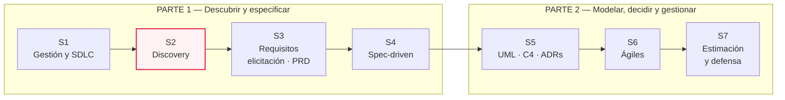
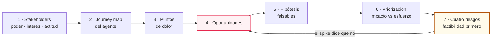
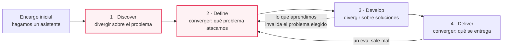
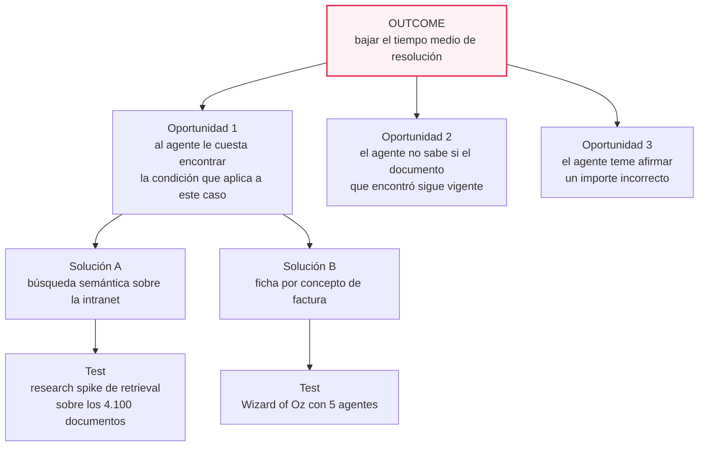
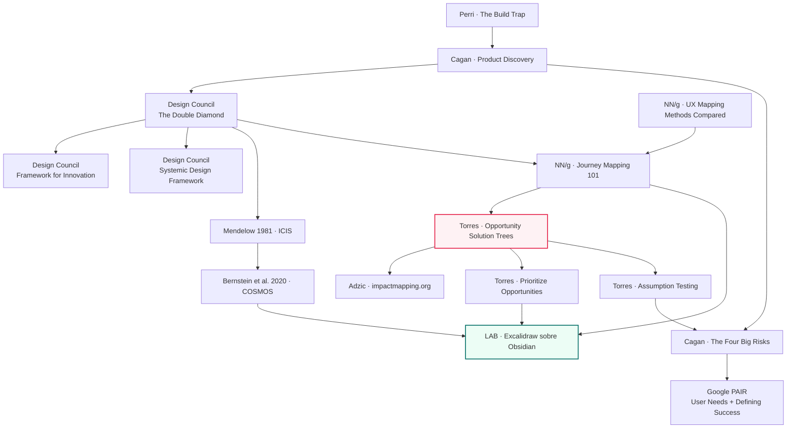

# MA·S02 — Product discovery ligero

**Módulo:** A — Ingeniería de Software para AI Engineers *(módulo extra, transversal; se dicta entre el módulo 06 y el 07)*
**Sesión:** 02 de 07 · Parte 1 — Descubrir y especificar
**Fecha:** [Completar por el profesor: fecha]
**Caso hilo conductor:** Proyecto VEGA — Nortia Energía
**Entregable:** `docs/01-discovery/` (mapa de stakeholders, journey map y oportunidades priorizadas)

**Duración estimada**

| Bloque | Tiempo |
|---|---|
| Clase presencial | 180 min |
| Setup previo (plugin de Excalidraw en Obsidian) | ~20 min |
| Lectura de los recursos imprescindibles | ~40 min |
| Lectura de los recursos recomendados | ~1 h 45 min |
| Trabajo del lab (discovery de VEGA, en equipo) | ~1 h 30 min |
| **Total de estudio fuera de clase** | **≈ 4 h 15 min** |

**Artefacto:** [La sesión en versión web](https://claude.ai/code/artifact/02c4218f-12bf-4f11-a641-3f5321a1e392) — el apunte completo como página navegable.

---

## 1. Objetivos de aprendizaje

Al terminar esta sesión vas a poder:

1. **Explicar** por qué "hagamos un chatbot" es la peor forma de empezar un proyecto, nombrar el *build trap* y detectarlo en un encargo real —incluido el de VEGA— antes de escribir una línea de código.
2. **Ubicar** en qué fase del doble diamante estás en cada momento, y decir con precisión dónde termina el discovery y dónde empieza la especificación.
3. **Construir** un mapa de stakeholders cruzando poder, interés y actitud, y derivar de él una estrategia de relación distinta para cada persona del caso.
4. **Construir** un customer journey map de un actor único, con sus fases, sus carriles de acción, pensamiento y emoción, y **marcar** los puntos de dolor distinguiéndolos de las quejas.
5. **Reescribir** un dolor como oportunidad sin colar una solución dentro, y **convertir** una oportunidad en una hipótesis falsable atada a un test concreto.
6. **Priorizar** un conjunto de oportunidades por impacto contra esfuerzo, comunicando el esfuerzo de las que dependen del comportamiento del modelo como un rango y no como un número.
7. **Distinguir** los cuatro riesgos de producto —valor, usabilidad, viabilidad de negocio y factibilidad— y **argumentar** por qué en un sistema de IA la factibilidad se ataca primero, con un test de factibilidad diseñado por vos.
8. **Producir y versionar** `docs/01-discovery/` con Excalidraw sobre Obsidian, dentro del repositorio `vega-project`.

---

## 2. Resumen ejecutivo

En **MA·S01** aprendiste el vocabulario de la gestión de proyectos y escribiste `docs/00-charter.md`: el charter de VEGA, con su sponsor, sus stakeholders, sus riesgos y —si hiciste el desafío— su apartado de "qué no sabemos todavía". Esta sesión abre exactamente ese apartado.

El punto de partida es incómodo: la Dirección de Nortia **ya dijo la solución**. Aprobó presupuesto para "un asistente interno" y no definió nada más. Eso no es un encargo, es un salto a la solución, y tiene nombre propio en la industria: *build trap*. El trabajo de hoy es meter una cuña entre el problema y la solución antes de que sea tarde, y esa cuña se llama **product discovery**.

La sesión es una cadena de transformaciones. Primero mapeás **quién tiene poder e interés** en el proyecto y —crítico— **con qué actitud**, porque Iván Ferreras tiene interés altísimo y una actitud hostil que no declara. Después reconstruís el **recorrido real** de un agente de atención resolviendo un contacto de "no entiendo mi factura", que es el 23 % de los contactos de Nortia, y marcás dónde duele. Cada dolor se reescribe como **oportunidad**, cada oportunidad se convierte en una **hipótesis falsable**, y el conjunto se ordena por **impacto contra esfuerzo**.

El cierre es lo que hace que esto sea AI Engineering y no un curso genérico de product management: los **cuatro riesgos de producto** de Marty Cagan, con la vuelta de tuerca de que en un sistema de IA el riesgo de factibilidad deja de ser el último y pasa a ser el primero. Hasta que no sabés si el modelo puede responder sobre una factura sin inventarse el importe, no sabés qué producto tenés.

### Dónde estás dentro del bloque



Cada sesión produce una pieza del mismo expediente. La de hoy produce `docs/01-discovery/`, que es literalmente el insumo de MA·S03: los requisitos no salen del aire, salen de las oportunidades que priorices hoy.

> 📝 **Nota para el profesor:** este roadmap es el de §6.2 del plan del módulo. El póster del bloque (`s1-visuales/00-roadmap-bloque.svg`) que §6.1 propone proyectar al arrancar cada sesión no está en el repo. [Completar por el profesor: indicar dónde viven `s1-visuales/00-roadmap-bloque.svg` y `s1-visuales-mermaid.md`, o regenerarlos.]

---

## 3. Conceptos clave / glosario

> Los términos de MA·S01 —proyecto, sponsor, stakeholder, Product Owner, agenda oculta, PoC, piloto, producción, riesgo— se dan por sabidos y no se repiten acá. Si alguno se te borró, está en el glosario de esa sesión.

### Discovery y el salto a la solución

| Término | Definición |
|---|---|
| **Product discovery** | El trabajo de averiguar **qué construir** antes de construirlo: explorar el problema, validar que existe, y descartar las soluciones que no funcionan cuando descartarlas todavía es barato. No es documentar: es reducir incertidumbre. |
| **Delivery** | El trabajo de **construir y entregar** lo que discovery ya validó. Es la mitad predecible del proceso; discovery es la que no lo es. |
| **Build trap** | La trampa en la que cae una organización que mide su éxito por la **cantidad de features entregadas** en vez de por el valor que producen. Se planifica a partir de ideas de dirección, no de problemas validados. *Analogía:* medir la salud de una cocina por cuántos platos salen, sin mirar cuántos vuelven sin tocar. |
| **Output** | Lo que el equipo produce: features, pantallas, endpoints. Es fácil de contar y por eso es fácil de premiar. |
| **Outcome** | El cambio de comportamiento o de resultado que ese output produce en el mundo: que el agente resuelva el contacto en menos tiempo. Es lo que importa y lo que cuesta medir. |
| **Reframe** | Reformular el problema en otros términos antes de resolverlo. Pasar de "los agentes tardan mucho" a "el 60 % del tiempo del agente se va buscando en 4.100 documentos" es un reframe: el segundo enunciado se puede atacar, el primero no. |

### Doble diamante

| Término | Definición |
|---|---|
| **Doble diamante** | Modelo del proceso de diseño e innovación en cuatro fases, organizadas como dos rombos: el primero trabaja sobre el **problema**, el segundo sobre la **solución**. Cada rombo abre (diverge) y después cierra (converge). |
| **Divergencia** | Fase de apertura: generar muchas opciones sin juzgarlas todavía. La regla es cantidad antes que calidad. |
| **Convergencia** | Fase de cierre: elegir, descartar y comprometerse con una opción. Un proceso que solo diverge no produce nada. |
| **Discover / Define / Develop / Deliver** | Las cuatro fases: descubrir el problema real, definir cuál de todos vas a atacar, desarrollar soluciones candidatas, entregar la que funciona. |
| **Bucle de aprendizaje** | La vuelta atrás desde una fase posterior a una anterior cuando lo que aprendiste invalida lo que habías definido. No es un fallo del proceso: es el proceso. |

### Stakeholders

| Término | Definición |
|---|---|
| **Mapa de stakeholders** | Instrumento que ubica a cada persona afectada por el proyecto según cuánto puede influir en él y cuánto le importa, para decidir cómo relacionarse con cada una. No es un organigrama ni un directorio. |
| **Poder** | La capacidad de esa persona de **afectar el destino del proyecto**: aprobar presupuesto, bloquear un acceso, vetar por cumplimiento, negarse a adoptar. Es capacidad real, no jerarquía formal. |
| **Interés** | Cuánto le **importa** a esa persona lo que pase con el proyecto, para bien o para mal. Alto interés no significa entusiasmo: el opositor más peligroso tiene interés máximo. |
| **Actitud** | El tercer eje: si esa persona está **a favor, es neutral o está en contra**. Es lo que separa a un aliado de un opositor que, sin este eje, caerían en el mismo cuadrante de la matriz. |
| **Opositor encubierto** | Stakeholder cuya actitud real es contraria al proyecto pero que no lo declara, porque el motivo no es presentable en una reunión. Se detecta por sus incentivos, no por lo que dice. |

### Journey map y dolores

| Término | Definición |
|---|---|
| **Customer journey map** | Visualización del proceso que una persona recorre para alcanzar un objetivo, fase por fase, con lo que hace, lo que piensa y lo que siente en cada una. *Analogía:* la película del recorrido, no la foto del usuario. |
| **Actor** | La **única** persona cuyo punto de vista mapea el journey. Un mapa, un actor: si mezclás dos, el mapa deja de servir para decidir. |
| **Escenario** | La situación concreta y el objetivo que el actor persigue en ese recorrido: "resolver un contacto de *no entiendo mi factura* en el primer contacto". |
| **Fase** | Cada etapa del recorrido, nombrada desde lo que hace el actor, no desde lo que hace el sistema. |
| **Carril (swimlane)** | Cada fila del mapa: acciones, pensamientos y emociones. Se leen en vertical (qué pasa en esta fase) y en horizontal (cómo evoluciona esto a lo largo del recorrido). |
| **Curva emocional** | La línea que dibuja el estado de ánimo del actor a lo largo de las fases. Sus valles son la lista de candidatos a punto de dolor. |
| **Punto de dolor (pain point)** | Una fricción concreta del recorrido que **le cuesta algo al actor** —tiempo, errores, carga mental— y que ocurre con frecuencia suficiente para importar. Distinto de una queja, que es una opinión sin coste medido. |
| **Touchpoint** | El punto concreto de contacto entre el actor y el sistema, el documento o la persona: la pantalla del CRM, el buscador de la intranet, la llamada. |
| **Empathy map** | Mapa de lo que se sabe de un **tipo** de usuario (qué dice, piensa, hace y siente), sin recorrido y sin orden temporal. Se usa antes del journey, para consolidar lo que ya sabés. |
| **Experience map** | El mismo recorrido que un journey map pero de una persona genérica y **sin un producto concreto de por medio**: sirve para entender un comportamiento humano general. |
| **Service blueprint** | Extensión del journey que agrega **lo que pasa detrás del escenario**: personas, sistemas y procesos internos que sostienen cada touchpoint. Es el antecedente directo del diagrama de secuencia de MA·S05. |

### De la oportunidad a la hipótesis

| Término | Definición |
|---|---|
| **Oportunidad** | Una necesidad no cubierta, un dolor o un deseo del usuario. Se escribe en el lenguaje del problema; en cuanto nombra una tecnología, dejó de ser una oportunidad y pasó a ser una solución. |
| **Árbol de oportunidades** *(opportunity solution tree)* | Estructura de cuatro niveles que ordena el discovery: en la raíz el **outcome** de negocio, debajo las **oportunidades**, debajo las **soluciones** candidatas, y en la base los **tests de supuestos**. Deja ver de un vistazo qué problema está atacando cada idea. |
| **Supuesto (assumption)** | Una creencia que puede ser cierta o no, y de la que depende que tu idea funcione. Todo el mundo tiene decenas; el discovery consiste en encontrar los que son a la vez importantes y desconocidos. |
| **Hipótesis falsable** | Un supuesto convertido en una afirmación que **podría ser refutada por un resultado concreto que definís de antemano**. Si no podés describir qué resultado te haría abandonarla, no es una hipótesis. |
| **Assumption test** | El experimento barato que decide si el supuesto se sostiene: un prototipo, una encuesta de una pregunta, minar los datos que ya tenés o un research spike. |
| **Research spike** | Trabajo técnico acotado en tiempo cuyo entregable es **una decisión, no código**: "en tres días sabemos si el retrieval funciona sobre los 4.100 documentos". Vuelve en MA·S06 como el spike del dual-track. |
| **Wizard of Oz** | Prototipo en el que la parte automatizada la hace **una persona a escondidas**, para medir si el resultado le sirve al usuario antes de construir el sistema que lo produciría. |
| **Impact mapping** | Técnica de planificación colaborativa que cuelga de un **objetivo** los **actores** que pueden ayudar u obstaculizar, los **cambios de comportamiento** (impactos) que harían falta, y recién al final los **entregables** que podrían provocarlos. |

### Priorización y riesgos

| Término | Definición |
|---|---|
| **Matriz impacto/esfuerzo** | Cuadrícula 2×2 que cruza cuánto valor produce una oportunidad con cuánto cuesta atacarla. Sirve para ordenar una conversación, no para calcular una respuesta. |
| **Quick win** | Alto impacto y bajo esfuerzo: el cuadrante por el que se empieza. Ojo, porque todo el mundo cree que su idea vive ahí. |
| **Riesgo de valor** | Que los usuarios no lo elijan usar aunque funcione perfecto. |
| **Riesgo de usabilidad** | Que los usuarios no consigan entender cómo usarlo. |
| **Riesgo de factibilidad** | Que el equipo no pueda construirlo con el tiempo, las capacidades y la tecnología que tiene. En IA es el riesgo dominante. |
| **Riesgo de viabilidad de negocio** | Que la solución no funcione para el resto de la organización: legal, cumplimiento, coste, marca, operaciones, ventas. |
| **Automatizar vs aumentar** | Las dos formas de aplicar IA a una tarea: **automatizar** (el sistema la hace en lugar de la persona) o **aumentar** (el sistema hace a la persona más capaz de hacerla). Es una decisión de diseño con consecuencias políticas, no un detalle técnico. |
| **Reward function** | Lo que el sistema optimiza, y por tanto lo que decide qué error prefiere cometer. Definirla obliga a decidir de antemano qué duele más: equivocarse afirmando algo falso o no contestar. |
| **Falso positivo / falso negativo** | El sistema afirma algo que no es cierto / el sistema deja pasar algo que sí lo era. Casi nunca cuestan lo mismo, y el que cuesta más es el que manda en el diseño. |
| **Precision / recall** | Dos formas de medir aciertos: **precision** es qué proporción de lo que el sistema devolvió era correcto; **recall**, qué proporción de lo correcto llegó a devolver. Subir uno suele bajar el otro, y elegir el punto de corte es una decisión de producto. |

---

## 4. Notas de estudio por subtema

### El diagrama ancla: la cadena de discovery de la sesión

Todo lo de hoy es una sola cadena. Cada eslabón consume la salida del anterior, y si uno se rompe, lo que sale al final no sirve: unas oportunidades priorizadas sin journey map detrás son opiniones ordenadas.



El eslabón resaltado en rojo es donde se decide si la sesión sirvió: **la calidad de tus oportunidades es el techo de calidad de todo lo que venga después**, incluidos los requisitos de MA·S03. La flecha de vuelta desde los riesgos no es decorativa: si el test de factibilidad dice que no, volvés al espacio de oportunidades, no al de soluciones.

---

### Subtema 1 · El salto a la solución y el build trap

**El encargo de VEGA está mal formulado y hay que decirlo en voz alta.** "La Dirección ha aprobado un presupuesto para construir VEGA, un asistente interno que ayude a los agentes a resolver contactos más rápido. No ha definido nada más que eso." Ahí hay una solución (un asistente), un beneficio vago ("más rápido") y cero problema descrito. Es un **output aprobado antes de que exista un outcome**.

Melissa Perri, en el post donde acuñó el término, describe el ciclo del ***build trap***: una empresa que ya encontró tracción contrata desarrolladores, siente la presión de demostrar que esa gente produce, y empieza a planificar features a partir de ideas de dirección en vez de a partir de problemas validados. Su diagnóstico:

> "When we immediately jump into build mode, we don't have much information on how our customers will respond to these products."

Y el remate, que resume la sesión entera:

> "Building is the easy part of the product development process. Figuring out what to build and how we are going to build it is the hard part."

Esto es más cierto hoy que cuando se escribió, y por una razón que te toca directamente: **con un agente de código, construir es todavía más barato**. Si lo caro es decidir qué construir y lo barato es construirlo, todo el valor que agregás como AI Engineer se desplaza hacia la izquierda del proceso. Un equipo que genera cinco features equivocadas por sprint en vez de una no mejoró: empeoró más rápido.

#### El nombre profesional de lo que vas a hacer

Marty Cagan, en *Product Discovery* (Silicon Valley Product Group, 24 de septiembre de 2007), renombró la vieja fase de "requirements and design" como **product discovery**, y le cambió el propósito: su función no es documentar, es **evitar que ingeniería queme ciclos construyendo lo equivocado**. De ahí sale la separación que estructura este bloque:

| | Discovery | Delivery |
|---|---|---|
| **Qué produce** | Conocimiento y decisiones | Software en producción |
| **Cómo avanza** | Exploratorio, iterativo, con callejones sin salida | Ejecución planificable |
| **Se puede estimar** | Mal: *"the discovery process just isn't predictable"* | Razonablemente |
| **Qué es el fracaso** | Descubrir tarde que la idea no servía | Entregar tarde o roto |

Cagan explica también **por qué las organizaciones se lo saltan**, y es una explicación económica, no de ignorancia: como el discovery no es predecible, tener a los ingenieros esperando parece un desperdicio caro, así que se los manda a construir algo. Cualquier cosa. Ese razonamiento es exactamente el que vas a escuchar en tu primer trabajo.

> 💡 **La objeción que te van a hacer y cómo se responde.** *"¿Y mientras hacés discovery, los devs qué hacen?"* La respuesta no es "esperar": es que discovery y delivery **corren en paralelo**, con el discovery una o dos iteraciones por delante. El equipo construye lo que ya se validó mientras se valida lo siguiente. Eso tiene nombre —**dual-track**— y se ve en MA·S06; hoy alcanza con que sepas que la pregunta tiene respuesta.

> ⚠️ **Gotcha.** Discovery no es "hacer una reunión de brainstorming antes de programar". Un discovery que no descarta nada no fue discovery: fue una ceremonia. Si al terminar hoy tu equipo tiene exactamente la idea con la que entró y ninguna idea muerta, revisá el proceso.

📖 [Melissa Perri — The Build Trap](https://melissaperri.com/blog/2014/08/05/the-build-trap) · [Marty Cagan — Product Discovery](https://www.svpg.com/product-discovery/)

---

### Subtema 2 · El doble diamante

El **doble diamante** es el modelo de referencia del proceso de diseño e innovación, y lo publicó el **Design Council**, que lo lanzó en 2004. El propio Design Council lo describe como *"a visual representation of the design and innovation process that describes the steps taken in any design and innovation project, regardless of methods and tools used"*: es decir, no te dice qué técnicas usar, te dice en qué momento del razonamiento estás.

Las **cuatro fases que nombra el Design Council** son Discover, Define, Develop y Deliver, agrupadas en dos rombos. La forma de rombo no es adorno: cada uno **abre y después cierra**.



Los dos nodos resaltados son **los que trabajás hoy**: la sesión cubre *Discover* entero y arranca *Define*.

**El primer diamante no habla de la solución.** Ésa es la disciplina difícil y la que la clase va a romper cada quince minutos. Durante *Discover* y *Define* no se decide si VEGA es un RAG, un buscador semántico o una ficha explicativa: se decide **qué problema de Nortia vale la pena resolver**.

#### El doble diamante no es una cascada bonita

El propio Design Council amplió el modelo en el **Framework for Innovation**, y lo que agrega es justo lo que el dibujo de los dos rombos no muestra:

- **Cuatro principios de diseño:** *put people first*, *communicate visually and inclusively*, *collaborate and co-create*, *iterate repeatedly*.
- Un **banco de métodos** organizado en tres grupos: Explore, Shape y Build.
- **Bucles de aprendizaje**: el equipo vuelve a fases anteriores y las ideas nunca están "terminadas".

Ese último punto conecta directo con lo que viste en MA·S01 sobre el **ciclo de vida experimental** de un proyecto de IA. En VEGA vas a volver de *Develop* a *Define* la primera vez que un eval salga mal y descubras que el problema no era encontrar el documento, sino saber si el documento sigue vigente. Por eso el diagrama de arriba tiene flechas hacia atrás.

La evolución más reciente del modelo, el **Systemic Design Framework** del Design Council, *"keeps the core premise of the Double Diamond"* —divergencia y convergencia— pero renombra las fases a **Explore, Reframe, Create y Catalyse** y expande el proceso para abarcar las *invisible activities* que lo rodean: orientación y visión, conexiones y relaciones, liderazgo y storytelling, continuidad. También define cuatro roles necesarios en el equipo: Systems Thinker, Connector and Convener, Designer and Maker, y Leader and Storyteller.

Dos cosas de ahí valen para hoy aunque el marco completo sea opcional:

1. **El *Reframe* como fase con nombre propio** es exactamente lo que practicás cuando convertís "los agentes tardan mucho" en "el 60 % del tiempo del agente se va en buscar en 4.100 documentos".
2. Los roles de **Connector and Convener** y **Leader and Storyteller** son el argumento contra la idea de que el mapa de stakeholders es burocracia. Convocar a la gente correcta y contar la historia del proyecto son trabajo de diseño, no trabajo administrativo.

📖 [Design Council — The Double Diamond](https://www.designcouncil.org.uk/our-resources/the-double-diamond/) · [Design Council — Framework for Innovation](https://www.designcouncil.org.uk/our-resources/framework-for-innovation/) · [Design Council — Systemic Design Framework](https://www.designcouncil.org.uk/our-resources/systemic-design-framework/)

---

### Subtema 3 · Mapa de stakeholders: poder, interés y actitud

En MA·S01 **nombraste** a los stakeholders de VEGA. Hoy los **posicionás**, que es otra cosa: nombrar es hacer una lista, posicionar es decidir cuánto tiempo le vas a dedicar a cada uno y de qué manera.

La matriz **poder/interés** se remonta al trabajo de **Mendelow (1981)** sobre análisis de stakeholders, presentado en las actas de la 2nd International Conference on Information Systems. Su lectura estándar cruza dos preguntas y da cuatro estrategias de relación:

| | **Interés bajo** | **Interés alto** |
|---|---|---|
| **Poder alto** | **Mantener satisfecho.** No lo aburras con detalle, pero no lo sorprendas nunca. Si se entera tarde de algo que le afecta, se convierte en un bloqueo | **Gestionar de cerca.** Involucrarlo en las decisiones, no solo informarlo. Es donde va la mayor parte de tu tiempo de gestión |
| **Poder bajo** | **Monitorizar.** Esfuerzo mínimo, revisión periódica: la posición de la gente cambia | **Mantener informado.** Tiene poco poder formal y le importa mucho: es tu mejor fuente de información y, mal gestionado, tu peor rumor |

#### El tercer eje: la actitud

La matriz de dos ejes tiene un agujero grande: **un aliado entusiasta y un opositor decidido caen en el mismo cuadrante**, porque los dos tienen mucho interés. La tercera dimensión que lo arregla es la **actitud**, que añadieron Murray-Webster y Simon (*Making Sense of Stakeholder Mapping*, PM World Today, 2006), citados en Bernstein, Weiss y Curry (2020): *"Murray-Webster and Simon add a third dimension, that of attitude, to the power-interest grid"*.

En este bloque la operacionalizamos con tres valores: **partidario**, **neutral** y **opositor** —y el opositor puede ser declarado o **encubierto**, que es el caso interesante.

#### VEGA, posicionado

Ésta es una lectura posible del caso a partir de lo que el enunciado dice y de lo que cada uno calla:

| Stakeholder | Poder | Interés | Actitud | Por qué, y qué hacés con eso |
|---|---|---|---|---|
| **Marta Sedano** · Dir. Operaciones | Alto | Alto | Partidaria | Es la impulsora y su bonus depende del coste por contacto. Gestionar de cerca. **Riesgo:** su métrica personal puede empujar hacia automatizar en vez de aumentar |
| **Iván Ferreras** · Resp. Atención al Cliente | Medio | Alto | **Opositor encubierto** | Dice que le preocupa la valoración de sus agentes; teme que esto sea el paso previo a recortar plantilla. Sin el eje de actitud, cae al lado de Marta y el mapa miente |
| **Cristina Roa** · Asesora jurídica / DPO | Alto (**de veto**) | Medio | Neutral condicional | Su poder no es de impulso: es de **freno**. No sabe si el sistema entra en el AI Act, y esa incertidumbre es un riesgo de viabilidad de negocio |
| **Diego Amat** · IT Manager | Alto (**de veto técnico**) | Bajo-medio | Opositor blando | No quiere que nada toque el CRM de producción y su equipo está saturado. Su "no" no es ideológico: es de capacidad |
| **Agentes de atención** (42) | Bajo formal, **decisivo real** | Alto | Desconocida | Son los usuarios finales y **nadie les preguntó nada**. Su poder no aparece en el organigrama: aparece el día que deciden no usar el sistema |

**Lo que hay que llevarse de esta tabla:** los dos stakeholders con más capacidad de matar el proyecto —Diego y Cristina— tienen poder de **veto**, no de impulso. El poder de veto es asimétrico: no necesita ganar una discusión, le alcanza con no responder un correo. Y el grupo con poder real más subestimado son los 42 agentes, cuyo veto se ejerce sin reunión ninguna.

> ⚠️ **Tres gotchas del mapa de stakeholders.**
> 1. **No es un organigrama.** El poder que importa es el real: quien puede parar el proyecto, aunque esté tres niveles más abajo.
> 2. **La posición no es permanente.** Iván puede pasar de opositor encubierto a partidario si el diseño resuelve su miedo. El mapa es una foto, y hay que volver a sacarla.
> 3. **Interés alto no es entusiasmo.** Confundir los dos es lo que hace que un proyecto se entere en la semana 10 de que alguien llevaba desde la semana 1 en contra.

> 💡 Este mapa no es un documento de archivo: es una **lista de a quién entrevistar y qué preguntarle** en MA·S03, cuando cada uno de estos cuatro se siente enfrente a contarte lo que quiere y a callarse lo que quiere de verdad.

> 📝 **Nota para el profesor:** el material asume que en MA·S01 los stakeholders se **identificaron por nombre** en el charter y que hoy se los **posiciona** por primera vez en una matriz. Si en MA·S01 ya construiste la matriz como entregable, recortá la parte de identificación y usá el tiempo ganado en el eje de actitud, que es el que cambia el resultado. La tabla de arriba es la versión resuelta; §6.5 del plan sugiere proyectarla **con huecos** —los cinco stakeholders sin colocar— y que sea la clase la que los ubique.

📖 [Mendelow (1981) — Environmental Scanning: The Impact of the Stakeholder Concept](https://aisel.aisnet.org/icis1981/20/) · [Bernstein, Weiss y Curry (2020) — COSMOS](https://pmc.ncbi.nlm.nih.gov/articles/PMC7427961/)

---

### Subtema 4 · Customer journey map y puntos de dolor

Un **journey map** es, según Sarah Gibbons (Nielsen Norman Group, 2018), *"a visualization of the process that a person goes through in order to accomplish a goal"*. NN/g desglosa cinco componentes:

1. **Actor** — una sola persona, un solo punto de vista.
2. **Escenario y expectativas** — la situación concreta y qué espera conseguir.
3. **Fases del recorrido** — las etapas en las que se divide.
4. **Acciones, pensamientos y emociones** — los tres carriles, fase por fase.
5. **Oportunidades** — qué se puede hacer al respecto, **y quién es el responsable interno**.

Los puntos de dolor emergen de visualizar *"moments of both frustration and delight throughout a series of interactions"*: no se listan de memoria, se **leen** del mapa.

> ⚠️ **La regla que más se rompe: un journey map, un actor.** En VEGA el actor **es el agente de atención**, no el cliente residencial que llama. Si mezclás los dos recorridos en un mapa, obtenés algo que parece completo y no sirve para decidir nada, porque cada dolor pertenece a una persona distinta con incentivos distintos. Si querés el mapa del cliente, hacé otro mapa.

#### Cómo se construye, paso a paso

Ésta es la mecánica que vas a ejecutar en Excalidraw:

1. **Fijá el actor y el escenario, por escrito, arriba del mapa.** Una línea cada uno. Si no podés escribirlos, no empieces a dibujar.
2. **Listá las fases desde lo que hace el actor**, no desde lo que hace el sistema. "Consultar la base de conocimiento" es una fase; "el sistema devuelve resultados" no lo es, es una respuesta del sistema.
3. **Rellená el carril de acciones**: lo observable, en verbos. Qué abre, qué escribe, a quién pregunta, qué copia y pega.
4. **Rellená el carril de pensamientos**: lo que el actor se está preguntando en esa fase. Sirve en primera persona: *"¿esta tarifa sigue vigente o es la circular de marzo?"*.
5. **Rellená el carril de emoción** y dibujá la curva. No necesitás una escala fina: alcanza con cinco niveles y ser consistente.
6. **Marcá los valles de la curva** y decidí cuáles son puntos de dolor de verdad (criterio abajo).
7. **Anotá oportunidades sobre cada dolor**, con un responsable interno al lado. Sin dueño, la oportunidad se evapora.

**¿Y si no entrevistaste a nadie?** Es tu situación exacta hoy: el caso dice literalmente que a los 42 agentes *nadie les ha preguntado*. Lo que **no** se hace es fingir que sí. Lo que se hace es:

- **Marcar cada celda como observada o inferida.** Un asterisco, un color, lo que sea, pero visible. El mapa pasa a tener dos capas: lo que sabés y lo que suponés.
- **Anclar todo lo que se pueda a los datos agregados que sí existen**: 23 % de los contactos son "no entiendo mi factura", 11 minutos de tiempo medio de resolución, 60 % del tiempo del agente buscando información, 4.100 documentos en la intranet, 7 semanas hasta que un agente nuevo es autónomo, picos de 3.400 contactos tras la emisión de facturas.
- **Convertir cada inferencia en una pregunta de la entrevista de MA·S03.** El mapa inferido no es un mapa falso: es un mapa con una lista de deberes.

#### Un dolor no es una queja

| | **Queja** | **Punto de dolor** |
|---|---|---|
| **Forma** | Opinión: "la intranet es un desastre" | Fricción localizada en una fase: "el agente abre 5-6 documentos antes de encontrar la condición aplicable" |
| **Coste** | No medido | Medible en tiempo, errores o escalados |
| **Frecuencia** | Indeterminada | Se sabe cada cuánto pasa |
| **De quién** | De cualquiera | **Del actor del mapa** |
| **Se puede atacar** | No, porque no se sabe qué arreglar | Sí |

Los tres filtros operativos, entonces: **frecuencia** (¿pasa en la mayoría de los contactos o fue una anécdota?), **coste** (¿cuánto tiempo, cuántos errores, cuánta carga mental?) y **pertenencia** (¿le pasa al actor de este mapa o a otra persona?). Un dolor que no pasa los tres filtros no desaparece: se anota aparte, para no perderlo, y no compite por prioridad.

#### El journey de VEGA, resuelto

Actor: **un agente de atención al cliente de Nortia**, con seis meses de antigüedad.
Escenario: **resolver un contacto entrante de "no entiendo mi factura", por teléfono, en el primer contacto**.

| # | Fase | Acciones | Pensamientos | Emoción | Dolor |
|---|---|---|---|---|---|
| 1 | **Recepción del contacto** | Atiende, saluda, escucha el motivo | *"A ver qué toca"* | 😐 Neutral | — |
| 2 | **Identificación del cliente en el CRM** | Pide DNI, busca en el CRM propietario, abre el contrato | *"Espero que los datos estén bien"* | 🙂 Leve fricción | Pantallas lentas y datos repartidos en varias vistas |
| 3 | **Comprensión de la pregunta** | Repregunta, mira la factura concreta, identifica el concepto que el cliente no entiende | *"¿Me está preguntando por el término fijo o por la regularización?"* | 😐 Concentración | El cliente no sabe nombrar lo que no entiende |
| 4 | **Búsqueda en la intranet** | Busca por palabras clave entre 4.100 documentos, abre varios, compara, duda de cuál está vigente, a veces pregunta a un compañero | *"Esto lo vi la semana pasada… ¿esta circular sigue vigente?"* | 😖 **Pozo emocional** | **Aquí se va el 60 % del tiempo.** Búsqueda por palabra clave sobre un corpus enorme, sin señal de vigencia, con el cliente esperando en línea |
| 5 | **Construcción de la respuesta** | Traduce el documento a lenguaje llano, arma la explicación, la contrasta mentalmente | *"¿Se lo estoy diciendo bien? Si me equivoco con un importe, esto vuelve"* | 😕 Recuperación con duda | Miedo a dar una cifra mal; sin forma de verificar rápido |
| 6 | **Cierre y tipificación** | Confirma que se entendió, se despide, tipifica el contacto en el CRM, escribe notas | *"Ya está. El siguiente"* | 🙂 Alivio con fatiga | Tipificación manual, y en días de pico se hace corriendo o mal |

**La curva emocional cae en la fase 4 y solo se recupera parcialmente en la 6.** Ése es el mapa entero en una frase, y es también el motivo por el que el 60 % del tiempo es el dato más importante del caso: no es un problema de velocidad de tecleo, es un problema de **recuperación de información con incertidumbre sobre la vigencia**.

Fijate en algo que se ve en el mapa y no se ve en el dato agregado: **el dolor de la fase 5 no es de tiempo, es de riesgo**. El agente teme afirmar un importe incorrecto. Cualquier solución que baje el tiempo de la fase 4 pero empeore la confianza de la fase 5 —por ejemplo, un sistema que responde rapidísimo y a veces se inventa la cifra— **empeora el journey aunque mejore la métrica de Marta**. Eso es lo que un journey map te hace ver y una hoja de KPIs no.

#### ¿Y esto no es un empathy map?

La pregunta aparece siempre. NN/g compara los cuatro métodos de mapeo (Sarah Gibbons, 5 de noviembre de 2017) y da el criterio:

| Método | Qué es | Cuándo lo usás |
|---|---|---|
| **Empathy map** | *"A tool used to articulate what we know about a particular type of user"* | Al principio, para consolidar lo que ya sabés de un tipo de usuario. Sin recorrido temporal |
| **Customer journey map** | *"A visualization of the process that a person goes through to accomplish a goal tied to a specific business or product"* | Cuando querés encontrar fricciones en un recorrido concreto con tu producto. **Es el de hoy** |
| **Experience map** | El mismo recorrido, de una persona genérica y sin producto de por medio | Cuando querés entender un comportamiento humano general antes de tener producto |
| **Service blueprint** | *"A visualization of relationships between service components—people, props, and processes—directly tied to touchpoints in a specific customer journey"* | Cuando ya tenés el journey y necesitás ver qué pasa **detrás** de cada touchpoint |

> 💡 Guardate el **service blueprint**: es el que separa lo que ve el usuario de lo que pasa por detrás, que es exactamente el corte entre el agente y el pipeline de RAG. En MA·S05 ese mismo corte se convierte en un **diagrama de secuencia** con líneas de vida.

> 📝 **Nota para el profesor:** el journey resuelto de arriba —las seis fases y la ubicación del pozo emocional en la búsqueda en la intranet— es la propuesta del material: el caso da los datos agregados pero no el recorrido paso a paso. Confirmalo o sustituilo por el flujo real que quieras usar; si lo cambiás, cambian también las oportunidades del ejemplo del subtema siguiente. §6.5 del plan pide **dibujarlo en vivo** en Excalidraw en vez de proyectarlo terminado: la versión de arriba está pensada como guion del profesor y como red de seguridad del alumno que estudia después, no como plantilla a copiar.

📖 [NN/g — Journey Mapping 101](https://www.nngroup.com/articles/journey-mapping-101/) · [NN/g — UX Mapping Methods Compared: A Cheat Sheet](https://www.nngroup.com/articles/ux-mapping-cheat-sheet/)

---

### Subtema 5 · De un dolor a una oportunidad, y de una oportunidad a una hipótesis falsable

#### El árbol de oportunidades

Teresa Torres organiza el discovery en un **árbol de oportunidades** de cuatro niveles:

- En la **raíz**, el *outcome* deseado: *"the business need that reflects how your team can create business value"*.
- Debajo, el **espacio de oportunidades**, donde una oportunidad es *"an unmet customer need, pain point, or desire"*.
- Debajo, las **soluciones** candidatas, que cuelgan de una oportunidad concreta y no al revés.
- En la base, los **assumption tests**.

El matiz fino: una oportunidad **no es solamente un problema a arreglar**. Incluye deseos que el producto puede satisfacer aunque no haya nada roto. Un agente puede no tener ningún problema con la tipificación y aun así desear no tener que hacerla.



Mirá el nivel 2 del árbol: **ninguna de las tres oportunidades nombra una tecnología**. Las tecnologías aparecen recién en el nivel 3, y ahí hay dos soluciones distintas compitiendo por la misma oportunidad. Ése es el trabajo que hace el árbol: te muestra que la búsqueda semántica no es *el* proyecto, es *una apuesta* contra *un* problema.

#### La reescritura: de dolor a oportunidad

Un dolor está escrito desde la observación; una oportunidad está escrita desde la necesidad. La plantilla que funciona:

> **`[el actor]` no puede / le cuesta / necesita `[algo]` cuando `[situación]`.**

Ejemplos, sobre el journey de arriba:

| Dolor observado | ❌ Mal reescrito | ✅ Oportunidad |
|---|---|---|
| Abre 5-6 documentos antes de encontrar la condición | "Buscador semántico sobre la intranet" | Al agente le cuesta encontrar la condición que aplica a un caso concreto cuando el cliente está esperando en línea |
| No sabe si la circular sigue vigente | "Metadata de vigencia en los chunks" | El agente no puede saber si el documento que encontró sigue vigente sin preguntarle a un compañero |
| Teme dar un importe mal | "Guardrail de importes" | El agente necesita poder verificar una cifra antes de decírsela al cliente, y hoy no tiene cómo hacerlo rápido |
| El agente nuevo tarda 7 semanas | "Onboarding con IA" | Un agente nuevo no sabe por dónde empezar a buscar y depende de preguntarle a los veteranos |

**La regla anti-solución, que es la que hay que memorizar:** *si tu oportunidad contiene un sustantivo de tecnología —buscador, chatbot, dashboard, embedding, agente, RAG—, es una solución disfrazada de oportunidad*. Reescribila hasta que no quede ninguno.

> ⚠️ Por qué importa tanto. Si escribís "buscador semántico" en el nivel de oportunidades, el árbol ya no puede compararla con nada —¿contra qué la comparás, contra otro buscador?— y además cerraste el espacio de soluciones antes de abrirlo. La mitad de la clase va a cometer este error hoy; el objetivo es que la otra mitad lo detecte en la revisión cruzada.

#### De oportunidad a hipótesis falsable

Torres define un **supuesto** como *"a belief that may or may not be true"*, y da **cinco categorías**: *desirability*, *viability*, *feasibility*, *usability* y *ethical*. Para volverlos comprobables, dos reglas:

1. **Formularlos en positivo** — lo que **tiene que ser cierto** para que la idea funcione, no lo que no debe pasar.
2. **Atarlos a un test concreto**, de entre cuatro métodos: **prototipo**, **encuesta de una pregunta**, **minería de los datos que ya existen** y **research spike**.

Ahora la parte que Torres no te da y que hay que entender igual: **qué hace falsable a una hipótesis**.

Un supuesto es una creencia. Una hipótesis es esa creencia escrita de forma que **podría resultar falsa por un resultado que definís antes de mirarlo**. La prueba de fuego es una sola pregunta: *¿qué resultado concreto me haría abandonar esto?* Si no tenés respuesta, no tenés hipótesis, tenés una intención.

La forma que se usa en este bloque:

> **Creemos que `[cambio]` producirá `[efecto medible]` en `[actor]`.
> Lo sabremos si `[métrica]` alcanza `[umbral]` en `[plazo]`.
> Lo abandonamos si `[resultado que la refuta]`.**

Comparalo:

| ❌ No falsable | ✅ Falsable |
|---|---|
| "Creemos que la búsqueda semántica mejorará la experiencia del agente" | "Creemos que una búsqueda semántica sobre los 4.100 documentos permitirá al agente encontrar la condición aplicable en la primera consulta. Lo sabremos si, sobre 30 contactos reales de factura, el documento correcto aparece entre los 3 primeros resultados en al menos 24 de ellos. Lo abandonamos si aparece en menos de 15" |
| "Creemos que los agentes van a adoptar VEGA" | "Creemos que los agentes usarán VEGA por decisión propia si les ahorra tiempo. Lo sabremos si, en un piloto de dos semanas sin obligación de uso, más de la mitad de los agentes lo consultan en al menos un tercio de sus contactos de factura" |

Fijate en el segundo: la parte no negociable es **"sin obligación de uso"**. Un test de valor con uso obligatorio no mide valor, mide obediencia.

> 💡 **El research spike es tu herramienta favorita como AI Engineer.** Es el test que responde una pregunta de factibilidad con un timebox y cuyo entregable es una **decisión**, no código. Reaparece en MA·S06 dentro del dual-track, y es lo que te permite decirle a un sponsor "en tres días te digo si esto es posible" en vez de "no sé".

#### Impact mapping: el puente hacia los requisitos

El **impact mapping** ataca lo mismo desde otro ángulo. Su sitio oficial lo define como *"a lightweight, collaborative planning technique for teams that want to make a big impact with software products"*, y estructura el mapa en cuatro niveles:

1. **Goals** — objetivos organizacionales.
2. **Actors** — *"group impacts by actors, personas or user categories"*.
3. **Impacts** — *"behaviour changes that would make a big impact on the users"*.
4. **Deliverables** — *"add deliverables that could support those behaviour changes"*.

Donde Torres cuelga **oportunidades** de un outcome, Adzic cuelga **cambios de comportamiento de actores** de un objetivo. Aplicado a VEGA, eso obliga a una pregunta que el árbol no hace: *¿qué tiene que hacer distinto Iván, o Diego, o el agente, para que el tiempo de resolución baje?* Y ahí aparece, sin que nadie tenga que decirlo, que **la adopción no es automática**: si el agente no cambia de comportamiento, no hay outcome por bueno que sea el sistema.

El nivel de *deliverables* es donde arrancan los requisitos, y por eso el impact map se retoma en MA·S03 y MA·S04. Referencia del libro: *Impact Mapping: Making a big impact with software products and projects*, Gojko Adzic, Provoking Thoughts, 1 de octubre de 2012, ISBN 978-0-9556836-4-0.

> 💡 **Torres y Adzic no compiten, se cruzan.** Hoy hacés el árbol; el impact map se lee como preparación de MA·S03. Y las **cinco categorías de supuesto de Torres son los cuatro riesgos de Cagan más `ethical`** —guardate ese dato, que cierra el subtema 7 y engancha con GDPR y AI Act en el módulo 08, que es donde vive la preocupación de Cristina.

📖 [Teresa Torres — Opportunity Solution Trees](https://www.producttalk.org/opportunity-solution-trees/) · [Teresa Torres — Assumption Testing](https://www.producttalk.org/2021/08/assumption-testing/) · [Impact Mapping](https://www.impactmapping.org/)

---

### Subtema 6 · Priorización: impacto contra esfuerzo

#### Se priorizan oportunidades, no soluciones

Teresa Torres (*Prioritize Opportunities, Not Solutions*, 13 de febrero de 2019) argumenta contra el reflejo de puntuar features con fórmulas, y su razón es de comparabilidad: comparar soluciones sueltas es comparar peras con manzanas, porque **resuelven problemas distintos**. Su frase: *"You aren't one or two or three features away from a better product"*.

La propuesta es comparar **oportunidades del mismo nivel del árbol** según cuatro dimensiones —**tamaño de la oportunidad** (a cuánta gente afecta y con qué frecuencia), **posición de mercado**, **alineamiento estratégico** e **importancia para el cliente**—, evaluando primero la fila superior del árbol y bajando después.

En VEGA, la dimensión de **tamaño** se puede sostener con datos reales y sin inventar nada: el **23 %** de los contactos son "no entiendo mi factura" y el **60 %** del tiempo del agente se va buscando información. Una oportunidad que vive en la fase 4 del journey afecta a casi uno de cada cuatro contactos; una que vive en la tipificación de la fase 6, a todos pero con mucho menos coste unitario. Ésa es una comparación honesta.

#### La matriz impacto/esfuerzo

Para el lab usamos el instrumento más simple que existe: una cuadrícula 2×2 que cruza **cuánto valor produce** una oportunidad con **cuánto cuesta** atacarla.

| | **Esfuerzo bajo** | **Esfuerzo alto** |
|---|---|---|
| **Impacto alto** | **Quick wins.** Se hacen primero, sin discusión | **Grandes apuestas.** Se hacen, pero de a una y con un test de factibilidad delante |
| **Impacto bajo** | **Rellenos.** Se hacen cuando sobra hueco. Nunca desplazan a un quick win | **Sumideros.** No se hacen. El valor de la matriz es poder decir esto en voz alta |

Sus cuatro trampas, que vas a pisar hoy si no las mirás:

1. **Puntuar soluciones en vez de oportunidades.** Es el error de Torres, con otra cara: si en las filas hay features, la matriz ordena apuestas y no problemas.
2. **La falsa precisión.** Un 3,7 de impacto no significa nada. La matriz sirve para producir una **conversación con argumentos**, no un número; el valor está en el desacuerdo que aflora al puntuar, no en la puntuación.
3. **El esfuerzo lo estima quien no lo va a hacer.** Si el que puntúa esfuerzo no es quien va a construirlo, todo cuesta 2.
4. **Todo termina en "quick win".** Cuando cada oportunidad es alto impacto y bajo esfuerzo, la matriz dejó de discriminar. Si te pasa, forzá el ordenamiento: obligá al equipo a ordenar de 1 a 8 sin empates.

#### Por qué el esfuerzo en IA es más incierto

Ésta es la parte específica del oficio y la razón por la que este subtema no es un calco de un curso de product management.

En software convencional, estimar esfuerzo es estimar **construcción**: sabés cómo se hace, la incertidumbre está en cuánto tarda. En un sistema de IA hay una fase previa cuya duración **no se conoce hasta que termina**, porque su output es conocimiento y no código. Hasta que no probás si el retrieval funciona sobre los 4.100 documentos de Nortia —con su mezcla de tarifas, condiciones contractuales, procedimientos regulatorios y circulares internas, algunas vigentes y otras no— **no sabés si ese ítem cuesta dos días o dos meses**. Es exactamente el ciclo experimental que viste en MA·S01: la PoC existe porque hay preguntas que solo se responden probando.

Consecuencias prácticas, y todas caben en tres reglas:

1. **Toda oportunidad cuyo esfuerzo dependa de la calidad de las respuestas del modelo se puntúa con un rango, no con un número.** "Esfuerzo 2–5" comunica la verdad; "esfuerzo 3" comunica una precisión que no tenés y que te van a recordar.
2. **Antes de estimar el rango, reducilo con un test barato.** Un **research spike** con timebox convierte "2–5" en "2" o en "no se puede", y cuesta tres días. Un **Wizard of Oz** te dice si la solución sirve antes de que sepas construirla.
3. **Separá el esfuerzo de investigación del esfuerzo de construcción** cuando los presentes. Son dos partidas con naturalezas distintas y mezclarlas es cómo se generan compromisos imposibles.

**La escala del lab.** Impacto y esfuerzo de **1 a 5**, puntuados por consenso del equipo en **30 segundos por oportunidad** —el timebox es parte del método: la discusión larga no mejora la puntuación—, con el corte de la matriz en **3**. Y la regla del rango del punto 1 para todo lo que dependa del modelo.

> 📝 **Nota para el profesor:** la escala 1–5, los 30 segundos por ítem y el corte en 3 son la propuesta del material; el plan pide 6–8 oportunidades priorizadas pero no fija cómo se puntúa. Ajustá la escala si preferís otra. Relacionado: VEGA sigue sin presupuesto ni plazo declarados, así que el eje de esfuerzo se puntúa **en relativo (1–5)** y no se traduce a euros ni a semanas; el costeo absoluto vive en MA·S07, que es donde el plan lo ubica. Si querés fijar techo de coste y fecha, esta sección se puede endurecer bastante.

📖 [Teresa Torres — Prioritize Opportunities, Not Solutions](https://www.producttalk.org/prioritize-opportunities/)

---

### Subtema 7 · Los cuatro riesgos de producto, y la factibilidad en IA

Marty Cagan (*The Four Big Risks*, Silicon Valley Product Group, 4 de diciembre de 2017) define el discovery como el trabajo de atacar **cuatro riesgos** antes de construir. En VEGA cada uno tiene además un stakeholder con nombre y apellido, lo que hace que el mapa del subtema 3 y este modelo se sostengan mutuamente:

| Riesgo | Definición de Cagan | La pregunta | Quién lo encarna en VEGA |
|---|---|---|---|
| **Valor** | *"whether customers will buy it or users will choose to use it"* | ¿Lo van a elegir usar? | **Marta Sedano** lo defiende: si nadie lo usa, el tiempo de resolución no baja |
| **Usabilidad** | *"whether users can figure out how to use it"* | ¿Van a entender cómo usarlo? | **Los 42 agentes** lo sufren, en medio de una llamada y con un cliente esperando |
| **Factibilidad** | *"whether our engineers can build what we need with the time, skills and technology we have"* | ¿Podemos construirlo? | **Diego Amat** lo bloquea: nada toca el CRM de producción y su equipo está saturado |
| **Viabilidad de negocio** | *"whether this solution also works for the various aspects of our business"* | ¿Le sirve al resto de la empresa? | **Cristina Roa** lo vigila: trazabilidad, cumplimiento, y el AI Act sin resolver |

> ⚠️ **La viabilidad de negocio no es "que sea rentable".** Es que la solución funcione para **todas** las partes de la organización: legal, cumplimiento, seguridad, finanzas, operaciones, marca. Una solución técnicamente perfecta y comercialmente atractiva que la DPO no puede aprobar es inviable, y punto.

#### La tesis de este bloque: en IA la factibilidad va primero

Acá viene el reordenamiento que da sentido a toda la sesión, y conviene ser transparente sobre su estatus: **los cuatro riesgos son de Cagan; el orden en que se atacan en un proyecto de IA es la tesis de este bloque.** No se la atribuyas a nadie en una entrevista: defendela vos con el argumento.

El argumento es éste. En software convencional, la factibilidad se suele mirar al final porque casi siempre la respuesta es "sí, se puede, la pregunta es cuánto tarda". En un sistema de IA esa suposición no vale: **la respuesta puede ser "no se puede, con estos datos"**, y ese "no" invalida el producto entero, no una feature. Mientras no sepas si el modelo puede responder sobre una factura de Nortia sin inventarse el importe, **no sabés qué producto tenés**, así que cualquier trabajo sobre valor, usabilidad o viabilidad se hace sobre un supuesto no verificado.

Hay dos apoyos concretos para llevarlo a la práctica, y los dos ya los conocés de este material:

- El **research spike** de Torres, que responde la pregunta de factibilidad con un timebox y produce una decisión.
- El **Wizard of Oz** de la People + AI Guidebook de Google, que simula la automatización con una persona detrás para medir el valor **antes** de construirla.

Y hay un tercero, que es el argumento de MA·S01: el ciclo de vida de un proyecto de IA es **experimental**, y la PoC existe precisamente como reductor de riesgo del primer ciclo. Decir "la factibilidad primero" es la misma frase que "la PoC antes que el piloto", dicha en el vocabulario de producto.

> ⚠️ **Ojo con la lectura fácil.** "Factibilidad primero" **no** significa "construyamos un prototipo técnico y después vemos si sirve a alguien". Significa testear la factibilidad **de la oportunidad priorizada**, no de la tecnología en abstracto. La secuencia correcta es: oportunidad → hipótesis → test de factibilidad barato → y recién entonces valor y usabilidad. Si arrancás por el spike sin oportunidad detrás, volviste al build trap con más pasos.

#### La parte específica de IA: la guía de Google PAIR

El capítulo *User Needs + Defining Success* de la People + AI Guidebook del equipo PAIR de Google es el único recurso de la sesión que ataca de frente el discovery **de producto con IA**. Tres ideas que se usan hoy:

**1. Cambiar la pregunta.** La guía recomienda reemplazar *"¿podemos usar IA para esto?"* por *"¿cómo podríamos resolverlo?"* y *"¿puede la IA resolverlo de forma única?"*. Es el antídoto contra el encargo de Nortia, formulado como método. Y el remate: *"even the best AI will fail if it doesn't provide unique value to users"*.

**2. Automatizar vs aumentar.** El criterio es directo: **automatizar** lo repetitivo y tedioso, **aumentar** lo que la persona valora o de lo que se siente responsable. Aplicado al journey:

| Fase del journey | ¿Automatizar o aumentar? | Por qué |
|---|---|---|
| 4 · Búsqueda en la intranet | **Automatizar** | Es repetitivo y tedioso, y nadie se siente orgulloso de buscar por palabras clave |
| 5 · Construcción de la respuesta | **Aumentar** | El agente se siente responsable de lo que le dice al cliente. Quitarle eso le quita el control sobre un riesgo que sigue siendo suyo |
| 6 · Tipificación | **Automatizar**, con revisión | Repetitivo, y en días de pico se hace mal |

Y acá está la respuesta técnica al miedo de Iván Ferreras: **VEGA aumenta al agente, no lo reemplaza**. Eso no es una frase para tranquilizarlo en una reunión: es una **decisión de diseño que se toma en discovery**, se escribe en el documento, se traduce en requisitos en MA·S03 y se puede auditar después. La diferencia entre las dos cosas es lo que separa a un ingeniero de un comercial.

**3. Diseñar la reward function.** Definir qué optimiza el sistema obliga a decidir de antemano el **coste asimétrico** de los dos tipos de error. En VEGA la asimetría es brutal:

- **Falso positivo:** VEGA afirma un importe o una condición que no es cierta, el agente se lo dice al cliente, y el error sale de Nortia hacia afuera. Coste alto, con consecuencias regulatorias potenciales.
- **Falso negativo:** VEGA no encuentra la respuesta y dice que no sabe. El agente hace lo que hace hoy: buscar a mano. Coste: unos minutos.

Con esa asimetría, la elección está clara: **VEGA tiene que preferir callarse antes que inventar**, y eso se traduce en un umbral de confianza alto —más precision, menos recall— y en una respuesta de "no encontrado" que es un comportamiento de primera clase, no un error. Ese criterio se convierte literalmente en un criterio de aceptación en MA·S03 y en un eval en el módulo 08.

📖 [Marty Cagan — The Four Big Risks](https://www.svpg.com/four-big-risks/) · [Google PAIR — People + AI Guidebook: User Needs + Defining Success](https://pair.withgoogle.com/chapter/user-needs/)

---

### Subtema 8 · Dónde termina el discovery y empieza la especificación

El corte es una decisión curricular de este bloque y conviene tenerlo explícito, porque en la vida real la línea es borrosa y todo el mundo la pone en otro lado.

**Hoy salís con:** el mapa de stakeholders posicionado, el journey map con los dolores marcados, entre 6 y 8 oportunidades bien redactadas y priorizadas, y al menos una hipótesis falsable con su test para las que quedaron arriba.

**Hoy no salís con:** requisitos, user stories, NFR, criterios de aceptación ni nada que se parezca a una especificación. Si escribiste "el sistema debe devolver resultados en menos de 2 segundos", te fuiste de sesión: eso es MA·S03.

En términos del doble diamante: hoy cubrís **Discover** entero y arrancás **Define**; MA·S03 cierra *Define* con la elicitación y el PRD. El criterio práctico para saber de qué lado de la línea estás es una sola pregunta:

> **¿Esto que estoy escribiendo describe el problema o describe lo que el sistema tiene que hacer?**
> Lo primero es discovery. Lo segundo es especificación, y todavía no toca.

Y la razón por la que el corte importa: **una especificación escrita antes de tiempo es difícil de tirar**. Cuanto más detallado esté el documento, más cuesta emocionalmente abandonarlo cuando el discovery dice que el problema era otro. Por eso hoy se dibuja en Excalidraw, que es deliberadamente feo y fácil de borrar, y no en un documento formal.

---

### Cómo se relacionan los recursos de la sesión

Ninguno de estos recursos necesita a otro para entenderse, pero este orden es el que hace que se sumen: el argumento va de "por qué no saltar a la solución" a "qué hacer en su lugar" y termina en lo que tenés que producir.



**Torres · Opportunity Solution Trees** está resaltado en rojo porque es el pivote de la sesión: es la máquina que convierte la salida del journey map en la entrada de la priorización. **El lab** en verde porque es lo único que tenés que *hacer*, no solo leer.

Cuatro relaciones que el diagrama no alcanza a expresar:

- **Los dos artículos de Cagan son el mismo argumento a diez años de distancia.** *Product Discovery* (2007) dice que hay que descubrir antes de construir; *The Four Big Risks* (2017) dice **qué** hay que descubrir exactamente. Si leés uno solo, que sea el segundo: es más corto y más operativo.
- **Torres y Adzic no compiten, se cruzan.** El árbol organiza por *outcome → oportunidad*; el impact map por *goal → actor → cambio de comportamiento*. Hacé el árbol hoy y dejá el impact map como lectura para MA·S03, porque su nivel de *deliverables* es donde arrancan los requisitos.
- **Mendelow y COSMOS son una cadena de atribución, no dos lecturas.** El paper de 1981 es la referencia de la matriz; el artículo de 2020 es lo que sostiene el tercer eje de actitud. Para el lab te alcanza con saber que la matriz tiene autor.
- **PAIR es el único que habla de IA.** Todo lo demás es discovery de producto genérico y excelente. Si no hacés vos el traslado a tu caso en cada subtema, te llevás una clase de product management sin AI Engineering.

---

## 5. Guía práctica: el discovery de VEGA en Excalidraw

### Prerequisitos

- **Obsidian instalado** y apuntado a una bóveda que contenga el repositorio `vega-project`.
- El repo **`vega-project` de MA·S01**, con `docs/00-charter.md` dentro.
- Haber leído el §2 del caso VEGA, incluidas las agendas ocultas de los cinco stakeholders.
- Estar en tu equipo.

> ⚠️ **Hacé el paso 1 antes de la clase.** Veinte minutos de instalación al principio del lab se comen el ejercicio.

### Paso 0 · Equipos

Se mantienen **los mismos equipos de MA·S01** durante todo el bloque. El expediente `vega-project` es acumulativo: cambiar de equipo a mitad rompe la continuidad de los siete artefactos y de la defensa de MA·S07.

> 📝 **Nota para el profesor:** equipos fijos durante todo el módulo A es la propuesta del material. Si querés rotarlos, conviene hacerlo en un corte de fase y no a mitad del expediente.

### Paso 1 · Instalar el plugin de Excalidraw en Obsidian

No hay comando de shell: es por interfaz.

```
Obsidian → Settings → Community plugins → Turn on community plugins
        → Browse → buscar "Excalidraw" → Install → Enable
```

Después, `Ctrl/Cmd+P` → `Excalidraw: Create new drawing`.

**Cómo verificás que funcionó:** se abre un lienzo en blanco y, en el explorador de archivos de Obsidian, aparece un archivo nuevo con extensión `.excalidraw.md`. Abrilo con un editor de texto: **es Markdown normal**. Desde la versión 1.2.0 del plugin, los dibujos se guardan en archivos Markdown —frontmatter YAML con metadatos y tags, los datos del dibujo en JSON y los elementos de texto como markdown—, y por eso entran en Git y se diffean como cualquier otra nota.

> 💡 **Por qué Excalidraw y no otra cosa.** La regla del bloque: si un diagrama tiene que sobrevivir **al proyecto**, es Mermaid; si tiene que sobrevivir **a la reunión**, es Excalidraw; si tiene que ir en un PDF con logo, es draw.io. El discovery es lo más efímero que vas a producir: querés una herramienta fea y rápida que invite a borrar. Nadie se enamora de un boceto feo, y hoy enamorarse es el riesgo.

### Paso 2 · Crear la carpeta del entregable

```bash
cd vega-project
mkdir -p docs/01-discovery
```

- `cd vega-project` — el repo que creaste en MA·S01, que ya contiene `docs/00-charter.md`.
- `mkdir -p docs/01-discovery` — `-p` no falla si la carpeta ya existe (la creaste en MA·S01 al armar el árbol del expediente).

Al terminar la sesión, la carpeta tiene que verse así:

```
docs/01-discovery/
├── mapa-stakeholders.excalidraw.md
├── journey-agente-factura.excalidraw.md
└── oportunidades.md          # las 6-8 oportunidades, priorizadas
```

**Cómo verificás:** `ls docs/01-discovery` muestra los tres archivos.

### Paso 3 · El mapa de stakeholders (≈20 min)

En un dibujo nuevo llamado `mapa-stakeholders`:

1. Dibujá los **dos ejes**: poder (vertical) e interés (horizontal). Etiquetá los cuatro cuadrantes con su estrategia: gestionar de cerca, mantener satisfecho, mantener informado, monitorizar.
2. Colocá a los **cinco stakeholders** del caso. Discutan cada colocación: el desacuerdo es el ejercicio.
3. Codificá la **actitud** con color, no con una tercera dimensión geométrica: verde partidario, gris neutral, rojo opositor, y **borde punteado si la oposición es encubierta**.
4. Al lado de cada uno, una línea con **la estrategia concreta**: qué le vas a contar, cada cuánto y en qué formato.
5. Marcá con un signo de interrogación a quien tenga la **actitud desconocida** — y fijate a cuánta gente le pasa.

**Sabés que está bien cuando:** dos stakeholders que caen en el mismo cuadrante tienen colores distintos, y podés explicar por qué la estrategia para cada uno es diferente.

### Paso 4 · El journey map (≈35 min)

En un dibujo nuevo llamado `journey-agente-factura`:

1. Escribí **arriba del todo**, en texto: `Actor:` y `Escenario:`. Una línea cada uno.
2. Dibujá la **grilla**: las fases en columnas, y tres filas para acciones, pensamientos y emoción.
3. Rellená columna por columna, de izquierda a derecha. **No saltes a la fila de emoción antes de tener las acciones.**
4. Dibujá la **curva emocional** por encima de la fila de emoción, uniendo los puntos.
5. Marcá los **puntos de dolor** con un símbolo consistente. Aplicales los tres filtros: frecuencia, coste y pertenencia al actor.
6. Distinguí visualmente lo **observado** de lo **inferido**. Todo lo inferido pasa a la lista de preguntas de MA·S03.
7. Sobre cada dolor, una nota de **oportunidad** con un responsable interno.

> ⚠️ **Los tres errores que se cometen acá, en orden de frecuencia:** (1) mapear al cliente en vez de al agente; (2) escribir las fases desde el sistema —"el sistema busca", "el sistema responde"— en vez de desde el actor; (3) inventar emociones que suenan bien en vez de anclarlas a lo que la acción de esa fase implica.

### Paso 5 · De dolores a oportunidades (≈20 min)

Creá `docs/01-discovery/oportunidades.md` y reescribí cada dolor como oportunidad usando la plantilla del subtema 5. Objetivo: **entre 6 y 8**.

Antes de seguir, pasá el filtro anti-solución sobre cada una: si contiene un sustantivo de tecnología, reescribila.

### Paso 6 · Hipótesis falsables (≈15 min)

Para las **tres oportunidades que creas más importantes**, escribí la hipótesis completa con la forma del subtema 5 —creemos que / lo sabremos si / lo abandonamos si— y elegí su test entre los cuatro métodos: prototipo, encuesta de una pregunta, minería de datos existentes o research spike.

**Al menos una de las tres tiene que tener un test de factibilidad**, y tiene que ser ejecutable en días, no en semanas.

### Paso 7 · Priorizar (≈15 min)

1. Puntuá **impacto** de 1 a 5 y **esfuerzo** de 1 a 5, por consenso, **30 segundos por oportunidad**.
2. Toda oportunidad cuyo esfuerzo dependa de la calidad de las respuestas del modelo va **con rango** (`2–5`), no con un número.
3. Dibujá la matriz 2×2 con el corte en 3 y ubicá las 6-8.
4. Escribí **una línea de justificación** por cada una que quede en "sumidero": ahí es donde la matriz gana su lugar.

Estructura sugerida de `oportunidades.md`:

```markdown
# Oportunidades — Discovery de VEGA

**Outcome de referencia:** <la raíz del árbol, en una línea>
**Equipo:** <integrantes> · **Fecha:** <fecha>

## Oportunidades priorizadas

| # | Oportunidad | Dolor de origen (fase) | Impacto | Esfuerzo | Cuadrante | Notas |
|---|---|---|---|---|---|---|
| 1 | | | | | | |

## Hipótesis a testear

### H1 — <título corto>
- **Creemos que:**
- **Lo sabremos si:**
- **Lo abandonamos si:**
- **Test:** <prototipo / encuesta de una pregunta / minería de datos / research spike>
- **Timebox:**

## Preguntas abiertas para la elicitación de MA·S03
- <todo lo que quedó marcado como inferido en el journey map>
```

> 📝 **Nota para el profesor:** esta plantilla y las tres estructuras (matriz de stakeholders, grilla del journey, tabla de oportunidades) las propone el material; el alumno las dibuja desde cero en Excalidraw, que es lo que §6.5 del plan pide para lo que "el alumno tiene que colocar él". Si tenés plantillas propias, reemplazalas.

### Paso 8 · Embeber, commitear y entregar

Embebé los dos dibujos dentro de `oportunidades.md` para que el documento se lea solo:

```markdown
![[mapa-stakeholders.excalidraw|800]]
![[journey-agente-factura.excalidraw|900]]
```

- El nombre va **sin** la extensión `.md`.
- `|800` es el ancho de render en píxeles, y es opcional.

Y entregá:

```bash
git add docs/01-discovery
git commit -m "MA-S02: mapa de stakeholders, journey map y oportunidades priorizadas"
git push -u origin discovery/<equipo>
```

- `<equipo>` — reemplazalo por el identificador de tu equipo.

**Entrega:** commit y push **antes del final de la sesión**. El Pull Request se abre y se revisa en **MA·S03**, que es cuando el discovery alimenta los requisitos y cuando de verdad se ve si sirve.

> 📝 **Nota para el profesor:** rama por equipo con push al final de clase y PR revisado en MA·S03 es la propuesta del material. Si preferís commit directo a `main` o PR el mismo día, cambian el comando del paso 8 y la fecha de corte.

### Auto-revisión antes de entregar

- [ ] El journey map declara **un solo actor** y un escenario, por escrito.
- [ ] Las fases están nombradas **desde el actor**, no desde el sistema.
- [ ] Cada punto de dolor pasa los tres filtros: frecuencia, coste, pertenencia.
- [ ] Lo **inferido** está distinguido de lo observado.
- [ ] Ninguna de las 6-8 oportunidades contiene un sustantivo de tecnología.
- [ ] Cada oportunidad se puede rastrear hasta una fase concreta del journey.
- [ ] Hay al menos **tres hipótesis** con su "lo abandonamos si".
- [ ] Al menos una hipótesis testea **factibilidad** y su test dura días, no semanas.
- [ ] Las oportunidades que dependen del modelo tienen esfuerzo **en rango**.
- [ ] Cada stakeholder del mapa tiene poder, interés, actitud **y** estrategia de relación.

### Timing de la sesión en clase

| Bloque | Tiempo |
|---|---|
| Arranque: el build trap y el doble diamante | 20 min |
| Stakeholders, con la matriz proyectada con huecos | 25 min |
| Journey map: teoría + demo en vivo en Excalidraw | 30 min |
| **Lab en equipos** | **95 min** |
| Puesta en común de dos equipos | 20 min |
| Cierre: los cuatro riesgos y el gancho a MA·S03 | 10 min |
| **Total** | **180 min** |

> 📝 **Nota para el profesor:** el reparto es una propuesta del material —el plan del módulo no reparte teoría y lab en MA·S02, a diferencia de S03, S05 y S07—. Los 95 minutos de lab son ajustados para siete pasos: si el plugin no viene instalado de casa, se pierden 20 y no llega. Conviene mandar el paso 1 como tarea previa.

---

## 6. Ejercicios

### 🟢 Básico 1 · ¿Oportunidad o solución disfrazada?

Para cada uno de estos ocho enunciados, decidí si es una **oportunidad** bien escrita o una **solución disfrazada**. Si es lo segundo, reescribilo como oportunidad usando la plantilla `[actor] no puede / le cuesta / necesita [algo] cuando [situación]`.

1. "Buscador semántico sobre los 4.100 documentos de la intranet."
2. "El agente no sabe si la circular que encontró sigue vigente."
3. "Panel de métricas de tiempo de resolución para Iván."
4. "Un agente nuevo depende de preguntarle a un veterano durante sus primeras semanas."
5. "Chatbot que responda preguntas de facturación a los clientes."
6. "El agente no tiene forma de verificar un importe antes de decírselo al cliente."
7. "Tipificación automática del contacto con un LLM."
8. "En los días de pico, el agente cierra el contacto sin dejar notas útiles para el siguiente."

**Sabés que lo lograste cuando:** podés explicar por qué el 5 es un problema doble —es una solución **y** cambia de actor— y por qué el 3 no pertenece al journey map que hiciste.

<details><summary>💡 Pista</summary>

Pasá el filtro del sustantivo de tecnología primero: te resuelve cuatro de los ocho de un vistazo. Para los que quedan, preguntate de quién es el dolor: el actor de tu mapa es el agente de atención.
</details>

---

### 🟢 Básico 2 · Colocar a los cinco, y después mover a uno

Dibujá la matriz poder/interés y colocá a Marta, Iván, Cristina, Diego y a los agentes de atención, usando color para la actitud. Después respondé por escrito, en tres o cuatro líneas cada una:

1. ¿Qué dos stakeholders caerían en el **mismo cuadrante** si no existiera el eje de actitud, y qué decisión tomarías mal por culpa de eso?
2. ¿Qué tiene que pasar para que **Iván se mueva** a "partidario"? Escribí el cambio concreto —no "comunicar mejor"—.
3. Los 42 agentes tienen poder formal bajo. ¿Por qué su capacidad real de matar el proyecto es alta, y en qué momento del calendario se ejerce?

**Sabés que lo lograste cuando:** tu respuesta al punto 2 es una decisión de diseño del producto y no una acción de comunicación.

<details><summary>💡 Pista</summary>

Para el punto 2, releé el eje automatizar/aumentar del subtema 7 y pensá qué fase del journey elegirías tocar primero para que el miedo de Iván deje de tener base.
</details>

---

### 🟡 Intermedio 1 · Del journey a tres hipótesis falsables

Tomá el journey map resuelto del subtema 4 y trabajá **solo con las fases 4 y 5**.

1. Extraé **cuatro dolores** distintos de esas dos fases, y justificá con los tres filtros por qué cada uno es un dolor y no una queja.
2. Reescribí los cuatro como oportunidades, sin sustantivos de tecnología.
3. Elegí las **tres más importantes** y escribí para cada una la hipótesis completa: *creemos que / lo sabremos si / lo abandonamos si*, con métrica, umbral y plazo.
4. Asignale a cada hipótesis uno de los cuatro métodos de test y justificá la elección en una línea.
5. Clasificá cada hipótesis en una de las **cinco categorías de supuesto** (desirability, viability, feasibility, usability, ethical) y decí cuál de las cinco te quedó sin cubrir.

**Sabés que lo lograste cuando:** para cada una de las tres hipótesis podés nombrar un resultado concreto que te haría abandonarla, y ninguna de las tres se refuta con "el equipo lo intentó y no salió".

<details><summary>💡 Pista</summary>

El dolor de la fase 5 no es de tiempo, es de riesgo — y eso cambia qué métrica sirve para refutar la hipótesis correspondiente. Para el punto 5: la categoría que casi todo el mundo deja fuera es la que le preocupa a Cristina.
</details>

---

### 🟡 Intermedio 2 · Ordenar los cuatro riesgos y diseñar el spike

Para VEGA:

1. Escribí los **cuatro riesgos de Cagan** aplicados al caso, con una frase concreta cada uno. Nada de la definición genérica: qué puede salir mal **en Nortia**.
2. Ordenalos por **cuál atacarías primero** y justificá el orden. Si tu orden coincide con el de la tesis del bloque, defendelo con el argumento, no con la autoridad.
3. Diseñá el **research spike de factibilidad**: qué pregunta responde, con qué datos, con qué timebox, quién lo hace, y —lo importante— **qué resultado numérico haría que la respuesta sea "no"**.
4. Diseñá un **Wizard of Oz** para el riesgo de valor: quién hace de mago, con cuántos agentes, durante cuánto tiempo, y qué medís exactamente.
5. Escribí en tres líneas cómo le contás el resultado posible "no se puede" al sponsor **antes** de empezar, de forma que no sea una mala noticia sino una decisión acordada.

**Sabés que lo lograste cuando:** el spike del punto 3 se puede ejecutar sin tocar el CRM de producción —lo que desactiva el veto de Diego— y su criterio de fallo está escrito antes de mirar ningún resultado.

<details><summary>💡 Pista</summary>

El punto 5 es el mismo movimiento que en MA·S01: comprometerse con el proceso y no con el resultado, con el criterio de kill acordado de entrada. Para el punto 4, el mago tiene que ser alguien que **no** sea del equipo del agente que participa.
</details>

---

### 🔴 Desafío 1 · El discovery completo de VEGA (entregable de la sesión)

Con tu equipo, producí `docs/01-discovery/` completo siguiendo la guía práctica: mapa de stakeholders, journey map del agente resolviendo un contacto de "no entiendo mi factura", 6-8 oportunidades priorizadas y las hipótesis de las tres primeras.

Tres exigencias por encima del mínimo:

1. **Ninguna de tus oportunidades puede repetir la lista del subtema 5.** Salen de *tu* journey map, y tu journey map tiene que tener al menos una fase o un dolor que el del material no tiene.
2. **Al menos dos oportunidades tienen que llevar el esfuerzo en rango**, con una línea explicando de qué depende la incertidumbre y qué test la reduciría.
3. **Agregá al final una sección "Preguntas abiertas para MA·S03"** con todo lo que quedó marcado como inferido en el journey. Ésa lista es literalmente el guion de la entrevista simulada de la sesión siguiente.

**Sabés que lo lograste cuando:**

- Un equipo distinto lee tu `oportunidades.md` sin explicación previa y puede decirte cuál es el dolor más caro del agente y por qué.
- Podés trazar cada oportunidad hasta una fase concreta del journey, y cada fase del journey hasta una acción observable o una inferencia declarada.
- No hay ni un número sobre Nortia que no esté en el caso: todo lo demás está marcado como supuesto o como pregunta abierta.
- La palabra "asistente" no aparece ni una vez en tu lista de oportunidades.

<details><summary>💡 Pista</summary>

Si te trabás escribiendo oportunidades, volvé al carril de **pensamientos** del journey: las preguntas que el agente se hace en primera persona ya están casi redactadas como necesidades. Y si todo el equipo está de acuerdo en todo al priorizar, probablemente estén puntuando soluciones y no oportunidades.
</details>

---

### 🔴 Desafío 2 · La decisión automatizar/aumentar, defendida ante Iván

Tomá las **tres oportunidades mejor priorizadas** de tu entregable y, para cada una, decidí si la solución debería **automatizar** o **aumentar** al agente, aplicando el criterio de la guía de PAIR.

Después escribí un documento de una página dirigido a **Iván Ferreras** —que teme que esto sea el paso previo a recortar plantilla— que:

- Explique la decisión de cada una de las tres, con su motivo, sin jerga técnica.
- Diga explícitamente **qué partes del trabajo del agente NO va a tocar VEGA**, y por qué eso es una decisión de diseño y no una promesa.
- Proponga **una métrica que Iván pueda vigilar** para comprobar que la promesa se cumple, y que no dependa de que se lo cuente el equipo del proyecto.
- Incluya un párrafo honesto sobre el riesgo que él tiene razón en ver: cuál es, y qué salvaguarda concreta se propone.

**Sabés que lo lograste cuando:** el documento se sostiene aunque Iván no crea una palabra de tus buenas intenciones, porque todo lo que afirmás es verificable por él sin tu ayuda.

<details><summary>💡 Pista</summary>

La fase del journey donde el agente **se siente responsable** —la construcción de la respuesta al cliente— es la que decide el tono del documento entero. Y la métrica del tercer punto tiene más fuerza si es una que ya existe en Nortia hoy, no una que habría que crear.
</details>

---

## 7. Ruta de estudio sugerida

**Antes de la clase (30 min + setup)**

1. **Instalar el plugin de Excalidraw en Obsidian** *(20 min)* — paso 1 de la guía práctica. Si esto no está hecho, el lab no entra en el tiempo.
2. **Perri — The Build Trap** *(8 min)* — el arranque emocional. Leelo pensando en el encargo de la Dirección de Nortia.
3. **Cagan — The Four Big Risks** *(6 min)* — corto y operativo. Con Perri y esto ya podés seguir la clase.

**Después de la clase, núcleo (1 h)**

4. **Design Council — The Double Diamond** *(10 min)* — la fuente primaria del modelo. Es de los conceptos más reescritos por terceros: leelo en el original.
5. **NN/g — Journey Mapping 101** *(12 min)* — la receta que ejecutaste en el lab. Releelo **después** de haber dibujado el tuyo: se entiende distinto.
6. **Torres — Opportunity Solution Trees** *(20 min)* — el pivote de la sesión.
7. **Cagan — Product Discovery** *(10 min)* — discovery vs delivery y por qué las organizaciones se lo saltan.
8. **NN/g — UX Mapping Methods Compared** *(10 min)* — para no volver a confundir journey, empathy map y blueprint.

**Para hacer bien el entregable (1 h 5 min)**

9. **Torres — Assumption Testing** *(20 min)* — las cinco categorías, la formulación positiva y los cuatro métodos de test.
10. **Torres — Prioritize Opportunities, Not Solutions** *(15 min)* — antes de puntuar nada.
11. **Google PAIR — User Needs + Defining Success** *(30 min)* — **el más importante de la lista para vos como AI Engineer**, y el único que habla de IA.

**Opcional, para el fondo del asunto (1 h 10 min)**

12. **Design Council — Framework for Innovation** *(15 min)* — los cuatro principios, el banco de métodos y los bucles de aprendizaje.
13. **Adzic — impactmapping.org** *(10 min)* + [ficha del libro](https://www.impactmapping.org/book.html) *(2 min)* — leelo como preparación de MA·S03.
14. **Bernstein et al. — COSMOS** *(20 min)* — un mapeo de stakeholders hecho con rigor en una implantación real.
15. **Design Council — Systemic Design Framework** *(15 min)* — el *Reframe* como fase con nombre propio.
16. **Mendelow (1981), ficha en AIS eLibrary** *(5 min)* — el origen de la familia de matrices de stakeholders. Mirá la ficha; el paper completo es otra media hora.

> 💡 **El camino corto**, si solo leés cuatro cosas: Perri → Design Council (The Double Diamond) → NN/g (Journey Mapping 101) → Cagan (The Four Big Risks). Con eso hacés el lab entero.

---

## 8. Checklist de autoevaluación

- [ ] Puedo explicar qué es el **build trap** y detectarlo en un encargo real, sin mirar los apuntes.
- [ ] Puedo decir en qué se diferencian **discovery y delivery**, y responder a "¿y mientras tanto los devs qué hacen?".
- [ ] Puedo nombrar las **cuatro fases del doble diamante** y decir en cuál estoy en un momento dado.
- [ ] Puedo construir una **matriz poder/interés** y explicar qué decisión tomo mal si le falta el eje de **actitud**.
- [ ] Puedo enumerar los **cinco componentes de un journey map** y explicar por qué un mapa tiene un solo actor.
- [ ] Puedo distinguir un **punto de dolor** de una queja aplicando los tres filtros.
- [ ] Puedo reescribir un dolor como **oportunidad** sin que quede dentro ningún sustantivo de tecnología.
- [ ] Puedo convertir una oportunidad en una **hipótesis falsable** y nombrar el resultado que la refutaría.
- [ ] Puedo explicar por qué el **esfuerzo en IA se estima con rango** y qué test reduce ese rango.
- [ ] Puedo nombrar los **cuatro riesgos de producto**, decir quién encarna cada uno en VEGA, y defender por qué en IA la factibilidad se ataca primero.
- [ ] Puedo aplicar el criterio de **automatizar vs aumentar** a una fase concreta de un journey y justificar la elección.

---

## 9. Preguntas de repaso

1. Tu director entra y dice: *"Necesitamos un chatbot para atención al cliente"*. Tenés cinco minutos con él. ¿Qué le preguntás, en qué orden, y cómo evitás que la conversación termine con vos comprometido a construir un chatbot?
2. Estás en el kickoff de un proyecto de IA y te dan a elegir: dos semanas de entrevistas con usuarios, o tres días probando si el modelo puede resolver la tarea con los datos de la empresa. ¿Qué elegís y por qué? ¿Cambiaría tu respuesta si el sistema no fuera de IA?
3. Un compañero te muestra un journey map que mezcla al cliente que llama y al agente que atiende, y te dice que así es más completo. Explicale por qué ese mapa no sirve para decidir nada, y qué haría falta para arreglarlo.
4. ¿Qué diferencia hay entre un supuesto y una hipótesis falsable? Dame un ejemplo de cada uno sobre un sistema RAG, y decime qué test usarías para el segundo.
5. Un stakeholder con interés alto está en contra del proyecto pero no lo dice. ¿Cómo lo detectás, dónde queda registrado eso, y qué hacés con la información: se lo decís de frente, lo documentás, o diseñás alrededor de su miedo? Justificá.

---

## 10. Recursos adicionales

### Imprescindibles

| Recurso | Tipo | Tiempo |
|---|---|---|
| [Melissa Perri — The Build Trap](https://melissaperri.com/blog/2014/08/05/the-build-trap) | Artículo del blog de la autora | 8 min |
| [Marty Cagan — The Four Big Risks](https://www.svpg.com/four-big-risks/) | Artículo, Silicon Valley Product Group | 6 min |
| [Design Council — The Double Diamond](https://www.designcouncil.org.uk/our-resources/the-double-diamond/) | Documentación oficial del organismo que creó el modelo | 10 min |
| [NN/g — Journey Mapping 101](https://www.nngroup.com/articles/journey-mapping-101/) | Artículo de referencia metodológica | 12 min |
| [obsidian-excalidraw-plugin](https://github.com/zsviczian/obsidian-excalidraw-plugin) | Herramienta · repositorio oficial | 20 min de instalación y primeros pasos |

### Recomendados

| Recurso | Tipo | Tiempo |
|---|---|---|
| [Google PAIR — People + AI Guidebook: User Needs + Defining Success](https://pair.withgoogle.com/chapter/user-needs/) | Guía metodológica institucional | 30 min |
| [Teresa Torres — Opportunity Solution Trees](https://www.producttalk.org/opportunity-solution-trees/) | Artículo de la autora del método | 20 min |
| [Teresa Torres — Assumption Testing](https://www.producttalk.org/2021/08/assumption-testing/) | Artículo de la autora del método | 20 min |
| [Teresa Torres — Prioritize Opportunities, Not Solutions](https://www.producttalk.org/prioritize-opportunities/) | Artículo de la autora del método | 15 min |
| [Marty Cagan — Product Discovery](https://www.svpg.com/product-discovery/) | Artículo, Silicon Valley Product Group | 10 min |
| [NN/g — UX Mapping Methods Compared: A Cheat Sheet](https://www.nngroup.com/articles/ux-mapping-cheat-sheet/) | Artículo comparativo | 10 min |

### Opcionales / de consulta

| Recurso | Tipo | Cómo usarlo |
|---|---|---|
| [Design Council — Framework for Innovation](https://www.designcouncil.org.uk/our-resources/framework-for-innovation/) | Documentación oficial | 15 min; los cuatro principios y los bucles de aprendizaje |
| [Design Council — Systemic Design Framework](https://www.designcouncil.org.uk/our-resources/systemic-design-framework/) | Documentación oficial | 15 min; nivel avanzado, por el *Reframe* y los cuatro roles |
| [Impact Mapping — sitio oficial](https://www.impactmapping.org/) | Sitio oficial del método | 10 min; leelo como preparación de MA·S03 |
| [Impact Mapping — ficha del libro](https://www.impactmapping.org/book.html) | Ficha bibliográfica | 2 min de consulta |
| [Bernstein, Weiss y Curry (2020) — COSMOS](https://pmc.ncbi.nlm.nih.gov/articles/PMC7427961/) | Artículo académico revisado por pares | 20 min; ejemplo de mapeo de stakeholders con rigor |
| [Mendelow (1981) — Environmental Scanning: The Impact of the Stakeholder Concept](https://aisel.aisnet.org/icis1981/20/) | Paper en actas de congreso, AIS eLibrary | 5 min la ficha; 30 min el paper completo |

### Bibliografía del bloque para esta sesión

Los libros que el plan del módulo asocia al discovery, para quien quiera ir más lejos:

- Teresa Torres — *Continuous Discovery Habits*. Lo más operativo sobre entrevistas y árboles de oportunidades.
- Marty Cagan — *Inspired* y *Transformed*. De donde salen los cuatro riesgos de producto.
- Melissa Perri — *Escaping the Build Trap*.
- Gojko Adzic — *Impact Mapping: Making a big impact with software products and projects*. Provoking Thoughts, 1 de octubre de 2012, ISBN 978-0-9556836-4-0. Muy corto y muy útil para el puente discovery → requisitos.
