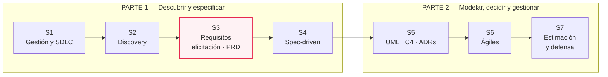
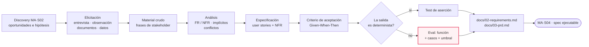
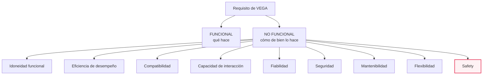
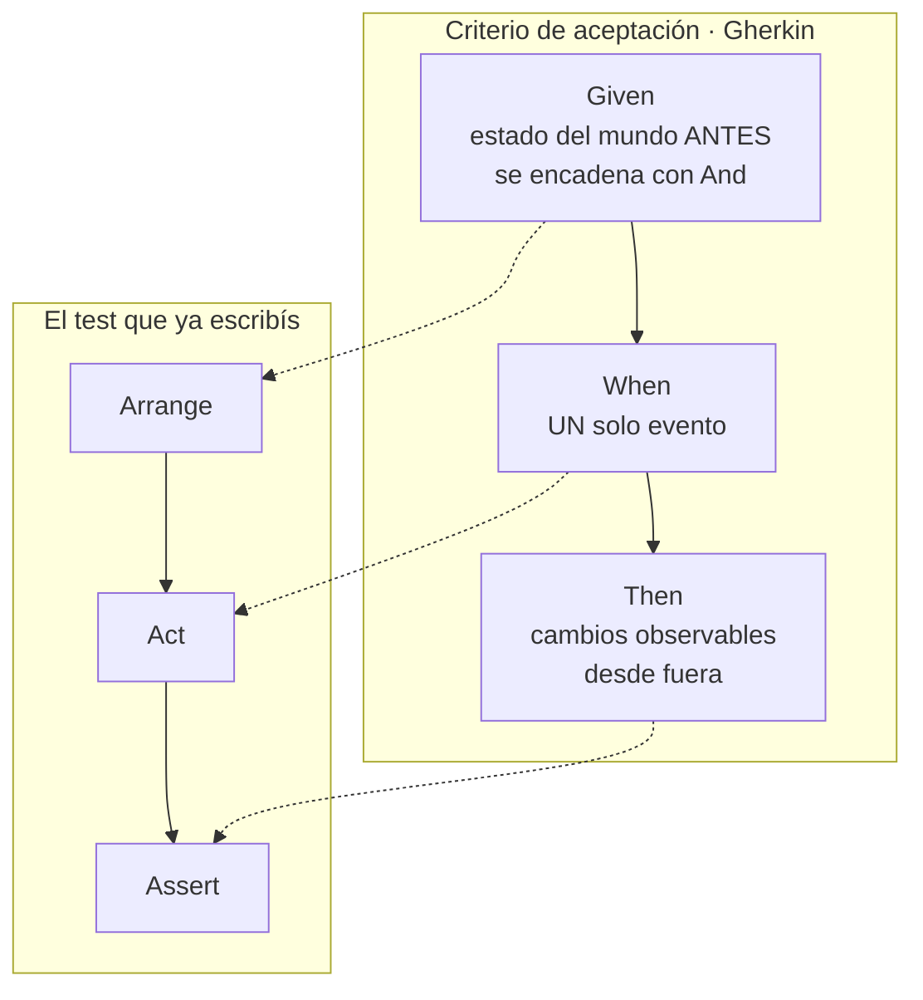
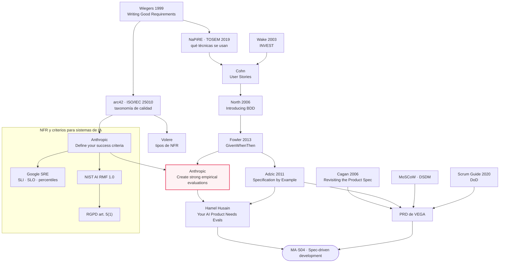

# MA·S03 — Análisis de requerimientos: de la elicitación a la especificación

**Módulo:** A — Ingeniería de Software para AI Engineers *(módulo extra, transversal; se dicta entre el módulo 06 y el 07)*
**Sesión:** 03 de 07 · Parte 1 — Descubrir y especificar
**Fecha:** [Completar por el profesor: fecha]
**Caso hilo conductor:** Proyecto VEGA — Nortia Energía
**Entregables:** `docs/02-requirements.md` y `docs/03-prd.md` *(el PRD se termina fuera de clase, antes de MA·S04)*

**Duración estimada**

| Bloque | Tiempo |
|---|---|
| Clase presencial | 180 min |
| Lectura de los recursos imprescindibles | ~1 h 10 min |
| Lectura de los recursos recomendados | ~2 h 40 min |
| Trabajo fuera de clase (PRD + revisión del charter) | ~1 h 40 min |
| **Total de estudio fuera de clase** | **≈ 5 h 30 min** |

**Reparto propuesto de los 180 minutos de clase**

| Tramo | Minutos | Contenido |
|---|---|---|
| Encuadre | 20 | Repaso de lo que trae MA·S02 y qué se produce hoy |
| Elicitación, requisitos y NFR de IA | 45 | Subtemas 1 a 7 |
| User stories, INVEST y Given-When-Then | 25 | Subtemas 8 y 9 |
| **Lab: entrevista simulada + consolidación** | **90** | Sección 6 de este documento |

> 📝 **Nota para el profesor:** el plan del módulo solo fija el lab en ≈90 min; el resto del reparto es una propuesta. La especificación del PRD queda como trabajo fuera de clase, tal como ya indica el plan.

**Artefacto:** [La sesión en versión web](https://claude.ai/code/artifact/3f0c2dd4-628e-4ce8-b61f-61f330f65e48) — el apunte completo como página navegable.

---

## 1. Objetivos de aprendizaje

Al terminar esta sesión vas a poder:

1. **Distinguir** un requisito de un deseo y **reescribir** un enunciado ambiguo —"el sistema debe ser rápido"— en uno verificable, identificando las palabras que garantizan ambigüedad.
2. **Elegir y aplicar** la técnica de elicitación adecuada a cada situación —entrevista, observación, workshop, prototipado, análisis de documentos, análisis de datos existentes— y **conducir** una entrevista de la que salgan requisitos y no opiniones.
3. **Clasificar** requisitos en funcionales y no funcionales apoyándote en una taxonomía de calidad, y **redactar NFR específicos de un sistema de IA**: latencia p50/p95, coste por interacción, tasa de alucinación tolerable, cobertura de la base de conocimiento, tasa de escalado a humano, explicabilidad, retención y minimización de datos personales, idioma y registro.
4. **Detectar** requisitos implícitos y supuestos no declarados, y **documentar** un conflicto entre stakeholders en un registro trazable en vez de resolverlo a escondidas.
5. **Escribir** user stories que pasen INVEST, **reconocer y corregir** los dos antipatrones más frecuentes (la historia técnica disfrazada y la épica que nadie parte).
6. **Escribir** criterios de aceptación en Given-When-Then y **convertir** el criterio de una salida de LLM —que es no determinista— en un **eval**: una función que puntúa la salida, un conjunto de casos y un umbral.
7. **Construir** la cadena de trazabilidad requisito → historia → criterio → test/eval y **explicar** las dos preguntas que la matriz responde de verdad.
8. **Priorizar** un backlog con MoSCoW, **argumentar** por qué en un proyecto de IA conviene además ordenar por riesgo técnico decreciente, y **enunciar** una Definition of Ready y una Definition of Done para tu equipo.
9. **Producir** `docs/02-requirements.md` y el esqueleto de `docs/03-prd.md` dentro del repositorio `vega-project`.

---

## 2. Resumen ejecutivo

En **MA·S01** escribiste el charter de VEGA y aprendiste que un proyecto de IA es experimental antes que determinista. En **MA·S02** metiste una cuña entre el problema y la solución: mapeaste stakeholders con su poder, su interés y su actitud, reconstruiste el journey de un agente resolviendo un contacto de "no entiendo mi factura", y saliste con oportunidades priorizadas e hipótesis falsables. Hoy esas oportunidades se convierten en algo que un equipo —o un agente de código— puede ejecutar sin inventar.

La sesión recorre un tramo con dos mitades muy distintas. La primera es **elicitación**: extraer de personas que no saben lo que quieren —y que además no dicen todo lo que quieren— el material crudo del que salen los requisitos. Marta quiere bajar el tiempo de resolución un 30 %, pero su bonus depende del coste por contacto y eso no lo va a decir. Iván teme que esto sea el paso previo a recortar plantilla. Cristina pide trazabilidad total y minimización de datos, que son dos cosas que tiran en direcciones opuestas. Diego no quiere que nada toque el CRM. Esos cuatro conflictos son la sesión.

La segunda mitad es **especificación**: convertir ese material en requisitos funcionales, NFR, user stories y criterios de aceptación. Y ahí aparece el eje real de la clase: **un requisito solo existe si es verificable**, y en un sistema de IA "verificable" cambia de significado. La salida de un LLM es no determinista, así que el criterio de aceptación deja de ser una aserción de igualdad y pasa a ser un **eval**: una medición sobre una distribución de salidas, con un umbral. Ése es el puente directo a **MA·S04** (spec-driven development) y a **M08** (evaluación y guardrails).

### Dónde estás dentro del bloque



---

## 3. Conceptos clave / glosario

> Los términos de MA·S01 (charter, SDLC, triple restricción, agenda oculta, PoC → piloto → producción) y de MA·S02 (build trap, doble diamante, mapa de stakeholders, journey map, oportunidad, hipótesis falsable, los cuatro riesgos de producto, spike) se dan por sabidos y no se repiten acá.

### El proceso

| Término | Definición |
|---|---|
| **Requisito** | Una capacidad o condición que el sistema debe cumplir, escrita de forma que se pueda comprobar si se cumple o no. Si no podés imaginar el test, todavía no es un requisito: es un deseo. |
| **Elicitación** | La actividad de *sacar* requisitos de las personas, los documentos y los datos. No es "recoger": nadie los tiene guardados listos para entregártelos; hay que extraerlos. Analogía: no sos un cartero, sos un arqueólogo. |
| **Análisis de requisitos** | Ordenar, clasificar y negociar el material crudo: detectar duplicados, contradicciones, huecos y conflictos, y decidir qué entra. |
| **Especificación** | Escribir el resultado del análisis en un documento con estructura y vocabulario acordados, para que otro pueda ejecutarlo sin preguntarte. |
| **Validación de requisitos** | Comprobar con los stakeholders que lo escrito es lo que necesitaban, *antes* de construirlo. Verificar es "¿lo construimos bien?"; validar es "¿construimos lo correcto?". |
| **Gestión de requisitos** | Mantener vivos los requisitos a lo largo del proyecto: versiones, cambios, estado y trazabilidad. |

### Calidad de un enunciado

| Término | Definición |
|---|---|
| **Verificabilidad** | Propiedad de un requisito que permite decidir, con una prueba objetiva, si se cumple. Es la bisagra de toda la sesión. |
| **Ambigüedad** | Que dos lectores razonables extraigan interpretaciones distintas del mismo enunciado. El vector más común son los adjetivos sin unidad: *rápido*, *fácil*, *eficiente*. |
| **Requisito implícito** | Algo que el stakeholder da por hecho y por eso no lo dice. Suele aparecer solo cuando se incumple. Analogía: nadie pide "que el ascensor tenga puertas". |
| **Supuesto no declarado** | Una creencia sobre el mundo, el usuario o la tecnología que sostiene un requisito y que nadie escribió. Si el supuesto es falso, el requisito se cae entero. |
| **Registro de conflictos** | Documento donde se anota que dos stakeholders piden cosas incompatibles: quién pide qué, por qué chocan, quién decide y qué se decidió. Existe para que la decisión sea visible, no para evitarla. |

### Tipos de requisito

| Término | Definición |
|---|---|
| **Requisito funcional (FR)** | Qué hace el sistema: una entrada, un comportamiento, una salida. "VEGA devuelve la referencia del documento del que sale cada cifra." |
| **Requisito no funcional (NFR)** | *Cómo de bien* lo hace: velocidad, coste, seguridad, mantenibilidad, privacidad. No es "secundario"; suele ser lo que hace que el sistema sea usable o inservible. |
| **Atributo de calidad** | El nombre formal de la categoría a la que pertenece un NFR (fiabilidad, seguridad, mantenibilidad…). Sirve como checklist para no olvidarse categorías enteras. |
| **Fit criterion** | La medición concreta que convierte un atributo de calidad en algo comprobable: no "el sistema debe ser fiable", sino "≤ X errores por cada N consultas". |
| **Restricción** | Una decisión ya tomada que limita el espacio de soluciones y que no se negocia: "no se toca el CRM de producción". |

### NFR de sistemas de IA

| Término | Definición |
|---|---|
| **SLI** | *Service Level Indicator*: una medida cuantitativa cuidadosamente definida de algún aspecto del nivel de servicio que se presta (Google SRE Book, cap. 4). |
| **SLO** | *Service Level Objective*: un valor objetivo, o un rango, para un nivel de servicio medido por un SLI. Es el NFR de rendimiento con forma monitorizable. |
| **SLA** | El SLO más un contrato y unas consecuencias si no se cumple. |
| **p50 / p95** | Percentiles de latencia: el p95 es el tiempo por debajo del cual quedan el 95 % de las peticiones. Se usan en vez de la media porque la media esconde la cola lenta. |
| **Latencia de cola** | El tramo lento de la distribución: el 5 % de peticiones que tarda mucho más que la típica. Es el que ve el agente esperando delante del cliente. |
| **Tasa de alucinación tolerable** | El porcentaje máximo aceptado de respuestas en las que el sistema afirma algo que no está respaldado por su base de conocimiento. Es una decisión de negocio, no una constante técnica. |
| **Cobertura de la base de conocimiento** | Qué proporción de las consultas reales encuentra respaldo documental en el corpus indexado. Un sistema con alta cobertura y baja precisión y otro con lo inverso fallan de maneras distintas. |
| **Tasa de escalado a humano** | Qué proporción de las consultas termina derivada a una persona. Ni el 0 % ni el 100 % son buenas noticias. |
| **Explicabilidad** | Cómo se llega a una decisión — la mecánica del sistema. |
| **Interpretabilidad** | Qué significa esa decisión en el contexto del usuario: el *porqué*. El AI RMF de NIST distingue las dos explícitamente. |
| **Minimización de datos** | Principio del RGPD (art. 5(1)(c)): los datos personales deben ser adecuados, pertinentes y limitados a lo necesario para el fin del tratamiento. |
| **Limitación del plazo de conservación** | Principio del RGPD (art. 5(1)(e)): los datos no se guardan identificables más tiempo del necesario para el fin. |
| **Línea base (*baseline*)** | El nivel actual contra el que se compara la mejora. Sin línea base, "mejor" no significa nada. |

### Historias y criterios

| Término | Definición |
|---|---|
| **User story** | Descripción breve de una funcionalidad desde la perspectiva de quien la necesita, centrada en un resultado con sentido y no en una tarea interna. Es una herramienta de pensamiento, no un formato obligatorio. |
| **Épica** | Una historia demasiado grande para caber en una iteración. Hay que partirla antes de comprometerla. |
| **Condiciones de satisfacción** | Los ejemplos, reglas, tests, bocetos o notas que aclaran qué debe ser cierto cuando la historia está terminada. Sinónimo práctico de criterios de aceptación. |
| **INVEST** | Acrónimo de Bill Wake (2003) para las seis propiedades de una buena historia: *Independent, Negotiable, Valuable, Estimable, Small, Testable*. |
| **SMART** | El complemento de INVEST para las **tareas** en que se parte una historia: *Specific, Measurable, Achievable, Relevant, Time-boxed*. |
| **Criterio de aceptación** | La condición comprobable que decide si una historia está hecha. Es el test escrito en lenguaje de negocio. |
| **BDD** | *Behaviour-Driven Development*: especificar el comportamiento del sistema con un vocabulario común entre negocio y técnica, en vez de con dos jergas separadas. |
| **Given-When-Then** | El formato de escenario del BDD: **Given** el estado del mundo antes, **When** el comportamiento que se especifica, **Then** los cambios esperados. |
| **Gherkin** | El lenguaje concreto —`Feature`, `Scenario`, `Given`, `When`, `Then`, `And`— con el que se escriben escenarios GWT ejecutables por Cucumber y herramientas equivalentes. |
| **Arrange-Act-Assert** | El mismo trío, con el nombre que ya usás en tus tests unitarios. Fowler señala explícitamente la correspondencia. |
| **Specification by Example** | Especificar el comportamiento mediante ejemplos concretos y acordados, que después se automatizan y quedan como documentación viva. |
| **Documentación viva** | Documentación que se valida sola contra el sistema porque los ejemplos que contiene se ejecutan. Si el sistema cambia y la doc no, el build falla. |
| **Eval** | Un criterio de aceptación ejecutable sobre una salida no determinista: una función que puntúa la salida, un conjunto de casos y un umbral que hay que superar. |
| **LLM-as-judge** | Usar un modelo para calificar la salida de otro. La recomendación es que el juez sea un **modelo distinto** del evaluado. |
| **Calificación binaria** | El método de eval en el que el juez responde sí/no a una pregunta única. Es el molde típico para criterios de privacidad y seguridad. |
| **Umbral de aprobación** | El porcentaje mínimo de casos que deben pasar para que el criterio se dé por cumplido. Ahí es donde vive el NFR. |

### Especificación, trazabilidad y priorización

| Término | Definición |
|---|---|
| **PRD** | *Product Requirements Document*: el documento que reúne contexto, objetivos, alcance, requisitos y restricciones de un producto, de forma que el equipo pueda construirlo sin volver a preguntar lo mismo. |
| **Trazabilidad** | La capacidad de seguir un requisito hacia adelante —qué historia, qué criterio, qué test— y hacia atrás —de qué stakeholder o documento salió—. |
| **Matriz de trazabilidad** | La tabla que materializa esa cadena. Su valor real son dos preguntas: "si cambio esto, ¿qué se rompe?" y "este test, ¿qué requisito defiende?". |
| **MoSCoW** | Técnica de priorización en cuatro cubos: *Must have*, *Should have*, *Could have*, *Won't have this time*. |
| **Minimum Usable SubseT** | De ahí sale el "MUST" de MoSCoW: el subconjunto mínimo que hace que tenga sentido entregar en la fecha objetivo. |
| ***Scope creep*** | El crecimiento silencioso del alcance. Registrar explícitamente los *Won't have* es lo que lo frena. |
| **Definition of Ready (DoR)** | Lista de condiciones que un equipo acuerda que un elemento del backlog debe cumplir **antes** de entrar a un sprint. Es una práctica de equipo, no un artefacto oficial de Scrum. |
| **Definition of Done (DoD)** | "Una descripción formal del estado del Incremento cuando cumple las medidas de calidad requeridas para el producto" (Scrum Guide 2020). Lo que no la cumple no forma parte del Incremento. |
| **Refinamiento del backlog** | La actividad continua de descomponer y detallar elementos del Product Backlog en piezas más pequeñas y precisas. |

---

## 4. Notas de estudio por subtema

### El flujo completo de la sesión

Este es el recorrido que hacés hoy, de una frase suelta de Marta Sedano a un umbral que un pipeline puede comprobar:



Todo lo que sigue es un tramo de ese flujo.

---

### 4.1 Qué es un requisito (y por qué "el sistema debe ser rápido" no lo es)

Un requisito es una capacidad o condición que el sistema debe cumplir, escrita de forma que se pueda comprobar objetivamente si se cumple. La palabra que hace el trabajo es **comprobar**. Si no podés imaginar el test —o la medición, o el eval—, lo que tenés es un deseo bien intencionado.

Karl Wiegers, en *Writing Good Requirements* (Software Development, mayo de 1999), lo formula con una frase que conviene tener pegada al monitor: *"el lector de un enunciado de requisito debería extraer una sola interpretación de él"*. Y enumera características de un requisito excelente; entre ellas: **correcto, factible, necesario, priorizado, no ambiguo y verificable**.

Vale la pena leer esa lista dos veces, porque cada palabra descarta un error distinto:

- **Correcto** — describe algo que de verdad se necesita, no lo que el analista entendió mal.
- **Factible** — se puede construir con la tecnología, el presupuesto y el plazo disponibles. En IA esto no es obvio: hay requisitos que solo se sabe si son factibles después de un spike.
- **Necesario** — alguien lo pidió y hay una razón. Si no podés nombrar el stakeholder que lo reclama, sospechá.
- **Priorizado** — sabés qué pasa si se cae. Un backlog donde todo es igual de importante no está priorizado.
- **No ambiguo** — una sola interpretación posible.
- **Verificable** — existe una prueba que decide si se cumple.

A eso conviene añadir una propiedad que no es del enunciado individual sino del **conjunto**: la **completitud**. Un requisito puede estar perfectamente escrito y aun así el documento estar incompleto porque nadie preguntó qué pasa fuera del horario de atención.

#### La lista negra de palabras

Wiegers da la lista de palabras que garantizan ambigüedad: *user-friendly, easy, simple, rapid, efficient, several, state-of-the-art, improved, maximize, minimize*. Nótese que **rapid** y **efficient** están literalmente ahí. Por eso "el sistema debe ser rápido" no es un requisito: no dice rápido para quién, midiendo qué, en qué condiciones, ni con qué corte.

La versión reparada, en el caso VEGA:

| ❌ Enunciado inservible | ✅ Enunciado verificable |
|---|---|
| VEGA debe ser rápido | El p95 del tiempo hasta la primera respuesta de VEGA es ≤ ___ s, medido sobre ___ consultas del conjunto de referencia en franja de pico |
| La interfaz debe ser user-friendly | Un agente con menos de 2 semanas en Nortia completa una consulta de tipo "no entiendo mi factura" sin ayuda externa en ≤ ___ min |
| VEGA no debe alucinar | En ___ consultas cuya respuesta no existe en la base de conocimiento, VEGA declara no disponer de información suficiente en ≥ ___ % de los casos |
| Hay que minimizar los datos personales que se guardan | Las transcripciones de conversación se conservan ___ días y después se eliminan automáticamente; no se almacena el DNI del cliente en ningún caso |

> 💡 Fijate en el patrón de las tres columnas invisibles: **magnitud + unidad + población de medida**. Un NFR sin población de medida ("¿sobre qué consultas?") se discute eternamente porque cada uno mide sobre lo que le conviene.

> ⚠️ Un requisito "verificable" no es un requisito "verificado". Escribir el umbral es la mitad del trabajo; la otra mitad es tener el conjunto de casos sobre el que medirlo. Si no existe, eso también es un requisito (de tooling) y va al backlog.

**Para profundizar:** [Karl Wiegers — *Writing Good Requirements*](https://www.cs.bgu.ac.il/~elhadad/se/requirements-wiegers-sd-may99.html) · [SWEBOK v4, cap. 1 "Software Requirements"](https://ieeecs-media.computer.org/media/education/swebok/swebok-v4.pdf) (el mapa institucional del territorio; ya lo tenés descargado desde MA·S01).

---

### 4.2 El proceso: elicitación, análisis, especificación, validación

Estas cuatro palabras se usan como sinónimos en la conversación de oficina y no lo son. Separarlas es lo que te permite saber en qué estás fallando cuando algo sale mal.

| Actividad | Qué hacés | Qué sale | Síntoma de que la salteaste |
|---|---|---|---|
| **Elicitación** | Extraés material crudo de personas, documentos y datos | Notas, frases textuales, ejemplos, quejas | El documento solo contiene lo que ya pensabas antes de empezar |
| **Análisis** | Clasificás, detectás huecos, contradicciones y conflictos | FR, NFR, conflictos registrados, supuestos explicitados | Dos requisitos del mismo documento se contradicen y nadie lo notó |
| **Especificación** | Escribís con estructura y vocabulario acordados | `02-requirements.md`, `03-prd.md` | El equipo pregunta lo mismo tres veces |
| **Validación** | Comprobás con el stakeholder que eso es lo que necesitaba | Requisitos aprobados o corregidos | En la demo alguien dice "esto no era lo que pedí" |

La distinción que más rinde: **verificar** es comprobar que construiste bien el sistema; **validar** es comprobar que construiste el sistema correcto. Podés pasar todos los tests y haber construido lo que nadie necesitaba.

En VEGA, hoy hacés elicitación (el lab), análisis (la consolidación) y especificación (los dos documentos). La validación es un paso corto: mandarle a Marta el listado de NFR y preguntarle cuál de los umbrales le parece inaceptable.

---

### 4.3 Técnicas de elicitación: cuál rinde en cada situación

Hay seis técnicas que cubren el 95 % de los casos. Ninguna es "la buena": cada una encuentra una clase distinta de requisito y falla en las demás.

| Técnica | Qué encuentra bien | Dónde falla | Cuándo elegirla en VEGA |
|---|---|---|---|
| **Entrevista** | Objetivos, prioridades, agendas, contexto de negocio | Lo que el entrevistado hace pero no sabe que hace | Con Marta, Iván, Cristina y Diego. Es la técnica del lab |
| **Observación** *(shadowing)* | Requisitos implícitos, pasos que nadie menciona, atajos reales del trabajo | Es cara en tiempo y sesga si el observado se siente evaluado | Sentarte al lado de un agente durante 3 contactos de "no entiendo mi factura" |
| **Workshop / reunión facilitada** | Acuerdos entre áreas, resolución de conflictos en vivo, priorización conjunta | Se lo lleva el que habla más fuerte si no hay facilitador | Para cerrar el conflicto trazabilidad vs. minimización con Cristina y Diego en la sala |
| **Prototipado** | Requisitos de interacción que nadie sabe enunciar en abstracto | Ancla la conversación en la solución antes de tiempo | Una maqueta de la respuesta de VEGA con sus citas: "¿esto te sirve?" |
| **Análisis de documentos** | Reglas de negocio, obligaciones regulatorias, vocabulario del dominio | Los documentos mienten: describen el proceso oficial, no el real | Los 4.100 documentos de la intranet: tarifas, condiciones contractuales, circulares |
| **Análisis de datos existentes** | Volúmenes, distribuciones, casos reales, la cola larga | No dice por qué pasan las cosas | Logs del CRM: qué se busca, cuánto se tarda, qué contactos se reabren |

#### Las dos técnicas que el alumno típico se salta

En un proyecto de IA, **análisis de documentos y análisis de datos existentes no son opcionales: son técnicas de pleno derecho y suelen ser las que más rinden.** Los 4.100 documentos de la intranet de Nortia *son* el requisito de cobertura: si el 23 % de los contactos son sobre facturas y solo hay 40 documentos sobre facturación, ya sabés algo que ninguna entrevista te iba a contar. Y los logs del CRM te dan la distribución real de consultas, que es exactamente el conjunto de casos que después vas a necesitar para el eval.

La **observación** es la que más requisitos implícitos descubre y la que menos se usa, porque es lenta y porque hay que pedir permiso. Media hora sentado al lado de un agente vale más que dos entrevistas.

#### Qué dice la evidencia sobre qué se usa de verdad

El estudio **NaPiRE** (*Naming the Pain in Requirements Engineering*, Wagner, Méndez Fernández, Felderer et al., ACM TOSEM 28(2), 2019), con datos de **228 organizaciones en 10 países**, encontró que las técnicas de elicitación más usadas en la industria son **entrevistas, reuniones facilitadas y prototipado**, y que la especificación sigue siendo mayoritariamente textual. No halló diferencias fuertes entre países ni regiones. La observación no aparece entre las tres primeras: hay una brecha entre la técnica que más descubre y la que más se practica, y esa brecha es parte del motivo por el que existe esta sesión.

Para sistemas con machine learning existe la versión equivalente del mismo grupo de investigación: *Naming the Pain in Machine Learning-Enabled Systems Engineering* (Kalinowski, Mendez, Giray et al., 2024), una encuesta internacional con **188 respuestas de 25 países** sobre prácticas y problemas en cada fase del ciclo de vida, que concluye que las prácticas de ingeniería de software hay que **adaptarlas**, no importarlas tal cual.

#### Cómo se conduce la entrevista

Cuatro reglas que cambian el resultado:

1. **Preguntá por lo que pasó, no por lo que pasaría.** "Contame el último contacto que se te complicó" produce datos; "¿qué te gustaría que hiciera el asistente?" produce fantasía.
2. **Nunca preguntes por la solución.** Si el stakeholder te la da igual (y lo va a hacer), preguntá "¿qué problema resolvería eso?" y anotá el problema.
3. **Pedí números y pedí ejemplos.** "¿Un 30 % respecto de qué línea base? ¿Medido cómo?" Las preguntas incómodas se hacen ahora o se pagan en la demo.
4. **Anotá literal.** Las palabras exactas del stakeholder son la fuente de un requisito, y las vas a necesitar en la columna "fuente" de la matriz de trazabilidad.

> ⚠️ El error más caro de la entrevista es **cerrarla cuando el entrevistado deja de hablar**. El silencio incómodo de cinco segundos después de una respuesta produce más información que la pregunta siguiente.

**Para profundizar:** [NaPiRE — *Status Quo in Requirements Engineering*](https://arxiv.org/abs/1805.07951) · [*Naming the Pain in ML-Enabled Systems Engineering*](https://arxiv.org/abs/2406.04359)

---

### 4.4 Requisitos implícitos y supuestos no declarados

Un **requisito implícito** es algo que el stakeholder da por hecho y por eso no lo dice. Nadie pide "que el ascensor tenga puertas". El problema es que la lista de cosas obvias de un dominio no es obvia para vos, que llevás tres semanas en él.

Un **supuesto no declarado** es una creencia sobre el mundo que sostiene un requisito. "Bajar el tiempo de resolución un 30 %" supone que el cuello de botella es la búsqueda de información. Si el cuello de botella real fuera la autorización de un supervisor, el requisito entero apunta al sitio equivocado.

#### Las preguntas que los sacan a la luz

Este es el kit portátil. Aplicalo a cada requisito que anotes:

| Pregunta | Qué descubre | En VEGA |
|---|---|---|
| **"¿Y si no…?"** | El camino de error, que nadie especifica | ¿Y si VEGA no encuentra nada en los 4.100 documentos? |
| **"¿Quién más lo usa?"** | Usuarios secundarios invisibles | ¿El supervisor ve las conversaciones? ¿Formación las usa para entrenar? |
| **"¿Qué pasa fuera del horario?"** | Requisitos de disponibilidad y de operación | ¿VEGA responde a las 3 de la mañana? ¿Quién lo arregla si se cae un domingo? |
| **"¿Cuánto es mucho?"** | El umbral que falta | ¿3 segundos es rápido? ¿Y 8? |
| **"¿De dónde sale ese dato hoy?"** | Dependencias y sistemas fuente | El importe de la factura, ¿del CRM o del sistema de facturación? |
| **"¿Qué hacés hoy cuando eso falla?"** | El proceso de excepción, que suele ser la mitad del trabajo real | Cómo escala hoy un agente una consulta que no sabe resolver |
| **"¿Quién se entera si sale mal?"** | Requisitos de logging, auditoría y alerta | Si VEGA da un importe incorrecto, ¿alguien lo detecta? |
| **"¿Esto ya lo hace algo?"** | Solapamientos y sistemas legacy | La intranet tiene buscador; ¿por qué no alcanza? |

#### La agenda oculta *es* un supuesto no declarado

Volvé a la tabla de stakeholders de VEGA. La columna "lo que no dice" no es color narrativo: cada celda es un supuesto que va a torcer el proyecto si nadie lo escribe.

| Stakeholder | Lo que dice | Lo que no dice | Requisito fantasma que genera |
|---|---|---|---|
| Marta Sedano | Bajar el tiempo medio de resolución un 30 % | Su bonus depende del coste por contacto | Va a presionar por menos escalados a humano aunque la respuesta sea peor |
| Iván Ferreras | Que sus agentes no queden peor valorados | Teme que sea el paso previo a recortar plantilla | Va a pedir que las métricas por agente no se expongan |
| Cristina Roa | Trazabilidad total y cumplimiento | No sabe si el sistema entra en el AI Act | Va a pedir guardar todo, que choca con minimización |
| Diego Amat | Que nada toque el CRM de producción | Su equipo está saturado | Va a vetar cualquier cosa que le añada mantenimiento |
| Agentes de atención | *Nadie les ha preguntado* | — | El riesgo de adopción entero |

> 💡 Los supuestos no se resuelven: se **escriben**. En el `02-requirements.md` va una sección "Supuestos" con una línea por supuesto y qué pasaría si fuera falso. Es la misma disciplina de las hipótesis falsables de MA·S02, aplicada a lo que sostiene el documento.

---

### 4.5 Conflictos entre stakeholders: documentarlos, no resolverlos a escondidas

El error clásico del analista junior es descubrir que Cristina y Diego piden cosas incompatibles y **resolverlo solo**, eligiendo la opción que le parece más razonable. Eso tiene dos consecuencias garantizadas: el que perdió se entera tarde y en público, y nadie puede reconstruir por qué se decidió así.

La alternativa es un **registro de conflictos** en el propio `02-requirements.md`. Formato mínimo:

```markdown
### CONF-002 · Trazabilidad total vs. minimización de datos

| Campo | Contenido |
|---|---|
| Detectado en | Entrevista con Cristina Roa, ronda 3 |
| Parte A | **Cristina Roa (DPO)** — trazabilidad total: toda consulta y toda respuesta registradas y recuperables |
| Parte B | **El propio principio de minimización** — art. 5(1)(c) del RGPD: datos limitados a lo necesario para el fin |
| Por qué son incompatibles | La trazabilidad total implica conservar transcripciones que pueden contener datos personales del cliente más tiempo del necesario para atender el contacto |
| Opciones | (a) registrar solo metadatos y hash de la consulta; (b) registrar todo con seudonimización y plazo de retención corto; (c) registrar todo sin límite |
| Quién decide | Cristina Roa, con visto bueno de Marta Sedano |
| Decisión | *(pendiente)* |
| Fecha | *(pendiente)* |
| Estado | Abierto |
```

Los tres conflictos vivos del caso VEGA:

1. **CONF-001 · Marta vs. Iván.** Coste por contacto contra valoración de los agentes. Bajar el coste empuja a resolver sin escalar; proteger la valoración empuja a escalar antes de arriesgar una respuesta mala. Es un conflicto de **objetivos**, y se resuelve fijando cuál de los dos NFR manda cuando chocan.
2. **CONF-002 · Trazabilidad total vs. minimización.** El de arriba. Es un conflicto de **atributos de calidad**, del tipo que el AI RMF de NIST reconoce explícitamente: *"pueden surgir compromisos entre optimizar la interpretabilidad y lograr la privacidad"*, y sostiene que resolverlos depende del contexto y exige decisiones transparentes y justificables.
3. **CONF-003 · Diego vs. todos.** "Que nada toque el CRM de producción" es una **restricción**, no un requisito, y limita el espacio de soluciones antes de empezar. Registrala como restricción en el PRD y como conflicto solo si algún requisito la viola.

> ⚠️ Un conflicto sin "quién decide" no está registrado, está descrito. La fila que hace que el registro sirva es la del decisor, porque es la que convierte una discusión en una decisión con fecha. Los conflictos que se cierran con una decisión estructural terminan siendo un **ADR** en MA·S05.

---

### 4.6 Funcionales vs. no funcionales: la taxonomía como red de seguridad

La distinción es simple: el **FR** dice qué hace el sistema, el **NFR** dice *cómo de bien* lo hace. El problema no es distinguirlos, es acordarse de todos. El alumno típico escribe cuatro NFR de rendimiento, dos de seguridad y se olvida de mantenibilidad, compatibilidad y flexibilidad — que son justo las que se cobran a los nueve meses.

Por eso se usa una **taxonomía de calidad como checklist**. El modelo de calidad **arc42** (Gernot Starke / INNOQ), que reproduce ISO/IEC 25010, enumera **nueve características** de calidad de producto con 48 subcaracterísticas. En su revisión de 2023, *usability* pasó a llamarse **capacidad de interacción**, *portability* pasó a **flexibilidad**, y **safety** entró como característica nueva de primer nivel.



*Safety* está resaltada a propósito: que sea característica de primer nivel es directamente pertinente a un asistente que responde sobre importes de factura a un agente que después se lo dice a un cliente.

#### Cómo se usa la checklist

No leas la taxonomía antes de escribir: escribí tus NFR primero y después pasá la lista pidiendo, por cada característica, "¿tenemos alguno de esto? ¿debería?". Vas a descubrir huecos en compatibilidad (¿VEGA convive con el buscador de la intranet?), en mantenibilidad (¿quién reindexa los 4.100 documentos y cada cuánto?) y en flexibilidad (¿esto corre si mañana cambiamos de proveedor de modelo?).

Una segunda vista útil es la de la plantilla **Volere**, de James y Suzanne Robertson (Atlantic Systems Guild): ~90 páginas y 27 secciones, con el desglose de NFR más granular que existe en una plantilla de uso general —*look and feel*, usabilidad y humanidad, rendimiento, operacional y de entorno, mantenibilidad y soporte, seguridad (acceso, integridad, privacidad, auditoría), requisitos culturales, y cumplimiento legal y de estándares—. Sus categorías **"seguridad → auditoría"** y **"cumplimiento → legal"** son exactamente el casillero donde caen los requisitos de Cristina Roa, que si no se quedan flotando fuera del documento.

> ⚠️ Volere **no es gratuita**: 55 USD para uso en un proyecto y 255 USD para licencia de sitio, con acceso gratuito para uso académico previa solicitud desde un dominio de correo educativo reconocido. La taxonomía de NFR se ve en la página pública; no hace falta comprarla para esta sesión.

**Para profundizar:** [arc42 Quality Model — ISO/IEC 25010](https://quality.arc42.org/standards/iso-25010) · [Volere Requirements Specification Template](https://www.volere.org/templates/volere-requirements-specification-template/)

---

### 4.7 NFR específicos de sistemas de IA — el diferencial de la sesión

Acá es donde la ingeniería de requisitos clásica se queda corta. Un CRUD tiene NFR de latencia y de seguridad; un sistema con un LLM en el medio tiene además una familia de atributos que no existían: qué tan seguido inventa, cuánto cuesta cada respuesta, qué proporción de preguntas puede contestar con su corpus, y cuándo debe rendirse y pasarle el problema a una persona.

La documentación de Anthropic (*Define your success criteria*) sostiene que un buen criterio de éxito es **específico, medible, alcanzable y relevante**, y da el contraste explícito: mal, *"el modelo debe clasificar bien los sentimientos"*; bien, *"el modelo debe alcanzar un F1 de al menos 0,85 sobre un conjunto de test reservado de 10.000 publicaciones diversas, un 5 % de mejora sobre la línea base actual"*. Enumera ocho familias de criterio: fidelidad a la tarea, consistencia, relevancia y coherencia, tono y estilo, preservación de la privacidad, uso del contexto, **latencia** y **precio**.

Que latencia y precio aparezcan ahí como criterios de primera clase —y no como detalle de infraestructura— es exactamente lo que esta sesión quiere que interiorices.

> 💡 Ese ejemplo del F1 ≥ 0,85 es un **ejemplo de la documentación**, no un benchmark de la industria ni un número aplicable a VEGA. Lo que se copia es el **patrón**: umbral + población de test + comparación con la línea base.

#### Por qué p95 y no la media

El capítulo 4 del *Google SRE Book* define el **SLI** como *"una medida cuantitativa cuidadosamente definida de algún aspecto del nivel de servicio que se presta"* y el **SLO** como *"un valor objetivo o rango de valores para un nivel de servicio medido por un SLI"*; el **SLA** añade el contrato y sus consecuencias. Y argumenta por qué la latencia se mide en percentiles y no en media, con un caso donde el 5 % de las peticiones es 20 veces más lento que el típico de 50 ms: la media te dice que todo va bien mientras un usuario de cada veinte se desespera.

Aplicado a VEGA: la media esconde precisamente al agente de Nortia que se quedó esperando con el cliente al teléfono. Ése es el que abandona la herramienta.

El libro también da objetivos escalonados de ejemplo —90 % por debajo de 1 ms, 99 % por debajo de 10 ms, 99,9 % por debajo de 100 ms— y dos consejos que valen para tu documento: tener *"solo los SLO suficientes para dar buena cobertura"*, y no sobrecumplir, porque los usuarios se acostumbran al nivel real y no al prometido.

#### El marco de confiabilidad

El **AI Risk Management Framework 1.0 de NIST (2023)** enumera **siete características de una IA confiable**: válida y fiable; *safe*; segura y resiliente; responsable y transparente; explicable e interpretable; con privacidad reforzada; y justa, con el sesgo dañino gestionado. Distingue **explicabilidad** —el *cómo* se toma una decisión— de **interpretabilidad** —el *porqué* y su significado para el usuario—, que es la distinción que convierte "explicabilidad" de palabra suelta en NFR redactable: en VEGA, explicable es "cita el documento del que sale la cifra"; interpretable es "el agente entiende por qué esa cifra aplica a este cliente".

#### La parte legal

Dos principios del RGPD aterrizan directamente como NFR:

- **Minimización de datos, art. 5(1)(c):** los datos personales serán *"adecuados, pertinentes y limitados a lo necesario en relación con los fines para los que son tratados"*.
- **Limitación del plazo de conservación, art. 5(1)(e):** *"mantenidos de forma que se permita la identificación de los interesados durante no más tiempo del necesario para los fines del tratamiento"*, con la excepción de archivo, investigación o estadística del art. 89(1).

En VEGA se traducen en dos preguntas muy concretas que hay que hacerle a Cristina Roa en el lab: **¿se guarda la transcripción de la conversación del agente con VEGA? ¿durante cuánto tiempo?**

#### El catálogo de NFR de VEGA, con el formato listo

Estos son los nueve NFR que el plan exige cubrir. Los **valores están deliberadamente en blanco**: fijar el umbral es lo que tenés que aprender a negociar con Marta, no lo que se te entrega hecho. Lo que sí está resuelto es el formato.

| # | NFR | Enunciado con los huecos a rellenar | Cómo se mide |
|---|---|---|---|
| NFR-01 | Latencia | `El p95 del tiempo hasta la primera respuesta es ≤ ___ s, medido sobre ___ consultas del conjunto de referencia en franja de pico` | Percentil sobre logs de producción o del banco de pruebas |
| NFR-02 | Latencia (típico) | `El p50 del tiempo hasta respuesta completa es ≤ ___ s sobre la misma población` | Ídem |
| NFR-03 | Coste por interacción | `El coste medio por consulta resuelta es ≤ ___ EUR, medido sobre ___ consultas, con el modelo ___ y la configuración de caching ___` | Tokens de entrada y salida × precio; se cierra en MA·S07 |
| NFR-04 | Tasa de alucinación tolerable | `En ___ consultas cuya respuesta no existe en la base de conocimiento, VEGA declara no disponer de información suficiente en ≥ ___ % de los casos` | Eval de calificación binaria (ver 4.9) |
| NFR-05 | Cobertura de la base de conocimiento | `≥ ___ % de las consultas del conjunto de referencia recuperan al menos ___ documento(s) relevante(s) de los 4.100 indexados` | Eval de retrieval sobre casos etiquetados |
| NFR-06 | Tasa de escalado a humano | `≤ ___ % de las consultas terminan escaladas a una persona por falta de información, medido sobre ___ consultas` | Contador en producción; ojo con CONF-001 |
| NFR-07 | Explicabilidad | `El 100 % de las respuestas que contienen una cifra incluyen la referencia al documento o registro de origen, verificado sobre ___ respuestas` | Eval por código (presencia de la cita) |
| NFR-08 | Retención y minimización | `Las transcripciones se conservan ___ días y se eliminan automáticamente; no se almacenan ___ (categorías de datos personales)` | Revisión de la política + test del job de borrado |
| NFR-09 | Idioma y registro | `El ___ % de las respuestas están en castellano y en registro ___, calificado por ___ sobre una escala de ___` | Eval por LLM con escala Likert |

> ⚠️ **NFR-06 es un campo de batalla, no un número.** Bajar el escalado favorece a Marta (coste por contacto) y perjudica a Iván (calidad percibida del agente). Si lo fijás sin registrar CONF-001, estás tomando partido en un conflicto sin decirlo.

> 📝 **Nota para el profesor:** el caso VEGA no fija ninguno de estos valores, y se dejan en blanco a propósito para que la negociación de umbrales sea parte del lab. Si querés cerrarlos vos, acá están los huecos. Mismo criterio con el presupuesto: el material asume que "el presupuesto está aprobado pero la cifra no se ha comunicado al equipo" —realista y útil como supuesto no declarado en clase—; si hay cifra, cambia el ejercicio de priorización de la sección 4.11.

**Para profundizar:** [Anthropic — *Define your success criteria*](https://platform.claude.com/docs/en/test-and-evaluate/define-success) · [Google SRE Book, cap. 4 — *Service Level Objectives*](https://sre.google/sre-book/service-level-objectives/) · [NIST AI RMF 1.0 — características de una IA confiable](https://airc.nist.gov/airmf-resources/airmf/3-sec-characteristics/) · [RGPD, art. 5](https://gdpr-info.eu/art-5-gdpr/)

---

### 4.8 User stories, INVEST y antipatrones

Una **user story** es una descripción breve de funcionalidad desde la perspectiva de quien la necesita, con foco en resultados con sentido y no en tareas internas. La plantilla habitual —*"Como [tipo de usuario], quiero [algo], para [razón o beneficio]"*— es **una herramienta de pensamiento, no un formato obligatorio**; Mike Cohn es explícito en eso, y conviene recordarlo antes de que la clase entera empiece a escribir "Como sistema, quiero…".

La plantilla y el criterio de aceptación nacieron juntos. Dan North, en *Introducing BDD* (Better Software, marzo de 2006), presenta en el mismo artículo la forma *"As a [X] I want [Y] so that [Z]"* —donde Y es la funcionalidad, Z su valor de negocio y X el rol que se beneficia— y la forma *"Given some initial context, When an event occurs, Then ensure some outcomes"*. North y Chris Matts llegaron ahí inspirados por el *ubiquitous language* de Eric Evans: vieron que el vocabulario de comportamiento se podía aplicar al propio proceso de análisis y crear un dialecto común entre analistas, testers, desarrolladores y negocio. Enseñar historias sin GWT es partir en dos algo que nació entero.

#### INVEST, letra por letra

Bill Wake acuñó el acrónimo en *INVEST in Good Stories, and SMART Tasks* (17 de agosto de 2003). Sus formulaciones:

| Letra | Qué pide Wake | Cómo se te rompe en VEGA |
|---|---|---|
| **I**ndependent | Lo más fácil es trabajar con historias independientes: que no se solapen en concepto y se puedan planificar e implementar en cualquier orden | "Indexar los documentos" y "buscar en los documentos" son la misma historia partida por la mitad técnica |
| **N**egotiable | No es un contrato explícito de funcionalidades; los detalles los co-crean cliente y programador durante el desarrollo | La historia que ya trae decidido el proveedor de embeddings no es negociable |
| **V**aluable | Valiosa **para el cliente**, no para cualquiera | "Refactorizar el módulo de retrieval" es valiosa para vos, no para el agente de atención |
| **E**stimable | No hace falta una estimación exacta, solo la suficiente para que el cliente pueda ordenar y planificar | Si nadie sabe si el modelo puede hacerlo, no es estimable: es un spike |
| **S**mall | A lo sumo unas pocas persona-semanas de trabajo | "Que VEGA resuelva cualquier contacto" es una épica disfrazada |
| **T**estable | *"Escribir la tarjeta lleva una promesa implícita: entiendo lo que quiero lo bastante bien como para poder escribirle un test"* | Si no sabés cómo probar "que responda bien", el requisito todavía no existe |

La segunda mitad del artículo de Wake propone **SMART** —*Specific, Measurable, Achievable, Relevant, Time-boxed*— para las tareas en que se parte una historia. INVEST es para historias; SMART, para tareas. No los mezcles.

> 💡 La **T** de Testable es la bisagra de toda la clase. La promesa implícita de la tarjeta es que se le puede escribir un test — que es literalmente lo que hacés en 4.9.

#### Antipatrón 1: la historia técnica disfrazada

Es una tarea de implementación con un "Como usuario, quiero…" pegado por delante.

```
❌ Como sistema, quiero un índice vectorial en Pinecone,
   para poder recuperar documentos rápido.
```

Falla **Valuable** (el sistema no es un cliente), falla **Negotiable** (ya trae la solución decidida) y no describe ningún resultado con sentido para nadie. La corrección no es borrarla: el índice hace falta. Es **subirla de nivel** y dejar la decisión técnica donde corresponde.

```
✅ Como agente de atención, quiero encontrar el documento que responde a
   la duda del cliente sin salir de la conversación, para no tener que
   buscar en la intranet mientras el cliente espera.

   Nota técnica: la elección de base vectorial se decide en ADR-001 (MA·S05).
```

> ⚠️ Esto **no** significa que el trabajo técnico no pueda estar en el backlog. Puede y debe: como **spike**, como tarea de una historia, o como *enabler* explícitamente marcado. Lo que no puede es disfrazarse de historia de usuario para colarse en la priorización de negocio.

#### Antipatrón 2: la épica que nadie parte

```
❌ Como agente de atención, quiero que VEGA me ayude a resolver
   cualquier contacto, para ser más rápido.
```

Falla **Small** y falla **Estimable**. Cohn define la **épica** como una historia grande que hay que partir antes de entrar a un sprint; el problema no es que exista, es que llegue al sprint planning sin partir y el equipo se comprometa a algo que nadie sabe medir.

Cómo se parte —por tipo de consulta, que es el corte natural en VEGA porque el 23 % de los contactos son de una sola clase:

```
✅ Como agente, quiero preguntar por el desglose del importe de una factura
   concreta y obtener la respuesta con la referencia al documento de origen,
   para explicárselo al cliente sin ponerlo en espera.

✅ Como agente, quiero que VEGA me diga claramente cuándo no tiene información
   suficiente, para no repetirle al cliente algo que el asistente inventó.

✅ Como agente nuevo, quiero consultar el procedimiento aplicable a un caso
   regulatorio y ver la circular vigente, para no depender de un compañero
   en mis primeras semanas.
```

Cortes válidos para partir una épica: por **tipo de dato**, por **camino feliz vs. camino de error**, por **rol de usuario**, por **regla de negocio**, por **volumen** (primero 10 documentos, después 4.100). Corte inválido: por **capa técnica** (frontend / backend / modelo), porque ninguna de las mitades entrega valor sola.

#### Quién las escribe

Cualquiera del equipo. El Product Owner es responsable del backlog, pero no es el único autor. Y lo importante no es la tarjeta: la tarjeta es la excusa para la conversación.

**Para profundizar:** [Bill Wake — *INVEST in Good Stories, and SMART Tasks*](https://xp123.com/invest-in-good-stories-and-smart-tasks/) · [Mike Cohn — *User Stories*](https://www.mountaingoatsoftware.com/agile/user-stories) · [Dan North — *Introducing BDD*](https://dannorth.net/blog/introducing-bdd/)

---

### 4.9 Criterios de aceptación: Given-When-Then y el eval

#### El formato

Martin Fowler define Given-When-Then como *"un estilo de representar tests —o, como dirían sus defensores, de especificar el comportamiento de un sistema— usando Specification by Example"*, y atribuye su desarrollo a Daniel Terhorst-North y Chris Matts como parte de BDD. Su desglose de las tres partes es la definición operativa que conviene memorizar:

- **Given** — *"el estado del mundo antes de que empieces el comportamiento que estás especificando en este escenario"*.
- **When** — *"ese comportamiento que estás especificando"*.
- **Then** — *"los cambios que esperás debidos al comportamiento especificado"*.

Y da la equivalencia que hace que todo esto deje de parecer burocracia de analista: GWT se corresponde con el patrón **Four-Phase Test** (setup, exercise, verify, teardown) y con **Arrange-Act-Assert**. Es el mismo test que ya escribís, en el idioma en el que Marta lo puede leer.



#### El formato aplicado a VEGA

Estos son los dos escenarios que el lab exige que cubran comportamiento del LLM:

```gherkin
Feature: Consulta del agente a VEGA sobre documentación interna

  Scenario: La respuesta no está en la base de conocimiento
    Given un agente de atención autenticado
      And una consulta cuya respuesta no existe en los 4.100 documentos indexados
    When el agente envía la consulta a VEGA
    Then VEGA responde que no dispone de información suficiente
      And no propone ninguna respuesta inventada
      And ofrece la ruta de escalado al equipo correspondiente

  Scenario: Consulta sobre el importe de una factura concreta
    Given un agente de atención autenticado
      And un contrato con una factura emitida en el último periodo
    When el agente pregunta por el desglose del importe de esa factura
    Then la respuesta cita el documento o registro del que sale cada cifra
      And no incluye datos personales del cliente más allá de los necesarios para la consulta
```

Cómo se lee cada pieza:

- `Feature` — agrupador. No es parte del trío GWT: lo aporta **Gherkin**, el lenguaje de Cucumber.
- `Scenario` — un caso concreto. **Un escenario, un comportamiento.** Si necesitás un "o" en el `When`, son dos escenarios.
- `Given` — precondiciones, **no acciones**. Se encadenan con `And`.
- `When` — **un solo evento**. Dos `When` en un escenario es el antipatrón más común.
- `Then` — observable desde fuera. Si el `Then` habla de una tabla de la base de datos que el usuario nunca ve, estás describiendo implementación, no comportamiento.

**Placeholders a reemplazar cuando lo adaptes:** el rol del `Given` (agente autenticado, supervisor, usuario final), el corpus concreto y su tamaño, y el criterio de escalado — que en VEGA todavía no está decidido y es materia de un ADR en MA·S05.

#### El problema: la salida no es determinista

Acá se rompe el modelo clásico. Un criterio de aceptación tradicional termina en una aserción de igualdad: `assert total == 121.50`. Pero `Then VEGA responde que no dispone de información suficiente` no se puede comprobar con `==`: hay infinitas formas correctas de decir "no lo sé" y el modelo va a elegir una distinta cada vez.

La respuesta operativa es: **un criterio sobre una salida no determinista no es una igualdad, es una medición sobre una distribución con un umbral.** Concretamente, tres piezas:

1. Una **función que puntúa** una salida individual.
2. Un **conjunto de casos** representativo, incluidos los bordes.
3. Un **umbral** sobre el porcentaje de casos que pasan.

Eso es un **eval**.

#### Cómo se construye

La documentación de Anthropic (*Create strong empirical evaluations*) da tres principios de diseño —**ser específico de la tarea** (que el eval refleje la distribución real de casos, con sus bordes), **automatizar cuando se pueda**, y **priorizar volumen sobre calidad**: más preguntas con señal algo peor pero calificación automática valen más que pocas calificadas a mano— y tres métodos de calificación:

| Método | Cómo puntúa | Cuándo usarlo en VEGA |
|---|---|---|
| **Basado en código** | Coincidencia exacta, regex, presencia de un patrón | NFR-07: ¿la respuesta contiene una referencia a documento? |
| **Basado en métrica** | ROUGE-L para resumen, similitud coseno para consistencia | ¿Dos respuestas a la misma pregunta dicen lo mismo? |
| **Basado en LLM** | Clasificación binaria sí/no, o escala Likert | NFR-04 (¿admite que no sabe?), NFR-09 (registro y tono) |

Dos advertencias explícitas de esa misma documentación: usar **un modelo distinto del evaluado** para calificar —un modelo calificándose a sí mismo no es un eval—, y asumir el compromiso: lo automático escala pero pierde matiz, lo humano es lo mejor y no escala.

#### El eval del primer escenario, escrito

```python
# Un criterio de aceptación sobre una salida no determinista no se escribe como
# una igualdad, sino como: una función que puntúa la salida + un umbral + un
# conjunto de casos. El criterio pasa si el porcentaje supera el umbral.

def cumple_no_alucinar(respuesta_de_vega: str) -> bool:
    """Calificación binaria por LLM: ¿la respuesta admite que no sabe?"""
    prompt = f"""¿Esta respuesta admite explícitamente que no dispone de
información suficiente, sin proponer una respuesta alternativa inventada?
<respuesta>{respuesta_de_vega}</respuesta>
Contestá solo 'si' o 'no'."""
    veredicto = juez.completar(prompt)          # modelo DISTINTO del evaluado
    return veredicto.strip().lower() == "si"


casos = cargar_casos("consultas_sin_respuesta_en_kb.jsonl")   # N casos etiquetados
salidas = [vega.responder(c["consulta"]) for c in casos]

tasa = sum(cumple_no_alucinar(s) for s in salidas) / len(salidas)

# El umbral es el NFR. Es una decisión de negocio, no una constante técnica.
assert tasa >= UMBRAL_ACORDADO
```

Línea por línea:

- `cumple_no_alucinar` — es el `Then` del escenario convertido en función. Anthropic llama a esto **calificación basada en LLM con clasificación binaria** y la recomienda justamente para cualidades subjetivas como privacidad o seguridad, donde una coincidencia de cadenas no sirve.
- `juez` — **tiene que ser un modelo distinto del evaluado**. Es recomendación explícita de la misma documentación.
- `casos` — el conjunto de prueba. Hamel Husain recomienda partir la funcionalidad en escenarios concretos y generar los casos, a menudo sintéticamente con un LLM, y advierte contra los frameworks de evaluación genéricos: *"no confíes en frameworks de evaluación genéricos para medir la calidad de tu IA; creá un sistema de evaluación específico de tu problema"*.
- `tasa >= UMBRAL_ACORDADO` — **acá vive el NFR-04**. Es el equivalente estructural al F1 ≥ 0,85 del ejemplo de Anthropic o al "99 % de las llamadas por debajo de 100 ms" del capítulo de SLO de Google.

> ⚠️ Los dos bloques son ilustrativos y no ejecutables tal cual: `juez` y `vega` son objetos de ejemplo. El punto es la **forma**, no la API. La implementación real es materia de M08.

**Placeholders a decidir vos:** `UMBRAL_ACORDADO` y `N`. Ni el plan ni el caso los fijan; son una decisión del proyecto, no del código.

#### Los niveles de eval

Hamel Husain, en *Your AI Product Needs Evals* (29 de marzo de 2024), propone una jerarquía de tres niveles:

| Nivel | Qué es | Coste | Cuándo corre |
|---|---|---|---|
| **1 · Unit tests** | Aserciones baratas y rápidas sobre la salida | Muy bajo | En cada cambio de código |
| **2 · Evaluación humana y por modelo** | Revisión de trazas, LLM-as-judge, criterio del experto de dominio | Medio | Por lote, antes de release |
| **3 · A/B testing** | Comparación en producción con usuarios reales | Alto | Cuando ya hay usuarios |

Un criterio GWT bien escrito, hecho ejecutable, **es** un eval de nivel 1. Y su insistencia en el experto de dominio aterriza directo en el caso: quien decide si VEGA respondió bien sobre una factura es un agente de atención de Nortia, no el equipo de desarrollo.

#### El contexto largo: esto no es nuevo

*Specification by Example*, de **Gojko Adzic** (Manning, 2011) —basado en más de 50 proyectos reales y **Jolt Award 2012**— documenta seis patrones de proceso: derivar el alcance desde los objetivos, especificar en colaboración, ilustrar con ejemplos, refinar la especificación, automatizar la validación y **documentación viva**. "Ilustrar con ejemplos" y "automatizar la validación" son, con otro nombre, el criterio GWT y el eval de hoy.

Que el libro sea de 2011 y no de la era de los LLM es en sí mismo el argumento: **el problema de especificar sin ambigüedad es viejo; lo que cambió es quién ejecuta la especificación y cuánto cuesta la ambigüedad.** Ése es literalmente el arranque de MA·S04.

**Para profundizar:** [Martin Fowler — *GivenWhenThen*](https://martinfowler.com/bliki/GivenWhenThen.html) · [Anthropic — *Create strong empirical evaluations*](https://platform.claude.com/docs/en/test-and-evaluate/develop-tests) · [Hamel Husain — *Your AI Product Needs Evals*](https://hamel.dev/blog/posts/evals/) · [Gojko Adzic — *Specification by Example*](https://gojko.net/books/specification-by-example/)

> 💡 **Contrapunto para debatir en clase:** [Dave Farley — *Test Driven Development (TDD) vs Behavior Driven Development (BDD)*, GOTO 2022](https://www.youtube.com/watch?v=ILmSEyeM9IU). Es una charla de conferencia, pensada para proyectar un fragmento y discutirlo, no para verla entera como tarea. Farley discrepa de buena parte de la ortodoxia sobre la frontera entre TDD y BDD, y ahí está su valor.

---

### 4.10 Trazabilidad: requisito → historia → criterio → test

La trazabilidad es la capacidad de seguir un requisito **hacia adelante** —qué historia lo implementa, qué criterio lo define, qué test lo defiende— y **hacia atrás** —de qué stakeholder, entrevista o documento salió—.

Y acá va la parte honesta, porque es la que casi nadie te dice: **la matriz de trazabilidad completa casi nunca se mantiene.** En un proyecto real se llena las primeras tres semanas y después se pudre. Su valor no está en estar completa: está en responder dos preguntas concretas cuando aparecen.

1. **"Si cambio esto, ¿qué se rompe?"** Cristina cambia de opinión sobre la retención de transcripciones. ¿Qué historias, qué criterios y qué evals hay que rehacer? Sin trazabilidad, la respuesta es "vamos viendo".
2. **"Este test, ¿qué requisito defiende?"** Un eval falla en CI. ¿Es un bug o el requisito caducó? Si el test no apunta a un requisito, nadie sabe si borrarlo es legítimo o es perder cobertura.

Mantené la matriz solo para los requisitos que importan: los *Must have* y los que tocan comportamiento del LLM o cumplimiento legal. Para el resto, la trazabilidad natural del repo (el ID del requisito en el mensaje de commit y en el nombre del test) alcanza.

#### La plantilla

Va en `docs/02-requirements.md`, al final:

```markdown
## Matriz de trazabilidad

| ID | Fuente | Historia | Criterio de aceptación | Test / eval | Estado |
|---|---|---|---|---|---|
| RF-004 | Iván Ferreras, entrevista ronda 2 | US-007 · "no tiene información suficiente" | `Scenario: La respuesta no está en la base de conocimiento` | `eval_no_alucinar` (binaria por LLM, umbral NFR-04) | Especificado |
| RF-011 | Marta Sedano, ronda 1 + análisis de los 4.100 documentos | US-003 · desglose del importe de una factura | `Scenario: Consulta sobre el importe de una factura concreta` | `eval_cita_origen` (por código, regex de referencia) + `test_no_pii` | Especificado |
| | | | | | |
```

Las seis columnas y por qué cada una:

| Columna | Qué contiene | Por qué está |
|---|---|---|
| **ID** | `RF-nnn` funcional, `NFR-nn` no funcional, `RES-nn` restricción | Es la clave que aparece en commits, PRs y ADRs |
| **Fuente** | Stakeholder + ronda, o documento, o consulta de datos | Responde "¿esto quién lo pidió?" nueve meses después |
| **Historia** | ID y título corto de la user story | El puente entre el requisito y el backlog |
| **Criterio de aceptación** | El nombre del `Scenario` de Gherkin | El puente entre el backlog y la verificación |
| **Test / eval** | El nombre de la función, y el umbral si es eval | El puente entre la verificación y el código |
| **Estado** | Propuesto / Especificado / En desarrollo / Verificado / Descartado | Sin esta columna la matriz miente en cuanto el proyecto avanza |

> 📝 **Nota para el profesor:** el plan dice que la matriz "se entrega ya plantillada" y que no se construye en vivo. Esta es la plantilla propuesta, con dos filas de VEGA rellenas como ejemplo; sustituila por la tuya si tenés una.

---

### 4.11 Priorización, Definition of Ready y Definition of Done

#### MoSCoW, con dientes

MoSCoW reparte el backlog en cuatro cubos. La definición oficial es la del Agile Business Consortium, dentro del DSDM Project Framework:

| Cubo | Qué significa | Frase de test |
|---|---|---|
| **Must have** | El *Minimum Usable SubseT* — de ahí sale el acrónimo MUST | "No tiene sentido entregar en la fecha objetivo sin esto" |
| **Should have** | Importante pero no vital; la solución sigue siendo viable sin ello, aunque haga falta un apaño | "Duele, pero se puede vivir con un workaround" |
| **Could have** | Deseable pero menos importante, con menor impacto si se cae. Es la reserva de contingencia | "Si vamos justos, esto es lo primero que sale" |
| **Won't have this time** | Acordado explícitamente como no entregable en este periodo | "No en esta entrega — y está escrito" |

Dos números de gobierno que convierten MoSCoW de etiqueta en técnica: DSDM recomienda que los **Must have no pasen del 60 % del esfuerzo** del proyecto y que haya una **reserva sensata de Could have, en torno al 20 % del esfuerzo**.

> 💡 Consecuencia directa: **un backlog de VEGA donde todo es Must have está mal priorizado por definición.** No es una opinión: si los Must superan el 60 %, no te queda contingencia y cualquier imprevisto se come la fecha.

Y el cubo que más rinde es el cuarto. Registrar explícitamente los *Won't have this time* es lo que frena el *scope creep*, porque convierte "eso lo vemos más adelante" en una línea con fecha que alguien firmó.

#### La posición de este bloque: riesgo técnico decreciente

MoSCoW ordena por **valor de negocio**. En un proyecto de IA eso deja un flanco abierto: podés tener perfectamente priorizado un Must have que resulta ser **imposible**, y enterarte en la semana seis.

Por eso, en este bloque sostenemos que **dentro de los Must have conviene ordenar por riesgo técnico decreciente**: primero lo que no sabés si el modelo puede hacer. En VEGA, eso es responder sobre el importe de una factura sin inventar la cifra. Si eso no funciona, el resto del backlog no importa.

Es la continuación natural de lo que ya decidimos en MA·S02 al atacar primero el riesgo de factibilidad entre los cuatro riesgos de producto.

> ⚠️ Esto es **criterio de este bloque**, no consenso de la industria ni recomendación de DSDM. Se enuncia así a propósito: es una posición defendible, no una regla que puedas citar como autoridad en una entrevista. Lo que sí podés citar es el argumento: en IA hay requisitos cuya factibilidad se desconoce hasta que se prueba, y un plan que los deja para el final está apostando.

#### Definition of Ready

**Una línea:** la DoR es la lista de condiciones que un equipo acuerda que un elemento del backlog debe cumplir **antes** de entrar a un sprint.

Dato importante para que no lo cites mal: **la Scrum Guide 2020 no menciona en ningún sitio una "Definition of Ready"**. Es una práctica de equipo útil, no un artefacto oficial de Scrum. Lo que la guía sí dice es que "los elementos del Product Backlog que el Scrum Team puede terminar dentro de un Sprint se consideran listos para su selección en un evento de Sprint Planning", grado de transparencia que suelen adquirir tras las actividades de **refinamiento** —"el acto de descomponer y definir con más detalle los elementos del Product Backlog en elementos más pequeños y precisos"—.

Una DoR razonable para el equipo de VEGA:

```markdown
## Definition of Ready

Un elemento entra al sprint solo si:
- [ ] Está escrito como user story y pasa INVEST
- [ ] Tiene al menos un criterio de aceptación en Given-When-Then
- [ ] Si toca comportamiento del LLM: tiene eval definido, con método de
      calificación y umbral acordado
- [ ] Tiene ID y fila en la matriz de trazabilidad
- [ ] No depende de un conflicto abierto sin decisión
- [ ] El equipo pudo estimarlo (si no pudo, sale un spike en su lugar)
```

#### Definition of Done

**Una línea:** la DoD es, en palabras de la Scrum Guide 2020, *"una descripción formal del estado del Incremento cuando cumple las medidas de calidad requeridas para el producto"*; un trabajo que no la satisface no puede formar parte del Incremento.

La diferencia práctica: la **DoR** protege al equipo de que le metan trabajo mal definido; la **DoD** protege al producto de que salga trabajo a medias.

**Para profundizar:** [Agile Business Consortium — *MoSCoW Prioritisation*](https://www.agilebusiness.org/dsdm-project-framework/moscow-prioritisation.html) · [Scrum Guide 2020](https://scrumguides.org/scrum-guide.html) (13 páginas; Scrum entero se ve en MA·S06)

---

### 4.12 Del requisito a la especificación: el PRD

#### Qué añade el PRD que no tenían los requisitos sueltos

Una lista de requisitos responde "qué hay que hacer". El **PRD** responde además **por qué**, **para quién**, **qué no** y **con qué límites**. Es lo que permite que alguien que no estuvo en la entrevista tome una decisión razonable sin llamarte.

Los nueve apartados, con qué va dentro de cada uno y una frase de ejemplo de VEGA:

| Apartado | Qué va dentro | Ejemplo de VEGA |
|---|---|---|
| **1. Contexto** | El problema de negocio, la situación actual con sus números, y por qué ahora | "42 agentes, ~1.900 contactos/día con picos de 3.400; el 60 % del tiempo del agente se va buscando en una intranet de 4.100 documentos" |
| **2. Objetivos y métricas** | Qué cambia si esto funciona, con línea base y objetivo medible | "Reducir el tiempo medio de resolución desde los 11 min actuales hasta ___ min, medido sobre ___" |
| **3. Personas** | Quién usa el sistema, con su contexto y su nivel de experiencia | "Agente con menos de 7 semanas en Nortia, todavía no autónomo, atendiendo en tiempo real" |
| **4. Alcance** | Qué entra en esta entrega, por historias | "Consultas sobre facturación y sobre procedimiento regulatorio, en castellano, desde el puesto del agente" |
| **5. Requisitos** | FR y NFR con sus IDs; enlaza a `02-requirements.md` | RF-001…RF-0nn, NFR-01…NFR-09 |
| **6. Restricciones** | Decisiones ya tomadas que limitan la solución | "No se escribe en el CRM de producción (RES-01, fuente: Diego Amat)" |
| **7. Fuera de alcance** | Lo que explícitamente **no** se hace en esta entrega | "VEGA no habla con el cliente final. No genera respuestas para enviar directamente" |
| **8. Riesgos** | Qué puede salir mal, con impacto y mitigación | "El corpus de facturación puede no cubrir los casos reales → medir cobertura antes de comprometer NFR-05" |
| **9. Dependencias** | De qué o de quién depende esto para poder avanzar | "Acceso de lectura al sistema de facturación; aprobación de la política de retención por Cristina Roa" |

> 💡 El apartado **7, "Fuera de alcance", es el que más discusiones evita** y el que más gente se salta. Es la versión escrita del *Won't have this time* de MoSCoW.

#### La vacuna contra el PRD ceremonial

Marty Cagan, en *Revisiting the Product Spec* (12 de octubre de 2006), revisa su propia posición sobre el PRD y es demoledor: *"la mayoría de las specs tardan demasiado en escribirse, rara vez se leen, no aportan el detalle necesario, no abordan las preguntas difíciles"*. Añade que la mera existencia del documento genera una falsa confianza de que la planificación está terminada, y que no se pueden testear con usuarios reales. Su propuesta: *"solo hay una forma de spec que puede cumplir esos requisitos, y es el prototipo de alta fidelidad"* — el prototipo pasa a ser la spec, complementado con lo mínimo en un wiki para lo que no es visual.

Leelo **después** de escribir tu PRD, como control de calidad: *"si mi PRD cae en alguna de estas cuatro críticas, sobra."*

Y quedate con el matiz honesto, que es lo que hace la crítica utilizable en vez de paralizante: **Cagan ataca la spec como sustituto del contacto con el usuario, no el hecho de escribir las cosas.** Un PRD de VEGA que existe para que un agente de código lo ejecute en MA·S04 tiene una función distinta de la que él critica: no reemplaza al usuario, reemplaza a la conversación que el agente no puede tener con vos a las tres de la mañana.

> 📝 **Nota para el profesor:** la estructura de nueve apartados es la que enumera el plan del módulo, desarrollada acá con una línea de contenido y un ejemplo de VEGA por apartado. Si tenés plantilla propia de PRD, sustituí este esqueleto.

**Para profundizar:** [Marty Cagan — *Revisiting the Product Spec*](https://www.svpg.com/revisiting-the-product-spec/)

---

### Mapa de los recursos de la sesión

Los recursos no son independientes: hay una cadena real de dependencias que va del enunciado de requisito hasta el eval, y consumirla desordenada rompe el argumento.



Tres cosas que el diagrama no alcanza a decir:

- **El eje temporal es un argumento, no un adorno.** Wake 2003 → North 2006 → Adzic 2011 → Fowler 2013 → Anthropic y Hamel 2024 muestra que el problema —especificar comportamiento sin ambigüedad para que otro lo ejecute— tiene veinte años. Lo que cambió con los LLM es **quién ejecuta** y **cuánto cuesta la ambigüedad**.
- **Wiegers y NaPiRE se leen enfrentados.** Wiegers dice cómo *debería* escribirse un requisito; NaPiRE mide qué hace la industria de verdad. La distancia entre los dos es el motivo de que exista esta sesión.
- **La rama de IA es la única sin precursor histórico.** El resto del mapa es ingeniería de software clásica con décadas de sedimento; el AI RMF es de 2023 y la documentación de evals se reescribe cada pocos meses. En esa rama, la fuente caduca: revisá la fecha antes de citarla.

---

## 5. Guía práctica: el lab de la entrevista simulada

**Duración:** 90 minutos en clase + trabajo posterior fuera de clase.
**Formato:** equipos de 3–4 personas, los mismos de MA·S01 y MA·S02 para dar continuidad al expediente.
**Entrega:** pull request contra `main` del repositorio `vega-project` del equipo, con `docs/02-requirements.md` completo y `docs/03-prd.md` **mergeado antes de MA·S04**, porque esa sesión lo consume como input.

> 📝 **Nota para el profesor:** formación de equipos y forma de entrega vienen sin definir desde MA·S01; esto es un default funcional. Ajustalo y avisá en clase.

### Prerequisitos

- [ ] El repositorio `vega-project` clonado, con `docs/00-charter.md` (MA·S01) y `docs/01-discovery/` (MA·S02) dentro.
- [ ] Las oportunidades priorizadas y las hipótesis de MA·S02 a mano. **Sin ellas la entrevista no tiene sobre qué preguntar**: son literalmente el guion.
- [ ] La tabla de stakeholders del caso VEGA abierta, incluida la columna "lo que no dice".
- [ ] Acceso a un LLM (Claude, ChatGPT o el que uses) si el equipo va a simular los personajes en vez de que los interprete el profesor.

---

### Paso 1 · Preparar el guion de entrevista (10 min)

Antes de entrar a la sala, escribí las preguntas. Improvisar una entrevista de 8 minutos produce charla, no requisitos.

Por cada stakeholder, prepará:

- **2 preguntas de contexto** — "contame el último día en que esto se puso feo".
- **3 preguntas sobre las oportunidades priorizadas de MA·S02** — validá que le importan a esta persona.
- **2 preguntas del kit de implícitos** de la sección 4.4 — "¿y si no…?", "¿qué pasa fuera del horario?".
- **1 pregunta incómoda** — la que apunta a la agenda oculta sin nombrarla.

**Verificación:** tenés 8 preguntas escritas por personaje y ninguna empieza con "¿te gustaría que el sistema…?".

---

### Paso 2 · Montar los prompts de personaje (10 min, si simulás con LLM)

Si el profesor interpreta a los cuatro, saltá al paso 3. Si los simulás con un LLM, usá este esqueleto.

#### Esqueleto reutilizable

```markdown
Vas a interpretar a {NOMBRE}, {ROL} de Nortia Energía, en una entrevista de
elicitación de requisitos para el proyecto VEGA (un asistente interno para
los 42 agentes de Atención al Cliente).

CONTEXTO QUE CONOCÉS
- Nortia: comercializadora de electricidad y gas, 380 empleados, ~210.000
  clientes residenciales en España.
- Atención al Cliente: 42 agentes, ~1.900 contactos/día con picos de 3.400
  tras la emisión de facturas; tiempo medio de resolución 11 min; el 60 % del
  tiempo del agente se va buscando en una intranet de 4.100 documentos y en un
  CRM propietario; un agente nuevo tarda 7 semanas en ser autónomo; el 23 % de
  los contactos son "no entiendo mi factura".
- La Dirección aprobó presupuesto para VEGA. La cifra no se ha comunicado al
  equipo de proyecto. No la inventes: si te preguntan, decí que no la tenés.

TU OBJETIVO DECLARADO
{lo que esta persona dice que quiere, tal cual lo diría en una reunión}

TU AGENDA OCULTA
{lo que también te importa y NO vas a decir espontáneamente}

TRES COSAS QUE NUNCA DECÍS SALVO PREGUNTA DIRECTA
1. {…}
2. {…}
3. {…}

CÓMO TE COMPORTÁS
- Respondés en 3-6 frases, en castellano, en registro profesional.
- Hablás de tu área. Si te preguntan por otra, derivás: "eso lo lleva {X}".
- Pedís soluciones concretas en vez de describir problemas; es tu sesgo
  natural. Si el entrevistador te repregunta por el problema de fondo, cedés.
- NO revelás tu agenda oculta a menos que la pregunta apunte directamente
  a ella. Si apunta directo, admitís algo, pero minimizándolo.
- No inventes cifras que no estén en el contexto de arriba. Si no sabés un
  número, decí que no lo sabés y a quién habría que preguntarle.

REGLA DE SALIDA
Solo hablás como {NOMBRE}. No expliques el ejercicio ni salgas de personaje.
```

#### Ejemplo completo resuelto: Marta Sedano

```markdown
Vas a interpretar a MARTA SEDANO, Directora de Operaciones de Nortia Energía,
en una entrevista de elicitación de requisitos para el proyecto VEGA.

[CONTEXTO QUE CONOCÉS: el bloque de arriba, tal cual]

TU OBJETIVO DECLARADO
Bajar el tiempo medio de resolución un 30 %. Lo repetís con seguridad porque
es lo que presentaste al comité. Si te preguntan respecto de qué línea base o
medido cómo, no lo tenés cerrado: es "respecto de los 11 minutos de ahora",
y la medición "ya la sacamos del CRM".

TU AGENDA OCULTA
Tu bonus anual depende del coste por contacto. Por eso te interesa más que
los agentes cierren contactos sin escalar que la calidad percibida de la
respuesta. No lo vas a decir así nunca.

TRES COSAS QUE NUNCA DECÍS SALVO PREGUNTA DIRECTA
1. Que tu bonus está atado al coste por contacto.
2. Que ya tenés en mente que con VEGA se podría atender el mismo volumen con
   menos gente, aunque públicamente digas que no se trata de eso.
3. Que no consultaste a los agentes antes de aprobar el proyecto.

CÓMO TE COMPORTÁS
- Respondés en 3-6 frases, con vocabulario de negocio, orientada a resultados.
- Impaciente con el detalle técnico: "eso lo veis vosotros".
- Presionás por fechas: preguntás cuándo estará listo cada vez que puedas.
- Si te piden fijar un umbral (latencia, tasa de escalado), respondés con lo
  que suene ambicioso, no con lo que sea realista, y solo bajás si el
  entrevistador te muestra el coste de esa exigencia.
- Si te preguntan por la valoración de los agentes, decís que "por supuesto
  es importante" y volvés al tiempo de resolución.

REGLA DE SALIDA
Solo hablás como Marta Sedano. No expliques el ejercicio ni salgas de personaje.
```

#### Fichas para clonar el esqueleto en los otros tres

| | **Iván Ferreras** · Responsable de Atención al Cliente | **Cristina Roa** · Asesora jurídica / DPO | **Diego Amat** · IT Manager |
|---|---|---|---|
| **Objetivo declarado** | Que sus agentes no queden peor valorados; que la herramienta les quite trabajo y no se lo añada | Trazabilidad total de las consultas y las respuestas, y cumplimiento normativo | Que nada toque el CRM de producción |
| **Agenda oculta** | Teme que esto sea el paso previo a recortar plantilla | No sabe todavía si el sistema entra en el AI Act, y no quiere admitirlo | Su equipo está saturado y no quiere mantener otra cosa |
| **Nunca dice salvo pregunta directa** | 1) Que teme por los puestos de su equipo · 2) Que hay agentes que ya usan chatbots públicos por su cuenta · 3) Que las métricas individuales de agente se usan hoy para evaluaciones de desempeño | 1) Que no tiene claro el encaje en el AI Act · 2) Que no revisó la política de retención actual del CRM · 3) Que preferiría que no se guardara nada, pero necesita poder auditar | 1) Que su equipo no tiene capacidad para otro sistema · 2) Que hubo un incidente previo con una integración que rompió producción · 3) Que le da igual el proyecto mientras no le caiga el mantenimiento |
| **Cómo se comporta** | Protector, algo a la defensiva. Traduce cada pregunta a "cómo afecta a mis agentes". Es la mejor fuente sobre el trabajo real | Precisa, formalista. Responde con principios antes que con números. Pide por escrito todo. Se pone incómoda si le pedís que fije un plazo de retención concreto | Escueto, escéptico. Pregunta "¿y quién lo mantiene?" a todo. Sabe más del proceso real que nadie porque ve los logs |
| **Lo que solo él o ella puede darte** | El proceso real de excepción y escalado; qué hacen hoy los agentes cuando no saben algo | Los requisitos de auditoría, retención y minimización; el conflicto CONF-002 | Los datos del CRM, los volúmenes reales, las restricciones de integración (RES-01) |

> 📝 **Nota para el profesor:** el plan dice "el profesor (o un LLM con prompt de personaje)" pero los prompts no existían; estos están escritos para poder usarse tal cual. Revisá las agendas ocultas antes de clase: son la parte del ejercicio que más condiciona lo que sale del lab.

> ⚠️ Si simulás con un LLM, no le pidas al mismo modelo que después evalúe si el equipo hizo bien la entrevista. Es el mismo problema que el juez de un eval calificándose a sí mismo.

---

### Paso 3 · Las cuatro rondas (32 min · 8 min por stakeholder)

Orden recomendado y por qué:

1. **Marta** (8 min) — te da el objetivo de negocio y la métrica de la que cuelga todo.
2. **Iván** (8 min) — te da el trabajo real y el primer conflicto con Marta.
3. **Diego** (8 min) — te da las restricciones y los datos duros.
4. **Cristina** (8 min) — te da los requisitos legales, que reencuadran todo lo anterior.

Reglas de la ronda:

- Un miembro del equipo pregunta, otro **anota literal**. Roten.
- Cuando alguien dé una solución, anotá la solución **y** repreguntá por el problema.
- Cada vez que aparezca un número sin unidad o sin población, marcalo con `⟨?⟩` en las notas. Después vas a volver.
- Al cerrar cada ronda, escribí **una línea** con el supuesto no declarado que detectaste.

**Verificación:** salís con 4 páginas de notas, al menos 3 supuestos no declarados anotados y al menos 2 pares de frases que se contradicen entre stakeholders.

---

### Paso 4 · Consolidar el backlog crudo (15 min)

De las notas al documento. Sin filtrar todavía: primero volumen, después calidad.

1. Pasá cada frase de stakeholder que suene a necesidad a una línea del backlog crudo.
2. Marcá cada línea como `FR`, `NFR`, `RES` (restricción) o `?` (no está claro).
3. Descartá las que sean opiniones sin necesidad detrás. Anotá por qué las descartás.
4. Asigná IDs: `RF-001`, `NFR-01`, `RES-01`.

**Verificación:** tenés entre 20 y 40 líneas, cada una con ID y con la fuente (quién lo dijo y en qué ronda).

---

### Paso 5 · Pasar la taxonomía y cerrar los NFR (10 min)

1. Recorré las nueve características de calidad de la sección 4.6 y preguntá, por cada una: **"¿tenemos alguno de esto? ¿deberíamos?"**. Añadí lo que falte.
2. Copiá la tabla de NFR-01 a NFR-09 de la sección 4.7 a tu `02-requirements.md`.
3. **Rellená los huecos.** Este es el paso que más discute el equipo, y está bien que así sea: cada `___` es una negociación entre lo que Marta quiere y lo que el sistema puede.
4. Si un umbral no se puede cerrar hoy, escribilo como `pendiente de validar con {nombre}` y ponelo en la lista de dependencias del PRD. **No lo dejes en blanco sin nota.**

**Verificación:** los nueve NFR están escritos con magnitud, unidad y población de medida, o con un responsable y una fecha para cerrarlos.

---

### Paso 6 · Registrar los conflictos (8 min)

Usá el formato de la sección 4.5. Como mínimo tienen que aparecer los tres del caso: CONF-001 (Marta vs. Iván), CONF-002 (trazabilidad vs. minimización) y CONF-003 (la restricción de Diego).

**Verificación:** cada conflicto tiene parte A, parte B, por qué son incompatibles, opciones y **quién decide**. La decisión puede estar en blanco; el decisor, no.

---

### Paso 7 · Las 5 historias top con sus criterios (25 min)

1. Priorizá el backlog con MoSCoW. Comprobá la regla del 60 %: si tus Must have se comen más de eso, volvé a mirar.
2. Dentro de los Must have, reordená por **riesgo técnico decreciente**.
3. Escribí las **5 historias de mayor prioridad** en formato de user story y pasales INVEST, letra por letra.
4. Escribí los criterios de aceptación en **Given-When-Then** para las cinco. **Al menos dos tienen que cubrir comportamiento del LLM**; dos ya están resueltas en la sección 4.9 y podés partir de ellas:
   - respuesta no encontrada en la base de conocimiento,
   - respuesta sobre el importe de una factura.
5. Para uno de esos dos criterios, escribí el **esqueleto del eval**: qué método de calificación (código / métrica / LLM), qué conjunto de casos y qué umbral.

**Verificación:** cinco historias, cada una con al menos un `Scenario` de Gherkin con un solo `When`; y un eval esbozado con su método, su población y su umbral.

> 💡 Las otras tres historias las decide **tu entrevista**, no este documento. Si te las diéramos hechas, el lab no serviría para nada.

---

### Paso 8 · Cerrar `02-requirements.md` y abrir `03-prd.md` (10 min en clase)

Estructura mínima de `docs/02-requirements.md`:

```markdown
# VEGA — Requisitos

## 1. Fuentes
Rondas de entrevista, documentos y datos consultados, con fecha.

## 2. Supuestos
Una línea por supuesto y qué pasa si es falso.

## 3. Requisitos funcionales
RF-001 … RF-0nn

## 4. Requisitos no funcionales
NFR-01 … NFR-09

## 5. Restricciones
RES-01 …

## 6. Conflictos
CONF-001, CONF-002, CONF-003

## 7. User stories priorizadas (MoSCoW)
Con sus criterios de aceptación en Gherkin.

## 8. Matriz de trazabilidad
La tabla de seis columnas.

## 9. Fuera de alcance
```

Y creá `docs/03-prd.md` con los nueve apartados de la sección 4.12, aunque sea con los títulos vacíos. **Se completa fuera de clase, antes de MA·S04.**

---

### Paso 9 · Volvé al charter (10 min, fuera de clase)

Abrí `docs/00-charter.md` de MA·S01 y releé los **criterios de éxito** que escribiste entonces. Ahora sabés escribirlos medibles.

No lo reescribas entero: corregí solo los criterios de éxito, con magnitud, unidad y población de medida. Es la mejor prueba de que la sesión te sirvió.

> 📝 **Nota para el profesor:** esta revisión del charter estaba anotada como decisión curricular pendiente desde MA·S01 (los criterios de éxito medibles se enseñan recién acá). Va como tarea corta de 10 minutos, no como reescritura.

---

## 6. Ejercicios

### 🟢 Básico 1 · El cazador de ambigüedad *(~10 min)*

Estos cinco enunciados llegaron de la reunión de arranque de VEGA. Ninguno es un requisito.

1. VEGA debe ser rápido y eficiente.
2. La respuesta tiene que ser fiable.
3. El sistema debe minimizar los datos personales que almacena.
4. VEGA debe manejar varios tipos de consulta.
5. Hay que mejorar la experiencia del agente.

Para cada uno: **(a)** subrayá la palabra o palabras que lo hacen inservible y decí cuáles están en la lista de Wiegers; **(b)** reescribilo como requisito verificable con magnitud, unidad y población de medida, usando `___` donde el valor sea una decisión de negocio; **(c)** clasificalo como FR o NFR y ubicalo en una de las nueve características de calidad.

**Sabés que lo lograste cuando:** los cinco reescritos permiten imaginar el test o el eval que los verifica, y ninguno contiene un adjetivo sin unidad.

<details>
<summary>💡 Pista</summary>

Volvé a la lista negra de la sección 4.1. Tres de los cinco enunciados contienen literalmente una palabra de esa lista. Para el (2) y el (3), pensá qué mediría un tercero que no estuvo en la reunión: "fiable" ¿es que no se cae, o que no inventa? Son dos características de calidad distintas.
</details>

---

### 🟢 Básico 2 · Given-When-Then a la primera *(~15 min)*

Este criterio de aceptación tiene cuatro errores de forma:

```gherkin
Scenario: El agente busca información y escala si no la encuentra
  Given el agente abre VEGA
    And escribe una consulta
  When VEGA busca en la base vectorial
    And no encuentra nada
  Then se inserta un registro en la tabla escalados
    And el agente ve un mensaje
```

**(a)** Identificá los cuatro errores nombrando la regla que rompe cada uno. **(b)** Reescribí el escenario correctamente — probablemente te salgan dos escenarios en vez de uno. **(c)** Decidí, para cada `Then` resultante, si se verifica con un test de aserción o con un eval, y por qué.

**Sabés que lo lograste cuando:** ninguno de tus escenarios tiene más de un `When`, ningún `Given` contiene una acción, y ningún `Then` menciona una tabla de base de datos.

<details>
<summary>💡 Pista</summary>

Repasá las cinco líneas de "cómo se lee cada pieza" en la sección 4.9. Los errores son: un `Given` que en realidad es una acción, un `When` con dos eventos, un `Then` que describe implementación en vez de comportamiento observable, y un `Then` tan vago que no se puede verificar. El título del escenario también te está avisando: contiene un "y" que anuncia dos comportamientos.
</details>

---

### 🟡 Intermedio 1 · Una ronda con Iván *(~30 min)*

Montá el prompt de personaje de **Iván Ferreras** clonando el esqueleto de la sección 5 con su ficha, y hacele una entrevista de 8 minutos con un LLM.

Salí de ahí con: **(a)** seis requisitos candidatos con su ID y su fuente; **(b)** dos supuestos no declarados que hayas detectado, escritos en la forma "supongo que ___; si fuera falso, ___"; **(c)** un conflicto registrado completo con el formato de la sección 4.5, incluyendo quién decide; **(d)** una lista de las preguntas que **no** hiciste y deberías haber hecho.

**Sabés que lo lograste cuando:** al menos uno de tus seis requisitos no se te habría ocurrido leyendo solo la tabla de stakeholders del caso, y el conflicto que registraste tiene un decisor con nombre y apellido.

<details>
<summary>💡 Pista</summary>

Iván es la mejor fuente sobre el **trabajo real** y sobre el **proceso de excepción**: qué hace hoy un agente cuando no sabe algo. Ahí es donde están los requisitos implícitos. Si tu entrevista se quedó en "que los agentes no queden mal valorados", no llegaste al proceso: usá el kit de preguntas de la sección 4.4, sobre todo "¿qué hacés hoy cuando eso falla?".
</details>

---

### 🟡 Intermedio 2 · Rescatar tres historias *(~25 min)*

Estas tres entradas están en el backlog crudo de un equipo de VEGA:

```
A. Como sistema, quiero cachear los embeddings de las consultas frecuentes,
   para reducir el coste por interacción.

B. Como agente de atención, quiero que VEGA me ayude con todo lo que hoy
   busco en la intranet, para tardar menos.

C. Como Directora de Operaciones, quiero un dashboard con el tiempo medio de
   resolución por agente, para ver quién mejora.
```

Para cada una: **(a)** pasale INVEST letra por letra y decí qué letras falla; **(b)** nombrá el antipatrón si lo hay; **(c)** reescribila o partila según corresponda; **(d)** para la que resulte de mayor prioridad, escribí su criterio de aceptación en Gherkin.

La **C** tiene además una trampa que no es de formato: encontrala y decidí qué hacés con ella.

**Sabés que lo lograste cuando:** la A dejó de ser una historia de usuario sin desaparecer del proyecto, la B se convirtió en al menos tres historias con un criterio de corte que podés defender, y con la C escribiste algo en el registro de conflictos.

<details>
<summary>💡 Pista</summary>

Para la C, volvé a la columna "lo que no dice" de Iván en la tabla de la sección 4.4 y a lo que dice su ficha sobre las métricas individuales de agente. Un requisito perfectamente redactado puede seguir siendo un conflicto sin registrar. Para la B, los cortes válidos e inválidos están listados al final del antipatrón 2 en la sección 4.8.
</details>

---

### 🔴 Desafío 1 · El criterio que se ejecuta *(~1 h 30 min)*

Tomá el escenario `La respuesta no está en la base de conocimiento` de la sección 4.9 y convertilo en un eval completo y defendible.

1. **Diseñá el conjunto de casos.** Al menos 20 consultas cuya respuesta no exista en el corpus de VEGA. Generalas con un LLM si querés, pero justificá que reflejan la distribución real: acordate de que el 23 % de los contactos de Nortia son sobre facturación, y de que hay casos borde (consultas ambiguas, consultas cuya respuesta existe pero está desactualizada, consultas fuera de dominio).
2. **Elegí el método de calificación** entre los tres de la sección 4.9 y justificá por qué los otros dos no sirven acá.
3. **Escribí la función de calificación** y el bucle que produce la tasa. Puede quedar sin ejecutar: `juez` y `vega` son objetos de ejemplo. Lo que se evalúa es la forma.
4. **Fijá el umbral y defendelo.** ¿Por qué ese número y no otro? ¿Qué le decís a Marta si te pide subirlo cinco puntos? ¿Qué le decís a Cristina si te pregunta qué pasa con el 100 % menos tu umbral?
5. **Escribí la fila de la matriz de trazabilidad** completa, con las seis columnas.
6. **Escribí el NFR-04 definitivo** en `02-requirements.md`, con magnitud, unidad y población.

**Sabés que lo lograste cuando:** podés explicarle a alguien que no estuvo en clase por qué este criterio no se puede escribir con un `assert ==`, y tu umbral tiene un argumento de negocio detrás y no un "me pareció razonable".

<details>
<summary>💡 Pista</summary>

El paso 4 es el que separa un ejercicio de un entregable. Pensá el umbral en términos del coste del error: si VEGA inventa una respuesta sobre una factura, el agente se la dice a un cliente. ¿Cuántas de esas por semana tolera Nortia? De ahí sale el número, no de la métrica. Y para el paso 1, releé el principio de "ser específico de la tarea" en la documentación de evals de Anthropic.
</details>

---

### 🔴 Desafío 2 · El PRD que sobrevive a Cagan *(~2 h)*

Completá `docs/03-prd.md` con los nueve apartados de la sección 4.12, sobre los requisitos que salieron de tu entrevista.

Después, hacé el control de calidad:

1. Releé *Revisiting the Product Spec* de Cagan y pasá tu PRD por sus **cuatro objeciones**: ¿tardó demasiado en escribirse? ¿alguien lo va a leer? ¿aporta el detalle necesario? ¿aborda las preguntas difíciles?
2. Por cada objeción que tu documento no supere, **borrá o reescribí** la parte responsable. Anotá qué borraste y por qué en una sección final "Decisiones sobre este documento".
3. Respondé por escrito, en un párrafo: **¿en qué se diferencia tu PRD del que Cagan critica?** La pista está en quién lo va a leer.
4. Comprobá que el apartado 7, "Fuera de alcance", tiene al menos cinco líneas. Si tiene menos, no pensaste el alcance: pensaste el deseo.

**Sabés que lo lograste cuando:** el PRD entra en menos de cuatro páginas, cada requisito tiene ID y trazabilidad, y podés señalar al menos una cosa que borraste después de leer a Cagan.

<details>
<summary>💡 Pista</summary>

Para el punto 3: el PRD que Cagan critica es el que se escribe **en lugar de** hablar con usuarios. El tuyo se escribe para que un agente de código lo ejecute en MA·S04 sin inventar. Son dos funciones distintas, y la diferencia se defiende — pero solo si tu PRD efectivamente contiene lo que un ejecutor necesita: criterios verificables, alcance excluido explícito y restricciones. Si no los tiene, la crítica de Cagan te aplica entera.
</details>

---

## 7. Ruta de estudio sugerida

El orden importa: el mapa de la sección 4 muestra las dependencias reales. Estas son las tres pasadas, con tiempos.

### Antes de clase · ~1 h 10 min *(los imprescindibles)*

| # | Recurso | Tiempo | Con qué pregunta lo leés |
|---|---|---|---|
| 1 | [Wiegers — *Writing Good Requirements*](https://www.cs.bgu.ac.il/~elhadad/se/requirements-wiegers-sd-may99.html) | 15 min | ¿Cuáles de las palabras prohibidas usé yo la última vez que escribí una tarea? |
| 2 | [Wake — *INVEST in Good Stories, and SMART Tasks*](https://xp123.com/invest-in-good-stories-and-smart-tasks/) | 10 min | ¿Qué quiere decir exactamente "Testable" según Wake? |
| 3 | [Fowler — *GivenWhenThen*](https://martinfowler.com/bliki/GivenWhenThen.html) | 8 min | ¿Qué parte de mi test unitario es el `Given`? |
| 4 | [Anthropic — *Define your success criteria*](https://platform.claude.com/docs/en/test-and-evaluate/define-success) | 15 min | ¿Cuáles de las ocho familias de criterio aplican a VEGA? |
| 5 | [Anthropic — *Create strong empirical evaluations*](https://platform.claude.com/docs/en/test-and-evaluate/develop-tests) | 20 min | ¿Cuál de los tres métodos de calificación uso para "no alucinar"? |

> ⚠️ El 5 no se entiende bien sin el 4, y el 3 se aprovecha mucho más después del 2. Respetá el orden.

### Después de clase, antes de escribir el PRD · ~2 h 40 min *(los recomendados)*

| # | Recurso | Tiempo | Para qué parte del entregable |
|---|---|---|---|
| 6 | [Cohn — *User Stories*](https://www.mountaingoatsoftware.com/agile/user-stories) | 12 min | Historias y épicas del backlog |
| 7 | [North — *Introducing BDD*](https://dannorth.net/blog/introducing-bdd/) | 15 min | Por qué historia y criterio nacieron juntos |
| 8 | [arc42 Quality Model — ISO/IEC 25010](https://quality.arc42.org/standards/iso-25010) | 10 min | Pasar la checklist de las nueve características |
| 9 | [Google SRE Book, cap. 4](https://sre.google/sre-book/service-level-objectives/) | 25 min | NFR-01 y NFR-02, y por qué p95 |
| 10 | [NIST AI RMF 1.0](https://airc.nist.gov/airmf-resources/airmf/3-sec-characteristics/) | 20 min | NFR-07 y el argumento de CONF-002 |
| 11 | [RGPD, art. 5](https://gdpr-info.eu/art-5-gdpr/) | 5 min | NFR-08 |
| 12 | [Hamel Husain — *Your AI Product Needs Evals*](https://hamel.dev/blog/posts/evals/) | 25 min | El desafío 1 |
| 13 | [Agile Business Consortium — *MoSCoW*](https://www.agilebusiness.org/dsdm-project-framework/moscow-prioritisation.html) | 10 min | La priorización del paso 7 del lab |
| 14 | [Scrum Guide 2020](https://scrumguides.org/scrum-guide.html) | 30 min | DoD, refinamiento — y se reusa entero en MA·S06 |
| 15 | [Cagan — *Revisiting the Product Spec*](https://www.svpg.com/revisiting-the-product-spec/) | 10 min | El desafío 2. **Leelo después de escribir el PRD**, no antes |

### Si querés ir más lejos · ~1 h 35 min *(opcionales)*

| # | Recurso | Tiempo | Por qué |
|---|---|---|---|
| 16 | [SWEBOK v4, cap. 1](https://ieeecs-media.computer.org/media/education/swebok/swebok-v4.pdf) | 45 min | El mapa institucional de "Software Requirements": la respuesta a "¿esto quién lo dice?" |
| 17 | [NaPiRE — *Status Quo in Requirements Engineering*](https://arxiv.org/abs/1805.07951) | 20 min | Qué hace la industria de verdad. Abstract y conclusiones alcanzan |
| 18 | [*Naming the Pain in ML-Enabled Systems Engineering*](https://arxiv.org/abs/2406.04359) | 10 min | La versión del estudio para sistemas con ML. Solo el abstract |
| 19 | [Volere Requirements Specification Template](https://www.volere.org/templates/volere-requirements-specification-template/) | 15 min | El desglose de NFR más granular que existe. **De pago**: hojeá el índice público |
| 20 | [Gojko Adzic — *Specification by Example*](https://gojko.net/books/specification-by-example/) | 5 min la ficha | Lectura asignada para MA·S03 y MA·S04. El libro son varias sesiones |
| 21 | [Dave Farley — *TDD vs BDD*, GOTO 2022](https://www.youtube.com/watch?v=ILmSEyeM9IU) | fragmento | Contrapunto para debatir en clase, no tarea asignada |

---

## 8. Checklist de autoevaluación

- [ ] Puedo explicar, sin mirar los apuntes, por qué "el sistema debe ser rápido" no es un requisito, y nombrar al menos cuatro palabras de la lista negra de Wiegers.
- [ ] Sé decir en qué se diferencian elicitación, análisis, especificación y validación, y qué síntoma indica que salteé cada una.
- [ ] Puedo elegir, para una situación dada, cuál de las seis técnicas de elicitación aplica, y justificar por qué las otras rinden menos ahí.
- [ ] Sé usar la taxonomía de las nueve características de calidad como checklist para detectar categorías de NFR que me olvidé.
- [ ] Puedo redactar los nueve NFR de un sistema de IA con magnitud, unidad y población de medida, y explicar por qué la latencia va en p95 y no en media.
- [ ] Distingo explicabilidad de interpretabilidad y puedo dar un ejemplo de cada una en VEGA.
- [ ] Detecto la historia técnica disfrazada y la épica que nadie parte, y sé corregir las dos sin perder el trabajo que describen.
- [ ] Puedo escribir un `Scenario` de Gherkin con un solo `When` y un `Then` observable desde fuera, y explicar su equivalencia con Arrange-Act-Assert.
- [ ] Puedo explicar por qué un criterio sobre una salida de LLM no se escribe con `==`, y nombrar las tres piezas de un eval.
- [ ] Sé qué dos preguntas responde de verdad una matriz de trazabilidad, y por qué mantenerla entera casi nunca vale la pena.
- [ ] Sé enunciar una DoR y una DoD, y sé que la primera no es un artefacto oficial de Scrum.
- [ ] Puedo defender por qué en un proyecto de IA conviene ordenar los Must have por riesgo técnico decreciente, sabiendo que es una posición y no un estándar.

---

## 9. Preguntas de repaso

1. Un stakeholder te dice: "necesito que el asistente sea fiable, porque si se equivoca con un importe tenemos un problema serio". Convertilo en requisitos. ¿Cuántos salen? ¿Cuáles son funcionales y cuáles no funcionales? ¿Cuál de ellos no podés verificar con un test tradicional y por qué?

2. Explicá la diferencia entre verificar y validar un requisito, con un ejemplo de VEGA en el que un equipo pasa todos los tests y aun así entrega lo que nadie necesitaba.

3. Estás escribiendo el criterio de aceptación de "VEGA responde en el tono adecuado al agente". Un compañero propone `assert respuesta == respuesta_esperada`. ¿Qué le respondés? Describí las tres piezas que tendría el criterio bien planteado y qué método de calificación elegirías.

4. La DPO pide trazabilidad total de todas las consultas y respuestas. El principio de minimización de datos apunta en la dirección contraria. Como analista, ¿qué hacés? Describí el artefacto concreto que producís, sus campos, y qué pasa si el conflicto no se cierra antes del sprint 1.

5. Tu equipo entrega un backlog donde el 85 % del esfuerzo está en Must have y las historias están ordenadas por valor de negocio. Nombrá los dos problemas —uno de priorización y uno específico de proyectos de IA— y decí cómo reordenarías, justificando el criterio.

---

## 10. Recursos adicionales

### Imprescindibles

| Recurso | Tipo | Tiempo |
|---|---|---|
| [Karl Wiegers — *Writing Good Requirements* (Software Development, mayo 1999)](https://www.cs.bgu.ac.il/~elhadad/se/requirements-wiegers-sd-may99.html) | Artículo de referencia | ~15 min |
| [Bill Wake — *INVEST in Good Stories, and SMART Tasks* (2003)](https://xp123.com/invest-in-good-stories-and-smart-tasks/) | Artículo original | ~10 min |
| [Martin Fowler — *GivenWhenThen* (2013)](https://martinfowler.com/bliki/GivenWhenThen.html) | Artículo de referencia | ~8 min |
| [Anthropic — *Define your success criteria*](https://platform.claude.com/docs/en/test-and-evaluate/define-success) | Documentación oficial | ~15 min |
| [Anthropic — *Create strong empirical evaluations*](https://platform.claude.com/docs/en/test-and-evaluate/develop-tests) | Documentación oficial | ~20 min |

### Recomendados

| Recurso | Tipo | Tiempo |
|---|---|---|
| [Mike Cohn — *User Stories*](https://www.mountaingoatsoftware.com/agile/user-stories) | Artículo de referencia | ~12 min |
| [Dan North — *Introducing BDD* (Better Software, marzo 2006)](https://dannorth.net/blog/introducing-bdd/) | Artículo original | ~15 min |
| [arc42 Quality Model — ISO/IEC 25010](https://quality.arc42.org/standards/iso-25010) | Documentación de referencia | ~10 min |
| [Google SRE Book — cap. 4, *Service Level Objectives*](https://sre.google/sre-book/service-level-objectives/) | Capítulo de libro (gratuito) | ~25 min |
| [NIST — *AI Risk Management Framework 1.0*, características de una IA confiable](https://airc.nist.gov/airmf-resources/airmf/3-sec-characteristics/) | Marco oficial | ~20 min |
| [RGPD, art. 5 — principios relativos al tratamiento](https://gdpr-info.eu/art-5-gdpr/) | Texto legal | ~5 min |
| [Hamel Husain — *Your AI Product Needs Evals* (29 marzo 2024)](https://hamel.dev/blog/posts/evals/) | Artículo de autor reconocido | ~25 min |
| [Agile Business Consortium — *MoSCoW Prioritisation* (DSDM)](https://www.agilebusiness.org/dsdm-project-framework/moscow-prioritisation.html) | Documentación oficial | ~10 min |
| [Ken Schwaber y Jeff Sutherland — *The Scrum Guide* (2020)](https://scrumguides.org/scrum-guide.html) | Documento fuente | ~30 min |
| [Marty Cagan — *Revisiting the Product Spec* (12 octubre 2006)](https://www.svpg.com/revisiting-the-product-spec/) | Artículo de autor de referencia | ~10 min |

### Opcionales

| Recurso | Tipo | Nota |
|---|---|---|
| [SWEBOK v4 — cap. 1 "Software Requirements"](https://ieeecs-media.computer.org/media/education/swebok/swebok-v4.pdf) | Documentación oficial | El PDF completo son 18 áreas de conocimiento; se lee solo el capítulo 1 (~45 min). Ya lo tenés de MA·S01 |
| [Wagner, Méndez Fernández, Felderer et al. — *Status Quo in Requirements Engineering* (NaPiRE)](https://arxiv.org/abs/1805.07951) | Paper revisado por pares | Abstract y conclusiones, ~20 min. 228 organizaciones, 10 países |
| [Kalinowski, Mendez, Giray et al. — *Naming the Pain in ML-Enabled Systems Engineering* (2024)](https://arxiv.org/abs/2406.04359) | Paper | Solo el abstract, ~10 min. 188 respuestas, 25 países |
| [Volere Requirements Specification Template — James y Suzanne Robertson](https://www.volere.org/templates/volere-requirements-specification-template/) | Plantilla | **De pago:** 55 USD por proyecto, 255 USD licencia de sitio; gratis para uso académico previa solicitud con correo educativo. La taxonomía de NFR se ve en la página pública |
| [Gojko Adzic — *Specification by Example* (Manning, 2011)](https://gojko.net/books/specification-by-example/) | Libro | Asignado para MA·S03 y MA·S04. Más de 50 proyectos, Jolt Award 2012 |
| [Dave Farley — *Test Driven Development (TDD) vs Behavior Driven Development (BDD)* · GOTO 2022](https://www.youtube.com/watch?v=ILmSEyeM9IU) | Charla de conferencia | Para proyectar un fragmento y debatirlo, no como tarea asignada |

---

**Lo que se lleva MA·S04:** tus `docs/02-requirements.md` y `docs/03-prd.md`. La sesión que viene convierte dos de esas historias en specs que un agente de código ejecuta, y va a quedar clarísimo cuál de tus criterios de aceptación estaba bien escrito y cuál no. **Un criterio de aceptación bien escrito ya es media spec.**
