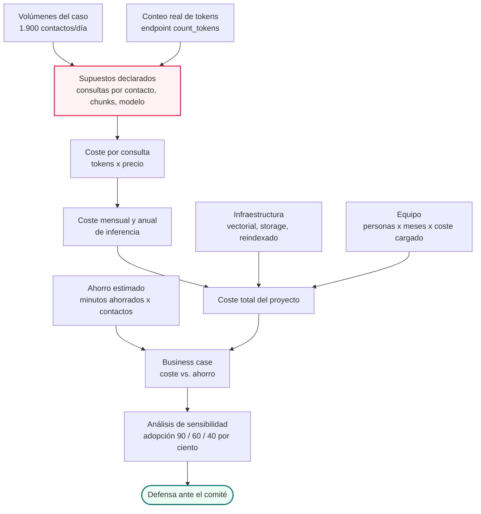
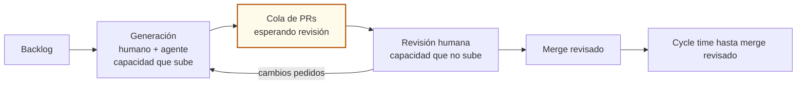
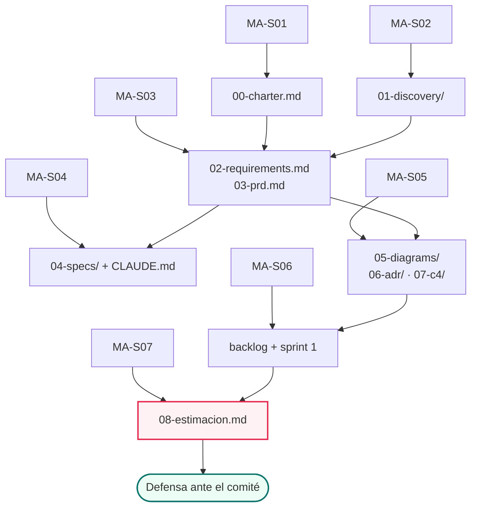
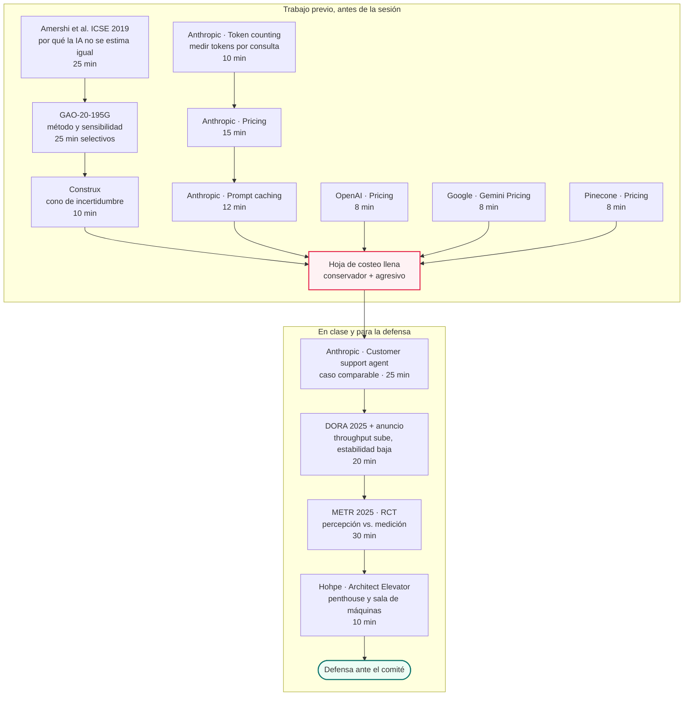
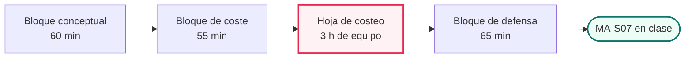

# MA·S07 — Estimación, costeo y defensa del proyecto

**Módulo A — Ingeniería de Software para AI Engineers** (módulo extra, transversal)
**Sesión 7 de 7 · última del bloque**
**Fecha:** [Completar por el profesor: fecha]
**Duración de la sesión:** 180 minutos
**Tiempo estimado de estudio:** ~3 h 30 de lectura y recursos + ~3 h de trabajo previo (hoja de costeo, cierre del expediente y guión de la defensa)

---

> ⚠️ **Esta sesión tiene trabajo previo obligatorio y no es opcional.**
> Llegás a clase con **la hoja de costeo llena** (equipo, inferencia e infraestructura, en
> escenario conservador y agresivo) y con el **expediente de VEGA cerrado**. La hoja **no se
> construye en el aula**: en clase se discuten resultados, se revisan dos hojas en vivo y se
> defiende el proyecto. Este documento está escrito para servirte sobre todo *antes* de la
> sesión: la sección 6 es el walkthrough de ese trabajo previo.

**Artefacto:** [La sesión en versión web](https://claude.ai/code/artifact/4c2e2df4-1dfd-43dd-9c1b-65abc1ce71e2) — el apunte completo como página navegable.

---

## 1. Agenda de la sesión

| Bloque | Tiempo | Qué pasa |
|---|---|---|
| **Estimación y costeo** | 55 min | Por qué la IA no se estima igual, técnicas, coste de inferencia/infra/equipo, palancas, business case, y los 10 minutos de "equipos con agentes". Se revisan en vivo las hojas de dos equipos |
| **Defensas** | 95 min | 8 minutos de presentación + 4 de preguntas cruzadas por equipo. El resto de la clase hace de comité de dirección de Nortia |
| **Cierre del bloque** | 30 min | Retrospectiva *start / stop / continue* y feedback consolidado sobre el conjunto de los expedientes |

Dos avisos operativos sobre el reparto: las defensas necesitan **~2 minutos de transición por
equipo** (montar pantalla, sentarse el siguiente) que hay que descontar del bloque de 95, y si
hay **más de 6 equipos** el bloque de estimación baja a 45 minutos: lo primero que se saca son
las palancas de optimización de coste, que quedan como lectura de este documento.

> 📝 **Nota para el profesor:** el reparto 55 / 95 / 30 es el del plan y suma 180 exactos, sin
> margen. Con 5 equipos las defensas son 60 min netos + 10 de transición; con 7, 84 + 14 y no
> entra. Conviene fijar el número de equipos antes de publicar y ajustar esta tabla.

---

## 2. Objetivos de aprendizaje

Al terminar esta sesión vas a poder:

1. **Explicar** por qué una estimación de un proyecto de IA tiene una fuente de incertidumbre
   que el software convencional no tiene, y **comunicarla** por rangos en vez de por número
   único, distinguiendo estimación, objetivo y compromiso.
2. **Aplicar** las cuatro técnicas de estimación —analogía, tres puntos, descomposición y
   juicio experto— sobre el backlog de VEGA que armaste en MA·S06.
3. **Calcular** el coste de inferencia de un sistema de IA a partir de tokens medidos y
   precios reales, proyectarlo a mes y a año, y **declarar** los supuestos de los que depende
   cada cifra.
4. **Costear** la infraestructura de un RAG —base vectorial, almacenamiento, reindexado de los
   4.100 documentos y su frecuencia— y demostrar con la propia cuenta por qué la partida de
   equipo domina el total.
5. **Elegir y justificar** palancas de optimización de coste (modelo por tarea, prompt caching,
   routing, reducción de contexto, batch, límites de rate) sabiendo cuál mueve la aguja y cuál
   no en el caso concreto.
6. **Construir** un business case con punto de equilibrio y análisis de sensibilidad, y
   **defender** el expediente completo de VEGA ante una audiencia no técnica en 8 minutos, sin
   diluir el contenido.

---

## 3. Resumen ejecutivo

Durante seis sesiones el expediente de VEGA respondió **qué** se va a construir: el charter
(MA·S01), el discovery (MA·S02), los requisitos y el PRD (MA·S03), las specs ejecutables
(MA·S04), los diagramas, el C4 y los ADR (MA·S05), y el backlog priorizado con el sprint 1
planificado (MA·S06). Hoy respondés las dos preguntas que un comité de dirección hace primero y
que ninguna de esas seis sesiones contesta: **¿cuánto cuesta?** y **¿por qué vale la pena?**.

El eje conceptual es que un proyecto de IA rompe la estimación clásica por dos lados. Por
arriba, tiene fases de investigación cuya duración no se conoce hasta que terminan —el spike de
chunking que identificaste en MA·S06 es exactamente eso—, así que hay tareas que no se estiman:
se les pone timebox y se estima **la decisión**. Por abajo, tiene una partida de coste que el
software convencional no tiene: el **coste variable por interacción**, que escala con el uso y
no con el desarrollo. Vas a aprender a ponerle número a las dos cosas con la misma disciplina:
supuestos escritos al lado de cada cifra, rangos en vez de números únicos, y tres escenarios en
todo lo que dependa de una hipótesis.

La segunda mitad de la sesión no agrega contenido: es ejercicio de comunicación. Ocho minutos
para explicarle a Marta —que no sabe ni tiene por qué saber qué es un reranker— un expediente
de siete sesiones. Es la competencia que separa a un AI Engineer que construye de uno al que
además le aprueban el presupuesto. Y es, en la práctica, la habilidad que decide si los otros
seis artefactos del expediente llegan alguna vez a ejecutarse.

---

## 4. Conceptos clave / glosario

### Estimación

| Término | Qué es |
|---|---|
| **Estimación** | Predicción de cuánto va a costar o tardar algo, hecha a partir de datos y supuestos declarados. Su propósito no es adivinar el futuro sino **saber si el objetivo es alcanzable**. |
| **Objetivo (*target*)** | Un número que viene de una necesidad de negocio, no de un cálculo: "bajar el tiempo de resolución un 30 %". No es una estimación, aunque tenga forma de número. |
| **Compromiso (*commitment*)** | La promesa que el equipo hace de entregar algo en una fecha o dentro de un coste. Es una decisión, y debería tomarse **después** de comparar la estimación con el objetivo, nunca antes. |
| **Cono de incertidumbre** | La idea de que el rango posible de una estimación es máximo al principio del proyecto y se va estrechando a medida que se toman decisiones. Analogía: al salir de casa podés decir "llego entre las 8 y las 10"; una vez que elegiste ruta, medio de transporte y hora de salida, el rango se cierra solo porque hay menos futuros posibles. |
| **Estimación por rangos** | Comunicar el resultado como intervalo ("entre 4 y 7 meses") en vez de como punto ("5 meses y medio"). Un rango honesto es más útil que un punto falso, porque el que lo recibe puede decidir con la incertidumbre a la vista. |
| **Estimación por analogía** | Estimar buscando un trabajo parecido ya hecho y ajustando por las diferencias conocidas. Es rápida y sorprendentemente buena, y depende por completo de tener datos históricos propios. |
| **Estimación de tres puntos (PERT)** | Técnica que pide tres números por tarea —optimista (O), más probable (M) y pesimista (P)— y los combina en una media ponderada `(O + 4M + P) / 6`, con una desviación estándar aproximada de `(P − O) / 6`. |
| **Descomposición (bottom-up)** | Partir el trabajo en piezas chicas, estimar cada una y sumar. Más precisa que estimar el todo de una, porque los errores individuales tienden a compensarse, pero tiene su propia trampa: lo que no está en la lista no está en el total. |
| **WBS (*Work Breakdown Structure*)** | El árbol de descomposición del trabajo: el proyecto partido en entregables y estos en paquetes de trabajo. Es la base sobre la que se hace la estimación bottom-up y sobre la que se cuelga cada partida de coste. |
| **Juicio experto / Delphi de banda ancha** | Estimar preguntándole a varias personas con experiencia, de forma **independiente** primero (para no anclarse) y discutiendo las diferencias después. La discusión de por qué uno dijo 3 y otro 15 es donde aparece el supuesto oculto. |
| **Ground rules and assumptions (supuestos declarados)** | Las condiciones bajo las cuales la estimación es válida, escritas explícitamente al lado del número. Sin esto, una estimación no se puede auditar ni actualizar: nadie sabe qué cambió cuando la realidad no coincide. |
| **Análisis de sensibilidad** | Recalcular el resultado moviendo una variable a la vez para ver de cuál depende de verdad. Es lo que convierte "el proyecto se paga en 9 meses" en "el proyecto se paga en 9 meses **si** la adopción es del 90 %; con 40 % son 20". |

### Coste de un sistema de IA

| Término                                    | Qué es                                                                                                                                                                                                                                                              |
| ------------------------------------------ | ------------------------------------------------------------------------------------------------------------------------------------------------------------------------------------------------------------------------------------------------------------------- |
| **Token**                                  | La unidad en la que los modelos cobran y cuentan texto (visto en el módulo 02). Regla de bolsillo: ~1 token ≈ 4 caracteres, pero para costear se mide, no se estima.                                                                                                |
| **MTok**                                   | Millón de tokens. Es la unidad en la que publican precio todos los proveedores, así que toda cuenta de coste empieza dividiendo por 1.000.000.                                                                                                                      |
| **Precio asimétrico entrada/salida**       | Los proveedores cobran la salida bastante más cara que la entrada. Es lo que hace fallar la intuición en un RAG: mandás miles de tokens de contexto y recibís cientos, así que **el coste vive en lo que mandás, no en lo que el modelo responde**.                 |
| **Prompt caching**                         | Guardar del lado del proveedor un prefijo de prompt que se repite entre llamadas (system prompt, documentos fijos) para no pagarlo entero cada vez. Se paga un extra al escribir la caché y una fracción al leerla.                                                 |
| **Mínimo cacheable**                       | La longitud mínima que tiene que tener el prefijo para que el proveedor lo cachee. Si te quedás por debajo, **no se cachea y no da error**: simplemente no ahorrás.                                                                                                 |
| **TTL de caché**                           | Cuánto vive la entrada cacheada antes de expirar. Con TTL corto, el ahorro depende de que las consultas lleguen seguidas.                                                                                                                                           |
| **Punto de amortización de la caché**      | Cuántas lecturas de caché hacen falta para que el sobrecoste de escribirla se pague. Antes de ese punto, cachear sale más caro que no cachear.                                                                                                                      |
| **Batch (procesamiento por lotes)**        | Mandar el trabajo de forma asíncrona, aceptando esperar, a cambio de un descuento fuerte. Sirve para reindexados y evals; no sirve para un asistente en vivo.                                                                                                       |
| **Embeddings**                             | Los vectores con los que se indexa y se busca la base de conocimiento (visto en M03·S01). Para costear, lo relevante es que su precio por token está dos órdenes de magnitud por debajo del de generación.                                                          |
| **Read Units / Write Units**               | Las unidades con las que una base vectorial gestionada cobra consultas (RU) y escrituras (WU), por separado del almacenamiento. El reindexado se paga en WU: dos pipelines con la misma arquitectura y distinta frecuencia de reindexado tienen facturas distintas. |
| **Coste mensual cargado (*fully loaded*)** | Lo que le cuesta a la empresa una persona al mes: bruto + cargas sociales + puesto + herramientas + overhead. Es el número correcto para costear equipo; el salario bruto pelado subestima.                                                                         |
| **Coste por conversación**                 | El coste variable de atender una interacción de punta a punta. Es la unidad económica del producto: si no la conocés, no sabés si escalar te conviene.                                                                                                              |
| **TCO (coste total de propiedad)**         | Todo lo que cuesta el sistema durante su vida útil: construcción + operación + mantenimiento + cumplimiento, no solo el desarrollo inicial.                                                                                                                         |

### Business case y defensa

| Término | Qué es |
|---|---|
| **Business case** | El argumento económico del proyecto: cuánto cuesta, cuánto ahorra o genera, en cuánto tiempo, y bajo qué supuestos. No es una hoja de cálculo: es una hoja de cálculo **más** la lista de lo que tiene que ser cierto para que se cumpla. |
| **Punto de equilibrio (*break-even*)** | El momento en que el beneficio acumulado iguala a la inversión acumulada. A partir de ahí el proyecto deja de consumir y empieza a devolver. |
| **Payback** | Cuánto tarda en llegar ese punto. Un comité lo escucha como "cuándo recupero la plata", y lo compara mentalmente contra las otras cosas que podría hacer con ella. |
| **Tasa de adopción** | Qué proporción de los usuarios previstos usa realmente el sistema. En un asistente interno es la variable más sensible del business case y la que menos se planifica. |
| **Cycle time hasta *merge* revisado** | El tiempo desde que se empieza una unidad de trabajo hasta que está **mergeada y revisada**, no hasta que hay código escrito. Extiende el cycle time de MA·S06 para incluir el coste de verificar lo que un agente generó. |
| **Penthouse y sala de máquinas** | Metáfora de Gregor Hohpe: el *penthouse* es la dirección, donde se decide sin detalle técnico; la *engine room* es la implementación, donde el detalle es todo. El arquitecto es quien sube y baja traduciendo entre los dos. |
| **Traducir sin diluir** | La regla de esa metáfora: para hablar con el penthouse se cambia el **vocabulario**, no el nivel del contenido. Marta no necesita saber qué es un reranker; necesita saber qué decisión se tomó, qué alternativa se descartó y qué costó. |
| **Rúbrica** | La tabla de criterios y niveles con la que se evalúa un entregable. Se publica **antes**, no después: una rúbrica que se conoce a posteriori evalúa, pero no enseña. |

---

## 5. Notas de estudio por subtema

### El flujo completo de la sesión

Todo lo que viene se ordena alrededor de un solo pipeline: de los volúmenes del caso a la
defensa, pasando por una hoja de costeo cuyo eslabón crítico son los **supuestos declarados**.



Si mirás el diagrama, la caja resaltada no es una cuenta: es la lista de supuestos. Ahí está
todo el valor y todo el riesgo del ejercicio. Dos equipos con la misma arquitectura y la misma
calculadora van a dar números que difieren en un orden de magnitud, y la diferencia va a estar
siempre en un supuesto, nunca en una multiplicación.

---

### 5.1 Por qué la estimación en IA es distinta

**El problema de fondo.** En software convencional, si una tarea se atasca, podés preguntar
"¿cuánto falta?" y obtener una respuesta que mejora con el tiempo: faltan tres endpoints, falta
el manejo de errores, faltan los tests. El progreso es acumulativo y visible. En una tarea de
investigación de IA —"conseguir que el asistente responda bien sobre importes de factura"— no
existe esa respuesta. Podés estar a un experimento de resolverlo o a treinta, y no hay forma de
saberlo desde adentro.

Esto tiene una base empírica, no es una impresión. Según el estudio de Amershi et al. sobre
equipos de ML en Microsoft (ICSE 2019), los componentes de machine learning **se resisten a la
modularización**: los modelos quedan *entangled* —enredados unos con otros y con los datos— y
sus errores **no siguen trayectorias de mejora lineales**. Si el error no baja de forma lineal
con el esfuerzo invertido, entonces no podés extrapolar: "llevo 3 días y bajé del 40 % al 30 %"
no te dice nada sobre cuántos días faltan para el 10 %.

> 💡 En MA·S06 usamos este mismo estudio para explicar por qué Scrum puro se rompe en IA. Es el
> mismo hecho leído con otra pregunta: allá, "por qué un sprint no puede comprometerse a un
> resultado experimental"; acá, "por qué la duración de un spike no se conoce hasta que
> termina".

**La consecuencia operativa: lo que no se estima, se acota.** Cuando una tarea es de
investigación, no la estimás. Le ponés un **timebox** (visto en MA·S06: el spike) y cambiás el
objeto de la estimación: en vez de estimar *cuánto tarda en funcionar*, estimás *cuánto estás
dispuesto a gastar en averiguar si funciona*. El "done" del spike es **una decisión tomada**, no
código entregado. Eso sí es estimable, porque lo fijás vos.

En VEGA esto es literal: el spike de estrategia de chunking sobre los 4.100 documentos, que
quedó abierto como ADR-0002 en MA·S05 y entró en el sprint 1 en MA·S06, **no lleva una
estimación de esfuerzo en tu hoja: lleva un timebox**. Y ese timebox sí lleva coste, porque son
días de equipo.

**Estimación, objetivo y compromiso: la distinción política de la sesión.** Es la herramienta
que más te va a servir en la vida real, y viene de Steve McConnell, *Software Estimation:
Demystifying the Black Art*:

- **Estimación**: el resultado de un cálculo. "Con este alcance y este equipo, entre 5 y 8
  meses."
- **Objetivo**: lo que el negocio necesita. "Bajar el tiempo medio de resolución un 30 %."
- **Compromiso**: lo que el equipo promete. "Entregamos el piloto el 15 de marzo."

Los tres son legítimos. El desastre empieza cuando se confunden: alguien enuncia un objetivo,
nadie hace la estimación, y el objetivo se convierte en compromiso por omisión. El equipo queda
atado a un número que **nadie calculó**.

En VEGA, el "30 % menos de tiempo de resolución" de Marta es un **objetivo**. Es perfectamente
razonable como objetivo y no tiene absolutamente nada de estimación: no salió de ningún
cálculo sobre la arquitectura que diseñaste. Tu trabajo en la defensa es presentarlo como lo que
es, y poner al lado tu estimación de qué hace falta para alcanzarlo.

**El cono de incertidumbre.** El rango de una estimación es enorme al principio del proyecto y
se va estrechando conforme avanza. El punto que casi todo el mundo se pierde: **el cono no se
estrecha con el paso del tiempo, se estrecha con las decisiones tomadas**. Un proyecto que lleva
tres meses sin haber cerrado ninguna decisión de alcance ni de arquitectura tiene exactamente la
misma incertidumbre que el primer día, con tres meses menos de plazo.

| Momento del proyecto | Qué se decidió ya | Ancho del rango |
|---|---|---|
| Idea inicial | Nada. Ni siquiera el alcance | Máximo |
| Charter aprobado (MA·S01) | Problema, alcance grueso, criterios de éxito | Muy ancho |
| Requisitos y PRD (MA·S03) | Qué hace y qué no hace el sistema | Ancho |
| Arquitectura y ADR (MA·S05) | Cómo se construye, qué componentes, qué proveedor | Medio |
| Sprint 1 ejecutado, spikes cerrados | Cómo se comporta el sistema de verdad | Estrecho |

La lección operativa, que es la única que tenés que llevarte: **no te comprometas en la parte
ancha del cono**. Si te piden un compromiso ahí, das un rango y decís qué decisión hay que tomar
para cerrarlo.

> ⚠️ **Gotcha clásico.** "Estimá por rangos" suena a excusa si no explicás por qué. La forma de
> que no suene así es dar el rango **junto con la palanca**: "entre 5 y 8 meses; la diferencia
> depende de si el spike de chunking cierra en dos semanas o en seis, y podemos saberlo en el
> sprint 1". Un rango con una fecha de reducción de incertidumbre es una respuesta profesional;
> un rango sin nada es una evasiva.

**Para profundizar:** [Amershi et al., *Software Engineering for Machine Learning: A Case Study*
(ICSE 2019)](https://www.microsoft.com/en-us/research/publication/software-engineering-for-machine-learning-a-case-study/) ·
[Construx — *The Cone of Uncertainty*](https://www.construx.com/books/the-cone-of-uncertainty/)

---

### 5.2 Técnicas de estimación

Cuatro técnicas. No compiten: se combinan, y cuando dos te dan resultados muy distintos, la
diferencia es información.

**1. Analogía.** Buscás un trabajo parecido ya hecho —idealmente por vos o por tu equipo— y
ajustás por las diferencias conocidas. "El RAG del proyecto anterior sobre 1.200 documentos nos
llevó 6 semanas; este tiene 4.100 documentos y además hay que integrar el CRM, así que 9 o 10."
Es rápida y, con datos históricos propios, sorprendentemente buena. Su límite es obvio: si no
tenés historia, no tenés analogía. Por eso **anotar cuánto tardaste de verdad es una inversión
en estimaciones futuras**, y es la práctica que ningún equipo junior tiene.

**2. Estimación de tres puntos, también llamada PERT.** En vez de un número, das tres por cada
tarea:

- **O** — optimista: si todo sale bien.
- **M** — más probable: el caso normal.
- **P** — pesimista: si sale mal (pero no catastrófico; no es "si se incendia la oficina").

Y los combinás:

```
estimación esperada  E = (O + 4·M + P) / 6
desviación estándar  σ = (P − O) / 6
```

La media ponderada le da peso 4 al caso probable y 1 a cada extremo: es una forma de decir "creo
en el caso normal, pero reconozco que la cola pesimista existe". La σ te da el ancho: una tarea
con O=2, M=3, P=10 tiene E = (2 + 12 + 10)/6 = 4 días y σ = 1,33 días — el número esperado se
corrió hacia arriba respecto del "más probable" solo por tener una cola larga.

Ejemplo aplicado a VEGA:

| Tarea | O | M | P | E = (O+4M+P)/6 | σ = (P−O)/6 |
|---|---|---|---|---|---|
| Ingesta y chunking de los 4.100 documentos | 5 d | 8 d | 20 d | 9,5 d | 2,5 d |
| Integración de solo lectura contra el CRM | 3 d | 6 d | 25 d | 8,7 d | 3,7 d |
| Interfaz del agente en el escritorio | 4 d | 6 d | 9 d | 6,2 d | 0,8 d |

Mirá la tercera columna de la derecha frente a la última: las tres tareas tienen esperanzas
parecidas (9,5 / 8,7 / 6,2 días) pero riesgos completamente distintos. La integración con el CRM
tiene σ = 3,7 porque Diego Amat no quiere que nada toque producción y no sabés todavía qué te va
a dejar hacer. **Esa columna es la que le mostrás al comité**, no la de la media.

> 💡 Cómo se comunica el resultado: no digas "8,7 días". Decí "entre 6 y 12 días, con el
> pesimista en 25 si el acceso al CRM se complica". El comité no necesita tu aritmética;
> necesita saber dónde está el riesgo.

**3. Descomposición bottom-up sobre el WBS.** Partís el trabajo hasta que cada pieza sea
estimable con confianza (regla práctica: nada por encima de una semana), estimás cada pieza y
sumás. Es más precisa que estimar el conjunto de una, porque las sobreestimaciones y
subestimaciones individuales tienden a compensarse.

Su trampa tiene nombre propio: **lo que no está en la lista no está en el total**. Un WBS de
software junior siempre omite lo mismo —integración, migración de datos, corrección de bugs
encontrados en QA, documentación, despliegue, formación de usuarios, reuniones—. Y en un
proyecto de IA se suma una omisión específica: **los evals**. Construir el conjunto de casos de
prueba con los que vas a decidir si el asistente responde bien (M08) es trabajo real y casi
nadie lo pone en el WBS.

Tu WBS de VEGA no lo tenés que inventar: es el backlog priorizado que armaste en MA·S06, más las
partidas que un backlog de producto no incluye.

**4. Juicio experto y Delphi de banda ancha.** Preguntás a varias personas con experiencia. La
clave es el procedimiento: **primero cada uno estima solo y en silencio**, después se revelan
todas a la vez, y **solo se discuten los extremos**. Si vos dijiste 3 días y otra persona dijo
15, la conversación interesante no es "¿nos ponemos en 9?": es "¿qué sabés vos que yo no sé?".
Casi siempre aparece un supuesto que uno de los dos tenía y el otro no.

Es exactamente el mecanismo del planning poker que practicaste en MA·S06, aplicado a estimación
absoluta en vez de relativa. Y la razón de la revelación simultánea es la misma: evitar el
anclaje.

> ⚠️ **El error más común de todos.** Estimar el esfuerzo y llamarlo plazo. Que una tarea sean
> 10 días-persona no significa que salga en 10 días: hay que dividir por la capacidad real del
> equipo, que nunca es del 100 % (vacaciones, soporte, reuniones, contexto), y respetar las
> dependencias. En MA·S06 fijamos el sprint al 60 % de capacidad justamente por esto.

**Para profundizar:** [GAO — *Cost Estimating and Assessment Guide* (GAO-20-195G, 2020)](https://www.gao.gov/products/gao-20-195g),
capítulos de metodologías de estimación · Steve McConnell, *Software Estimation: Demystifying the
Black Art* · [Douglas Hubbard, *How to Measure Anything* (1.ª ed., 2007)](https://hubbardresearch.com/publications/how-to-measure-anything-book/)

> 💡 Hubbard vale como antídoto contra la excusa favorita del equipo técnico —"eso no se puede
> medir"—. La tesis, en palabras de su propio sitio: *"anything can be measured, and if you can
> measure it – and it matters – then you can make better decisions"*. Medir no es alcanzar la
> certeza: es **reducir la incertidumbre**. Conecta directo con los NFR medibles de MA·S03: si
> escribiste "tasa de alucinación tolerable ≤ X %", ya aceptaste esa premisa.

---

### 5.3 Coste de inferencia

Esta es la partida que el software convencional no tiene: un **coste variable por interacción**
que escala con el uso, no con el desarrollo. Si VEGA funciona bien y lo usan más, cuesta más. Eso
cambia la conversación con el comité, porque el coste no termina cuando termina el proyecto.

#### La fórmula

```
coste_por_consulta = (tokens_entrada / 1.000.000) × precio_entrada
                   + (tokens_salida  / 1.000.000) × precio_salida

coste_por_contacto = coste_por_consulta × consultas_por_contacto
coste_mensual      = coste_por_contacto × contactos_por_día × días_del_mes
coste_anual        = coste_mensual × 12
```

Y con caching, la entrada se parte en dos:

```
coste_entrada = (tokens_no_cacheados / 1.000.000) × precio_entrada
              + (tokens_cacheados    / 1.000.000) × precio_entrada × 0,1
```

Es aritmética de primaria. **Toda la dificultad está en los cuatro números que entran**, y tres
de ellos son supuestos tuyos.

#### Los precios

> ⏱️ **Todos los precios de esta sección se consultaron el 29 de agosto de 2026 en las páginas
> oficiales de cada proveedor.** Los precios de inferencia cambian: **verificá cada cifra contra
> la página del proveedor antes de usarla en una hoja real**. Lo que no caduca es la metodología
> —tokens × precio— y las palancas.

Según la página de precios de la API de Anthropic (29 ago 2026), en dólares por millón de
tokens:

| Modelo | Entrada | Salida |
|---|---|---|
| Claude Opus 5 | $5 | $25 |
| Claude Sonnet 5 | $2 | $10 |
| Claude Haiku 4.5 | $1 | $5 |

Según la página de precios de la API de OpenAI (29 ago 2026):

| Modelo | Entrada | Entrada cacheada | Salida |
|---|---|---|---|
| GPT-5.6-Terra | $2,00 | $0,20 | $12,00 |
| GPT-5.6-Luna | $0,20 | $0,02 | $1,20 |
| GPT-5-mini | $0,25 | $0,025 | $2,00 |
| GPT-5-nano | $0,05 | $0,005 | $0,40 |
| `text-embedding-3-small` | $0,02 | — | — |
| `text-embedding-3-large` | $0,13 | — | — |

Según la página de precios de la Gemini API (29 ago 2026):

| Modelo | Entrada | Salida | Nota |
|---|---|---|---|
| Gemini 3.7 Flash | $0,75 | $3,75 | precio vigente *through December 31, 2026* |
| Gemini 3.7 Flash **desde el 1 de enero de 2027** | $1,50 | $7,50 | subida ya anunciada por Google |
| Gemini 3.5 Flash | $1,50 | $9,00 | |
| Gemini 3.5 Flash-Lite | $0,30 | $2,50 | |
| Gemini Embedding 2 (texto) | $0,20 | — | |
| Gemini Embedding 001 | $0,15 | — | |

Context caching de Gemini 3.7 Flash: $0,075 / MTok. Las tres plataformas ofrecen **50 % de
descuento en su modo batch** sobre el precio estándar.

> ⚠️ **Por qué una hoja de costeo lleva fecha, con un ejemplo que no admite discusión.** La
> propia página de Google anuncia que el precio de Gemini 3.7 Flash **se duplica el 1 de enero
> de 2027**. Un business case a tres años construido sobre el precio de hoy, sin escenario de
> subida, ya nace roto. Si tu hoja no dice de qué día son sus precios, nadie —ni vos dentro de
> seis meses— puede saber si sigue valiendo.

**Dos observaciones que cambian cómo diseñás, no solo cómo costeás:**

1. **La salida cuesta ~5× la entrada** en toda la familia Claude, y ~6× en GPT-5.6-Terra. Pero
   en un RAG mandás miles de tokens de contexto y recibís cientos: en la práctica, **el coste
   vive en el contexto que enviás**. Recuperar 10 chunks en vez de 5 duplica el coste de entrada
   de cada consulta.
2. **Los embeddings son dos órdenes de magnitud más baratos que la generación.**
   `text-embedding-3-small` a $0,02/MTok contra Haiku 4.5 a $1/MTok de entrada. La partida que
   más miedo da —"indexar 4.100 documentos"— es la más barata de todas. Lo vas a comprobar en un
   minuto.

#### El ancla: el ejemplo de la propia documentación

El ejemplo trabajado de la doc de Anthropic (29 ago 2026) costea un asistente de soporte al
cliente: **~3.700 tokens por conversación con Haiku 4.5 → ~$37 por cada 10.000 tickets**. Es
decir, unos $0,0037 por ticket.

Guardátelo como punto de comparación, porque tu cuenta de VEGA va a dar más alto. **Eso no
significa que una de las dos esté mal**: significa que los supuestos son distintos. Ellos
costean una conversación de ~3.700 tokens; vos vas a costear dos consultas de 8.000 tokens de
entrada cada una, porque tu arquitectura mete contexto recuperado de una base de 4.100
documentos. La diferencia entre las dos cuentas **es** una decisión de arquitectura, y tenés que
poder explicarla.

#### VEGA costeado: tres escenarios

Volúmenes del caso (los conocés desde MA·S01): **1.900 contactos/día**, picos de 3.400, 42
agentes, 4.100 documentos, 11 minutos de tiempo medio de resolución.

Supuestos de uso, que son **tuyos y hay que escribirlos**: 2 consultas al asistente por contacto
· 8.000 tokens de entrada por consulta (system prompt + 5 chunks recuperados + la pregunta del
agente) · 400 tokens de salida · 30 días por mes.

| Escenario | La cuenta | Por consulta | Por contacto | Mes | Año |
|---|---|---|---|---|---|
| **Conservador** — Haiku 4.5, sin caching | 8.000 × $1/M + 400 × $5/M | $0,0100 | $0,0200 | ~$1.140 | ~$13.680 |
| **Con caching** — Haiku 4.5, 6.000 tokens leídos de caché | 2.000 × $1/M + 6.000 × $0,10/M + 400 × $5/M | $0,0046 | $0,0092 | ~$524 | ~$6.290 |
| **Agresivo** — Sonnet 5, sin caching | 8.000 × $2/M + 400 × $10/M | $0,0200 | $0,0400 | ~$2.280 | ~$27.360 |

Rehacé la primera fila a mano para convencerte:

```
entrada: 8.000 / 1.000.000 × $1  = $0,008
salida:    400 / 1.000.000 × $5  = $0,002
                                 ---------
por consulta                       $0,010
× 2 consultas por contacto       = $0,020
× 1.900 contactos × 30 días      = $1.140 / mes
× 12                             = $13.680 / año
```

**Rango completo: entre ~$6.300 y ~$27.400 al año de inferencia**, un factor 4,3 entre extremos,
sin cambiar ni una línea de arquitectura. Solo cambian el modelo y si el caching funciona.

#### Prompt caching: la palanca número uno, con letra chica

En un asistente de soporte, el system prompt y buena parte del contexto se repiten en cada
consulta: es el escenario ideal para cachear. Según la doc de prompt caching de Anthropic
(29 ago 2026):

- **Multiplicadores** sobre el precio base de entrada: escritura de caché de 5 minutos
  **1,25×**, escritura de 1 hora **2×**, **lectura 0,1×**.
- **TTL** por defecto de **5 minutos**, que se refresca sin coste cada vez que se usa la
  entrada; TTL extendido de **1 hora** con sobrecoste.
- **Mínimo cacheable por modelo:** **512 tokens** en Opus 5, **1.024** en Sonnet 5 y en
  Sonnet 4.6/4.5, **4.096** en Haiku 4.5.
- **Punto de amortización**, en palabras de la propia doc: *"caching pays off after one cache
  read for the 5-minute duration (1.25x write), or after two cache reads for the 1-hour duration
  (2x write)"*.

> ⚠️ **El gotcha que convierte una estimación optimista en una factura sorpresa.** Con Haiku 4.5
> el prefijo tiene que superar los **4.096 tokens** o no se cachea nada. Y **no da error**:
> simplemente no ahorrás. Si tu hoja tiene la fila "con caching" pero tu system prompt son 900
> tokens, la fila del medio de la tabla de arriba **no existe** y vas a pagar la de la primera.
> Es el ejemplo perfecto de supuesto que hay que declarar *y verificar*.

**Para profundizar:** [Anthropic — Pricing](https://platform.claude.com/docs/en/about-claude/pricing) ·
[Anthropic — Prompt caching](https://platform.claude.com/docs/en/build-with-claude/prompt-caching) ·
[OpenAI — API Pricing](https://developers.openai.com/api/docs/pricing) ·
[Google — Gemini API Pricing](https://ai.google.dev/gemini-api/docs/pricing) ·
[Anthropic — Customer support agent](https://platform.claude.com/docs/en/about-claude/use-case-guides/customer-support-chat)

> 📝 **Nota para el profesor:** el plan deja los supuestos de uso como incógnitas literales ("X
> consultas por contacto, Y tokens por consulta"). Los defaults escritos acá son **2 consultas
> por contacto y 8.000 / 400 tokens**, y los tres escenarios están calculados con ellos. Si
> preferís otros valores, cambian las tres filas de la tabla y la cuenta del business case;
> conviene fijarlos antes de repartir la plantilla al terminar MA·S06.

---

### 5.4 Coste de infraestructura y de equipo

#### Infraestructura: la base vectorial

Pinecone es el stack que ya usaste en M03·S01, así que se puede costear con números reales.
Según la página de precios de Pinecone (29 ago 2026): Starter gratis; **Builder $20/mes**
planos; **Standard con $50/mes de consumo mínimo**; Enterprise con $500/mes de mínimo.
Almacenamiento a **$0,33/GB/mes**, **Read Units a $16–$18 por millón** (en Standard, varía por
nube y región) y **Write Units a $4–$4,50 por millón**.

Lo importante de esa estructura de precios: **almacenar es barato y constante; escribir se paga
cada vez**. Por eso la pregunta que tu hoja tiene que contestar no es "¿cuánto cuesta la base
vectorial?" sino **"¿cada cuánto reindexamos los 4.100 documentos?"**. Un pipeline que reindexa
entero todas las noches y otro que reindexa incrementalmente solo lo que cambió tienen la misma
arquitectura en el C4 y facturas distintas.

#### El reindexado: la partida que asusta y no importa

Supuesto: 5.000 tokens de media por documento.

```
4.100 documentos × 5.000 tokens         = 20.500.000 tokens = 20,5 MTok
20,5 MTok × $0,02 / MTok (text-embedding-3-small)  ≈ $0,41 por reindexado completo
```

**Cuarenta y un centavos.** Reindexar la base entera **todas las noches durante un año** cuesta
unos **$150** en embeddings. Es la cifra que más sorprende de toda la sesión, y por eso conviene
que la calcules vos y no que te la crean.

Lo que sí pesa del lado de la base vectorial son las **Write Units** de cada reindexado y el
**mínimo mensual del tier** ($50/mes en Standard), no los embeddings. Y ahí sí la frecuencia de
reindexado importa de verdad.

#### Las partidas que no tienen número (y se declaran igual)

| Partida | Qué incluye | Cómo se resuelve en la hoja |
|---|---|---|
| **Almacenamiento** | GB de índice + documentos originales | $0,33/GB/mes, estimando el tamaño del corpus |
| **Cómputo** | El backend que orquesta (M07), colas, workers | Según el proveedor de hosting elegido |
| **Observabilidad** | Trazas de las llamadas al LLM, latencias, coste por request, evaluación en producción | **Celda vacía**: el número depende de la herramienta que se elija y del volumen de trazas. La partida existe y se declara |
| **Cumplimiento y auditoría** | Documentación técnica, auditoría, registro si el sistema entra en el ámbito del AI Act | **Celda vacía**: se cierra en M08. Cristina Roa (DPO) todavía no sabe si VEGA entra |

> 💡 Aparecer en la defensa con esas dos celdas **vacías y etiquetadas** es mejor respuesta ante
> un comité que no tener las filas: demuestra que identificaste el coste aunque todavía no lo
> puedas cuantificar. Poner un número inventado es peor que dejarlas en blanco, porque el número
> inventado se propaga al total y nadie lo distingue de los buenos.

#### El equipo: por qué es la partida dominante

Acá no hay recurso ni hace falta. Es aritmética:

```
coste_equipo = Σ (personas_por_rol × meses × coste_mensual_cargado)
```

Con el default del bloque —**3 personas durante 6 meses**: 1 AI engineer, 1 backend, y 0,5 de
PM/PO más 0,5 de data/ops repartidos— son **18 persona-mes**.

Ahora poné las dos cifras una al lado de la otra:

| Partida | Al año |
|---|---|
| Inferencia (rango de los tres escenarios) | ~$6.300 – $27.400 |
| Reindexado nocturno completo | ~$150 |
| Base vectorial (mínimo del tier Standard) | ~$600 |
| **Equipo (18 persona-mes)** | **18 × ⟨coste mensual cargado⟩** |

Poné cualquier coste mensual cargado realista en esa última celda y vas a ver que el total de
equipo queda **uno o dos órdenes de magnitud por encima** de todo lo demás junto. Esa es la
conclusión de la sesión, y es importante que la enuncies como lo que es: **el resultado de esta
cuenta concreta con estos supuestos**, no una estadística del sector.

La consecuencia práctica es incómoda y muy útil: **optimizar el prompt para ahorrar tokens es
casi siempre optimizar lo que no importa**. Bajar la factura de inferencia a la mitad ahorra
miles de dólares al año; una semana de retraso del equipo cuesta más que eso. Lo que mueve el
business case es el plazo, la adopción y el coste de equipo.

> 📝 **Nota para el profesor:** el coste mensual cargado se deja como celda a completar a
> propósito —no se inventa un salario—. Hace falta fijar un número (o un rango por perfil) antes
> de la sesión para que los equipos puedan cerrar el total y para que la conclusión "el equipo
> domina" quede demostrada y no enunciada. Igual con el tamaño y la composición del equipo, si
> el default de 3 personas × 6 meses no es el que querés.

**Para profundizar:** [Pinecone — Pricing](https://www.pinecone.io/pricing/)

---

### 5.5 Palancas de optimización de coste

Ordenadas por relación ahorro/esfuerzo. La primera columna es lo que hacés; la última, si vale
la pena en VEGA.

| Palanca | Qué hacés | Ahorro típico | ¿Sirve en VEGA? |
|---|---|---|---|
| **Modelo por tarea** | Usás el modelo más chico que resuelve cada tarea, no el mejor para todas. La propia doc de Anthropic lo dice: *"Choose Haiku for simple tasks, Sonnet for most production workloads, and Opus for the most complex reasoning"* | Mover una tarea de Opus 5 a Haiku 4.5 divide entrada y salida por 5 | Sí, y es la de mayor impacto: la diferencia entre el escenario conservador y el agresivo **es** esta decisión |
| **Prompt caching** | Cacheás el prefijo estable (system prompt + documentos fijos) | Lectura a 0,1× del precio de entrada | Sí, pero **verificando el mínimo cacheable del modelo** |
| **Routing a modelo pequeño** | Clasificás la consulta y mandás las fáciles al modelo barato | En OpenAI, de $2,00 a $0,05 de entrada entre el modelo grande y el nano | Sí, si el 23 % de contactos de "no entiendo mi factura" resulta ser mayormente resoluble con el modelo chico |
| **Reducción de contexto** | Recuperás menos chunks, o los recortás antes de mandarlos | Lineal: la mitad de chunks, la mitad del coste de entrada | Sí, y engancha con el ADR de chunking de MA·S05 y el spike de MA·S06 |
| **Batch** | Mandás el trabajo asíncrono | 50 % en Anthropic, OpenAI y Google | Solo para reindexado y evals. **No** para el asistente en vivo |
| **Límites de rate** | Configurás topes de peticiones por minuto | Ninguno | No es un ahorro: es un **techo de gasto** y, en los picos de 3.400 contactos, un riesgo de disponibilidad |

> ⚠️ La última fila es la que más se malinterpreta. Un rate limit no baja la factura: la corta.
> En un pico de 3.400 contactos, un límite mal puesto no te ahorra plata, te deja a los agentes
> sin asistente justo el día que más lo necesitan. En la hoja va como control de riesgo, no como
> palanca de ahorro.

> 💡 **Herramienta de decisión.** Antes de aplicar cualquier palanca, calculá cuánto ahorra en
> euros al año y compará contra el coste de implementarla y mantenerla. Si una palanca ahorra
> $3.000/año y cuesta dos semanas de un ingeniero, no la implementes: perdés plata.

---

### 5.6 Business case: coste, ahorro, equilibrio y sensibilidad

Un business case tiene dos lados y una lista. El lado del coste ya lo tenés. Falta el del
ahorro, y la lista de lo que tiene que ser cierto.

#### El lado del ahorro

Con los datos del caso y suponiendo que se cumple el objetivo de Marta —bajar el tiempo medio de
resolución de 11 a 7,7 minutos, un 30 %—:

```
ahorro por contacto        = 11 − 7,7 = 3,3 min
contactos por día          = 1.900
ahorro bruto               = 6.270 min/día ≈ 104,5 h/día
                           ≈ 2.300 h/mes (22 días hábiles)
equivalente en plantilla   ≈ 13-14 agentes a jornada completa, de los 42
```

> ⚠️ **Cuidado con esa última línea, sobre todo delante de Iván Ferreras.** "Equivale a 13-14
> agentes" **no** significa "despedimos a 13 agentes". Puede significar absorber los picos de
> 3.400 sin contratar temporales, bajar la cola de espera, o reducir las 7 semanas que tarda un
> agente nuevo en ser autónomo. Cómo presentás esta cifra es una decisión política, y en la
> defensa vas a tener a Iván enfrente. Presentala como **capacidad liberada**, y decí en qué la
> reinvertís.

#### El punto de equilibrio

El punto de equilibrio es el mes en el que el ahorro acumulado alcanza a la inversión acumulada:

```
inversión acumulada(t) = coste de equipo hasta t + coste de inferencia e infra hasta t
ahorro acumulado(t)    = ahorro mensual × meses en producción × tasa de adopción

punto de equilibrio: el primer t donde ahorro acumulado(t) ≥ inversión acumulada(t)
```

Dibujalo mentalmente como dos rectas: la de inversión arranca alta y sube fuerte durante los 6
meses de construcción, después se aplana (solo queda el coste variable); la de ahorro arranca en
cero y **empieza a subir recién cuando el sistema está en producción y la gente lo usa**. El
cruce es el break-even.

> 💡 **La pregunta interesante no es "¿cuándo se paga?".** Cualquier hoja de cálculo te devuelve
> un mes. La pregunta que un comité serio hace —y que vos deberías hacerte antes— es **"¿qué
> tiene que ser cierto para que se pague?"**. En VEGA la respuesta es: que los 42 agentes lo
> usen de verdad, que el ahorro por contacto sea real y no autopercibido, y que el proyecto
> salga en 6 meses y no en 11.

#### El análisis de sensibilidad

Esto no es un extra: la guía de estimación de costes de la GAO (GAO-20-195G, 2020) trata el
análisis de sensibilidad y el análisis de riesgo como **componentes obligatorios** de una
estimación fiable. Una estimación sin sensibilidad no es auditable, porque nadie puede saber de
qué depende.

La regla que te llevás: **toda cifra del business case que dependa de un supuesto se presenta en
tres escenarios, con el supuesto escrito al lado.**

La variable más sensible de VEGA no es el precio del modelo: es **la tasa de adopción**.

| Adopción real | Ahorro efectivo | Equivalente en plantilla |
|---|---|---|
| 90 % | ~94 h/día | ~12 agentes |
| 60 % | ~63 h/día | ~8 agentes |
| **40 %** | **~42 h/día** | **~5 agentes** |

Ahora comparalo con la sensibilidad al precio: mover de Sonnet 5 a Haiku 4.5 cambia unos $14.000
al año. Bajar la adopción del 90 % al 40 % cambia **52 horas diarias de plantilla**. No están en
la misma escala ni cerca.

**Conclusión, y es la tesis económica de la sesión:** el business case de VEGA **no es sensible
al precio de la inferencia**; es sensible a la **tasa de adopción** y al **coste de equipo**. Un
equipo que llega a la defensa habiendo optimizado el prompt en vez de haber pensado cómo
consigue que los 42 agentes usen VEGA, optimizó lo que no importa.

Eso te da además la partida que casi nadie pone en el WBS: **el trabajo de adopción**.
Formación, acompañamiento, campeones internos, medición de uso. Es lo que mueve la variable de
la que todo depende, y no está en tu backlog de MA·S06.

**Para profundizar:** [GAO — *Cost Estimating and Assessment Guide* (GAO-20-195G, 2020)](https://www.gao.gov/products/gao-20-195g),
capítulos de análisis de sensibilidad y de riesgo

> 📝 **Nota para el profesor:** el plan dice que "la Dirección ha aprobado un presupuesto" y
> nunca dice cuál. El default escrito acá es que la defensa se hace **sin cifra de presupuesto**
> y el equipo presenta su coste por rango pidiendo la comparación en vez de darla —conducta
> correcta según la distinción estimación/objetivo/compromiso—. Fijar una cifra (por ejemplo,
> 150.000 € a 12 meses) le daría al ejercicio la tensión real de tener que decir "no entra". Es
> el gap que se arrastra desde MA·S01 y el que más pesa en esta sesión.

---

### 5.7 Equipos con agentes: la generación sube, la verificación no

Diez minutos de la sesión, pero es la parte que más te va a cambiar cómo estimás tu propio
trabajo a partir de ahora.

**El dato que hay que leer con cuidado.** El informe DORA 2025, publicado por Google Cloud
(*2025 DORA Report: State of AI-Assisted Software Development*, anunciado el 23 de septiembre de
2025), reporta que el **90 %** de los encuestados usa IA en el trabajo, que **más del 80 %** cree
que le subió la productividad, y que un **30 %** declara poca o ninguna confianza en el código
generado por IA. Y encuentra dos relaciones simultáneas: una **positiva** entre adopción de IA y
throughput de entrega, y una **negativa** entre adopción de IA y **estabilidad** de la entrega.
Su tesis de cabecera es que *"AI's primary role is as an amplifier, magnifying an organization's
existing strengths and weaknesses"*.

**El dato que lo complica.** El ensayo controlado de METR (julio de 2025) tomó 16 desarrolladores
open-source experimentados y 246 issues reales de sus propios repositorios, asignando al azar
permiso o prohibición de usar herramientas de IA en cada tarea. Resultado medido: con IA
permitida tardaron un **19 % más**. Y el dato que lo vuelve material de clase: **los mismos
desarrolladores creían haber ido un 20 % más rápido**, y antes del estudio esperaban un 24 % de
aceleración.

Leelos con sus límites declarados: METR es una muestra chica, de tareas grandes en código propio
que los participantes ya conocían, con herramientas de principios de 2025. No es una ley
universal. Y DORA mide throughput de entrega en organizaciones, no tiempo de resolver un issue.

**La contradicción aparente es la clase.** Miden cosas distintas, en contextos distintos. Y por
eso **la métrica que elegís decide la conclusión**. Si medís líneas de código o PRs abiertos, la
IA es un éxito rotundo. Si medís estabilidad, o tiempo hasta que la cosa está realmente
terminada, la foto cambia.



El cuello de botella se movió. Antes estaba en escribir el código; ahora está en **revisarlo**,
y la capacidad de revisión de un humano no subió nada. El resultado es la cola resaltada: PRs
generados más rápido de lo que se pueden verificar, esperando. Y como esa cola no aparece en
ninguna métrica de "productividad", el equipo tiene la sensación de ir más rápido mientras el
trabajo se acumula en el paso que no se ve.

**La métrica que no miente: el cycle time hasta *merge* revisado.** Extendé el cycle time que
viste en MA·S06 para que el cronómetro pare cuando el cambio está mergeado y revisado, no cuando
hay código escrito. Si el throughput sube pero el rework también, esa es la única métrica que
incorpora el coste de arreglar lo que se rompió.

**Qué significa esto para tu estimación.** Si tu equipo planifica "con agentes" y descuenta un
30 % del plazo por eso, estás estimando por sensación en un terreno donde la sensación se
equivocó en 39 puntos porcentuales respecto de la medición. **La velocidad con agentes no se
estima: se mide.** Y se mide en tu equipo, con tu código, no con el número de un informe.

> 💡 Y el marco de DORA es exactamente lo que un comité necesita oír antes de aprobar
> presupuesto: la IA amplifica lo que ya hay. **La herramienta no arregla un proceso roto**, lo
> hace fallar más rápido.

**Para profundizar:** [DORA — *State of AI-assisted Software Development 2025*](https://dora.dev/dora-report-2025/) ·
[Google Cloud — anuncio del informe](https://cloud.google.com/blog/products/ai-machine-learning/announcing-the-2025-dora-report) ·
[METR — *Measuring the Impact of Early-2025 AI on Experienced Open-Source Developer Productivity*](https://metr.org/blog/2025-07-10-early-2025-ai-experienced-os-dev-study/)

---

### 5.8 La defensa: comunicar el expediente a un comité no técnico

#### El marco

Gregor Hohpe describe al arquitecto como quien viaja en el **ascensor**: la *engine room* (sala
de máquinas) es la implementación técnica; el *penthouse* es la dirección. El trabajo consiste en
*"connect the IT engine room with the executive penthouse through model thinking, decision
discipline, and metaphors"*. Y añade dos exigencias que juntas son toda la dificultad:
*"successful architects must engage at all levels of an organization"*, y hacerlo **sin diluir el
mensaje**.

Traducido a tus 8 minutos: **no bajás el nivel del contenido, cambiás el vocabulario**. Marta no
necesita saber qué es un reranker. Necesita saber qué decisión tomaste, qué alternativa
descartaste y qué costó. Si reemplazás jerga por vaguedad ("usamos técnicas avanzadas de IA")
diluiste; si reemplazás jerga por **decisiones y trade-offs explícitos** ("elegimos reindexar una
vez por semana en vez de cada noche: ahorra escrituras y acepta hasta 7 días de desfase en
circulares nuevas"), tradujiste.

#### La anatomía de los 8 minutos

Un guión que funciona, con presupuesto de tiempo. Los porcentajes son orientativos, pero el
**orden no es negociable**: problema antes que solución, siempre.

| # | Parte | Tiempo | Qué decís | Qué NO decís |
|---|---|---|---|---|
| 1 | **Problema** | 1:30 | El dolor en el lenguaje de ellos: 1.900 contactos/día, 11 min de resolución, 60 % del tiempo buscando en 4.100 documentos, 7 semanas de rampa | Nada de tecnología. Todavía no |
| 2 | **Solución propuesta** | 1:00 | Qué hace VEGA en una frase que un no técnico repite sin errores | Cómo está construido |
| 3 | **Alcance** | 1:00 | Qué entra y —sobre todo— **qué no entra**. El alcance excluido es lo que evita las expectativas rotas | "Ya veremos" |
| 4 | **Arquitectura** | 1:30 | El C4 nivel 1, y como mucho el nivel 2. Una decisión con su alternativa descartada (un ADR contado en 20 segundos) | El diagrama de clases. El de secuencia. Nada de UML |
| 5 | **Plan** | 1:30 | Fases, hitos, y **dónde está la incertidumbre**: el spike, el timebox, qué decisión lo cierra | Un Gantt de 40 barras |
| 6 | **Coste y business case** | 1:30 | El rango, los supuestos que lo mueven, el punto de equilibrio y la sensibilidad a la adopción | Un número único sin supuestos |

Reglas de escenario:

- **La primera diapositiva que se borra si te pasás de tiempo es la de arquitectura**, no la de
  coste. Duele, y es correcto: el comité aprueba presupuesto, no diseño.
- **Nunca des un número puntual sin su rango y su supuesto.** "Unos 60.000 € entre 5 y 8 meses,
  suponiendo un equipo de 3 personas y que el spike de chunking cierre en el sprint 2."
- **Decí explícitamente qué es objetivo y qué es estimación.** "El 30 % de reducción es el
  objetivo que nos dieron; nuestra estimación dice que es alcanzable si la adopción supera el
  60 %."
- **Las celdas vacías se muestran, no se esconden.** Observabilidad y cumplimiento van con su
  etiqueta y su fecha de cierre.

#### Cómo se responde una pregunta cuya respuesta no sabés

Es el momento que más se practica y menos se enseña. La secuencia que funciona:

1. **Reconocé el límite sin adornos.** "No lo sé."
2. **Decí de qué depende.** "Depende de si el CRM permite lectura por API o hay que exportar; no
   lo hemos podido confirmar con Diego."
3. **Decí cuándo lo vas a saber.** "Lo cerramos en la primera semana del sprint 1."
4. **Ofrecé el rango mientras tanto.** "Si es API, dos días; si hay que exportar, dos semanas."

Lo que **no** hacés: inventar un número. En un comité, un número inventado que después falla te
cuesta la credibilidad de todos los demás, incluidos los que estaban bien.

#### La rúbrica con la que te evalúan

Se proyecta durante las defensas. Cinco criterios, peso igual, escala 1-4.

| Criterio | 1 · Insuficiente | 2 · En camino | 3 · Sólido | 4 · Ejemplar |
|---|---|---|---|---|
| **Coherencia del expediente** | Los artefactos se contradicen entre sí | Coinciden a grandes rasgos, con huecos | Diagramas, backlog y coste responden al mismo PRD | Además, las inconsistencias detectadas están documentadas y resueltas |
| **Trazabilidad** | No se puede seguir ninguna decisión | Se sigue alguna, con saltos | Se sigue una decisión de la oportunidad al ADR | El recorrido completo está explícito y se demuestra en vivo |
| **Criterios de aceptación** | Ausentes o no verificables | Escritos, pero no cubren comportamiento del LLM | GWT correctos, con al menos dos de comportamiento del LLM | Además, con eval propuesto para los no deterministas |
| **Realismo de la estimación** | Número único sin supuestos | Hay cuenta, faltan supuestos o escenarios | Rangos, supuestos declarados y escenarios conservador/agresivo | Además, análisis de sensibilidad y riesgos con timebox |
| **Comunicación no técnica** | Jerga sin traducir, o contenido diluido | Se entiende con esfuerzo | Vocabulario adaptado sin perder contenido | Decisiones y trade-offs explícitos; responde bien lo que no sabe |

**Para profundizar:** [Gregor Hohpe — The Architect Elevator](https://architectelevator.com/about/)

> 📝 **Nota para el profesor:** el plan lista los cinco criterios pero no les pone escala ni
> peso. La escala 1-4 con peso igual y los descriptores de una línea son el default de este
> material, pensados para proyectarse durante las defensas. Ajustar pesos si querés que la
> comunicación no técnica pese más que el resto, que es el argumento defendible dado el objetivo
> de la sesión.

---

### 5.9 Cierre del bloque: entrega, revisión cruzada y retrospectiva

#### Qué se entrega y cómo

El expediente completo, en el repositorio `vega-project`:

| # | Artefacto | Sesión de origen |
|---|---|---|
| 1 | Project charter | MA·S01 |
| 2 | Mapa de stakeholders, journey y oportunidades priorizadas | MA·S02 |
| 3 | Requisitos, NFR, conflictos y PRD con criterios de aceptación | MA·S03 |
| 4 | Specs ejecutables + `CLAUDE.md` | MA·S04 |
| 5 | Diagramas estructurales y dinámicos, C4 nivel 1-2 y 3 ADRs | MA·S05 |
| 6 | Backlog priorizado y sprint 1 planificado en tablero | MA·S06 |
| 7 | Estimación, costeo y business case (`docs/08-estimacion.md`) | MA·S07 |



**Forma de entrega:** tag `v1.0` sobre `main` en el repo del equipo, con el `README.md`
actualizado como índice navegable de los 7 artefactos. Se entrega **la noche anterior** a la
sesión, coherente con que la hoja de costeo es trabajo previo.

```bash
# desde la raíz del repo del equipo, con todo commiteado y mergeado a main
git checkout main
git pull
git tag -a v1.0 -m "Expediente VEGA completo - MA-S01 a MA-S07"
git push origin v1.0
```

#### Cómo se lee una hoja de costeo ajena en 10 minutos

En clase se revisan en vivo dos hojas: **la que dio el coste más bajo y la que dio el más alto**.
Es el par que más enseña, porque la diferencia entre las dos **siempre** está en un supuesto y
nunca en una cuenta. Usá esta checklist —también para autorrevisarte antes de entregar:

- [ ] ¿Hay una columna de **supuesto declarado** al lado de cada fila, o los números están
      sueltos?
- [ ] ¿Los tokens por consulta están **medidos** o inventados?
- [ ] ¿El coste corresponde a **la arquitectura del C4 nivel 2** que presentan, o a otra cosa?
      (Si el C4 tiene reranker y la hoja no lo paga, algo falla.)
- [ ] ¿Hay escenario **conservador y agresivo**, o un número único?
- [ ] Si hay fila de caching: ¿el prefijo supera el **mínimo cacheable** del modelo elegido?
- [ ] ¿El **ahorro** se calculó sobre datos del caso (11 min, 1.900 contactos) o sobre una
      intuición?
- [ ] ¿Está la partida de **equipo**, y domina el total? Si no domina, revisá la cuenta.
- [ ] ¿Aparecen las partidas **sin número** (observabilidad, cumplimiento) declaradas en vez de
      omitidas?
- [ ] ¿Los precios llevan **fecha de consulta**?
- [ ] ¿Hay **análisis de sensibilidad** sobre la variable que de verdad manda?

#### La retrospectiva del bloque

30 minutos, con el formato *start / stop / continue* que aprendiste en MA·S06, aplicado ahora
sobre **el bloque entero**, no sobre el proyecto:

1. **10 min — escritura individual, en silencio.** Cada uno llena las tres columnas.
2. **10 min — puesta en común por columna.** Se agrupan las repetidas; no se debate todavía.
3. **10 min — feedback consolidado** del profesor sobre el conjunto de los expedientes: qué
   patrones se repitieron, qué se hizo bien de forma transversal, qué falló en varios equipos.

La pregunta que guía la retro: **qué de estas siete sesiones te llevás al módulo 07 y al proyecto
final**. El expediente de VEGA no se archiva: el C4 nivel 2 es el mapa del backend de M07, los
criterios de aceptación del LLM van a M08, y el expediente completo es la base de M09.

> 📝 **Nota para el profesor:** son cuatro defaults de nivel 3 en esta sección. **Entrega:** tag
> `v1.0` en `main` la noche anterior (cierra el default de PR de MA·S04–S06). **Equipos:** de 4
> personas, coherente con MA·S05 y MA·S06. **Hojas revisadas en vivo:** la más barata y la más
> cara. **Retro:** 10/10/10. Todo ajustable; el que más conviene confirmar es la fecha de corte
> de la entrega, porque condiciona el trabajo previo del alumno.

---

### Mapa de recursos de la sesión

El orden importa por una razón concreta: **la hoja de costeo se llena antes de la clase**, así
que los recursos de precio se consumen antes, y los de defensa después.



Cuatro relaciones que el diagrama no alcanza a expresar:

- **Las tres páginas de pricing son intercambiables en función, no en número.** Se leen las tres
  con la misma pregunta —¿cuánto cuesta 1M de tokens de entrada y de salida?— para poder comparar
  proveedores. No son una secuencia; son la misma lectura tres veces.
- **Token counting es prerequisito de todo el bloque de coste**, aunque en el diagrama entre por
  la rama de Anthropic. Sin un conteo real, cada fila de tu hoja es una suposición encadenada a
  otra y el error se multiplica.
- **Prompt caching solo se entiende después de la página de pricing**, porque su contenido son
  multiplicadores (1,25× / 2× / 0,1×) sobre un precio base que hay que conocer antes.
- **DORA y METR se leen juntos, nunca sueltos.** Presentar solo uno de los dos es propaganda, en
  cualquiera de las dos direcciones.

> 📝 **Nota para el profesor:** los seis visuales que §6.4 del plan propone para esta sesión no
> están en el repo. Este material los resuelve así: los que son flujo o dependencia van en
> Mermaid (el pipeline de costeo, la curva de generación vs. revisión, el mapa del expediente y
> este mapa de recursos); los que son comparación o enumeración van en tabla (desglose de coste,
> rúbrica y los tres puntos de PERT). El punto de equilibrio se describe en texto con la tabla
> de sensibilidad, porque Mermaid no dibuja gráficos de líneas y forzarlo daría algo peor que la
> tabla.

---

## 6. Guía práctica: el trabajo previo, paso a paso

Esto es lo que hacés **antes** de llegar a clase. Calculá unas 3 horas de equipo.

### Prerequisitos

- El repo `vega-project` con los artefactos de MA·S01 a MA·S06.
- El C4 nivel 2 de MA·S05 a mano: es lo que te dice qué partidas tenés que costear.
- El backlog priorizado y el sprint 1 de MA·S06.
- Una API key de Anthropic exportada como variable de entorno (paso 2). Si no tenés, el paso 2
  se puede saltar usando el default de 8.000 tokens, pero perdés lo mejor del ejercicio.
- Una hoja de cálculo o un archivo Markdown para la plantilla. Va a terminar en
  `docs/08-estimacion.md`.

### Paso 1 · Preparar la plantilla de costeo

Copiá esta plantilla. La columna que importa —y la que casi todos los equipos se saltan— es
**Supuesto declarado**: sin ella la hoja no se puede auditar ni actualizar.

```markdown
# VEGA — Estimación y costeo
Precios consultados el: AAAA-MM-DD   ← poné la fecha real de TU consulta
Arquitectura de referencia: C4 nivel 2, versión <commit>

## Equipo
| Rol | Personas | Meses | Coste mensual cargado | Supuesto declarado | Conservador | Agresivo |
|---|---|---|---|---|---|---|
| AI engineer | 1 | 6 | | | | |
| Backend | 1 | 6 | | | | |
| PM / PO | 0,5 | 6 | | | | |
| Data / Ops | 0,5 | 6 | | | | |
| **Subtotal equipo** | | | | | | |

## Inferencia
| Concepto | Valor | Supuesto declarado | Conservador | Agresivo |
|---|---|---|---|---|
| Consultas por contacto | | | | |
| Tokens de entrada por consulta | | medido con count_tokens el AAAA-MM-DD | | |
| Tokens de salida por consulta | | | | |
| Modelo y precio entrada/salida | | página oficial, AAAA-MM-DD | | |
| Tokens cacheados por consulta | | mínimo cacheable del modelo = N | | |
| Coste por consulta | | | | |
| Coste por contacto | | | | |
| Coste mensual | | 1.900 contactos/día × 30 días | | |
| **Coste anual de inferencia** | | | | |

## Infraestructura
| Concepto | Valor | Supuesto declarado | Conservador | Agresivo |
|---|---|---|---|---|
| Base vectorial (tier / mínimo) | | | | |
| Almacenamiento (GB/mes) | | tamaño del corpus estimado | | |
| Reindexado (coste × frecuencia) | | frecuencia elegida y por qué | | |
| Read Units / Write Units | | consultas/mes y escrituras/mes | | |
| Cómputo (backend, colas) | | | | |
| Observabilidad | | depende de la herramienta elegida y del volumen de trazas | | |
| Cumplimiento y auditoría | | se cierra en M08 (ámbito del AI Act sin determinar) | | |
| **Subtotal infraestructura** | | | | |

## Total
| | Conservador | Agresivo |
|---|---|---|
| Equipo | | |
| Inferencia (año 1) | | |
| Infraestructura (año 1) | | |
| **TOTAL** | | |

## Supuestos que más mueven el resultado
1.
2.
3.
```

**Cómo verificás que este paso está bien:** ninguna fila de la plantilla queda con un número y la
celda de supuesto vacía. Las dos filas que sí quedan sin número —Observabilidad y Cumplimiento—
tienen su supuesto escrito.

> 📝 **Nota para el profesor:** el plan da la plantilla de costeo por entregada al terminar
> MA·S06 y no está en el repo. Esta es la versión que el material entrega, con la columna de
> supuesto declarado como elemento central. Si tenés una plantilla propia (Sheets, Excel),
> reemplazá esta sección y avisá en MA·S06 dónde se descarga.

### Paso 2 · Medir los tokens de verdad, en vez de suponerlos

El endpoint de conteo de Anthropic te dice cuántos tokens tiene un mensaje **antes** de mandarlo.
Es gratis (solo consume cuota de peticiones por minuto: 2.000 RPM en tier Start, 4.000 en Build,
8.000 en Scale) y convierte el supuesto más importante de tu hoja en una medición.

```bash
export ANTHROPIC_API_KEY="sk-..."   # nunca literal en el comando ni commiteada

curl https://api.anthropic.com/v1/messages/count_tokens \
  -H "x-api-key: $ANTHROPIC_API_KEY" \
  -H "content-type: application/json" \
  -H "anthropic-version: 2023-06-01" \
  -d '{
    "model": "claude-haiku-4-5",
    "system": "PEGAR ACÁ EL SYSTEM PROMPT DE VEGA",
    "messages": [{
      "role": "user",
      "content": "PEGAR ACÁ: los N chunks recuperados + la pregunta del agente"
    }]
  }'
```

Línea por línea:

- `.../v1/messages/count_tokens` — endpoint de conteo. **No genera respuesta y no se factura.**
- `-H "x-api-key: $ANTHROPIC_API_KEY"` — la clave se lee de una variable de entorno. **Nunca**
  literal en el comando ni commiteada en el repo.
- `-H "anthropic-version: 2023-06-01"` — versión de la API. Es obligatoria y **no** es la versión
  del modelo.
- `"model"` — el conteo depende del modelo. Contá con el modelo que vas a usar de verdad.
- `"system"` y `"content"` — **los dos placeholders que tenés que reemplazar.** Para que el
  número sirva, el contenido tiene que ser representativo: el system prompt real y una
  recuperación real de la base de conocimiento, no un ejemplo de tres líneas.

Respuesta: `{ "input_tokens": N }`. Ese `N` es el número que va en la fila "tokens de entrada por
consulta" de tu hoja, con la fecha de medición al lado.

> ⚠️ **El tokenizador no es universal ni estable entre versiones.** Los modelos desde Opus 4.7
> usan un tokenizador nuevo que produce **~30 % más tokens** para el mismo texto. Un conteo hecho
> con un modelo viejo no sirve para estimar el coste de uno nuevo: cambiar de modelo puede
> **subir** tu factura aunque el precio por token baje. Contá con el modelo real y anotá cuál
> usaste.

**Cómo verificás que este paso está bien:** tenés un `input_tokens` real, medido con el modelo
que vas a usar, y la diferencia contra el default de 8.000 es una conversación que podés tener
("nos da 5.400 porque recuperamos 5 chunks de 900 tokens").

### Paso 3 · Costear la inferencia en dos escenarios

Con el `N` del paso 2 y los precios de la página oficial del proveedor (**anotá la fecha de
consulta**), llená la sección de inferencia:

1. **Conservador**: el modelo más barato que resuelve la tarea, sin caching. Es tu piso creíble.
2. **Agresivo**: el modelo mejor, o el volumen más alto (usá el pico de 3.400 contactos en vez
   de la media de 1.900). Es tu techo creíble.
3. Si vas a poner una fila de caching: **verificá primero que tu prefijo supere el mínimo
   cacheable del modelo**. Con Haiku 4.5 son 4.096 tokens.

**Cómo verificás:** los dos escenarios difieren en algo que podés nombrar en una frase. Si no
sabés decir qué los separa, no son escenarios, son dos cuentas distintas.

### Paso 4 · Costear infraestructura y decidir la frecuencia de reindexado

1. Estimá el tamaño del corpus indexado en GB y aplicá el precio de almacenamiento.
2. Calculá el coste de **un** reindexado completo con el precio del modelo de embeddings elegido:
   `documentos × tokens_por_documento / 1.000.000 × precio`.
3. **Decidí la frecuencia y escribí por qué.** Diaria, semanal, incremental por cambio. Esta
   decisión merece dos líneas en la hoja y probablemente un ADR.
4. Multiplicá por la frecuencia anual y sumá las Write Units correspondientes.
5. Dejá **Observabilidad** y **Cumplimiento y auditoría** con la celda vacía y su nota.

**Cómo verificás:** el coste de embeddings del reindexado te dio un número que te parece
sospechosamente bajo. Está bien: es correcto, y es la lección.

### Paso 5 · Costear el equipo y montar el total

Personas × meses × coste mensual cargado, por rol. Sumá los tres subtotales.

**Cómo verificás:** el subtotal de equipo está uno o dos órdenes de magnitud por encima del de
inferencia. Si no lo está, revisá: o el equipo es demasiado chico, o el coste mensual está mal,
o te equivocaste de columna en la inferencia.

### Paso 6 · Construir el business case

1. Calculá el ahorro bruto: `minutos ahorrados por contacto × contactos/día`.
2. Convertilo a horas/día, a horas/mes (22 días hábiles) y a equivalente en plantilla.
3. Hacé el **análisis de sensibilidad sobre la tasa de adopción**: 90 %, 60 %, 40 %.
4. Estimá el punto de equilibrio con esos tres escenarios.
5. Escribí las **tres cosas que tienen que ser ciertas** para que el caso se cumpla.

**Cómo verificás:** podés terminar la frase "el proyecto se paga en X meses **si**…" sin dudar.

### Paso 7 · Escribir `docs/08-estimacion.md` y el guión de la defensa

1. Volcá la hoja a `docs/08-estimacion.md`, con la fecha de consulta de precios arriba.
2. Escribí el guión de 8 minutos con la anatomía de la sección 5.8. **Cronometralo en voz alta**,
   no en la cabeza: en la cabeza siempre entra.
3. Preparate para las tres preguntas que el comité va a hacer sí o sí:
   - "¿Qué pasa si no funciona?"
   - "¿Por qué esto y no comprar una herramienta ya hecha?"
   - "¿Cuándo lo tenemos?"
4. Cerrá el expediente: `README.md` como índice, todo mergeado a `main`, tag `v1.0` y push.

**Cómo verificás:** el guión entra en 8 minutos cronometrados **con** las transiciones de
diapositiva, y podés responder las tres preguntas sin inventar ningún número.

---

## 7. Ejercicios

### 🟢 Básico 1 · Recalcular con otros supuestos

Tu equipo decide recuperar **10 chunks** en vez de 5, lo que sube la entrada a **16.000 tokens
por consulta**. Todo lo demás igual (2 consultas por contacto, 400 tokens de salida, Haiku 4.5
sin caching, 1.900 contactos/día, 30 días).

Calculá: coste por consulta, por contacto, mensual y anual. Después contestá en dos líneas: ¿la
recuperación de 10 chunks se justifica? ¿Qué dato te falta para responder eso de verdad?

**Sabés que lo lograste cuando:** llegás al coste anual con la aritmética escrita paso a paso, y
tu respuesta a la segunda pregunta menciona una métrica de calidad de la recuperación, no una
opinión.

<details>
<summary>💡 Pistas</summary>

- Duplicaste solo la entrada, no la salida. El coste no se duplica exactamente.
- La segunda pregunta apunta a que el coste solo se puede evaluar contra el beneficio: ¿cuánto
  mejora la calidad de la respuesta con 10 chunks? Eso se mide con evals (M08), no se opina.
</details>

---

### 🟢 Básico 2 · Estimación, objetivo o compromiso

Clasificá cada frase como **estimación**, **objetivo** o **compromiso**, y para las que estén mal
planteadas, reescribilas correctamente:

1. "Bajamos el tiempo de resolución un 30 %."
2. "Con tres personas, el piloto está entre marzo y mayo."
3. "El 1 de abril lo tienen en producción."
4. "El spike de chunking lo cerramos en dos semanas."
5. "La inferencia nos va a costar 13.680 dólares al año."

**Sabés que lo lograste cuando:** para cada frase podés decir de dónde salió el número (¿de un
cálculo? ¿de una necesidad de negocio? ¿de una promesa?), y detectaste al menos una que está
haciéndose pasar por lo que no es.

<details>
<summary>💡 Pistas</summary>

- Fijate en la frase 5: tiene forma de estimación, pero ¿qué le falta para serlo de verdad?
- La 4 es tramposa: un timebox tiene forma de compromiso, pero ¿compromiso de qué exactamente?
</details>

---

### 🟡 Intermedio 1 · Medir en vez de suponer

Armá un prompt **representativo** de una consulta real de VEGA: tu system prompt + 5 chunks
recuperados de la base de conocimiento (usá fragmentos reales de documentos de tarifas o
condiciones contractuales, aunque sean inventados para el ejercicio, del largo que realmente
tendrían) + una pregunta típica de un agente sobre "no entiendo mi factura".

Contá los tokens con el endpoint `count_tokens`. Después:

1. Recalculá la fila de inferencia de tu hoja con el número medido.
2. Repetí el conteo con **otro modelo** de la lista y compará.
3. Escribí una línea explicando la diferencia entre tu medición y el default de 8.000.

**Sabés que lo lograste cuando:** tu hoja tiene la celda de tokens de entrada con un número
medido, la fecha de medición y el modelo con el que se midió; y podés explicar por qué el mismo
texto da distinto número de tokens según el modelo.

<details>
<summary>💡 Pistas</summary>

- Si el conteo te da mucho menos de 8.000, probablemente tus chunks de ejemplo son demasiado
  cortos comparados con los que realmente vas a recuperar. La representatividad es todo.
- Para el punto 2, mirá el aviso sobre el cambio de tokenizador: hay una razón documentada para
  que el mismo texto cueste distinto.
</details>

---

### 🟡 Intermedio 2 · Comparar proveedores y decidir con criterio

Costeá el escenario conservador de VEGA (8.000 entrada / 400 salida / 2 consultas por contacto /
1.900 contactos-día) con **tres proveedores distintos**, usando las páginas oficiales de precios
y anotando la fecha de consulta:

1. Un modelo pequeño de cada uno de los tres proveedores.
2. Armá la tabla comparativa con coste anual.
3. Agregá una columna extra: **coste anual desde el 1 de enero de 2027**, teniendo en cuenta la
   subida de precio ya anunciada por uno de los proveedores.
4. Escribí un párrafo de 5 líneas recomendando uno, con al menos un criterio que **no** sea el
   precio.

**Sabés que lo lograste cuando:** tu tabla tiene fecha de consulta, la columna de 2027 muestra un
proveedor cuyo coste cambia y otros que no, y tu recomendación menciona un trade-off explícito
(latencia, calidad, dependencia de proveedor, mínimo cacheable) además del número.

<details>
<summary>💡 Pistas</summary>

- La subida anunciada es la mejor evidencia de por qué una hoja de costeo lleva fecha; usala
  como argumento, no solo como dato.
- "Depender de un solo proveedor" es un riesgo, y un riesgo tiene coste. ¿Cómo lo reflejarías?
</details>

---

### 🔴 Desafío 1 · La hoja completa y la defensa (el trabajo previo real)

Es el entregable de la sesión. En equipo:

1. **Llená la plantilla entera** (sección 6, pasos 1 a 5), con la columna de supuesto declarado
   completa en cada fila y las dos celdas vacías correctamente etiquetadas.
2. **Construí el business case** (paso 6) con punto de equilibrio y sensibilidad a la adopción en
   tres escenarios.
3. **Escribí `docs/08-estimacion.md`** con todo lo anterior más una sección de "los tres
   supuestos que más mueven el resultado".
4. **Preparate la defensa de 8 minutos** con la anatomía de la sección 5.8, cronometrada.
5. **Cerrá el expediente:** `README.md` como índice de los 7 artefactos, todo en `main`, tag
   `v1.0`.

**Sabés que lo lograste cuando:**

- Podés decir el coste total del proyecto **como rango**, con los dos supuestos que lo mueven,
  en una sola frase.
- El subtotal de equipo domina el total, y podés demostrarlo con la cuenta a la vista.
- Cada fila numérica de la hoja tiene su supuesto escrito al lado.
- Alguien de otro equipo puede leer tu hoja con la checklist de la sección 5.9 y no encontrar
  ningún hueco.
- Tu guión entra en 8 minutos reales, cronometrados con transiciones, y no usás ni una vez las
  palabras "reranker", "embedding" o "chunk" sin haberlas traducido antes.

<details>
<summary>💡 Pistas</summary>

- Empezá por el paso 2 (medir tokens), no por la plantilla: es lo que condiciona la mitad de las
  filas.
- Si el business case te da que el proyecto se paga en menos de dos meses, revisá la cuenta:
  probablemente te olvidaste del coste de equipo o pusiste la adopción al 100 %.
- Para el guión: escribí primero la frase de la solución (parte 2 de la anatomía) y comprobá que
  alguien ajeno al proyecto la puede repetir sin errores. Si no puede, reescribila.
</details>

---

### 🔴 Desafío 2 · Auditar una hoja ajena

Intercambiá tu `docs/08-estimacion.md` con otro equipo y auditá el suyo con la checklist de 10
puntos de la sección 5.9. Entregá un informe de media página con:

1. Los tres huecos más graves que encontraste, ordenados por impacto en el total.
2. Para cada uno, **qué pregunta le harías al equipo** (no qué está mal: qué pregunta lo
   revelaría).
3. Tu estimación de en qué factor cambiaría su total si esos tres huecos se cerraran.
4. Una cosa que hicieron mejor que ustedes.

**Sabés que lo lograste cuando:** tus tres huecos son **supuestos**, no errores de aritmética; y
tus preguntas son abiertas ("¿de dónde sale el número de tokens?") en vez de acusatorias.

<details>
<summary>💡 Pistas</summary>

- Si la diferencia entre dos hojas del mismo caso es de un orden de magnitud, la causa nunca es
  una multiplicación mal hecha.
- El punto 4 no es relleno: en la revisión cruzada de la clase se aprende más de lo que el otro
  equipo hizo bien que de lo que hizo mal.
</details>

---

## 8. Ruta de estudio sugerida

El orden está en el mapa de recursos de la sección 5. Traducido a tiempos:

### Antes de la sesión — bloque conceptual (~1 h)

| # | Recurso | Tiempo | Con qué pregunta lo leés |
|---|---|---|---|
| 1 | Amershi et al., *Software Engineering for ML* (ICSE 2019) | 25 min | ¿Por qué el error de un modelo no baja de forma lineal, y qué implica eso para estimar? |
| 2 | GAO-20-195G, capítulos de metodologías y de sensibilidad | 25 min selectivos | ¿Qué exige una estimación auditable que la mía no tiene? |
| 3 | Construx — *The Cone of Uncertainty* | 10 min | ¿Qué estrecha el cono: el tiempo o las decisiones? |

### Antes de la sesión — bloque de coste (~55 min, es el que habilita el lab)

| # | Recurso | Tiempo | Con qué pregunta lo leés |
|---|---|---|---|
| 4 | Anthropic — Token counting | 10 min | ¿Cómo mido los tokens de una consulta real de VEGA? |
| 5 | Anthropic — Pricing | 15 min | ¿Cuánto cuesta 1M de entrada y de salida en cada modelo? |
| 6 | Anthropic — Prompt caching | 12 min | ¿Cuál es el mínimo cacheable de mi modelo y cuándo amortiza? |
| 7 | OpenAI — API Pricing | 8 min | Misma pregunta que el 5, más el precio de embeddings |
| 8 | Google — Gemini API Pricing | 8 min | Misma pregunta, y ¿hasta cuándo vale este precio? |
| 9 | Pinecone — Pricing | 8 min | ¿Qué se paga por almacenar, por leer y por escribir? |

> ⚠️ El 4 va **antes** que el 5, y el 6 **después** del 5. Prompt caching son multiplicadores
> sobre un precio base: no se entiende sin haber visto la tabla. Los recursos 5, 7 y 8 son la
> misma lectura en tres sitios: no los estudies, comparalos.

### Después: llenar la hoja (~3 h de equipo)

Guía práctica de la sección 6, pasos 1 a 7.

### Antes de la defensa (~1 h 5)

| # | Recurso | Tiempo | Con qué pregunta lo leés |
|---|---|---|---|
| 10 | Anthropic — Customer support agent | 25 min | ¿En qué se parece y en qué se diferencia mi cuenta de la suya? (Ojo: es la recomendación de quien vende la inferencia) |
| 11 | DORA 2025 + anuncio de Google Cloud | 20 min | ¿Qué sube y qué baja con la adopción de IA? |
| 12 | METR — RCT sobre productividad con IA | 30 min (o el resumen en 10) | ¿Cuánto se equivocó la percepción respecto de la medición? |
| 13 | Hohpe — The Architect Elevator | 10 min | ¿Cómo traduzco sin diluir? |

### Opcional, para quien quiera profundizar

McConnell, *Software Estimation: Demystifying the Black Art* (un capítulo, ~40 min) y Hubbard,
*How to Measure Anything* (un capítulo, ~35 min).



---

## 9. Checklist de autoevaluación

- [ ] Puedo explicar, sin mirar los apuntes, por qué una tarea de investigación de IA no se
      estima como una tarea de desarrollo.
- [ ] Distingo estimación, objetivo y compromiso, y puedo poner un ejemplo de cada uno tomado
      del caso VEGA.
- [ ] Sé aplicar la fórmula de tres puntos y explicar qué me dice la desviación estándar que no
      me dice la media.
- [ ] Puedo calcular de memoria el coste por consulta de un asistente dados tokens de entrada,
      de salida y precios por MTok.
- [ ] Sé por qué el mínimo cacheable puede hacer que mi fila "con caching" no exista, y sé dónde
      verificarlo.
- [ ] Puedo explicar por qué el coste de reindexar 4.100 documentos es irrelevante y qué sí pesa
      del lado de la base vectorial.
- [ ] Puedo demostrar con la aritmética de VEGA por qué el equipo es la partida dominante.
- [ ] Sé hacer un análisis de sensibilidad y decir cuál es la variable más sensible del business
      case de VEGA.
- [ ] Puedo explicar por qué DORA 2025 y el estudio de METR no se contradicen, y qué implica eso
      para estimar trabajo hecho con agentes.
- [ ] Puedo contar el expediente de VEGA en 8 minutos a alguien que no sabe qué es un embedding,
      sin diluir el contenido.

---

## 10. Preguntas de repaso

1. Un director te dice: "necesito que esto esté en marzo". ¿Cómo respondés sin comprometerte y
   sin sonar evasivo? Explicá qué distinción conceptual estás aplicando y qué le ofrecés a
   cambio del compromiso que no le das.

2. Estás costeando un asistente RAG. Un compañero propone bajar el coste cambiando a un modelo
   más barato. ¿Cómo evaluarías si esa es la palanca correcta, y qué dato pedirías antes de
   decidir?

3. Tu hoja de costeo dice que la inferencia cuesta $13.680 al año. ¿Qué preguntas te haría un
   auditor sobre ese número antes de darlo por bueno? Enumerá al menos cuatro.

4. Un equipo dice que con agentes de código va a ir un 40 % más rápido y planifica el proyecto
   con ese descuento. ¿Qué le objetarías, apoyándote en lo que se sabe hoy sobre productividad
   asistida por IA? ¿Qué le propondrías medir en su lugar?

5. En la defensa, un miembro del comité pregunta algo que no sabés responder. Describí
   exactamente qué decís, en qué orden, y por qué inventar un número es el peor error posible en
   ese momento.

---

## 11. Recursos adicionales

### Imprescindibles — sin esto no podés hacer el trabajo previo

| Recurso | Tipo | Tiempo |
|---|---|---|
| [Anthropic — Token counting](https://platform.claude.com/docs/en/build-with-claude/token-counting) | Documentación oficial | 10 min + práctica |
| [Anthropic — Pricing](https://platform.claude.com/docs/en/about-claude/pricing) | Documentación oficial | 15 min |
| [Anthropic — Prompt caching](https://platform.claude.com/docs/en/build-with-claude/prompt-caching) | Documentación oficial | 12 min |
| [Pinecone — Pricing](https://www.pinecone.io/pricing/) | Página de precios | 8 min |
| [Gregor Hohpe — The Architect Elevator](https://architectelevator.com/about/) | Artículo / sitio de autor | 10 min |

### Recomendados

| Recurso | Tipo | Tiempo |
|---|---|---|
| [OpenAI — API Pricing](https://developers.openai.com/api/docs/pricing) | Documentación oficial | 8 min |
| [Google — Gemini API Pricing](https://ai.google.dev/gemini-api/docs/pricing) | Documentación oficial | 8 min |
| [Amershi et al. — *Software Engineering for Machine Learning: A Case Study* (ICSE 2019)](https://www.microsoft.com/en-us/research/publication/software-engineering-for-machine-learning-a-case-study/) | Paper académico | 25 min |
| [Google Cloud — *Announcing the 2025 DORA Report*](https://cloud.google.com/blog/products/ai-machine-learning/announcing-the-2025-dora-report) | Anuncio del editor con las cifras | 10 min |
| [METR — *Measuring the Impact of Early-2025 AI on Experienced Open-Source Developer Productivity*](https://metr.org/blog/2025-07-10-early-2025-ai-experienced-os-dev-study/) | Estudio experimental (RCT) | 30 min |
| [Construx — *The Cone of Uncertainty*](https://www.construx.com/books/the-cone-of-uncertainty/) | Artículo de referencia | 10 min |
| [Anthropic — Customer support agent](https://platform.claude.com/docs/en/about-claude/use-case-guides/customer-support-chat) | Guía de caso de uso | 25 min |

### Opcionales / de consulta

| Recurso | Tipo | Tiempo |
|---|---|---|
| [GAO — *Cost Estimating and Assessment Guide* (GAO-20-195G, 2020)](https://www.gao.gov/products/gao-20-195g) | Guía oficial de estándar público | 20-30 min por capítulo |
| [DORA — *State of AI-assisted Software Development 2025*](https://dora.dev/dora-report-2025/) | Informe de investigación | resumen 20 min, completo ~2 h |
| [Steve McConnell — *Software Estimation: Demystifying the Black Art*](https://stevemcconnell.com/books/) | Libro | capítulo suelto, ~40 min |
| [Douglas Hubbard — *How to Measure Anything* (1.ª ed., 2007)](https://hubbardresearch.com/publications/how-to-measure-anything-book/) | Libro | capítulo suelto, ~35 min |

---

> 🏁 **Fin del bloque A.** Salís con un expediente de proyecto completo y defendido: charter,
> discovery, requisitos, PRD, specs, diagramas, ADR, C4, backlog, sprint planificado, estimación
> y business case. En el módulo 07 el C4 nivel 2 se convierte en el backend, en el M08 los
> criterios de aceptación del LLM se convierten en evals, y en el M09 el expediente entero es la
> base del proyecto final. No lo archives.
