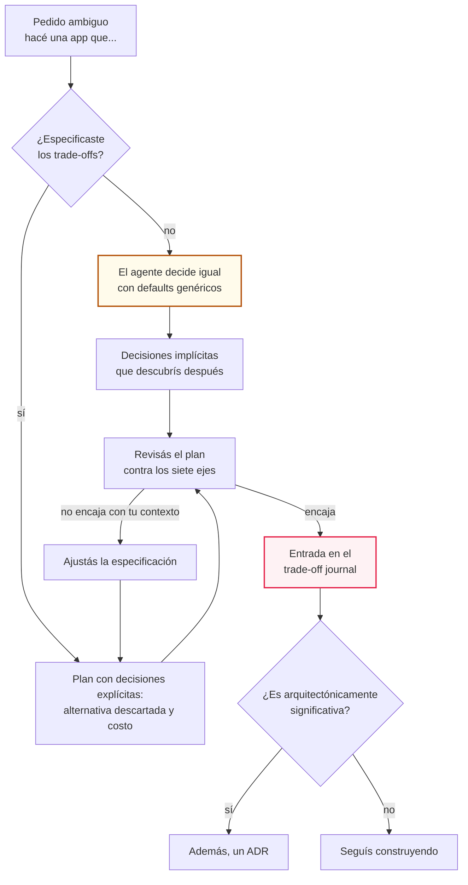
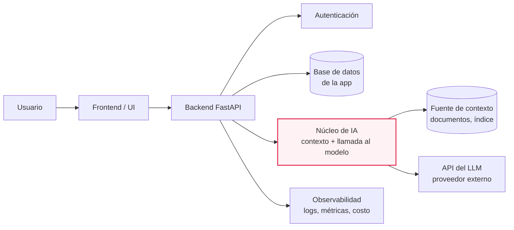
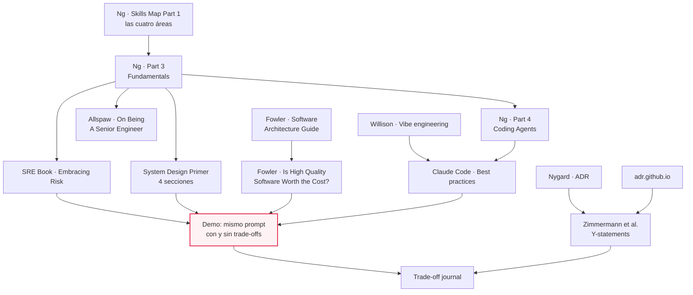
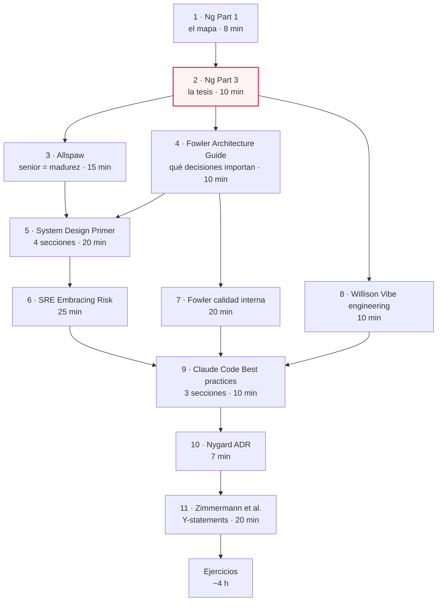

# M07·S01 — El ingeniero de software en 2026: fundamentos para dirigir al agente

| | |
|---|---|
| **Módulo** | 07 — Fundamentos de Software + System Design para AI Engineers |
| **Sesión** | M07·S01 (Semana 1 · Full-stack y el webserver FastAPI) |
| **Fecha** | [Completar por el profesor: fecha] |
| **Tema** | Mentalidad mid vs senior, los siete trade-offs que un agente decide mal si nadie se los especifica, demo "mismo prompt con y sin trade-offs" y arranque del *trade-off journal* |
| **Duración de la clase** | 3 h |
| **Tiempo de estudio estimado** | **~7 h 30 min**: lectura de este documento (~60 min) + recursos imprescindibles (~95 min) + recomendados (~60 min) + ejercicios (~4 h). Los opcionales suman ~35 min más |

---

## 1. Objetivos de aprendizaje

Al terminar esta sesión vas a poder:

1. **Explicar** la diferencia entre "escribir código" y "tomar decisiones de arquitectura", y por qué frente a un requerimiento ambiguo es ahí donde se separa un perfil mid de uno senior.
2. **Distinguir** qué conocimiento pierde peso cuando el código lo escribe un agente (memorizar sintaxis) y qué conocimiento gana valor (especificar, revisar, verificar, diseñar).
3. **Definir** los siete trade-offs de arquitectura —latencia, disponibilidad, consistencia, confiabilidad, mantenibilidad, simplicidad y costo— y **reconocer** cuál está en juego en una decisión concreta de una app de IA.
4. **Especificar** trade-offs en el prompt a un coding agent y **comparar** dos planes del agente eje por eje, detectando las decisiones que tomó sin que se las pidieras.
5. **Registrar** una decisión en el *trade-off journal* con su alternativa descartada y lo que aceptás perder, y **decidir** cuándo esa entrada merece convertirse en ADR.
6. **Ubicar** el núcleo de IA dentro de la aplicación de software más amplia que lo rodea, y ubicar este bloque dentro del mapa de habilidades de un AI engineer.

---

## 2. Resumen ejecutivo

Hoy arranca el bloque de fundamentos de software y system design, y esta sesión fija su tesis: **que un coding agent escriba buena parte del código no vuelve irrelevantes los fundamentos, los convierte en la herramienta con la que se lo dirige.** Andrew Ng lo formula así en su serie *AI Engineering Skills Map* (The Batch, agosto de 2026). Aunque un agente escriba todo el código, entender cómo funciona el software te permite llevarlo hacia los trade-offs que querés, o por lo menos saber que existen.

El problema no es que el agente escriba mal. Es que **decide igual** lo que nadie le especificó: si la app se cae cuando el LLM no responde, si un documento recién subido aparece o no en las respuestas, cuánto cuesta cada consulta. Y lo decide sin conocer tu contexto. La diferencia entre un perfil mid y uno senior se mueve a ese terreno: trabajar con requerimientos ambiguos y hacer explícitos los trade-offs *antes* de construir.

Esta sesión se apoya en lo que ya viste. En M01 aprendiste a trabajar con Claude Code. En M02 viste tokens, costos, latencia y rate limits. En el módulo A pasaste por los NFR y los SLO (MA·S03), la spec, el plan mode y la "alucinación arquitectónica" (MA·S04), y los ADR (MA·S05). Hoy todo eso se junta en un hábito que te va a acompañar las cuatro semanas: **nombrar cada decisión, su alternativa y su costo en el trade-off journal**.

> 📝 **Nota para el profesor:** el material da por visto el módulo A (MA·S03–S05) y lo referencia sin re-explicarlo, pero la §0.7 del plan del módulo solo lista M01 y M02 como prerrequisitos. Confirmá que este grupo cursó el módulo A antes de M07. Si no, conviene sumar un repaso de 10 minutos sobre ADR y plan mode.

---

## 3. Conceptos clave / glosario

### Bloque A — Rol y mentalidad

| Término | Definición | Analogía |
|---|---|---|
| **Coding agent** | Herramienta basada en un LLM que no solo sugiere código: lee el repo, planifica, edita archivos y ejecuta comandos para cumplir un objetivo (Claude Code, Cursor). Lo usás desde M01. | Un desarrollador muy rápido que acaba de entrar al equipo y no conoce el negocio. |
| **Vibe coding** | Generar software con un agente aceptando lo que produce sin revisar ni entender el código. Ya lo viste en M01 y, en su versión acotada, en MA·S04. | Manejar mirando solo el GPS, sin mirar la ruta. |
| **Vibe engineering** | Término de Simon Willison para el opuesto disciplinado del vibe coding: usar agentes sin soltar la responsabilidad sobre el código que llega a producción, apoyándose en tests, planificación, code review y demás prácticas de ingeniería. | El mismo GPS, pero con alguien que sabe leer el mapa y lo corrige. |
| **Dirigir al agente (*steer*)** | Darle al agente el contexto, las restricciones y los trade-offs que necesita para decidir como decidirías vos, y verificar después que lo hizo. | Pasar de "llevame al centro" a "llevame al centro evitando la autopista, que a esta hora está cortada". |
| **Requerimiento ambiguo** | Pedido que admite varias interpretaciones razonables o deja sin decir restricciones que importan ("una app para preguntarle a nuestros PDFs"). Las palabras ambiguas de Wiegers de MA·S03 son su versión a nivel de frase. | "Traeme algo para tomar": ¿agua, café, cerveza? |
| **Trade-off** | Decisión en la que mejorar una cualidad del sistema empeora otra. No hay opción gratis: hay opciones cuyo costo aceptás. | Una manta corta: si te tapás los pies, se te destapan los hombros. |
| **Trade-off explícito** | Trade-off nombrado antes de construir, con la alternativa descartada y lo que se acepta perder. Lo contrario es el trade-off que se descubre en producción. | Firmar un contrato leyendo la letra chica, no enterarte cuando llega la factura. |
| **Decisión reversible / irreversible** | Una decisión reversible se deshace barato (el nombre de un endpoint interno). Una irreversible, o casi, cuesta mucho revertir (el modelo de datos, el proveedor de base de datos). Las primeras se toman rápido; las segundas merecen análisis. | Pintar una pared vs. tirarla abajo. |
| **Arquitectura de software** | El conjunto de decisiones importantes de un sistema: las que cuesta cambiar después y las que uno querría acertar temprano. | Los cimientos y la estructura de una casa, no el color de las cortinas. |

### Bloque B — Los siete trade-offs y sus vecinos

| Término | Definición | Analogía |
|---|---|---|
| **Latencia** | Tiempo que pasa entre que alguien hace un pedido y recibe la respuesta. En una app de IA suele estar dominada por la llamada al LLM (visto en M02). | Cuánto tarda en llegar tu pedido al delivery. |
| **Throughput** | Cantidad de pedidos que el sistema procesa por unidad de tiempo. Se busca el máximo throughput con una latencia aceptable. | Cuántos pedidos despacha la cocina por hora. |
| **Performance vs scalability** | Un problema de *performance* hace que el sistema sea lento incluso para un solo usuario. Uno de *scalability* aparece cuando el sistema anda rápido con uno y se degrada al crecer la carga. | Un cocinero lento vs. una cocina que colapsa un sábado a la noche. |
| **Disponibilidad** | Proporción del tiempo en que el sistema responde a los pedidos. Se expresa en "nueves": 99,9 %, 99,99 %. | Qué porcentaje del año el local está abierto. |
| **Confiabilidad** | Capacidad del sistema de hacer lo correcto de forma sostenida, también cuando algo falla. Un sistema puede estar disponible (responde) y no ser confiable (responde mal). | El local abre siempre, pero ¿te sirve lo que pediste? |
| **Consistencia (sentido CAP)** | En un sistema distribuido, que toda lectura devuelva el dato más reciente escrito, o un error. Su versión relajada es la *consistencia eventual*: los datos terminan coincidiendo, pero no al instante. | Que todas las sucursales del banco muestren tu saldo actualizado en el mismo momento. |
| **Consistencia (sentido ACID)** | En una base de datos, que una transacción lleve los datos de un estado válido a otro estado válido, respetando las reglas definidas (claves, restricciones). | Una transferencia no puede sacar plata de una cuenta sin ponerla en la otra. |
| **Teorema CAP** | Ante una partición de red, un sistema distribuido tiene que elegir entre consistencia (CP) y disponibilidad (AP): no puede garantizar las dos a la vez. | Si se corta el teléfono entre dos sucursales, o dejan de operar (consistencia) u operan sin coordinarse (disponibilidad). |
| **Mantenibilidad** | Qué tan fácil es entender, modificar y corregir el sistema a lo largo del tiempo. | Un auto con el motor accesible vs. uno que hay que desarmar entero para cambiar una correa. |
| **Simplicidad** | Tener la menor cantidad de piezas móviles que resuelve el problema. Cada componente extra suma capacidad y también formas de fallar. | Una bici vs. un auto para ir a la esquina. |
| **Costo** | Dinero (inferencia, infraestructura) y esfuerzo humano (construir, operar, mantener). Visto en M02 y costeado en MA·S07. | La cuenta del restaurante más las horas que tardaste en llegar. |
| **Calidad interna / externa** | La externa la percibe el usuario (UI, que funcione, que no se caiga). La interna, solo quien trabaja el código: estructura, arquitectura, claridad. | La fachada de un edificio vs. su instalación eléctrica. |
| **Cruft** | Complejidad acumulada que no aporta: código duplicado, atajos viejos, estructura confusa. Hace que cada feature nueva cueste más. | La mugre que se junta en un cajón que nadie ordena. |
| **Error budget** | Margen de falla que un SLO deja disponible (con un SLO de 99,9 %, el 0,1 % restante). Se puede "gastar" en lanzar cambios más rápido. Cuando se agota, se prioriza la estabilidad. SLO visto en MA·S03. | Un presupuesto de riesgo: mientras quede saldo, podés arriesgar. |
| **Degradación elegante** | Diseñar para que ante una falla parcial el sistema siga ofreciendo algo útil y avise con claridad, en lugar de caerse entero. | Si se corta la luz en un piso, el ascensor sigue andando hasta planta baja. |

### Bloque C — Herramientas y artefactos

| Término | Definición | Analogía |
|---|---|---|
| **Plan mode** | Modo de Claude Code en el que el agente lee y planifica pero no modifica archivos. Visto en MA·S04; hoy lo usamos para comparar decisiones. | Pedirle el presupuesto al plomero antes de dejarlo romper la pared. |
| **`AskUserQuestion`** | Herramienta de Claude Code con la que el agente te hace preguntas estructuradas antes de avanzar. | Un buen consultor que pregunta antes de opinar. |
| **Trade-off journal** | Bitácora personal del bloque: por cada decisión con trade-off, qué alternativas había, cuál elegiste, por qué, qué aceptás perder y si la decisión la tomaste vos o el agente. | El cuaderno de bitácora de un piloto. |
| **ADR (Architecture Decision Record)** | Documento corto y versionado que registra una decisión arquitectónicamente significativa con su contexto y sus consecuencias. Visto en MA·S05 (formato de Nygard). | El acta de una reunión importante. |
| **Decisión arquitectónicamente significativa** | Una elección de diseño justificada que atiende un requisito funcional o no funcional con peso arquitectónico. Es el umbral para escribir un ADR. | La diferencia entre "cambiamos la tipografía" y "cambiamos de proveedor de base de datos". |
| **Y-statement** | Formato de una sola oración para registrar una decisión: contexto, preocupación, opción elegida, cualidad buscada y lo que se acepta perder. | Un tuit de la decisión, pero con la letra chica incluida. |
| **Núcleo de IA** | La parte de una aplicación que resuelve con un modelo: el RAG, el agente, el pipeline multimodal. Casi siempre vive dentro de una app de software más amplia. | El motor de un auto: imprescindible, pero sin chasis, ruedas ni frenos no te lleva a ningún lado. |
| **AI Engineering Skills Map** | Mapa de habilidades del AI engineer que presentó Andrew Ng en The Batch en agosto de 2026, con cuatro áreas. Este bloque trabaja una de ellas: los fundamentos de software. | El índice del libro del oficio. |
| **Arquitectura como blanco móvil** | La arquitectura correcta depende de la fase del proyecto: la de un prototipo puede no servir para el primer sistema en producción, y esa puede tener que cambiar al escalar. | La ropa de un chico: el talle correcto cambia a medida que crece. |

---

## 4. Notas de estudio por subtema

### El flujo que atraviesa toda la sesión

Antes de entrar en cada subtema, este es el recorrido que vas a repetir en cada decisión del bloque. Un pedido ambiguo le llega al agente. Si no le especificaste los trade-offs, **los decide igual**, y te enterás después. Si se los especificaste, te devuelve un plan con decisiones explícitas que podés revisar. En los dos casos, lo que revisaste termina en el journal.



Fijate en dos cosas. La primera: el camino del "no" no termina en "el agente no hace nada". Termina en decisiones que igual se tomaron. La segunda: la revisión está en los dos caminos. Especificar trade-offs no te exime de verificar, porque la salida de un agente es incierta.

---

### 4.1 Mentalidad mid vs senior: ambigüedad y trade-offs explícitos

#### Qué separa a un mid de un senior (y qué no)

"Senior" no es un número de años ni la cantidad de lenguajes que manejás. John Allspaw, en *On Being A Senior Engineer* (2012), sostiene que lo que define a un ingeniero senior es la **madurez**, no la destreza técnica. Entre los rasgos que enumera: busca crítica a sus diseños, estima (y mejora estimando), anticipa cuánto va a vivir el código, entiende cómo lo perciben los perfiles no técnicos y **hace explícitos los trade-offs**. Sobre los atajos que todo proyecto termina tomando, escribe:

> "Immature engineers discover them in hindsight, disgusted. Mature engineers spell them out at the onset."
> — John Allspaw, *On Being A Senior Engineer* (2012)

Todos toman atajos. La diferencia está en nombrarlos antes de tomarlos o descubrirlos después, con asco. Ese es exactamente el hábito que el trade-off journal quiere instalar.

Martin Fowler aporta el otro ingrediente: saber **qué decisiones importan**. En su *Software Architecture Guide* retoma la definición de Ralph Johnson: "Architecture is about the important stuff. Whatever that is." Y describe la arquitectura como las decisiones que uno querría acertar temprano en un proyecto. Un senior no analiza todo con la misma profundidad: separa las decisiones caras de revertir de las baratas.

En términos operativos, frente a un requerimiento ambiguo:

| Situación | Comportamiento típico mid | Comportamiento típico senior |
|---|---|---|
| Llega un pedido vago | Empieza a construir con la primera interpretación que se le ocurre | Pregunta antes de construir: quién lo usa, cuánto, qué pasa si falla, cuánto puede costar |
| Hay información que falta | La completa en silencio con lo "habitual" | Escribe los supuestos y los hace validar |
| Hay que decidir | Trata todas las decisiones igual, o decide por gusto o por moda | Separa reversibles de irreversibles: las primeras rápido, las segundas con análisis |
| Elige una opción | Justifica por qué la opción es buena | Dice también **qué se sacrifica** y qué señal haría cambiar la decisión |
| Trabaja con un agente | Pide "hacé X" y acepta lo que vuelve si funciona | Le da contexto y restricciones, le pide el plan y lo revisa contra los trade-offs |
| Algo sale mal en producción | "El agente hizo cualquier cosa" | "Esta decisión no la especificamos; la agregamos al journal y al prompt" |

#### Dos tipos de ambigüedad

- **Ambigüedad de negocio:** no está claro qué problema se resuelve ni para quién. "Una app para consultar documentos": ¿es para 30 personas internas o para miles de clientes? Esto se resuelve preguntando a la persona que pide, con las técnicas de elicitación de MA·S03.
- **Ambigüedad técnica:** el problema está claro, pero no las restricciones de calidad. ¿Cuánto puede tardar una respuesta? ¿Qué pasa si la API del modelo no responde? Esto se resuelve convirtiendo cada pregunta en un NFR (MA·S03) o en un trade-off explícito en el prompt.

El agente no distingue entre las dos. Frente a cualquier hueco hace lo mismo: **lo completa con un default razonable en abstracto**, que puede ser pésimo para tu contexto. En MA·S04 le pusimos nombre a este fenómeno cuando lo que se inventa es estructura: *alucinación arquitectónica*. Hoy lo miramos desde el lado de las cualidades del sistema.

> ⚠️ **Gotcha: "explicitar trade-offs" no es "analizar todo".** Un senior no escribe un documento por cada nombre de variable. Si la decisión es reversible y barata, se toma rápido y listo. El análisis se reserva para lo que cuesta revertir. Paralizarse también es un mal trade-off: pierde velocidad y no gana nada.

> ⚠️ **Gotcha: preguntar no es delegar la decisión.** Preguntar "¿cuántos usuarios va a tener?" está bien. Preguntar "¿qué base de datos uso?" a alguien de negocio, no: esa decisión es tuya, informada por lo que te respondan.

> 💡 **Tip:** cuando no tengas un dato, no lo inventes ni lo ignores. Escribí el supuesto ("asumo menos de 50 usuarios simultáneos") y dejalo visible. Un supuesto escrito se puede discutir; uno implícito, no.

📚 Para profundizar: [On Being A Senior Engineer — John Allspaw](https://www.kitchensoap.com/2012/10/25/on-being-a-senior-engineer/) · [Software Architecture Guide — Martin Fowler](https://martinfowler.com/architecture/)

---

### 4.2 Qué se vuelve obsoleto y qué gana valor

#### La tesis

La serie *AI Engineering Skills Map* de Andrew Ng (The Batch) es la fuente de la tesis de este bloque. En la Part 3, dedicada a los fundamentos (28 de agosto de 2026), Ng sostiene dos cosas:

1. Aunque un coding agent escriba todo el código, entender los fundamentos de software sirve para **dirigir al agente hacia los trade-offs que uno quiere**, o para saber siquiera qué trade-offs existen.
2. Un novato que hace vibe coding sin entender fundamentos puede crear apps simples, pero eso suele llevar a que el agente tome malos trade-offs en **latencia, disponibilidad, consistencia, confiabilidad, mantenibilidad, simplicidad y/o costo**, porque quien lo usaba no sabía que esos trade-offs existían.

Y cierra con una frase que resume el subtema:

> "Some parts of coding knowledge — like memorizing coding syntax — are becoming obsolete. But developers who deeply understand how software works vastly outperform those who vibe code without understanding."
> — Andrew Ng, *The AI Engineering Skills Map Part 3 — Fundamentals*, The Batch (28 ago 2026)

*Traducción propia:* "Algunas partes del conocimiento de programación —como memorizar sintaxis— se están volviendo obsoletas. Pero los desarrolladores que entienden en profundidad cómo funciona el software rinden muchísimo más que quienes hacen vibe coding sin entender."

Ojo con cómo se lee: es una **opinión** de alguien con mucho recorrido en el campo, no un resultado medido. No trae cifras de productividad, y no hace falta inventarlas para que el argumento se sostenga.

En la Part 1 de la serie (14 de agosto de 2026), Ng agrega una formulación útil para la demo de hoy: entender los fundamentos permite dirigir a los agentes "using the precise language of software engineering". El vocabulario de esta sesión (latencia, consistencia, degradación elegante) **es** ese lenguaje preciso.

#### Otro camino hacia la misma conclusión

Simon Willison llega al mismo lugar desde la práctica. En *Vibe engineering* (octubre de 2025) propone ese término para el uso disciplinado de agentes y sostiene:

> "AI tools amplify existing expertise. The more skills and experience you have as a software engineer the faster and better the results you can get from working with LLMs and coding agents."
> — Simon Willison, *Vibe engineering* (2025)

Su lista de prácticas que los agentes premian es casi un temario de ingeniería clásica: tests automatizados, planificación previa, documentación, control de versiones, CI/CD, cultura de code review, QA manual, investigación, entornos de preview, criterio sobre qué delegar y estimación. Conecta con el vibe coding acotado de Willison que viste en MA·S04: la frontera sigue siendo la revisión.

Si la Part 3 de Ng dice **qué** hay que saber, la Part 4 (4 de septiembre de 2026) dice **cómo** se usa ese saber con el agente. Presenta cinco sub-habilidades: dirigir el workflow, habilitar la autonomía del agente, revisar su trabajo, customizar el agente y su entorno, y entender cómo funciona por dentro. Sostiene además que la salida de un coding agent es incierta, y que usarlo bien exige sopesar velocidad, costo, riesgo técnico y esfuerzo humano para decidir cuánto investigar y planificar antes. Este bloque no la desarrolla, pero es buena lectura opcional.

#### La síntesis

| Pierde peso relativo | Gana valor |
|---|---|
| Memorizar sintaxis y firmas de funciones | **Especificar**: convertir un pedido ambiguo en restricciones y trade-offs que el agente pueda seguir |
| Tipear boilerplate (CRUD, configuración repetitiva) | **Leer código ajeno** rápido, porque ahora casi todo el código es "ajeno" |
| Recordar el comando exacto de una herramienta | **Revisar**: detectar qué decidió el agente y si esa decisión encaja con el contexto |
| Escribir de cero cada archivo | **Verificar**: tests, evals y criterios de aceptación que el agente pueda correr (MA·S03–S04) |
| | **Diseñar**: elegir componentes, fronteras y dónde vive el estado, y saber dibujarlo |
| | **Depurar**: entender por qué algo falla cuando el agente ya probó tres veces y no lo arregló |
| | **Decidir qué delegar** y cuánto planificar antes de delegar |

> ⚠️ **Gotcha: "obsoleto" no significa "no lo aprendas".** Memorizar sintaxis pierde valor, pero *leer* sintaxis no: sin eso no podés revisar lo que genera el agente. Lo que se vuelve obsoleto es el recuerdo de memoria, no la comprensión.

> ⚠️ **Gotcha: el amplificador también amplifica la falta de criterio.** Si la IA amplifica la experiencia que ya tenés, a alguien sin fundamentos le amplifica la velocidad para producir sistemas frágiles. Ir más rápido en la dirección equivocada no es progreso.

📚 Para profundizar: [The AI Engineering Skills Map Part 3 — Fundamentals](https://www.deeplearning.ai/the-batch/the-ai-engineering-skills-map-in-detail-software-engineering-fundamentals) · [Vibe engineering — Simon Willison](https://simonwillison.net/2025/Oct/7/vibe-engineering/) · [Skills Map Part 4 — Coding Agents](https://www.deeplearning.ai/the-batch/the-ai-engineering-skills-map-in-detail-using-coding-agents) (opcional)

---

### 4.3 Los siete trade-offs que un agente decide mal si no se los especificás

#### Por qué "todo es un trade-off"

El *System Design Primer* de Donne Martin, un compendio comunitario de system design, lleva como lema "Everything is a trade-off". No es una frase motivacional, es una descripción operativa: cada cualidad que empujás hacia arriba tira de otra hacia abajo. Por eso no existe "la mejor arquitectura" en abstracto, sino la mejor **para un contexto**. Y un agente, por defecto, no tiene tu contexto.

El Google SRE Book da el ejemplo más claro de que ni siquiera "más confiabilidad" es siempre mejor. En el capítulo *Embracing Risk*:

> "Extreme reliability comes at a cost: maximizing stability limits how fast new features can be developed and how quickly products can be delivered to users, and dramatically increases their cost…"
> — Marc Alvidrez (ed. Kavita Guliani), *Embracing Risk*, en *Site Reliability Engineering: How Google Runs Production Systems*, cap. 3

El capítulo sostiene además que, más allá de cierto punto, los usuarios no perciben la diferencia. La respuesta de Google es el **error budget**: si tu SLO (MA·S03) es 99,9 % de disponibilidad, el 0,1 % restante es un presupuesto de falla. Mientras quede saldo, el equipo puede lanzar cambios rápido. Cuando se agota, frena y prioriza la estabilidad. Así la confiabilidad deja de ser una discusión de opiniones entre desarrollo y operación y pasa a ser un número acordado.

#### La tabla de los siete

| Eje | Qué es | Tensión típica | Ejemplo en una app de IA | Riesgo si no se lo especificás al agente |
|---|---|---|---|---|
| **Latencia** | Tiempo entre el pedido y la respuesta | vs. costo (modelos más grandes suelen ser más lentos y caros) · vs. consistencia (esperar confirmaciones suma tiempo) | La llamada al LLM tarda varios segundos. ¿Se bloquea la UI o se hace streaming de la respuesta? | UI congelada mientras el modelo responde, o encadenamiento de varias llamadas al LLM por pedido sin medir cuánto suma |
| **Disponibilidad** | Proporción del tiempo en que el sistema responde | vs. costo y simplicidad (la redundancia suma piezas y plata) | Si la API del LLM está caída o te rate-limitea (M02), ¿se cae toda la app o el resto sigue andando? | Un error del proveedor que termina en un 500 para todo el sistema, incluso en pantallas que no usan el modelo |
| **Consistencia** | CAP: que las lecturas vean el dato más reciente. ACID: que las transacciones dejen los datos en estado válido | vs. disponibilidad y latencia (CAP) · vs. simplicidad (transacciones bien diseñadas) | CAP: un PDF recién subido todavía no está indexado y "no existe" para las preguntas. ACID: el documento queda registrado pero sus fragmentos no | Indexado en segundo plano sin avisar al usuario, o documentos "a medias" que nadie limpia |
| **Confiabilidad** | Que haga lo correcto de forma sostenida, también ante fallas | vs. velocidad de entrega y costo (SRE) | Reintentos con límite, timeouts, y no inventar una respuesta cuando la búsqueda no encontró nada | Reintentos infinitos, errores tragados en silencio, o una respuesta segura del modelo sobre un documento que no se leyó |
| **Mantenibilidad** | Facilidad para entender, cambiar y corregir | vs. velocidad inicial (ordenar cuesta al principio) | Prompts armados como strings dispersos en diez archivos vs. centralizados y versionados | Código que "anda" pero duplica lógica, mezcla capas y vuelve cara cada feature nueva |
| **Simplicidad** | La menor cantidad de piezas móviles que resuelve el problema | vs. escalabilidad y flexibilidad futura | Para 30 usuarios internos, ¿hace falta una cola de mensajes, microservicios y una base vectorial gestionada? | Sobreingeniería: infraestructura de "empresa grande" para un problema chico, porque es lo que más aparece en los ejemplos |
| **Costo** | Dinero (inferencia, infraestructura) y esfuerzo humano | vs. latencia, calidad y disponibilidad | Reprocesar los embeddings de un documento en cada consulta, o usar el modelo más caro para todas las tareas | Llamadas redundantes al modelo y sin tope de gasto, que nadie nota hasta que llega la factura (MA·S07) |

#### Tres distinciones que hay que tener finas

**1. Disponibilidad no es confiabilidad.** Un endpoint que responde siempre `200 OK` con una respuesta incorrecta tiene disponibilidad perfecta y confiabilidad pésima. En apps de IA pasa todo el tiempo: el modelo *siempre* devuelve algo, aunque la búsqueda haya fallado. Por eso "no se cayó" nunca alcanza como criterio.

**2. La C de CAP no es la C de ACID.** Es la confusión más común del vocabulario de system design, y la palabra es la misma:
- **CAP** habla de sistemas **distribuidos** (varias copias o varios componentes que tienen que ponerse de acuerdo). La pregunta es: ¿todos ven el dato más reciente? Ante una partición de red, un sistema tiene que elegir entre consistencia (CP: prefiere devolver error antes que un dato viejo) y disponibilidad (AP: prefiere responder, aunque sea con un dato viejo).
- **ACID** habla de **transacciones** en una base de datos. La pregunta es: ¿la operación deja los datos respetando las reglas? O se hace entera o no se hace.

En la app de PDFs, "el documento recién subido tiene que ser consultable en menos de un minuto" es un requisito de consistencia **en sentido CAP** (en rigor, de consistencia eventual acotada, o *frescura*). "No pueden quedar documentos registrados sin sus fragmentos" es consistencia **en sentido ACID**. Las dos se profundizan en la semana 2 (M07·S06–S07).

**3. Performance vs scalability, latency vs throughput.** Si la app tarda 20 segundos con un solo usuario, tenés un problema de performance, y agregar servidores no lo arregla. Si tarda 2 segundos con uno y 40 con cincuenta, tenés un problema de escalabilidad. Del mismo modo, podés tener buena latencia individual y throughput pobre, o al revés. Se busca el máximo throughput con una latencia aceptable.

#### Los "nueves", en minutos

La disponibilidad se expresa en nueves, y conviene traducirla a tiempo para sentir qué significa. Tomando un mes de 30 días (43.200 minutos):

| Disponibilidad | Caída permitida por mes | Caída permitida por año (365 días) |
|---|---|---|
| 99 % | 432 min (7,2 h) | ~87,6 h |
| 99,9 % | 43,2 min | ~8,8 h |
| 99,99 % | ~4,3 min | ~53 min |

Es pura aritmética: el porcentaje que falta, multiplicado por los minutos del período. Mirá lo que implica. Pasar de 99,9 % a 99,99 % significa bajar de 43 a 4 minutos de caída mensual, y **tu sistema no puede ser más disponible que las dependencias sin las que no funciona**. Si la app no sirve de nada sin la API del LLM, tu disponibilidad efectiva está atada a la del proveedor, salvo que diseñes degradación elegante o un proveedor alternativo, y cada una de esas opciones suma costo y complejidad.

#### Mantenibilidad y simplicidad: el trade-off que no es tal

Martin Fowler, en *Is High Quality Software Worth the Cost?* (2019), distingue la calidad **externa** (la que ve el usuario) de la **interna** (estructura del código, arquitectura). Para la externa vale el trade-off de siempre: más calidad cuesta más. Para la interna, sostiene Fowler, no: "The 'cost' of high internal quality software is negative". El cruft vuelve cada feature nueva más lenta y cara, así que la calidad interna alta termina abaratando el desarrollo.

Esto importa mucho con agentes. El vibe coding sin fundamentos produce justo lo que Fowler describe: código que **anda** (buena calidad externa hoy) con una estructura que nadie diseñó (mala calidad interna). La factura llega en la tercera o cuarta feature, cuando cada cambio rompe algo. Esa deuda técnica, incluida la que acumula un agente sin dirección, vuelve en M07·S19.

> ⚠️ **Gotcha: "más" no es "mejor" en ningún eje.** Un agente sin contexto tiende a resolver por exceso (máxima disponibilidad, máxima escalabilidad) o por defecto (lo más simple de generar). Las dos cosas pueden estar mal. La pregunta nunca es "¿es escalable?", sino "¿es suficiente para *este* contexto, y a qué costo?".

> ⚠️ **Gotcha: los ejes no son independientes.** Una sola decisión (por ejemplo, "indexar los PDFs en segundo plano") toca a la vez latencia (la subida responde rápido), consistencia (el documento no está disponible al instante), simplicidad (sumás un proceso) y confiabilidad (¿qué pasa si el proceso falla a mitad?). Cuando registres una decisión, nombrá todos los ejes que toca.

> 💡 **Tip:** los siete ejes funcionan como checklist de revisión. Antes de aceptar un plan del agente, recorrelos uno por uno y preguntate "¿qué decidió acá?". Si no encontrás la respuesta en el plan, la decisión igual se tomó, solo que no te la dijo.

📚 Para profundizar: [The System Design Primer](https://github.com/donnemartin/system-design-primer) (secciones *Performance vs scalability*, *Latency vs throughput*, *Availability vs consistency* y *Availability in numbers*) · [Embracing Risk — Google SRE Book, cap. 3](https://sre.google/sre-book/embracing-risk/) · [Is High Quality Software Worth the Cost? — Martin Fowler](https://martinfowler.com/articles/is-quality-worth-cost.html)

---

### 4.4 Demo: el mismo prompt con y sin trade-offs

#### La idea

La documentación oficial de Claude Code lo resume en una línea: "Claude can infer intent, but it can't read your mind." La demo lo vuelve visible. Se le da al agente **el mismo pedido dos veces**, una vez sin contexto y otra con los trade-offs especificados, y se comparan las **decisiones** que toma.

Se corre en **plan mode** (visto en MA·S04) por una razón práctica: no hace falta esperar dos apps completas generadas en vivo para ver la diferencia. El plan ya muestra qué stack eligió el agente, cómo persiste los datos, cómo estructura el código y cómo maneja los errores. Implementar uno de los dos planes es opcional.

La app de la demo es un asistente para "preguntarle a tus PDFs": el equipo sube documentos y le hace preguntas a un LLM sobre su contenido. Es deliberadamente parecida a uno de los proyectos hilo conductor sugeridos (un asistente RAG), y el RAG ya lo conocés de M03·S01, así que podés concentrarte en las decisiones y no en entender qué es la app.

#### Prompt A — sin trade-offs

```text
Haceme una app web donde mi equipo pueda subir documentos PDF y hacerle preguntas
a un LLM sobre su contenido.
```

No dice cuántos usuarios hay, cuánto puede tardar, qué pasa si falla, cuánto puede costar ni qué stack usar. **Todo eso lo va a decidir el agente.**

#### Prompt B — el mismo pedido, con trade-offs

```text
Haceme una app web donde mi equipo pueda subir documentos PDF y hacerle preguntas
a un LLM sobre su contenido.

Contexto y trade-offs (decidí en función de esto, no de lo que suele hacerse):
- Usuarios: 30 personas internas, uso en horario laboral. No es un producto público.
- Latencia: una respuesta puede tardar hasta 10 s; preferí streaming a bloquear la UI.
- Disponibilidad: si la API del LLM falla o está rate-limiteada, la app no se cae:
  muestra un mensaje claro y deja reintentar.
- Consistencia: un documento recién subido tiene que ser consultable en menos de 1 minuto.
- Costo: tope de 50 USD/mes en llamadas al modelo; no reprocesar un documento ya indexado.
- Simplicidad y mantenibilidad: una sola persona la mantiene. Monolito en Python con FastAPI
  y SQLite; nada de microservicios, colas ni infraestructura extra.

Antes de escribir código, listá las decisiones de arquitectura que vas a tomar y, para cada
una, qué alternativa descartaste y qué aceptamos perder.
```

> ⚠️ **Los números del prompt B son supuestos del caso de la demo**: 30 usuarios, 10 segundos, 1 minuto de frescura y 50 USD por mes. No son valores de referencia de la industria ni recomendaciones. Sirven para que el agente tenga algo concreto contra qué decidir. En tu proyecto, los números salen de tu contexto.

Fijate en la última instrucción del prompt B. Obliga al agente a devolver cada decisión con **la alternativa descartada y lo que se acepta perder**. Esa es la estructura de una entrada del trade-off journal (subtema 4.5): el agente te deja el material listo para registrar.

#### Prompt C — la variante senior: que el agente pregunte

Hay una tercera posición entre el prompt vago y el prompt con todo resuelto: **usar al agente para descubrir qué hay que decidir**. La documentación de Claude Code propone un patrón para que el agente te entreviste antes de escribir una spec. Adaptado al caso:

```text
Quiero construir una app web donde mi equipo suba PDFs y le haga preguntas a un LLM.
Entrevistame en detalle usando la herramienta AskUserQuestion antes de proponer nada.
Preguntá sobre implementación técnica, casos borde y tradeoffs de latencia, disponibilidad,
consistencia, confiabilidad, mantenibilidad, simplicidad y costo. No hagas preguntas obvias.
Cuando terminemos, escribí la spec completa en SPEC.md.
```

Es la respuesta directa a un requerimiento ambiguo (subtema 4.1): en lugar de adivinar los trade-offs, hacés que salgan a la luz. Ojo: las respuestas las seguís dando vos. Si contestás "no sé" a todo, el agente vuelve a decidir por defecto.

#### Cómo comparar los dos planes

Esta checklist sirve para la demo y para cualquier plan que te devuelva un agente en el resto del bloque:

| Eje | Pregunta al plan | Señal de alerta |
|---|---|---|
| Latencia | ¿Cómo llega la respuesta del LLM a la UI? ¿Bloquea o hace streaming? | No lo menciona, o encadena varias llamadas al modelo por pregunta |
| Disponibilidad | ¿Qué pasa si la API del LLM no responde o devuelve rate limit? | No hay manejo del error, o el error del proveedor termina tirando toda la app |
| Consistencia | ¿Cuándo queda consultable un documento subido? ¿Qué pasa si el procesamiento falla a mitad? | Procesamiento en segundo plano sin estado visible, o nada que evite documentos a medias |
| Confiabilidad | ¿Hay timeouts, reintentos con límite, validación de entradas? ¿Qué responde si no encuentra nada relevante? | Reintentos sin límite, `except` que tragan errores, respuestas sin contexto |
| Mantenibilidad | ¿Cómo está organizado el código? ¿Dónde viven los prompts y la configuración? | Todo en un archivo, prompts hardcodeados, sin separación de responsabilidades |
| Simplicidad | ¿Cuántos componentes y servicios propone? ¿Hacen falta todos para este contexto? | Colas, microservicios o servicios gestionados que el contexto no justifica |
| Costo | ¿Cuántas llamadas al modelo hace por pregunta y por documento? ¿Evita reprocesar? | Embeddings recalculados, modelo caro para todo, sin ninguna noción de tope |

Después de recorrer los siete ejes, sometés el plan a tres preguntas de estrés:

1. **¿Qué pasa con 10× usuarios?** No para diseñar para eso, sino para saber qué se rompería primero.
2. **¿Qué pasa si se cae la API del LLM durante una hora?**
3. **¿Qué decisión de este plan sería más cara de revertir en tres meses?** Esa es candidata a ADR.

Para cada eje, anotá una de tres cosas: **lo decidió explícitamente**, **lo dejó implícito** (se deduce del plan pero no lo dice) o **no aparece**. Las dos últimas son las "decisiones que tomó el agente sin permiso", y son la materia prima del journal.

> ⚠️ **Gotcha: el resultado no es determinista.** Si corrés el mismo prompt dos veces, podés obtener planes distintos, y lo que salió en clase puede no ser lo que te sale a vos. Por eso la comparación se hace sobre **decisiones**, no sobre líneas de código. Lo que no cambia es el patrón: cuanto menos especificás, más decide el agente por su cuenta.

> ⚠️ **Gotcha: que el prompt B "salga mejor" no prueba que el agente obedeció.** Un plan puede *decir* "streaming" y después implementarse sin streaming. Especificar no reemplaza verificar; lo que cambia es que ahora tenés contra qué verificar.

> 💡 **Tip:** el prompt B no es "más largo porque sí". Cada línea es una restricción que descarta opciones. Si al escribir una línea no podés imaginar qué opción descarta, probablemente sobra.

> 📝 **Nota para el profesor:** la demo propuesta usa Claude Code en plan mode con la app "preguntale a tus PDFs", y Cursor como alternativa. Los valores del prompt B (30 usuarios, 10 s, 1 minuto, 50 USD/mes) son supuestos del caso: si tenés un caso propio con números reales, reemplazalos. Probá los tres prompts con el modelo del día antes de clase, porque la salida de un agente no es determinista, y dejá una grabación de respaldo por si la red o la API fallan en vivo.

📚 Para profundizar: [Best practices for Claude Code — documentación oficial](https://code.claude.com/docs/en/best-practices) (secciones *Provide specific context in your prompts*, *Explore first, then plan, then code* y *Let Claude interview you*)

---

### 4.5 El trade-off journal y su relación con los ADR

#### Qué es y por qué pesa tanto

El trade-off journal es la bitácora que llevás durante las cuatro semanas del bloque. Por cada decisión con trade-off anotás qué alternativas había, qué elegiste y por qué. Pesa el **25 % de la nota del bloque**, y el criterio de evaluación del módulo lo explica: no alcanza con que la app ande, tenés que poder responder *por qué elegiste esto y no aquello*.

Es el mismo hábito que describe Allspaw (nombrar los atajos al principio) convertido en artefacto. Y con un agente de por medio suma una pregunta que antes no existía: **¿esta decisión la tomé yo o la heredé del agente?**

#### El formato de una sola oración: Y-statement

Olaf Zimmermann, Rafael Capilla, Huy Tran y Uwe Zdun presentaron en InfoQ (2014) un formato para registrar decisiones en una sola oración, el **(WH)Y-statement**:

> "In the context of <use case/user story u>, facing <concern c> we decided for <option o> to achieve <quality q>, accepting <downside d>."
> — Zimmermann, Capilla, Tran y Zdun, *Sustainable Architectural Design Decisions*, InfoQ (2014)

Lo valioso es la última parte: **`accepting <downside>`** es obligatoria. No podés escribir un Y-statement completo sin decir qué perdés, y ahí es justamente donde el perfil mid se queda corto. En castellano, aplicado a la app de PDFs:

> En el contexto de la subida de documentos para 30 usuarios internos, frente a que procesar un PDF grande puede tardar más que un request HTTP razonable, decidimos procesar el documento en una tarea en segundo plano dentro del mismo proceso de FastAPI para que la subida responda rápido, aceptando que el documento no queda consultable al instante y que, si el proceso se reinicia a mitad, hay que reprocesarlo.

El mismo artículo propone cinco criterios para que una decisión sea **sostenible**: que sea estratégica, medible y gestionable, alcanzable y realista, enraizada en los requisitos, y atemporal. No hace falta aplicarlos en cada entrada, pero sirven para revisar las decisiones grandes.

#### La plantilla del journal

```markdown
## TJ-001 — <decisión en una frase>
- **Fecha:** <AAAA-MM-DD>
- **Contexto:** <qué se estaba construyendo y qué restricción aprieta>
- **Alternativas consideradas:** <A> · <B> · <C>
- **Elección:** <la que se tomó>
- **Por qué (qué cualidad se prioriza):** <latencia | disponibilidad | consistencia | confiabilidad | mantenibilidad | simplicidad | costo>
- **Qué aceptamos perder:** <el costo explícito de la decisión>
- **¿La tomó el agente o la tomé yo?:** <agente sin especificar | la especifiqué | la revisé y la cambié>
- **Revisar cuando:** <señal que haría cambiar la decisión>
- **Y-statement:** En el contexto de <…>, frente a <…>, decidimos <…> para lograr <…>, aceptando <…>.
```

Qué aporta cada campo:
- **Alternativas / Elección / Por qué** son lo que el plan del bloque le pide al journal. Las alternativas tienen que ser reales: "usar SQLite" vs. "no usar nada" no es una alternativa.
- **Qué aceptamos perder** es la parte del Y-statement que obliga a nombrar el costo.
- **¿La tomó el agente o la tomé yo?** hace visible la tesis del bloque en cada entrada. Si al final de la semana todas dicen "agente sin especificar", ya sabés dónde mejorar.
- **Revisar cuando** conecta con la arquitectura como blanco móvil (subtema 4.6): toda decisión tiene una señal que la vuelve obsoleta ("si pasamos de 30 a 300 usuarios").

#### Journal vs ADR

Los ADR ya los viste en MA·S05. El formato de Michael Nygard (2011) tiene cinco secciones (Title, Context, Decision, Status, Consequences), ocupa una o dos páginas y se guarda en el repo del proyecto. La diferencia con el journal es de **alcance**:

| | Trade-off journal | ADR |
|---|---|---|
| **Qué registra** | *Todas* tus decisiones con trade-off, grandes y chicas | Solo las **decisiones arquitectónicamente significativas** |
| **Formato** | Entrada corta con plantilla y Y-statement | Documento de una o dos páginas (Nygard, MADR) |
| **De quién es** | Personal, del alumno | Del proyecto y del equipo |
| **Para qué** | Entrenar el hábito de nombrar trade-offs y ver cuánto decide el agente | Que alguien, dentro de un año, entienda por qué el sistema es como es |
| **Ciclo de vida** | Se agregan entradas; "Revisar cuando" marca las que envejecen | `proposed → accepted → deprecated → superseded`; nunca se borra (MA·S05) |

`adr.github.io` define una *architectural decision* como "A justified design choice that addresses a functional or non-functional requirement that is architecturally significant." Para saber si una entrada del journal **sube** a ADR, usá el criterio de tres preguntas de MA·S05: ¿es costosa de revertir? ¿afecta a más de un equipo? ¿alguien va a preguntar por qué dentro de un año? Si alguna respuesta es sí, escribí el ADR y enlazalo desde la entrada.

> ⚠️ **Gotcha: el journal no es un diario de lo que hiciste.** "Hoy agregué el endpoint `/upload`" no es una entrada. "Decidí que `/upload` responda antes de terminar de procesar el PDF, aceptando que el documento tarde en estar disponible" sí lo es. Si no hay alternativa descartada, no hay trade-off que registrar.

> ⚠️ **Gotcha: escribirlo después no vale lo mismo.** Una entrada escrita tres días más tarde tiende a racionalizar lo que salió. El valor está en escribir "qué aceptamos perder" *antes* de ver las consecuencias.

> 💡 **Tip:** cuando el agente te devuelva el plan del prompt B, cada decisión que lista ya trae alternativa y costo. Tu trabajo es revisarla, completar el contexto y marcar si la aceptaste tal cual o la cambiaste.

> 📝 **Nota para el profesor:** el formato del journal está escrito con estos defaults: plantilla de arriba, archivo `tradeoff-journal.md` en un repo personal del alumno para el módulo (en M07·S05 se mueve o se enlaza desde el repo del proyecto), entradas numeradas `TJ-NNN`, mínimo tres por semana (alineado con los "3 trade-offs en la bitácora" que pide S05), y journal siempre individual. La rúbrica propuesta es de 1 a 4 sobre tres criterios: alternativas reales y no de relleno, "qué aceptamos perder" explícito, y si la decisión la tomó el alumno o la heredó del agente. Ajustá cualquiera de estos puntos si tenés un formato propio.

📚 Para profundizar: [Sustainable Architectural Design Decisions — Zimmermann et al. (InfoQ)](https://www.infoq.com/articles/sustainable-architectural-design-decisions) · [Documenting Architecture Decisions — Michael Nygard](https://cognitect.com/blog/2011/11/15/documenting-architecture-decisions) · [Architectural Decision Records — adr.github.io](https://adr.github.io/)

---

### 4.6 Contexto transversal: el núcleo de IA dentro de una app más amplia

#### El modelo es una caja entre muchas

Ng lo formula en la misma Part 3: en una app de IA, **el núcleo de IA suele expresarse a través de una aplicación de software más amplia** que el AI engineer ayuda a construir o moldear. El RAG, el agente o el pipeline multimodal son el motor. Alrededor hay frontend, backend, base de datos, autenticación, despliegue y observabilidad, y la mayoría de esas cajas son software clásico.



Mirá el diagrama con los siete ejes en la cabeza. La **latencia** del usuario es la suma de todas las flechas. La **disponibilidad** depende de que `LLM`, que no controlás, responda. La **consistencia** vive entre `DB` y `CTX`: ¿el índice refleja lo que la base dice que está subido? El **costo** se concentra en la flecha hacia `LLM`. Cada caja es una decisión.

Ng agrega una advertencia que conecta con la semana 2: si la arquitectura de datos está mal elegida, la IA **"no sabe lo que no sabe"**, porque toma su contexto de las fuentes de datos de la app. Un modelo excelente con un índice desactualizado responde con confianza sobre información vieja.

Chip Huyen describe lo mismo desde el lado de la IA en *AI Engineering* (O'Reilly, 2025), capítulo 10. En su forma más simple, una app de foundation models recibe una query, la manda al modelo y devuelve la respuesta, sin contexto, sin guardrails y sin optimización. A partir de ahí la arquitectura crece en cinco pasos:

1. Enriquecer el contexto (por ejemplo, con retrieval).
2. Agregar guardrails.
3. Agregar un router y un gateway de modelos.
4. Agregar caching.
5. Agregar patrones agénticos y *write actions*.

Huyen advierte que **cada componente suma capacidad y también modos de falla**. Es el trade-off de simplicidad en su forma más pura: cada paso se justifica solo si el contexto lo pide. El prototipo de la semana 1 va a tener un "núcleo IA" mockeado o una llamada directa a un LLM, es decir, la arquitectura mínima.

#### La arquitectura como blanco móvil

Otra idea de Ng que atraviesa el bloque: **la arquitectura correcta depende de la fase del proyecto**. La de un prototipo puede no servir para el primer sistema en producción, y esa puede tener que cambiar al escalar. No es un fracaso de diseño, es el diseño haciendo su trabajo. Por eso el campo "Revisar cuando" del journal es tan importante: una decisión correcta en la semana 1 puede ser incorrecta en la semana 4, y está bien, siempre que lo sepas de antemano.

#### Dónde se ubica este bloque en el mapa

El *AI Engineering Skills Map* que presentó Ng el 14 de agosto de 2026 tiene **cuatro áreas**:

1. *Building and deploying AI applications*
2. *Software engineering fundamentals*
3. *Using coding agents*
4. *Shaping the build*

Según DeepLearning.AI, el mapa se basa en el análisis de más de 10.000 avisos de trabajo, decenas de entrevistas estructuradas con expertos, hiring managers y recruiters, encuestas y otros datos online. Es la descripción que dan los propios autores: el estudio no está publicado, así que tomalo como el método que declaran y no como un hallazgo independiente.

**Este bloque trabaja a fondo una sola de esas áreas: los fundamentos de software.** Las cinco competencias que lo estructuran son las cinco habilidades que Ng detalla *dentro* de esa área, no el mapa completo. El uso de coding agents aparece de forma transversal (cada sesión dirige al agente), pero no es el foco. El resto del mapa, como construir y desplegar aplicaciones de IA, se trabaja en otros módulos del bootcamp.

| # | Competencia del bloque | Habilidad en el Skills Map de Ng | Semana |
|---|---|---|---|
| 1 | Aplicaciones full-stack | *Building full-stack applications* | 1 (y diseño de API en la 2) |
| 2 | Gestión de datos | *Managing data* | 2 |
| 3 | Arquitectura de sistemas | *Designing system architectures* | 3 |
| 4 | Seguridad y confiabilidad | *Making systems secure and reliable* | 3 |
| 5 | Escalado y operación en producción | *Scaling and operating in production* | 4 |

#### El proyecto hilo conductor

Cada alumno, o equipo de 2 a 3 personas, elige **un producto de IA** y lo lleva de prototipo a "listo para producción" durante las cuatro semanas, siempre con un backend FastAPI como columna. Las sugerencias son un asistente RAG sobre documentos, un agente de tareas con herramientas o una app multimodal (voz o visión).

| Semana | Estado del proyecto | Diagrama que se entrega |
|---|---|---|
| 1 | Prototipo full-stack mínimo: UI + webserver FastAPI + núcleo IA mockeado o simple | Componentes |
| 2 | Capa de datos real + diseño formal de la API | Secuencia de la API |
| 3 | Arquitectura escalable en papel + auth y autorización + endurecimiento de seguridad | Arquitectura escalada |
| 4 | Plan de despliegue, observabilidad y defensa técnica | Despliegue |

Es el blanco móvil hecho temario: la arquitectura de la semana 1 **no** es la de la semana 4, y el journal registra por qué cambió. El kickoff formal es en M07·S05. Hoy alcanza con empezar a pensar qué producto te interesa.

> ⚠️ **Gotcha: no leas el Skills Map como un ranking de prioridades.** Que las cartas vayan numeradas no quiere decir que un área importe más que otra. Y las opiniones de Ng sobre qué pierde valor son eso, opiniones con fundamento, no una medición.

📚 Para profundizar: [The AI Engineering Skills Map Part 1](https://www.deeplearning.ai/the-batch/the-ai-engineering-skills-map) · Chip Huyen, *AI Engineering: Building Applications with Foundation Models* (O'Reilly, 2025), cap. 10

---

### 4.7 Mapa de relaciones entre recursos

Cómo se conectan los recursos de la sesión entre sí. La demo está en el centro porque es donde convergen: el "por qué" (Ng, Willison), el "qué" (los trade-offs de SRE, el Primer y Fowler) y el "cómo" (la doc de Claude Code). Todo termina en el journal.



Lo que el diagrama no alcanza a mostrar:
- **Allspaw y la guía de Fowler van antes que la lista de trade-offs.** Dan la actitud (nombrar los atajos al principio) y el criterio (qué decisiones importan). Recién después tiene sentido la lista concreta.
- **Ninguno de los tres recursos de trade-offs cubre los siete.** SRE cubre disponibilidad y confiabilidad frente a costo y velocidad. El Primer cubre latencia, disponibilidad y consistencia. Fowler, mantenibilidad y simplicidad frente a costo. La tabla del subtema 4.3 los integra.
- **Willison y la Part 4 de Ng dicen lo mismo por caminos distintos:** la IA amplifica el criterio que ya tenés, no lo reemplaza.
- **Huyen no aparece en el mapa** porque hoy solo se menciona. Se usa de verdad en S02–S05, cuando armes el prototipo con núcleo de IA.

---

## 5. Guía práctica paso a paso

### Cómo se organiza la sesión

| Bloque | Duración | Qué pasa |
|---|---|---|
| Concepto | ~40 min | Tesis del bloque (Ng), mid vs senior (Allspaw), los siete trade-offs |
| Taller guiado | ~60 min | Demo en vivo: prompts A y B en plan mode, comparación en pizarra con la checklist de los siete ejes, implementación opcional del B |
| Práctica en parejas | ~45 min | Cada pareja escribe su propio "prompt B" para otra idea de app de IA, lo corre en plan mode y anota qué decidió el agente que no le habían especificado |
| Puesta en común | ~20 min | Las decisiones "que tomó el agente sin permiso", grupo por grupo |
| Cierre | ~15 min | Primera entrada del journal y mapa del bloque (cinco competencias + proyecto hilo conductor) |

### Walkthrough: reproducir la demo y arrancar tu journal

Este walkthrough te sirve para rehacer la demo por tu cuenta, antes o después de clase, y dejar tu `TJ-001` commiteado.

**Prerrequisitos**
- Claude Code instalado y autenticado (visto en M01).
- Git configurado (visto en M01).
- Una cuenta con acceso a un modelo. Plan mode no escribe archivos, pero **sí consume tokens**.
- 45 a 60 minutos.

> 💡 Si trabajás con otro agente en lugar de Claude Code, usá el modo que le impida modificar archivos. Si no tiene uno, agregá al principio de cada prompt: "No escribas ni modifiques ningún archivo: solo devolveme el plan".

---

**Paso 1 — Preparar dos carpetas vacías y el repo del journal**

Necesitás dos carpetas separadas para que el agente no vea el plan de una corrida en la otra, y un repo personal para el journal.

```bash
mkdir demo-prompt-a demo-prompt-b tradeoff-journal
cd tradeoff-journal
git init
```

✅ **Verificá:** las tres carpetas existen y `demo-prompt-a` y `demo-prompt-b` están vacías. Dentro de `tradeoff-journal`, Git confirmó que inicializó el repositorio.

---

**Paso 2 — Correr el prompt A en plan mode**

Entrá a la carpeta del prompt A y arrancá Claude Code directamente en plan mode:

```bash
cd ../demo-prompt-a
claude --permission-mode plan
```

Si ya tenías una sesión abierta, podés pasar a plan mode con `Shift+Tab` hasta ver `⏸ plan mode on` en la barra de estado.

Pegá el **prompt A** del subtema 4.4 tal cual. Cuando el agente devuelva el plan, copialo completo a un archivo `plan-a.md` en la carpeta `tradeoff-journal`.

✅ **Verificá:**
- La barra de estado muestra que estás en plan mode.
- Cuando el agente termina, `demo-prompt-a` sigue sin archivos de código: plan mode no modifica nada.
- `plan-a.md` tiene el plan completo, no un resumen tuyo.

---

**Paso 3 — Correr el prompt B en plan mode**

Salí de la sesión anterior y repetí en la otra carpeta:

```bash
cd ../demo-prompt-b
claude --permission-mode plan
```

Pegá el **prompt B**. Los placeholders ya vienen reemplazados con los valores del caso de la demo (30 usuarios, 10 s, 1 minuto, 50 USD/mes). Si querés probar otro escenario, cambialos, pero cambiá **uno por vez** para poder atribuir la diferencia. Guardá el plan en `tradeoff-journal/plan-b.md`.

✅ **Verificá:**
- El plan lista decisiones de arquitectura y, para cada una, una alternativa descartada y lo que se acepta perder. Si no lo hace, respondele al agente pidiéndoselo de nuevo: esa instrucción es la que alimenta el journal.
- `demo-prompt-b` sigue sin archivos de código.

---

**Paso 4 — Comparar los dos planes eje por eje**

Creá `tradeoff-journal/comparacion.md` con esta tabla y completala mirando `plan-a.md` y `plan-b.md`:

```markdown
# Comparación prompt A vs prompt B

| Eje | Plan A: qué decidió | A: ¿explícito, implícito o ausente? | Plan B: qué decidió | ¿Coincide con lo pedido en B? |
|---|---|---|---|---|
| Latencia | | | | |
| Disponibilidad | | | | |
| Consistencia | | | | |
| Confiabilidad | | | | |
| Mantenibilidad | | | | |
| Simplicidad | | | | |
| Costo | | | | |

## Preguntas de estrés (sobre el plan A)
- ¿Qué se rompe primero con 10× usuarios?
- ¿Qué pasa si la API del LLM se cae una hora?
- ¿Qué decisión sería más cara de revertir en tres meses?

## Decisiones que tomó el agente sin que se las pidiera
1.
2.
3.
```

Usá las preguntas de la checklist del subtema 4.4 para cada fila.

✅ **Verificá:** las siete filas están completas y tenés **al menos tres** decisiones en la última lista. Si encontrás menos de tres, volvé a leer el plan A buscando lo que *no* dice: stack, dónde se guardan los archivos, qué pasa ante un error.

---

**Paso 5 (opcional) — Prompt C: que el agente te entreviste**

En una tercera carpeta vacía, corré el **prompt C**. Como este prompt termina escribiendo un archivo (`SPEC.md`), corrélo fuera de plan mode. Respondé las preguntas con los mismos supuestos del prompt B. Al final compará: ¿te preguntó por algo que no estaba en el prompt B?

✅ **Verificá:** el agente te hizo preguntas estructuradas antes de proponer nada y, al terminar la entrevista, existe `SPEC.md` en la carpeta.

---

**Paso 6 — Escribir `TJ-001`**

Creá `tradeoff-journal/tradeoff-journal.md` y escribí tu primera entrada con la plantilla del subtema 4.5. Elegí **la decisión más discutible que tomó el agente en el prompt A**: la que, con el contexto del prompt B, hubieras tomado distinto.

Placeholders que tenés que reemplazar:
- `<decisión en una frase>`: por ejemplo, "Procesamiento síncrono del PDF en el request de subida".
- `<AAAA-MM-DD>`: la fecha de hoy.
- `<A> · <B> · <C>`: alternativas reales. Si el agente no listó ninguna, pensalas vos.
- `<latencia | disponibilidad | …>`: dejá solo la cualidad o las cualidades que prioriza la elección.
- `¿La tomó el agente o la tomé yo?`: en `TJ-001` casi seguro es "agente sin especificar".

✅ **Verificá:**
- El campo "Qué aceptamos perder" nombra un costo concreto, no "nada" ni "un poco de complejidad".
- El Y-statement se puede leer en voz alta como una oración completa, con las cinco partes.
- Aplicaste las tres preguntas de MA·S05 y anotaste si la entrada merece ADR.

---

**Paso 7 — Commitear**

```bash
cd ../tradeoff-journal
git add tradeoff-journal.md comparacion.md plan-a.md plan-b.md
git commit -m "TJ-001: primera entrada del trade-off journal"
```

✅ **Verificá:** `git log` muestra el commit con los cuatro archivos. Si tenés un remoto configurado, pusheá para que quede disponible para la revisión.

---

**Paso 8 (opcional) — Implementar el plan B**

Si querés ver la distancia entre plan e implementación, volvé a `demo-prompt-b`, salí de plan mode y pedile al agente que implemente el plan aprobado. Después revisá una sola cosa: **¿lo implementado respeta lo que el plan decía?** Elegí dos ejes (por ejemplo, disponibilidad y costo) y buscá en el código dónde se resuelven.

> ⚠️ Implementar consume bastantes más tokens que planificar. Tené presente lo que viste de costos en M02.

✅ **Verificá:** encontraste en el código dónde se maneja el fallo de la API del LLM y dónde se evita reprocesar un documento. Si no los encontrás, anotalo en el journal: es exactamente el tipo de hallazgo que el bloque quiere entrenar.

> 📝 **Nota para el profesor:** el reparto de los 180 minutos sigue el ritmo estándar de las semanas 1 y 2 del plan, con el contenido de esta sesión repartido por defecto. Las parejas de la práctica son libres, y los equipos del proyecto recién se forman en S05. S01 no tiene entrega formal: el default es commitear `TJ-001` antes de S02 y revisarlo en el repaso inicial de esa sesión. Ajustá cualquiera de estos puntos si lo organizás distinto.

---

## 6. Ejercicios

### 🟢 Básico 1 — ¿Qué eje toca esta decisión?

**Enunciado.** Para cada una de estas ocho decisiones de una app de IA, indicá **qué eje o ejes** de los siete toca, **qué mejora** y **qué sacrifica**. Respondé en una tabla de tres columnas.

1. Cachear las respuestas del LLM a preguntas idénticas durante 24 horas.
2. Usar el modelo más grande disponible para todas las consultas.
3. Guardar el PDF y sus fragmentos en una misma transacción de la base de datos.
4. Mostrar la respuesta del modelo en streaming, token por token.
5. Si la API del LLM devuelve rate limit, mostrar "el asistente está saturado, probá en un minuto" en vez de reintentar sin límite.
6. Separar la app en cuatro microservicios desde el primer día.
7. Indexar los documentos en segundo plano y avisar cuando están listos.
8. Centralizar todos los prompts en un módulo versionado en vez de escribirlos inline.

**Sabés que lo lograste cuando…**
- Cada fila nombra al menos un eje que **empeora**, no solo el que mejora.
- En la decisión 3 y en la 7 usaste "consistencia" en sentidos distintos y podés explicar por qué.
- Ninguna fila dice "no sacrifica nada".

<details>
<summary>Pistas</summary>

- Para la decisión 1: ¿qué pasa si el documento del que salió la respuesta cambió en esas 24 horas?
- La decisión 3 es sobre transacciones. La 7 es sobre cuándo un dato nuevo se vuelve visible.
- La decisión 6 casi siempre tiene un sacrificio en simplicidad. Preguntate qué gana a cambio con 30 usuarios.
- Algunas decisiones tocan tres o cuatro ejes a la vez. Eso es lo normal.

</details>

---

### 🟢 Básico 2 — Nueves, dependencias y la diferencia con confiabilidad

**Enunciado.**
1. Calculá cuántos minutos de caída por mes (30 días) permite una disponibilidad de 99,5 %, y cuántos una de 99,95 %.
2. Tu app de PDFs no funciona sin la API del LLM. Suponé que el proveedor tiene 99,9 % de disponibilidad mensual y tu backend, 99,9 % también, con caídas independientes entre sí. Calculá la disponibilidad combinada aproximada y traducila a minutos por mes. *(Los porcentajes son supuestos del ejercicio.)*
3. Escribí un escenario de **tres o cuatro líneas** en el que la app tenga 100 % de disponibilidad en una semana y aun así sea poco confiable.

**Sabés que lo lograste cuando…**
- Mostrás la cuenta, no solo el resultado.
- La disponibilidad combinada del punto 2 te da **menor** que la de cada componente por separado, y podés explicar por qué.
- Tu escenario del punto 3 no involucra ninguna caída.

<details>
<summary>Pistas</summary>

- Un mes de 30 días tiene 43.200 minutos. La caída permitida es el porcentaje que falta multiplicado por ese total.
- Si dos componentes tienen que andar los dos a la vez y fallan de forma independiente, la probabilidad de que ambos anden es el producto de sus disponibilidades.
- Para el punto 3, pensá en qué devuelve la app cuando la búsqueda en los documentos no encuentra nada relevante.

</details>

---

### 🟡 Intermedio 1 — Tu propio prompt B

**Enunciado.** Elegí **otra** idea de app de IA, distinta del asistente de PDFs: un agente de tareas con herramientas, una app que transcribe y resume reuniones, un clasificador de tickets de soporte o la idea que tengas para tu proyecto hilo conductor.

1. Escribí el prompt **A** (una o dos líneas, sin contexto) y el prompt **B** (con los siete ejes especificados). Inventá supuestos de contexto razonables y **marcalos como supuestos**.
2. Corré los dos en plan mode.
3. Completá la tabla de comparación del paso 4 de la guía práctica.
4. Escribí **tres entradas** del journal (`TJ-002` a `TJ-004`) con decisiones que el agente tomó sin que se las pidieras en el prompt A.

**Sabés que lo lograste cuando…**
- Cada línea de tu prompt B descarta al menos una opción concreta. Podés decir cuál.
- Tu prompt B especifica algo que el de la demo no especificaba, porque tu app tiene riesgos distintos (por ejemplo, *write actions* en un agente de tareas, o privacidad en audio de reuniones).
- Las tres entradas tienen alternativas reales y un "qué aceptamos perder" concreto.
- Al menos una entrada dice "la revisé y la cambié" y explica por qué.

<details>
<summary>Pistas</summary>

- Si tu app **actúa** (manda mails, modifica datos), la confiabilidad pesa distinto: un error ya no es una respuesta mala, es una acción mala. ¿Qué le pedís al agente al respecto?
- No copies los números de la demo. Preguntate qué latencia tolera *tu* usuario: no es lo mismo un chat que un resumen que llega por mail al día siguiente.
- Si los dos planes te salen casi iguales, probablemente tu prompt B no restringe lo suficiente. Buscá qué eje dejaste abierto.

</details>

---

### 🟡 Intermedio 2 — Del plan implícito al ADR

**Enunciado.** Tomá el `plan-a.md` de la demo (o el plan A del ejercicio anterior).

1. Identificá **la decisión más cara de revertir** que tomó el agente, aunque no la haya presentado como decisión.
2. Escribila como entrada del journal, con Y-statement completo.
3. Aplicale las tres preguntas de MA·S05 para decidir si merece ADR, y justificá cada respuesta en una línea.
4. Escribí el ADR en formato Nygard (Title, Context, Decision, Status, Consequences) **defendiendo la decisión contraria** a la que tomó el agente, usando el contexto del prompt B.
5. Enlazá el ADR desde la entrada del journal.

**Sabés que lo lograste cuando…**
- La decisión elegida en el punto 1 es de las irreversibles (modelo de datos, stack, forma de persistir), no un detalle cosmético.
- El Context del ADR describe las fuerzas en juego y nombra al menos dos de los siete ejes.
- Las Consequences incluyen al menos una consecuencia **negativa** de tu propia decisión.
- El ADR cabe en una página.

<details>
<summary>Pistas</summary>

- Buscá qué almacenamiento eligió el agente para los documentos y el índice, y si dejó el procesamiento dentro o fuera del request.
- Si al escribir las Consequences solo te salen cosas buenas, te falta la mitad del ADR. Volvé a la columna "sacrifica" del ejercicio 🟢1.
- Status: como es una propuesta tuya todavía no aceptada, pensá qué estado corresponde según el ciclo de vida de MA·S05.

</details>

---

### 🔴 Desafío — Tres prompts, una app, una defensa

**Enunciado.** Mini-proyecto de preparación para el kickoff de S05. Elegí la idea de producto de IA que te gustaría llevar como proyecto hilo conductor y armá un expediente de decisiones en un repo (puede ser tu `tradeoff-journal`), dentro de una carpeta `desafio-s01/`:

1. **`contexto.md`**: quién usa la app, cuántos, qué hace el núcleo de IA y qué **no** sabés todavía (supuestos explícitos).
2. **Tres corridas** del agente sobre la misma idea: prompt A (vago), prompt B (con los siete ejes) y prompt C (entrevista con `AskUserQuestion`). Guardá los tres resultados.
3. **`comparacion.md`**: la tabla de siete ejes para las tres corridas, más las tres preguntas de estrés aplicadas al plan que elegirías.
4. **`arquitectura.md`**: un diagrama Mermaid (`flowchart`) de tu app que muestre el núcleo de IA dentro de la aplicación más amplia, con al menos frontend, backend FastAPI, almacenamiento, API del modelo y observabilidad. Usá etiquetas en las flechas relevantes para indicar qué eje se decide ahí.
5. **Cinco entradas del journal** con decisiones de ese plan, al menos una de cada tipo de origen: "agente sin especificar", "la especifiqué" y "la revisé y la cambié".
6. **`defensa.md`**: una página que responda: ¿qué prompt te dio el mejor punto de partida y por qué? ¿qué decidió el agente en las tres corridas que ninguna de tus especificaciones cubrió? ¿qué decisión de hoy esperás tener que cambiar en la semana 3, y qué señal te lo va a indicar?

**Sabés que lo lograste cuando…**
- Otra persona puede leer `contexto.md` y `comparacion.md` y entender por qué elegiste ese plan sin que se lo expliques.
- El diagrama renderiza sin error y cada caja corresponde a algo que aparece en el plan elegido.
- Las cinco entradas tienen alternativas reales, costo explícito y "Revisar cuando" con una señal observable, no "si hace falta".
- `defensa.md` reconoce al menos un punto donde el prompt más detallado **no** fue mejor, o explica con argumentos por qué no encontraste ninguno.
- Podrías defender el expediente en cinco minutos frente a alguien que te pregunta "¿por qué esto y no aquello?".

<details>
<summary>Pistas</summary>

- El prompt C no siempre gana. A veces la entrevista pregunta cosas que ya sabías y omite las que importan. Registralo si pasa.
- Para el diagrama, respetá las reglas de Mermaid: IDs sin acentos ni espacios, y textos y etiquetas de flecha entre comillas si llevan paréntesis, barras o acentos.
- El "Revisar cuando" más útil se vincula con la evolución del proyecto hilo conductor: prototipo en la semana 1, datos reales en la 2, escala y seguridad en la 3, producción en la 4.
- Si tu idea todavía no está clara, usá el asistente de PDFs, pero con un contexto distinto al de la demo (por ejemplo, producto público en vez de interno) y mirá qué cambia.

</details>

---

## 7. Ruta de estudio sugerida

El orden importa: primero la tesis, después la actitud y el criterio, después los trade-offs concretos, después cómo aplicarlos con el agente y por último cómo registrarlos.



| Paso | Recurso | Tiempo | Prioridad | Qué buscar |
|---|---|---|---|---|
| 0 | Este documento, secciones 1 a 4 | ~60 min | Imprescindible | El flujo de la sesión y la tabla de los siete ejes |
| 1 | Ng · Skills Map Part 1 | 8 min | Recomendado | Las cuatro áreas y dónde cae este bloque |
| 2 | Ng · Skills Map Part 3 | 10 min | Imprescindible | La tesis y las cinco habilidades |
| 3 | Allspaw · On Being A Senior Engineer | 15 min | Imprescindible | El rasgo "hacer explícitos los trade-offs" |
| 4 | Fowler · Software Architecture Guide | 10 min | Recomendado | Arquitectura como "lo importante" |
| 5 | System Design Primer (4 secciones) | 20 min | Imprescindible | Definiciones de latencia, throughput, CAP y la tabla de nueves |
| 6 | SRE Book · Embracing Risk | 25 min | Recomendado | Por qué más confiabilidad no es gratis; el error budget |
| 7 | Fowler · Is High Quality Software Worth the Cost? | 20 min | Imprescindible | Calidad interna vs externa y el cruft |
| 8 | Willison · Vibe engineering | 10 min | Recomendado | La lista de prácticas que los agentes premian |
| 9 | Claude Code · Best practices (3 secciones) | 10 min | Imprescindible | Contexto específico, plan mode, entrevista |
| 10 | Nygard · Documenting Architecture Decisions | 7 min | Recomendado | Repaso de MA·S05 |
| 11 | Zimmermann et al. · Y-statements | 20 min | Imprescindible | La plantilla y el `accepting <downside>` |
| — | Ejercicios | ~4 h | Imprescindible | Los 🟢 antes de la clase siguiente; los 🟡 y el 🔴 durante la semana |

**Opcionales, en cualquier momento después del paso 9:** Ng · Skills Map Part 4 (10 min), adr.github.io (10 min) y el capítulo 10 de Huyen (15 min). Este último conviene dejarlo para cuando arranques el prototipo en S02–S05.

---

## 8. Checklist de autoevaluación

- [ ] Puedo explicar sin mirar los apuntes por qué, según la tesis del bloque, los fundamentos de software sirven *más* y no menos cuando el código lo escribe un agente.
- [ ] Puedo describir tres comportamientos concretos que distinguen a un perfil senior frente a un requerimiento ambiguo, sin hablar de años de experiencia.
- [ ] Puedo nombrar los siete trade-offs y dar un ejemplo de cada uno en una app de IA.
- [ ] Puedo explicar la diferencia entre disponibilidad y confiabilidad con un ejemplo en el que una se cumple y la otra no.
- [ ] Puedo explicar la diferencia entre la consistencia de CAP y la de ACID, y dar un ejemplo de cada una en la app de PDFs.
- [ ] Puedo calcular cuántos minutos de caída mensual permite una disponibilidad dada.
- [ ] Puedo escribir un prompt con trade-offs especificados y revisar el plan del agente con la checklist de los siete ejes.
- [ ] Puedo escribir un Y-statement completo, incluyendo qué se acepta perder.
- [ ] Puedo decidir, con las tres preguntas de MA·S05, si una entrada del journal merece ADR.
- [ ] Puedo explicar por qué las cinco competencias del bloque no son el Skills Map completo de Ng.

---

## 9. Preguntas de repaso

1. **Te piden "una app para que el equipo le haga preguntas a nuestros documentos" y tenés un coding agent a mano.** ¿Qué hacés en los primeros 30 minutos, antes de que el agente escriba código? ¿Qué preguntas le hacés a quien pidió la app y qué le pedís al agente?

2. **Un compañero dice: "Si el agente escribe el código, aprender fundamentos de software es perder el tiempo".** Construí el mejor contraargumento que puedas, y después decí en qué parte tu compañero tiene algo de razón.

3. **Tu app tiene 99,99 % de disponibilidad medida, pero los usuarios se quejan de que "no sirve".** ¿Qué hipótesis te planteás? ¿Qué medirías, más allá de si el sistema responde, para saber si es confiable?

4. **En un sistema que indexa documentos para un RAG, ¿cuándo elegirías que un documento recién subido *no* esté disponible al instante?** ¿Qué ganás, qué perdés y cómo se lo comunicás al usuario? Aclará de qué "consistencia" estás hablando.

5. **Revisás el plan que te devolvió un agente y todo "se ve bien".** ¿Cómo encontrás las decisiones que tomó sin decírtelo? ¿Cuáles registrarías en un trade-off journal, cuáles subirías a ADR y por qué?

---

## 10. Recursos adicionales

### Imprescindibles

- **Andrew Ng — *The AI Engineering Skills Map Part 3 — Fundamentals: Why Software Engineering Fundamentals Remain Essential for AI Developers*** (The Batch, 28 ago 2026) · artículo · 8–10 min
  https://www.deeplearning.ai/the-batch/the-ai-engineering-skills-map-in-detail-software-engineering-fundamentals
  La fuente de la tesis del bloque: dirigir al agente, los siete trade-offs y las cinco habilidades.

- **John Allspaw — *On Being A Senior Engineer*** (2012) · artículo · 15 min
  https://www.kitchensoap.com/2012/10/25/on-being-a-senior-engineer/
  Senior como madurez, no destreza. Hacer explícitos los trade-offs desde el principio.

- **Donne Martin — *The System Design Primer*** (GitHub) · repositorio · 20 min (solo 4 secciones)
  https://github.com/donnemartin/system-design-primer
  *Performance vs scalability*, *Latency vs throughput*, *Availability vs consistency* y *Availability in numbers*. Vas a volver a él en las semanas 2 y 3.

- **Martin Fowler — *Is High Quality Software Worth the Cost?*** (2019) · artículo · 20 min
  https://martinfowler.com/articles/is-quality-worth-cost.html
  Calidad interna vs externa, cruft, y por qué mantenibilidad y costo no siempre se oponen.

- **Anthropic — *Best practices for Claude Code*** (documentación oficial) · docs · 10 min (secciones relevantes) / 30 min completa
  https://code.claude.com/docs/en/best-practices
  Prompts específicos, plan mode y el patrón de entrevista. La base de la demo.

- **Zimmermann, Capilla, Tran y Zdun — *Sustainable Architectural Design Decisions*** (InfoQ, 2014) · artículo · 20 min
  https://www.infoq.com/articles/sustainable-architectural-design-decisions
  El Y-statement y los criterios de una decisión sostenible. El formato de tu journal.

### Recomendados

- **Andrew Ng — *The AI Engineering Skills Map Part 1*** (The Batch, 14 ago 2026) · artículo · 8 min
  https://www.deeplearning.ai/the-batch/the-ai-engineering-skills-map
  Las cuatro áreas del mapa. Te sirve para ubicar este bloque dentro del oficio.

- **Martin Fowler — *Software Architecture Guide*** (2019) · artículo-guía · 10 min
  https://martinfowler.com/architecture/
  Arquitectura como "lo importante" y las decisiones difíciles de revertir. Funciona como índice de más lecturas sobre trade-offs.

- **Google — *Embracing Risk*, *Site Reliability Engineering*, cap. 3** · capítulo de libro en abierto · 25 min
  https://sre.google/sre-book/embracing-risk/
  El costo de la confiabilidad extrema y el error budget.

- **Simon Willison — *Vibe engineering*** (2025) · artículo · 10 min
  https://simonwillison.net/2025/Oct/7/vibe-engineering/
  Por qué los agentes amplifican la experiencia y qué prácticas de ingeniería rinden más con ellos.

- **Michael Nygard — *Documenting Architecture Decisions*** (2011) · artículo · 7 min
  https://cognitect.com/blog/2011/11/15/documenting-architecture-decisions
  El post original del formato ADR. Repaso de MA·S05.

### Opcionales

- **Andrew Ng — *The AI Engineering Skills Map Part 4 — Coding Agents*** (The Batch, 4 sep 2026) · artículo · 10 min
  https://www.deeplearning.ai/the-batch/the-ai-engineering-skills-map-in-detail-using-coding-agents
  La otra mitad de "qué gana valor": cómo se usa el conocimiento de fundamentos con el agente.

- **adr.github.io — *Architectural Decision Records*** · sitio de referencia · 10 min
  https://adr.github.io/
  Definiciones de decisión arquitectónica y de ADR, e índice de plantillas (Nygard, Y-statements, MADR).

- **Chip Huyen — *AI Engineering: Building Applications with Foundation Models*** (O'Reilly, 2025), cap. 10 · libro · 15 min
  La arquitectura mínima de una app de foundation models y sus cinco pasos de crecimiento. Es un libro sin versión abierta: pedile acceso al profesor. Lo vas a usar de verdad en S02–S05.