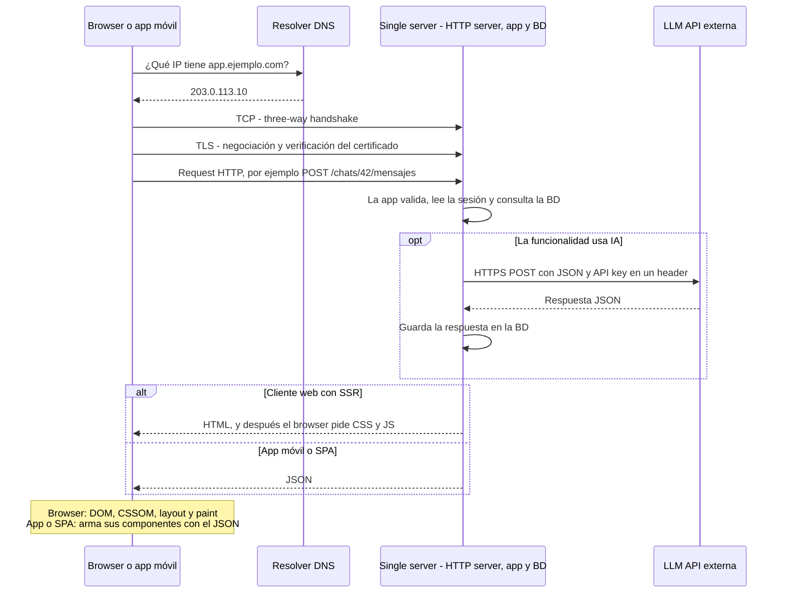
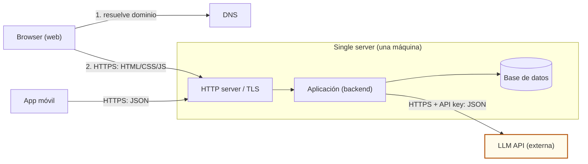
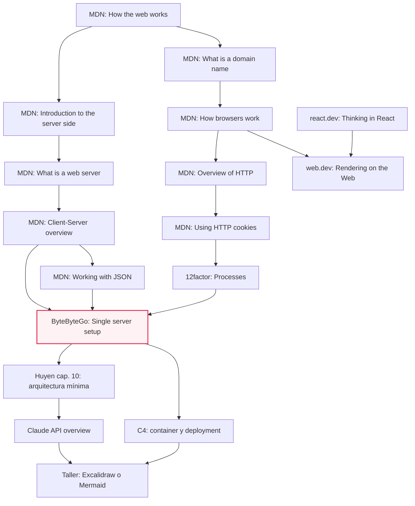
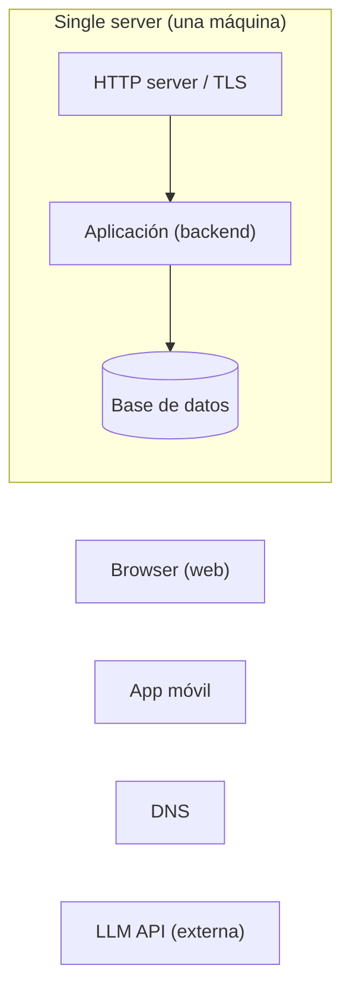
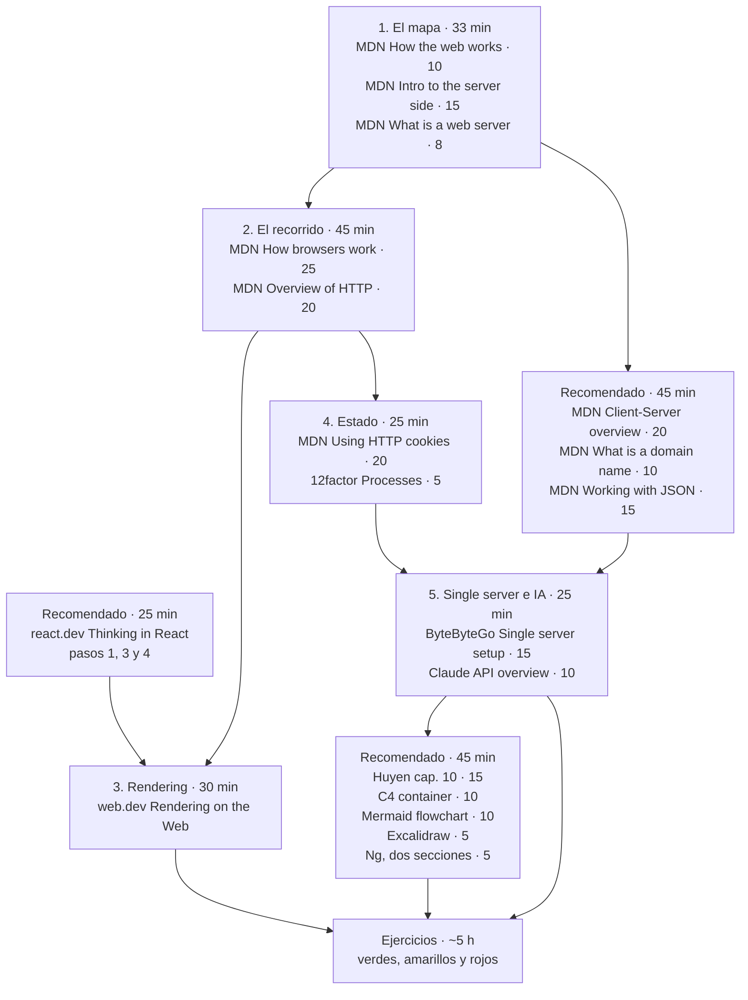

# M07·S02 — Anatomía del full-stack

| | |
|---|---|
| **Módulo** | 07 — Fundamentos de Software + System Design para AI Engineers |
| **Sesión** | M07·S02 (Semana 1 · Full-stack y el webserver FastAPI) |
| **Fecha** | [Completar por el profesor: fecha] |
| **Tema** | Cliente, servidor y base de datos; la frontera frontend/backend; el recorrido de una petición (DNS → TCP → TLS → HTTP → HTML o JSON); UI components y page rendering; qué es realmente el estado; la arquitectura de single server y dónde entra la llamada a la LLM API. Taller: dibujarla |
| **Duración de la clase** | 3 h |
| **Tiempo de estudio estimado** | **~8 h 40 min**: lectura de este documento (~70 min) + recursos imprescindibles (~150 min) + ejercicios (~5 h). Los recomendados suman ~2 h más y los opcionales ~65 min |
**Artefacto:** el apunte completo como página navegable. https://gemini.google.com/share/f6d38ba7dfce?skid=de01ea12-3254-4eb3-9113-a3bc1e744d2f

---

## 1. Objetivos de aprendizaje

Al terminar esta sesión vas a poder:

1. **Nombrar y ubicar** las piezas de una aplicación full-stack (cliente, servidor, base de datos) y **decidir** de qué lado de la frontera frontend/backend va cada responsabilidad, empezando por dónde vive la API key del modelo.
2. **Trazar** el recorrido completo de una petición, desde la resolución DNS hasta la respuesta HTML/CSS/JS para web o JSON para una app móvil, y **verificarlo** vos mismo con `dig`, `curl -v` y las DevTools del browser.
3. **Comparar** server-side rendering, client-side rendering, static rendering, hidratación y streaming SSR, y **justificar** una estrategia de rendering para una app concreta en términos de trade-offs.
4. **Explicar** qué es realmente el estado: **ubicar** cada tipo de estado (de UI, de sesión, persistente) en cliente, servidor o base de datos, y **detectar** el estado guardado en la memoria del proceso que se rompe al reiniciar o al escalar.
5. **Diagramar** una arquitectura de single server, con la LLM API como sistema externo llamado desde el backend, y **leer** sus trade-offs con los siete ejes de M07·S01.
6. **Ejecutar** un request a una LLM API desde la terminal y **reconocer** en él el mismo recorrido DNS → TLS → HTTP → JSON que hace el browser.

---

## 2. Resumen ejecutivo

En M07·S01 fijamos la tesis del bloque: un agente decide igual lo que nadie le especifica, y los siete trade-offs (latencia, disponibilidad, consistencia, confiabilidad, mantenibilidad, simplicidad y costo) son el vocabulario para dirigirlo. También arrancaste el *trade-off journal*. Hoy le ponemos **terreno** a esos ejes: el mapa de piezas sobre el que se toman las decisiones.

Antes de levantar un webserver con FastAPI en S03 tenés que poder nombrar qué corre en el browser, qué corre en el servidor y qué guarda la base de datos, y seguir una petición de punta a punta: DNS, TCP, TLS, request HTTP y respuesta. Sobre ese recorrido aparecen dos decisiones que un agente toma solo si nadie las dirige: **dónde se renderiza la página** y **dónde vive el estado**. HTTP es stateless por diseño. La sesión es algo que se construye encima, y según dónde la pongas, tu app sobrevive o no a un reinicio.

La sesión cierra con la arquitectura más simple posible, el **single server**, y ahí ubicamos el núcleo de IA. Vas a ver que la llamada a la LLM API que usaste en M02 no tiene nada de mágico: es **otro request HTTPS con JSON**, solo que ahora el cliente es tu backend. Por eso la API key nunca va en el frontend.

Andrew Ng incluye exactamente estos temas (UI components, page rendering, state and session management) entre lo que maneja un desarrollador full-stack competente. Y como marca el bloque: si no lo sabés dibujar, todavía no lo entendés.

> 📝 **Nota para el profesor:** el material da por vistos C4, Mermaid y Excalidraw del módulo A (MA·S02 y MA·S05) y los refresca en dos líneas donde aparecen. Si el grupo no cursó el módulo A, conviene sumar 10 minutos de C4 nivel 2 antes del taller.

---

## 3. Conceptos clave / glosario

> 💡 Los términos que ya viste se refrescan en una línea y se marcan con la sesión donde aparecieron. No hace falta que los vuelvas a estudiar desde cero.

### Bloque A — Las piezas y la frontera

| Término | Definición | Analogía |
|---|---|---|
| **Cliente** | El dispositivo del usuario y el software con el que accede a la aplicación: normalmente un browser, pero también una app móvil, un script o tu propio backend cuando llama a otra API. | El comensal que hace el pedido. |
| **Servidor** | Computadora (y el software que corre en ella) que recibe requests y devuelve respuestas: páginas, archivos o datos. | La cocina del restaurante. |
| **Base de datos (BD)** | Sistema que guarda los datos de forma persistente y los permite consultar y modificar. Sobrevive a reinicios de la aplicación. Se profundiza en S06–S07. | La despensa: lo que hay adentro sigue ahí aunque cierre la cocina. |
| **Frontend** | La parte de la aplicación que corre del lado del cliente: interfaz, presentación, interacción. En web es HTML, CSS y JavaScript ejecutándose en el browser. | El salón: lo que el cliente ve y toca. |
| **Backend** | La parte que corre en el servidor: lógica de negocio, validación con autoridad, acceso a la BD, secretos e integraciones externas, incluida la LLM API. | La cocina y la administración, que el cliente no ve. |
| **Frontera frontend/backend** | La decisión de qué responsabilidad corre en el cliente y cuál en el servidor. Es una decisión de diseño con consecuencias de seguridad, latencia y costo. | Qué se hace en la mesa (servir, aderezar) y qué solo en la cocina (manejar el cuchillo y la caja). |
| **Web server (hardware / software)** | En hardware, la máquina que guarda el software y los archivos del sitio. En software, como mínimo, un HTTP server. | El local (hardware) y el mozo que atiende la puerta (software). |
| **HTTP server** | Software que entiende HTTP: recibe requests, los enruta y devuelve respuestas. | El mozo que toma el pedido y trae el plato. |
| **Application server** | El software que ejecuta la lógica de la aplicación para armar una respuesta dinámica. En S03, FastAPI sobre Uvicorn ocupa este lugar. | El cocinero que prepara el plato según el pedido. |
| **Static web server** | HTTP server que devuelve los archivos tal cual están guardados. | Una máquina expendedora: siempre el mismo producto. |
| **Dynamic web server** | HTTP server más application server más BD, que arman o actualizan el contenido antes de enviarlo. | Un restaurante que cocina a pedido. |
| **User-agent** | El software que actúa en nombre del usuario al hacer requests; en la web, típicamente el browser. | El mensajero que lleva tu pedido. |
| **Proxy** | Intermediario entre cliente y servidor que reenvía requests y puede cachear, filtrar o hacer de gateway. | Una recepcionista que filtra y deriva llamadas. |
| **Reverse proxy** | Proxy que se para delante de uno o varios servidores de aplicación, del lado del servidor: recibe todo el tráfico y lo reparte hacia adentro. | El portero de un edificio de oficinas. |
| **Terminación TLS** | Punto donde se descifra la conexión HTTPS. En un single server suele hacerla el reverse proxy, que después le pasa el request a la aplicación. | La aduana: ahí se abre el paquete sellado. |
| **CORS** | Mecanismo del browser que controla si una página servida desde un origen (esquema + host + puerto) puede leer respuestas de una API en otro origen. Te lo vas a cruzar en S03–S05 al conectar una UI con FastAPI. | Un guardia que pregunta "¿esta página tiene permiso para hablar con esta API?". |
| **Núcleo de IA** | La parte de la app que resuelve con un modelo (RAG, agente, pipeline multimodal). Visto en M07·S01. | El motor del auto. |

### Bloque B — El recorrido de una petición

| Término | Definición | Analogía |
|---|---|---|
| **URL** | Dirección de un recurso, con partes: esquema (`https`), host (`app.ejemplo.com`), path (`/chats/42`), query (`?orden=reciente`) y fragmento (`#mensaje-7`). | Una dirección postal completa, con piso y departamento. |
| **Nombre de dominio** | Nombre legible que identifica a un host en Internet. Se lee de derecha a izquierda: TLD, dominio, subdominios. | El nombre de un comercio en vez de sus coordenadas. |
| **TLD** | *Top-level domain*: la última etiqueta del dominio (`.com`, `.ar`, `.dev`). | El país en una dirección postal. |
| **Subdominio** | Etiqueta a la izquierda del dominio que identifica una parte del sitio (`api.` en `api.ejemplo.com`). | El número de sucursal. |
| **IP** | Dirección numérica con la que las máquinas se encuentran en la red. | Las coordenadas GPS del comercio. |
| **DNS** | Sistema distribuido que traduce nombres de dominio a direcciones IP. | La guía telefónica de Internet. |
| **Resolver recursivo** | Servidor DNS (de tu proveedor de Internet, de tu empresa o uno público) que hace todo el trabajo de averiguar la IP por vos, preguntando a los demás. | Un secretario que hace todas las llamadas hasta conseguir el número. |
| **Root / TLD / authoritative nameserver** | Los tres niveles que consulta el resolver: el root indica quién maneja el TLD, el de TLD indica quién es autoritativo para el dominio, y el autoritativo da la respuesta final. | Preguntar en el país, después en la ciudad y al final en el edificio. |
| **Caché DNS y TTL** | Browser, sistema operativo y resolver guardan las respuestas DNS un tiempo, el *time to live* que fija el dominio. Por eso un cambio de DNS no se ve al instante en todos lados. | Anotar el número en tu agenda en vez de llamar a informaciones cada vez. |
| **TCP** | Protocolo de transporte que ofrece una conexión confiable y ordenada entre dos máquinas. TCP vs UDP se ve en S09. | Una llamada telefónica: primero se establece la línea, después se habla. |
| **Three-way handshake** | Intercambio de tres mensajes con el que cliente y servidor abren una conexión TCP antes de mandar datos. | "¿Me escuchás?" / "Sí, ¿y vos a mí?" / "Sí". |
| **TLS** | Protocolo que crea un canal seguro sobre TCP con tres propiedades: autenticación (del servidor siempre, del cliente opcional), confidencialidad e integridad. La versión vigente es TLS 1.3. | Un sobre lacrado con el sello verificado del remitente. |
| **HTTPS** | HTTP transportado dentro de una conexión TLS. | La misma carta, pero dentro del sobre lacrado. |
| **Certificado** | Documento digital que asocia un dominio con una clave pública, firmado por una autoridad certificante. El browser lo verifica en el handshake TLS. | El DNI del servidor. |
| **Autoridad certificante (CA)** | Entidad en la que confían browsers y sistemas operativos, que firma certificados después de comprobar que quien los pide controla el dominio. | El registro civil que emite el DNI. |
| **HTTP** | Protocolo de aplicación cliente-servidor basado en mensajes de request y response. Es stateless. | El idioma y el formato del pedido y la respuesta. |
| **Request / response** | El mensaje que manda el cliente (método, path, headers, body opcional) y el que devuelve el servidor (status code, headers, body). | La comanda y el plato. |
| **Método HTTP** | El verbo del request: `GET` para leer, `POST` para enviar datos, entre otros. Se profundiza en S10. | "Traeme" vs "tomá esto". |
| **Header** | Par nombre-valor con metadatos del mensaje: tipo de contenido, credenciales, cookies, caché. | Lo que va escrito en el sobre, no adentro. |
| **Status code** | Número de tres dígitos que resume el resultado de la respuesta (`200 OK`, `302 Found`). Los rangos se ven en S10. | El semáforo del resultado. |
| **JSON** | Formato de texto estándar para representar datos estructurados, basado en la sintaxis de objetos de JavaScript. Es lo que viaja entre una API y una app móvil, una SPA o tu backend y la LLM API. | Un formulario con campos y valores, que cualquiera sabe leer. |
| **Serialización / deserialización** | Convertir un objeto en memoria a texto (por ejemplo JSON) para enviarlo, y reconstruirlo al recibirlo. En S03 lo hace Pydantic (visto en M01). | Desarmar un mueble para mandarlo en caja y volver a armarlo al llegar. |
| **TTFB** | *Time to first byte*: tiempo desde que el cliente hace el request hasta que recibe el primer byte de la respuesta. | Cuánto tarda en salir el primer plato de la cocina. |
| **DOM** | Representación en árbol que el browser construye a partir del HTML, y que JavaScript puede leer y modificar. | El plano de la página, pieza por pieza. |
| **CSSOM** | Representación en árbol de los estilos, construida a partir del CSS. | El manual de decoración que acompaña al plano. |
| **Render (style, layout, paint, compositing)** | Las etapas con las que el browser pasa de DOM + CSSOM a píxeles: calcula estilos, ubica cada caja, la pinta y compone las capas en pantalla. | Diseñar, medir, pintar y colgar los cuadros. |
| **Main thread** | El hilo del browser donde corren el parsing, el render y el JavaScript de la página. Si está ocupado, la página no responde. | Un único cajero atendiendo a todos. |

### Bloque C — UI components y rendering

| Término | Definición | Analogía |
|---|---|---|
| **UI component** | Pieza reutilizable de interfaz que encapsula estructura, estilo y comportamiento, y se combina con otras para formar la pantalla. | Un bloque de Lego con forma y función propias. |
| **Jerarquía de componentes** | El árbol que resulta de componer componentes dentro de otros. Un JSON bien estructurado suele mapear directo a esa jerarquía. | Las cajas dentro de cajas de una mudanza. |
| **Props** | Datos que un componente padre le pasa a un hijo. El hijo los recibe y no los modifica. | Las instrucciones que le das a quien arma un mueble. |
| **State (en la UI)** | Datos que cambian en el tiempo como resultado de la interacción y que el componente recuerda entre renders. | La posición actual de un interruptor. |
| **Lifting state up** | Mover un estado al padre común más cercano de los componentes que lo necesitan, para que todos lo compartan. | Poner el control remoto en la mesa del living y no en la mano de uno solo. |
| **Page rendering** | El proceso de producir el HTML de una página y convertirlo en algo visible e interactivo. La decisión clave es dónde y cuándo ocurre. | Dónde se cocina el plato: en la cocina, en la mesa o la noche anterior. |
| **SSR (server-side rendering)** | Renderizar la app en el servidor para enviar HTML, en lugar de JavaScript, al cliente. | El plato llega cocinado. |
| **CSR (client-side rendering)** | Renderizar la app en el browser, usando JavaScript para modificar el DOM. | Te llegan los ingredientes y la receta, y cocinás en la mesa. |
| **SPA (single-page application)** | App web que carga un HTML inicial casi vacío y después actualiza la pantalla con JavaScript y requests de datos (típicamente JSON), sin recargar la página. | Un tablero donde se cambian las fichas sin cambiar el tablero. |
| **Static rendering / SSG** | Generar el HTML en *build time*, un archivo por URL, y servirlo tal cual. | Viandas preparadas la noche anterior. |
| **Prerendering** | Generar de antemano el HTML de una página para servirlo sin renderizar en cada request. Static rendering es su forma más común. | Dejar la mesa puesta antes de que llegue la gente. |
| **Hidratación** | Ejecutar scripts del lado del cliente para agregarle estado e interactividad a un HTML que ya vino renderizado del servidor. | El plato llega cocinado y en la mesa le agregás la salsa caliente. |
| **Rehidratación** | SSR + CSR combinados: el servidor manda HTML y el cliente vuelve a construir la app encima. Puede dejar páginas que parecen interactivas y no responden hasta que corre el JavaScript. | Un auto de exposición: se ve listo, pero todavía no arranca. |
| **Streaming SSR** | Enviar el HTML en fragmentos que el browser renderiza a medida que llegan, en vez de esperar la página entera. | Un menú por pasos: sale la entrada mientras se termina el principal. |
| **Bundle de JS** | El archivo (o archivos) de JavaScript que la app manda al browser. Cuanto más grande, más tarda en descargarse, parsearse y ejecutarse. | La valija que tenés que desarmar antes de usar lo que hay adentro. |
| **FCP** | *First contentful paint*: el momento en que el usuario ve el primer contenido en pantalla. | Cuando ves que llegó algo a la mesa. |
| **INP** | *Interaction to next paint*: cuánto tarda la página en reflejar visualmente la respuesta a una interacción del usuario. | Cuánto tarda el mozo en reaccionar cuando levantás la mano. |
| **SEO** | Optimización para buscadores. Importa para rendering porque el contenido que no está en el HTML inicial puede ser más difícil de indexar. | Que tu local aparezca en el mapa. |

### Bloque D — Estado y sesión

| Término | Definición | Analogía |
|---|---|---|
| **Estado** | Todo dato que la aplicación necesita recordar entre un momento y otro para comportarse correctamente: qué pestaña está abierta, quién está logueado, qué mensajes tiene una conversación. | La memoria del sistema. |
| **Stateless (protocolo)** | Que cada mensaje se entiende solo, sin depender de los anteriores. HTTP es stateless: el servidor no vincula por sí mismo dos requests seguidos. | Un cajero automático que no te reconoce entre una operación y otra si no volvés a poner la tarjeta. |
| **Stateless / stateful (proceso)** | Un proceso de servidor stateless no guarda en su memoria nada que tenga que sobrevivir al request; uno stateful sí. El primero se puede reiniciar o duplicar sin perder nada. | Un empleado que anota todo en el sistema compartido vs. uno que se lo acuerda de memoria. |
| **Sesión** | Mecanismo que le permite al servidor asociar información al usuario actual a lo largo de varios requests y responder distinto según ella. Se construye encima de HTTP. | La pulsera de un hotel all-inclusive: te identifica en cada barra. |
| **Cookie** | Dato chico que el servidor le manda al browser, que este guarda y reenvía automáticamente en los requests siguientes al mismo sitio. | El ticket del guardarropa. |
| **`Set-Cookie`** | Header de respuesta con el que el servidor le pide al browser que guarde una cookie. | Entregarte el ticket. |
| **`HttpOnly` / `Secure` / `SameSite`** | Atributos de seguridad de una cookie: no legible desde JavaScript, solo enviada por HTTPS, y restricción de envío en requests que vienen de otros sitios. Se desarrollan en S14–S15. | Un ticket plastificado, que solo se muestra en el mostrador correcto. |
| **Web Storage (`localStorage` / `sessionStorage`)** | APIs del browser para guardar pares clave-valor del lado del cliente. `localStorage` persiste; `sessionStorage` dura lo que la pestaña. No se mandan al servidor en cada request. | Un cajón en tu escritorio vs. un post-it que tirás al irte. |
| **IndexedDB** | Base de datos del lado del browser para volúmenes mayores de datos estructurados. | Un archivero en tu casa. |
| **Estado de UI (efímero)** | Estado que solo importa a la pantalla actual: un menú abierto, el texto que se está escribiendo. Si se pierde, no pasa nada grave. | En qué página del libro dejaste el dedo. |
| **Estado de sesión** | Estado que acompaña a un usuario durante su visita: quién es, qué permisos tiene. | La pulsera del hotel. |
| **Estado persistente** | Estado que tiene que sobrevivir a todo: cuentas, conversaciones, pedidos. Vive en la BD. | La escritura de una casa. |
| **Backing service** | Servicio que la app consume por red para funcionar: BD, caché, cola, API externa. | Los proveedores de un restaurante. |
| **Share-nothing** | Diseño en el que los procesos de la app no comparten memoria ni disco local: todo lo compartido va a un backing service. | Cajeros que no se pasan papelitos: todo va al sistema central. |
| **Sticky sessions** | Mandar siempre al mismo usuario al mismo proceso o servidor porque ahí quedó su sesión en memoria. Twelve-Factor la considera una violación. | Tener que ir siempre a la misma ventanilla porque es la única que te conoce. |
| **Datastore con expiración (TTL)** | Almacén de clave-valor que borra solo cada entrada pasado un tiempo, típico para sesiones. Se ve en S04 y S06. | Un estacionamiento que retira los autos pasado el horario. |

### Bloque E — Arquitectura y taller

| Término                                  | Definición                                                                                                                                                                | Analogía                                                     |
| ---------------------------------------- | ------------------------------------------------------------------------------------------------------------------------------------------------------------------------- | ------------------------------------------------------------ |
| **Single server**                        | Arquitectura en la que la aplicación entera (HTTP server, application server, BD y, si hay, caché) corre en una sola máquina.                                             | Un food truck: cocina, caja y despensa en un mismo vehículo. |
| **SPOF (single point of failure)**       | Componente cuya caída tira abajo el sistema entero. En un single server, la máquina completa. Se ataca en S12–S13.                                                        | El único puente para cruzar el río.                          |
| **Model API de terceros vs self-hosted** | El modelo puede consumirse como API de un proveedor (OpenAI, Google, Anthropic) o correr en infraestructura propia. En el primer caso, tu servidor no contiene el modelo. | Pedir delivery vs. tener tu propio horno.                    |
| **LLM API**                              | La API HTTP de un proveedor de modelos. Vista en M02, junto con tokens, costos y latencia.                                                                                | La cocina de otro restaurante a la que le encargás un plato. |
| **API key**                              | Credencial secreta que identifica y autoriza a tu aplicación frente a una API. Viaja en un header del request.                                                            | La llave de tu cuenta corriente.                             |
| **Endpoint**                             | Combinación de método y URL que expone una operación de una API (`POST /v1/messages`).                                                                                    | Una ventanilla específica de un organismo.                   |
| **Rate limit**                           | Límite de uso que impone una API, por ejemplo en requests por minuto (RPM) y tokens por minuto (TPM). Visto en M02.                                                       | El cupo diario de extracciones del cajero.                   |
| **Container (C4)**                       | En C4, "an application or a data store": una web app, una SPA, una app móvil, una BD. No es un container de Docker. Visto en MA·S05.                                      | Cada local dentro de un shopping.                            |
| **Deployment node (C4)**                 | La infraestructura donde se despliegan uno o más containers: una máquina, una VM, un cluster. El diagrama formal se hace en S16.                                          | El edificio del shopping.                                    |
| **Excalidraw**                           | Pizarra virtual open source, de estilo a mano alzada, que corre en el browser. Vista en MA·S02.                                                                           | Una servilleta infinita.                                     |
| **Mermaid `flowchart`**                  | Sintaxis de texto para diagramas de flujo, versionable junto al código. Vista en MA·S05.                                                                                  | Un plano escrito en lugar de dibujado.                       |
| **Trade-off journal**                    | Tu bitácora de decisiones del bloque: alternativas, elección, por qué y qué aceptás perder. Arrancó en M07·S01.                                                           | El cuaderno de bitácora del piloto.                          |

---

## 4. Notas de estudio por subtema

### 4.0 El recorrido que atraviesa toda la sesión

Como funciona la internet: https://www.youtube.com/watch?v=rw41W8crZ_Y

Todo lo que ves hoy cabe en un solo recorrido: alguien abre tu app, el cliente averigua dónde está el servidor, abre una conexión segura, pide algo y recibe una respuesta. Si la funcionalidad usa IA, en el medio tu backend repite el mismo recorrido, ahora como cliente, hacia la LLM API. Tené este diagrama a mano mientras leés el resto de la sección.



Tres cosas para mirar:

- **Antes del primer byte de contenido pasan tres cosas** (DNS, TCP, TLS). Todas suman latencia, y ninguna es tu código.
- **La flecha hacia la LLM API sale del servidor, no del usuario.** Esa es la decisión de frontera más importante de una app de IA.
- **La respuesta al cliente puede ser HTML o JSON.** Es el mismo protocolo: cambia qué viaja y quién renderiza.

---

### 4.1 Cliente, servidor y base de datos; frontend vs backend

#### Las tres piezas

Toda aplicación web o móvil, desde un blog hasta ChatGPT, se descompone en tres roles:

- **Cliente.** El que inicia la conversación. Tiene la pantalla y el usuario delante, pero es **territorio no confiable**: corre en una máquina que no controlás, y el usuario puede inspeccionar, modificar o saltearse todo lo que pase ahí.
- **Servidor.** El que responde. Corre en infraestructura que controlás: ahí viven las reglas del negocio, los secretos y el acceso a los datos.
- **Base de datos.** La memoria de largo plazo. Guarda lo que tiene que sobrevivir a reinicios, deploys y caídas.

MDN distingue dos tipos de web server que conviene tener claros desde hoy:

|                    | Static web server                                 | Dynamic web server                                                            |
| ------------------ | ------------------------------------------------- | ----------------------------------------------------------------------------- |
| **Qué tiene**      | Máquina + HTTP server                             | Máquina + HTTP server + application server + BD                               |
| **Qué hace**       | Devuelve los archivos tal cual están guardados    | Arma o actualiza el contenido antes de enviarlo                               |
| **Ejemplo**        | Una landing page, la documentación de un proyecto | Una app de chat con cuentas y conversaciones                                  |
| **En este bloque** | Donde se sirve un frontend ya compilado           | El esqueleto del single server: en S03, Uvicorn y FastAPI ocupan esos lugares |

El dynamic web server **ya es** la arquitectura de single server que dibujás al final de la sesión: las tres cajas en una misma máquina.

#### Qué hace cada lado

Según MDN, el código del cliente se ocupa sobre todo de la **apariencia y el comportamiento** de la página (UI, layouts, navegación, validación de formularios), y tiene acceso muy limitado al sistema operativo. El del servidor elige **qué contenido se devuelve**, valida datos y usa bases de datos. Además, puede escribirse en muchos lenguajes, Python entre ellos.

Que el servidor "elija el contenido" es la clave. El cliente **pide**; el servidor **decide** qué le corresponde a ese usuario. Personalización, control de acceso y sesiones son responsabilidades del servidor por la misma razón: el cliente puede mentir.

#### La frontera como decisión de diseño

Andrew Ng incluye la frontera entre frontend y backend entre las decisiones de diseño de sistema que dependen del contexto, junto con la descomposición y dónde vive el estado de la aplicación (*AI Engineering Skills Map*, The Batch, 2026). No hay una única respuesta correcta para todo, pero sí un piso que no se negocia:

| Va **sí o sí** en el backend                                         | **Puede** ir en el cliente                                          |
| -------------------------------------------------------------------- | ------------------------------------------------------------------- |
| Secretos: API keys, credenciales de BD, tokens de servicios          | Presentación, layout, animaciones                                   |
| Validación **con autoridad** (la que decide si algo se guarda)       | Validación **de conveniencia**, para dar feedback rápido al usuario |
| Acceso a la base de datos                                            | Estado de UI: qué panel está abierto, el borrador de un mensaje     |
| Reglas de negocio y autorización (quién puede ver o hacer qué)       | Preferencias no sensibles (tema claro u oscuro)                     |
| **La llamada a la LLM API** y los límites de uso y costo por usuario | Caché de lectura de datos no sensibles                              |

La regla que ordena la tabla: **todo lo que llega al cliente, el usuario lo puede ver y modificar.** Un secreto que llega al browser deja de ser secreto: cualquiera lo ve en DevTools. Una validación que solo existe en el cliente no valida nada, porque se puede mandar el request directo con `curl`.

> ⚠️ **Gotcha: la validación va en los dos lados, pero solo una manda.** Validar en el frontend mejora la experiencia (el usuario ve el error sin esperar al servidor). Validar en el backend protege el sistema. Si tenés que elegir una, es la del backend. En S03 la hace Pydantic.

> ⚠️ **Gotcha: "variable de entorno" no significa "secreta" en el frontend.** Muchas herramientas de build de frontend toman variables de entorno y **las incrustan en el JavaScript** que se manda al browser. Si una API key pasa por ahí, termina publicada. En el frontend, una variable de entorno es configuración, no un escondite.

> ⚠️ **Gotcha: el cliente no es solo el browser.** Una app móvil también es un cliente no confiable: su binario se puede descompilar y su tráfico se puede inspeccionar. Una API key embebida en una app móvil está tan expuesta como una en JavaScript.

> 💡 **CORS, solo para que te suene.** Cuando el frontend se sirve desde un origen (por ejemplo `https://app.ejemplo.com`) y la API desde otro (`https://api.ejemplo.com`), el browser bloquea por defecto que la página lea las respuestas, salvo que el servidor lo autorice con headers específicos. Lo mismo pasa en tu máquina si frontend y backend corren en puertos distintos de `localhost`. No es un error de tu código ni un problema de red: es una protección del browser. Lo vas a configurar cuando conectes una UI con FastAPI.

**Para profundizar:**
- [How the web works — MDN](https://developer.mozilla.org/en-US/docs/Learn_web_development/Getting_started/Web_standards/How_the_web_works)
- [Introduction to the server side — MDN](https://developer.mozilla.org/en-US/docs/Learn_web_development/Extensions/Server-side/First_steps/Introduction)
- [What is a web server? — MDN](https://developer.mozilla.org/en-US/docs/Learn_web_development/Howto/Web_mechanics/What_is_a_web_server)
- [Client-Server overview — MDN](https://developer.mozilla.org/en-US/docs/Learn_web_development/Extensions/Server-side/First_steps/Client-Server_overview)

---

### 4.2 Recorrido de una petición: DNS → TCP → TLS → HTTP → respuesta

Vamos a seguir qué pasa cuando alguien escribe `https://app.ejemplo.com/chats/42` y aprieta Enter.

#### Paso 0 — Leer la URL

```text
https://app.ejemplo.com/chats/42?orden=reciente#mensaje-7
└─┬─┘   └──────┬──────┘└───┬───┘└──────┬──────┘└───┬────┘
esquema      host        path        query     fragmento
```

- El **esquema** (`https`) dice qué protocolo usar y que la conexión va cifrada.
- El **host** es lo que hay que resolver con DNS.
- El **path** y la **query** viajan en el request al servidor.
- El **fragmento** no viaja nunca: lo usa solo el browser para ubicarse dentro de la página.

#### Paso 1 — DNS: del nombre a la IP

Las máquinas no se encuentran por nombre sino por IP. MDN resume el comienzo: el browser consulta primero la **caché DNS local** y, si no conoce la IP, le pregunta a un **servidor DNS**. Detrás de esa pregunta hay una cadena completa:

1. **Cachés locales.** El browser tiene la suya; el sistema operativo, otra (que también mira el archivo `hosts`). Si alguna tiene la respuesta vigente, el recorrido DNS termina acá.
2. **Resolver recursivo.** Si no, el sistema operativo le pregunta al resolver configurado (el de tu proveedor de Internet, el de tu empresa o uno público). El resolver también tiene caché.
3. **Root nameserver.** Si el resolver no sabe, empieza desde arriba: el root no conoce `app.ejemplo.com`, pero sabe quién maneja `.com`.
4. **TLD nameserver.** El servidor de `.com` tampoco conoce la IP, pero sabe cuál es el nameserver **autoritativo** de `ejemplo.com`.
5. **Authoritative nameserver.** Es el que tiene el registro del dominio y devuelve la IP de `app.ejemplo.com`.
6. **Vuelta y caché.** El resolver le devuelve la IP al sistema operativo y cada nivel guarda la respuesta durante su **TTL**.

Dos consecuencias prácticas:

- **Hay un DNS lookup por cada hostname distinto** que referencia la página (MDN). Si tu HTML carga fuentes de un dominio, scripts de otro e imágenes de un tercero, son tres lookups más.
- **Un cambio de DNS no es instantáneo.** Si movés tu app a otra IP, los clientes que tienen la vieja en caché la van a seguir usando hasta que venza el TTL.

#### Paso 2 — TCP: abrir la conexión

Con la IP en la mano, el cliente abre una **conexión TCP** con el servidor mediante el **three-way handshake**: tres mensajes para acordar que los dos lados están listos. TCP garantiza que los bytes lleguen completos y en orden, retransmitiendo lo que se pierda. Por ahora alcanza con saber que existe y que pasa **antes** de TLS. La comparación con UDP se ve en S09.

#### Paso 3 — TLS: la "S" de HTTPS

Si el esquema es `https`, sobre la conexión TCP se negocia **TLS**. Según MDN, en esa negociación el cliente y el servidor eligen el cifrado, el cliente verifica al servidor y se establece el canal seguro, todo antes de transferir datos.

La especificación vigente es TLS 1.3, la RFC 8446 del IETF (Eric Rescorla, agosto de 2018). Su abstract lo resume:

> "TLS allows client/server applications to communicate over the Internet in a way that is designed to prevent eavesdropping, tampering, and message forgery."

Eso se traduce en tres propiedades del canal:

| Propiedad | Qué garantiza | Qué ataque evita |
|---|---|---|
| **Autenticación** | Que hablás con el dueño del dominio (el servidor siempre; el cliente, opcionalmente) | Que alguien se haga pasar por el servidor |
| **Confidencialidad** | Que nadie en el camino lee el contenido | Espionaje (*eavesdropping*) |
| **Integridad** | Que nadie modifica los datos en tránsito sin que se note | Manipulación (*tampering*) y mensajes falsificados |

La autenticación se apoya en el **certificado**: el servidor presenta uno que asocia su dominio con una clave pública y está firmado por una **autoridad certificante** en la que el browser confía. Si el certificado venció, es de otro dominio o no lo firmó una CA reconocida, el browser corta con una advertencia.

> ⚠️ **Gotcha: el candado protege el viaje, no el destino.** HTTPS garantiza que la conexión con *ese dominio* está cifrada y autenticada. No dice nada sobre si el sitio es honesto, ni sobre cómo se guardan tus datos una vez que llegan al servidor. Un sitio de phishing puede tener un certificado perfectamente válido para su propio dominio.

> ⚠️ **Gotcha: las conexiones nuevas cuestan latencia.** El handshake TLS agrega idas y vueltas antes del primer byte de contenido, y eso es latencia que el usuario paga en cada conexión nueva. Por eso HTTP permite **reusar** conexiones abiertas en vez de cerrarlas después de cada request. Cuando en S04 tu backend llame muchas veces a la LLM API, reusar la conexión va a importar.

#### Paso 4 — El request HTTP

Recién ahora viaja el pedido. HTTP es un protocolo cliente-servidor; entre los dos puede haber **proxies** que actúan como gateways o cachés (MDN). El flujo básico tiene cuatro pasos: abrir la conexión TCP, mandar el mensaje, leer la respuesta, y cerrar o reusar la conexión.

Un request tiene esta forma:

```http
POST /chats/42/mensajes HTTP/1.1
Host: app.ejemplo.com
Content-Type: application/json
Cookie: session_id=a1b2c3d4

{"texto": "¿Qué es un resolver DNS?"}
```

- **Primera línea:** método (`POST`), path y versión del protocolo.
- **Headers:** metadatos. `Host` dice a qué sitio va (un servidor puede alojar muchos), `Content-Type` dice qué formato tiene el body, y `Cookie` devuelve la cookie de sesión.
- **Línea en blanco** y después el **body**, opcional: un `GET` normalmente no lo lleva.

La semántica de HTTP (métodos, códigos de estado, headers) la define hoy la RFC 9110, *HTTP Semantics* (IETF, R. Fielding, M. Nottingham y J. Reschke, eds., junio de 2022). No la tenés que leer, pero es bueno saber que los métodos y status codes de S10 salen de ahí. Si hacés `curl -v` vas a ver `HTTP/2` o `HTTP/1.1` según qué versión negocien cliente y servidor; para lo que vemos hoy, la semántica es la misma.

#### Paso 5 — La respuesta: HTML o JSON

```http
HTTP/1.1 200 OK
Content-Type: application/json

{"id": 981, "rol": "assistant", "texto": "Un resolver es el servidor DNS que..."}
```

Primera línea con **status code**, headers, línea en blanco y body. El header `Content-Type` es el que le dice al cliente qué recibió. MDN lo aclara en *Client-Server overview*: el servidor no tiene por qué devolver HTML, también puede devolver otros archivos o **datos (JSON, XML)**. Eso abre dos caminos:

- **`text/html` → un browser.** El browser recibe el HTML y lo empieza a parsear. Cada `<link>` a CSS, `<script>` o `` dispara **más requests** (y, si son de otro host, más DNS lookups).
- **`application/json` → una app móvil, una SPA o tu propio backend.** El cliente deserializa el JSON y decide cómo mostrarlo. MDN define JSON como "a standard text-based format for representing structured data based on JavaScript object syntax".

Una app con cliente web y cliente móvil suele tener las dos cosas: páginas HTML para el browser y una API JSON para el móvil (y muchas veces para la propia web).

#### Paso 6 — Del HTML a los píxeles

Del lado del browser, MDN describe la secuencia completa:

1. **TTFB:** llega el primer byte de la respuesta.
2. **Parsing:** el HTML se convierte en el **DOM** y el CSS en el **CSSOM**.
3. **Render:** *style* (qué estilo le toca a cada nodo), *layout* (dónde va y cuánto mide), *paint* (se pintan los píxeles) y *compositing* (se combinan las capas en pantalla).
4. **Interactividad:** la página responde a clics y teclado cuando el main thread termina de ejecutar el JavaScript que la hace interactiva.

> 💡 **El paso 4 es donde se juega el subtema 3.** Que la página *se vea* (paint) y que la página *responda* (interactividad) son momentos distintos. Entre los dos hay JavaScript ejecutándose en el main thread, y cuánto dura depende de la estrategia de rendering.

> ⚠️ **Gotcha: HTTP es stateless.** Cada request llega al servidor sin memoria de los anteriores. Que en el ejemplo aparezca `Cookie: session_id=...` no es casualidad: es la forma de recordarle al servidor quién sos, en cada request. Lo desarrollamos en 4.4.

**Para profundizar:**
- [What is a domain name? — MDN](https://developer.mozilla.org/en-US/docs/Learn_web_development/Howto/Web_mechanics/What_is_a_domain_name)
- [Populating the page: how browsers work — MDN](https://developer.mozilla.org/en-US/docs/Web/Performance/Guides/How_browsers_work) (el recurso central de este subtema)
- [An overview of HTTP — MDN](https://developer.mozilla.org/en-US/docs/Web/HTTP/Guides/Overview)
- [Working with JSON — MDN](https://developer.mozilla.org/en-US/docs/Learn_web_development/Core/Scripting/JSON)
- Referencia, no lectura: [RFC 9110 — HTTP Semantics](https://www.rfc-editor.org/rfc/rfc9110.html) y [RFC 8446 — TLS 1.3](https://www.rfc-editor.org/rfc/rfc8446.html) (con el abstract y la introducción alcanza)
- [[fastapi-anatomia-de-un-request.html|Anatomía de un request — FastAPI]] (recurso del bootcamp, event loop incluido)

---

### 4.3 UI components y page rendering

#### Qué es un componente

Una interfaz moderna no se escribe como una página monolítica: se arma con **componentes**, piezas que encapsulan estructura, estilo y comportamiento y se combinan en una jerarquía. Esta no es una sesión de React. Usamos su documentación oficial, *Thinking in React*, porque es la explicación más clara del método, y el método sirve para cualquier framework.

Los pasos que importan para hoy son tres:

1. **Partir la UI en una jerarquía de componentes**, con separación de responsabilidades: cada componente hace una cosa.
2. **Encontrar la representación mínima pero completa del estado.**
3. **Decidir dónde vive ese estado.**

La documentación de React observa que un JSON bien estructurado suele mapear directo a la jerarquía de componentes. Mirá cómo lo que devuelve la API (subtema 2) se convierte en pantalla:

```json
{
  "conversacion_id": 42,
  "titulo": "Dudas sobre DNS",
  "mensajes": [
    {"id": 980, "rol": "user", "texto": "¿Qué es un resolver DNS?"},
    {"id": 981, "rol": "assistant", "texto": "Un resolver es el servidor DNS que..."}
  ]
}
```

```text
PantallaConversacion          ← recibe el JSON entero
├── EncabezadoConversacion    ← usa "titulo"
├── ListaMensajes             ← usa "mensajes"
│   └── Mensaje (x N)         ← un componente por elemento del array
└── CajaDeTexto               ← estado propio: el texto que se está escribiendo
```

Para decidir **qué es estado y qué no**, React propone tres preguntas. Algo **no** es estado si:

- **no cambia en el tiempo;**
- **viene del padre por props;**
- **se puede calcular** a partir de estado o props existentes. La cantidad de mensajes no es estado: es `mensajes.length`.

Y para ubicarlo, la regla general es ponerlo en el **padre común más cercano** de los componentes que lo usan (*lifting state up*). Fijate que "dónde vive el estado" es una pregunta que te hacés también *dentro* del frontend. En 4.4 la hacemos para el sistema entero.

#### Dónde se renderiza la página

La pregunta de fondo es **dónde y cuándo se produce el HTML que el usuario termina viendo.** El artículo de referencia es *Rendering on the Web*, de Addy Osmani y Jason Miller, en web.dev (2019, actualizado en 2026). Estas son sus estrategias:

| Estrategia | Dónde y cuándo se arma el HTML | A favor | En contra | Suele convenir para |
|---|---|---|---|---|
| **SSR** | En el servidor, en cada request | El contenido llega en el primer documento: se ve rápido y es fácil de indexar | Cada request consume CPU del servidor, y un servidor lento sube el TTFB | Contenido personalizado o que cambia seguido y tiene que verse rápido |
| **Static rendering (SSG)** | En *build time*, un archivo HTML por URL | TTFB mínimo; se sirve desde un static web server o una CDN (red de servidores que entrega archivos desde cerca del usuario), casi sin costo de servidor | Solo sirve si el contenido se conoce antes del request; cambiar algo requiere rebuild | Docs, blogs, landing pages |
| **CSR** | En el browser, con JavaScript que modifica el DOM | Interacciones muy fluidas una vez cargado; el servidor solo sirve archivos y una API JSON | Pantalla vacía hasta que baja y corre el bundle; peor en dispositivos lentos; SEO más difícil | Apps muy interactivas detrás de un login (dashboards, editores) |
| **SSR + hidratación (rehidratación)** | HTML en el servidor; después el cliente ejecuta JS para volverlo interactivo | Combina contenido visible temprano con interactividad de SPA | El JS se descarga y ejecuta igual; la página puede verse lista y no responder | Apps que necesitan las dos cosas |
| **Streaming SSR** | En el servidor, enviado en fragmentos que el browser renderiza a medida que llegan | El usuario ve partes de la página antes de que el servidor termine | Más complejidad en servidor y framework | Páginas donde una parte tarda mucho más que el resto |

Las definiciones textuales de web.dev:

- **SSR:** "rendering an app on the server to send HTML, rather than JavaScript, to the client".
- **CSR:** "rendering an app in a browser, using JavaScript to modify the DOM".
- **Hidratación:** "running client-side scripts to add application state and interactivity to server-rendered HTML".

El artículo mide estas estrategias con tres métricas: **TTFB** (cuánto tarda el primer byte), **FCP** (cuándo aparece contenido) e **INP** (cuánto tarda la página en reaccionar a una interacción). Cada estrategia mueve las tres en direcciones distintas, y por eso **es un trade-off y no una preferencia estética**.

Así se ve la diferencia en el primer documento que recibe el browser:

```html
<!-- SSR: el contenido ya viene en el HTML -->
<body>
  <h1>Dudas sobre DNS</h1>
  <ul class="mensajes">
    <li>¿Qué es un resolver DNS?</li>
    <li>Un resolver es el servidor DNS que...</li>
  </ul>
  <script src="/app.js"></script> <!-- hidrata: le agrega interactividad -->
</body>
```

```html
<!-- CSR: HTML casi vacío; el contenido llega después como JSON -->
<body>
  <div id="root"></div>
  <script src="/app.js"></script> <!-- descarga, ejecuta, pide JSON y arma la página -->
</body>
```

#### Leído con los siete trade-offs

| Eje (M07·S01) | Qué mueve la decisión de rendering |
|---|---|
| **Latencia** | SSR y SSG mejoran lo que el usuario *ve* primero. CSR adelanta el primer byte pero atrasa el contenido. Con rehidratación, la latencia que importa es hasta la interactividad |
| **Costo** | SSR gasta CPU de servidor en cada request. SSG casi no gasta servidor. CSR traslada el trabajo al dispositivo del usuario |
| **Simplicidad** | SSG y un SSR clásico con plantillas son lo más simple. SSR + hidratación + streaming es lo más complejo |
| **Mantenibilidad** | Mezclar estrategias por página es poderoso, pero multiplica los modos en que algo puede fallar |

> ⚠️ **Gotcha: la página "lista" que no responde.** web.dev advierte que la rehidratación puede dejar páginas que parecen interactivas y no responden hasta que corre el JavaScript. El usuario hace clic en un botón visible y no pasa nada. Es un trade-off con síntoma visible: si lo ves en tu app, el problema no es el botón sino cuánto JS tiene que ejecutarse antes.

> ⚠️ **Gotcha: SSG para contenido personalizado.** Si el HTML se genera en build time, no puede saber quién es el usuario. Una página de "mis conversaciones" no se puede prerenderizar entera: o se renderiza en el servidor por request, o se sirve un esqueleto estático y los datos llegan por JSON.

> ⚠️ **Gotcha: el agente elige por vos.** Si le pedís a un coding agent "hacé una app de chat con IA" sin más, igual va a elegir una estrategia de rendering, normalmente la del framework con el que arranque. No está mal que elija, pero tiene que ser una decisión que **vos** revisaste y anotaste en el journal, no una que descubrís cuando alguien te pregunta por qué la pantalla tarda en aparecer.

> 💡 **"Componente" significa dos cosas en este bloque.** Un *UI component* es una pieza de interfaz (un botón, una lista de mensajes). Un *container* de C4 es una aplicación o un almacén de datos (la SPA entera, la BD). En S04 vas a ver además el "diagrama de componentes" del webserver. No los mezcles al dibujar.

**Para profundizar:**
- [Rendering on the Web — web.dev](https://web.dev/articles/rendering-on-the-web) (el recurso central de este subtema)
- [Thinking in React — react.dev](https://react.dev/learn/thinking-in-react) (pasos 1, 3 y 4)

---

### 4.4 Qué es realmente el "estado"

#### HTTP no se acuerda de nada

Empezá por la base. La RFC 9110 lo define en §3.4:

> "HTTP is a stateless request/response protocol for exchanging 'messages' across a connection."

Y MDN lo baja a tierra en *An overview of HTTP*: "HTTP is stateless: there is no link between two requests being successively carried out on the same connection". El título de esa sección es la clave: HTTP es **stateless, pero no sessionless**. Las cookies permiten construir sesiones con estado encima de un protocolo que no lo tiene.

Entonces, cuando tu app "se acuerda" de que estás logueado, **no es HTTP el que se acuerda**. Alguien está guardando ese dato en algún lado y reenviándolo o buscándolo en cada request. La pregunta de esta sección es **dónde**.

#### Cómo se construye una sesión con cookies

Una cookie es un dato chico que el servidor le manda al browser, que este guarda y reenvía en los requests siguientes. Según MDN, sirve sobre todo para tres cosas: **session management**, personalización y tracking.

```http
# 1. Login: el servidor crea la sesión y le entrega al browser un identificador
POST /login HTTP/1.1
Host: app.ejemplo.com
Content-Type: application/json

{"email": "ana@ejemplo.com", "password": "..."}

HTTP/1.1 200 OK
Set-Cookie: session_id=a1b2c3d4; HttpOnly; Secure; SameSite=Lax

# 2. Cualquier request posterior: el browser reenvía la cookie solo
GET /chats HTTP/1.1
Host: app.ejemplo.com
Cookie: session_id=a1b2c3d4
```

Fijate qué viaja: **un identificador**, no los datos del usuario. Con ese `session_id`, el servidor busca en su lado quién es y qué puede hacer. Los atributos `HttpOnly`, `Secure` y `SameSite` endurecen la cookie (no legible desde JS, solo por HTTPS, restringida en requests desde otros sitios); los desarrollamos en S14 y S15.

MDN recomienda no usar cookies para guardar datos en el cliente, y usar en su lugar las APIs modernas de storage (`localStorage`, `sessionStorage`, IndexedDB), que **no se mandan al servidor** en cada request.

#### Las tres ubicaciones y los tres tipos de estado

Ningún recurso arma esta tabla entera, pero es la síntesis que tenés que llevarte:

| Tipo de estado | Ejemplo en una app de chat con IA | Dónde suele vivir | Qué pasa si se pierde |
|---|---|---|---|
| **De UI (efímero)** | El menú abierto, el texto a medio escribir, el scroll | Cliente: memoria del componente | Nada grave: el usuario vuelve a abrir el menú |
| **De UI persistente en el dispositivo** | Tema oscuro, último modelo elegido en el selector | Cliente: `localStorage` | Molestia menor: vuelve al default |
| **De navegación** | Qué conversación está abierta | Cliente: la URL (`/chats/42`) | Nada, si la URL lo refleja: se puede recargar y compartir |
| **De sesión** | Quién está logueado, sus permisos | Identificador en cookie + datos en el servidor (memoria del proceso, datastore con TTL o BD) | El usuario tiene que volver a loguearse |
| **Persistente** | Cuentas, conversaciones, mensajes, uso de tokens por usuario | Base de datos | **Pérdida real de datos** |

Hay un caso que conecta directo con M02: **la LLM API tampoco se acuerda de la conversación.** La Messages API recibe la conversación en el array `messages`, con los turnos `user` y `assistant`. Si querés que el modelo "recuerde" lo que se dijo antes, tu backend tiene que guardar el historial (estado persistente, en la BD) y **mandarlo entero en cada request**. El "chat con memoria" es estado de tu aplicación, no del modelo.

#### Stateless y stateful, ahora para el proceso del servidor

"Stateless" no se aplica solo al protocolo: también a **tu proceso de servidor**. Mirá esta versión de sesiones, que funciona perfectamente en tu máquina:

```python
# Sesiones guardadas en la memoria del proceso: "anda"... hasta que no
import secrets

SESIONES: dict[str, dict] = {}  # estado de sesión dentro del proceso


def login(usuario_id: int) -> str:
    session_id = secrets.token_urlsafe(32)
    SESIONES[session_id] = {"usuario_id": usuario_id}
    return session_id  # viaja al browser en un Set-Cookie


def usuario_actual(session_id: str) -> int | None:
    datos = SESIONES.get(session_id)
    return datos["usuario_id"] if datos else None
```

Ese diccionario hace que el proceso sea **stateful**. Se rompe en tres situaciones:

1. **Se reinicia el proceso** (un deploy, un crash, un cambio de código en modo desarrollo): todos los usuarios quedan deslogueados.
2. **Corrés más de un proceso worker en la misma máquina**, algo habitual para aprovechar varios núcleos: el login quedó en el diccionario del worker A y el siguiente request cae en el worker B, que no lo tiene. El usuario aparece deslogueado "a veces".
3. **Agregás un segundo servidor** (S12–S13): el mismo problema, pero entre máquinas.

La metodología Twelve-Factor App (Adam Wiggins) lo convierte en regla en su factor VI, *Processes*: "Twelve-factor processes are stateless and share-nothing". Todo lo que tenga que persistir va a un **backing service** con estado, típicamente una BD. Las **sticky sessions** (mandar siempre al usuario al mismo proceso) se consideran una violación, y el estado de sesión va a un **datastore con expiración**, como Memcached o Redis.

La versión stateless del código de arriba tiene exactamente el mismo contrato: `login` devuelve un `session_id` y `usuario_actual` lo resuelve. La única diferencia es que `SESIONES` deja de ser un diccionario en memoria y pasa a vivir en un datastore con TTL o en la BD. Así, cualquier proceso, en cualquier máquina, puede atender cualquier request.

> 💡 **En un single server, la sesión en memoria es un trade-off válido, no un error.** Es más simple y no suma piezas. Lo que la vuelve un error es no saberlo: el día que agregues un worker o un servidor, tiene que ser una decisión consciente y no un bug misterioso. Anotalo en el journal.

> ⚠️ **Gotcha: `localStorage` no es un lugar seguro para credenciales.** Cualquier JavaScript que corra en tu página puede leerlo, incluido código inyectado por un ataque XSS. Una cookie `HttpOnly` no es legible desde JS. La discusión completa (cookies vs tokens) es de S14 y S15; por ahora, no guardes tokens sensibles en Web Storage "porque es más fácil".

> ⚠️ **Gotcha: stateless no significa "sin datos".** Un servidor stateless puede manejar millones de usuarios con sesión: simplemente no guarda el estado **dentro del proceso**, lo delega a un backing service.

**Para profundizar:**
- [An overview of HTTP — MDN](https://developer.mozilla.org/en-US/docs/Web/HTTP/Guides/Overview) (sección *HTTP is stateless, but not sessionless*)
- [Using HTTP cookies — MDN](https://developer.mozilla.org/en-US/docs/Web/HTTP/Guides/Cookies)
- [The Twelve-Factor App — VI. Processes](https://12factor.net/processes)
- [Thinking in React — react.dev](https://react.dev/learn/thinking-in-react) (pasos 3 y 4, el estado *dentro* del frontend)

---

### 4.5 Arquitectura de single server y dónde entra la LLM API

#### Todo en una máquina

La arquitectura más simple que existe es el **single server**: HTTP server, aplicación y base de datos (y caché, si hay) corriendo en **una sola máquina**. Es el punto de partida clásico cuando se estudia system design, y el lugar donde empiezan muchísimos proyectos reales.

El flujo es el recorrido de 4.2 sin intermediarios. El usuario entra por un dominio, el DNS devuelve la IP, los requests van directo a esa máquina y la máquina responde HTML (a un browser) o JSON (a una app móvil o una SPA). Adentro, un **reverse proxy** suele recibir las conexiones y hacer la **terminación TLS**, y le pasa los requests a la aplicación, que consulta la BD sin salir de la propia máquina.



Leelo con vocabulario C4 (visto en MA·S05). **Recordatorio en dos líneas:** un *container* es "an application or a data store" (web app, SPA, app móvil, BD), no un container de Docker. Un *deployment diagram* muestra en qué infraestructura se despliegan esos containers.

Con ese lente, el diagrama tiene cuatro containers (browser/SPA, app móvil, backend, BD), un sistema externo (la LLM API) y **un único deployment node**: la caja `SRV`. Por eso el single server es, en el fondo, **una afirmación de deployment**: varios containers dentro de *un* nodo. Dibujar esa caja explícita hace visible el punto único de falla que la semana 3 viene a desarmar.

#### Leído con los siete trade-offs de M07·S01

| Eje | Single server | Por qué |
|---|---|---|
| **Simplicidad** | ✅ Máxima | Una máquina, un deploy, un lugar donde mirar logs |
| **Costo** | ✅ Bajo en infraestructura | Una sola máquina. Ojo: el costo de inferencia no cambia por la arquitectura |
| **Consistencia** | ✅ Fácil | Una sola BD: no hay réplicas que se desfasen; las transacciones son locales |
| **Latencia** | ✅ Buena mientras la máquina alcance | App y BD se hablan sin salir de la máquina. Pero en una app de IA la latencia suele estar dominada por la llamada al LLM, y esa no la mejora ninguna arquitectura local |
| **Mantenibilidad** | ⚖️ Depende | Muy fácil de operar en lo chico; si todo se acopla porque "total está al lado", cuesta separarlo después |
| **Disponibilidad** | ❌ En contra | **SPOF:** un reinicio, un deploy, un disco lleno o una falla de hardware tiran abajo todo. Y además dependés de la disponibilidad de la LLM API |
| **Confiabilidad** | ❌ Frágil | Los componentes compiten por la misma CPU, memoria y disco: una consulta pesada a la BD puede ralentizar a la app. No hay redundancia para absorber fallas |

Hay un octavo tema que no es uno de los siete pero aparece enseguida: **la escalabilidad tiene techo.** Cuando la máquina no alcanza, el primer paso es una máquina más grande (escalado vertical). El siguiente es separar la BD a su propia máquina (web tier y data tier) y después multiplicar servidores. Ese camino es el mapa de S06, S12 y S13.

#### El núcleo de IA dentro del single server

Huyen describe la arquitectura más simple de una aplicación de foundation models (*AI Engineering*, O'Reilly, 2025, cap. 10): la aplicación recibe una query, la manda al modelo y devuelve la respuesta, sin construcción de contexto, sin guardrails y sin optimización. Los pasos con los que esa arquitectura crece ya los viste en M07·S01. Hoy importa dónde cae esa caja "modelo" en el diagrama.

Huyen aclara que la caja "Model API" incluye tanto **APIs de terceros** (OpenAI, Google, Anthropic) como **modelos self-hosted**. Eso responde una pregunta que siempre aparece: **¿el modelo está *en* el servidor?**

- Con una **API de terceros**, no. Tu app entera corre en una máquina, pero el modelo corre en la infraestructura del proveedor. En el diagrama es un **sistema externo**, fuera de la caja `SRV`.
- Con un **modelo self-hosted**, podría estar adentro, pero eso cambia radicalmente los requisitos de la máquina. No es el caso de este bloque.

#### La llamada a la LLM API no es magia

La documentación oficial de la Claude API la presenta como una **API RESTful** en `https://api.anthropic.com`. La Messages API es `POST /v1/messages`, y cada request lleva estos headers:

- `Authorization: Bearer <token>` (la doc acepta también `x-api-key`, como alternativa legacy todavía soportada);
- `anthropic-version`;
- `content-type: application/json`.

El body es JSON, con `model`, `max_tokens` y `messages` como campos obligatorios, y la respuesta también es JSON.

Poné eso al lado de 4.2: **es exactamente el mismo recorrido.** DNS resuelve `api.anthropic.com`, se abre TCP, se negocia TLS, viaja un request HTTP con JSON y vuelve una respuesta JSON. Lo único que cambia es **quién es el cliente**: ahora es tu backend. Lo vas a comprobar en el paso 5 de la guía práctica.

Y de ahí sale la regla de frontera más importante de una app de IA: **la llamada al modelo sale del backend, nunca del frontend.** La credencial viaja en un header. Si el request saliera del browser, esa API key estaría en el JavaScript o en el tráfico de red de cada usuario, y cualquiera que abra DevTools podría copiarla y consumir tu cuota. Un secreto que llega al browser deja de ser secreto. Además, tener la llamada en el backend te deja controlar cuánto consume cada usuario, validar lo que se le manda al modelo y guardar el historial.

La doc también explica que los **rate limits** se expresan en requests por minuto y tokens por minuto, organizados en tiers (visto en M02). En el diagrama, eso convierte a la flecha hacia la LLM API en una dependencia con límites propios: afecta la **disponibilidad** (si te limitan, tu feature de IA se cae aunque tu servidor esté perfecto) y el **costo**.

> ⚠️ **Gotcha: "single server" no significa "sin dependencias externas".** Tu app corre en una máquina, pero si la LLM API está lenta, caída o te rate-limitea, el usuario lo sufre igual. Qué hace tu app en ese caso (degradación elegante) es tema de S14. Por eso la LLM API está resaltada en el diagrama.

> ⚠️ **Gotcha: el request lento que bloquea al resto.** Una llamada a un LLM puede tardar varios segundos. Si tu servidor atiende requests de a uno por proceso y todos esperan al modelo, los usuarios que solo querían ver su lista de chats también esperan. Por qué la llamada a un LLM es el caso clásico de procesamiento asíncrono lo ves en S04.

> ⚠️ **Gotcha: la BD comparte disco con todo lo demás.** En un single server, los logs que crecen sin control o los archivos subidos por usuarios pueden llenar el disco donde vive la BD. Parece un problema de operación, pero es una consecuencia directa de la arquitectura.

**Para profundizar:**
- [Scale From Zero To Millions Of Users — ByteByteGo, *System Design Interview*](https://bytebytego.com/courses/system-design-interview/scale-from-zero-to-millions-of-users) (la sección *Single server setup*; el resto del capítulo anticipa las semanas 2 y 3)
- Huyen, *AI Engineering* (O'Reilly, 2025), apertura del cap. 10
- [API overview — Claude API](https://platform.claude.com/docs/en/api/overview) (secciones *Available APIs*, *Authentication* y *Rate limits*)

---

### 4.6 Taller: dibujar la arquitectura de single server

El taller junta todo lo anterior en un solo artefacto. **El diagrama es un entregable tanto como el código**, y dibujar es la forma de comprobar que entendiste: si no sabés dónde poner una flecha, todavía no sabés qué pasa en tu sistema.

#### Qué se dibuja

La app del taller es **ChatGPT, si corriera entero en un solo servidor**. Aclaración importante: **es un ejercicio hipotético**. No es ni pretende ser la arquitectura real de ese producto. La elegimos porque todo el mundo la conoce y tiene exactamente lo que hace falta: cliente web y móvil, estado de sesión evidente (la conversación) y un núcleo de IA.

Si tu pareja prefiere otra app, sirven un acortador de URLs, un clon de Trello o Wordle, siempre imaginados como single server. El proyecto propio del bloque se elige en S05, así que hoy no lo uses.

#### Checklist del diagrama

Tu diagrama tiene que mostrar:

1. Los **dos tipos de cliente** (web y móvil).
2. El **DNS**.
3. La **caja de la máquina**, con HTTP server/TLS, aplicación y BD adentro.
4. **Qué viaja en cada flecha** (HTML/CSS/JS vs JSON).
5. La **LLM API fuera de la máquina**, llamada desde el backend, con la API key del lado del servidor.
6. **Dónde vive cada tipo de estado** (UI, sesión, persistente), marcado sobre el dibujo.
7. **Dónde se renderiza la página** (SSR o CSR) y por qué.
8. El **punto único de falla** señalado, más **un** trade-off de los siete de S01 anotado al margen.

#### Con qué se dibuja

| | Excalidraw | Mermaid `flowchart` |
|---|---|---|
| **Qué es** | Según su repositorio oficial, "an open source virtual hand-drawn style whiteboard. Collaborative and end-to-end encrypted." | Diagramas escritos como texto dentro de un `.md` |
| **Cuándo usarlo** | Para pensar: pizarra libre, borrar y mover rápido, dibujar en pareja en vivo | Para versionar: el diagrama vive junto al código y se revisa en un PR |
| **Se abre** | En el browser, sin cuenta (en MA·S02 lo usaste sobre Obsidian; hoy alcanza la versión web) | En GitHub, Obsidian o VS Code, que lo renderizan solos |
| **Se versiona** | El archivo `.excalidraw` es JSON: se puede commitear, y se exporta a PNG o SVG | Es texto: se diffea como cualquier archivo |
| **Piezas útiles** | Rectángulos, flechas con texto, un rectángulo grande para la máquina | `subgraph … end` para la máquina, `[( )]` para la BD, etiquetas en las flechas |

Son intercambiables. Lo recomendable es pensar en Excalidraw y, si te queda tiempo, pasarlo a Mermaid para el repo.

#### El agente en el taller

Hoy no hay código, pero el agente sirve igual, de dos formas:

- **Como traductor y auditor.** Pasale la foto o la descripción de tu diagrama y pedile que lo convierta en un `flowchart` Mermaid. Donde el agente dude o invente una flecha, tu diagrama era ambiguo.
- **Como contraejemplo.** Pedile que liste qué decisiones de rendering y de estado habría tomado **por defecto** para esa app, y contrastalas con las tuyas. Es la misma demo "con y sin trade-offs" de S01, aplicada a la arquitectura.

> ⚠️ **Gotcha: el collage de logos.** Un diagrama con el logo de cada tecnología y flechas sin texto no dice nada. Cada caja tiene que tener una **responsabilidad** y cada flecha, **qué viaja** y **en qué formato**. Para eso sirve el vocabulario de C4.

> ⚠️ **Gotcha: la LLM API dentro de la caja.** Es el error más común del taller. Si usás una API de terceros, el modelo no corre en tu máquina: va afuera, y la flecha sale del backend.

**Para profundizar:**
- [Excalidraw](https://excalidraw.com/) y su repositorio [excalidraw/excalidraw](https://github.com/excalidraw/excalidraw)
- [Container diagram — C4 model](https://c4model.com/diagrams/container)
- [Deployment diagram — C4 model](https://c4model.com/diagrams/deployment)
- [Flowcharts Syntax — Mermaid](https://mermaid.js.org/syntax/flowchart.html)

> 📝 **Nota para el profesor:** la app del taller ("ChatGPT si corriera en un solo servidor", presentada como hipotética), las alternativas y los dos usos del agente son defaults. El checklist de 8 puntos funciona como consigna y como rúbrica formativa, sin nota. Si querés que cuente para el 15 % de diagramas del bloque, conviene anunciarlo al principio de la clase.

---

### Mapa de relaciones entre los recursos

Así se conectan los recursos de la sesión. Van del mapa general al detalle y terminan en la arquitectura que dibujás. La lectura de ByteByteGo está resaltada porque es la bisagra: junta el recorrido de la petición, la respuesta HTML vs JSON y el single server en un solo esquema.



Lo que el diagrama no alcanza a mostrar:

- **Las RFC 9110 y 8446 son referencia, no lectura.** Respaldan lo que explica MDN (que HTTP es stateless, las propiedades de TLS). Consultalas al lado de *Overview of HTTP* y *How browsers work*, no en la secuencia.
- **El artículo de Ng es el marco, no un paso.** Explica por qué UI components, page rendering y estado están en un bloque de AI Engineering. Leelo al principio o al final.
- **react.dev entra dos veces:** para entender qué es un componente y como la versión "dentro del frontend" de la pregunta de dónde vive el estado.
- **El overview de la Claude API cierra el círculo:** el request al modelo repite, desde el backend, el recorrido que los primeros recursos explican desde el browser.
- **Hacia adelante:** *What is a web server* anticipa S03 (Uvicorn y FastAPI), JSON anticipa Pydantic en S03, Twelve-Factor anticipa S04 y S12, y las cookies anticipan S14 y S15.

---

## 5. Guía práctica paso a paso

La guía reproduce las demos de la clase para que veas **con tus propios ojos** cada tramo del recorrido y termines con el diagrama del taller commiteado.

### Cómo se reparte la clase

| Bloque | Tiempo | Qué se hace |
|---|---|---|
| Repaso + concepto | ~40 min | Repaso de 5 min de los siete trade-offs; subtemas 1 y 2 con la demo de `dig`, `curl -v` y DevTools (pasos 1–3) |
| Taller guiado | ~60 min | Subtemas 3 y 4 con DevTools, SSR vs SPA (paso 4); demo del request a la LLM API (paso 5); arranque del dibujo |
| Práctica autónoma en parejas | ~45 min | Terminar el diagrama (paso 6) y contrastarlo con el agente (paso 7) |
| Puesta en común | ~20 min | Dos diagramas en pantalla: dónde vive el estado y dónde está el punto único de falla |
| Cierre | ~15 min | Entrada en el trade-off journal (paso 8) y anticipo de S03 |

### Prerrequisitos

- **Terminal:** en Linux o macOS, la que viene. En Windows, **Git Bash o WSL** para copiar los comandos tal cual. En PowerShell, `curl` puede ser un alias de otro comando: usá `curl.exe` y tené en cuenta que las barras `\` de continuación de línea no funcionan.
- **`curl`:** viene instalado en Linux, macOS y Windows moderno. Verificá con `curl --version`.
- **`dig` o `nslookup`:** `nslookup` viene en Windows y macOS; `dig` suele venir en Linux y macOS.
- **Un browser** con DevTools (cualquiera basado en Chromium o Firefox).
- **Una API key** de un proveedor de LLM, la que usaste en M02. Solo para el paso 5, que es opcional si no tenés una a mano.
- **Tu repo personal del bloque** clonado (Git y GitHub, vistos en M01).

### Paso 1 — Ver la resolución DNS

```bash
dig +short example.com
```

o, si no tenés `dig`:

```bash
nslookup example.com
```

- `+short` muestra solo la respuesta (una o varias IPs), sin el resto del paquete DNS.
- **Placeholder:** reemplazá `example.com` por el dominio de la app que vas a dibujar y después por `api.anthropic.com`.

**✅ Verificación:** ves una o más direcciones IP. Si ves varias, el dominio tiene más de un servidor detrás. Guardate ese dato para la reflexión del paso 6: ya no es un single server.

### Paso 2 — Ver el recorrido HTTPS completo

```bash
curl -v https://example.com -o /dev/null
```

- `-v` (verbose) imprime lo que normalmente no ves: la IP a la que se conecta, el handshake TLS con su versión y el certificado, las líneas `>` del request y las `<` de la respuesta.
- `-o /dev/null` descarta el body. En PowerShell usá `-o NUL`.

**✅ Verificación:** en la salida podés marcar, en orden:

1. una línea con la **IP** a la que se conecta (DNS + TCP);
2. líneas sobre **TLS**: versión negociada y datos del certificado (a qué dominio corresponde y quién lo emitió);
3. líneas que empiezan con `>`: el **request** (método, path, `Host`);
4. líneas que empiezan con `<`: el **status** y los headers de la respuesta, incluido `content-type: text/html`.

> 💡 Si la salida es demasiado larga, buscá las palabras `Connected`, `SSL` o `TLS`, `>` y `<`. Todo lo que aparece antes del primer `<` es latencia que tu código no controla.

### Paso 3 — Misma mecánica, respuesta JSON

```bash
curl -s https://api.github.com/repos/excalidraw/excalidraw
```

- `-s` (silent) oculta la barra de progreso.

**✅ Verificación:** la respuesta es un JSON con datos del repositorio, no una página. Repetí con `-v` y confirmá `content-type: application/json`. Es lo que recibiría una app móvil o una SPA: mismo protocolo, mismo recorrido; cambia qué viaja y quién lo renderiza.

> ⚠️ La API pública de GitHub responde sin autenticación, pero con un rate limit bajo para requests anónimos. Si te devuelve un error de límite, probá con cualquier otra API pública que devuelva JSON.

### Paso 4 — Ver el recorrido desde el browser: SSR vs CSR

1. Abrí DevTools (`F12`, o `Cmd+Option+I` en macOS) y andá a la pestaña **Network**.
2. Recargá la página.
3. Mirá la columna **Type**: `document`, `stylesheet`, `script`, `fetch`/`xhr`.
4. Hacé clic en el primer request (`document`) y abrí **Timing**: vas a ver DNS lookup, initial connection, SSL, waiting (TTFB) y content download.
5. En ese mismo request, abrí la pestaña **Response** y fijate si el texto que ves en pantalla **ya está en el HTML**.

**✅ Verificación:** repetí con dos sitios distintos y clasificalos con evidencia:

- **Pinta a SSR o estático:** el texto visible ya está en la respuesta del `document`.
- **Pinta a CSR:** el `document` es casi vacío (un `<div>` contenedor y scripts), y el contenido llega después en requests `fetch`/`xhr` que devuelven JSON.

> 💡 Tildá **Disable cache** en Network para ver el recorrido completo. Si no, el browser reusa lo que ya tiene y algunos tiempos aparecen en cero.

### Paso 5 — El núcleo de IA: la LLM API es otro request HTTPS con JSON

Primero cargá la API key en una variable de entorno **sin pegarla en el comando** (así no queda en el historial de la terminal):

```bash
read -s -p "API key: " ANTHROPIC_API_KEY && export ANTHROPIC_API_KEY
```

Después:

```bash
curl https://api.anthropic.com/v1/messages \
  -H "Authorization: Bearer $ANTHROPIC_API_KEY" \
  -H "anthropic-version: 2023-06-01" \
  -H "content-type: application/json" \
  -d '{
    "model": "<MODEL_ID>",
    "max_tokens": 256,
    "messages": [{"role": "user", "content": "Explicá qué es DNS en una oración."}]
  }'
```

| Parte | Qué es |
|---|---|
| `https://api.anthropic.com/v1/messages` | Endpoint de la Messages API. El método es `POST`, que `curl` usa solo cuando hay `-d` |
| `Authorization: Bearer $ANTHROPIC_API_KEY` | La credencial, **en un header**. La doc también acepta `x-api-key: $ANTHROPIC_API_KEY` como alternativa legacy |
| `anthropic-version: 2023-06-01` | Header de versión de la API; el valor es el del ejemplo de la documentación |
| `content-type: application/json` | Avisa que el body es JSON |
| Body | `model`, `max_tokens` y `messages` son obligatorios. Cada mensaje lleva `role` (`user` o `assistant`) y `content` |

**Placeholders:**
- `<MODEL_ID>` → el ID de un modelo vigente, tomado de la documentación de modelos del proveedor. No se fija acá porque cambia.
- Si usás OpenAI o Gemini (M02), hacé el request equivalente con el endpoint y los headers de su documentación.

**✅ Verificación:** recibís un JSON con un array `content` que contiene bloques `{"type": "text", "text": "..."}`. Si recibís un status 4xx con un JSON de error, revisá la variable (`echo ${#ANTHROPIC_API_KEY}` debería mostrar un número mayor que cero, sin imprimir la key) y el `<MODEL_ID>`.

**Para ver el recorrido completo:** agregá `-v` al comando y encontrá las mismas cuatro marcas del paso 2 (IP, TLS, `>` y `<`). Y corré `dig +short api.anthropic.com`. Es el mismo recorrido que hace el browser; el cliente ahora es la terminal, y en tu app va a ser el backend.

> ⚠️ **Nunca** pegues la API key en un comando que vayas a compartir, en un archivo commiteado ni en código de frontend. Si en el diagrama este request saliera del browser, la key quedaría expuesta para cualquiera que abra DevTools.

### Paso 6 — Dibujar el single server

**Opción A — Excalidraw.** Abrí [excalidraw.com](https://excalidraw.com/) en pareja. Empezá por un rectángulo grande: la máquina. Adentro, HTTP server/TLS, aplicación y BD. Afuera, los dos clientes, el DNS y la LLM API. Después las flechas, **cada una con texto**. Recorré el checklist de 8 puntos de 4.6. Al terminar, exportá a PNG y guardá también el archivo `.excalidraw`.

**Opción B — Mermaid.** Creá `docs/diagramas/s02-single-server.md` en tu repo con este esqueleto, y completalo tomando como referencia el diagrama de 4.5:

````markdown
# Single server — <NOMBRE_DE_LA_APP> (hipotético)



**Punto único de falla:** <QUÉ_CAJA_Y_POR_QUÉ>
**Trade-off anotado:** <EJE_DE_S01>: <QUÉ_SE_GANA_Y_QUÉ_SE_PIERDE>
````

Reglas para que no rompa: IDs sin espacios ni acentos, texto de nodo y de flecha entre comillas si lleva `:`, `/`, `+` o paréntesis, y ningún ID llamado `end`.

**✅ Verificación:** abrí el `.md` en GitHub, Obsidian o la vista previa de VS Code y confirmá que el diagrama renderiza (no aparece un cartel de error). Después pasá el checklist de 8 puntos: cada punto tiene que poder señalarse con el dedo en el dibujo.

### Paso 7 — Contrastar con el agente

Con Claude Code (o el agente que uses), en plan mode para que no toque archivos:

```text
Te paso la descripción de un diagrama de arquitectura de single server
para una app de chat con IA: <PEGÁ_LA_DESCRIPCIÓN_O_EL_BLOQUE_MERMAID>.

1. Convertilo en un flowchart Mermaid. Si alguna flecha es ambigua,
   no la inventes: listala como pregunta.
2. Aparte, decime qué estrategia de rendering y dónde guardarías el estado
   de sesión y el historial de conversación si yo te hubiera pedido
   "hacé una app de chat con IA" sin más detalle. Justificá cada decisión.
```

**✅ Verificación:** tenés una lista de preguntas del agente (tus ambigüedades) y una lista de sus decisiones por defecto, y marcaste en cuáles coincide con tu diagrama y en cuáles no.

### Paso 8 — Registrar y entregar

1. Agregá una entrada a tu `tradeoff-journal.md` con el formato de S01. Candidata obvia: dónde guardás el estado de sesión en el single server y qué aceptás perder.
2. Guardá el diagrama en `docs/diagramas/s02-single-server.*` de tu repo personal: el PNG más el `.excalidraw`, o el `.md` con el bloque Mermaid.
3. Commit y push al cierre de la sesión.

**✅ Verificación:** en GitHub se ve el archivo del diagrama (y renderiza, si es Mermaid) y la entrada nueva del journal.

> 📝 **Nota para el profesor:** el reparto de los 180 minutos, la formación de parejas (libre, con el mismo esquema para los equipos del proyecto que se arman en S05), la ruta y el formato de entrega, y Claude API como proveedor de la demo son defaults. Si en la demo usás otro proveedor, cambiá el paso 5. El `<MODEL_ID>` lo definís en el momento.

---

## 6. Ejercicios

### 🟢 Básico 1 — Trazá el recorrido

**Enunciado.** Un usuario abre por primera vez en el día `https://chat.ejemplo.com/conversaciones/17?vista=completa#ultimo` desde el browser. Escribí, en orden y con una oración cada uno, todos los pasos que ocurren hasta que ve la conversación en pantalla. Para cada paso indicá:

- qué parte de la URL se usa (o si no se usa ninguna);
- si el paso agrega latencia **antes** del primer byte de contenido.

Terminá con la respuesta a dos preguntas: qué parte de la URL nunca llega al servidor, y qué cambiaría en tu lista si el mismo usuario recarga la página dos minutos después.

**Sabés que lo lograste cuando...**
- tu lista incluye DNS (con sus cachés), TCP, TLS, request, respuesta y las etapas de render, en ese orden;
- identificaste correctamente la parte que no viaja;
- tu respuesta sobre la recarga menciona al menos dos cosas que no se repiten o se abrevian.

<details>
<summary>Pistas</summary>

- Repasá el paso 0 de 4.2 para las partes de la URL.
- "Primera vez en el día" es una pista sobre las cachés DNS.
- Para la recarga, pensá qué quedó guardado: la IP, la conexión, archivos como CSS y JS.

</details>

### 🟢 Básico 2 — ¿Dónde vive cada estado?

**Enunciado.** En una app de chat con IA tenés estos datos:

1. el texto que el usuario está escribiendo y todavía no mandó;
2. si el panel lateral está abierto o cerrado;
3. el ID de la conversación que está mirando;
4. quién es el usuario logueado;
5. el historial de mensajes de cada conversación;
6. la preferencia de tema oscuro;
7. la API key del proveedor de LLM;
8. cuántos tokens consumió cada usuario este mes;
9. la cantidad de mensajes de la conversación actual.

Para cada uno, completá una tabla con: **tipo de estado** (UI, navegación, sesión, persistente, no es estado, secreto), **dónde vive** y **qué pasa si se pierde**.

**Sabés que lo lograste cuando...**
- ningún secreto y ningún dato persistente quedaron del lado del cliente;
- identificaste al menos un dato que **no es estado** según las tres preguntas de React, y podés decir por qué;
- para el punto 4 distinguiste qué viaja en la cookie y qué queda en el servidor.

<details>
<summary>Pistas</summary>

- Una de las tres preguntas de React es "¿se puede calcular a partir de otra cosa?".
- La URL también es un lugar donde vive estado.
- La API key no es estado de la app en el mismo sentido que los otros: pensá en la tabla de la frontera de 4.1.

</details>

### 🟡 Intermedio 1 — Detective de rendering

**Enunciado.** Elegí tres sitios o apps web que uses seguido: al menos uno detrás de un login y uno de contenido público (documentación, un diario, un blog). Con DevTools (paso 4 de la guía), determiná para cada uno qué estrategia de rendering usa **con evidencia**, no por intuición. Para cada sitio registrá:

- captura o descripción del primer `document`: ¿el contenido ya está en el HTML?;
- cantidad y tipo de requests `fetch`/`xhr` que devuelven JSON;
- el desglose de Timing del `document` (DNS, conexión, SSL, TTFB);
- tu veredicto (SSR, estático, CSR o SSR con hidratación) y **un** trade-off de los siete que creés que esa elección prioriza, con una línea de justificación.

**Variación.** Repetí la carga de uno de los sitios con la red limitada (en Network, el selector de *throttling*) y describí qué ves primero y cuándo la página empieza a responder a un clic.

**Sabés que lo lograste cuando...**
- cada veredicto está respaldado por al menos dos evidencias concretas de DevTools;
- en la variación distinguiste el momento en que la página *se ve* del momento en que *responde*;
- escribiste una entrada del trade-off journal sobre qué estrategia elegirías para la pantalla de conversación de una app de chat con IA.

<details>
<summary>Pistas</summary>

- Tildá *Disable cache* antes de cada carga.
- En Response del `document`, buscá con `Ctrl+F` una frase que ves en pantalla.
- Muchos sitios mezclan estrategias según la página: la home puede ser estática y el panel del usuario, CSR. Si pasa, anotalo; también es un hallazgo.
- Para la variación, releé el gotcha "la página lista que no responde" de 4.3.

</details>

### 🟡 Intermedio 2 — La LLM API tampoco se acuerda

**Enunciado.** Partiendo del paso 5 de la guía:

1. Corré `dig +short api.anthropic.com` y el request con `-v`. Marcá en la salida la IP, la negociación TLS, las líneas del request y el status de la respuesta.
2. Mandá un primer request con el mensaje "Mi nombre es <TU_NOMBRE>. Respondé solo 'ok'.". Después, un segundo request **separado** que solo pregunte "¿Cómo me llamo?". Anotá qué pasa.
3. Modificá el body del segundo request para que el modelo pueda responder bien, **sin cambiar la pregunta final**.
4. Respondé por escrito, en no más de 10 líneas: ¿dónde tiene que vivir el historial de una conversación en una app de chat con IA? ¿Por qué ese request no puede salir del browser del usuario? ¿Qué eje de los siete se ve afectado a medida que la conversación crece, y por qué?

Si usás otro proveedor de M02, adaptá el endpoint y los headers a su documentación.

**Sabés que lo lograste cuando...**
- el segundo request, modificado, responde con tu nombre;
- podés explicar en qué campo del body y con qué roles resolviste el punto 3;
- tu respuesta del punto 4 conecta estado persistente, frontera front/back y al menos un trade-off (costo o latencia).

<details>
<summary>Pistas</summary>

- En 4.4 está la clave: qué contiene el array `messages` y qué valores puede tomar `role`.
- Para el punto 4, pensá qué pasa con la cantidad de tokens de entrada si en cada request mandás la conversación entera.
- Cuidá que la key no aparezca en ninguna captura que compartas.

</details>

### 🔴 Desafío 1 — ChatGPT, si corriera en un solo servidor

**Enunciado.** En pareja, dibujá la arquitectura de single server de una app **hipotética**: ChatGPT si corriera entero en una sola máquina, con cliente web, app móvil, backend, BD de conversaciones y LLM API externa. No es la arquitectura real del producto: es un ejercicio para aplicar lo de hoy.

Entregables:

1. **El diagrama**, en Excalidraw (PNG + `.excalidraw`) y/o en Mermaid (`.md`), que cumpla los 8 puntos del checklist de 4.6.
2. **Una decisión de rendering** para dos pantallas distintas (por ejemplo, la landing pública y la pantalla de conversación), cada una justificada con un trade-off.
3. **El escenario "¿qué se rompe?"**, como segunda versión del diagrama o como anotaciones en rojo sobre la primera, respondiendo:
   - si el proceso de la aplicación se reinicia, ¿qué estado se pierde con tu diseño?;
   - si mañana agregás un segundo servidor igual al primero, ¿qué deja de funcionar y qué tendrías que mover?
4. **El contraste con el agente** (paso 7): las ambigüedades que encontró y en qué decisiones por defecto no coincidió con ustedes.
5. **Dos entradas en el trade-off journal**: una sobre la ubicación del estado de sesión y otra sobre la estrategia de rendering.

Todo en `docs/diagramas/s02-single-server.*` y en tu `tradeoff-journal.md`.

**Sabés que lo lograste cuando...**
- alguien que no estuvo en la clase puede, mirando solo el diagrama, decir qué viaja en cada flecha y dónde está cada tipo de estado;
- la LLM API está fuera de la máquina y la API key del lado del servidor, y podés explicar por qué sin mirar los apuntes;
- el escenario "¿qué se rompe?" nombra al menos dos consecuencias concretas y las conecta con Twelve-Factor;
- el punto único de falla está señalado y el trade-off anotado usa el vocabulario de S01;
- si usaste Mermaid, el bloque renderiza sin error en GitHub.

<details>
<summary>Pistas</summary>

- Empezá por la caja de la máquina y lo que va afuera. Las flechas, al final.
- "Estado de sesión" y "historial de conversación" son dos estados distintos, con ciclos de vida distintos.
- Para el segundo servidor, pensá qué pasa si el login cayó en el servidor A y el siguiente request cae en el B. Y pensá también qué pasa con la BD: ¿hay una o dos?
- Si el agente convierte tu diagrama y aparece una flecha que ustedes no dibujaron, preguntate si falta en el diagrama o si el agente la inventó.

</details>

### 🔴 Desafío 2 — Las decisiones que el agente toma solo

**Enunciado.** Con un coding agent en plan mode (visto en M07·S01), pedile tal cual: **"Hacé una app web de chat con IA donde el usuario se loguea y conserva sus conversaciones."** No agregues nada más. Con el plan que te devuelve:

1. Extraé **todas** las decisiones que tomó sobre los temas de hoy: frontera frontend/backend (¿desde dónde llama al modelo?, ¿dónde queda la API key?), estrategia de rendering, dónde vive el estado de sesión, dónde vive el historial.
2. Clasificá cada decisión: **explícita** (la justificó), **implícita** (la tomó sin decirlo) o **ausente** (no la tomó y quedó librada a la implementación).
3. Para cada una, escribí si la aceptarías para un single server con tu contexto y **qué trade-off** implica.
4. Escribí un **segundo prompt** que fije esas decisiones en no más de 8 líneas, volvé a pedir el plan y compará los dos, eje por eje, en una tabla.

**Sabés que lo lograste cuando...**
- tu tabla de decisiones cubre las cuatro preguntas del punto 1, con clasificación y trade-off;
- el segundo plan refleja las decisiones de tu prompt y podés señalar dónde;
- detectaste al menos una decisión del primer plan que habría sido un problema al reiniciar el proceso o al agregar un servidor, o podés argumentar por qué no había ninguna.

<details>
<summary>Pistas</summary>

- Buscá en el plan palabras como "session", "localStorage", "fetch", "server", "API key", "env".
- Una API key leída de una variable de entorno en el código del **frontend** sigue estando en el frontend: releé el gotcha de 4.1.
- El segundo prompt no tiene que decir *cómo* implementar, sino *qué* decisión tomar y qué se acepta perder.

</details>

> 📝 **Nota para el profesor:** los desafíos no tienen rúbrica con puntaje: los criterios de éxito funcionan como evaluación formativa. El Desafío 1 es la versión extendida del taller de clase. Si en clase se termina el diagrama, lo que queda para casa son los puntos 2 a 5.

---

## 7. Ruta de estudio sugerida

El orden tiene dependencias reales. *Rendering on the Web* no se entiende sin saber qué hace el browser con el HTML y qué es TTFB, que están en *How browsers work*. Twelve-Factor no se entiende sin tener claro que HTTP es stateless. Y la lectura del single server junta todo lo anterior.



En lista, con lo imprescindible primero:

1. **Leé este documento** hasta el final de la sección 4 (~70 min).
2. **El mapa** (~33 min): *How the web works*, *Introduction to the server side*, *What is a web server?*
3. **El recorrido** (~45 min): *How browsers work* y *Overview of HTTP*. Si te quedaron dudas de DNS o JSON, sumá los recomendados del bloque R1.
4. **Rendering** (~30 min): *Rendering on the Web*. Si nunca trabajaste con componentes, leé antes *Thinking in React* (pasos 1, 3 y 4).
5. **Estado** (~25 min): *Using HTTP cookies* (usos, creación y un vistazo a la sección de seguridad) y el factor VI de Twelve-Factor.
6. **Single server e IA** (~25 min): la sección *Single server setup* de ByteByteGo y el overview de la Claude API.
7. **Antes del taller o del Desafío 1** (~45 min): Huyen cap. 10, C4 container, Mermaid flowchart.
8. **Ejercicios** (~5 h): 🟢 (~30 min), 🟡 (~90 min), 🔴 (~3 h).

> 💡 Hacé los pasos 1–4 de la guía práctica **mientras** leés el bloque 3. Ver el handshake TLS en tu terminal fija el concepto mucho mejor que leerlo.

---

## 8. Checklist de autoevaluación

- [ ] Puedo explicar, sin mirar los apuntes, qué responsabilidades van sí o sí en el backend y por qué, empezando por la API key del modelo.
- [ ] Puedo recitar en orden los pasos desde que se aprieta Enter hasta que la página es interactiva, y decir cuáles suman latencia antes del primer byte.
- [ ] Puedo explicar la cadena de resolución DNS (cachés, resolver, root, TLD, autoritativo) y por qué un cambio de DNS no es instantáneo.
- [ ] Puedo nombrar las tres propiedades que da TLS y explicar qué protege y qué **no** protege el candado de HTTPS.
- [ ] Puedo mostrar en DevTools si una página usa SSR o CSR, con evidencia.
- [ ] Puedo comparar SSR, CSR, static rendering, hidratación y streaming SSR con al menos un trade-off cada uno.
- [ ] Puedo explicar qué significa que HTTP sea stateless y cómo se construye una sesión con cookies encima.
- [ ] Puedo ubicar estado de UI, de sesión y persistente en cliente, servidor o BD, y explicar qué se rompe si la sesión vive en la memoria del proceso.
- [ ] Puedo dibujar de memoria un single server con la LLM API como sistema externo y señalar su punto único de falla.
- [ ] Puedo explicar por qué la llamada a una LLM API es "el mismo recorrido" que hace el browser, y quién es el cliente en ese caso.

---

## 9. Preguntas de repaso

1. **"Explicame qué pasa desde que escribo una URL en el browser hasta que veo la página."** Respondé en dos niveles: primero en 30 segundos y después con el detalle de DNS, TCP, TLS, HTTP y render. ¿En qué punto del recorrido pondrías el primer esfuerzo si la página tarda en aparecer, y cómo lo averiguarías?

2. **Un compañero propone llamar a la LLM API directamente desde el frontend "para ahorrarnos un salto y bajar la latencia".** ¿Qué le responderías? ¿Tiene razón en algo? ¿Qué más se pierde, además de la seguridad de la key, si la llamada no pasa por el backend?

3. **HTTP es stateless, pero tu app recuerda que estás logueado y el historial de tus chats.** ¿Dónde está guardado cada uno de esos datos? ¿Qué diseño de sesión elegirías para un single server, y qué tendrías que cambiar el día que agregues un segundo servidor?

4. **Te piden elegir la estrategia de rendering para una app de IA con una landing pública, un blog de novedades y un panel donde el usuario conversa con el modelo.** ¿Usarías la misma para todo? Justificá cada elección con los trade-offs de latencia, costo y simplicidad.

5. **"Arrancamos con todo en un servidor y después vemos."** ¿Es una buena decisión para el prototipo de una app de IA? Defendé los dos lados con los siete trade-offs, y decí qué dejarías preparado desde el día uno para que "después vemos" no sea una reescritura.

---

## 10. Recursos adicionales

### Imprescindibles

| Recurso | Qué te llevás | Tiempo |
|---|---|---|
| [How the web works — MDN](https://developer.mozilla.org/en-US/docs/Learn_web_development/Getting_started/Web_standards/How_the_web_works) | El vocabulario mínimo: cliente, servidor, DNS, HTTP, paquetes, partes de una URL | 10 min |
| [Introduction to the server side — MDN](https://developer.mozilla.org/en-US/docs/Learn_web_development/Extensions/Server-side/First_steps/Introduction) | La frontera front/back: qué hace el código del cliente y qué el del servidor | 15 min |
| [Populating the page: how browsers work — MDN](https://developer.mozilla.org/en-US/docs/Web/Performance/Guides/How_browsers_work) | El recorrido completo DNS → TCP → TLS → HTTP → render | 25 min |
| [An overview of HTTP — MDN](https://developer.mozilla.org/en-US/docs/Web/HTTP/Guides/Overview) | HTTP como protocolo, proxies, y "stateless pero no sessionless" | 20 min |
| [Rendering on the Web — web.dev](https://web.dev/articles/rendering-on-the-web) | SSR, CSR, static rendering, hidratación y streaming con sus trade-offs | 30 min |
| [Using HTTP cookies — MDN](https://developer.mozilla.org/en-US/docs/Web/HTTP/Guides/Cookies) | Cómo se construye una sesión y dónde puede vivir el estado del cliente | 20 min |
| [The Twelve-Factor App — VI. Processes](https://12factor.net/processes) | Procesos stateless y share-nothing; por qué la sesión no va en memoria | 5 min |
| [Scale From Zero To Millions Of Users — ByteByteGo](https://bytebytego.com/courses/system-design-interview/scale-from-zero-to-millions-of-users) | La sección *Single server setup*, con tráfico web y móvil en el mismo esquema | 15 min |
| [API overview — Claude API](https://platform.claude.com/docs/en/api/overview) | La LLM API como API REST sobre HTTPS: endpoint, headers, rate limits | 10 min |
| [[fastapi-anatomia-de-un-request.html]] | Recurso local: arma un request, lo sigue paso a paso y explica el event loop que lo sostiene | ~15 min |

### Recomendados

| Recurso | Qué te llevás | Tiempo |
|---|---|---|
| [What is a web server? — MDN](https://developer.mozilla.org/en-US/docs/Learn_web_development/Howto/Web_mechanics/What_is_a_web_server) | Static vs dynamic web server: el esqueleto del single server | 8 min |
| [Client-Server overview — MDN](https://developer.mozilla.org/en-US/docs/Learn_web_development/Extensions/Server-side/First_steps/Client-Server_overview) | Anatomía real de requests y responses, y que el servidor puede devolver datos | 20 min |
| [What is a domain name? — MDN](https://developer.mozilla.org/en-US/docs/Learn_web_development/Howto/Web_mechanics/What_is_a_domain_name) | Estructura de un dominio y el comienzo de la resolución DNS | 10 min |
| [Working with JSON — MDN](https://developer.mozilla.org/en-US/docs/Learn_web_development/Core/Scripting/JSON) | El formato que viaja entre API y cliente, y entre backend y LLM API | 15 min |
| [Thinking in React — react.dev](https://react.dev/learn/thinking-in-react) | Componentes, qué es estado y dónde ubicarlo (pasos 1, 3 y 4) | 25 min |
| Huyen, *AI Engineering: Building Applications with Foundation Models* (O'Reilly, 2025), apertura del cap. 10 | La arquitectura mínima query → modelo → respuesta, y Model API de terceros vs self-hosted | 15 min |
| Andrew Ng, *AI Engineering Skills Map: Software engineering fundamentals*, The Batch (2026), secciones *Building full-stack applications* y *Designing system architectures* | Por qué estos temas son parte del oficio de un AI engineer | 5 min |
| [Container diagram — C4 model](https://c4model.com/diagrams/container) | Vocabulario para que el diagrama no sea un collage de logos | 10 min |
| [Flowcharts Syntax — Mermaid](https://mermaid.js.org/syntax/flowchart.html) | `subgraph`, cilindro de BD y etiquetas de flecha para la versión versionable | 10 min |
| [Excalidraw](https://excalidraw.com/) · [repositorio](https://github.com/excalidraw/excalidraw) | La pizarra del taller | 5 min |

### Opcionales

| Recurso | Qué te llevás | Tiempo |
|---|---|---|
| [Deployment diagram — C4 model](https://c4model.com/diagrams/deployment) | La idea de nodo de despliegue, que se formaliza en S16 | 5 min |
| [RFC 9110 — HTTP Semantics](https://www.rfc-editor.org/rfc/rfc9110.html) | La especificación de la semántica de HTTP. Consulta puntual: §3.4 | 10 min |
| [RFC 8446 — TLS 1.3](https://www.rfc-editor.org/rfc/rfc8446.html) | Abstract e introducción: las tres propiedades del canal seguro | 5 min |
| [Scale From Zero To Millions Of Users — ByteByteGo](https://bytebytego.com/courses/system-design-interview/scale-from-zero-to-millions-of-users) (capítulo completo) | Cómo crece el single server: web tier y data tier, escalado vertical y horizontal. Anticipo de S06, S12 y S13 | 45 min más |

---

## 11. Adjuntos

- [[fastapi-por-dentro.html|FastAPI por dentro]]