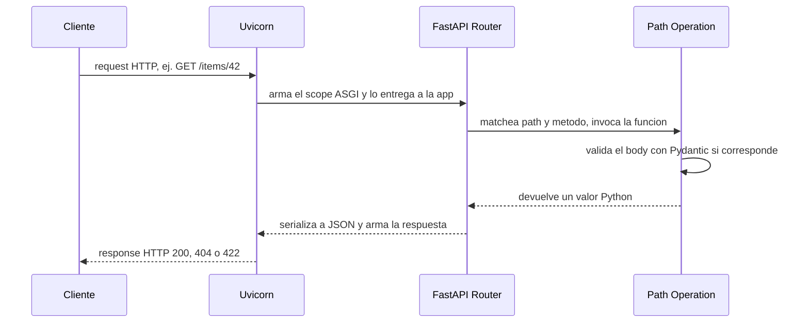
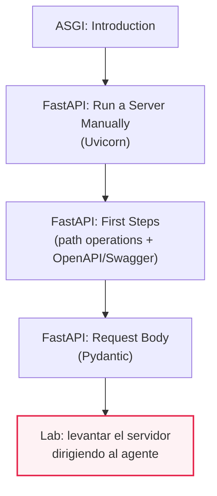
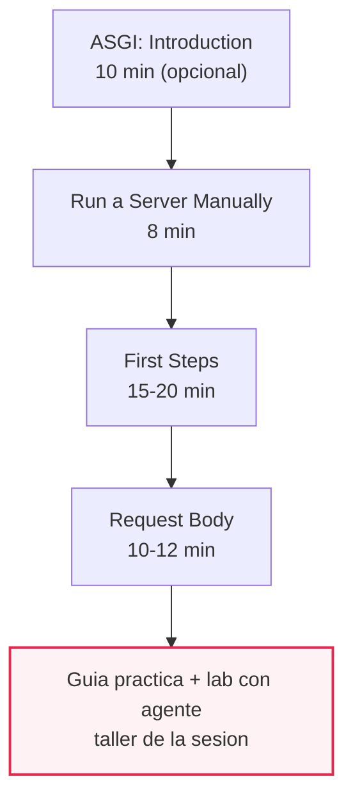

# M07·S03 — Nuestro primer webserver con FastAPI

**Módulo:** 07 — Fundamentos de Software + System Design para AI Engineers
**Fecha:** [Completar por el profesor: fecha]
**Duración de la sesión en clase:** 180 minutos
**Duración estimada de estudio fuera de clase:** ~2h30–3h (lectura de recursos ~45 min +
guía práctica ~45-60 min + ejercicios ~90 min)

**Artefacto:** el apunte completo como página navegable. https://gemini.google.com/share/14a645571390?skid=a431fc22-ecfa-4764-adbb-f85332423510

---

## 1. Objetivos de aprendizaje

Al terminar esta sesión vas a poder:

- **Explicar** qué es ASGI y qué rol específico juega Uvicorn como servidor por detrás de FastAPI.
- **Construir** path operations en FastAPI que atiendan distintos métodos HTTP, con path parameters y manejo de errores.
- **Diseñar** modelos Pydantic que validen y serialicen automáticamente el body de un request.
- **Usar** la documentación interactiva autogenerada (Swagger UI y ReDoc) para probar y debuggear una API sin herramientas externas.
- **Explicar y dibujar** el ciclo completo de una request, desde que sale del cliente hasta que vuelve la respuesta.
- **Dirigir** a un agente de código para levantar un servidor FastAPI con varios endpoints, leyendo y verificando cada archivo que genera en vez de aceptarlo sin mirar.

## 2. Resumen ejecutivo

En M07·S01 armaste el *trade-off journal* y viste la diferencia entre "escribir código" y "dirigir a un agente con criterio"; en M07·S02 recorriste la anatomía completa de una petición HTTP y aprendiste que un servidor dinámico es, en el fondo, un HTTP server + un application server + una base de datos. Hoy le ponés nombre y código a esas piezas: construís tu primer webserver real con **FastAPI**.

Vas a entender qué hace **Uvicorn** —el servidor ASGI que efectivamente recibe la conexión de red— y qué hace **FastAPI** —la aplicación que decide qué responder—; cómo una función de Python decorada se convierte en una *path operation* que atiende una ruta y un método HTTP; cómo un modelo **Pydantic** valida y serializa los datos sin que vos escribas ese código a mano; y cómo esas mismas anotaciones generan gratis una documentación interactiva (**Swagger UI** y **ReDoc**) que podés usar para probar tu API sin salir del navegador.

Para un AI Engineer esto no es un desvío hacia "backend puro": es la infraestructura donde va a vivir el núcleo de IA de cualquier producto que construyas —el RAG, el agente, el pipeline multimodal— y es el lenguaje que vas a usar el resto de la carrera para exponer esos sistemas como servicios. La sesión cierra con un lab donde dirigís a un agente de código para levantar el servidor, aplicando el mismo hábito de "entender para dirigir" que arrancó en S01: leer y entender cada archivo que el agente genera, no aceptarlo a ciegas. El routing práctico de hoy es además la base directa de M07·S04 (inyección de dependencias, middleware, capas router → service → repository).

## 3. Conceptos clave y glosario

| Término | Definición |
|---|---|
| **Webserver** *(visto en M07·S02)* | Programa que recibe pedidos HTTP y devuelve respuestas. Combina un HTTP server, un application server y, casi siempre, acceso a una base de datos. Hoy le ponés nombre concreto a esas piezas. |
| **ASGI** (Asynchronous Server Gateway Interface) | Especificación que define el contrato entre un servidor y una aplicación Python de forma asíncrona: es "sucesor espiritual" de WSGI, extendido al mundo async. Es análogo a un enchufe estándar: cualquier servidor ASGI puede hablar con cualquier aplicación ASGI, sin importar quién escribió a cada uno. |
| **WSGI** | El estándar clásico (síncrono) de compatibilidad entre servidores, frameworks y aplicaciones Python, predecesor de ASGI. |
| **`scope` / `receive` / `send`** | Las tres piezas de la interfaz ASGI: `scope` es un diccionario con los detalles de la conexión entrante (método, path, headers); `receive` y `send` son funciones asíncronas para recibir y mandar eventos al cliente. |
| **Uvicorn** | Programa servidor que implementa ASGI: el que efectivamente abre el socket, recibe la conexión de red y se la entrega a la aplicación (FastAPI). |
| **FastAPI** | Framework web ASGI de Python: la aplicación que decide, para cada request que le llega, qué función correr y qué responder. |
| **Path operation** | La combinación de un *path* (la parte de la URL desde la primera `/`) y una *operation* (un método HTTP: `GET`, `POST`, `PUT`, `DELETE`), declarada con un decorador sobre una función Python. |
| **Path parameter** | Parte variable de la URL, capturada como argumento de la función handler (por ejemplo `{item_id}` en `/items/{item_id}`). |
| **Request body** | Los datos que el cliente manda en el cuerpo del request (típicamente JSON), declarados como parámetro tipado con un modelo Pydantic. |
| **Pydantic `BaseModel`** | Clase de la que heredás para describir la forma de un dato (tipos, campos opcionales, valores por defecto). A partir de esa descripción, Pydantic valida y serializa automáticamente. |
| **Validación** | El chequeo automático de que los datos de entrada cumplen los tipos y restricciones declaradas. Si fallan, FastAPI devuelve un error 422 indicando exactamente dónde y qué dato estaba mal. |
| **Serialización** | La conversión inversa: de objetos Python (modelos, dicts) a JSON para armar la respuesta HTTP. |
| **JSON Schema** | Descripción formal y estandarizada de la forma de un dato. Pydantic la genera automáticamente a partir de tu modelo. |
| **OpenAPI** | Estándar para describir APIs REST. FastAPI genera automáticamente un esquema OpenAPI de tu servidor completo, a partir de tus path operations y tus modelos Pydantic. |
| **Swagger UI** (`/docs`) | Interfaz interactiva autogenerada a partir del esquema OpenAPI, donde podés ver y probar cada endpoint desde el navegador. |
| **ReDoc** (`/redoc`) | Interfaz alternativa de documentación, generada del mismo esquema OpenAPI que Swagger UI. |
| **`HTTPException`** | Clase de FastAPI para cortar la ejecución de un handler y devolver un error HTTP con código y detalle explícitos (por ejemplo, 404 cuando un recurso no existe). |
| **Código de estado (200 / 404 / 422)** | 200: éxito. 404: recurso no encontrado. 422: error de validación de la entrada. El tratamiento formal de la taxonomía completa de códigos HTTP es tema de S10; hoy los usás de forma práctica. |
| **`--reload`** | Flag de Uvicorn que reinicia el proceso automáticamente cada vez que detecta un cambio en el código. Solo para desarrollo, nunca en producción. |
| **Entorno virtual (venv)** | Entorno aislado de paquetes Python, para no pisar las dependencias globales del sistema ni las de otros proyectos. |

## 4. Notas de estudio por subtema

### El ciclo de una request: el mapa de toda la sesión

Antes de entrar subtema por subtema, esto es lo que conecta todo lo demás. Cada pieza que vas a estudiar hoy —Uvicorn, el router de FastAPI, un modelo Pydantic, la documentación automática— ocupa un lugar concreto en el recorrido de una única request HTTP. Volvé a este diagrama cada vez que te pierdas en el detalle de un subtema.



Es la misma estructura en cualquier aplicación FastAPI del mundo: cliente → Uvicorn (servidor ASGI) → router de FastAPI (matching de path + método) → handler (tu función) → de vuelta. Los subtemas 1 a 4 explican cada actor de este diagrama en detalle; el subtema 5 vuelve sobre él una vez que ya conocés las piezas.

### 1. Qué es un webserver y qué hace ASGI/Uvicorn por detrás

En M07·S02 ya viste que "webserver" es un término genérico: un servidor dinámico combina HTTP server + application server + acceso a una base de datos. Lo que faltaba era ponerle nombre concreto a esas piezas cuando trabajás con FastAPI, y eso es justamente **ASGI** y **Uvicorn**.

**ASGI** (Asynchronous Server Gateway Interface) es una especificación, no un programa: define el contrato que tiene que cumplir un servidor para poder hablar con una aplicación Python de forma asíncrona. Se presenta como el sucesor espiritual de **WSGI** —el estándar clásico de compatibilidad entre servidores, frameworks y aplicaciones Python—, extendido al mundo asíncrono. La pieza central de ese contrato son tres elementos: `scope` (un diccionario con los detalles de la conexión entrante: método, path, headers), y `receive`/`send` (dos funciones asíncronas para recibir eventos del cliente y mandarle eventos de vuelta). A diferencia de WSGI, que maneja un único flujo síncrono de principio a fin, ASGI admite múltiples eventos de entrada y salida por conexión, lo que es lo que habilita conexiones de larga duración como WebSockets.

**Uvicorn** es el programa que implementa ese contrato: es el servidor ASGI que efectivamente abre el socket de red, acepta la conexión entrante, arma el `scope` correspondiente y se lo entrega a tu aplicación. Se lo describe como "a high performance ASGI server". **FastAPI**, en cambio, es el framework: la aplicación ASGI que recibe ese `scope` y decide, según el path y el método, qué función tuya ejecutar.

Es la misma distinción que ya viste en M07·S02 para el diagrama de single server, solo que ahora tiene nombre propio: Uvicorn es la pieza concreta de "HTTP server" de aquel diagrama, y FastAPI es la pieza de "application server".

> 💡 **Tip:** pensá a Uvicorn como la recepción de un edificio de oficinas y a FastAPI como la empresa que trabaja adentro. La recepción (Uvicorn) atiende a cualquier visitante que llegue, sin importar a qué empresa venga a ver; una vez que confirma quién llegó y con qué pedido, se lo pasa a la empresa correcta (FastAPI), que es la que realmente sabe qué hacer con ese pedido.

> ⚠️ **Gotcha común:** confundir "levantar el servidor" con "escribir la aplicación". Cuando corrés `uvicorn main:app --reload`, Uvicorn es el proceso que arranca; `main:app` es la instrucción de "andá a buscar la variable `app` dentro del archivo `main.py`" — esa variable es tu aplicación FastAPI, no Uvicorn. Son dos programas distintos trabajando juntos.

**Para profundizar:** [Run a Server Manually — FastAPI](https://fastapi.tiangolo.com/deployment/manually/) y, como lectura de fondo opcional, [ASGI — Introduction](https://asgi.readthedocs.io/en/latest/introduction.html).

### 2. Path operations (routing) en FastAPI: request y response

Una **path operation** es la unidad básica de trabajo en FastAPI: una función de Python decorada con `@app.get`, `@app.post`, `@app.put` o `@app.delete`, que atiende una combinación específica de *path* (la ruta) y *operation* (el método HTTP). El nombre viene de ahí: el "path" es la última parte de la URL desde la primera `/`, y la "operation" es uno de los métodos HTTP — `POST` para crear datos, `GET` para leerlos, `PUT` para actualizarlos, `DELETE` para borrarlos.

```python
from fastapi import FastAPI

app = FastAPI()

@app.get("/items")
def get_items():
    return {"mensaje": "lista de items"}
```

Con solo ese decorador, FastAPI ya sabe: "cuando llegue un `GET` a `/items`, corré esta función y devolvé lo que retorne como JSON". No hace falta parsear manualmente el método ni el path: eso lo resuelve el router internamente antes de llegar a tu función.

Los parámetros de la URL se declaran directamente en el path entre llaves, y FastAPI se los pasa a la función automáticamente por nombre:

```python
@app.get("/items/{item_id}")
def get_item(item_id: str):
    ...
```

Cuando un recurso no existe, la forma correcta de responder no es devolver un string cualquiera con código 200: es levantar una `HTTPException` con el código de estado explícito.

```python
from fastapi import HTTPException

@app.get("/items/{item_id}")
def get_item(item_id: str):
    for item in items:
        if item["id"] == item_id:
            return item
    raise HTTPException(status_code=404, detail="Item not found")
```

> ⚠️ **Gotcha común:** el orden en el que declarás las rutas importa. Un router evalúa las path operations en el orden en que las vas declarando y usa la primera que matchea; si tenés una ruta con parámetro variable (`/items/{item_id}`) declarada antes que una ruta más específica (`/items/search`), la primera se va a comer los requests que iban para la segunda. Regla general: lo más específico, primero.

**Para profundizar:** [First Steps — FastAPI](https://fastapi.tiangolo.com/tutorial/first-steps/).

### 3. Modelos Pydantic: validación y serialización

Ya viste Pydantic y *type-safe development* en el Módulo 01; hoy lo aplicás a un uso nuevo: describir y validar el body de un request HTTP. La idea central es que declarás la forma de tus datos una sola vez, como una clase que hereda de `BaseModel`, y FastAPI se encarga del resto.

```python
from pydantic import BaseModel, Field
from typing import Optional
from datetime import datetime

class Item(BaseModel):
    id: Optional[str] = None
    title: str
    content: str
    created_at: datetime = Field(default_factory=datetime.now)
```

Con solo esa declaración de tipos, cuando usás `Item` como parámetro de una path operation, FastAPI va a: leer el body del request como JSON, convertir los tipos correspondientes si hace falta, y validar los datos — si son inválidos, va a devolver un error claro y prolijo (código 422), indicando exactamente dónde y qué dato estaba mal. Vos no escribís ese código de validación a mano.

```python
@app.post("/items")
def create_item(item: Item):
    item.id = str(uuid4())
    items.append(item.model_dump())
    return items[-1]
```

Además, Pydantic genera definiciones de **JSON Schema** para el modelo, que pasan a formar parte del esquema OpenAPI y alimentan la documentación automática del subtema 4. No es casualidad que Pydantic y la documentación automática compartan la misma fuente de verdad: es el mismo modelo el que valida, serializa y documenta.

> ⚠️ **Gotcha común #1 — valor por defecto evaluado una sola vez.** Si escribís `created_at: datetime = datetime.now()`, esa expresión se evalúa **una sola vez**, en el momento en que Python define la clase — no cada vez que creás una instancia nueva. El resultado es que todos los items que crees van a tener la misma fecha, la del momento en que arrancó el servidor. La forma correcta es `Field(default_factory=datetime.now)`: `default_factory` recibe una función y la llama de nuevo en cada instancia.

> ⚠️ **Gotcha común #2 — método deprecado.** `item.model_dump()` es el método vigente de Pydantic v2 para convertir un modelo a diccionario. `item.dict()` es el equivalente de Pydantic v1: todavía funciona en muchas instalaciones, pero está marcado como deprecado. Si ves `.dict()` en un tutorial viejo, es momento de reemplazarlo.

**Para profundizar:** [Request Body — FastAPI](https://fastapi.tiangolo.com/tutorial/body/).

### 4. Documentación OpenAPI/Swagger autogenerada

FastAPI genera un "schema" con toda tu API usando el estándar **OpenAPI** para definir APIs. Ese esquema no lo escribís vos a mano: sale directo de tus path operations (subtema 2) y tus modelos Pydantic (subtema 3). A partir de ese mismo esquema, FastAPI te da gratis dos interfaces de documentación interactiva:

- **Swagger UI**, en `http://127.0.0.1:8000/docs` — probás cada endpoint desde el navegador: ves los parámetros que espera, el modelo del body, y podés mandar un request de prueba con el botón "Try it out".
- **ReDoc**, en `http://127.0.0.1:8000/redoc` — una alternativa de solo lectura, más pensada para consultar la referencia completa que para probar en vivo.

Los dos sistemas leen del mismo esquema OpenAPI: si agregás un campo a tu modelo Pydantic o un endpoint nuevo, la documentación se actualiza sola la próxima vez que recargués la página. No hay que mantener un archivo de documentación aparte.

> 💡 **Tip práctico:** mientras armás el lab de hoy, dejá `/docs` abierto en una pestaña del navegador. Es más rápido para probar un endpoint nuevo que escribir un `curl` a mano, y te muestra en vivo el código de estado y el body de la respuesta.

> ⚠️ **Gotcha común:** OpenAPI es el *estándar* (la especificación de cómo describir una API); Swagger UI es *una* interfaz que sabe leer ese estándar y renderizarlo como página interactiva. No son sinónimos, aunque en la práctica muchas veces se usan como si lo fueran.

**Para profundizar:** [First Steps — FastAPI](https://fastapi.tiangolo.com/tutorial/first-steps/) (la misma página del subtema 2 dedica una sección completa a esto).

### 5. Diagrama de secuencia del ciclo de una request

Con las cuatro piezas anteriores ya explicadas, volvamos al diagrama del principio de esta sección y leámoslo de punta a punta:

1. El **cliente** manda un request HTTP (por ejemplo, `GET /items/42`).
2. **Uvicorn**, como servidor ASGI, recibe la conexión de red y arma el `scope` que exige la especificación ASGI (subtema 1).
3. Uvicorn le pasa ese `scope` a la aplicación **FastAPI**, que hace *matching* del path y el método contra las path operations declaradas — el "router" (subtema 2).
4. La función decorada correspondiente —el **handler**— corre. Si recibe un body, lo valida contra el modelo Pydantic declarado (subtema 3).
5. El handler devuelve un valor de Python (un dict, un modelo, una lista).
6. FastAPI serializa ese valor a JSON usando el esquema OpenAPI/Pydantic (subtema 3 y 4) y arma la respuesta HTTP con el código de estado correspondiente (200, 404, 422...).
7. Uvicorn manda esa respuesta de vuelta al cliente.

Es exactamente el mismo diagrama que abrió esta sección: no hay una estructura distinta para "el subtema 5", es el hilo que atraviesa todo lo anterior. Que lo puedas dibujar de memoria, con estos siete pasos, es una buena señal de que entendiste la sesión completa.

### 6. Lab con agente: levantar un servidor con 2-3 endpoints

Esta es la aplicación práctica de todo lo anterior, dirigida a un agente de código en vez de escrita a mano línea por línea — mismo enfoque que ya usaste en M07·S01 y M07·S02. El objetivo no es que el agente te entregue un servidor que "andás", sino que vos puedas explicar qué hace cada archivo que generó: qué path operations declaró, qué modelo Pydantic usó, por qué eligió los campos que eligió como opcionales.

El punto pedagógico es el mismo de las dos sesiones anteriores: leer y entender cada archivo que el agente genera, no aceptarlo sin mirar. El desarrollo completo, paso a paso, está en la sección **Guía práctica** de abajo.

### Mapa de relaciones entre recursos

El orden de consumo recomendado va de la base conceptual (qué es ASGI y qué hace Uvicorn) a los componentes de FastAPI (routing, Pydantic, OpenAPI), y termina en la práctica guiada del lab.



Dos aclaraciones que el diagrama no alcanza a mostrar:

- **"ASGI: Introduction" es lectura de fondo, no un paso obligatorio.** Si tenés apuro, podés saltar directo a "Run a Server Manually", que ya resume lo necesario para la clase.
- **Continuidad hacia atrás:** "Run a Server Manually" retoma "qué es un webserver" de M07·S02 y le pone nombre concreto (Uvicorn) a la pieza de "HTTP server" de aquel diagrama de single server.
- **Continuidad hacia adelante:** el routing práctico de hoy es la base de M07·S04 (inyección de dependencias, middleware, capas router → service → repository) y de M07·S10 (REST formal, códigos de estado, versionado).

## 5. Guía práctica paso a paso

Esta guía te lleva de cero hasta tener un servidor FastAPI corriendo en tu máquina, y después a dirigir a un agente para que lo extienda. El bloque de clase para esto está pensado así (default propuesto, ver la nota al final):

| Bloque | Tiempo | Qué se hace |
|---|---|---|
| Concepto | 40 min | Subtemas 1 y 2, con una demo en vivo de `/docs` autogenerado |
| Taller guiado con agente | 60 min | Crear el proyecto, pedirle al agente que arme 2-3 endpoints con un modelo Pydantic, leer archivo por archivo |
| Práctica autónoma | 45 min | Agregar validación (opcionales, defaults) y probar los casos de error (404, 422) desde `/docs` |
| Puesta en común | 20 min | Comparar endpoints y esquema Pydantic entre compañeros, mirando el `/docs` de cada uno |
| Cierre | 15 min | Entrada al trade-off journal + avance del diagrama de secuencia |

### Prerrequisitos

- Python instalado en tu máquina.
- Una terminal.
- Un agente de código instalado (Claude Code, ya usado en M07·S01 y M07·S02, o equivalente).

### Paso 1 — Crear el entorno virtual

```bash
python -m venv .venv
source .venv/bin/activate   # macOS / Linux
.venv\Scripts\activate      # Windows (PowerShell o cmd)
```

Usamos el módulo `venv` de la librería estándar de Python en vez de conda: alcanza para este lab y no agrega una dependencia externa.

**Verificación:** el prompt de tu terminal debería mostrar `(.venv)` al principio de la línea.

### Paso 2 — Instalar FastAPI

```bash
pip install "fastapi[standard]"
```

El extra `[standard]` instala FastAPI **junto con Uvicorn** (`uvicorn[standard]`) y el resto de dependencias recomendadas. Ojo con las comillas: hacen falta para que el comando funcione en todas las terminales.

**Verificación:** `pip show fastapi` te tiene que mostrar la versión instalada, sin error.

### Paso 3 — Escribir (o pedirle al agente) el servidor mínimo

Este es el punto de partida de referencia — 2-3 endpoints con un modelo Pydantic, sin base de datos:

```python
# main.py
from fastapi import FastAPI, HTTPException
from pydantic import BaseModel, Field
from typing import Optional
from datetime import datetime
from uuid import uuid4

app = FastAPI()


class Item(BaseModel):
    id: Optional[str] = None
    title: str
    content: str
    created_at: datetime = Field(default_factory=datetime.now)


items: list[dict] = []


@app.get("/items")
def get_items():
    return items


@app.post("/items")
def create_item(item: Item):
    item.id = str(uuid4())
    items.append(item.model_dump())
    return items[-1]


@app.get("/items/{item_id}")
def get_item(item_id: str):
    for item in items:
        if item["id"] == item_id:
            return item
    raise HTTPException(status_code=404, detail="Item not found")
```

Guardalo como `main.py`. Repasá el código contra los subtemas 2 y 3: `Field(default_factory=datetime.now)`, `model_dump()` y `HTTPException(status_code=404, ...)` son las tres correcciones que ya viste ahí — no `datetime.now()` como default directo, no `.dict()`, no un string cualquiera con código 200 para el caso de error.

### Paso 4 — Arrancar el servidor

Para esta sesión conviene usar la forma explícita, porque el objetivo de aprendizaje es entender qué hace Uvicorn:

```bash
uvicorn main:app --reload
```

- `main`: el nombre del archivo `main.py` (sin la extensión `.py`).
- `app`: el nombre de la variable con la instancia de `FastAPI()` dentro de ese archivo.
- `--reload`: reinicia el proceso automáticamente cada vez que detecta un cambio en el código — solo para desarrollo, nunca en producción.

> 💡 En tutoriales más nuevos vas a ver `fastapi dev` en vez de este comando: hace exactamente lo mismo, pero sin mostrar a Uvicorn como paso explícito. Para el objetivo de esta sesión, usar la forma explícita con `uvicorn` es mejor — pero sabé que `fastapi dev` (y `fastapi run` para producción) existen y son la forma abreviada.

**Verificación:** la terminal te tiene que mostrar que Uvicorn arrancó y quedó escuchando en `http://127.0.0.1:8000`.

### Paso 5 — Probar desde `/docs`

Abrí `http://127.0.0.1:8000/docs` en el navegador y probá, en este orden:

1. `GET /items` → debería devolver una lista vacía `[]`.
2. `POST /items` con un body válido (`title` y `content` como string) → debería devolver el item creado, con `id` y `created_at` completados solos.
3. `GET /items/{item_id}` con el `id` que te devolvió el paso anterior → debería devolver ese item, código 200.
4. `GET /items/{item_id}` con un id inventado → debería devolver 404 con el detalle `"Item not found"`.
5. `POST /items` con un body incompleto (por ejemplo, sin `content`) → debería devolver 422, señalando exactamente qué campo falta.

**Verificación:** si viste los cinco códigos de estado (200 en tres variantes, 404 y 422) sin escribir vos ese manejo de errores a mano, el lab está funcionando como se espera.

### Paso 6 — Dirigir al agente

Ahora el ejercicio real: en vez de escribir el servidor vos, pedile al agente que lo arme, y leé cada archivo que te devuelve. Un prompt de partida razonable:

> "Armame un servidor FastAPI con un modelo Pydantic para un recurso `[elegí el tuyo: tareas, notas, productos...]`, con estos endpoints: listar todos, crear uno nuevo (validando con Pydantic) y buscar uno por id devolviendo 404 si no existe. Sin base de datos, guardalo en memoria."

Después de que el agente te entregue el código:

- Leé el modelo Pydantic que armó: ¿qué campos hizo opcionales? ¿usó `default_factory` donde correspondía o se comió el mismo bug que corregimos en el paso 3?
- Leé cada path operation: ¿el path parameter tiene el tipo correcto? ¿usa `HTTPException` con el código correcto para el caso de "no encontrado"?
- Corré el servidor y repetí la verificación del paso 5 contra el código del agente.

### Extensión opcional — PUT y DELETE

Si el tiempo da, agregá los dos verbos que quedaron afuera del mínimo: mismo patrón de buscar por `item_id`, y en el caso de `PUT`, reemplazar los campos con los de un segundo modelo recibido como parámetro.

> 📝 **Nota para el profesor:** el reparto de tiempos de la tabla de arriba, la formación individual del lab (el trabajo en equipo recién arranca en S05), la carpeta de entrega (`webserver-fastapi/` en el repo personal del alumno, sin PR formal todavía) y el agente de referencia (Claude Code) son defaults razonables sin dato fijado en el plan del módulo. Ajustalos si tu grupo tiene otro ritmo, ya viene con equipos formados, o preferís otra herramienta de agente.

## 6. Ejercicios

### 🟢 Básico 1 — El contrato ASGI en tus palabras

Explicá, sin mirar los apuntes, qué hace Uvicorn y qué hace FastAPI en el ciclo de una request, usando el vocabulario `scope`/`receive`/`send`. ¿Qué pasaría si intentaras correr tu `main.py` sin ningún servidor ASGI corriendo?

**Sabés que lo lograste cuando** podés explicarlo en voz alta, sin leer, en menos de un minuto, y mencionás las tres piezas del contrato ASGI.

<details>
<summary>Pista</summary>
Pensá en la analogía de la recepción del edificio: ¿qué pasa si la empresa (FastAPI) existe pero no hay nadie atendiendo la puerta de entrada (Uvicorn)?
</details>

### 🟢 Básico 2 — Leer un status code

Dado el servidor de referencia del paso 3 de la guía práctica: si hacés `GET /items/abc123` y ese id no existe en la lista `items`, ¿qué código de estado devuelve y por qué? ¿Qué tendrías que cambiar en el código para que devuelva 200 con un body vacío en vez de 404?

**Sabés que lo lograste cuando** podés señalar la línea exacta de código responsable del 404 y explicar el trade-off de cambiar ese comportamiento.

<details>
<summary>Pista</summary>
Mirá qué pasa con el `for` si nunca encuentra el item — ¿qué línea corre después del loop?
</details>

### 🟡 Intermedio 1 — Agregar PUT con validación

Extendé el servidor de referencia con un endpoint `PUT /items/{item_id}` que reciba un modelo `Item` completo en el body y reemplace los campos del item existente, devolviendo 404 si el id no existe.

**Sabés que lo lograste cuando** podés actualizar un item desde `/docs`, ver el cambio reflejado en `GET /items/{item_id}`, y provocar el 404 a propósito con un id inventado.

<details>
<summary>Pista</summary>
El patrón es casi igual al de `GET /items/{item_id}`: buscá el item por id, y si lo encontrás, actualizá sus campos con los del `Item` que llegó como parámetro en vez de solo devolverlo.
</details>

### 🟡 Intermedio 2 — Romper algo a propósito

Sacale la anotación de tipo Pydantic al parámetro `item` de `create_item` (dejalo como un parámetro sin tipo, o tipado como `dict`) y observá qué cambia en `/docs` y en el comportamiento al mandar un body inválido. Documentá la diferencia.

**Sabés que lo lograste cuando** podés explicar por qué desapareció la validación automática y por qué `/docs` ya no muestra el schema del modelo para ese endpoint.

<details>
<summary>Pista</summary>
La validación y la documentación de FastAPI dependen de que vos declares el tipo — no son magia del framework, son consecuencia directa de la anotación de tipos.
</details>

### 🔴 Desafío — Tu propio mini-CRUD dirigiendo al agente

Elegí un recurso propio (no "items", no "tareas" del ejemplo de clase — algo de un proyecto que te interese) y dirigí a un agente de código para levantar un servidor FastAPI completo: `GET` lista, `GET` por id, `POST` crear (con validación Pydantic), `PUT` actualizar y `DELETE` borrar. Después:

1. Leé cada archivo que generó el agente y anotá qué decisiones tomó que vos no le pediste explícitamente (por ejemplo, qué campos hizo opcionales, qué mensaje de error eligió).
2. Probá los cinco endpoints desde `/docs`, confirmando los códigos 200, 404 y 422 en los casos que corresponde.
3. Escribí una entrada en tu trade-off journal sobre la decisión del punto 1 que más te sorprendió.

**Sabés que lo lograste cuando** el servidor corre sin errores, probaste los cinco endpoints desde `/docs` con al menos un caso de éxito y uno de error por endpoint relevante, y tenés la entrada del journal escrita.

<details>
<summary>Pista</summary>
Si el agente te devuelve más archivos de los que esperabas (por ejemplo, separó modelos y rutas en archivos distintos), no es un error: es una decisión de organización. Anotala también.
</details>

## 7. Ruta de estudio sugerida



Si vas con apuro, podés saltearte "ASGI: Introduction" y arrancar directo en "Run a Server Manually" — esa página ya resume lo que necesitás de Uvicorn para la clase. Los otros tres pasos sí son secuenciales: "First Steps" te da el vocabulario de path operations y OpenAPI que "Request Body" da por conocido cuando explica cómo Pydantic se conecta con el esquema generado.

## 8. Checklist de autoevaluación

- [ ] Puedo explicar la diferencia entre lo que hace Uvicorn y lo que hace FastAPI, usando el vocabulario `scope`/`receive`/`send`.
- [ ] Puedo decir de memoria para qué sirve `--reload` y por qué nunca se usa en producción.
- [ ] Puedo escribir una path operation con un decorador (`@app.get`, `@app.post`, etc.) y un path parameter.
- [ ] Puedo crear un modelo Pydantic con un campo opcional y un valor por defecto correctamente calculado (`default_factory` cuando corresponde).
- [ ] Puedo explicar por qué un body mal formado devuelve 422 sin que yo escriba ese código de validación a mano.
- [ ] Puedo abrir `/docs` y probar un endpoint completo sin usar `curl` ni Postman.
- [ ] Puedo explicar qué es el esquema OpenAPI y cómo se relaciona con Swagger UI y ReDoc.
- [ ] Puedo dibujar de memoria el ciclo completo de una request, cliente → Uvicorn → router → handler → respuesta.
- [ ] Puedo dirigir a un agente para levantar un servidor FastAPI y revisar, archivo por archivo, lo que generó, en vez de aceptarlo sin mirar.

## 9. Preguntas de repaso

1. ¿Qué diferencia hay entre lo que hace Uvicorn y lo que hace FastAPI en el ciclo de una request? ¿Por qué conviene separarlos conceptualmente aunque en la práctica los instales juntos?
2. ¿Por qué FastAPI puede validar y documentar tu API con solo que vos declares tipos en un modelo Pydantic? ¿Qué mecanismo hace que eso funcione "gratis"?
3. Si tu servidor devuelve 422 en un caso donde vos esperabas 404, ¿qué error de diseño probablemente cometiste en la path operation?
4. ¿Qué relación hay entre el esquema OpenAPI y lo que ves en `/docs`? ¿Podrías tener uno sin el otro?
5. ¿Qué significa que ASGI sea un contrato asíncrono entre servidor y aplicación? ¿Por qué esa característica va a importar cuando más adelante trabajes con streaming de la respuesta de un LLM?

## 10. Recursos adicionales

### Imprescindibles

- [FastAPI — Run a Server Manually](https://fastapi.tiangolo.com/deployment/manually/) — qué es Uvicorn y qué rol juega por detrás de FastAPI.
- [FastAPI — First Steps](https://fastapi.tiangolo.com/tutorial/first-steps/) — definición formal de path operation, y la sección de documentación automática (OpenAPI, Swagger UI, ReDoc).
- [FastAPI — Request Body](https://fastapi.tiangolo.com/tutorial/body/) — cómo un modelo Pydantic valida y serializa el body de un request.

### Recomendado

- [FastAPI — página principal (sección Installation)](https://fastapi.tiangolo.com/) — instalación con `fastapi[standard]` y arranque con `fastapi dev`/`fastapi run`.

### Opcional

- [ASGI — Introduction](https://asgi.readthedocs.io/en/latest/introduction.html) — la especificación completa; lectura de fondo, no imprescindible para el lab.
