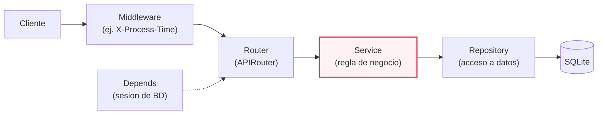
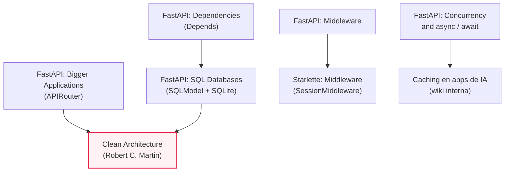
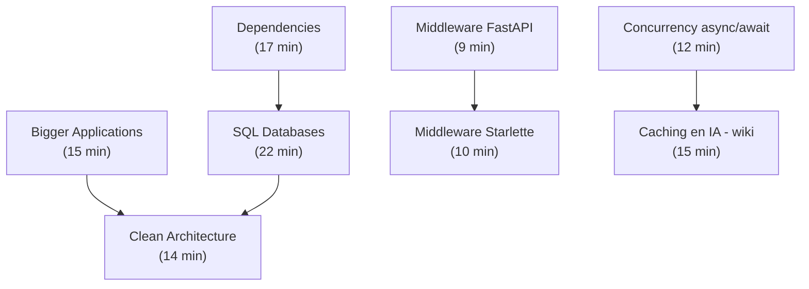

# M07·S04 — Componentes avanzados de FastAPI y separación en capas

**Módulo:** 07 — Fundamentos de Software + System Design para AI Engineers
**Fecha:** [Completar por el profesor: fecha]
**Duración estimada de estudio:** ~5 horas en total — lectura de recursos (~2 h) + guía práctica del lab (~1h30-2h) + ejercicios (~1h-1h30) —, además de las 3 horas de la sesión en clase.

---

## 1. Objetivos de aprendizaje

Al terminar esta sesión vas a poder:

1. **Explicar** qué problema resuelve la inyección de dependencias de FastAPI (`Depends`) y **usarla** para inyectar una conexión o sesión de base de datos en vez de depender de una variable global.
2. **Escribir** un middleware HTTP en FastAPI y **explicar** el orden de ejecución cuando hay más de uno registrado.
3. **Modularizar** un webserver con `APIRouter`, organizando las rutas por recurso con `prefix` y `tags`.
4. **Refactorizar** un webserver de un solo archivo a una arquitectura en capas (router → service → repository → datos) y **explicar** su enganche con la Clean Architecture.
5. **Configurar** persistencia mínima con SQLAlchemy sobre SQLite, incluyendo la sesión de base de datos como dependencia inyectada.
6. **Explicar y debuggear** por qué una llamada a una LLM API es el caso clásico tanto de procesamiento asíncrono (`async def`) como de caching, y **escribir** un endpoint `async` que lo demuestre.

---

## 2. Resumen ejecutivo

En M07·S03 armaste tu primer webserver con FastAPI: un puñado de endpoints que hacían de todo —recibir el request, validar, hablar con la base de datos, armar la respuesta— en el mismo archivo. Esta sesión toma ese webserver y lo convierte en algo que empieza a parecerse a una aplicación real: separás routing, reglas de negocio y acceso a datos en capas distintas —**router**, **service** y **repository**—, el mismo movimiento que describe la **Clean Architecture** de Robert C. Martin aplicada a un backend concreto. Dos mecanismos del framework sostienen esa separación en código: la **inyección de dependencias** (`Depends`), que le entrega a un handler lo que necesita sin que tenga que construirlo él mismo, y el **middleware**, que intercepta todo el tráfico para hacer algo transversal (medir tiempo, loguear, leer una cookie de sesión). La persistencia se resuelve con **SQLAlchemy sobre SQLite** —una base de un solo archivo, suficiente hasta que en M07·S07 migres a PostgreSQL.

Y como esta es la primera sesión pensada explícitamente para IA dentro del módulo, cerrás entendiendo por qué una llamada a una LLM API —una petición que tarda segundos— es a la vez el ejemplo de libro de una operación que conviene hacer **async** y de algo que conviene **cachear**. Para un AI Engineer esta separación no es un capricho arquitectónico: es lo que te permite reemplazar un mock por una llamada real a un modelo, migrar de SQLite a Postgres, o sumar caching, sin reescribir toda la app. La sesión retoma además el estado y la sesión que viste conceptualmente en M07·S02 y les da, por primera vez, un mecanismo concreto.

---

## 3. Conceptos clave / glosario

**Inyección de dependencias y capas**

- **Dependency Injection (DI) / `Depends`** — patrón en el que un componente no crea lo que necesita, sino que se lo entregan desde afuera. En FastAPI se implementa declarando el parámetro con `Depends(func)`. Analogía: es como pedir que te traigan la herramienta en vez de fabricarla vos mismo cada vez que la necesitás.
- **Función de dependencia** — una función sin decorador de ruta que FastAPI ejecuta antes del handler y cuyo resultado inyecta como parámetro.
- **`Annotated`** — sintaxis de tipado de Python (`typing.Annotated`) que permite adjuntarle metadata a un tipo; se usa para empaquetar una dependencia reutilizable en un alias, como `DbDep = Annotated[Connection, Depends(get_db)]`.
- **Capa de servicio (service layer)** — la capa que contiene las reglas de negocio de la aplicación (qué hay que hacer con el dato), separada de cómo se lo guarda.
- **Repository (patrón repository)** — la capa que traduce operaciones de negocio a consultas concretas contra el almacenamiento; es la única capa que conoce el motor de datos real.
- **Clean Architecture** — modelo de Robert C. Martin que organiza el código en círculos concéntricos donde las dependencias del código fuente solo pueden apuntar hacia adentro.
- **Regla de dependencia** — la regla central de Clean Architecture: ningún nombre de un círculo externo puede aparecer en el código de un círculo más interno.
- **Entities / Use Cases / Interface Adapters / Frameworks & Drivers** — las cuatro capas concéntricas de Clean Architecture, de la más estable (Entities) a la más concreta y cambiante (Frameworks & Drivers).

**Middleware y routers**

- **Middleware** — función que envuelve cada request y cada response del servidor entero, corriendo antes y después de cualquier ruta.
- **`call_next`** — la función que un middleware de FastAPI recibe como parámetro para pasarle el control (y el request) a la ruta correspondiente.
- **`APIRouter`** — una "mini aplicación FastAPI" que agrupa rutas relacionadas y se monta en la app principal con `app.include_router()`.
- **`prefix` / `tags`** — parámetros de un router: `prefix` antepone un segmento de path a todas sus rutas; `tags` las agrupa en la documentación OpenAPI.

**Persistencia**

- **ORM (Object-Relational Mapping)** — biblioteca que traduce entre objetos de un lenguaje de programación y filas de una base de datos relacional.
- **SQLAlchemy** — toolkit de Python para trabajar con bases SQL, con dos estilos: *Core* (tablas y consultas explícitas con `Table`/`Column`/`select`/`insert`) y *ORM declarativo* (clases Python mapeadas a tablas).
- **SQLite** — motor de base de datos relacional que guarda todo en un único archivo, sin necesidad de levantar un servidor de base de datos aparte.
- **SQLModel** — biblioteca construida sobre SQLAlchemy y Pydantic, del mismo autor de FastAPI, pensada para modelar tablas y validación con una sola clase.
- **Connection string** — la cadena que le dice a un motor de base de datos cómo y dónde conectarse (motor, credenciales, host, nombre de la base).

**Concurrencia, sesión y caching**

- **Concurrencia vs. paralelismo** — concurrencia es atender varias tareas alternando la atención mientras alguna espera algo externo (ideal para I/O); paralelismo es ejecutar varias tareas al mismo tiempo, de verdad, en núcleos o procesos distintos (ideal para CPU).
- **I/O-bound vs. CPU-bound** — una operación I/O-bound pasa la mayor parte del tiempo esperando algo externo (red, disco, otra API); una CPU-bound pasa el tiempo usando el procesador.
- **`async def` / `await`** — sintaxis de Python para declarar y esperar una operación asíncrona sin bloquear el proceso mientras espera.
- **Threadpool** — un conjunto de threads reservados donde FastAPI ejecuta las funciones declaradas con `def` normal, para no bloquear el resto del servidor mientras corren.
- **Estado de sesión** — información asociada a un cliente concreto que persiste entre varias peticiones (visto conceptualmente en M07·S02; acá se implementa con un mecanismo real).
- **`SessionMiddleware`** — middleware de Starlette que guarda estado de sesión en una cookie firmada, accesible como diccionario vía `request.session`.
- **Cookie firmada vs. cifrada** — firmada significa legible pero no modificable sin invalidar la firma; cifrada significa que no se puede ni leer sin la clave.
- **`HttpOnly`** — atributo de una cookie que la hace inaccesible desde JavaScript del lado del cliente, protección básica contra robo de sesión.
- **Caching de aplicación (prompt / exact / semantic)** — tres estrategias para no repetir un trabajo costoso: *prompt cache* evita reprocesar contenido repetido al inicio de un prompt, *exact cache* evita repetir la misma consulta exacta, *semantic cache* evita repetir consultas "parecidas" en significado.
- **Política de evicción (LRU / LFU / FIFO)** — la regla que decide qué sacar de una caché llena: lo menos usado recientemente (LRU), lo menos usado en general (LFU), o lo más viejo (FIFO).
- **Hashing vs. cifrado (para contraseñas)** — el hashing es unidireccional (no se puede recuperar el valor original ni con la clave); el cifrado es reversible. Una contraseña se hashea, nunca se cifra.

---

## 4. Notas de estudio por subtema

### El diagrama ancla: el webserver en capas

Todo lo que sigue en esta sesión se puede leer como una respuesta a una sola pregunta: ¿qué pasa entre que llega un request HTTP y se guarda (o se lee) un dato? La respuesta de hoy es que en el medio hay capas, cada una con una responsabilidad única:



Resaltamos **service** porque es la capa que más comúnmente falta cuando alguien arranca con FastAPI: es fácil organizar el código en carpetas (rutas acá, modelos allá) y creer que eso ya es "arquitectura en capas", pero si la regla de negocio sigue mezclada dentro del handler de la ruta, lo que hay es una separación de **archivos**, no de **responsabilidades**.

Una aclaración importante que el diagrama simplifica: `Depends` es un mecanismo de FastAPI, y FastAPI solo lo resuelve en la firma de una *path operation* (el handler del router) o en dependencias anidadas de otras dependencias. Eso significa que, en la práctica, la sesión de base de datos se inyecta en el **router**, y de ahí se pasa explícitamente como parámetro a `service`, que a su vez se la pasa a `repository`. El resto de las capas no sabe nada de FastAPI ni de cómo se resolvió esa conexión — solo la reciben como argumento. Y la respuesta, claro, recorre el camino inverso: repository → service → router → middleware (ahora del lado de la respuesta) → cliente.

---

### 1. Inyección de dependencias en FastAPI (`Depends`)

Antes de FastAPI, "inyección de dependencias" ya era un patrón general de ingeniería de software: en vez de que una función construya todo lo que necesita (una conexión, un cliente HTTP, un usuario autenticado), se lo recibe como parámetro, ya armado. Esto tiene dos ventajas concretas: la función se puede probar con una versión falsa de esa dependencia (sin tocar una base real), y la lógica de "cómo se construye" queda en un solo lugar en vez de repetida en cada archivo que la necesita.

FastAPI implementa esto de una forma particular: una **función de dependencia** es, básicamente, una función normal de Python que no lleva ningún decorador — se puede pensar como "una *path operation function* sin el decorador". Se inyecta con `Depends(func)` como parámetro del handler, **sin llamarla** (sin paréntesis): FastAPI la ejecuta por vos y le pasa el resultado al handler. La documentación oficial de FastAPI enumera casos de uso explícitos para esto: lógica compartida entre varias rutas, compartir conexiones de base de datos, y forzar seguridad, autenticación o control de roles, entre otros, "minimizando la repetición de código".

El caso más común que vas a usar hoy es una dependencia con `yield`, que separa "preparar el recurso" de "liberarlo", garantizando que el `finally` corra incluso si el handler tira una excepción:

```python
# repositories/db.py
from typing import Annotated
from fastapi import Depends
from sqlalchemy.engine import Connection
from config.db import engine


def get_db() -> Connection:
    connection = engine.connect()
    try:
        yield connection
    finally:
        connection.close()


DbDep = Annotated[Connection, Depends(get_db)]
```

Con esto, cada request recibe **su propia** conexión, y la conexión se cierra automáticamente al terminar — muy distinto de importar una conexión ya abierta como variable global y compartirla entre todos los requests que le toquen al proceso.

> ⚠️ **Errores comunes:** escribir `Depends(get_db())` (llamando a la función) en vez de `Depends(get_db)` es el error más frecuente — con paréntesis, Python ejecuta la función una sola vez al definir la ruta, exactamente el problema que `Depends` está para evitar. Otro clásico es olvidarse el `try/finally` alrededor del `yield`: sin eso, una excepción en el handler deja la conexión abierta para siempre.

📎 Para profundizar: [Dependencies — FastAPI](https://fastapi.tiangolo.com/tutorial/dependencies/)

---

### 2. Middleware

Un middleware es una función que se ejecuta alrededor de **toda** la aplicación: antes de que cualquier request llegue a una ruta, y después de que cualquier response esté lista para salir. Es la herramienta correcta para algo que aplica a todos los endpoints por igual (medir tiempo, loguear, leer una cookie) sin tener que repetir ese código en cada handler.

En FastAPI, la forma más simple de declarar uno es con el decorador `@app.middleware("http")` sobre una función `async` que recibe `request` y `call_next` — la función que efectivamente le pasa el control a la ruta correspondiente y devuelve la response:

```python
# main.py
import time
from fastapi import FastAPI, Request

app = FastAPI()


@app.middleware("http")
async def add_process_time_header(request: Request, call_next):
    start_time = time.perf_counter()
    response = await call_next(request)
    response.headers["X-Process-Time"] = str(time.perf_counter() - start_time)
    return response
```

Cuando se agregan varios middlewares con `add_middleware` (el método que usan, por ejemplo, los middlewares de Starlette como `SessionMiddleware`), el orden de ejecución en el request es **inverso** al orden en que se agregaron: el último middleware agregado es "el más externo" y corre primero. Vale la pena visualizarlo como capas de cebolla, no como una fila: el primero que agregás queda más cerca de la ruta, y el último queda más cerca del cliente.

> ⚠️ **Errores comunes:** olvidarse `await call_next(request)` (o no devolver la `response`) deja al servidor sin responder, porque la ruta nunca recibe el control o la respuesta nunca vuelve al cliente. Otro error típico es asumir que el orden de ejecución es el mismo en que se registran los middlewares — es al revés, y con dos o tres middlewares encadenados eso puede cambiar el comportamiento observado.

📎 Para profundizar: [Middleware — FastAPI](https://fastapi.tiangolo.com/tutorial/middleware/)

---

### 3. Routers y modularización con `APIRouter`

A medida que un webserver crece, tener todas las rutas en `main.py` se vuelve inmanejable. `APIRouter` resuelve esto funcionando como una "mini aplicación FastAPI": agrupás las *path operations* de un mismo recurso en su propio archivo y después las montás en la app principal con `app.include_router()`.

```python
# routes/user.py
from fastapi import APIRouter

router = APIRouter(prefix="/users", tags=["users"])


@router.get("/")
def list_users():
    ...
```

```python
# main.py
from fastapi import FastAPI
from routes.user import router as user_router

app = FastAPI()
app.include_router(user_router)
```

El parámetro `prefix` antepone un segmento común a todas las rutas del router (así no repetís `/users` en cada `@router.get(...)`), y `tags` las agrupa visualmente en la documentación automática (`/docs`). El router también puede recibir `dependencies` — una lista de dependencias que se aplican a **todas** las rutas del archivo de una sola vez, útil por ejemplo para inyectar la sesión de base de datos a todo un recurso sin repetirlo ruta por ruta — y `responses`, para documentar respuestas comunes. Un router incluso puede incluir a otro router adentro (`router.include_router(other_router)`), lo que permite anidar agrupaciones cuando el proyecto crece más.

> ⚠️ **Errores comunes:** crear el `APIRouter` y nunca llamar `app.include_router(...)` — el archivo existe, pero las rutas jamás quedan registradas en la app y devuelven 404. También es común duplicar el prefijo: poner `/users` en el `prefix` del router **y además** repetirlo dentro de cada path (`@router.get("/users/{id}")`), lo que termina generando `/users/users/{id}`.

📎 Para profundizar: [Bigger Applications - Multiple Files — FastAPI](https://fastapi.tiangolo.com/tutorial/bigger-applications/)

---

### 4. Arquitectura en capas: router → service → repository (Clean Architecture)

Organizar el código en carpetas (`routes/`, `services/`, `repositories/`) es un primer paso, pero no alcanza si la regla de negocio sigue viviendo mezclada dentro del handler de la ruta, que además llama directo a la base de datos. Eso es separar **archivos**, no separar **responsabilidades** con fronteras claras.

La **Clean Architecture**, propuesta por Robert C. Martin en 2012 integrando ideas de arquitecturas previas (Hexagonal, Onion, DCI, Screaming Architecture), da un marco formal para esto: un modelo de círculos concéntricos con cuatro capas típicas — **Entities** (las reglas de negocio de más alto nivel, las menos propensas a cambiar), **Use Cases** (reglas específicas de la aplicación, que orquestan el flujo entre entidades), **Interface Adapters** (convierten datos entre formatos internos y externos: controllers, presenters, y la lógica de persistencia) y **Frameworks & Drivers** (los detalles concretos: base de datos, framework web, herramientas). La regla que sostiene todo el modelo es la **regla de dependencia**: *"source code dependencies can only point inwards"* — ningún nombre de un círculo externo puede aparecer en el código de un círculo más interno.

Aplicado al webserver de esta sesión, el mapeo queda así:

| Capa del webserver | Capa de Clean Architecture | Qué hace |
|---|---|---|
| **Router** | Interface Adapter (controller) | Traduce un request HTTP a una llamada de función; no sabe nada de reglas de negocio. |
| **Service** | Use Case | Aplica la regla de negocio (por ejemplo, "hashear la contraseña antes de guardarla"); no sabe cómo se persiste el dato. |
| **Repository** | Interface Adapter (gateway) | Traduce la operación a una consulta concreta; es la única capa que conoce SQLAlchemy. |
| **Datos (SQLite)** | Frameworks & Drivers | El detalle concreto de dónde vive el dato — reemplazable sin tocar las capas de arriba. |

La regla de dependencia explica, además, **por qué** el service no debería importar nada de SQLAlchemy directamente: esa dependencia se invierte a través de la interfaz que expone el repository. Si el service llamara directo a `sqlalchemy.select(...)`, ya no sería independiente del motor de datos, y perderías la razón principal por la que separaste las capas.

> ⚠️ **Errores comunes:** la trampa más común en un CRUD chico es preguntarse "¿vale la pena tanta capa para esto?" y, ante la duda, escribir la consulta SQL "solo esta vez" directo en el service o en el router. Cada excepción de esas rompe la regla de dependencia y, acumuladas, terminan en un service que en la práctica es indistinguible del handler original. Este es justo el tipo de decisión que corresponde anotar en el trade-off journal: para un CRUD de dos campos capaz la separación no se justifica; para un backend que vas a mantener meses, casi seguro sí.

📎 Para profundizar: [The Clean Architecture — Robert C. Martin](https://blog.cleancoder.com/uncle-bob/2012/08/13/the-clean-architecture.html)

---

### 5. Persistencia mínima con SQLite (SQLAlchemy como ORM)

**SQLite** es un motor de base de datos relacional que guarda todo en un único archivo, sin necesidad de levantar un servidor de base de datos aparte — por eso es la elección natural para este momento del proyecto (en M07·S07 migrás a PostgreSQL, cuando el proyecto lo necesite). SQLAlchemy es el toolkit de Python que media entre tu código y ese archivo: define el `engine` (la conexión configurada), las tablas y las consultas.

La documentación oficial de FastAPI usa SQLite justamente "porque usa un único archivo y Python tiene soporte integrado", y arma su tutorial de referencia sobre **SQLModel** —una biblioteca construida sobre SQLAlchemy y Pydantic, hecha por el mismo autor de FastAPI, que permite modelar una tabla y su validación con una sola clase—. SQLAlchemy en sí mismo ofrece dos estilos de trabajo: *Core*, con tablas definidas explícitamente (`Table`, `Column`, `MetaData`) y consultas armadas a mano (`select`, `insert`, `update`, `delete`), y el *ORM declarativo*, con clases Python mapeadas a tablas. Ambos estilos son válidos; lo que importa para esta sesión es entender el patrón, no memorizar la sintaxis de uno en particular.

```python
# config/db.py
from sqlalchemy import create_engine, MetaData

sqlite_url = "sqlite:///./store.db"
engine = create_engine(sqlite_url, connect_args={"check_same_thread": False})
meta = MetaData()
```

El `connect_args={"check_same_thread": False}` es específico de SQLite y lo pide la propia documentación oficial de FastAPI: hace falta porque FastAPI puede usar más de un thread para atender una misma solicitud, y sin ese parámetro SQLite se queja si dos requests distintos tocan la misma conexión desde threads distintos. La forma idiomática de exponer la sesión de base de datos es, otra vez, como una dependencia con `yield` (ver subtema 1) — la propia documentación oficial empaqueta esto como `SessionDep = Annotated[Session, Depends(get_session)]`, garantizando una sesión nueva por request.

> ⚠️ **Errores comunes:** olvidar `check_same_thread=False` produce errores intermitentes y difíciles de reproducir (solo aparecen bajo carga concurrente). No cerrar la conexión al final del request (olvidarse el `finally` de la dependencia) puede dejar la base "bloqueada" — un mensaje típico de SQLite es *"database is locked"*. Y como la URL usa una ruta relativa (`./store.db`), el archivo termina apareciendo en carpetas distintas según desde dónde corras `uvicorn` si no sos consistente.

📎 Para profundizar: [SQL (Relational) Databases — FastAPI](https://fastapi.tiangolo.com/tutorial/sql-databases/)

---

### 6. Estado, sesión, caching y procesamiento asíncrono: la LLM API como caso clásico

En M07·S02 ya viste qué es el "estado" y por qué conviene sacarlo del proceso del servidor y guardarlo en un datastore externo (el sexto factor de Twelve-Factor). Hoy le ponemos mecanismo concreto a eso: **sesión** vía cookie, y una regla clara sobre cuándo un endpoint debería ser `async`.

**Async vs. sync.** La documentación oficial de FastAPI da un criterio simple: conviene `async def` cuando se usan librerías compatibles con `await` —típicamente para llamar una API externa o una base de datos asíncrona— o cuando la app no necesita comunicarse con nada externo; conviene `def` normal con librerías síncronas, o directamente ante la duda. Esto se apoya en distinguir dos tipos de operación:

| | I/O-bound | CPU-bound |
|---|---|---|
| **Qué hace** | Esperar una respuesta externa (red, disco, otra API) | Usar el procesador (procesar imagen/audio, machine learning) |
| **Se beneficia de** | Concurrencia (`async`/`await`) | Paralelismo real (varios procesos) |
| **Ejemplo de esta sesión** | Llamar a una LLM API | Redimensionar una imagen subida |

Cuando una *path operation* se declara con `def` normal, FastAPI no la deja bloqueando el servidor: la corre en un **threadpool** externo en vez de llamarla directo. Esto explica por qué todas las rutas síncronas contra SQLAlchemy Core de esta sesión "están bien" así (SQLite es rápido y local), y por qué eso cambiaría apenas una de esas rutas tuviera que esperar una respuesta de red de varios segundos.

**Sesión.** Starlette (el framework ASGI sobre el que corre FastAPI) trae `SessionMiddleware` como middleware *built-in*: agrega sesiones HTTP basadas en **cookies firmadas** —legibles pero no modificables por el cliente, es decir, firmadas, no cifradas— accesibles como un diccionario en `request.session`, con la cookie siempre marcada `HttpOnly` (inaccesible desde JavaScript del lado del cliente). Se configura con `secret_key` (la clave para firmar), `session_cookie` (el nombre, por defecto `"session"`), `max_age` (expiración en segundos, por defecto dos semanas), `same_site` (por defecto `'lax'`) y `https_only`. Es, en sí mismo, la prueba de que "sesión" y "middleware" son la misma pieza vista desde dos ángulos: `SessionMiddleware` es exactamente un middleware que intercepta el ciclo request/response para leer y escribir una cookie.

**Caching.** Una llamada a una LLM API no es solo lenta (candidata a `async`): también es cara y con contenido que se repite entre requests (un system prompt, un documento, los primeros turnos de una conversación), lo que la hace candidata a **caching**. En aplicaciones de IA conviene distinguir varios tipos de caché: el *KV cache* vive del lado del proveedor del modelo (optimiza la propia inferencia) y no lo controlás vos; el *prompt cache* (también llamado context cache o prefix cache) evita reprocesar contenido repetido al principio de un prompt; el *exact cache* evita recalcular la respuesta ante la **misma** consulta exacta; y el *semantic cache* intenta reconocer consultas distintas que significan lo mismo. Según cifras que reporta Chip Huyen en *AI Engineering* (O'Reilly, 2025) sobre datos publicados por Anthropic (2024) y Google Gemini, un system prompt de 1.000 tokens con un millón de llamadas diarias representa aproximadamente mil millones de tokens de input repetidos por día; Anthropic promete hasta un 90 % de ahorro de costo y hasta un 75 % de reducción de latencia con prompt caching, y Gemini ofrece un 75 % de descuento en tokens cacheados (con un cargo de almacenamiento de USD 1,00 por millón de tokens por hora).

Para exact y semantic cache, el diseño requiere decidir dónde guardar (memoria del proceso, o algo compartido como Redis/Postgres), qué política de evicción usar (LRU, LFU o FIFO) y, sobre todo, **qué no cachear**: queries específicas de un usuario o sensibles al tiempo. El ejemplo clásico de lo que puede salir mal es cachear la respuesta a "¿cuál es su política de devoluciones?" sin tener en cuenta que la política depende de la membresía del usuario — si la respuesta cacheada de un usuario premium se le sirve a alguien sin membresía (o viceversa), eso es una fuga de datos entre usuarios, no solo una respuesta incorrecta.

> ⚠️ **Errores comunes:** declarar `async def` en un endpoint y después llamar código síncrono bloqueante adentro (por ejemplo `time.sleep()` en vez de `await asyncio.sleep()`) no gana nada — sigue bloqueando el mismo hilo, solo que ahora también rompe la promesa que hace `async def`. Del lado del caching, el error más caro es cachear sin política de expiración ni de evicción: la caché crece sin límite (memory leak) o, peor, sirve una respuesta vieja o de otro usuario como si fuera nueva.

📎 Para profundizar: [Concurrency and async / await — FastAPI](https://fastapi.tiangolo.com/async/) y [Middleware — Starlette](https://starlette.dev/middleware/)

---

### 7. Diagrama de componentes del webserver en capas

Esta sesión pide, como entregable visual, dibujar el diagrama de componentes del webserver en capas — el mismo que abre la sección 4 de este documento. No es casualidad que sea el mismo diagrama: es la síntesis de los subtemas 1 a 5, y vale la pena volver a mirarlo ahora que ya tenés el vocabulario completo.

Lo que el diagrama afirma, capa por capa, es exactamente el mapeo con Clean Architecture de la tabla del subtema 4: el **router** es tu Interface Adapter del lado HTTP, el **service** es tu Use Case, el **repository** es tu Interface Adapter del lado de datos, y **SQLite** es tu Frameworks & Drivers. El **middleware** envuelve a las cuatro capas desde afuera —no es una capa más en la cadena, sino algo que corre alrededor de todo el ciclo— y **`Depends`** es el mecanismo puntual que conecta el router con la infraestructura (la conexión de base de datos) sin que el router tenga que construirla él mismo.

> 💡 **Tip para dibujarlo vos:** un buen test de si entendiste la arquitectura es poder dibujar este diagrama de memoria, con los nombres de archivo reales de tu proyecto en cada caja, y explicar en una frase qué haría falta cambiar en cada capa si mañana tuvieras que migrar de SQLite a PostgreSQL (spoiler: solo el repository y la configuración del engine).

---

### Mapa de relaciones entre recursos

Los siete recursos de esta sesión se organizan en **tres tracks independientes** que podés estudiar en cualquier orden relativo entre sí — la única dependencia real es que conviene entender `Depends` antes de leer sobre `SQL Databases`, porque ese tutorial ya asume que sabés qué es una dependencia:



Resaltamos **Clean Architecture** porque es el nodo donde convergen los dos hilos del track de capas y persistencia: es el marco que le da sentido tanto a "por qué modularizar rutas" como a "por qué inyectar la sesión de base de datos en vez de importarla global".

---

## 5. Guía práctica paso a paso

Esta sesión no se escribe línea por línea: se dirige a un agente de código (consistente con M07·S01 a M07·S03), pero **vos tenés que leer y entender cada archivo que el agente genera** — ese es el punto pedagógico de todo el bloque. Esta guía te sirve tanto para armar el prompt de dirección como para verificar lo que el agente produjo.

**Prerequisitos:**
- El proyecto de M07·S03 corriendo (`webserver-fastapi/`, o el nombre que le hayas dado, con FastAPI + Uvicorn funcionando).
- Python instalado y el entorno virtual de esa sesión disponible.
- Un agente de código configurado en tu terminal (Claude Code, consistente con las sesiones anteriores).

### Paso 1 — Verificar el punto de partida

Confirmá que el proyecto de S03 sigue funcionando antes de tocar nada:

```bash
cd webserver-fastapi/
source .venv/bin/activate        # macOS / Linux
uvicorn main:app --reload
```

**Verificación:** abrí `http://127.0.0.1:8000/docs` en el navegador y confirmá que ves los endpoints de S03.

### Paso 2 — Instalar lo que falta

```bash
pip install "fastapi[standard]" sqlalchemy
pip install "passlib[bcrypt]"
```

`fastapi[standard]` ya lo tenías de S03 (incluye Uvicorn); `sqlalchemy` es nuevo para la persistencia, y `passlib[bcrypt]` es el algoritmo de hashing que vas a usar en el service para no guardar contraseñas en texto plano ni en un formato reversible.

**Verificación:** `pip show sqlalchemy` y `pip show passlib` muestran una versión instalada, sin error.

### Paso 3 — Armar la estructura de carpetas

Sumá `services/` y `repositories/` a lo que ya tenías de S03 (`routes/`, `models/`, `schemas/`, `config/`):

```
webserver-fastapi/
├── main.py
├── config/
│   └── db.py
├── models/
├── schemas/
├── routes/
├── services/
└── repositories/
    └── db.py
```

Podés mantener el dominio que ya tenías en S03 (por ejemplo `items`), o arrancar uno nuevo (`users`) — lo que importa para esta sesión es la separación en capas, no el dominio elegido.

### Paso 4 — Configurar el motor de SQLite

```python
# config/db.py
from sqlalchemy import create_engine, MetaData

sqlite_url = "sqlite:///./store.db"
engine = create_engine(sqlite_url, connect_args={"check_same_thread": False})
meta = MetaData()
```

**Verificación:** desde una consola de Python en el entorno virtual, `from config.db import engine` no debería tirar ningún error.

### Paso 5 — Escribir el repository (conexión inyectada, no global)

```python
# repositories/db.py
from typing import Annotated
from fastapi import Depends
from sqlalchemy.engine import Connection
from config.db import engine


def get_db() -> Connection:
    connection = engine.connect()
    try:
        yield connection
    finally:
        connection.close()


DbDep = Annotated[Connection, Depends(get_db)]
```

Después, el repository del recurso concreto usa esa dependencia para ejecutar las consultas:

```python
# repositories/user_repository.py
from sqlalchemy import select, insert
from models.user import users
from repositories.db import DbDep


def create_user(db: DbDep, name: str, email: str, hashed_password: str) -> dict:
    result = db.execute(insert(users).values(name=name, email=email, password=hashed_password))
    db.commit()
    row = db.execute(select(users).where(users.c.id == result.lastrowid)).first()
    return dict(row._mapping)


def get_user(db: DbDep, user_id: int) -> dict | None:
    row = db.execute(select(users).where(users.c.id == user_id)).first()
    return dict(row._mapping) if row else None
```

**Verificación:** este archivo no importa nada de `fastapi` salvo lo que ya viene empaquetado en `DbDep` — no debería tener `Request`, `APIRouter` ni nada de routing.

### Paso 6 — Escribir el service (regla de negocio)

```python
# services/user_service.py
from passlib.context import CryptContext
from repositories import user_repository
from repositories.db import DbDep
from schemas.user import UserCreate

pwd_context = CryptContext(schemes=["bcrypt"], deprecated="auto")


def register_user(db: DbDep, data: UserCreate) -> dict:
    hashed_password = pwd_context.hash(data.password)  # regla de negocio: nunca en texto plano
    return user_repository.create_user(db, data.name, data.email, hashed_password)
```

**Verificación:** este archivo no debería importar `sqlalchemy` en ningún lado — solo habla con `user_repository`.

### Paso 7 — Escribir el router

```python
# routes/user.py
from fastapi import APIRouter
from schemas.user import UserCreate
from services import user_service
from repositories.db import DbDep

router = APIRouter(prefix="/users", tags=["users"])


@router.post("/")
def create_user(user: UserCreate, db: DbDep):
    return user_service.register_user(db, user)
```

Y registralo en `main.py` con `app.include_router(router)`.

**Verificación:** en `/docs` aparece el nuevo endpoint agrupado bajo el tag `users`; podés probarlo con "Try it out" y confirmar que se crea una fila en `store.db`.

### Paso 8 — Agregar el middleware de tiempo de respuesta

```python
# main.py
import time
from fastapi import FastAPI, Request
from routes.user import router as user_router

app = FastAPI()
app.include_router(user_router)


@app.middleware("http")
async def add_process_time_header(request: Request, call_next):
    start_time = time.perf_counter()
    response = await call_next(request)
    response.headers["X-Process-Time"] = str(time.perf_counter() - start_time)
    return response
```

**Verificación:** `curl -i http://127.0.0.1:8000/users/` (o cualquier endpoint) y confirmá que la respuesta trae el header `X-Process-Time`.

### Paso 9 — Agregar el endpoint `async` que simula la LLM API

```python
# routes/assistant.py
import asyncio
from fastapi import APIRouter

router = APIRouter(prefix="/assistant", tags=["assistant"])


@router.post("/ask")
async def ask_assistant(question: str):
    await asyncio.sleep(2)  # simula la latencia de red de una LLM API
    return {"answer": f"Respuesta simulada a: {question}"}
```

Registralo también en `main.py` con `app.include_router(router)`.

**Verificación:** llamalo desde `/docs` y confirmá que tarda ~2 segundos; después probá mandar dos requests casi al mismo tiempo (dos pestañas del navegador, o dos `curl` en paralelo) y confirmá que el servidor sigue respondiendo a otros endpoints mientras el primero "espera".

### Paso 10 — Stretch opcional: LLM real + caching

Si el tiempo alcanza, reemplazá el `asyncio.sleep(2)` por una llamada real con `httpx.AsyncClient()` al endpoint `POST /v1/messages` de la Claude API (el mismo endpoint que ya usaste con `curl` en M07·S02), y agregá una caché simple (un `dict` en memoria con un hash de la pregunta como clave) para no repetir la llamada ante la misma consulta — una versión mínima de *exact caching*.

> 📝 **Nota para el profesor:** el reparto de los 180 minutos que asume esta guía sigue el ritmo estándar de semanas 1-2 (~40 min de concepto y demo del antipatrón conexión-global-vs-`Depends` / ~60 min de taller guiado refactorizando a capas / ~45 min de práctica autónoma con el endpoint async / ~20 min de puesta en común comparando diagramas de componentes / ~15 min de cierre con el trade-off journal). El lab se plantea **individual**, como en M07·S02 y M07·S03 (el trabajo en equipo arranca recién en S05), dirigido con **Claude Code**, con entrega en la misma carpeta `webserver-fastapi/` de S03 (sin PR formal todavía). Ajustá lo que no coincida con tu grupo.

---

## 6. Ejercicios

### 🟢 Básico 1 — Antipatrón vs. `Depends`

Mirá este fragmento:

```python
# db.py
from sqlalchemy import create_engine
engine = create_engine("sqlite:///./store.db")
con = engine.connect()  # se ejecuta una sola vez, al importar el módulo
```

```python
# routes/items.py
from db import con
from sqlalchemy import select
from models import items

@router.get("/items")
def list_items():
    return con.execute(select(items)).fetchall()
```

Explicá, en tus palabras, dos problemas concretos que tiene este patrón. Después escribí cómo se vería la versión corregida con `Depends`.

**Sabés que lo lograste cuando:** nombraste al menos dos problemas reales (por ejemplo: todas las requests comparten la misma conexión, no hay forma de cerrarla por request, es imposible testear con una base distinta sin tocar el import) y tu versión con `Depends` declara una función `get_db` con `yield` inyectada como `Depends(get_db)` en el handler.

<details>
<summary>Pista</summary>

Pensá qué pasa si dos requests llegan casi al mismo tiempo y uno de ellos deja la conexión en un estado raro.

</details>

### 🟢 Básico 2 — ¿`async def` o `def`?

Para cada uno de estos cuatro endpoints, decidí si conviene declararlo con `async def` o con `def` normal, y justificá con el criterio de I/O-bound vs. CPU-bound:

a) Un endpoint que llama a la API de un proveedor de LLM y espera la respuesta.
b) Un endpoint que redimensiona una imagen subida por el usuario antes de guardarla.
c) Un endpoint que hace una consulta simple a SQLite con SQLAlchemy Core (síncrono).
d) Un endpoint que hace tres llamadas a APIs externas distintas y junta las tres respuestas.

**Sabés que lo lograste cuando:** identificaste a/d como candidatos naturales a `async def` (I/O-bound, esperan red), a b como candidato a paralelismo real más que a `async` puro (CPU-bound), y a c como "conviene `def`, porque la librería es síncrona".

<details>
<summary>Pista</summary>

Repasá la distinción entre concurrencia (alternar mientras algo espera) y paralelismo (usar más CPU al mismo tiempo, de verdad).

</details>

### 🟡 Intermedio 1 — Refactor a capas

Partiendo de un router de S03 que hace todo en el handler (recibe el request, valida, arma la consulta SQL y devuelve la respuesta), separalo en router → service → repository. El service tiene que aplicar al menos una regla de negocio real (por ejemplo, no permitir crear un ítem con precio negativo). Usá `Depends` para inyectar la conexión.

**Sabés que lo lograste cuando:** el router no importa `sqlalchemy` en ningún lado; el service no importa nada de `fastapi` (`Request`, `Depends`, etc.); el repository es el único archivo que ejecuta `select`/`insert`/`update`/`delete`; y la app sigue funcionando de punta a punta (podés probarla desde `/docs`).

<details>
<summary>Pista</summary>

Si te cuesta decidir dónde va una línea de código, preguntate: "¿esto es una regla de negocio, o es una forma concreta de guardar el dato?".

</details>

### 🟡 Intermedio 2 — Dos middlewares y el orden importa

Agregale a tu webserver un segundo middleware que loguee en consola el método y el path de cada request entrante (antes de que llegue al router). Registralo junto con el de `X-Process-Time` y respondé por escrito: ¿en qué orden se ejecutan sobre un request real? Comprobalo agregando un `print` con un identificador distinto en cada uno.

**Sabés que lo lograste cuando:** tu respuesta escrita coincide con lo que ves impreso en la consola al hacer un request real, y podés explicar por qué el orden es ese.

<details>
<summary>Pista</summary>

Revisá qué dice la documentación oficial sobre `add_middleware` y el orden de ejecución cuando hay varios registrados.

</details>

### 🔴 Desafío 1 — El webserver de S03, en capas

Tomá el proyecto completo de M07·S03 y refactorizalo dirigiendo a tu agente de código: estructura en capas (router/service/repository), persistencia con SQLite vía SQLAlchemy, al menos un middleware, y al menos una regla de negocio real en el service (más allá de "guardar tal cual"). Documentá en tu trade-off journal si te pareció que valía la pena la separación en capas para un CRUD tan chico, y por qué.

**Sabés que lo lograste cuando:** las capas del diagrama de esta sesión (middleware, router, service, repository, datos) existen como código separado y funcionan de punta a punta; podés explicar, sin mirar el código, qué hace cada capa; el diagrama de componentes que dibujás coincide con lo que realmente construiste; y hay una entrada nueva en tu trade-off journal.

<details>
<summary>Pista</summary>

Empezá por el repository (la capa más "de abajo"), seguí con el service y terminá con el router — así cada capa ya tiene lista la pieza que necesita cuando la escribís.

</details>

### 🔴 Desafío 2 — Async + caching, con datos reales

Reemplazá el endpoint mockeado (`asyncio.sleep(2)`) por una llamada real a una LLM API con `httpx.AsyncClient()`, y agregale una caché exacta simple: un diccionario en memoria donde la clave es un hash de la pregunta y el valor es la respuesta ya generada. Medí, con el middleware de `X-Process-Time` que ya tenés, la diferencia de tiempo entre la primera llamada a una pregunta y una segunda llamada idéntica.

**Sabés que lo lograste cuando:** el endpoint sigue siendo `async def` y usa `await` para la llamada HTTP; la segunda llamada a la misma pregunta es notablemente más rápida (se ve en el header `X-Process-Time`); y podés explicar en una frase qué tipo de caché implementaste (exact cache) y por qué no serviría para dos preguntas distintas que significan lo mismo.

<details>
<summary>Pista</summary>

`hashlib` de la librería estándar de Python te alcanza para el hash de la pregunta; no hace falta nada más sofisticado para esta versión.

</details>

---

## 7. Ruta de estudio sugerida

Los siete recursos se agrupan en tres tracks que corren en paralelo — podés estudiarlos en el orden relativo que prefieras entre tracks, pero **dentro** de cada track el orden sí importa:



| Track | Recurso | Tiempo | Por qué en ese orden |
|---|---|---|---|
| Capas y persistencia | Dependencies (FastAPI) | 15-18 min | Base para entender `Depends` antes de verlo aplicado a una sesión de BD. |
| Capas y persistencia | SQL Databases (FastAPI) | 20-25 min | Usa `Depends` con `yield` — no tiene sentido sin el paso anterior. |
| Capas y persistencia | Bigger Applications (FastAPI) | 15 min | Formaliza `APIRouter`, independiente del hilo de `Depends`. |
| Capas y persistencia | The Clean Architecture (R. C. Martin) | 12-15 min | Cierra el track: da el marco que explica por qué separar router/service/repository. |
| Middleware y sesión | Middleware (FastAPI) | 8-10 min | El mecanismo general, primero. |
| Middleware y sesión | Middleware (Starlette) | 10 min | La implementación concreta de sesión sobre ese mecanismo. |
| Async y caching | Concurrency and async / await (FastAPI) | 12 min | Por qué una llamada a una LLM API pide `async def`. |
| Async y caching | Caching en apps de IA (wiki interna) | 15 min | Por qué esa misma llamada también conviene cachear. |

---

## 8. Checklist de autoevaluación

- [ ] Puedo explicar qué problema resuelve `Depends` sin mirar los apuntes, y por qué una conexión global a la base de datos es un antipatrón.
- [ ] Puedo escribir un middleware en FastAPI que modifique la respuesta antes de devolverla.
- [ ] Puedo explicar el orden de ejecución cuando hay más de un middleware registrado con `add_middleware`.
- [ ] Puedo organizar rutas en varios archivos con `APIRouter` y montarlas en la app principal con `prefix` y `tags`.
- [ ] Puedo dibujar de memoria el diagrama de capas (router → service → repository → datos) y decir qué hace cada capa.
- [ ] Puedo explicar el enganche entre esas capas y las cuatro capas de Clean Architecture (Entities, Use Cases, Interface Adapters, Frameworks & Drivers).
- [ ] Puedo configurar SQLAlchemy contra SQLite y explicar para qué sirve `check_same_thread=False`.
- [ ] Puedo explicar la diferencia entre concurrencia y paralelismo, y decidir si una función debería ser `async def` o `def`.
- [ ] Puedo explicar por qué una llamada a una LLM API es a la vez un caso clásico de async y de caching.
- [ ] Puedo explicar la diferencia entre una cookie firmada y una cifrada, y qué hace el atributo `HttpOnly`.

---

## 9. Preguntas de repaso

1. Un compañero te muestra un endpoint donde la conexión a la base de datos se abre como variable global al importar el módulo. ¿Qué problemas concretos le señalarías, y cómo lo resolverías con `Depends`?
2. ¿Por qué la regla de dependencia de Clean Architecture dice que el service no debería importar SQLAlchemy directamente? ¿Qué se rompe exactamente si lo hace?
3. Te piden agregar dos middlewares a una app: uno que mide tiempo de respuesta y otro que valida un header. ¿En qué orden los registrarías y por qué importa ese orden?
4. ¿Por qué un endpoint que llama a una LLM API es un buen candidato tanto para `async def` como para caching? ¿En qué se diferencian esos dos problemas que resuelve cada técnica?
5. Si tuvieras que justificarle a un product manager por qué vale la pena separar router/service/repository en un CRUD chico, ¿qué le dirías? ¿Y en qué caso le dirías que no vale la pena?

---

## 10. Recursos adicionales

**Imprescindible**

- [Dependencies — FastAPI](https://fastapi.tiangolo.com/tutorial/dependencies/) — la fuente primaria de `Depends`, con los casos de uso oficiales (lógica compartida, conexiones de BD, seguridad).
- [Middleware — FastAPI](https://fastapi.tiangolo.com/tutorial/middleware/) — el mecanismo general de middleware, con el ejemplo de `X-Process-Time`.
- [Bigger Applications - Multiple Files — FastAPI](https://fastapi.tiangolo.com/tutorial/bigger-applications/) — `APIRouter`, `prefix`, `tags`, `dependencies` a nivel router y routers anidados.
- [SQL (Relational) Databases — FastAPI](https://fastapi.tiangolo.com/tutorial/sql-databases/) — el tutorial oficial de persistencia con SQLite y SQLModel, con la sesión de BD como dependencia.

**Recomendado**

- [The Clean Architecture — Robert C. Martin](https://blog.cleancoder.com/uncle-bob/2012/08/13/the-clean-architecture.html) — el post original de 2012, con la regla de dependencia y las cuatro capas concéntricas.
- [Concurrency and async / await — FastAPI](https://fastapi.tiangolo.com/async/) — cuándo usar `async def` vs `def`, y la distinción concurrencia/paralelismo.

**Opcional**

- [Middleware — Starlette](https://starlette.dev/middleware/) — `SessionMiddleware` y el resto de los middlewares *built-in* (CORS, GZip, TrustedHost).
- Chip Huyen, *AI Engineering: Building Applications with Foundation Models* (O'Reilly, 2025) — capítulo sobre caching en aplicaciones de IA (prompt/exact/semantic cache, políticas de evicción). Disponible en la wiki interna del bootcamp, sin URL pública.
