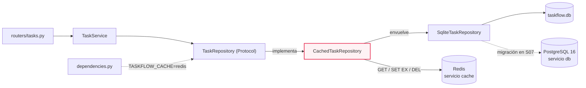
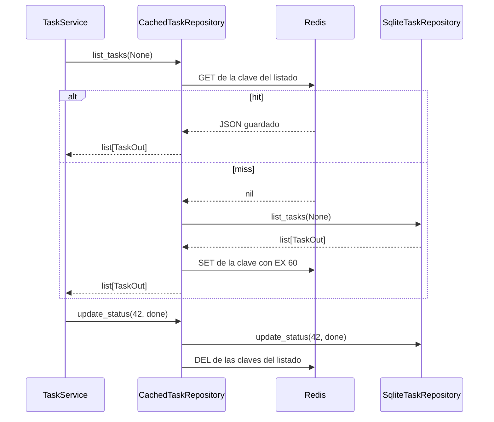
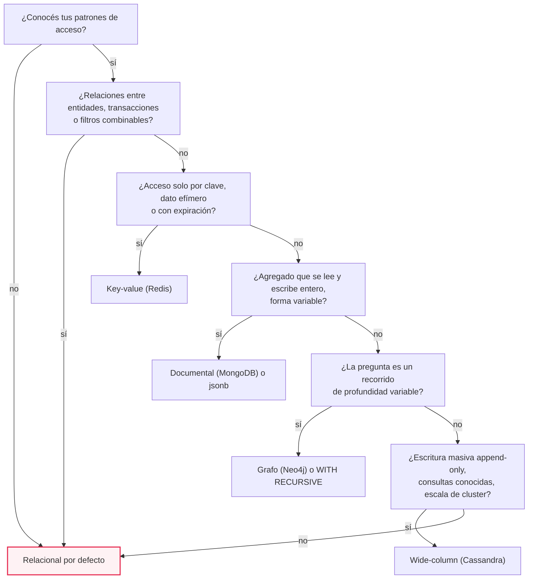
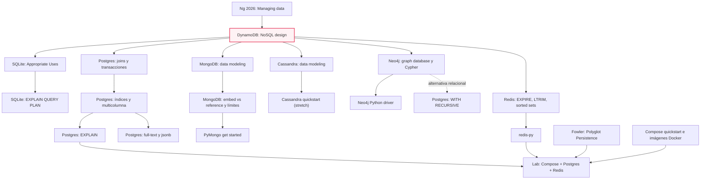
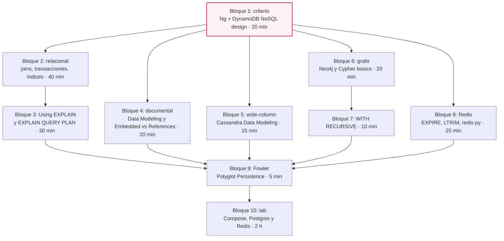

# M07·S06 — Elegir base de datos según el patrón de acceso

**Módulo:** 07 — Fundamentos de Software + System Design para AI Engineers · Semana 2 (Gestión de datos y diseño de APIs)
**Sesión:** M07·S06
**Fecha:** [Completar por el profesor: fecha]
**Tema:** Elegir el almacenamiento de TaskFlow a partir de las preguntas que la aplicación le hace a los datos. Las cinco familias (relacional, documental, wide-column, grafo, key-value) modelando **el mismo dato**, un índice medido con `EXPLAIN` y una caché cache-aside en Redis enchufada como un adaptador más del `TaskRepository`.
**Duración estimada de estudio:** ~9 h en total: 3 h de sesión (lab en equipo), ~2 h de lectura imprescindible y ~4 h de ejercicios.

---

## 1. Objetivos de aprendizaje

Al terminar esta sesión vas a poder:

1. **Derivar** los patrones de acceso de TaskFlow (qué se lee, qué se escribe, con qué frecuencia, con qué forma, qué tan fresco y por cuánto tiempo) **antes** de nombrar ninguna tecnología, y escribirlos en una tabla.
2. **Modelar** la misma tarea de TaskFlow en SQL, en un documento de MongoDB, en tablas de Cassandra, en un grafo de Neo4j y en claves de Redis, y **explicar** qué pregunta queda barata y cuál cara en cada una.
3. **Medir** con `EXPLAIN ANALYZE` (PostgreSQL) y `EXPLAIN QUERY PLAN` (SQLite) el efecto de un índice compuesto sobre la consulta del tablero, y **explicar** por qué ese índice no sirve para otra consulta.
4. **Construir** una caché cache-aside en Redis como un adaptador más del `TaskRepository` de S05, sin tocar ni el service ni el router, y **verificar** con tests que se invalida al escribir.
5. **Justificar** la decisión de almacenamiento de TaskFlow con criterios de velocidad, escalabilidad y costo (incluido el costo de sumar una base más) y **registrarla** como TJ-004 en el trade-off journal.

---

## 2. Resumen ejecutivo

En **M07·S05** dejaste TaskFlow andando: un webserver FastAPI en capas, con la entidad Tarea guardada en SQLite detrás de un `Protocol` (`TaskRepository`) que se cambia desde `dependencies.py`. Hoy le hacés a ese prototipo la pregunta que viene después: **¿dónde tienen que vivir los datos de TaskFlow cuando crezca?**

La respuesta no sale de la moda ni de "Mongo escala más". Sale de los **patrones de acceso**: las preguntas concretas que la aplicación le hace a los datos. Abrir el tablero de un proyecto, mover una tarea, leer el detalle con sus comentarios, filtrar por responsable, mostrar la actividad reciente, validar una sesión. Cada una tiene su forma, su frecuencia y su exigencia de frescura, y cada familia de bases resuelve bien algunas y mal otras. Para verlo sin abstracciones, vas a modelar **el mismo dato** (la tarea #42 con sus etiquetas y comentarios) en las cinco familias.

La conclusión, que vas a defender en tu trade-off journal: **TaskFlow es un problema relacional**. PostgreSQL es la fuente de verdad (la migración se hace en **M07·S07**) y Redis entra solo para lo efímero: caché del tablero, sesiones y actividad reciente. Y no te quedás en la teoría: medís un índice con `EXPLAIN` y escribís la caché como un tercer adaptador del mismo `Protocol` de S05. Es la idea de S04 (caching como decisión de arquitectura) llevada a código, y es lo que un AI Engineer tiene que saber exigirle al agente: "mostrame el plan antes y después".

---

## 3. Conceptos clave

Solo los términos **nuevos** de hoy.

| Término | Definición | Analogía |
|---|---|---|
| **Patrón de acceso** (*access pattern*) | Una pregunta concreta y recurrente que la aplicación le hace a los datos, con su forma, su frecuencia y su exigencia de frescura. Ejemplo: "tareas del proyecto 7 ordenadas por estado y posición, cada vez que alguien abre el tablero". | El recorrido que hacés todos los días en tu casa: la cocina queda al lado del comedor por eso. |
| **Índice compuesto** | Índice sobre varias columnas en un orden fijo, por ejemplo `(project_id, status, position)`. Sirve a las consultas que filtran por igualdad empezando por la **columna líder** (la primera). | Una guía telefónica por apellido y después nombre: sirve para buscar "Pérez, Ana", no para buscar todas las "Ana". |
| **Query plan** | La receta que elige el *planner* de la base para ejecutar una consulta: recorrer toda la tabla (`Seq Scan` / `SCAN`) o entrar por un índice (`Index Scan` / `SEARCH`), ordenar en memoria o no. `EXPLAIN` la muestra. | El GPS te muestra la ruta antes de manejar. |
| **ACID** | Las cuatro garantías de una transacción: **A**tomicidad (todo o nada), **C**onsistencia (la base pasa de un estado válido a otro que respeta sus reglas), a**I**slamiento (las transacciones concurrentes no se ven a medio hacer) y **D**urabilidad (lo confirmado sobrevive a un corte). | Una transferencia bancaria: o se mueve la plata de las dos cuentas, o no se mueve de ninguna. |
| **Normalizar / desnormalizar** | Normalizar es guardar cada dato una sola vez y relacionarlo por claves (y reensamblarlo con JOIN al leer). Desnormalizar es duplicarlo a propósito para que una lectura salga sin JOIN, a cambio de mantener las copias al escribir. | Una agenda con el teléfono de cada persona en un solo lugar vs. anotarlo en cada evento. |
| **Full-text search** | Búsqueda por palabras con soporte lingüístico (plurales, conjugaciones) y ranking. En Postgres: `tsvector`, `tsquery` y el operador `@@`, indexable con GIN. | El índice alfabético de un libro, en vez de leer página por página. |
| **`jsonb`** | Tipo de columna de Postgres que guarda JSON en formato binario, indexable con GIN y consultable con operadores como `@>`. El término medio entre relacional y documental. | Un cajón de "varios" dentro de un mueble ordenado. |
| **Embeber vs referenciar** | Las dos formas de relacionar datos en una base documental: meter el hijo dentro del documento padre (embeber) o guardarlo aparte con el id del padre (referenciar). | Guardar el manual dentro de la caja del producto, o en una biblioteca aparte. |
| **Partition key / clustering columns** | En Cassandra, la partition key decide en qué nodo del cluster vive una fila; las clustering columns ordenan las filas dentro de esa partición. Una consulta eficiente siempre da la partition key. | El cajón de un archivador (partición) y el orden de las carpetas dentro del cajón (clustering). |
| **Grafo de propiedades** | Modelo de datos con **nodos** (con labels y propiedades) y **relaciones** con nombre, dirección y propiedades. Las consultas son recorridos (*traversals*). | Un mapa de subte: estaciones y líneas que las unen. |
| **TTL** (*time to live*) | Tiempo de vida de una clave en Redis: al vencer, la clave se borra sola. Una clave con TTL se llama *volátil*. | Un yogur con fecha de vencimiento que se tira solo. |
| **Cache-aside** (*lazy loading*) | Patrón de caché donde la aplicación primero busca en la caché; si no está (*miss*), lee de la fuente de verdad y guarda el resultado en la caché; al escribir, **invalida** (borra) la entrada. | Tener a mano en el escritorio los papeles que más usás; si falta uno, vas al archivo y lo dejás en el escritorio. |
| **Polyglot persistence** | Usar más de una tecnología de almacenamiento en la misma aplicación, cada una para el patrón de acceso que mejor resuelve. Tiene un costo: más sistemas que operar y aprender. | Tener heladera y alacena: cada cosa donde mejor se conserva, pero son dos muebles que mantener. |

**Ya vistos, solo como refresco:** SQLite y sus límites (M07·S05: "compite con `fopen()`", un escritor a la vez); `TaskRepository` como puerto con `typing.Protocol` y `dependencies.py` como punto de intercambio (M07·S05); `TestClient` y `dependency_overrides` (M07·S05); caching y estado como decisión de arquitectura (M07·S04); trade-off journal con formato `TJ-NNN` (M07·S01; S05 cerró TJ-001 a TJ-003); Docker (lo usaste en M03 para self-hostear n8n); placeholders `?` contra SQL injection (M07·S05).

---

## 4. Notas de estudio por subtema

### El mapa de lo que vas a construir

Este es el diagrama ancla. Es el diagrama de componentes de S05 con **una caja nueva**: un adaptador que envuelve a otro.



Tres cosas para leer en el dibujo:

- **El service y el router no cambian.** El `CachedTaskRepository` cumple el mismo `Protocol` que el adaptador de SQLite, así que el service no se entera de que hay una caché. Es la prueba de fuego de la capa repository que armaste en S05.
- **PostgreSQL ya está levantado pero la app todavía no lo usa.** Hoy lo usás para **medir** (índices, `EXPLAIN`); la app se conecta en S07.
- **Redis no es la fuente de verdad.** Si Redis se vacía, TaskFlow sigue andando: la próxima lectura va a SQLite y vuelve a llenar la caché.

---

### 4.1 El patrón de acceso como criterio

La pregunta equivocada es "¿qué base es mejor?". La correcta es **"¿qué le va a preguntar mi aplicación a los datos, cuántas veces y con qué urgencia?"**. Andrew Ng lo pone como una competencia central en su *AI Engineering Skills Map* (2026), en la sección *Managing data*: pensar los patrones de acceso para decidir qué guardar y por cuánto tiempo, y elegir modelos de datos y tipos de almacenamiento (tablas relacionales, documentos, key-value, grafos), porque esa elección afecta velocidad, escalabilidad, disponibilidad, confiabilidad y costo. Y agrega algo que explica por qué esta sesión existe: **los datos son relativamente difíciles de cambiar, aun con agentes ayudando en las migraciones**. Un endpoint mal diseñado se reescribe en una tarde; una base mal elegida te acompaña meses.

La guía de diseño NoSQL de AWS para DynamoDB (producto de AWS, pero el criterio es general) nombra tres propiedades de un patrón de acceso que tenés que conocer antes de diseñar:

- **Data size:** cuánto dato se guarda y se pide de una vez.
- **Data shape:** qué forma tiene lo que se pide (una fila, una lista, un agregado con hijos, un recorrido).
- **Data velocity:** a qué ritmo se lee y se escribe.

A esas tres les sumás dos que salen de Ng: **frescura** (¿tolera datos de hace unos segundos?) y **ciclo de vida** (¿vive para siempre, o expira?).

La misma guía dice algo que va a ser clave para la decisión final: en un modelo NoSQL no deberías diseñar el esquema hasta conocer las preguntas que tiene que responder, mientras que en un RDBMS *"you can go ahead and create a normalized data model without thinking about access patterns"* (podés crear un modelo normalizado sin pensar en los patrones de acceso). Traducido: **cuando todavía no conocés bien tus preguntas, relacional es la opción segura**, porque consultás de forma flexible después.

**Los patrones de TaskFlow.** Esta es la tabla que vas a completar en el lab (las frecuencias son cualitativas a propósito: todavía no tenés tráfico real que medir):

| # | Patrón | L/E | Forma | Frecuencia | Frescura | Qué pide | Decisión TaskFlow |
|---|---|---|---|---|---|---|---|
| P1 | **Tablero** de un proyecto (por estado y posición) | L | Lista de tarjetas | Muy alta | Segundos | Filtro + orden sin sort en memoria | Postgres + índice `(project_id, status, position)`; caché Redis si se mide que hace falta |
| P2 | **Mover** una tarea | E | Una fila + reordenar vecinas | Alta, concurrente | Inmediata | Atomicidad | Postgres, transacción (detalle en S07) |
| P3 | **Detalle** con comentarios y etiquetas | L | Agregado | Media | Segundos | Reensamblar o tener junto | Postgres con JOINs; comentarios paginados |
| P4 | **Comentar** | E | Append a lista sin techo | Media | Inmediata | Append barato | Postgres, tabla `comments` |
| P5 | **Buscar y filtrar** (responsable, etiqueta, vencimiento, texto) | L | Subconjunto combinable | Media | Segundos | Índices secundarios, full-text | Postgres (B-tree, GIN, `tsvector`) |
| P6 | **Actividad reciente** (últimos N movimientos) | E intensiva + L | Serie append-only | Alta en escritura | Segundos | Append O(1), últimos N | Redis `LPUSH` + `LTRIM` como vista |
| P7 | **Sesiones** de login | L/E por clave | Blob chico por id | Cada request autenticado | Inmediata | Get/set + expiración | Redis con TTL (se implementa en S14) |
| P8 | *(hipotético)* **Dependencias** "la #40 bloquea a la #42", en cadena | L | Grafo | Baja | Segundos | Recorridos | Fuera de alcance; si entrara, `WITH RECURSIVE` en Postgres |

**Del patrón al código.** Un patrón bien escrito se traduce casi directo a una consulta. Así se ve P1:

```sql
-- P1: "tareas del proyecto 7, agrupadas por estado y ordenadas por posición"
SELECT id, title, status, position, assignee
FROM tasks
WHERE project_id = 7          -- filtro por igualdad  -> columna líder del índice
ORDER BY status, position;    -- orden               -> columnas siguientes del índice
```

Si podés escribir la consulta de cada patrón, tenés la mitad del diseño hecho: el `WHERE` te dice qué indexar y el `ORDER BY` te dice en qué orden.

> ⚠️ **Gotcha:** "escalar" no es un patrón de acceso. "Mongo escala mejor" o "Cassandra aguanta millones de escrituras" son respuestas a preguntas que TaskFlow no hace. Si una justificación no nombra un patrón concreto de la tabla, no es una justificación.

> 💡 **Tip para dirigir al agente:** antes de pedirle un esquema, pegale la tabla de patrones y pedile que te diga, para cada patrón, qué consulta lo resuelve y qué índice la sostiene. Si propone una base distinta, pedile que nombre el patrón que la justifica.

📚 Para profundizar: [NoSQL design for DynamoDB](https://docs.aws.amazon.com/amazondynamodb/latest/developerguide/bp-general-nosql-design.html)

---

### 4.2 Relacional / SQL: la línea de base

El modelo relacional guarda el dato **normalizado** en tablas con esquema fijo, relacionadas por claves, y lo **reensambla al leer** con JOINs. Te da tres cosas que TaskFlow necesita: relaciones entre entidades, transacciones ACID y consultas flexibles (cualquier combinación de filtros, sin haberla previsto). Es la línea de base contra la que se compara cada familia de hoy.

#### El esquema mínimo

Solo lo necesario para P1–P5 (el modelo ER completo, con Usuario, Equipo y roles, es de S07):

```sql
-- schema.sql (PostgreSQL 16)
CREATE TABLE projects (
    id   BIGINT GENERATED ALWAYS AS IDENTITY PRIMARY KEY,
    name TEXT NOT NULL
);

CREATE TABLE tasks (
    id         BIGINT GENERATED ALWAYS AS IDENTITY PRIMARY KEY,
    project_id BIGINT NOT NULL REFERENCES projects(id),
    title      TEXT   NOT NULL,
    status     TEXT   NOT NULL CHECK (status IN ('backlog', 'in_progress', 'done')),
    position   INT    NOT NULL,
    assignee   TEXT,                      -- string libre, como en S05; FK a users en S07
    due_date   DATE,
    created_at TIMESTAMPTZ NOT NULL DEFAULT now()
);

CREATE TABLE comments (
    id         BIGINT GENERATED ALWAYS AS IDENTITY PRIMARY KEY,
    task_id    BIGINT NOT NULL REFERENCES tasks(id) ON DELETE CASCADE,
    author     TEXT   NOT NULL,
    body       TEXT   NOT NULL,
    created_at TIMESTAMPTZ NOT NULL DEFAULT now()
);

CREATE TABLE labels (
    id   BIGINT GENERATED ALWAYS AS IDENTITY PRIMARY KEY,
    name TEXT NOT NULL UNIQUE
);

CREATE TABLE task_labels (                -- N:M tarea <-> etiqueta
    task_id  BIGINT NOT NULL REFERENCES tasks(id) ON DELETE CASCADE,
    label_id BIGINT NOT NULL REFERENCES labels(id),
    PRIMARY KEY (task_id, label_id)
);
```

- `GENERATED ALWAYS AS IDENTITY` es el autoincremento estándar de Postgres. En SQLite, `INTEGER PRIMARY KEY` hace lo mismo: por eso el esquema de S05 no se copia tal cual.
- `CHECK (status IN (...))` repite en la base la regla del `Enum` de Pydantic de S05. La base es la última línea de defensa: si algún día alguien escribe por fuera de la API, la regla sigue valiendo.

#### P1 — el tablero y el índice compuesto

La doc de PostgreSQL lo dice directo: *"By default, the `CREATE INDEX` command creates B-tree indexes, which fit the most common situations"*. Un B-tree soporta igualdades, rangos (`<`, `>`, `BETWEEN`), `IN`, `IS NULL` y `LIKE 'foo%'` anclado al principio. Para el tablero, el índice correcto es **compuesto**:

```sql
CREATE INDEX tasks_board_idx ON tasks (project_id, status, position);
```

La regla de los índices compuestos (doc de Postgres, *Multicolumn Indexes*): las **igualdades sobre las columnas de la izquierda** acotan el recorrido, y las columnas siguientes ya vienen ordenadas dentro de cada valor de la anterior. Por eso este índice resuelve el `WHERE project_id = 7` **y** puede entregar las filas ya ordenadas por `status, position`, sin ordenar en memoria. "Puede", porque el que decide es el planner: si las filas del proyecto están desparramadas por toda la tabla, a veces prefiere marcar las páginas con el índice, leerlas en orden físico y ordenar las ~1.000 filas al final. Lo vas a ver en el paso 6 del lab.

Y por eso mismo **no** sirve para esta otra consulta, aunque pida una sola fila:

```sql
-- una tarea por estado y posición, de cualquier proyecto: falta la columna líder
SELECT id FROM tasks WHERE status = 'in_progress' AND position = 4242;   -- vuelve el Seq Scan
```

La doc de PostgreSQL 16 lo explica: un índice `(a, b, c)` *"could in principle be used for queries that have constraints on `b` and/or `c` with no constraint on `a` — but the entire index would have to be scanned, so in most cases the planner would prefer a sequential table scan over using the index"*. Sin la columna líder, el índice no acota nada.

> ⚠️ **Gotcha — versión:** la versión 18 de PostgreSQL agregó *skip scan*, que permite usar un índice multicolumna en más casos, incluso sin restricción sobre la primera columna. En el lab usás la 16, que no lo tiene: si el agente o un tutorial te muestra un `Index Scan` sin la columna líder, fijate de qué versión habla.

La misma doc advierte que los índices multicolumna *"should be used sparingly"*: cada índice acelera lecturas pero se paga en cada `INSERT`/`UPDATE` y en espacio. Un índice por patrón que lo justifique, no uno por columna "por las dudas".

> ⚠️ **Gotcha:** `ORDER BY status` ordena **alfabéticamente**: `backlog`, `done`, `in_progress`. Si la UI quiere el orden del flujo (backlog → en progreso → hecho), se resuelve en la presentación o con un `CASE` en la consulta, no cambiando el índice.

#### Leer un plan con `EXPLAIN`

`EXPLAIN` muestra el plan; `EXPLAIN ANALYZE` además **ejecuta** la consulta y agrega tiempos reales. Lo que tenés que mirar:

| En el plan | Qué significa |
|---|---|
| `Seq Scan on tasks` + `Filter: (project_id = 7)` + `Rows Removed by Filter` enorme | Recorrió la tabla entera y descartó casi todo |
| `Sort` encima del scan | Ordenó en memoria: el orden no salió de un índice |
| `Index Scan using tasks_board_idx` sin `Sort` | Entró por el índice y el orden salió del índice |
| `Bitmap Heap Scan` + `Bitmap Index Scan` | Usó el índice para marcar páginas y después las leyó; sigue siendo mucho mejor que el `Seq Scan` |
| `cost=0.42..123.45` | Costo estimado (inicio..total) en unidades arbitrarias, relativas a leer una página de disco. **No son milisegundos** |
| `Execution Time` | Tiempo real (solo con `ANALYZE`) |

> ⚠️ **Gotcha:** `EXPLAIN ANALYZE` **ejecuta** la consulta: según la doc de Postgres, *"any side-effects will happen as usual"*. Con un `SELECT` no pasa nada, pero con un `UPDATE` o `DELETE` modificás datos de verdad. Para analizarlos, envolvelos:
>
> ```sql
> BEGIN;
> EXPLAIN ANALYZE UPDATE tasks SET status = 'done' WHERE id = 42;
> ROLLBACK;
> ```

En SQLite, lo equivalente es `EXPLAIN QUERY PLAN`: `SCAN tasks` es recorrido completo, `SEARCH tasks USING INDEX ...` es entrada por índice, y `USE TEMP B-TREE FOR ORDER BY` significa que tuvo que ordenar aparte. Lo medís en la guía práctica, paso 7.

#### P2 — mover una tarea: por qué hace falta una transacción

Mover la #42 a `done`, arriba de todo, toca **más de una fila**: hay que correr las tarjetas que ya están en `done` y después ubicar la #42.

```sql
BEGIN;
UPDATE tasks SET position = position + 1
 WHERE project_id = 7 AND status = 'done';
UPDATE tasks SET status = 'done', position = 0
 WHERE id = 42;
COMMIT;
```

La doc de Postgres define la esencia de una transacción así: *"it bundles multiple steps into a single, all-or-nothing operation"*. Si el segundo `UPDATE` falla, el primero se deshace y el tablero no queda con posiciones corridas y una tarea de menos. Esa garantía (la A de ACID), más el aislamiento cuando dos personas mueven tarjetas a la vez, es lo que hace a P2 un patrón **relacional**. Los niveles de aislamiento y la concurrencia fina son de S07; hoy alcanza con reconocer que P2 **pide** ACID.

#### P3 — el detalle de la tarea, y el problema del JOIN

La doc de Postgres define un join como una consulta que accede a varias tablas a la vez. El detalle de la #42 necesita tres:

```sql
SELECT t.id, t.title, t.status, t.assignee,
       l.name       AS label,
       c.author, c.body, c.created_at
FROM tasks t
LEFT JOIN task_labels tl ON tl.task_id = t.id
LEFT JOIN labels l       ON l.id = tl.label_id
LEFT JOIN comments c     ON c.task_id = t.id
WHERE t.id = 42;
```

Con 2 etiquetas y 2 comentarios, esta consulta devuelve **4 filas** (etiquetas × comentarios), con la tarea repetida en cada una. Con 5 etiquetas y 200 comentarios serían 1.000. Es un error clásico del código que genera un agente. Dos salidas:

```sql
-- Opción 1: dos consultas (la habitual en una API)
SELECT t.*, array_agg(l.name) AS labels
FROM tasks t
LEFT JOIN task_labels tl ON tl.task_id = t.id
LEFT JOIN labels l       ON l.id = tl.label_id
WHERE t.id = 42
GROUP BY t.id;

SELECT author, body, created_at FROM comments
WHERE task_id = 42 ORDER BY created_at DESC, id DESC LIMIT 20;   -- paginados; id desempata

-- Opción 2: agregar en la base con json_agg (una sola fila de salida)
```

Fijate lo que acabás de ver: **en relacional, el agregado "tarea con sus hijos" no existe guardado; se arma en cada lectura**. Es exactamente la contracara del documento de MongoDB (4.3).

#### P5 — filtros y búsqueda de texto

```sql
-- por responsable y vencimiento: B-tree simple
CREATE INDEX tasks_assignee_idx ON tasks (assignee);
SELECT id, title FROM tasks WHERE assignee = 'ana' AND due_date < current_date;

-- por etiqueta: la PK (task_id, label_id) no sirve para buscar por label_id (no es la columna líder)
CREATE INDEX task_labels_label_idx ON task_labels (label_id);

-- texto: full-text con índice GIN
CREATE INDEX tasks_title_fts ON tasks USING GIN (to_tsvector('spanish', title));
SELECT id, title FROM tasks
WHERE to_tsvector('spanish', title) @@ to_tsquery('spanish', 'login');
```

¿Por qué no `ILIKE '%login%'`? La doc de full-text de Postgres lo explica: `LIKE`/`ILIKE`/regex no tienen soporte lingüístico ni ranking y *"tend to be slow because there is no index support"*. Un patrón que empieza con `%` no está anclado, así que el B-tree no lo puede usar. El índice GIN es un **índice invertido** (de cada palabra a las filas que la contienen), y es el mismo tipo que sirve para arrays y `jsonb`.

> ⚠️ **Gotcha:** para que Postgres use `tasks_title_fts`, la expresión de la consulta tiene que ser **idéntica** a la del índice, con la misma configuración (`'spanish'`). Si indexás con `'spanish'` y consultás con `to_tsvector(title)` a secas, vuelve el `Seq Scan`.

Moraleja: **TaskFlow no necesita un motor de búsqueda aparte** para P5. Un relacional bien indexado resuelve más de lo que parece.

#### `jsonb`: el documento sin salir de Postgres

Si mañana cada proyecto quiere campos personalizados en sus tareas ("prioridad", "cliente"), no hace falta cambiar de base:

```sql
ALTER TABLE tasks ADD COLUMN extra JSONB NOT NULL DEFAULT '{}';
CREATE INDEX tasks_extra_gin ON tasks USING GIN (extra);
SELECT id, title FROM tasks WHERE extra @> '{"prioridad": "alta"}';   -- @> = "contiene"
```

La doc de Postgres recomienda que *"most applications should prefer to store JSON data as `jsonb`"* (no `json`), y advierte que cualquier update de un valor JSON bloquea la fila entera: conviene que esos documentos sean chicos.

#### SQLite vs PostgreSQL: por qué TaskFlow cambia en S07

La doc de SQLite es honesta: *"SQLite does not compete with client/server databases. SQLite competes with fopen()."* Un sitio con menos de 100K hits por día debería andar bien con SQLite. El problema de TaskFlow no es el volumen: es que *"SQLite only supports one writer at a time per database file"*, y el patrón P2 es justo **varios usuarios escribiendo a la vez**, con más de un proceso de servidor cuando escales (S12). Ese es el argumento, no "SQLite es de juguete".

> ⚠️ **Gotcha:** el agente tiende a copiar el esquema de SQLite a Postgres tal cual. `INTEGER PRIMARY KEY AUTOINCREMENT` no existe en Postgres, y los tipos de fecha que en SQLite eran `TEXT` en Postgres son `TIMESTAMPTZ`. Revisá el esquema que genera antes de correrlo.

📚 Para profundizar: [Joins Between Tables](https://www.postgresql.org/docs/16/tutorial-join.html) · [Transactions](https://www.postgresql.org/docs/16/tutorial-transactions.html) · [Index Types](https://www.postgresql.org/docs/16/indexes-types.html) · [Multicolumn Indexes](https://www.postgresql.org/docs/16/indexes-multicolumn.html) · [Using EXPLAIN](https://www.postgresql.org/docs/16/using-explain.html) · [Full Text Search: Introduction](https://www.postgresql.org/docs/16/textsearch-intro.html) · [JSON Types](https://www.postgresql.org/docs/16/datatype-json.html) · [Appropriate Uses For SQLite](https://www.sqlite.org/whentouse.html) · [EXPLAIN QUERY PLAN (SQLite)](https://www.sqlite.org/eqp.html)

---

### 4.3 Documental (MongoDB): lo que se accede junto se guarda junto

Una base documental guarda **documentos** (objetos tipo JSON, en BSON) agrupados en **colecciones**, con esquema flexible: dos documentos de la misma colección no necesitan tener los mismos campos. El principio de modelado lo dice el propio manual de MongoDB: *"Data that's accessed together should be stored together."* Es el mismo criterio de la sesión con otro vocabulario: primero el patrón de acceso, después el modelo.

**La tarea #42 como documento.** La decisión interesante no es "meter todo en un JSON", sino qué **embeber** y qué **referenciar**:

```python
# mongo_demo.py — stretch opcional (necesita un MongoDB accesible)
from datetime import datetime, timezone

from pymongo import ASCENDING, MongoClient

client = MongoClient("<connection string URI>")      # p. ej. "mongodb://localhost:27017"
db = client.get_database("taskflow")
tasks = db.get_collection("tasks")
comments = db.get_collection("comments")

tasks.insert_one({
    "_id": 42,
    "project_id": 7,
    "title": "Diseñar login",
    "status": "in_progress",
    "position": 3,
    "assignee": {"id": 3, "name": "Ana"},   # copia desnormalizada: si Ana cambia de nombre, hay que actualizar N tareas
    "labels": ["backend", "auth"],          # EMBEBIDAS: pocas, acotadas, se leen siempre con la tarea
    "comment_count": 2,
})

# Comentarios REFERENCIADOS: crecen sin techo, los escriben otros usuarios en otros momentos
comments.insert_many([
    {"task_id": 42, "author": "Beto", "body": "¿JWT o sesiones?", "at": datetime.now(timezone.utc)},
    {"task_id": 42, "author": "Ana",  "body": "JWT, lo vemos en S14", "at": datetime.now(timezone.utc)},
])

# P1 — tablero: índice compuesto, proyección sin campos pesados, orden por estado y posición
tasks.create_index([("project_id", ASCENDING), ("status", ASCENDING), ("position", ASCENDING)])
board = tasks.find({"project_id": 7}, {"title": 1, "status": 1, "position": 1, "assignee.name": 1}) \
             .sort([("status", ASCENDING), ("position", ASCENDING)])

# P2 — mover: una sola operación atómica sobre UN documento
tasks.update_one({"_id": 42}, {"$set": {"status": "done", "position": 0}})

# P5 — por etiqueta: consulta directa sobre el array embebido
backend = tasks.find({"labels": "backend"})
```

**Por qué etiquetas sí y comentarios no.** La tabla de decisión del manual de MongoDB (*Embedded Data Versus References*) recomienda **embeber** cuando la relación es de "contiene", los datos se consultan y se actualizan juntos; y **referenciar** cuando el lado hijo tiene alta cardinalidad, cuando *"your embedded data grows without bounds"*, o cuando se escribe en momentos distintos. Las etiquetas son pocas y se leen siempre con la tarjeta: embebidas. Los comentarios crecen sin techo y los escriben otras personas en otro momento: referenciados. Además hay un límite duro: *"The maximum BSON document size is 16 mebibytes."* Una tarea con años de comentarios embebidos termina chocando contra ese techo.

**Qué ganás y qué perdés respecto de 4.2:**

- **P3 sale en una lectura** si todo estuviera embebido. Al referenciar los comentarios vuelven a ser dos consultas: **el documental no elimina el trade-off, lo mueve**.
- **P2 es atómico sin transacción**, siempre que el cambio toque un solo documento. MongoDB hoy soporta transacciones multi-documento, pero el modelo está pensado para que la mayoría de las escrituras toquen un solo documento. En TaskFlow, reordenar posiciones toca varias tarjetas: vuelve a pedir transacción.
- **La copia de `assignee.name`** hace el tablero más barato, pero si Ana cambia de nombre hay que actualizar todas sus tareas. Eso es desnormalizar: pagás en la escritura lo que ahorrás en la lectura.

> ⚠️ **Gotcha:** "esquema flexible" no es "sin esquema". El esquema existe igual, solo que vive en tu código en vez de en la base. Si un documento viejo no tiene `position`, el `sort` lo pone primero y tu tablero se desordena sin que ningún `CHECK` te avise.

> 💡 **Recordá `jsonb` (4.2):** si lo que te atrae de Mongo es "campos distintos por proyecto", Postgres ya te lo da sin sumar otra base.

Para correr el snippet necesitás `python3 -m pip install pymongo` (la doc vigente al momento de escribir este material es la de la serie 4.x) y un MongoDB accesible: la imagen oficial está en Docker Hub. Es un stretch, no parte del lab obligatorio.

📚 Para profundizar: [Data Modeling](https://www.mongodb.com/docs/manual/data-modeling/) · [Embedded Data Versus References](https://www.mongodb.com/docs/manual/data-modeling/concepts/embedding-vs-references/) · [MongoDB Limits and Thresholds](https://www.mongodb.com/docs/manual/reference/limits/) (solo "BSON Documents") · [PyMongo — Get Started](https://www.mongodb.com/docs/languages/python/pymongo-driver/current/get-started/)

---

### 4.4 Wide-column (Cassandra): una tabla por consulta

Primero, una aclaración que evita una confusión muy común: **wide-column no es "base columnar analítica"**. Un data warehouse columnar guarda cada columna por separado para agregar millones de filas rápido (sumas, promedios). Una base wide-column como Cassandra guarda **filas agrupadas en particiones** distribuidas en un cluster, pensadas para escrituras masivas y lecturas por clave conocida. Comparten la palabra "columna" y nada más.

Cassandra es la versión más extrema del criterio de la sesión. Su doc de modelado lo dice sin rodeos: *"Data modeling is query-driven. The data access patterns and application queries determine the structure and organization of data."* Y agrega la restricción que lo explica todo: *"Joins are not supported in Cassandra so all required fields (columns) must be grouped together in a single table."* Consecuencia: **una tabla por consulta**, con el dato duplicado entre tablas a propósito.

**TaskFlow en CQL:**

```sql
-- cqlsh (stretch opcional)
CREATE KEYSPACE IF NOT EXISTS taskflow
  WITH REPLICATION = { 'class' : 'SimpleStrategy', 'replication_factor' : '1' };

-- P1: el tablero. Partición = proyecto; dentro, ordenado por estado y posición
CREATE TABLE IF NOT EXISTS taskflow.tasks_by_project (
    project_id int,
    status     text,
    position   int,
    task_id    int,
    title      text,
    assignee   text,
    labels     set<text>,
    PRIMARY KEY ((project_id), status, position, task_id)
);

-- P3/P4: comentarios de una tarea, los más nuevos primero
CREATE TABLE IF NOT EXISTS taskflow.comments_by_task (
    task_id    int,
    created_at timeuuid,
    author     text,
    body       text,
    PRIMARY KEY ((task_id), created_at)
) WITH CLUSTERING ORDER BY (created_at DESC);

-- P6 a escala: actividad por proyecto y por día (el día acota el tamaño de la partición)
CREATE TABLE IF NOT EXISTS taskflow.activity_by_project (
    project_id int,
    day        date,
    at         timeuuid,
    event      text,
    PRIMARY KEY ((project_id, day), at)
) WITH CLUSTERING ORDER BY (at DESC);

INSERT INTO taskflow.tasks_by_project (project_id, status, position, task_id, title, assignee, labels)
VALUES (7, 'in_progress', 3, 42, 'Diseñar login', 'Ana', {'backend', 'auth'});

SELECT * FROM taskflow.tasks_by_project WHERE project_id = 7;              -- P1: una partición
SELECT * FROM taskflow.comments_by_task WHERE task_id = 42 LIMIT 20;       -- últimos 20
```

Leé la `PRIMARY KEY ((project_id), status, position, task_id)` así: lo que está entre el paréntesis interno es la **partition key** (dónde vive la fila en el cluster); lo que sigue son las **clustering columns** (en qué orden quedan dentro de la partición). P1 queda perfecto: una sola partición, ya ordenada. Pero mirá lo que cuesta el resto:

1. **Mover la #42 a `done`** cambia `status`, que es parte de la primary key. No se puede hacer `UPDATE` de una columna de la clave: hay que borrar la fila vieja e insertar la nueva.

   ```sql
   DELETE FROM taskflow.tasks_by_project
    WHERE project_id = 7 AND status = 'in_progress' AND position = 3 AND task_id = 42;
   INSERT INTO taskflow.tasks_by_project (project_id, status, position, task_id, title, assignee, labels)
   VALUES (7, 'done', 0, 42, 'Diseñar login', 'Ana', {'backend', 'auth'});
   ```

2. **"Tareas de Ana"** no se puede pedir a `tasks_by_project` sin la partition key. Hace falta otra tabla, `tasks_by_assignee`, con el dato duplicado, y mantener las dos sincronizadas en cada escritura. Cada filtro nuevo de P5 es una tabla nueva.
3. **La partición `(project_id, day)`** de la actividad existe para que un proyecto muy activo no acumule toda su historia en una sola partición que crece sin techo.

**Veredicto para TaskFlow:** Cassandra resolvería P6 a una escala que TaskFlow no tiene. Para P1–P5 obliga a duplicar datos y a mantener la consistencia entre tablas a mano. Es desproporcionado hoy, y el mejor contraejemplo de por qué el relacional es el default cuando tus consultas todavía cambian.

> ⚠️ **Gotcha:** en Cassandra, agregar un filtro nuevo no es "agregar un índice", como en 4.2: es rediseñar. Si todavía no sabés qué filtros va a pedir el producto, ese costo lo pagás cada semana.

Si querés correr el CQL, el Quickstart oficial levanta Cassandra con Docker (la imagen `cassandra:latest` corre Cassandra 5.0.6 al momento de escribir este material) y abre `cqlsh` desde otro contenedor. Tarda en arrancar y pide bastante memoria: es stretch, fuera del lab.

📚 Para profundizar: [Cassandra — Data Modeling: Introduction](https://cassandra.apache.org/doc/latest/cassandra/developing/data-modeling/intro.html) · [Cassandra — Quickstart](https://cassandra.apache.org/_/quickstart.html)

---

### 4.5 Grafo (Neo4j): cuando la pregunta es un recorrido

En una base de grafos los datos son **nodos** (con labels como `:Task` o `:User` y propiedades), **relaciones** y propiedades en ambos. Según la doc de Neo4j, una relación siempre tiene un nodo de inicio, un nodo de fin y exactamente un tipo. El argumento del fabricante es que las relaciones se guardan de forma nativa junto a los nodos, en vez de calcularse con JOINs al leer, y que eso optimiza los recorridos. Tomalo como lo que es: **una afirmación de Neo4j**, no un benchmark.

**La tarea #42 como grafo**, en Cypher (el lenguaje de consultas de Neo4j; la sintaxis es ASCII-art: nodos entre paréntesis, relaciones entre corchetes con flecha):

```cypher
// El mismo dato como grafo
MERGE (p:Project {id: 7, name: "TaskFlow MVP"})
MERGE (ana:User  {id: 3, name: "Ana"})
MERGE (beto:User {id: 5, name: "Beto"})
CREATE (t:Task {id: 42, title: "Diseñar login", status: "in_progress", position: 3})
CREATE (t)-[:IN]->(p)
CREATE (ana)-[:ASSIGNED_TO]->(t)
MERGE (lb:Label {name: "backend"})
MERGE (la:Label {name: "auth"})
CREATE (t)-[:TAGGED]->(lb), (t)-[:TAGGED]->(la)
CREATE (beto)-[:WROTE]->(:Comment {body: "¿JWT o sesiones?"})-[:ON]->(t)
```

`MERGE` crea el nodo solo si no existe; `CREATE` siempre crea uno nuevo.

**El patrón que lo justificaría: P8, dependencias.** Imaginá que TaskFlow tuviera "la #40 bloquea a la #42" (hoy no lo tiene: es un "¿y si…?"). La pregunta "¿qué tareas bloquean, directa o indirectamente, a la #42?" es un **recorrido de profundidad variable**, y en Cypher es una línea:

```cypher
MATCH (b:Task)-[:BLOCKS*1..]->(t:Task {id: 42})
RETURN DISTINCT b.id, b.title;

// "¿Con quién colaboró Ana?": personas que comentaron en tareas asignadas a ella
MATCH (:User {name: "Ana"})-[:ASSIGNED_TO]->(:Task)<-[:ON]-(:Comment)<-[:WROTE]-(u:User)
RETURN DISTINCT u.name;
```

`*1..` significa "uno o más saltos". Desde Python, con el driver oficial, **siempre con parámetros** (la misma regla que los `?` de `sqlite3` en S05):

```python
# neo4j_demo.py — stretch opcional
from neo4j import GraphDatabase

URI = "<database-uri>"                 # p. ej. "neo4j://localhost:7687"
AUTH = ("<username>", "<password>")

with GraphDatabase.driver(URI, auth=AUTH) as driver:
    driver.verify_connectivity()
    records, summary, keys = driver.execute_query(
        "MATCH (b:Task)-[:BLOCKS*1..]->(t:Task {id: $task_id}) "
        "RETURN DISTINCT b.id AS id, b.title AS title",
        task_id=42,
        database_="neo4j",
    )
    for r in records:
        print(r["id"], r["title"])
```

**La alternativa relacional.** Antes de sumar una base de grafos por un solo patrón, mirá lo que Postgres ya hace con `WITH RECURSIVE`:

```sql
CREATE TABLE task_blocks (
    blocker_id BIGINT NOT NULL REFERENCES tasks(id),
    blocked_id BIGINT NOT NULL REFERENCES tasks(id),
    PRIMARY KEY (blocker_id, blocked_id)
);

-- todas las tareas que bloquean, directa o indirectamente, a la #42
WITH RECURSIVE blockers(id) AS (
    SELECT blocker_id FROM task_blocks WHERE blocked_id = 42      -- caso base: bloqueos directos
  UNION
    SELECT tb.blocker_id                                           -- paso recursivo: un salto más
    FROM task_blocks tb JOIN blockers b ON tb.blocked_id = b.id
)
SELECT t.id, t.title FROM blockers JOIN tasks t ON t.id = blockers.id;
```

`UNION` (no `UNION ALL`) descarta filas repetidas, así que si hay un ciclo (la #40 bloquea a la #41 y la #41 a la #40) la recursión termina. La doc de Postgres ofrece además la cláusula `CYCLE` para detectar ciclos explícitamente.

**Veredicto:** el grafo gana cuando los recorridos son **profundos, frecuentes y el centro del producto** (una red social, un motor de recomendaciones, un grafo de permisos complejo). Para P1 (listar tarjetas) o P2 (una transacción simple) no aporta nada. En TaskFlow, P8 es ocasional: `WITH RECURSIVE` alcanza.

> ⚠️ **Gotcha:** `[:BLOCKS*1..]` sin límite superior puede recorrer el grafo entero en un grafo grande y denso. En producción se acota (`*1..5`) o se asegura que el grafo no tenga ciclos.

Para correr los snippets necesitás `pip install neo4j` (versión 6 del driver al momento de escribir este material; el manual de Cypher vigente es Cypher 25) y un Neo4j accesible: la imagen oficial está en Docker Hub. Stretch, fuera del lab.

📚 Para profundizar: [What is a graph database?](https://neo4j.com/docs/getting-started/graph-database/) · [Cypher basics](https://neo4j.com/docs/getting-started/cypher/) · [Cypher Manual — Introduction](https://neo4j.com/docs/cypher-manual/current/introduction/) (referencia) · [Neo4j Python Driver Manual](https://neo4j.com/docs/python-manual/current/) · [WITH Queries (Postgres)](https://www.postgresql.org/docs/16/queries-with.html)

---

### 4.6 Key-value / memoria (Redis): la única familia que entra hoy

Redis es un almacén **key-value en memoria**: cada dato se guarda y se pide por su clave, y como vive en RAM, una lectura por clave es mucho más barata que una consulta que va a disco. No te voy a dar un número: lo medís vos en el lab, en tu máquina, que es mejor argumento. A diferencia de un `dict` de Python, el valor puede ser una estructura (string, hash, lista, set, sorted set) y cada clave puede tener **TTL**.

Lo que Redis **no** es: no tiene JOINs ni consultas ad hoc ("dame las tareas de Ana que vencen esta semana"). Si no sabés la clave, no lo encontrás. Por eso en TaskFlow no puede ser la fuente de verdad, pero es perfecto para tres patrones.

**P7 — sesiones: un hash con TTL.**

```text
> HSET session:9f2c user_id 3 role member
(integer) 2
> EXPIRE session:9f2c 1800
(integer) 1
> TTL session:9f2c
(integer) 1800            # va bajando

> HSET session:9f2c last_seen 2026-09-23T10:00
(integer) 1
> TTL session:9f2c
(integer) 1793            # siguió bajando: HSET NO renovó el TTL
```

La doc de `EXPIRE` es precisa sobre qué toca el TTL: lo **borran** los comandos que eliminan o **sobrescriben** el valor (`DEL`, `SET`, `GETSET`, `*STORE`), y **no** lo tocan los que alteran sin reemplazar (`INCR`, `LPUSH`, `HSET`). `PERSIST` lo quita a propósito. Para una sesión "deslizante" (que expira tras 30 minutos **sin actividad**), tenés que volver a ejecutar `EXPIRE` en cada request autenticado. La implementación real de sesiones es de S14.

**P1 — caché del tablero: un string con TTL.**

```text
> SET taskflow:board:7 "[...json...]" EX 60
OK
> SET taskflow:board:7 "[...json...]"
OK
> TTL taskflow:board:7
(integer) -1              # ¡la clave quedó eterna!
```

Ese es el gotcha más caro de Redis: un `SET` sin `EX` **sobrescribe y borra el TTL anterior**. Tu caché deja de expirar y, si la invalidación falla una sola vez, sirve datos viejos para siempre. Los valores de `TTL`: un número positivo son los segundos que quedan; `-1` significa que la clave existe sin expiración; `-2`, que la clave no existe.

**P6 — actividad reciente: una lista acotada.**

```text
> LPUSH taskflow:project:7:activity '{"task":42,"from":"backlog","to":"in_progress","by":"ana"}'
(integer) 1
> LTRIM taskflow:project:7:activity 0 49
OK
> LRANGE taskflow:project:7:activity 0 19
1) "{\"task\":42,...}"
```

`LPUSH` agrega al principio y `LTRIM 0 49` recorta a los 50 más nuevos. La doc de `LTRIM` documenta este patrón exacto (lista acotada) y aclara que, usado así, `LTRIM` es O(1) en el caso promedio: la lista nunca crece sin techo. Es una **vista** de lo reciente; si TaskFlow necesitara auditoría completa, la historia iría a una tabla `activity` en Postgres.

**Variante con sorted set** (cuando necesitás rangos por tiempo o rankings):

```text
> ZADD taskflow:project:7:done 1790000000 "task:42"      # score = timestamp de cierre
(integer) 1
> ZREVRANGE taskflow:project:7:done 0 9                  # las 10 cerradas más recientes
1) "task:42"
> ZINCRBY taskflow:week:closed_by 1 "ana"                # ranking: +1 tarea cerrada para Ana
"1"
```

Un sorted set mantiene sus elementos ordenados por un **score**; `ZADD` es O(log N) por elemento. Útil para "quién cerró más tareas esta semana". No es obligatorio para TaskFlow.

**Cómo expira Redis.** Una clave vencida no desaparece en el milisegundo exacto: según la doc, Redis la borra de forma **pasiva** (cuando alguien la intenta leer) y **activa** (muestreando periódicamente claves con expiración). Para tu código es transparente: una clave vencida nunca se devuelve.

> ⚠️ **Gotcha de seguridad:** el Redis del lab no tiene password. Por eso el `compose.yaml` publica el puerto solo en `127.0.0.1`: la página de la imagen oficial advierte sobre exponer Redis fuera del host. Seguridad perimetral vuelve en S15.

📚 Para profundizar: [EXPIRE](https://redis.io/docs/latest/commands/expire/) · [LTRIM](https://redis.io/docs/latest/commands/ltrim/) · [Sorted sets](https://redis.io/docs/latest/develop/data-types/sorted-sets/)

---

### 4.7 Cache-aside como un adaptador más del `TaskRepository`

Este es el corazón práctico de la sesión. En S05 escribiste dos adaptadores del mismo `Protocol`. Hoy escribís un tercero que no guarda nada propio: **envuelve a otro adaptador** y le pone una caché delante. Es el patrón *decorator* aplicado a la capa repository.

**Cómo funciona cache-aside:**



**El código completo:**

```python
# app/repositories/cached.py
import json

import redis

from ..schemas import TaskCreate, TaskOut, TaskStatus
from .base import TaskRepository


class CachedTaskRepository:
    """Cache-aside en Redis delante de cualquier TaskRepository (decorator)."""

    def __init__(self, inner: TaskRepository, r: redis.Redis, ttl_s: int = 60) -> None:
        self.inner = inner
        self.r = r
        self.ttl_s = ttl_s

    def _key(self, status: TaskStatus | None) -> str:
        return f"taskflow:tasks:{status.value if status else 'all'}"

    def list_tasks(self, status: TaskStatus | None = None) -> list[TaskOut]:
        key = self._key(status)
        cached = self.r.get(key)
        if cached is not None:                                   # hit
            return [TaskOut.model_validate(t) for t in json.loads(cached)]
        tasks = self.inner.list_tasks(status)                    # miss -> fuente de verdad
        payload = json.dumps([t.model_dump(mode="json") for t in tasks])
        self.r.set(key, payload, ex=self.ttl_s)                  # SIEMPRE con TTL
        return tasks

    def _invalidate(self) -> None:
        self.r.delete(*(self._key(s) for s in (None, *TaskStatus)))

    def add(self, data: TaskCreate) -> TaskOut:
        task = self.inner.add(data)
        self._invalidate()                                       # escribir primero, invalidar después
        return task

    def get(self, task_id: int) -> TaskOut | None:
        return self.inner.get(task_id)                           # una sola fila: no vale la pena cachear

    def update_status(self, task_id: int, status: TaskStatus) -> TaskOut:
        task = self.inner.update_status(task_id, status)
        self._invalidate()
        return task
```

Leelo por partes:

- **`self.inner`** puede ser cualquier cosa que cumpla `TaskRepository`: hoy `SqliteTaskRepository`, en S07 un repositorio de Postgres. Por eso este archivo sobrevive a la migración.
- **Hay 4 claves posibles** (`all`, `backlog`, `in_progress`, `done`) porque `list_tasks` acepta el filtro `?status=`. Al escribir se borran las cuatro: una tarea que cambia de estado afecta a dos listas filtradas y a la lista completa.
- **`model_dump(mode="json")`** convierte el `datetime` y el `Enum` a tipos que `json.dumps` entiende; `model_validate` hace el camino inverso al leer.
- **`self.r.set(key, payload, ex=self.ttl_s)`** es el `SET ... EX 60` de redis-cli. Nunca un `set` sin `ex` (gotcha de 4.6).
- **Invalidar en vez de actualizar la caché.** Podrías escribir la lista nueva en Redis después de cada cambio, pero si dos escrituras concurrentes actualizan la caché en distinto orden, queda la versión vieja. Borrar es más simple y elimina esa carrera: la próxima lectura rellena desde la fuente de verdad. No elimina **todas**: si una lectura lenta leyó la base justo antes de una escritura y guarda su lista después del `DEL`, deja en Redis un dato viejo. Es poco probable, y para eso está el TTL.
- **El TTL es la red de seguridad**, no el mecanismo principal. Si algo escribe en la base sin pasar por este adaptador (un script, otro proceso), la caché queda desactualizada como máximo 60 segundos.

**El único archivo que cambia es `dependencies.py`**, igual que en S05:

```python
# app/dependencies.py (versión S06)
import os
import sqlite3
from collections.abc import Iterator
from typing import Annotated

import redis
from fastapi import Depends

from .repositories.base import TaskRepository
from .repositories.cached import CachedTaskRepository
from .repositories.memory import InMemoryTaskRepository
from .repositories.sqlite import SqliteTaskRepository
from .services.task_service import TaskService

STORAGE = os.getenv("TASKFLOW_STORAGE", "memory")     # "memory" | "sqlite"
DB_PATH = os.getenv("TASKFLOW_DB", "taskflow.db")
CACHE = os.getenv("TASKFLOW_CACHE", "off")            # "off" | "redis"

_memory_repo = InMemoryTaskRepository()
_redis = redis.Redis(
    host=os.getenv("REDIS_HOST", "localhost"), port=6379, decode_responses=True
)


def get_repository() -> Iterator[TaskRepository]:
    if STORAGE == "sqlite":
        con = sqlite3.connect(DB_PATH, check_same_thread=False)
        try:
            repo: TaskRepository = SqliteTaskRepository(con)
            yield CachedTaskRepository(repo, _redis) if CACHE == "redis" else repo
        finally:
            con.close()
    else:
        yield _memory_repo


def get_task_service(
    repo: Annotated[TaskRepository, Depends(get_repository)],
) -> TaskService:
    return TaskService(repo)


TaskServiceDep = Annotated[TaskService, Depends(get_task_service)]
```

- **`decode_responses=True`**: sin eso, redis-py devuelve `bytes`, no `str` (lo aclara su guía). `json.loads` acepta `bytes`, así que el código "anda" igual y el bug aparece más tarde en otro lado. Fijalo desde el principio.
- **`_redis` a nivel de módulo:** el cliente mantiene un pool de conexiones; crear uno por request sería desperdiciarlo. Crear el cliente no conecta todavía: si Redis está apagado, el error aparece en el primer `get`.
- **Caché sobre el repo en memoria no tiene sentido** (el `dict` ya es memoria). Por eso la caché solo se aplica sobre SQLite.
- **`TASKFLOW_CACHE=off` por defecto:** si alguien del equipo no tiene Redis levantado, la app sigue andando igual que en S05.

> ⚠️ **Gotcha — lecturas viejas:** la caché hace que una lectura pueda ser vieja. En TaskFlow está bien para P1 (tolera segundos, tabla de 4.1) pero **no** para la lectura que hace el service antes de mover una tarea (`get`), porque la regla de transiciones tiene que ver el estado real. Por eso `get` no se cachea. Antes de cachear algo, preguntate qué frescura exige el patrón.

> ⚠️ **Gotcha — la caché no se justifica sola:** con SQLite local y cien tareas, la caché probablemente no mejore nada medible y suma una pieza que se puede caer. Se construye hoy para aprender el patrón y porque va a importar cuando el tablero lo lean muchos usuarios (S12). Decir "la agregué porque medí que hacía falta" es un argumento senior; "la agregué porque Redis es rápido", no.

📚 Para profundizar: [redis-py guide](https://redis.io/docs/latest/develop/clients/redis-py/)

---

### 4.8 El método: patrón → almacenamiento → justificación

Con las cinco familias vistas sobre el mismo dato, el método es este: para cada patrón de la tabla de 4.1, **(1)** qué familia lo resuelve mejor, **(2)** qué costo tiene sumar esa familia al stack, **(3)** si el relacional que ya tenés lo resuelve "suficientemente bien". Los criterios que pide el plan, en cualitativo:

| Familia | Velocidad: qué hace barato | Escalabilidad: cómo crece | Costo: qué pagás |
|---|---|---|---|
| **Relacional** | Consultas flexibles, JOINs, filtros combinables con índices | Vertical primero; réplicas de lectura y sharding son trabajo extra (S13, S19) | Esquema y migraciones; poco costo operativo si ya lo tenés |
| **Documental** | Leer y escribir un agregado entero en una operación | Horizontal por diseño | Duplicación y consistencia a mano; transacciones multi-documento como excepción |
| **Wide-column** | Escrituras masivas y lecturas por partición conocida | Horizontal, pensada para cluster | Una tabla por consulta; cada filtro nuevo es un rediseño |
| **Grafo** | Recorridos de profundidad variable | Depende del producto; los recorridos globales son caros | Otra base, otro lenguaje (Cypher), otro equipo que la opere |
| **Key-value** | Get/set por clave conocida, en memoria | Horizontal por clave | Sin consultas ad hoc; RAM cara; no es fuente de verdad |

**Un árbol de decisión como ayuda de estudio.** No es un estándar de la industria: es una síntesis de los criterios de esta sesión, útil para ordenar la cabeza.



Fijate cuántas ramas terminan en relacional. No es casualidad: es la posición de este bloque, **"lo aburrido es bueno"**. Una tecnología conocida, con años de uso y documentación, que tu equipo sabe operar, tiene una ventaja enorme sobre una más "adecuada" en papel que nadie sabe debuggear a las tres de la mañana. Cada base que sumás tiene que ganarse el lugar con un patrón concreto.

**Polyglot persistence: el permiso y la advertencia.** Martin Fowler le puso nombre en 2011 (*PolyglotPersistence*, 16 de noviembre de 2011): cada vez más, *"we'll be first asking how we want to manipulate the data and only then figuring out what technology is the best bet for it"*, es decir, primero cómo manipulás el dato y después la tecnología, incluso dentro de una misma aplicación. Pero el mismo texto advierte el precio: más complejidad y más sistemas que aprender, justificables solo en proyectos estratégicos. TaskFlow usa las dos mitades: dos tecnologías (Postgres y Redis), cada una con un motivo, y ninguna más.

**TJ-004 en el trade-off journal.** Así queda registrada la decisión (formato `TJ-NNN` de S01):

```markdown
## TJ-004 — Almacenamiento de TaskFlow

**Decisión:** PostgreSQL como fuente de verdad (migración en S07). Redis solo para lo efímero:
caché del tablero (P1, detrás de TASKFLOW_CACHE, apagada por defecto), sesiones (P7, S14) y
actividad reciente (P6, como vista).

**Patrones que la sostienen:** P2 pide transacción ACID con escritores concurrentes (SQLite
admite un escritor a la vez); P3 y P5 piden consultas flexibles e índices secundarios; P6 y P7
son acceso por clave con expiración.

**Alternativas descartadas:**
- MongoDB: P3 mejora solo si embebo comentarios, que crecen sin techo; P2 reordena varias
  tarjetas y vuelve a pedir transacción. Los campos flexibles los cubre `jsonb`.
- Cassandra: una tabla por consulta; cada filtro de P5 sería una tabla más, con el dato duplicado.
- Neo4j: solo P8 (hipotético) es un recorrido; `WITH RECURSIVE` alcanza.

**Evidencia:** EXPLAIN ANALYZE del tablero antes y después de tasks_board_idx (docs/datos/).

**Qué me haría cambiar de idea:** que P6 tuviera que guardar toda la historia a una escala de
escrituras que Postgres no sostenga, o que las dependencias entre tareas se volvieran el centro
del producto.
```

📚 Para profundizar: [Martin Fowler — Polyglot Persistence](https://martinfowler.com/bliki/PolyglotPersistence.html)

---

### Mapa de relaciones entre los recursos



Cómo leerlo: la guía de DynamoDB es el nodo central porque todas las demás docs repiten su idea con otro vocabulario (MongoDB: "lo que se accede junto se guarda junto"; Cassandra: "query-driven"). Las cuatro familias NoSQL son independientes entre sí. `WITH RECURSIVE` se lee **después** de Neo4j, porque su función es relativizar el grafo. Las docs de Docker se consultan durante el lab, no antes.

---

## 5. Guía práctica paso a paso: el lab

Vas a levantar PostgreSQL y Redis con Docker Compose, medir el índice del tablero, practicar los tres patrones de Redis y enchufar la caché en el webserver de S05.

**Prerequisitos:**

- El repo `taskflow` de tu equipo con el prototipo de S05 andando (`pytest -q` en verde).
- Docker con el plugin Compose (Docker Desktop o Docker Engine). Si `docker compose version` no responde, usá el **plan B** del paso 7 para la parte de índices y hacé la parte de Redis en pareja con alguien que sí tenga Docker.
- El entorno virtual de S05 activado.

**Estructura al terminar el lab** (lo nuevo marcado con `+`):

```text
taskflow/
├── compose.yaml                     +
├── db/
│   ├── schema.sql                   +
│   └── seed.sql                     +
├── scripts/eqp_demo.py              +  (plan B sin Docker)
├── app/
│   ├── dependencies.py              (modificado)
│   └── repositories/cached.py       +
├── tests/test_cache.py              +
└── docs/
    ├── datos/s06-patrones-de-acceso.md   +
    └── tradeoff-journal.md          (TJ-004)
```

Arrancá en una rama nueva: `git switch -c s06-datos`.

### Paso 1 — `compose.yaml`

En la raíz del repo:

```yaml
# compose.yaml
services:
  db:
    image: postgres:16-alpine
    environment:
      POSTGRES_USER: taskflow
      POSTGRES_PASSWORD: taskflow        # solo para el lab local
      POSTGRES_DB: taskflow
    ports:
      - "127.0.0.1:5432:5432"
    volumes:
      - pgdata:/var/lib/postgresql/data  # Postgres 16: el volumen va en .../data
    healthcheck:
      test: ["CMD-SHELL", "pg_isready -U taskflow -d taskflow"]
      interval: 5s
      timeout: 3s
      retries: 10

  cache:
    image: redis:8
    ports:
      - "127.0.0.1:6379:6379"            # solo localhost: Redis del lab sin password
    healthcheck:
      test: ["CMD", "redis-cli", "ping"]
      interval: 5s
      timeout: 3s
      retries: 5

volumes:
  pgdata:
```

Qué hace cada parte:

- **Dos servicios** (`db` y `cache`), cada uno con su imagen oficial. `postgres:16-alpine` fija la versión mayor 16 en la variante Alpine (una imagen más liviana), y `redis:8` fija la mayor 8 (al momento de escribir este material, `latest` era 8.10.2 para Redis). Fijar la mayor evita que un `docker compose pull` te cambie de versión sin avisar: `postgres:latest` ya apunta a una mayor más nueva.
- **`POSTGRES_PASSWORD` es obligatoria** en la imagen de Postgres; `POSTGRES_USER` y `POSTGRES_DB` crean el usuario y la base al primer arranque.
- **El volumen `pgdata`** hace que los datos sobrevivan a un `docker compose down`.
- **`healthcheck`**: Compose sabe cuándo el servicio está listo de verdad (no solo "arrancó el contenedor").
- **Puertos en `127.0.0.1`**: nadie fuera de tu máquina llega a estas bases.

> ⚠️ **Gotcha — la ruta del volumen depende de la versión:** para la 16 (y hasta la 17), la página de la imagen oficial pide montar el volumen en `/var/lib/postgresql/data` y **no** en `/var/lib/postgresql`, porque ahí *"mounts at the latter path WILL NOT PERSIST database data when the container is re-created"*: el contenedor arranca, todo parece andar, y al recrearlo perdés la base. Desde la 18 la imagen cambió la ruta, así que si el agente te genera un `compose.yaml` con la imagen de la 18 (o `latest`) y `/var/lib/postgresql`, no lo mezcles con esta imagen. Y no cambies la versión mayor sobre un volumen que ya tiene datos: una mayor no abre el directorio de datos de otra (se migra con `pg_upgrade`, o se borra con `down -v` y se recarga).

> ⚠️ **Gotcha — el puerto 5432 ocupado:** si ya tenés otro Postgres escuchando en tu máquina (es común: uno instalado a mano o el contenedor de otro proyecto), `docker compose up` falla con un error de puerto en uso (`address already in use`). Cambiá el mapeo a `"127.0.0.1:5433:5432"`: el Postgres del contenedor sigue en 5432 **adentro**, y desde tu máquina lo alcanzás en 5433. Los comandos de este lab no se enteran, porque entran con `docker compose exec`; lo que sí cambia es cualquier URL de conexión desde afuera (en S07, `localhost:5433` en vez de `localhost:5432`).

> 💡 La imagen es Alpine y **no trae `bash`**. Si querés una shell dentro del contenedor, usá `docker compose exec db sh`; para la base, directo `docker compose exec db psql -U taskflow -d taskflow`.

> 💡 El archivo se llama `compose.yaml` y **no lleva clave `version:`**, como en el quickstart oficial de Docker. Si el agente te agrega `version: "3.8"`, sobra.

### Paso 2 — Levantar y comprobar

```bash
docker compose up -d
docker compose ps
```

**Verificación:** los dos servicios (`db` y `cache`) aparecen con estado `healthy`. Si dice `starting`, esperá unos segundos y repetí `docker compose ps`. Si `db` no llega a `healthy`, mirá `docker compose logs db`.

### Paso 3 — El esquema

Copiá el esquema de 4.2 en `db/schema.sql` (sin ningún índice extra: los agregás en el paso 6) y cargalo:

```bash
docker compose exec -T db psql -U taskflow -d taskflow < db/schema.sql
```

**Verificación:** la salida muestra cinco líneas `CREATE TABLE`. El `-T` hace falta porque le estás pasando un archivo por la entrada estándar.

### Paso 4 — Seed: 200 proyectos, 200.000 tareas

```sql
-- db/seed.sql
INSERT INTO projects (name) SELECT 'Proyecto ' || g FROM generate_series(1, 200) AS g;

INSERT INTO tasks (project_id, title, status, position, assignee)
SELECT 1 + floor(random() * 200)::int,
       'Tarea ' || g,
       (ARRAY['backlog', 'in_progress', 'done'])[1 + floor(random() * 3)::int],
       g,
       'user' || floor(random() * 50)::int
FROM generate_series(1, 200000) AS g;

ANALYZE tasks;
```

```bash
docker compose exec -T db psql -U taskflow -d taskflow < db/seed.sql
```

- `generate_series(1, 200000)` genera las filas sin un loop en Python; cada tarea cae en un proyecto al azar (~1.000 por proyecto), con estado y responsable al azar.
- `ANALYZE tasks` actualiza las estadísticas que usa el planner para elegir el plan. Sin eso, el plan puede ser engañoso.

**Verificación:**

```bash
docker compose exec db psql -U taskflow -d taskflow -c "SELECT count(*) FROM tasks;"
#  count
# --------
#  200000
```

### Paso 5 — Medir el tablero sin índice

```bash
docker compose exec db psql -U taskflow -d taskflow -c \
  "EXPLAIN ANALYZE SELECT id, title, status, position FROM tasks WHERE project_id = 7 ORDER BY status, position;"
```

**Salida esperada** (la forma, no los números: dependen de tu máquina): un nodo `Sort` encima de un `Seq Scan on tasks` (o `Parallel Seq Scan`, debajo de un `Gather Merge`), con `Filter: (project_id = 7)` y un `Rows Removed by Filter` del orden de 199.000 (si el scan es paralelo, ese número es **por proceso**: multiplicalo por los `loops`). Anotá el `Execution Time`.

> 💡 En PostgreSQL 16, `EXPLAIN ANALYZE` no muestra líneas `Buffers:` salvo que las pidas con `EXPLAIN (ANALYZE, BUFFERS) ...`. Si en un tutorial o en la respuesta del agente aparecen sin pedirlas, es una salida de la 18, que las incluye por defecto.

Leelo en voz alta: "recorrió 200.000 filas para quedarse con ~1.000, y después las ordenó en memoria".

### Paso 6 — Crear el índice y volver a medir

```bash
docker compose exec db psql -U taskflow -d taskflow -c \
  "CREATE INDEX tasks_board_idx ON tasks (project_id, status, position);"

docker compose exec db psql -U taskflow -d taskflow -c \
  "EXPLAIN ANALYZE SELECT id, title, status, position FROM tasks WHERE project_id = 7 ORDER BY status, position;"
```

**Salida esperada:** desaparece el `Seq Scan` y el `Execution Time` baja claramente. Con este seed, lo más probable es que veas un `Bitmap Index Scan on tasks_board_idx` con `Index Cond: (project_id = 7)`, un `Bitmap Heap Scan` encima y un `Sort` arriba de todo. No es un error: el seed reparte las ~1.000 tareas del proyecto 7 al azar en cientos de páginas de la tabla, y al planner le sale más barato marcar esas páginas con el índice, leerlas en orden físico y ordenar 1.000 filas en memoria. También puede salir `Index Scan using tasks_board_idx` sin `Sort`; las dos formas valen. Lo que hay que mirar es que el `Seq Scan` y el `Rows Removed by Filter` se fueron.

**Para ver el orden saliendo del índice**, pedí solo la primera página del tablero:

```bash
docker compose exec db psql -U taskflow -d taskflow -c \
  "EXPLAIN ANALYZE SELECT id, title, status, position FROM tasks WHERE project_id = 7 ORDER BY status, position LIMIT 50;"
```

**Salida esperada:** `Limit` encima de `Index Scan using tasks_board_idx on tasks`, **sin nodo `Sort`**. Con `LIMIT`, recorrer el índice ya ordenado y frenar a las 50 filas es mucho más barato que traer las 1.000 y ordenarlas: el `ORDER BY` sale del índice.

**Contraprueba** (el índice no sirve si falta la columna líder, aunque la consulta pida una sola fila):

```bash
docker compose exec db psql -U taskflow -d taskflow -c \
  "EXPLAIN SELECT id FROM tasks WHERE status = 'in_progress' AND position = 4242;"
```

**Salida esperada:** vuelve el `Seq Scan` (o `Parallel Seq Scan` debajo de un `Gather`), con las dos condiciones en el `Filter`. `project_id` es la columna líder de `tasks_board_idx` y esta consulta no la usa: en la 16, usar el índice obligaría a recorrerlo entero, y el planner prefiere la tabla.

Guardá las dos salidas de `EXPLAIN ANALYZE` (antes y después): van a `docs/datos/s06-patrones-de-acceso.md`.

### Paso 7 — Plan B sin Docker: el mismo experimento en SQLite

Aunque tengas Docker, corrélo: es el mismo razonamiento en la base que ya usa tu webserver.

```python
# scripts/eqp_demo.py
import sqlite3

con = sqlite3.connect(":memory:")    # base desechable: acá SÍ sirve :memory: (una sola conexión)
con.execute(
    "CREATE TABLE tasks (id INTEGER PRIMARY KEY, project_id INTEGER, status TEXT, position INTEGER, title TEXT)"
)
con.executemany(
    "INSERT INTO tasks (project_id, status, position, title) VALUES (?, ?, ?, ?)",
    [(i % 200, ("backlog", "in_progress", "done")[i % 3], i, f"Tarea {i}") for i in range(100_000)],
)
q = "SELECT id, title FROM tasks WHERE project_id = ? ORDER BY status, position"

print("--- sin índice")
for row in con.execute("EXPLAIN QUERY PLAN " + q, (7,)):
    print(row[-1])

con.execute("CREATE INDEX tasks_board_idx ON tasks (project_id, status, position)")

print("--- con índice")
for row in con.execute("EXPLAIN QUERY PLAN " + q, (7,)):
    print(row[-1])
```

```bash
python scripts/eqp_demo.py
```

**Salida esperada:**

```text
--- sin índice
SCAN tasks
USE TEMP B-TREE FOR ORDER BY
--- con índice
SEARCH tasks USING INDEX tasks_board_idx (project_id=?)
```

Si tu Python trae una versión vieja de SQLite (lo ves con `python -c "import sqlite3; print(sqlite3.sqlite_version)"`), el texto puede decir `SCAN TABLE tasks` y `SEARCH TABLE tasks USING INDEX ...`: es el mismo plan con otro formato.

La última columna de cada fila de `EXPLAIN QUERY PLAN` es el texto del plan. `SCAN` = recorrido completo; `USE TEMP B-TREE FOR ORDER BY` = ordenó aparte; `SEARCH ... USING INDEX` = entró por el índice, y el `TEMP B-TREE` desapareció porque el orden sale del índice.

> 💡 Acá `":memory:"` es correcto porque hay **una sola conexión** durante todo el script. En S05 era una trampa porque TaskFlow abre una conexión por request y cada una veía una base vacía.

### Paso 8 — Redis a mano: sesiones, caché y actividad

```bash
docker compose exec cache redis-cli
```

Dentro de `redis-cli`, reproducí los tres bloques de 4.6 en orden: la sesión con `HSET` + `EXPIRE` (y comprobá que `HSET` no renueva el TTL), la caché con `SET ... EX 60` y después sin `EX` (y comprobá que `TTL` da `-1`), y la actividad con `LPUSH` + `LTRIM` + `LRANGE`. Salí con `exit`.

**Verificación:** los tres valores de `TTL` que tenés que ver son "un número que baja", `-1` después del `SET` sin `EX`, y `-2` si le pedís el `TTL` a una clave que no existe (probá `TTL no:existe`).

### Paso 9 — El adaptador `CachedTaskRepository`

```bash
pip install redis
```

Creá `app/repositories/cached.py` con el código completo de 4.7, y reemplazá `app/dependencies.py` por la versión S06 de 4.7. Son los **únicos** dos archivos de `app/` que tocás.

**Verificación:**

```bash
git status --short app/
#  M app/dependencies.py
# ?? app/repositories/cached.py
```

Si aparece `services/` o `routers/` en la lista, algo se filtró de capa: revisalo.

### Paso 10 — Probar la caché con el server corriendo

```bash
TASKFLOW_STORAGE=sqlite TASKFLOW_CACHE=redis uvicorn app.main:app --reload
```

En otra terminal:

```bash
# crear una tarea (invalida la caché)
curl -s -X POST http://localhost:8000/tasks/ \
  -H "Content-Type: application/json" -d '{"title": "Diseñar login"}'

# primera lectura: miss -> va a SQLite y llena la caché
curl -s http://localhost:8000/tasks/

# ¿quedó en Redis, y con TTL?
docker compose exec cache redis-cli TTL taskflow:tasks:all
# (integer) entre 1 y 60

# mover la tarea (usá el id que devolvió el POST)
curl -s -X PATCH http://localhost:8000/tasks/1/status \
  -H "Content-Type: application/json" -d '{"status": "in_progress"}'

docker compose exec cache redis-cli TTL taskflow:tasks:all
# (integer) -2        <- la escritura invalidó la caché
```

**Verificación:** `TTL` da un número entre 1 y 60 después del `GET`, y `-2` después del `PATCH`. Si después del `GET` da `-1`, estás guardando sin `ex=`; si da `-2`, la caché no se está llenando (revisá `TASKFLOW_CACHE=redis`, que se lee al arrancar: reiniciá el server si lo cambiaste).

### Paso 11 — Los tests de la caché

```python
# tests/test_cache.py
import pytest
import redis
from fastapi.testclient import TestClient

from app.dependencies import get_repository
from app.main import app
from app.repositories.cached import CachedTaskRepository
from app.repositories.memory import InMemoryTaskRepository
from app.schemas import TaskCreate


@pytest.fixture
def redis_client():
    r = redis.Redis(host="localhost", port=6379, db=15, decode_responses=True)  # db 15: aislada de la app
    try:
        r.ping()
    except redis.exceptions.ConnectionError:
        pytest.skip("Redis no está levantado: docker compose up -d cache")
    r.flushdb()
    yield r
    r.flushdb()


@pytest.fixture
def inner_repo():
    return InMemoryTaskRepository()


@pytest.fixture
def client(redis_client, inner_repo):
    repo = CachedTaskRepository(inner_repo, redis_client)
    app.dependency_overrides[get_repository] = lambda: repo
    yield TestClient(app)
    app.dependency_overrides = {}


def test_move_invalidates_cache(client, redis_client):
    tid = client.post("/tasks/", json={"title": "A"}).json()["id"]
    client.get("/tasks/")                                   # llena la caché
    assert redis_client.exists("taskflow:tasks:all") == 1
    assert 0 < redis_client.ttl("taskflow:tasks:all") <= 60
    client.patch(f"/tasks/{tid}/status", json={"status": "in_progress"})
    assert redis_client.exists("taskflow:tasks:all") == 0   # la escritura la invalidó


def test_second_read_is_served_from_cache(client, inner_repo):
    client.post("/tasks/", json={"title": "A"})
    client.get("/tasks/")                                   # miss: llena la caché
    inner_repo.add(TaskCreate(title="por la puerta de atrás"))  # escribe SIN pasar por la caché
    r = client.get("/tasks/")
    assert len(r.json()) == 1                               # dato viejo: vino de Redis
```

```bash
pytest -q
```

**Verificación:** todos los tests (los de S05 y los dos nuevos) en verde. Si los dos nuevos salen como `skipped`, Redis no está levantado.

El segundo test es incómodo a propósito: **demuestra que la caché sirve datos viejos** cuando alguien escribe por fuera del adaptador. Ese es el costo de cachear, y por qué el TTL existe.

> 💡 Acá el repo interno es el de memoria, aunque en la app la caché solo se aplica sobre SQLite: para el test da igual, porque el `CachedTaskRepository` solo conoce el `Protocol`. Es otra prueba de que el diseño de S05 funciona.

### Paso 12 — Documentar, registrar y entregar

1. Creá `docs/datos/s06-patrones-de-acceso.md` con la tabla de patrones de 4.1 **revisada por tu equipo** (si cambian una decisión, escriban por qué) y las dos salidas de `EXPLAIN ANALYZE` del paso 5 y 6.
2. Agregá la entrada **TJ-004** a `docs/tradeoff-journal.md` (modelo en 4.8, adaptado a lo que midieron).
3. Commit, push, PR y tag:

```bash
git add compose.yaml db/ scripts/ app/ tests/ docs/
git commit -m "S06: patrones de acceso, compose con Postgres y Redis, CachedTaskRepository"
git push -u origin s06-datos
git tag s06 && git push origin s06
```

### Paso 13 — Apagar

```bash
docker compose down        # apaga; los datos de Postgres quedan en el volumen
docker compose down -v     # apaga y BORRA el volumen (vas a tener que repetir los pasos 3 y 4)
```

Para S07 te conviene el primero: la base ya queda lista para la migración.

> 📝 **Nota para el profesor:** el lab asume un reparto de los 180 min de 40 (criterio y recorrido de las cinco familias a nivel lectura) / 60 (pasos 1–7) / 45 (pasos 8–11 en equipo) / 20 (cada equipo presenta su tabla de patrones) / 15 (TJ-004 y anticipo de S07); los stretch de MongoDB, Cassandra y Neo4j quedan fuera de clase. Equipos: los mismos de 3 de S05, sobre su repo `taskflow`. Entrega: rama `s06-datos` con los archivos del árbol de arriba y tag `s06`. Se propone mergear el `CachedTaskRepository` a `main` con `TASKFLOW_CACHE=off` por defecto (sobrevive a la migración de S07); si preferís no sumar Redis al stack hasta S12, que quede en la rama. El seed de 200.000 tareas se eligió para que el `Seq Scan` sea visible en una laptop sin tardar; se asume Docker instalado, con el paso 7 como plan B. Los datos de ejemplo (tarea #42 "Diseñar login", Ana, Beto) y el patrón P8 de dependencias son hipotéticos y se pueden cambiar; P8 no está en el dominio del plan y se presenta como "¿y si…?". La numeración TJ-004 supone que S05 cerró en TJ-003. Si el grupo no cursó el módulo A, conviene no dar por visto el formato de ADR.

---

## 6. Ejercicios

### 🟢 Básico 1 — El índice del responsable

Sobre la base del lab (con el seed cargado), medí el filtro de P5 por responsable:

```sql
SELECT id, title FROM tasks WHERE assignee = 'user7';
```

Corré `EXPLAIN ANALYZE` antes y después de crear `tasks_assignee_idx` (4.2). Después escribí la consulta "tareas de `user7` del proyecto 7" y averiguá, **midiendo**, cuál de los dos índices existentes usa el planner (o si usa los dos).

**Sabés que lo lograste cuando:** tenés tres planes guardados; el primero muestra `Seq Scan`, el segundo muestra `tasks_assignee_idx` (como `Index Scan` o `Bitmap Index Scan`), y para el tercero podés nombrar qué índice o índices eligió el planner y explicar por qué en dos líneas.

<details>
<summary>Pistas</summary>

- Con 50 responsables al azar, cada uno tiene ~4.000 tareas: es normal que el planner prefiera `Bitmap Heap Scan` a `Index Scan`.
- Para el tercer plan, pensá qué filtro deja menos filas: `project_id = 7` (~1.000) o `assignee = 'user7'` (~4.000). Si ves un nodo `BitmapAnd` con dos `Bitmap Index Scan` debajo, el planner combinó los dos índices: cada uno marca sus páginas y se queda con la intersección.
- Si querés ir más allá: ¿qué índice compuesto resolvería el tercer caso de una sola vez?

</details>

### 🟢 Básico 2 — Los dos gotchas del TTL

En `redis-cli`, armá una secuencia de comandos que **demuestre** los dos gotchas de 4.6, y otra que implemente una sesión deslizante correcta:

1. Una sesión cuyo TTL **no** se renueva al hacer `HSET`.
2. Una clave de caché que pierde su TTL por un `SET` sin `EX`.
3. La corrección de ambas: la sesión renovada con `EXPIRE` y la caché guardada otra vez con `EX`.

Pegá la secuencia con sus respuestas en `docs/datos/s06-redis-ttl.md`.

**Sabés que lo lograste cuando:** en tu transcripción se ve un `TTL` que siguió bajando después de un `HSET`, un `TTL` que devolvió `-1`, y después dos `TTL` "sanos" (uno que volvió a 1800 y otro entre 1 y 60).

<details>
<summary>Pistas</summary>

- Entre el `HSET` y el `TTL` dejá pasar unos segundos para que se note que bajó.
- `PERSIST` también deja un TTL en `-1`, pero a propósito: no es el gotcha.

</details>

### 🟡 Intermedio 1 — El detalle de la tarea sin producto cartesiano

En la base del lab, la tarea con `id = 42` existe (la creó el seed). Dale dos etiquetas y dos comentarios:

```sql
INSERT INTO labels (name) VALUES ('backend'), ('auth');
INSERT INTO task_labels (task_id, label_id) SELECT 42, id FROM labels;
INSERT INTO comments (task_id, author, body) VALUES
  (42, 'Beto', '¿JWT o sesiones?'),
  (42, 'Ana',  'JWT, lo vemos en S14');
```

1. Corré el JOIN de P3 de 4.2 y comprobá cuántas filas devuelve.
2. Escribí **una sola consulta** que devuelva **una fila** para la tarea #42 con: `id`, `title`, `status`, un array de etiquetas ordenado y un array JSON de comentarios (autor y texto, del más nuevo al más viejo).
3. Guardala en `db/queries/task_detail.sql` y explicá en un comentario SQL por qué el JOIN ingenuo multiplica filas.

**Sabés que lo lograste cuando:** el paso 1 devuelve 4 filas; tu consulta devuelve exactamente 1 fila con `{auth,backend}` como etiquetas y un JSON de 2 comentarios; y si agregás un tercer comentario, la consulta sigue devolviendo 1 fila (con 3 comentarios), no 6.

<details>
<summary>Pistas</summary>

- `array_agg` y `json_agg` aceptan `ORDER BY` adentro: `array_agg(l.name ORDER BY l.name)`.
- El truco para no multiplicar es **no** hacer los dos JOINs en el mismo nivel: agregá cada hijo en una subconsulta (o en un `LEFT JOIN LATERAL`) y juntá los resultados.
- `json_build_object('author', c.author, 'body', c.body)` arma cada comentario.
- Los dos comentarios del `INSERT` de arriba tienen **el mismo** `created_at`: `now()` devuelve la hora de inicio de la transacción, no la de cada fila. Para que "del más nuevo al más viejo" sea determinístico, desempatá: `ORDER BY c.created_at DESC, c.id DESC`.

</details>

### 🟡 Intermedio 2 — Actividad reciente en Redis (P6)

Agregá a TaskFlow el patrón P6: cada vez que se mueve una tarea, se registra un evento en una lista de Redis acotada a 50 elementos, y un endpoint nuevo devuelve los últimos 20.

- Creá `app/repositories/activity.py` con una clase `RedisActivityLog` con dos métodos: `record(task_id, from_status, to_status)` (hace `LPUSH` + `LTRIM` sobre `taskflow:activity`) y `latest(n=20)` (hace `LRANGE` y devuelve una lista de dicts).
- Registrá el evento **en el service**, en `move`, después del `update_status` exitoso. Pensá cómo inyectar el log sin que el service importe `redis` (pista de S05: un `Protocol`).
- Agregá `GET /tasks/activity` en el router.
- Escribí un test en `tests/test_activity.py`.

**Sabés que lo lograste cuando:** un test que mueve una tarea 60 veces (ida y vuelta entre `backlog` e `in_progress`) comprueba que `LLEN taskflow:activity` es 50 y que `GET /tasks/activity` devuelve 20 eventos, el primero con el último movimiento; y `TaskService` no tiene ningún `import redis`.

<details>
<summary>Pistas</summary>

- Definí un `ActivityLog(Protocol)` con `record` y `latest`, y hacé una implementación en memoria (una `deque(maxlen=50)`) para los tests que no usan Redis.
- Ojo con el orden de las rutas: `GET /tasks/activity` tiene que declararse antes que cualquier `GET /tasks/{task_id}`, o FastAPI va a intentar convertir `"activity"` a `int`.
- Reutilizá el fixture `redis_client` de `tests/test_cache.py` (movelo a `tests/conftest.py`).
- ¿Hace falta TTL en esta lista? Pensalo: `LTRIM` ya la acota.

</details>

### 🔴 Desafío — Dependencias entre tareas: relacional vs grafo, con evidencia

Implementá el patrón hipotético P8 ("la tarea X bloquea a la tarea Y") en PostgreSQL y dejá documentada la comparación con Neo4j:

1. En la base del lab, creá `task_blocks` (4.5) y cargá una cadena de bloqueos de al menos 5 saltos que termine en la #42, **más un ciclo** (por ejemplo, 40 → 41 → 40).
2. Escribí en `db/queries/blockers.sql` la consulta `WITH RECURSIVE` que devuelve todas las tareas que bloquean, directa o indirectamente, a la #42, **con la profundidad** (a cuántos saltos está cada una). Tiene que terminar aunque haya ciclo.
3. Escribí la consulta inversa: todas las tareas que **quedan bloqueadas** si la #42 no se termina.
4. Agregá una restricción que impida que una tarea se bloquee a sí misma, y demostrá con un `INSERT` que la base lo rechaza.
5. Escribí en `docs/datos/s06-p8-dependencias.md` las mismas dos consultas en Cypher (no hace falta correrlas) y una sección "¿Cuándo migraría esto a un grafo?" con **tres condiciones concretas** de TaskFlow que te harían cambiar de idea. Cerrá con una entrada TJ-005 (propuesta, no aceptada).

**Sabés que lo lograste cuando:** la consulta del punto 2 devuelve cada bloqueador **una sola vez** con su profundidad mínima y termina con el ciclo presente; el `INSERT` de una auto-dependencia falla con un error de restricción; la consulta del punto 3 da el conjunto correcto (verificalo a mano sobre tu cadena); y tu documento tiene las dos consultas en Cypher y tres condiciones que nombran patrones, no tecnologías.

<details>
<summary>Pistas</summary>

- Para llevar la profundidad, agregá una columna `depth` a la CTE: `1` en el caso base y `b.depth + 1` en el paso recursivo. Ojo: con `depth` en la fila, `UNION` ya no descarta duplicados (las filas difieren en `depth`), y el ciclo vuelve a ser infinito. Acotá la profundidad en el `WHERE` del paso recursivo o usá la cláusula `CYCLE` de la doc de Postgres, y después quedate con el `min(depth)` de cada id.
- La consulta inversa es la misma CTE con las columnas de `task_blocks` intercambiadas.
- Para el punto 4: `CHECK (blocker_id <> blocked_id)`.
- En Cypher, la profundidad de un camino es `length(p)` si nombrás el camino: `MATCH p = (b:Task)-[:BLOCKS*1..]->(t:Task {id: 42})`.

</details>

---

## 7. Ruta de estudio sugerida

El orden tiene dependencias reales: sin el criterio, las familias son un catálogo; sin relacional, no tenés contra qué comparar; y el lab necesita `EXPLAIN` y redis-py.



- Los bloques 4, 5, 6 y 8 son independientes entre sí: el orden sugerido es documental → wide-column → grafo → key-value, para terminar en la familia que **sí** entra en TaskFlow y enganchar directo con el lab.
- Si vas corto de tiempo: los bloques 1, 2, 3, 8 y 10 son imprescindibles; para 4, 5 y 6 alcanza con el snippet de TaskFlow de cada subtema de las notas.
- Full-text y `jsonb` (Postgres) se leen después de MongoDB, como remate: "el documento sin salir de Postgres".
- Las docs de Docker (Compose quickstart, imágenes de `postgres` y `redis`) se consultan durante el lab, no antes.

---

## 8. Checklist de autoevaluación

- [ ] Puedo escribir los patrones de acceso de TaskFlow (P1–P7) con su forma, frecuencia y frescura sin mirar la tabla.
- [ ] Puedo explicar por qué el relacional es la opción por defecto cuando todavía no conozco bien mis patrones de acceso.
- [ ] Puedo leer un `EXPLAIN ANALYZE` y señalar si hubo `Seq Scan`, si hubo `Sort` y qué índice se usó.
- [ ] Puedo explicar por qué `(project_id, status, position)` sirve para el tablero y no para "todas las tareas `in_progress`".
- [ ] Puedo explicar por qué el JOIN del detalle de una tarea devuelve etiquetas × comentarios filas y cómo evitarlo.
- [ ] Puedo justificar por qué en MongoDB las etiquetas de una tarea van embebidas y los comentarios referenciados.
- [ ] Puedo explicar qué pasa en Cassandra cuando una tarea cambia de estado y por qué eso la descarta para TaskFlow.
- [ ] Puedo escribir la consulta `WITH RECURSIVE` de bloqueos y decir cuándo un grafo se ganaría el lugar.
- [ ] Puedo nombrar qué comandos de Redis borran el TTL de una clave y cuáles no, y qué significan `-1` y `-2`.
- [ ] Puedo explicar cache-aside, por qué invalido en vez de actualizar y qué rol cumple el TTL, sin mirar el código.

---

## 9. Preguntas de repaso

1. Te llega un PR del agente que agrega MongoDB a TaskFlow "porque las tareas son documentos y Mongo escala mejor". ¿Qué le preguntás, qué patrones de acceso usás para evaluarlo y qué tendría que mostrarte para que lo aceptes?
2. Un compañero agrega un índice por cada columna de `tasks` "para que todo sea rápido". ¿Qué le contestás? ¿Cómo decidirías qué índices se quedan, y con qué herramienta lo demostrarías?
3. Explicá paso a paso qué pasa en el `CachedTaskRepository` cuando dos usuarios abren el tablero y un tercero mueve una tarea entre medio. ¿En qué caso alguien ve un dato viejo, durante cuánto tiempo como máximo, y por qué eso es aceptable para el tablero pero no para la regla de transiciones?
4. ¿Qué diferencia hay entre "desnormalizar" en Postgres (por ejemplo, guardar el nombre del responsable en cada tarea) y el modelado *query-driven* de Cassandra? ¿Qué problema comparten y cuál es propio de cada uno?
5. TaskFlow tiene éxito y P6 (actividad) pasa a ser un requisito de auditoría: hay que guardar **toda** la historia, consultarla por proyecto y por rango de fechas, con un volumen de escrituras mucho mayor. ¿Cambia tu TJ-004? Recorré las opciones (tabla en Postgres, Redis, Cassandra) con sus trade-offs de velocidad, escalabilidad y costo.

---

## 10. Recursos adicionales

### Imprescindibles

- Andrew Ng, *AI Engineering Skills Map: Software engineering fundamentals* (2026), sección *Managing data*. Lo leíste en M07·S01 vía The Batch; releé solo esa sección.
- [NoSQL design for DynamoDB — Amazon DynamoDB Developer Guide](https://docs.aws.amazon.com/amazondynamodb/latest/developerguide/bp-general-nosql-design.html)
- [PostgreSQL 16 — Multicolumn Indexes](https://www.postgresql.org/docs/16/indexes-multicolumn.html)
- [PostgreSQL 16 — Using EXPLAIN](https://www.postgresql.org/docs/16/using-explain.html) (alcanza con la primera sección y la de `EXPLAIN ANALYZE`)
- [MongoDB Manual — Embedded Data Versus References](https://www.mongodb.com/docs/manual/data-modeling/concepts/embedding-vs-references/)
- [Apache Cassandra — Data Modeling: Introduction](https://cassandra.apache.org/doc/latest/cassandra/developing/data-modeling/intro.html)
- [Redis — EXPIRE](https://redis.io/docs/latest/commands/expire/)
- [redis-py guide (Python)](https://redis.io/docs/latest/develop/clients/redis-py/)
- [Martin Fowler — Polyglot Persistence](https://martinfowler.com/bliki/PolyglotPersistence.html)

### Recomendados

- [PostgreSQL 16 — Tutorial: Joins Between Tables](https://www.postgresql.org/docs/16/tutorial-join.html)
- [PostgreSQL 16 — Tutorial: Transactions](https://www.postgresql.org/docs/16/tutorial-transactions.html)
- [PostgreSQL 16 — Index Types](https://www.postgresql.org/docs/16/indexes-types.html)
- [PostgreSQL 16 — Full Text Search: Introduction](https://www.postgresql.org/docs/16/textsearch-intro.html)
- [PostgreSQL 16 — JSON Types](https://www.postgresql.org/docs/16/datatype-json.html)
- [PostgreSQL 16 — WITH Queries (Common Table Expressions)](https://www.postgresql.org/docs/16/queries-with.html) (solo `WITH RECURSIVE` y `CYCLE`)
- [SQLite — Appropriate Uses For SQLite](https://www.sqlite.org/whentouse.html)
- [SQLite — EXPLAIN QUERY PLAN](https://www.sqlite.org/eqp.html)
- [MongoDB Manual — Data Modeling](https://www.mongodb.com/docs/manual/data-modeling/)
- [Neo4j — What is a graph database?](https://neo4j.com/docs/getting-started/graph-database/)
- [Neo4j — Cypher basics](https://neo4j.com/docs/getting-started/cypher/)
- [Redis — LTRIM](https://redis.io/docs/latest/commands/ltrim/)
- [Docker Docs — Docker Compose Quickstart](https://docs.docker.com/compose/gettingstarted/)
- [Docker Hub — postgres (Docker Official Image)](https://hub.docker.com/_/postgres)
- [Docker Hub — redis (Docker Official Image)](https://hub.docker.com/_/redis)

### Opcionales

- [MongoDB Manual — MongoDB Limits and Thresholds](https://www.mongodb.com/docs/manual/reference/limits/) (solo "BSON Documents")
- [PyMongo — Get Started](https://www.mongodb.com/docs/languages/python/pymongo-driver/current/get-started/)
- [Apache Cassandra — Quickstart](https://cassandra.apache.org/_/quickstart.html)
- [Neo4j — Cypher Manual: Introduction](https://neo4j.com/docs/cypher-manual/current/introduction/) (referencia)
- [Neo4j Python Driver Manual](https://neo4j.com/docs/python-manual/current/)
- [Redis — Sorted sets](https://redis.io/docs/latest/develop/data-types/sorted-sets/)
