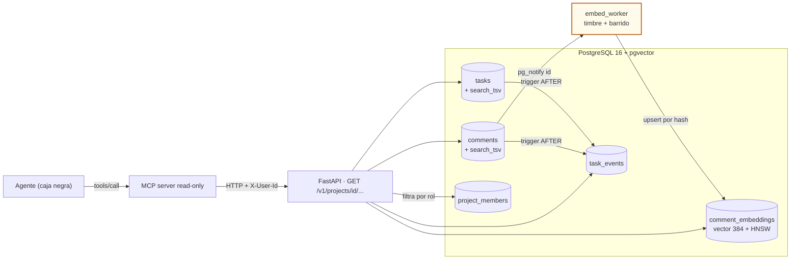
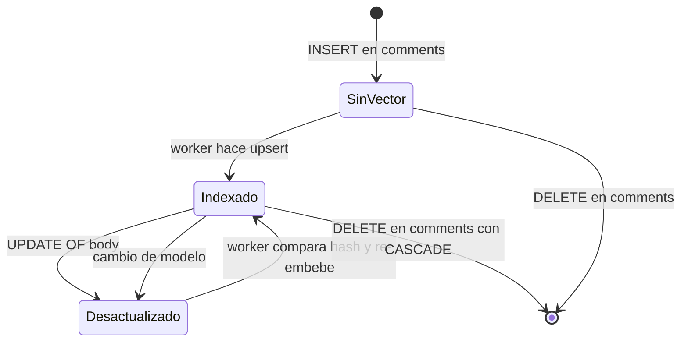
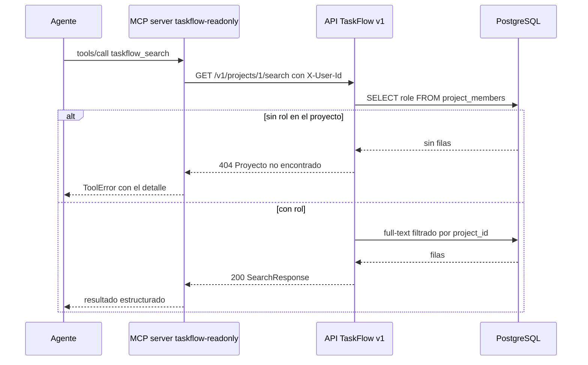
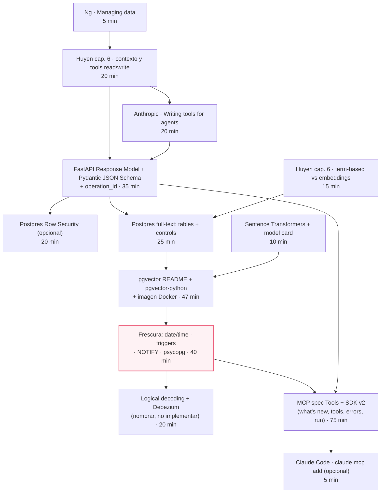

# M07·S08 — Datos para IA y agentes: la capa de datos de TaskFlow lista para que un agente la consulte

| | |
|---|---|
| **Sesión** | M07·S08 · Semana 2 — Gestión de datos y diseño de APIs |
| **Fecha** | [Completar por el profesor: fecha de la sesión] |
| **Módulo** | 07 — Fundamentos de Software + System Design para AI Engineers |
| **Tema** | Qué necesita la capa de datos de TaskFlow para que un asistente externo la consulte y responda bien: contexto útil, contrato legible por máquina, permisos, búsqueda full-text y vectorial, frescura, y un MCP server de solo lectura |
| **Duración estimada de estudio** | ≈ 11 h: ~5 h 30 min de lectura de recursos + ~3 h de lab + ~3 h de ejercicios |

---

## 1. Objetivos de aprendizaje

Al terminar esta sesión vas a poder:

1. **Explicar** por qué la arquitectura de datos condiciona lo que un agente puede "saber", y **armar el mapa de fuentes** de TaskFlow: qué es contexto útil, qué no, y qué falta como dato (la actividad).
2. **Diseñar y construir** endpoints de solo lectura pensados para un agente, con `response_model` como contrato y filtro, descripciones que llegan al JSON Schema, `operation_id` legibles, límites duros y metadatos de frescura en la respuesta.
3. **Implementar** búsqueda full-text en PostgreSQL (`tsvector` generado + GIN + `websearch_to_tsquery`) y búsqueda semántica con `pgvector` en el mismo Postgres, aplicando el permiso del usuario **dentro de la consulta**.
4. **Construir** un pipeline de frescura para un índice derivado: triggers, `updated_at` confiable con `clock_timestamp()`, reindexado incremental por hash, `LISTEN/NOTIFY` como timbre y barrido de respaldo. Además, **medir** el *lag* del índice.
5. **Exponer** la capa de datos a un agente con un MCP server de solo lectura (SDK Python v2) que llama a la API de TaskFlow con la identidad del usuario, y **verificarlo** en el MCP Inspector.
6. **Decidir y defender** una estrategia de frescura (barrido, timbre, CDC) y la ubicación de los vectores (mismo Postgres o base dedicada) en la entrada TJ-007 del trade-off journal.

---

## 2. Resumen ejecutivo

En M07·S07 dejaste a TaskFlow en PostgreSQL con su modelo ER completo, SQLAlchemy 2.0, Alembic y bloqueo optimista con `version`. Hoy esa base recibe un **cliente nuevo: un agente**. No es parte del producto, porque TaskFlow sigue sin ningún componente de IA. Pensalo como el asistente que un equipo conecta a su Claude Code o a su chat interno para preguntar *"¿qué se movió esta semana en el proyecto Web?"* o *"¿alguien ya reportó que el login falla con mayúsculas?"*.

El modelo es una **caja negra que consume**. Lo que decide si responde bien o mal es la capa de datos que le das. Andrew Ng lo plantea en su *AI Engineering Skills Map* (2026): los sistemas de IA toman su contexto de las fuentes de datos, y una arquitectura de datos mal elegida los deja **sin saber lo que no saben**. El trabajo de hoy es entonces **ingeniería de datos**, en cinco partes:

1. Qué datos de TaskFlow son contexto útil.
2. Cómo exponerlos con un contrato legible por máquina.
3. Cómo hacer cumplir los permisos del usuario en cuyo nombre actúa el agente.
4. Cómo buscar: full-text primero, vectores como un tipo de almacenamiento más.
5. Cómo mantener fresco el índice derivado y hacer visible cuánto atrasa.

Todo termina en un MCP server de solo lectura. Retomamos cosas ya vistas y no las re-explicamos: RAG, chunking y embeddings (M03·S01 y M04), MCP como protocolo (M05·S19–S21), y el patrón de acceso y el full-text "como argumento" de M07·S06.

---

## 3. Conceptos clave (glosario)

Solo los términos nuevos. Los ya vistos van con un refresco de una línea.

| Término | Definición |
|---|---|
| **Dato fuente vs dato derivado** | El dato fuente es la verdad (la fila de `comments`). El derivado se calcula a partir de él (un índice, un embedding, un resumen, una caché), así que **siempre puede quedar viejo** y tiene que poder reconstruirse. *Analogía:* la foto de una pizarra; la pizarra cambia y la foto no. |
| **Lag de indexación** | Cuánto atrasa el índice derivado respecto de la fuente. En el lab lo mide `index_lag_seconds`, que es la antigüedad del cambio más viejo que todavía no se indexó. |
| **`tsvector` / `tsquery`** | Los tipos de full-text de PostgreSQL. El primero es el documento ya normalizado a lexemas (con stemming por idioma) y el segundo, la consulta. `@@` pregunta si el documento matchea la consulta. |
| **Columna generada `STORED`** | Una columna que la base calcula sola a partir de otras columnas de la misma fila (`GENERATED ALWAYS AS (...) STORED`), en la misma transacción. Por eso nunca queda desactualizada. |
| **Índice GIN** | Índice invertido de Postgres: guarda "lexema → filas que lo contienen". Es el índice natural de un `tsvector`. |
| **`pgvector`** | Extensión de Postgres que agrega el tipo `vector(n)`, operadores de distancia e índices aproximados. Con ella los vectores pasan a ser **una columna más** en tu base. |
| **HNSW / IVFFlat** | Los dos índices aproximados de `pgvector`. HNSW es un grafo por capas: mejor relación velocidad/recall, construcción más cara. IVFFlat parte los vectores en `lists` y busca en unas pocas (`probes`). |
| **Post-filtrado** | Con índices aproximados, el `WHERE` se aplica **después** de recorrer el índice, así que un filtro selectivo puede devolver menos filas que el `LIMIT`. Los *iterative index scans* lo mitigan. |
| **Trigger `BEFORE` / `AFTER`** | Función que la base ejecuta ante un `INSERT`/`UPDATE`/`DELETE`. La `BEFORE` puede modificar `NEW` antes de escribir, y la `AFTER` reacciona a lo ya escrito (auditoría, avisos). `NEW`, `OLD` y `TG_OP` describen el cambio. |
| **`now()` vs `clock_timestamp()`** | `now()` es la hora de **inicio de la transacción** y no cambia dentro de ella. `clock_timestamp()` es la hora real, que avanza incluso dentro de una misma sentencia. |
| **Marca de agua (*watermark*)** | En extracción incremental, el "último timestamp que ya procesé". El próximo lote trae lo que tenga `updated_at > marca`. Es simple, pero se rompe con transacciones largas si el timestamp es `now()`. |
| **`LISTEN` / `NOTIFY`** | Mecanismo de avisos de Postgres entre sesiones. No es durable: si nadie escucha, el aviso se pierde. Por eso funciona como **timbre, no como cola**. |
| **Upsert idempotente** | `INSERT … ON CONFLICT DO UPDATE`: inserta o actualiza según exista la clave. Correrlo dos veces deja el mismo resultado, que es lo que se le pide a un indexador. |
| **CDC / logical decoding / replication slot** | *Change Data Capture*: leer el flujo de cambios de la base. En Postgres se hace con logical decoding sobre el WAL y un *replication slot*, que retiene WAL hasta que el consumidor lo lea. |
| **RLS (Row-Level Security)** | Políticas de Postgres que filtran filas por usuario **en la base misma**. En esta sesión funciona como segunda línea detrás del filtro de la app. |
| **`operationId`** | El nombre estable de cada operación en OpenAPI. Si alguien genera tools o clientes desde tu OpenAPI, es el nombre que ve el agente. |
| **`ToolAnnotations` / `read_only_hint`** | Pistas que una tool MCP le da al cliente ("no escribo", "soy idempotente"). La spec las considera **no confiables**: informan, no protegen. |
| **`ToolError`** | Excepción del MCP Python SDK cuyo mensaje **sí** le llega al modelo. Sirve para errores accionables ("no tenés acceso al proyecto 7"). |
| **MCP Inspector** | Herramienta interactiva para listar y llamar a las tools de un MCP server sin LLM y sin API key. Se abre con `mcp dev`. |

**Ya vistos, solo como refresco:** *embedding* (vector de dimensión fija que representa un texto, M03·S01/M04), *chunking* (partir textos largos antes de embeber, M04·S02), *BM25 y RRF* (retrieval léxico y fusión de rankings, M04·S04), *MCP* y sus primitivos (M05·S19–S21), *patrón de acceso* (M07·S06), *ER, Alembic, `selectinload`, 3FN* (M07·S07).

---

## 4. Notas de estudio por subtema

### Diagrama ancla: la arquitectura de datos de TaskFlow para un agente

Este es el mapa de toda la sesión. Cada caja es algo que construís en el lab.



El nodo resaltado es el worker, **la única pieza cuyo retraso cambia lo que el agente "sabe"**. El full-text se calcula en la misma transacción que la fila. Los embeddings, en cambio, dependen de que el worker haga su trabajo.

---

### 4.1 El agente toma su contexto de tus datos

Para la capa de datos, un agente es **un cliente más**, igual que el frontend de S05 o un tercero que consume tu API. Recibe el mismo tratamiento: contrato, permisos, límites y versionado (`/v1`). La diferencia es que lee con otra lógica. No navega pantallas: pide lo que necesita para contestar **una** pregunta concreta. Chip Huyen (*AI Engineering*, 2025, cap. 6) lo formula así: el contexto es **específico de cada query**, y construirlo es el equivalente del *feature engineering* en ML clásico. RAG y agentes son los dos patrones para construirlo. RAG ya lo viste en M04, así que acá no lo repetimos.

La pregunta de ingeniería es entonces **qué datos de TaskFlow sirven como contexto**. Tomemos las preguntas típicas del equipo y veamos de dónde saldría la respuesta:

| Pregunta al asistente | Dato que la responde | ¿Existe hoy? |
|---|---|---|
| "¿Alguien reportó que el login falla con mayúsculas?" | `comments.body`, `tasks.title/description` | Sí, pero sin búsqueda por texto |
| "¿Qué se movió esta semana en el proyecto Web?" | Historial de cambios de estado y asignación | **No**: `tasks.status` guarda solo el valor actual |
| "¿Qué tiene asignado Ana?" | `tasks.assignee_id` + `users.name` | Sí |
| "¿Cuál es el email de Bruno?" | `users.email` | Sí, pero **no es contexto útil** y no debería salir |

La segunda fila es el hallazgo importante: **la actividad no existe como dato**. La tabla `tasks` sabe dónde está cada tarea ahora, no cómo llegó ahí. Un agente sin historial "no sabe lo que no sabe" (Ng). Si le preguntan qué se movió, va a inferir algo a partir del estado actual, y ese algo puede estar mal. Lo arreglamos con una tabla `task_events` que llenan **triggers** (4.6).

```sql
-- Hoy: lo único que sabés de la tarea 42 es su foto actual
SELECT id, title, status, assignee_id, updated_at FROM tasks WHERE id = 42;
-- 42 | Login falla con mayúsculas | in_progress | 7 | 2026-09-22 18:03
-- ¿Cuándo pasó de backlog a in_progress? ¿Quién la tenía antes? No hay forma de saberlo.
```

Huyen distingue además dos clases de tools. Las **read-only** le permiten al agente *percibir* el entorno y las **write** le permiten *actuar* sobre él. Su analogía: así como no le darías a un pasante autoridad para borrar la base de producción, no deberías dejar que una IA poco confiable ejecute acciones críticas. Por eso **todo lo de hoy es `GET`**. Escribir queda para cuando haya auth (S14) y autorización (S15).

> 💡 Ng describe la infraestructura de datos para agentes como un área que **evoluciona rápido**: las buenas prácticas se van ajustando. Tomá lo que sigue (sobre todo la parte de MCP) como la práctica sólida de hoy, no como un estándar asentado.

**Errores comunes**
- Darle al agente "toda la base" con una tool genérica de SQL. Pierde el contrato, los permisos y los límites, y le toca adivinar el esquema.
- Asumir que un campo que existe es un campo útil. Emails, `version` y columnas internas son ruido y, además, riesgo.

---

### 4.2 Contrato legible por máquina

Un agente no lee tu código: lee **el schema** de lo que le devolvés y **las descripciones** de cada campo. En FastAPI, las dos cosas salen del mismo lugar, el modelo Pydantic.

**`response_model` hace dos trabajos.** Según la doc de FastAPI, valida la salida, agrega el JSON Schema de la respuesta a OpenAPI y **limita y filtra los datos a lo declarado en el tipo de retorno**, algo que la doc marca como particularmente importante *por seguridad*. En la práctica: si tu query trae `version` o el email de alguien y el modelo de respuesta no los declara, no salen.

```python
# app/schemas_agent.py (extracto)
from typing import Literal
from pydantic import BaseModel, Field

class SearchHit(BaseModel):
    """Una coincidencia dentro de UN proyecto de TaskFlow."""
    task_id: int = Field(description="ID de la tarea. Pasalo a get_task para ver el detalle.")
    task_title: str = Field(description="Título de la tarea, legible por humanos.")
    status: Literal["backlog", "in_progress", "done"]
    source: Literal["task", "comment"] = Field(description="Dónde coincidió: en la tarea o en un comentario.")
    snippet: str = Field(description="Fragmento del texto que coincidió.")
    score: float = Field(description="Relevancia relativa DENTRO de esta respuesta; no comparar entre modos.")
```

**Documentar un campo es escribir para el agente.** Pydantic genera JSON Schema **Draft 2020-12**, compatible con **OpenAPI 3.1.0**. El docstring de la clase se vuelve la `description` del modelo y cada `Field(description=...)` aparece tal cual en el schema. Comprobalo:

```python
import json
from app.schemas_agent import SearchHit
print(json.dumps(SearchHit.model_json_schema(), indent=2, ensure_ascii=False))
```

Deberías ver algo como:

```json
{
  "description": "Una coincidencia dentro de UN proyecto de TaskFlow.",
  "properties": {
    "task_id": {"description": "ID de la tarea. Pasalo a get_task para ver el detalle.", "title": "Task Id", "type": "integer"},
    "...": "..."
  }
}
```

La spec de MCP usa JSON Schema 2020-12 por defecto, el mismo dialecto. Las descripciones que escribís hoy para FastAPI se reutilizan casi tal cual en las tools del MCP server (4.7).

**Nombres estables: `operation_id`.** El `operationId` que FastAPI genera por defecto es largo y opaco. Tenés dos opciones: fijarlo por endpoint o usar el nombre de la función para todos (cada función tiene que tener nombre único, aunque esté en otro módulo). Con `include_in_schema=False` sacás del schema lo que no querés publicar.

```python
from fastapi import FastAPI
from fastapi.routing import APIRoute

def use_function_name(route: APIRoute) -> str:
    return route.name              # "search_project", "list_project_activity", ...

app = FastAPI(generate_unique_id_function=use_function_name)

@app.get("/internal/reindex-status", include_in_schema=False)
def reindex_status(): ...
```

**Diseñar para el agente, no envolver el CRUD.** El artículo de Anthropic *Writing effective tools for AI agents* (Ken Aizawa, 2025) recomienda:

- No envolver cada endpoint existente: mejor `search_contacts` que `list_contacts`.
- Usar prefijos (*namespacing*) para que los nombres no choquen con los de otros servers.
- Devolver **solo información de alta señal**, con nombres legibles antes que IDs crípticos.
- Paginar, filtrar y truncar con defaults sensatos. Claude Code, por ejemplo, limita por defecto las respuestas de tools a 25.000 tokens.

Aplicado a TaskFlow, en vez de exponer el CRUD de S10 creamos **tres endpoints nuevos pensados para preguntas**:

| Endpoint | `operation_id` | Para qué |
|---|---|---|
| `GET /v1/projects/{project_id}/search?q=&mode=&limit=` | `search_project` | Buscar en tareas y comentarios |
| `GET /v1/projects/{project_id}/activity?since=&limit=` | `list_project_activity` | Qué pasó en el proyecto |
| `GET /v1/projects/{project_id}/tasks/{task_id}` | `get_task` | Detalle de una tarea con comentarios |

Dos decisiones más de contrato:

- **Límite duro**: `limit: Annotated[int, Query(ge=1, le=20)] = 10`. El agente no puede pedir el proyecto entero de una vez.
- **La frescura viaja en la respuesta**: `data_as_of` (hora de la base en la consulta) e `index_lag_seconds` (cuánto atrasa el índice). Así el agente, y quien lea su respuesta, sabe **de cuándo es lo que sabe**.

```python
class SearchResponse(BaseModel):
    """Resultado de buscar en un proyecto, con metadatos de frescura."""
    mode: Literal["fulltext", "semantic"]
    hits: list[SearchHit]
    data_as_of: datetime = Field(description="Hora de la base en que se hizo la consulta.")
    index_lag_seconds: float | None = Field(
        default=None,
        description="Solo modo semantic: antigüedad del cambio más viejo aún sin indexar. 0 = al día.",
    )
```

**Errores comunes**
- Devolver el objeto ORM "crudo" sin `response_model`. El día que alguien agregue una columna sensible, sale sola.
- Descripciones vacías o que repiten el nombre del campo (`task_id: "Task id"`). No le dicen al agente **qué hacer** con el valor.
- `score` sin aclarar su escala. En esta API el rank de texto y la similitud coseno no son comparables, y la descripción lo dice.

> 🔗 Para profundizar: [Response Model — FastAPI](https://fastapi.tiangolo.com/tutorial/response-model/) · [JSON Schema — Pydantic](https://pydantic.dev/docs/validation/latest/concepts/json_schema/) · [Path Operation Advanced Configuration — FastAPI](https://fastapi.tiangolo.com/advanced/path-operation-advanced-configuration/) · [Writing effective tools for AI agents — Anthropic](https://www.anthropic.com/engineering/writing-tools-for-agents)

---

### 4.3 Permisos: el agente actúa en nombre de alguien

Un agente no tiene permisos propios: **actúa en nombre de un usuario**. Si Ana es `viewer` en el proyecto 1 y no pertenece al 2, su asistente tiene que ver exactamente lo mismo que ella. Nada más.

TaskFlow **todavía no tiene login** (llega en S14) ni autorización con dependencias (S15). Para hoy, el usuario se declara con un header **provisorio** `X-User-Id` y la regla de RBAC ya se aplica en la consulta:

```python
def require_project_role(
    project_id: int,
    x_user_id: Annotated[int, Header(description="PROVISORIO hasta S14: id del usuario en cuyo nombre se consulta.")],
    session: Annotated[Session, Depends(get_session)],
) -> str:
    role = session.scalar(
        select(ProjectMember.role).where(
            ProjectMember.project_id == project_id, ProjectMember.user_id == x_user_id
        )
    )
    if role is None:
        # 404 y no 403: no le confirmamos a nadie que el proyecto existe
        raise HTTPException(status_code=404, detail="Proyecto no encontrado")
    return role   # owner | member | viewer: los tres pueden LEER; S15 decide quién escribe
```

> ⚠️ **`X-User-Id` no es autenticación.** Cualquiera puede mandar cualquier número. Lo usamos porque esta sesión es de datos y no de auth, y **se reemplaza en S14** por el usuario del token. No lo publiques así en ningún lado.

**404 vs 403.** Un 403 dice "existe, pero no podés verlo", y eso ya es información: confirma que el proyecto 7 existe. Si el usuario no tiene rol, respondemos 404 como si el recurso no existiera. Es práctica habitual cuando la existencia misma del recurso es sensible.

**Por qué el permiso va en la query y no "después".** Si buscás primero y filtrás por permisos al final, el `LIMIT 10` ya se gastó en filas que no podés mostrar, y podés devolver 2 resultados habiendo 30 válidos. Con un índice vectorial el problema empeora, porque el filtro se aplica **después** de recorrer el índice (4.5). Aplicar el permiso primero es corrección y performance a la vez. Por eso cada consulta del router lleva `WHERE project_id = :pid`, y `project_id` está **desnormalizado** en `task_events` y `comment_embeddings`: filtrás sin un JOIN extra. El costo es de consistencia, un tema que ya viste con 3FN en S07. Si una tarea cambiara de proyecto (TaskFlow hoy no lo permite), esas tablas quedarían con el valor viejo.

**Segunda línea: Row-Level Security (opcional).** Postgres puede filtrar filas por su cuenta, aunque la query de la app venga mal escrita:

```sql
ALTER TABLE comment_embeddings ENABLE ROW LEVEL SECURITY;

CREATE POLICY member_can_read ON comment_embeddings
    FOR SELECT
    USING (project_id IN (
        SELECT project_id FROM project_members
        WHERE user_id = nullif(current_setting('taskflow.user_id', true), '')::int
    ));

-- En cada request, dentro de la transacción:
SET LOCAL taskflow.user_id = '42';
```

El `true` de `current_setting` y el `nullif` no son decorativos. Sin ellos, una consulta que llega sin `taskflow.user_id` **tira error** (*unrecognized configuration parameter*), y después de un `SET LOCAL` ya confirmado el parámetro queda en `''` y el cast a `int` también falla. Con ellos, sin usuario no se ve ninguna fila, que es lo que querés.

Tres cosas de la doc de PostgreSQL que tenés que tener presentes:

- Con RLS activada y **sin políticas**, rige *default-deny*: no se ve ni se modifica ninguna fila.
- Los superusuarios y los roles con `BYPASSRLS` **siempre la saltean**.
- **El dueño de la tabla normalmente también la saltea**, salvo `ALTER TABLE … FORCE ROW LEVEL SECURITY`.

> ⚠️ **Gotcha del compose de S06:** la app se conecta con el usuario `taskflow`, que es el dueño de las tablas (y superusuario, tanto en `postgres:16-alpine` como en la imagen de pgvector). Con esa conexión, **RLS no se aplica**. Para que funcione de verdad necesitás un rol de aplicación que no sea dueño ni superusuario. Por eso en el lab queda como desafío (🔴).

> 🔗 Para profundizar: [Row Security Policies — PostgreSQL 16](https://www.postgresql.org/docs/16/ddl-rowsecurity.html)

---

### 4.4 Buscar sin vectores: full-text de PostgreSQL

En S06 el full-text apareció como argumento ("un relacional bien usado resuelve más de lo que parece"). Hoy se implementa. Es la **primera herramienta** para que el agente encuentre cosas, y por una buena razón: Huyen (2025, cap. 6) señala que los retrievers basados en términos son **mucho más livianos de implementar** y funcionan como *baselines* fuertes, mientras que los basados en embeddings son más costosos y *pueden* superarlos. Una aclaración: el `ts_rank` de Postgres **no es BM25** (que viste en M04·S04). Es otro ranking léxico, pero la lógica de "léxico primero" vale igual.

**La columna generada es la clave.** La doc de Postgres ofrece dos formas de indexar full-text: un índice de expresión sobre `to_tsvector(...)` o una **columna generada `STORED` + índice GIN**. Recomienda la segunda por mantenible, y además es más rápida porque no recalcula `to_tsvector` al verificar. La base la actualiza en la misma transacción que la fila, así que **nunca queda desactualizada**. Guardá esta idea para 4.6.

```sql
ALTER TABLE comments ADD COLUMN search_tsv tsvector GENERATED ALWAYS AS (
    to_tsvector('spanish', body)
) STORED;
CREATE INDEX ix_comments_search_tsv ON comments USING GIN (search_tsv);
```

> ⚠️ **Siempre la forma de 2 argumentos** (`to_tsvector('spanish', …)`). La de 1 argumento depende de `default_text_search_config`, que puede cambiar entre servidores. La doc exige la configuración explícita para indexar. Elegimos `'spanish'` porque los datos del equipo están en español; con `\dF` en `psql` ves las configuraciones disponibles.

**Consultar con input del agente.** La query llega como texto libre, escrita por un agente, y puede traer comillas, guiones o cualquier cosa. `websearch_to_tsquery` acepta sintaxis tipo buscador (comillas para frase, `or`, `-` para negar) y, según la doc, **nunca levanta errores de sintaxis**. Es la función correcta para input no confiable. `ts_rank` ordena por frecuencia de lexemas y `ts_headline` arma el fragmento con los términos resaltados. Ojo: `ts_headline` **puede ser lento** porque trabaja sobre el documento original, así que aplicalo solo al top-N.

```sql
SELECT c.task_id, t.title,
       ts_headline('spanish', c.body, q) AS snippet,
       ts_rank(c.search_tsv, q)          AS score
FROM comments c
JOIN tasks t ON t.id = c.task_id
CROSS JOIN websearch_to_tsquery('spanish', 'login mayúsculas') AS q
WHERE t.project_id = 1 AND c.search_tsv @@ q
ORDER BY score DESC
LIMIT 10;
```

Deberías ver algo como:

```
 task_id |           title           |                          snippet                           | score
---------+---------------------------+------------------------------------------------------------+-------
       … | Login falla con mayúsculas| El <b>login</b> devuelve 500 cuando el email tiene <b>mayúsculas</b> | (un score > 0)
```

**¿Cuándo no alcanza?** Cuando la pregunta usa **otras palabras** que el texto. "No puedo entrar a mi cuenta" no comparte ningún lexema con "El login devuelve 500…". Ese es el hueco que cubren los vectores.

**Errores comunes**
- Usar `to_tsquery` con texto del agente: un paréntesis suelto tira un error de sintaxis y un 500.
- Mezclar configuraciones: indexar con `'spanish'` y consultar con `'english'` produce lexemas distintos y cero resultados.
- Filtrar por `project_id` fuera de la subconsulta del `UNION`. Cada rama tiene que llevar su filtro.

> 🔗 Para profundizar: [Tables and Indexes — PostgreSQL 16](https://www.postgresql.org/docs/16/textsearch-tables.html) · [Controlling Text Search — PostgreSQL 16](https://www.postgresql.org/docs/16/textsearch-controls.html)

---

### 4.5 Vectores como un tipo de almacenamiento más: `pgvector`

En M04 viste vectores en una base dedicada. Hoy los ponemos **en el Postgres que TaskFlow ya tiene**, como una columna y un índice más. Ganás transacciones, foreign keys, `ON DELETE CASCADE` y backups compartidos, sin sumar un servicio. Huyen lo resume así: con embeddings, guardar vectores es lo fácil y lo difícil es **buscarlos** rápido. Para eso están los índices.

**Lo que trae `pgvector`** (README oficial, versión 0.8.6, compatible con Postgres 13+):

- `CREATE EXTENSION vector;` y columnas `vector(n)`, con hasta 2.000 dimensiones indexables en `vector`.
- Operadores de distancia: `<->` (L2), `<#>` (producto interno **negativo**), `<=>` (coseno) y `<+>` (L1).
- Índices **HNSW** (por defecto `m` = 16, `ef_construction` = 64 y `hnsw.ef_search` = 40) e **IVFFlat** (`lists` ≈ `rows / 1000` como punto de partida hasta 1M filas y `sqrt(rows)` por encima; `ivfflat.probes` = 1 por defecto).

| | HNSW | IVFFlat |
|---|---|---|
| Construcción | Más lenta, más memoria | Más rápida |
| Tabla vacía | Se puede crear antes de cargar datos | Conviene crearlo **con datos**, porque las `lists` salen de ellos |
| Perilla de consulta | `hnsw.ef_search` | `ivfflat.probes` |
| Default en TaskFlow | ✅ | — |

**Tabla derivada, no columna en `comments`.** El embedding de un comentario es un **dato derivado**, y por eso vive aparte:

```sql
CREATE TABLE comment_embeddings (
    comment_id   integer PRIMARY KEY REFERENCES comments(id) ON DELETE CASCADE,
    project_id   integer NOT NULL,          -- desnormalizado para filtrar por permiso
    model        text    NOT NULL,          -- el modelo es parte del dato
    content_hash text    NOT NULL,          -- para no re-embeber lo que no cambió
    embedding    vector(384) NOT NULL,
    embedded_at  timestamptz NOT NULL DEFAULT clock_timestamp()
);
CREATE INDEX ix_comment_embeddings_hnsw
    ON comment_embeddings USING hnsw (embedding vector_cosine_ops);
```

Hay cuatro razones para separarla:

1. Se puede tirar y reconstruir sin tocar la fuente.
2. Si cambiás de modelo hay que re-embeber todo, y la columna `model` lo registra.
3. Reindexar no toca la fila de `comments`, así que no pelea con el bloqueo optimista de S07.
4. **Borrar un comentario borra su vector** por `ON DELETE CASCADE`: el derecho de supresión de S07 alcanza también al índice. Con una base vectorial externa, ese borrado tendrías que propagarlo a mano.

**Desde SQLAlchemy**, con `pgvector-python`:

```python
from pgvector.sqlalchemy import VECTOR

class CommentEmbedding(Base):
    __tablename__ = "comment_embeddings"
    comment_id: Mapped[int] = mapped_column(ForeignKey("comments.id", ondelete="CASCADE"), primary_key=True)
    project_id: Mapped[int]
    model: Mapped[str] = mapped_column(Text)
    content_hash: Mapped[str] = mapped_column(Text)
    embedding: Mapped[list[float]] = mapped_column(VECTOR(384))
    embedded_at: Mapped[datetime] = mapped_column(server_default=func.clock_timestamp())

# consulta: los 5 comentarios más parecidos del proyecto 1
dist = CommentEmbedding.embedding.cosine_distance(query_vector)
stmt = (select(CommentEmbedding.comment_id, dist.label("dist"))
        .where(CommentEmbedding.project_id == 1)
        .order_by(dist).limit(5))
```

**El modelo de embeddings es una caja negra con dos reglas de datos.** No hace falta teoría de embeddings (ya la viste en M03·S01 y M04·S01). Lo que importa acá:

- **Dimensión fija.** `paraphrase-multilingual-MiniLM-L12-v2` produce vectores de **384** dimensiones, y la columna es `vector(384)`.
- **Indexar y consultar con el mismo modelo.** Por eso la búsqueda filtra por `model = embedder.name`.

Ese modelo corre local, soporta 50 idiomas, tiene licencia Apache 2.0 y un `max_seq_length` de **128 tokens**. Esto último es un dato de ingeniería de datos: un comentario largo **se trunca** al embeberse. Si tuvieras comentarios muy largos, habría que partirlos (chunking, M04·S02).

> ⚠️ **El gotcha del filtro con índice aproximado.** El README de pgvector lo dice así: con índices aproximados, el filtro se aplica **después** de escanear el índice. Si una condición matchea el 10 % de las filas, con HNSW y el `hnsw.ef_search` de 40 por defecto **vuelven en promedio solo 4 filas**. Eso es exactamente lo que pasa con el filtro `project_id = 1` (el permiso de 4.3). La mitigación desde la 0.8.0 son los *iterative index scans*:
>
> ```sql
> SET LOCAL hnsw.iterative_scan = relaxed_order;   -- solo para esta transacción
> ```

> ⚠️ **Un índice aproximado cambia resultados, no solo tiempos.** En palabras de la doc: *"Unlike typical indexes, you will see different results for queries after adding an approximate index"*. Un B-tree nunca cambia qué filas devolvés. Un HNSW sí, y cambiás recall por velocidad.

**Errores comunes**
- Crear la columna como `vector(1536)` "porque así estaba en M03" y embeber con un modelo de 384. El insert falla por dimensión.
- Cambiar de modelo y consultar sin filtrar por `model`: comparás vectores de espacios distintos.
- Mirar `EXPLAIN` con 10 filas y concluir que "el índice no anda". Con pocas filas el planner prefiere `Seq Scan`, y es lo correcto.

> 🔗 Para profundizar: [pgvector — README](https://github.com/pgvector/pgvector) · [pgvector-python — README](https://github.com/pgvector/pgvector-python) · [Quickstart — Sentence Transformers](https://sbert.net/docs/quickstart.html) · [paraphrase-multilingual-MiniLM-L12-v2 — model card](https://huggingface.co/sentence-transformers/paraphrase-multilingual-MiniLM-L12-v2)

---

### 4.6 Frescura y su impacto en lo que el agente "sabe"

Este es el centro conceptual de la sesión. El agente **no sabe lo que dice la tabla `comments`: sabe lo que dice el índice derivado**. Huyen habla de que un modelo se pone "rancio" (*stale*) cuando sus datos envejecen. A nosotros nos pasa lo mismo, pero con el índice, y eso sí es ingeniería de datos.

Compará las dos búsquedas del lab:

- **Full-text**: `search_tsv` es columna generada, se recalcula en la misma transacción que el `UPDATE` y **nunca atrasa**.
- **Semántica**: `comment_embeddings` la llena un proceso aparte, así que **siempre puede atrasar**.

La vida de un comentario vista desde el índice vectorial:



`index_lag_seconds` mide cuánto tiempo lleva en `SinVector` o `Desactualizado` el comentario más viejo del proyecto. Para que ese número y el reindexado sean confiables hacen falta cuatro piezas.

**Pieza 1: `updated_at` lo pone la base, no el ORM.** En S07, `updated_at` se llenaba con `onupdate=func.now()`, y eso lo pone **SQLAlchemy**. Un `UPDATE` hecho desde `psql`, un script o una migración no lo toca, y el indexador nunca se entera. La solución es un trigger `BEFORE UPDATE`, que vale para cualquier cliente:

```sql
CREATE OR REPLACE FUNCTION set_updated_at() RETURNS trigger AS $$
BEGIN
    NEW.updated_at := clock_timestamp();   -- hora real, no inicio de transacción
    RETURN NEW;
END;
$$ LANGUAGE plpgsql;

CREATE TRIGGER comments_set_updated_at BEFORE UPDATE ON comments
    FOR EACH ROW EXECUTE FUNCTION set_updated_at();
```

**Pieza 2: `clock_timestamp()`, no `now()`.** Según la doc de Postgres, `now()` / `CURRENT_TIMESTAMP` devuelven **el inicio de la transacción** y no cambian durante ella (*"This is considered a feature"*). El problema aparece con una marca de agua:

1. A las 10:00:00 empieza una transacción larga que edita el comentario 5. `now()` vale 10:00:00.
2. A las 10:00:30 el indexador corre, procesa todo lo que tenga `updated_at > 09:59` y guarda la marca **10:00:30**.
3. A las 10:00:45 la transacción confirma. El comentario 5 queda con `updated_at = 10:00:00`.
4. En la corrida siguiente el indexador pide `updated_at > 10:00:30`, y **el comentario 5 no aparece nunca más**.

`clock_timestamp()` achica esa ventana, pero no la elimina: el timestamp se toma antes del commit. Por eso el lab **no confía en una marca de agua global**. Compara fila por fila `comments.updated_at > comment_embeddings.embedded_at` y además hace un barrido completo periódico.

**Pieza 3: la actividad como dato, por trigger.** Un trigger `AFTER` sobre `tasks` escribe una fila en `task_events` por cada creación, cambio de estado o reasignación. No hace falta tocar el service ni el router, y funciona aunque el cambio venga de `psql`:

```sql
CREATE OR REPLACE FUNCTION log_task_event() RETURNS trigger AS $$
BEGIN
    IF TG_OP = 'INSERT' THEN
        INSERT INTO task_events (task_id, project_id, kind, new_value)
        VALUES (NEW.id, NEW.project_id, 'created', NEW.status);
    ELSIF NEW.status IS DISTINCT FROM OLD.status THEN
        INSERT INTO task_events (task_id, project_id, kind, old_value, new_value)
        VALUES (NEW.id, NEW.project_id, 'status_changed', OLD.status, NEW.status);
    END IF;
    RETURN NULL;  -- AFTER trigger: el valor de retorno se ignora
END;
$$ LANGUAGE plpgsql;
```

(La versión completa, con `assigned` y `commented`, está en el paso 2 del lab.) Si esta idea te suena a "escribir el evento en la misma transacción y que otro proceso lo consuma", es pariente del *outbox pattern*.

**Pieza 4: reindexado incremental, idempotente y por hash.** El indexador elige qué re-embeber con tres filtros:

- el comentario no tiene vector;
- cambió después de embeberse;
- se cambió de modelo.

Después compara un **hash de `modelo + texto`**. Si `updated_at` se movió pero el texto es el mismo, no paga el embedding. Escribe con **upsert**, así que correrlo dos veces no duplica nada, y hace **commit por lote**, así que si se corta a la mitad lo hecho queda hecho. Es la misma idempotencia que S09 pide para los workers de colas.

```python
def content_hash(model: str, text: str) -> str:
    return hashlib.sha256(f"{model}\n{text}".encode()).hexdigest()

stmt = insert(CommentEmbedding).values(rows)
stmt = stmt.on_conflict_do_update(
    index_elements=[CommentEmbedding.comment_id],
    set_={"embedding": stmt.excluded.embedding, "content_hash": stmt.excluded.content_hash,
          "model": stmt.excluded.model, "embedded_at": func.clock_timestamp()},
)
```

Los **borrados** no los hace el indexador: los resuelve `ON DELETE CASCADE`.

**`LISTEN/NOTIFY`: un timbre, no una cola.** Para no esperar al próximo barrido, el trigger de `comments` avisa con `pg_notify('comments_changed', NEW.id::text)`. Tres propiedades de la doc deciden el diseño:

| Propiedad (doc de `NOTIFY`) | Consecuencia en TaskFlow |
|---|---|
| Dentro de una transacción, se entrega **solo si confirma** | Nunca indexás un comentario que después se deshizo |
| Payload **menor a 8000 bytes** por defecto | Mandás el **id**, nunca el texto |
| Solo reciben las sesiones que **están escuchando** | Si el worker está caído, el aviso se pierde → **barrido de respaldo siempre** |

Del lado Python, psycopg 3 pide que la conexión que escucha esté en **`autocommit`**, y `notifies(timeout=..., stop_after=...)` da exactamente "despertate con el timbre o, como mucho, cada 30 segundos":

```python
with psycopg.connect(DSN, autocommit=True) as conn:
    conn.execute("LISTEN comments_changed")
    while True:
        with SessionLocal() as session:
            sync_comment_embeddings(session, embedder)      # barrido completo
        for _ in conn.notifies(timeout=SWEEP_SECONDS, stop_after=1):
            pass                                            # el timbre solo despierta
```

El payload no se usa: el timbre despierta y el barrido decide qué indexar. Una notificación perdida no deja nada sin indexar, porque la recoge la siguiente vuelta.

**CDC: el nivel siguiente, para nombrar y decidir.** *Logical decoding* extrae todos los cambios persistentes de las tablas a un formato coherente, a través de un **replication slot** que da un flujo ordenado y reproducible. Debezium lo usa con el plugin `pgoutput`: requiere `wal_level=logical`, toma un snapshot consistente y después transmite los cambios de forma continua a Kafka. Es durable y ordenado, pero trae una advertencia operativa de la doc de Postgres: un slot **no sabe nada de sus consumidores** y **retiene WAL** mientras exista. Un slot abandonado llena el disco y, en casos extremos, puede llevar a apagar la base. Por eso, si un slot ya no se usa, hay que borrarlo.

| Estrategia | Frescura del índice | Qué agrega al sistema | Cuándo |
|---|---|---|---|
| Columna generada (`tsvector`) | Siempre al día (misma transacción) | Nada | Todo lo que la base puede calcular sola |
| Barrido periódico (cron / loop) | Hasta el período del barrido | Un proceso | Default simple, y red de seguridad de todo lo demás |
| Trigger + `LISTEN/NOTIFY` + barrido | Casi inmediata; el barrido cubre pérdidas | Un worker con conexión dedicada | **TaskFlow hoy** |
| CDC (logical decoding / Debezium) | Casi inmediata, durable y ordenada | Slot de replicación, `wal_level=logical`, a menudo Kafka | Muchos consumidores de los cambios; riesgo operativo del slot |

**Errores comunes**
- Tratar `NOTIFY` como cola ("el worker procesa el id que le llega"). El primer reinicio del worker te deja comentarios sin indexar para siempre.
- Mandar el cuerpo del comentario en el payload: cualquier comentario largo rompe el trigger.
- Dejar `onupdate=func.now()` en el modelo y creer que ya está. El trigger gana (corre después, en la base), pero cualquier lectura que asuma `now()` va a razonar mal.

> 🔗 Para profundizar: [Current Date/Time — PostgreSQL 16](https://www.postgresql.org/docs/16/functions-datetime.html) · [Trigger Functions — PostgreSQL 16](https://www.postgresql.org/docs/16/plpgsql-trigger.html) · [NOTIFY — PostgreSQL 16](https://www.postgresql.org/docs/16/sql-notify.html) · [Asynchronous notifications — psycopg 3](https://www.psycopg.org/psycopg3/docs/advanced/async.html) · [Logical Decoding Concepts — PostgreSQL 16](https://www.postgresql.org/docs/16/logicaldecoding-explanation.html) · [Debezium PostgreSQL connector](https://debezium.io/documentation/reference/stable/connectors/postgresql.html)

---

### 4.7 Exponer la capa de datos al agente: MCP server de solo lectura

MCP como protocolo ya lo viste en M05·S19–S21, así que acá no lo re-explicamos. Lo nuevo es **qué pone la capa de datos** en ese server.

**Decisión de arquitectura: el MCP server no toca la base.** Llama a la API de TaskFlow con la identidad del usuario. Así el RBAC, los límites y el `response_model` se aplican **una sola vez, en la API**, y el server es una capa fina de traducción.



> ⚠️ **Si reusás tu server de M05·S20, leé esto primero.** La versión estable actual del MCP Python SDK es la **v2** (`mcp` 2.2.0 en PyPI, del 7 sep 2026). En la v2, **`FastMCP` pasó a llamarse `MCPServer`** y el import viejo `from mcp.server.fastmcp import FastMCP` **ya no existe**: según la doc, *"the old import path is gone rather than deprecated"*. Un server escrito con `FastMCP` **no corre** con la v2 hasta que cambies el import:
>
> ```python
> # v1 (M05·S20)                              # v2 (hoy)
> from mcp.server.fastmcp import FastMCP       from mcp.server import MCPServer
> mcp = FastMCP("taskflow")                    mcp = MCPServer("taskflow")
> ```
>
> Otros cambios de la v2: los atributos pasan a snake_case (`input_schema`), la configuración de transporte se mueve a `run()`, y el contexto se recibe declarando `ctx: Context` en la función. Por eso el lab instala `"mcp[cli]>=2.2,<3"`: el rango evita traer por accidente una 1.x.

**Una tool se documenta con el mismo Pydantic que la API.** El nombre sale de la función, la descripción del **docstring** y los parámetros de los type hints. `Annotated[..., Field(...)]` y `Literal[...]` enriquecen el schema:

```python
@mcp.tool(title="Buscar en un proyecto de TaskFlow", annotations=READ_ONLY)
def taskflow_search(
    project_id: Annotated[int, Field(description="ID del proyecto. Solo ves proyectos donde tenés rol.")],
    query: Annotated[str, Field(min_length=2, max_length=200, description="Texto libre.")],
    mode: Literal["fulltext", "semantic"] = "fulltext",
    limit: Annotated[int, Field(ge=1, le=20)] = 10,
) -> dict:
    """Busca tareas y comentarios. Probá fulltext primero; semantic encuentra paráfrasis.
    Mirá index_lag_seconds: si es > 0, puede haber comentarios recientes que todavía no aparecen."""
    return _get(f"/v1/projects/{project_id}/search", q=query, mode=mode, limit=limit)
```

Fijate que la frescura aparece también en el docstring: le decís al agente **cómo interpretar** `index_lag_seconds`.

**Las annotations son una pista, no una barrera.** `ToolAnnotations(read_only_hint=True, ...)` le avisa al cliente que la tool no escribe. Pero la spec de MCP (versión 2026-07-28) dice que el cliente **debe** considerarlas no confiables salvo que vengan de servidores confiables. La barrera real es que **la API solo tiene `GET` y filtra por rol**. La spec también pone en el servidor el deber de validar inputs, controlar el acceso, limitar la tasa de invocaciones y sanitizar salidas. Leé esa lista como el checklist de tu server.

**Errores que el agente pueda usar.** Si una tool lanza una excepción cualquiera, el resultado vuelve con `is_error=True`, pero **el modelo recibe un mensaje genérico sin el texto**, y el traceback queda en el log del servidor. Con `ToolError`, el mensaje **sí llega**. La regla de la doc es preguntarse *"Could a smarter model have avoided this?"*: si la respuesta es sí, `ToolError`.

```python
from mcp.server.mcpserver.exceptions import ToolError

def _get(path: str, **params) -> dict | list:
    r = httpx.get(f"{API}{path}", params=params, headers={"X-User-Id": USER_ID}, timeout=10)
    if r.status_code in (404, 422):          # accionable: otro proyecto, otro limit
        raise ToolError(f"TaskFlow respondió {r.status_code}: {r.json().get('detail')}")
    r.raise_for_status()                     # 5xx: excepción común, sin detalles internos
    return r.json()
```

**Tres tools, no veinte:** `taskflow_search`, `taskflow_recent_activity` y `taskflow_get_task`. Llevan prefijo `taskflow_` para no chocar con el `search` de otro server. **No hay** `list_all_tasks` ni ninguna escritura.

**Probar sin API key.** `mcp.run()` sin argumentos usa **stdio**. `mcp dev` lanza el server dentro del **MCP Inspector**, donde listás y llamás tools a mano sin ningún LLM de por medio. `mcp run server.py` llama a `run()` por su cuenta y **no ejecuta** el bloque `if __name__ == "__main__":`. Si tenés Claude Code, podés registrarlo con `claude mcp add` (opcional).

**Errores comunes**
- Import de `FastMCP` con el SDK v2: `ModuleNotFoundError`. Ver el callout de arriba.
- Poner lógica de permisos en el MCP server "porque es más rápido". El día que otro cliente use la API, esos permisos no están.
- Hacer `raise ToolError(str(e))` con cualquier excepción: le filtrás al modelo detalles internos (SQL, rutas, stack).

> 🔗 Para profundizar: [Tools — MCP spec 2026-07-28](https://modelcontextprotocol.io/specification/latest/server/tools) · [MCP Python SDK](https://github.com/modelcontextprotocol/python-sdk) · [What's new in v2](https://py.sdk.modelcontextprotocol.io/whats-new/) · [Tools — SDK](https://py.sdk.modelcontextprotocol.io/servers/tools/) · [Handling errors — SDK](https://py.sdk.modelcontextprotocol.io/servers/handling-errors/) · [Running your server — SDK](https://py.sdk.modelcontextprotocol.io/run/) · [Claude Code MCP](https://code.claude.com/docs/en/mcp)

---

### 4.8 Cómo se relacionan los recursos

El orden de lectura con sus dependencias está en la sección 7 (ruta de estudio, con tiempos). Hay relaciones que el diagrama no alcanza a mostrar:

- **El full-text es la vara contra la que se mide `pgvector`.** El `tsvector` generado nunca queda viejo y el índice vectorial sí. La comparación de frescura se entiende de verdad cuando implementaste los dos.
- **La spec de MCP y la doc de Pydantic hablan el mismo idioma**, JSON Schema 2020-12. Los `Field(description=...)` de FastAPI se reutilizan en las tools.
- **Anthropic contradice a propósito "exponé tu API tal cual"**, y eso justifica que los endpoints de hoy sean nuevos (`search`, `activity`) y no el CRUD de S10.
- **`NOTIFY` (Postgres) y `notifies()` (psycopg)** son los dos lados, SQL y Python, del mismo mecanismo.
- **Logical decoding y Debezium** son la fuente primaria y la herramienta de la misma idea, CDC. Se leen juntos y en ese orden.
- **Row Security** es independiente del resto: se puede saltear sin romper el lab.

---

## 5. Guía práctica paso a paso (lab)

Lab reproducible de punta a punta sobre el repo `taskflow`. **Ningún paso llama a una API de LLM ni necesita API key.** Las salidas son la forma esperada, no capturas reales: leelas como "deberías ver algo como…".

**Prerequisitos**
- El repo `taskflow` al día con S07: el `compose.yaml` de S06 (servicio `db` con `postgres:16-alpine` y servicio `cache`), modelos SQLAlchemy 2.0, Alembic en `migrations/`, `TASKFLOW_STORAGE=postgres` y `TASKFLOW_DATABASE_URL` apuntando a la base `taskflow_app`.
- El venv de S05 activado. Docker funcionando.
- Una rama nueva: `git switch -c s08-datos-agentes`.

**Archivos que vas a crear o tocar**

```
compose.yaml                                   (cambia la imagen de db)
migrations/versions/<rev>_s08_datos_para_agentes.py
app/db/models.py                               (modelos nuevos + columnas)
app/dependencies.py                            (se suma get_session)
app/agent_data/__init__.py
app/agent_data/embedder.py
app/agent_data/indexer.py
app/schemas_agent.py
app/routers/agent_read.py
app/main.py                                    (registrar el router)
scripts/embed_worker.py
scripts/seed_s08.sql
mcp_server/taskflow_mcp.py
docs/datos/s08-datos-para-agentes.md
```

**Reparto sugerido de los 180 minutos**

| Bloque | Min | Contenido |
|---|---|---|
| Concepto | 40 | Subtemas 4.1–4.3 y la frescura como idea |
| Taller guiado | 60 | Pasos 1–3 y 7–10 en modo `fulltext` |
| Práctica autónoma | 45 | Pasos 4–6 (embeddings + worker) y 11 (MCP en el Inspector) |
| Puesta en común | 20 | Tabla de frescura: ¿qué estrategia para TaskFlow y por qué? |
| Cierre | 15 | TJ-007 y entrega |

---

### Paso 0 — Dependencias

```bash
pip install pgvector "mcp[cli]>=2.2,<3"
# Opcional, solo para embeddings reales (modo local). Descarga pesada: hacelo ANTES de clase.
pip install sentence-transformers
```

- `pgvector`: los tipos `VECTOR` para SQLAlchemy.
- `"mcp[cli]>=2.2,<3"`: el SDK v2, con el extra `cli` que trae `mcp dev`. **No** uses el import `FastMCP` de M05·S20.
- `sentence-transformers` instala PyTorch y baja el modelo en la primera corrida. Sin él, el lab funciona igual en modo `fake`.

**Verificá:** `python -c "import mcp.server; from mcp.server import MCPServer; print('ok')"` imprime `ok`.

---

### Paso 1 — Postgres con pgvector

En `compose.yaml`, cambiá solo la imagen del servicio `db`:

```yaml
services:
  db:
    image: pgvector/pgvector:pg16   # antes: postgres:16-alpine
    # ... el resto del servicio queda igual que en S06: env, puertos en 127.0.0.1,
    #     healthcheck y el volumen pgdata:/var/lib/postgresql/data (misma ruta en esta imagen)
```

¿Por qué cambiar de imagen? `postgres:16-alpine` **no trae pgvector**, y compilarlo a mano no es el tema de hoy. `pgvector/pgvector:pg16` es Postgres 16 (la misma versión mayor que venías usando) con la extensión ya instalada. La diferencia es que está construida sobre **Debian**, no sobre Alpine.

```bash
docker compose down -v          # borra el volumen pgdata: lo recreamos limpio (ver el gotcha)
docker compose up -d db
docker compose exec db psql -U taskflow -d taskflow -c "CREATE DATABASE taskflow_app;"
alembic upgrade head            # las migraciones de S07 (todavía no escribiste la de hoy)
# ...y el seed de S07 (scripts/copy_sqlite_to_pg.py), igual que en S07
docker compose exec db psql -U taskflow -d taskflow_app -c "SELECT version();"
```

Deberías ver algo como `PostgreSQL 16.x (Debian ...) ...`.

> ⚠️ **Gotcha — volumen de Alpine abierto con Debian.** El volumen `pgdata` lo creó la imagen Alpine, que usa la biblioteca C **musl**. La de pgvector usa **glibc**. Si reusás el volumen, Postgres puede arrancar igual pero avisarte de un *collation version mismatch*, y los índices sobre texto (como el GIN de hoy) quedan en duda. Por eso el paso de arriba arranca con `docker compose down -v`, que tira el volumen, y después vuelve a crear `taskflow_app`, corre `alembic upgrade head` y el seed de S07. El `down -v` también borra la base `taskflow` del lab de `EXPLAIN` de S06: si la querés conservar, volvé a correr su seed. Si tu base no se llama `taskflow_app`, ajustá el nombre en todos los comandos. El servicio `cache` no cambia.

---

### Paso 2 — Migración de Alembic de la sesión

```bash
alembic revision -m "s08 datos para agentes"
```

Abrí el archivo generado, **conservá los `revision` / `down_revision` que puso Alembic** y reemplazá el resto por esto. Se escribe a mano porque autogenerate no detecta triggers ni funciones.

```python
"""s08: actividad, updated_at confiable, full-text y embeddings de comentarios"""
from alembic import op

revision = "<rev>"                                   # el que generó Alembic
down_revision = "<rev de la última migración de S07>"  # el que generó Alembic

EMBED_DIM = 384  # paraphrase-multilingual-MiniLM-L12-v2 y el embedder fake usan 384


def upgrade() -> None:
    op.execute("CREATE EXTENSION IF NOT EXISTS vector")

    # --- 1. updated_at lo pone la BASE, para cualquier cliente (no solo el ORM) ---
    op.execute("""
        ALTER TABLE comments
            ADD COLUMN updated_at timestamptz NOT NULL DEFAULT clock_timestamp();

        CREATE OR REPLACE FUNCTION set_updated_at() RETURNS trigger AS $$
        BEGIN
            NEW.updated_at := clock_timestamp();   -- hora real, no inicio de transacción
            RETURN NEW;
        END;
        $$ LANGUAGE plpgsql;

        CREATE TRIGGER tasks_set_updated_at BEFORE UPDATE ON tasks
            FOR EACH ROW EXECUTE FUNCTION set_updated_at();
        CREATE TRIGGER comments_set_updated_at BEFORE UPDATE ON comments
            FOR EACH ROW EXECUTE FUNCTION set_updated_at();
    """)

    # --- 2. Actividad: qué pasó en el proyecto, como dato consultable ---
    op.execute("""
        CREATE TABLE task_events (
            id          bigint GENERATED ALWAYS AS IDENTITY PRIMARY KEY,
            task_id     integer NOT NULL REFERENCES tasks(id) ON DELETE CASCADE,
            project_id  integer NOT NULL,
            kind        text    NOT NULL
                        CHECK (kind IN ('created', 'status_changed', 'assigned', 'commented')),
            old_value   text,
            new_value   text,
            occurred_at timestamptz NOT NULL DEFAULT clock_timestamp()
        );
        CREATE INDEX ix_task_events_project_time ON task_events (project_id, occurred_at DESC);

        CREATE OR REPLACE FUNCTION log_task_event() RETURNS trigger AS $$
        BEGIN
            IF TG_OP = 'INSERT' THEN
                INSERT INTO task_events (task_id, project_id, kind, new_value)
                VALUES (NEW.id, NEW.project_id, 'created', NEW.status);
            ELSE
                IF NEW.status IS DISTINCT FROM OLD.status THEN
                    INSERT INTO task_events (task_id, project_id, kind, old_value, new_value)
                    VALUES (NEW.id, NEW.project_id, 'status_changed', OLD.status, NEW.status);
                END IF;
                IF NEW.assignee_id IS DISTINCT FROM OLD.assignee_id THEN
                    INSERT INTO task_events (task_id, project_id, kind, old_value, new_value)
                    VALUES (NEW.id, NEW.project_id, 'assigned',
                            OLD.assignee_id::text, NEW.assignee_id::text);
                END IF;
            END IF;
            RETURN NULL;  -- AFTER trigger: el valor de retorno se ignora
        END;
        $$ LANGUAGE plpgsql;

        CREATE TRIGGER tasks_log_event AFTER INSERT OR UPDATE ON tasks
            FOR EACH ROW EXECUTE FUNCTION log_task_event();

        CREATE OR REPLACE FUNCTION on_comment_change() RETURNS trigger AS $$
        BEGIN
            IF TG_OP = 'INSERT' THEN
                INSERT INTO task_events (task_id, project_id, kind, new_value)
                SELECT NEW.task_id, t.project_id, 'commented', NEW.id::text
                FROM tasks t WHERE t.id = NEW.task_id;
            END IF;
            PERFORM pg_notify('comments_changed', NEW.id::text);  -- timbre: solo el id
            RETURN NULL;
        END;
        $$ LANGUAGE plpgsql;

        CREATE TRIGGER comments_on_change AFTER INSERT OR UPDATE OF body ON comments
            FOR EACH ROW EXECUTE FUNCTION on_comment_change();
    """)

    # --- 3. Full-text: la base lo mantiene fresco sola (columna generada) ---
    op.execute("""
        ALTER TABLE tasks ADD COLUMN search_tsv tsvector GENERATED ALWAYS AS (
            to_tsvector('spanish', coalesce(title, '') || ' ' || coalesce(description, ''))
        ) STORED;
        CREATE INDEX ix_tasks_search_tsv ON tasks USING GIN (search_tsv);

        ALTER TABLE comments ADD COLUMN search_tsv tsvector GENERATED ALWAYS AS (
            to_tsvector('spanish', body)
        ) STORED;
        CREATE INDEX ix_comments_search_tsv ON comments USING GIN (search_tsv);
    """)

    # --- 4. Vectores: tabla DERIVADA, con su propio ciclo de vida ---
    op.execute(f"""
        CREATE TABLE comment_embeddings (
            comment_id   integer PRIMARY KEY REFERENCES comments(id) ON DELETE CASCADE,
            project_id   integer NOT NULL,
            model        text    NOT NULL,
            content_hash text    NOT NULL,
            embedding    vector({EMBED_DIM}) NOT NULL,
            embedded_at  timestamptz NOT NULL DEFAULT clock_timestamp()
        );
        CREATE INDEX ix_comment_embeddings_project ON comment_embeddings (project_id);
        CREATE INDEX ix_comment_embeddings_hnsw
            ON comment_embeddings USING hnsw (embedding vector_cosine_ops);
    """)


def downgrade() -> None:
    op.execute("""
        DROP TABLE IF EXISTS comment_embeddings;
        ALTER TABLE comments DROP COLUMN IF EXISTS search_tsv;
        ALTER TABLE tasks    DROP COLUMN IF EXISTS search_tsv;
        DROP TRIGGER IF EXISTS comments_on_change ON comments;
        DROP FUNCTION IF EXISTS on_comment_change();
        DROP TRIGGER IF EXISTS tasks_log_event ON tasks;
        DROP FUNCTION IF EXISTS log_task_event();
        DROP TABLE IF EXISTS task_events;
        DROP TRIGGER IF EXISTS comments_set_updated_at ON comments;
        DROP TRIGGER IF EXISTS tasks_set_updated_at ON tasks;
        DROP FUNCTION IF EXISTS set_updated_at();
        ALTER TABLE comments DROP COLUMN IF EXISTS updated_at;
    """)
    # La extensión `vector` se deja instalada a propósito: otras bases pueden usarla.
```

Antes de correrla, **revisala línea por línea**, igual que en S07. Puntos a mirar:

- **Tres triggers, tres responsabilidades.** Uno mantiene la frescura del timestamp (`BEFORE`), otro registra la actividad (`AFTER`) y el tercero toca el timbre del indexador (`pg_notify`).
- **`UPDATE OF body`**: el timbre suena solo si cambió el texto, no por cualquier update de la fila.
- **`clock_timestamp()` en todos los defaults.** El porqué está en 4.6.

```bash
alembic upgrade head
docker compose exec db psql -U taskflow -d taskflow_app -c "\d comment_embeddings"
docker compose exec db psql -U taskflow -d taskflow_app \
  -c "SELECT extversion FROM pg_extension WHERE extname = 'vector';"
```

Deberías ver la tabla con la columna `embedding | vector(384)` y el índice `ix_comment_embeddings_hnsw`, y la versión de la extensión (`0.8.6` al 23 sep 2026; `pg16` es un tag que se mueve con cada release de pgvector, así que puede ser otra 0.8.x). Todo lo de hoy necesita 0.8.0 o más nueva, por los *iterative index scans*. Probá también `alembic downgrade -1` seguido de `alembic upgrade head`: si el downgrade no deja la base limpia, el upgrade falla.

---

### Paso 3 — Modelos nuevos en SQLAlchemy

Declarar las tablas nuevas en `Base.metadata` evita que un `alembic revision --autogenerate` futuro **proponga borrarlas**. Agregá a `app/db/models.py`:

```python
from datetime import datetime

from pgvector.sqlalchemy import VECTOR
from sqlalchemy import BigInteger, Computed, DateTime, ForeignKey, Identity, Index, Text, func, text
from sqlalchemy.dialects.postgresql import TSVECTOR
from sqlalchemy.orm import Mapped, deferred, mapped_column

EMBED_DIM = 384


class TaskEvent(Base):
    __tablename__ = "task_events"
    id: Mapped[int] = mapped_column(BigInteger, Identity(always=True), primary_key=True)
    task_id: Mapped[int] = mapped_column(ForeignKey("tasks.id", ondelete="CASCADE"))
    project_id: Mapped[int]
    kind: Mapped[str] = mapped_column(Text)
    old_value: Mapped[str | None] = mapped_column(Text)
    new_value: Mapped[str | None] = mapped_column(Text)
    occurred_at: Mapped[datetime] = mapped_column(
        DateTime(timezone=True), server_default=func.clock_timestamp()
    )
    __table_args__ = (
        Index("ix_task_events_project_time", "project_id", text("occurred_at DESC")),
    )


class CommentEmbedding(Base):
    __tablename__ = "comment_embeddings"
    comment_id: Mapped[int] = mapped_column(
        ForeignKey("comments.id", ondelete="CASCADE"), primary_key=True
    )
    project_id: Mapped[int]
    model: Mapped[str] = mapped_column(Text)
    content_hash: Mapped[str] = mapped_column(Text)
    embedding: Mapped[list[float]] = mapped_column(VECTOR(EMBED_DIM))
    embedded_at: Mapped[datetime] = mapped_column(
        DateTime(timezone=True), server_default=func.clock_timestamp()
    )
    __table_args__ = (
        Index("ix_comment_embeddings_project", "project_id"),
        Index("ix_comment_embeddings_hnsw", "embedding", postgresql_using="hnsw",
              postgresql_ops={"embedding": "vector_cosine_ops"}),
    )
```

Y en las clases de S07:

```python
class Comment(Base):
    # ... columnas de S07 ...
    updated_at: Mapped[datetime] = mapped_column(
        DateTime(timezone=True), server_default=func.clock_timestamp()
    )
    search_tsv = deferred(mapped_column(
        TSVECTOR, Computed("to_tsvector('spanish', body)", persisted=True)
    ))
    __table_args__ = (Index("ix_comments_search_tsv", "search_tsv", postgresql_using="gin"),)


class Task(Base):
    # ... columnas de S07 (updated_at ya existía) ...
    search_tsv = deferred(mapped_column(
        TSVECTOR,
        Computed("to_tsvector('spanish', coalesce(title, '') || ' ' || coalesce(description, ''))",
                 persisted=True),
    ))
    __table_args__ = (
        # ... el CheckConstraint y el ix_tasks_board de S07 quedan como estaban ...
        Index("ix_tasks_search_tsv", "search_tsv", postgresql_using="gin"),
    )
```

- `deferred(...)`: el `tsvector` no se carga en cada `select(Comment)`. Es un dato para buscar, no para mostrar.
- `Computed(...)`: SQLAlchemy sabe que no tiene que escribir esa columna.
- **Los tipos y los índices tienen que coincidir con la migración.** `DateTime(timezone=True)` porque la columna es `timestamptz` (como en S07), `BigInteger` porque `task_events.id` es `bigint`, y cada índice que creó la migración se declara con **su mismo nombre**. Si falta uno, `alembic check` lo marca como *removed index* y un autogenerate futuro propondría borrarlo.
- Si en `Task.updated_at` tenías `onupdate=func.now()`, podés dejarlo o sacarlo: el trigger `BEFORE UPDATE` corre después y gana.

**Verificá:** `alembic check` responde `No new upgrade operations detected.` Si reporta algo, leelo: casi siempre es un tipo (`TIMESTAMP` vs `DateTime()`) o un índice que declaraste distinto o te olvidaste.

---

### Paso 4 — Embedder intercambiable, sin API key

`app/agent_data/embedder.py` (creá también `app/agent_data/__init__.py` vacío):

```python
import hashlib
import math
import os
import re
from functools import lru_cache
from typing import Protocol

DIM = 384
LOCAL_MODEL = "sentence-transformers/paraphrase-multilingual-MiniLM-L12-v2"


class Embedder(Protocol):
    name: str
    def encode(self, texts: list[str]) -> list[list[float]]: ...


class FakeEmbedder:
    """Vectores de JUGUETE: 'feature hashing' de palabras.

    Sirve para probar el pipeline de datos (tabla, índice, frescura, permisos) sin
    descargar nada. NO es semántico: dos frases con las mismas palabras quedan cerca,
    dos paráfrasis con palabras distintas no. Se nota a propósito en el lab.
    """
    name = "fake-hash-384"

    def encode(self, texts: list[str]) -> list[list[float]]:
        out = []
        for text in texts:
            v = [0.0] * DIM
            for word in re.findall(r"\w+", text.lower()):
                v[int(hashlib.md5(word.encode()).hexdigest(), 16) % DIM] += 1.0
            norm = math.sqrt(sum(x * x for x in v)) or 1.0
            out.append([x / norm for x in v])
        return out


class LocalEmbedder:
    """Modelo real, corre en tu máquina (CPU alcanza para el lab)."""
    name = LOCAL_MODEL

    def __init__(self) -> None:
        from sentence_transformers import SentenceTransformer  # import perezoso
        self._model = SentenceTransformer(LOCAL_MODEL)

    def encode(self, texts: list[str]) -> list[list[float]]:
        return self._model.encode(texts, normalize_embeddings=True).tolist()


@lru_cache
def get_embedder() -> Embedder:
    """Una sola instancia por proceso: cargar el modelo en cada request sería carísimo."""
    mode = os.getenv("TASKFLOW_EMBEDDINGS", "fake")
    return LocalEmbedder() if mode == "local" else FakeEmbedder()
```

Es el mismo patrón puerto/adaptador con `Protocol` de S05: la capa de datos no sabe qué modelo hay atrás. El `@lru_cache` importa porque `get_embedder` se va a usar como dependencia de FastAPI, y sin él cada request cargaría el modelo de nuevo.

**Verificá:**

```bash
python -c "from app.agent_data.embedder import get_embedder as g; v = g().encode(['hola mundo'])[0]; print(len(v), round(sum(x*x for x in v), 3))"
```

Deberías ver `384 1.0`: dimensión correcta y vector normalizado.

---

### Paso 5 — Reindexado incremental por hash

`app/agent_data/indexer.py`:

```python
import hashlib

from sqlalchemy import func, or_, select
from sqlalchemy.dialects.postgresql import insert
from sqlalchemy.orm import Session

from app.agent_data.embedder import Embedder
from app.db.models import Comment, CommentEmbedding, Task


def content_hash(model: str, text: str) -> str:
    return hashlib.sha256(f"{model}\n{text}".encode()).hexdigest()


def sync_comment_embeddings(session: Session, embedder: Embedder, batch: int = 64) -> int:
    """Embebe solo lo nuevo o cambiado. Devuelve cuántas filas escribió."""
    rows = session.execute(
        select(Comment.id, Comment.body, Task.project_id, CommentEmbedding.content_hash)
        .join(Task, Task.id == Comment.task_id)
        .outerjoin(CommentEmbedding, CommentEmbedding.comment_id == Comment.id)
        .where(or_(CommentEmbedding.comment_id.is_(None),             # sin vector
                   Comment.updated_at > CommentEmbedding.embedded_at,  # cambió después
                   CommentEmbedding.model != embedder.name))           # otro modelo
    ).all()

    todo = [(cid, body, pid, content_hash(embedder.name, body))
            for cid, body, pid, old_hash in rows
            if body.strip() and content_hash(embedder.name, body) != old_hash]

    for i in range(0, len(todo), batch):
        chunk = todo[i:i + batch]
        vectors = embedder.encode([body for _, body, _, _ in chunk])
        stmt = insert(CommentEmbedding).values([
            {"comment_id": cid, "project_id": pid, "model": embedder.name,
             "content_hash": h, "embedding": vec}
            for (cid, _, pid, h), vec in zip(chunk, vectors)
        ])
        stmt = stmt.on_conflict_do_update(
            index_elements=[CommentEmbedding.comment_id],
            set_={"embedding": stmt.excluded.embedding, "model": stmt.excluded.model,
                  "content_hash": stmt.excluded.content_hash,
                  "project_id": stmt.excluded.project_id,
                  "embedded_at": func.clock_timestamp()},
        )
        session.execute(stmt)
        session.commit()          # por lote: si se corta a la mitad, lo hecho queda hecho
    return len(todo)
```

- Un texto vacío daría un vector nulo, así que se saltea (`body.strip()`).
- Comparar hashes en Python está bien para miles de comentarios. Con mucho más volumen, el filtro se lleva a SQL o se trabaja a partir de una cola de eventos.

**Verificá** después del paso 7 (cuando haya comentarios): corré el indexador dos veces seguidas desde un shell de Python. La primera devuelve la cantidad de comentarios y la segunda, `0`. Eso es idempotencia.

---

### Paso 6 — Worker de frescura: timbre + barrido

`scripts/embed_worker.py`:

```python
import os

import psycopg

from app.agent_data.embedder import get_embedder
from app.agent_data.indexer import sync_comment_embeddings
from app.dependencies import SessionLocal   # el sessionmaker de S07 (paso 8)

DSN = os.environ["TASKFLOW_DATABASE_URL"].replace("postgresql+psycopg://", "postgresql://")
SWEEP_SECONDS = int(os.getenv("TASKFLOW_SWEEP_SECONDS", "30"))


def main() -> None:
    embedder = get_embedder()
    with psycopg.connect(DSN, autocommit=True) as conn:     # autocommit: lo pide psycopg
        conn.execute("LISTEN comments_changed")
        print(f"worker listo · modelo={embedder.name} · barrido cada {SWEEP_SECONDS}s")
        while True:
            with SessionLocal() as session:
                n = sync_comment_embeddings(session, embedder)
            if n:
                print(f"indexados {n} comentario(s)")
            # Espera el timbre O el timeout, lo que llegue primero. Después, barrido completo:
            for _ in conn.notifies(timeout=SWEEP_SECONDS, stop_after=1):
                pass


if __name__ == "__main__":
    main()
```

(Si no existe, creá `scripts/__init__.py` vacío para poder correrlo como módulo.)

```bash
TASKFLOW_EMBEDDINGS=fake python -m scripts.embed_worker
```

Deberías ver algo como:

```
worker listo · modelo=fake-hash-384 · barrido cada 30s
```

Dejalo corriendo en su propia terminal.

---

### Paso 7 — Datos de prueba

`scripts/seed_s08.sql` crea un usuario "del agente" con rol `viewer` en el proyecto 1, otro **sin acceso** (para probar el 404) y cuatro comentarios con vocabulario distinto a propósito:

```sql
INSERT INTO users (email, name) VALUES
  ('ana.lab@taskflow.local', 'Ana (lab)'),
  ('intruso.lab@taskflow.local', 'Intruso (lab)')
ON CONFLICT (email) DO NOTHING;

INSERT INTO project_members (project_id, user_id, role)
SELECT 1, id, 'viewer' FROM users WHERE email = 'ana.lab@taskflow.local'
ON CONFLICT DO NOTHING;

-- Comentarios en las primeras 3 tareas del proyecto 1 (vocabulario distinto a propósito)
WITH t AS (
  SELECT id, row_number() OVER (ORDER BY id) AS n
  FROM (SELECT id FROM tasks WHERE project_id = 1 ORDER BY id LIMIT 3) s
)
INSERT INTO comments (task_id, body)
SELECT t.id, c.body
FROM t JOIN (VALUES
  (1, 'El login devuelve 500 cuando el email tiene mayúsculas'),
  (1, 'Reproducido en staging con Chrome y Firefox'),
  (2, 'El tablero tarda mucho en cargar cuando el proyecto tiene muchas tareas'),
  (3, 'Falta traducir los mensajes de error del formulario de registro')
) AS c(n, body) ON c.n = t.n;

SELECT id, email FROM users WHERE email LIKE '%.lab@taskflow.local';
```

```bash
docker compose exec -T db psql -U taskflow -d taskflow_app < scripts/seed_s08.sql
```

Deberías ver los dos ids al final. **Anotalos**: son `<ID_ANA>` y `<ID_INTRUSO>` en los pasos siguientes. En la terminal del worker deberías ver `indexados 4 comentario(s)`. El proyecto 1 (el "Inbox" de S07) necesita al menos 3 tareas; si no las tiene, creá algunas por la API antes de correr el seed.

---

### Paso 8 — Contrato para el agente

`app/schemas_agent.py`:

```python
from datetime import datetime
from typing import Literal

from pydantic import BaseModel, Field

Status = Literal["backlog", "in_progress", "done"]


class SearchHit(BaseModel):
    """Una coincidencia dentro de UN proyecto de TaskFlow."""
    task_id: int = Field(description="ID de la tarea. Pasalo a get_task para ver el detalle.")
    task_title: str = Field(description="Título de la tarea, legible por humanos.")
    status: Status
    source: Literal["task", "comment"] = Field(description="Dónde coincidió: en la tarea o en un comentario.")
    snippet: str = Field(description="Fragmento del texto que coincidió.")
    score: float = Field(description="Relevancia relativa DENTRO de esta respuesta; no comparar entre modos.")


class SearchResponse(BaseModel):
    """Resultado de buscar en un proyecto, con metadatos de frescura."""
    mode: Literal["fulltext", "semantic"]
    hits: list[SearchHit]
    data_as_of: datetime = Field(description="Hora de la base en que se hizo la consulta.")
    index_lag_seconds: float | None = Field(
        default=None,
        description="Solo modo semantic: antigüedad del cambio más viejo aún sin indexar. 0 = al día.",
    )


class ActivityItem(BaseModel):
    """Un evento del proyecto."""
    occurred_at: datetime
    task_id: int
    task_title: str
    kind: Literal["created", "status_changed", "assigned", "commented"]
    detail: str = Field(description="Descripción legible, p. ej. 'backlog → in_progress' o 'asignada a Ana'.")


class CommentOut(BaseModel):
    """Un comentario de la tarea."""
    id: int
    body: str
    updated_at: datetime


class TaskDetail(BaseModel):
    """Una tarea con su estado, responsable y comentarios."""
    id: int
    title: str
    description: str | None
    status: Status
    assignee_name: str | None = Field(description="Nombre del responsable, o null si no tiene.")
    comments: list[CommentOut]
```

No hay `version`, ni emails, ni `search_tsv`: el `response_model` los deja afuera aunque la query los traiga.

> 💡 Si en S07 modelaste `status` como un `Enum` de Python, pasá `task.status.value` al construir las respuestas, así el `Literal` recibe el string.

---

### Paso 9 — Endpoints de lectura para el agente

Primero, una dependencia nueva en `app/dependencies.py`. En S07 la sesión solo vivía adentro de `get_repository`; estos endpoints no pasan por el repository, así que necesitan su propia sesión por request:

```python
# app/dependencies.py (se suma a lo de S07; SessionLocal ya existe)
from sqlalchemy.orm import Session


def get_session() -> Iterator[Session]:
    """Una sesión por request para los endpoints de lectura de S08. Sin commit: no escriben."""
    with SessionLocal() as session:
        yield session
```

Después, `app/routers/agent_read.py`, completo:

```python
from datetime import datetime, timedelta, timezone
from typing import Annotated, Literal

from fastapi import APIRouter, Depends, Header, HTTPException, Query
from sqlalchemy import func, select, text
from sqlalchemy.orm import Session, selectinload

from app.agent_data.embedder import Embedder, get_embedder
from app.db.models import Comment, CommentEmbedding, ProjectMember, Task, User
from app.dependencies import get_session   # la que acabás de agregar
from app.schemas_agent import (ActivityItem, CommentOut, SearchHit, SearchResponse,
                               TaskDetail)


# ---------- Permisos: el agente actúa en nombre de un usuario ----------

def require_project_role(
    project_id: int,
    x_user_id: Annotated[int, Header(description="PROVISORIO hasta S14: id del usuario en cuyo nombre se consulta.")],
    session: Annotated[Session, Depends(get_session)],
) -> str:
    role = session.scalar(
        select(ProjectMember.role).where(
            ProjectMember.project_id == project_id, ProjectMember.user_id == x_user_id
        )
    )
    if role is None:
        # 404 y no 403: no le confirmamos a nadie que el proyecto existe
        raise HTTPException(status_code=404, detail="Proyecto no encontrado")
    return role   # owner | member | viewer: los tres pueden LEER; S15 decide quién escribe


router = APIRouter(prefix="/v1/projects/{project_id}", tags=["lectura para agentes"])


# ---------- Búsqueda ----------

FTS_SQL = text("""
    SELECT t.id AS task_id, t.title AS task_title, t.status, 'task' AS source,
           ts_headline('spanish', t.title || ' ' || coalesce(t.description, ''), q) AS snippet,
           ts_rank(t.search_tsv, q) AS score
    FROM tasks t CROSS JOIN websearch_to_tsquery('spanish', :q) AS q
    WHERE t.project_id = :pid AND t.search_tsv @@ q
    UNION ALL
    SELECT c.task_id, t.title, t.status, 'comment',
           ts_headline('spanish', c.body, q), ts_rank(c.search_tsv, q)
    FROM comments c JOIN tasks t ON t.id = c.task_id
         CROSS JOIN websearch_to_tsquery('spanish', :q) AS q
    WHERE t.project_id = :pid AND c.search_tsv @@ q
    ORDER BY score DESC
    LIMIT :limit
""")

LAG_SQL = text("""
    SELECT coalesce(EXTRACT(EPOCH FROM clock_timestamp() - min(c.updated_at)), 0)
    FROM comments c JOIN tasks t ON t.id = c.task_id
    LEFT JOIN comment_embeddings e ON e.comment_id = c.id
    WHERE t.project_id = :pid AND (e.comment_id IS NULL OR c.updated_at > e.embedded_at)
""")


@router.get("/search", response_model=SearchResponse, operation_id="search_project")
def search_project(
    project_id: int,
    role: Annotated[str, Depends(require_project_role)],
    session: Annotated[Session, Depends(get_session)],
    embedder: Annotated[Embedder, Depends(get_embedder)],
    q: Annotated[str, Query(min_length=2, max_length=200, description="Texto libre a buscar.")],
    mode: Literal["fulltext", "semantic"] = "fulltext",
    limit: Annotated[int, Query(ge=1, le=20)] = 10,
) -> SearchResponse:
    """Busca tareas y comentarios de un proyecto. Empezá por fulltext; usá semantic si no hay resultados."""
    now = session.scalar(select(func.clock_timestamp()))
    if mode == "fulltext":
        rows = session.execute(FTS_SQL, {"q": q, "pid": project_id, "limit": limit}).mappings()
        return SearchResponse(mode=mode, hits=[SearchHit(**r) for r in rows], data_as_of=now)

    session.execute(text("SET LOCAL hnsw.iterative_scan = relaxed_order"))  # pgvector >= 0.8.0
    qvec = embedder.encode([q])[0]
    dist = CommentEmbedding.embedding.cosine_distance(qvec)
    rows = session.execute(
        select(Comment.task_id, Task.title, Task.status, Comment.body, dist.label("dist"))
        .select_from(CommentEmbedding)
        .join(Comment, Comment.id == CommentEmbedding.comment_id)
        .join(Task, Task.id == Comment.task_id)
        .where(CommentEmbedding.project_id == project_id,        # el permiso, en la query
               CommentEmbedding.model == embedder.name)          # mismo modelo que al indexar
        .order_by(dist).limit(limit)
    ).all()
    lag = session.scalar(LAG_SQL, {"pid": project_id})
    hits = [SearchHit(task_id=r.task_id, task_title=r.title, status=r.status, source="comment",
                      snippet=r.body[:200], score=round(1 - r.dist, 4)) for r in rows]
    return SearchResponse(mode=mode, hits=hits, data_as_of=now, index_lag_seconds=float(lag))


# ---------- Actividad ----------

ACTIVITY_SQL = text("""
    SELECT e.occurred_at, e.task_id, t.title AS task_title, e.kind,
           CASE e.kind
               WHEN 'created'        THEN 'creada en ' || e.new_value
               WHEN 'status_changed' THEN e.old_value || ' → ' || e.new_value
               WHEN 'assigned'       THEN 'asignada a ' || coalesce(u.name, 'nadie')
               WHEN 'commented'      THEN 'nuevo comentario'
           END AS detail
    FROM task_events e
    JOIN tasks t ON t.id = e.task_id
    LEFT JOIN users u ON e.kind = 'assigned' AND u.id::text = e.new_value
    WHERE e.project_id = :pid AND e.occurred_at >= :since
    ORDER BY e.occurred_at DESC
    LIMIT :limit
""")


@router.get("/activity", response_model=list[ActivityItem], operation_id="list_project_activity")
def list_project_activity(
    project_id: int,
    role: Annotated[str, Depends(require_project_role)],
    session: Annotated[Session, Depends(get_session)],
    since: Annotated[datetime | None, Query(description="Fecha ISO 8601. Por defecto, últimos 7 días.")] = None,
    limit: Annotated[int, Query(ge=1, le=50)] = 20,
) -> list[ActivityItem]:
    """Qué pasó en el proyecto, del evento más nuevo al más viejo."""
    since = since or datetime.now(timezone.utc) - timedelta(days=7)
    rows = session.execute(ACTIVITY_SQL, {"pid": project_id, "since": since, "limit": limit})
    return [ActivityItem(**r) for r in rows.mappings()]


# ---------- Detalle ----------

@router.get("/tasks/{task_id}", response_model=TaskDetail, operation_id="get_task")
def get_task(
    project_id: int,
    task_id: int,
    role: Annotated[str, Depends(require_project_role)],
    session: Annotated[Session, Depends(get_session)],
) -> TaskDetail:
    """Detalle de UNA tarea del proyecto, con sus comentarios."""
    task = session.scalar(
        select(Task).options(selectinload(Task.comments))           # sin N+1 (S07)
        .where(Task.id == task_id, Task.project_id == project_id)   # la tarea TIENE que ser del proyecto
    )
    if task is None:
        raise HTTPException(status_code=404, detail="Tarea no encontrada en este proyecto")
    assignee = session.get(User, task.assignee_id) if task.assignee_id else None
    return TaskDetail(
        id=task.id, title=task.title, description=task.description, status=task.status,
        assignee_name=assignee.name if assignee else None,
        comments=[CommentOut(id=c.id, body=c.body, updated_at=c.updated_at) for c in task.comments],
    )
```

Puntos a mirar:

- **`LEFT JOIN users u ON e.kind = 'assigned' AND u.id::text = e.new_value`**: se compara como texto y no se castea `new_value` a `int`, porque en los eventos `created` y `status_changed` ese campo guarda un estado (`'backlog'`) y el cast rompería.
- **`get_task` filtra por `project_id` además de `task_id`.** Sin eso, Ana podría leer la tarea 99 de otro proyecto pasando `project_id=1` en la URL: el permiso se chequea contra el proyecto 1 y la tarea es de otro. Es el error de autorización más común en APIs anidadas.
- Los nombres de modelos y relaciones (`User`, `ProjectMember`, `Task.comments`) son los de S07. Ajustalos si tu equipo usó otros.

---

### Paso 10 — Registrar el router y levantar la API

En `app/main.py`:

```python
from app.routers import agent_read

app.include_router(agent_read.router)
```

```bash
TASKFLOW_STORAGE=postgres TASKFLOW_EMBEDDINGS=fake uvicorn app.main:app --reload
```

**Verificá:** en `http://127.0.0.1:8000/docs` aparece el grupo **"lectura para agentes"** con tres operaciones. En `http://127.0.0.1:8000/openapi.json` buscá `"operationId": "search_project"` y la `description` de `task_id`.

---

### Paso 11 — MCP server de solo lectura

`mcp_server/taskflow_mcp.py`:

```python
import os
from typing import Annotated, Literal

import httpx
from pydantic import Field
from mcp.server import MCPServer                              # v2: NO es FastMCP
from mcp.server.mcpserver.exceptions import ToolError
from mcp.types import ToolAnnotations

API = os.getenv("TASKFLOW_API_URL", "http://127.0.0.1:8000")
USER_ID = os.environ["TASKFLOW_AGENT_USER_ID"]   # en nombre de quién consulta el agente

mcp = MCPServer("taskflow-readonly")
READ_ONLY = ToolAnnotations(read_only_hint=True, destructive_hint=False,
                            idempotent_hint=True, open_world_hint=False)


def _get(path: str, **params) -> dict | list:
    r = httpx.get(f"{API}{path}", params=params, headers={"X-User-Id": USER_ID}, timeout=10)
    if r.status_code in (404, 422):
        raise ToolError(f"TaskFlow respondió {r.status_code}: {r.json().get('detail')}")
    r.raise_for_status()           # 5xx: excepción común, el modelo no ve detalles internos
    return r.json()


@mcp.tool(title="Buscar en un proyecto de TaskFlow", annotations=READ_ONLY)
def taskflow_search(
    project_id: Annotated[int, Field(description="ID del proyecto. Solo ves proyectos donde tenés rol.")],
    query: Annotated[str, Field(min_length=2, max_length=200, description="Texto libre.")],
    mode: Literal["fulltext", "semantic"] = "fulltext",
    limit: Annotated[int, Field(ge=1, le=20)] = 10,
) -> dict:
    """Busca tareas y comentarios. Probá fulltext primero; semantic encuentra paráfrasis.
    Mirá index_lag_seconds: si es > 0, puede haber comentarios recientes que todavía no aparecen."""
    return _get(f"/v1/projects/{project_id}/search", q=query, mode=mode, limit=limit)


@mcp.tool(title="Actividad reciente de un proyecto", annotations=READ_ONLY)
def taskflow_recent_activity(
    project_id: Annotated[int, Field(description="ID del proyecto.")],
    since: Annotated[str | None, Field(description="Fecha ISO 8601; por defecto, últimos 7 días.")] = None,
    limit: Annotated[int, Field(ge=1, le=50)] = 20,
) -> list:
    """Qué pasó en el proyecto: tareas creadas, movidas de estado, asignadas y comentadas."""
    params = {"limit": limit} | ({"since": since} if since else {})
    return _get(f"/v1/projects/{project_id}/activity", **params)


@mcp.tool(title="Detalle de una tarea", annotations=READ_ONLY)
def taskflow_get_task(
    project_id: Annotated[int, Field(description="ID del proyecto.")],
    task_id: Annotated[int, Field(description="ID de la tarea (sale de taskflow_search).")],
) -> dict:
    """Una tarea con estado, responsable y comentarios."""
    return _get(f"/v1/projects/{project_id}/tasks/{task_id}")


if __name__ == "__main__":
    mcp.run()   # stdio por defecto
```

Con la API corriendo (paso 10), abrí el Inspector:

```bash
TASKFLOW_AGENT_USER_ID=<ID_ANA> uv run mcp dev mcp_server/taskflow_mcp.py
# sin uv:
TASKFLOW_AGENT_USER_ID=<ID_ANA> mcp dev mcp_server/taskflow_mcp.py
```

En el Inspector, conectate y abrí **Tools**. Deberías ver las tres tools con sus títulos. En el schema de `taskflow_search` tiene que aparecer `limit` con `maximum: 20`. Llamá a `taskflow_search` con `project_id=1, query="login mayúsculas"` y deberías recibir el JSON de `SearchResponse`. Después llamala con `project_id=999` y deberías ver un error con el texto `TaskFlow respondió 404: Proyecto no encontrado`. Ese texto llega porque usamos `ToolError`.

---

### Paso 12 — Verificación de punta a punta

Con la API y el worker corriendo:

```bash
# 1. La actividad se registra sola (el trigger, no la app)
docker compose exec db psql -U taskflow -d taskflow_app -c \
  "UPDATE tasks SET status = 'in_progress' WHERE id = (SELECT min(id) FROM tasks WHERE project_id = 1 AND status = 'backlog');
   SELECT kind, old_value, new_value FROM task_events ORDER BY id DESC LIMIT 1;"
#  deberías ver algo como:  status_changed | backlog | in_progress
#  (y tasks.updated_at cambió aunque el UPDATE lo hizo psql y no el ORM)

# 2. Actividad por la API
curl -s "http://127.0.0.1:8000/v1/projects/1/activity?limit=5" -H "X-User-Id: <ID_ANA>" | python -m json.tool
#  → lista de ActivityItem, con un detail tipo "backlog → in_progress"

# 3. Full-text
curl -s "http://127.0.0.1:8000/v1/projects/1/search?q=login%20mayúsculas" -H "X-User-Id: <ID_ANA>" | python -m json.tool
#  → mode "fulltext", un hit de source "comment" con <b>login</b> y <b>mayúsculas</b> resaltados
#    (si el título de la tarea también tiene esas palabras, aparece además un hit de source "task")

curl -s "http://127.0.0.1:8000/v1/projects/1/search?q=no%20puedo%20entrar%20a%20mi%20cuenta" -H "X-User-Id: <ID_ANA>"
#  → hits [] : ninguna palabra en común tras el stemming

# 4. Semántica
curl -s "http://127.0.0.1:8000/v1/projects/1/search?q=no%20puedo%20entrar%20a%20mi%20cuenta&mode=semantic" -H "X-User-Id: <ID_ANA>"
#  → con TASKFLOW_EMBEDDINGS=fake: resultados casi arbitrarios (el fake no es semántico)
#  → con TASKFLOW_EMBEDDINGS=local (reiniciá API y worker con esa variable): lo esperable es que
#    el comentario del login quede primero. No está garantizado: anotá lo que salga.

# 5. Permisos
curl -s -o /dev/null -w "%{http_code}\n" "http://127.0.0.1:8000/v1/projects/1/search?q=login" -H "X-User-Id: <ID_INTRUSO>"
#  → 404

# 6. Frescura visible: pará el worker (Ctrl+C), comentá, buscá en semantic
docker compose exec db psql -U taskflow -d taskflow_app -c \
  "INSERT INTO comments (task_id, body) SELECT min(id), 'Nuevo: el login falla también en Safari' FROM tasks WHERE project_id = 1;"
curl -s "http://127.0.0.1:8000/v1/projects/1/search?q=safari&mode=semantic" -H "X-User-Id: <ID_ANA>"
#  → index_lag_seconds > 0 y crece con cada consulta. Levantá el worker: después del
#    barrido inicial vuelve a 0.

# 7. ¿Usa el índice HNSW? (con pocas filas el planner prefiere Seq Scan; lo forzamos)
docker compose exec db psql -U taskflow -d taskflow_app -c \
  "SET enable_seqscan = off;
   EXPLAIN SELECT comment_id FROM comment_embeddings
   ORDER BY embedding <=> (SELECT embedding FROM comment_embeddings LIMIT 1) LIMIT 5;"
#  → un nodo "Index Scan using ix_comment_embeddings_hnsw"
```

> 💡 Si cambiás de `fake` a `local`, el worker **reindexa todo solo**: el filtro `model != embedder.name` detecta el cambio. Es la demostración de que el modelo es parte del dato.

---

### Paso 13 (opcional) — Conectarlo a Claude Code

Solo si tenés Claude Code. El Inspector alcanza para verificar el contrato.

```bash
claude mcp add --transport stdio --env TASKFLOW_AGENT_USER_ID=<ID_ANA> \
  taskflow -- python /ruta/absoluta/a/taskflow/mcp_server/taskflow_mcp.py
```

- `--transport` y `--env` van **antes** del `--`. Lo que sigue al `--` es el comando que lanza el server, tal cual.
- Por defecto el scope es `local`. Con `--scope project` se comparte con el equipo vía `.mcp.json`.
- Reemplazá `<ID_ANA>` y la ruta absoluta del repo.

Preguntale *"¿qué se movió esta semana en el proyecto 1 de TaskFlow?"* y mirá qué tools elige. Si te pide confirmación antes de cada llamada, es lo que la spec recomienda: que haya un humano que pueda denegar invocaciones.

---

### Entrega

- Rama `s08-datos-agentes` con PR y tag `s08`.
- `docs/datos/s08-datos-para-agentes.md` con tres cosas: el mapa de fuentes de TaskFlow para un agente (qué es contexto, qué no, qué faltaba), la estrategia de frescura elegida con la tabla de 4.6, y el diagrama de arquitectura de datos (podés partir del diagrama ancla).
- Entrada **TJ-007** en `tradeoff-journal.md`. Elegí una de estas dos preguntas: *"¿vectores en el mismo Postgres o en una base dedicada?"* o *"¿qué estrategia de frescura y por qué?"*. Formato: contexto, alternativas consideradas, qué elegiste, por qué, y qué te haría cambiar de decisión.

**Criterios de evaluación del lab** (igual peso):

1. La migración corre y se revisó línea por línea, incluido el `downgrade`.
2. El intruso recibe 404.
3. `index_lag_seconds` se ve subir y bajar.
4. El MCP server responde en el Inspector sin exponer escrituras.

> 📝 **Nota para el profesor:** los defaults de esta guía son todos ajustables:
> - Reparto 40/60/45/20/15.
> - Imagen `pgvector/pgvector:pg16`, que es un tag flotante. Si preferís que todo el grupo tenga exactamente la misma versión de la extensión, usá `pgvector/pgvector:0.8.6-pg16` (el tag existe en Docker Hub al 23 sep 2026). El paso 1 recrea el volumen con `down -v`: avisá antes de clase para que nadie pierda datos que le importen.
> - Identidad provisoria `X-User-Id` (confirmá que la preferís a posponer los permisos hasta S14/S15).
> - MCP Inspector como host; Claude Code opcional.
> - Modo `fake` para todos y `local` para quien haya instalado `sentence-transformers` antes. Conviene pedirlo en el anuncio de S07.
> - Configuración `'spanish'` (cambiar a `'english'` o `'simple'` si el grupo carga datos en inglés).
> - Nombres de archivos y carpetas nuevas.
> - Embeber solo comentarios.
> - Mismos equipos de 3 de S05, entrega por rama + PR + tag `s08`.
> - El seed de dos usuarios `.lab` y cuatro comentarios.
> - RLS como desafío y no en el camino principal.
> - Rúbrica de 4 criterios con igual peso.

---

## 6. Ejercicios

### 🟢 Básico 1 — El contrato no filtra lo que no debe

Escribí un test de `pytest` (con `TestClient`, como en S05) sobre `GET /v1/projects/1/tasks/{id}` y `GET /v1/projects/1/search` que verifique cuatro cosas:
(a) las claves de la respuesta son **exactamente** las del modelo (`TaskDetail` / `SearchResponse`);
(b) ningún valor del JSON contiene un `@` (ningún email se filtra);
(c) con `X-User-Id` del intruso ambas devuelven 404;
(d) `limit=21` devuelve 422.

**Sabés que lo lograste cuando** `pytest -q` pasa y, si agregás a propósito `email: str` a `TaskDetail` y lo llenás, el test falla.

<details><summary>Pistas</summary>

- `set(resp.json().keys()) == set(TaskDetail.model_fields)` resuelve (a).
- Para (b), serializá la respuesta con `json.dumps` y buscá el carácter.
- Si tu test usa la base real, corré antes el seed del paso 7. Si usa `dependency_overrides`, recordá que `require_project_role` también depende de `get_session`.
</details>

### 🟢 Básico 2 — `now()` vs `clock_timestamp()` en tu base

En `psql`, abrí una transacción y comprobá la diferencia:

```sql
BEGIN;
SELECT now(), clock_timestamp();
SELECT pg_sleep(3);
SELECT now(), clock_timestamp();
UPDATE comments SET body = body || ' ' WHERE id = (SELECT min(id) FROM comments);
SELECT id, updated_at FROM comments WHERE id = (SELECT min(id) FROM comments);
COMMIT;
```

Después escribí en 4–6 líneas, en `docs/datos/s08-datos-para-agentes.md`, por qué el indexador de TaskFlow no puede confiar en una marca de agua con `now()`. Usá los valores que obtuviste.

**Sabés que lo lograste cuando** ves que `now()` es igual en las dos consultas, que `clock_timestamp()` avanzó unos 3 segundos y que `updated_at` quedó cerca del segundo `clock_timestamp()` y no de `now()`.

<details><summary>Pistas</summary>

- Si `updated_at` quedó igual a `now()`, el trigger `comments_set_updated_at` no está instalado: revisá `\d comments`.
- La explicación tiene que mencionar qué pasa con una fila cuya transacción empieza antes de la marca y confirma después.
</details>

### 🟡 Intermedio 1 — El indexador que re-lee de más

El indexador del paso 5 tiene una ineficiencia: si `updated_at` se mueve pero el texto no cambia (por ejemplo, `UPDATE comments SET body = body`), la fila **vuelve a salir en cada barrido**, porque `embedded_at` nunca se actualiza. El hash evita re-embeber, pero no evita la re-lectura. Modificá `sync_comment_embeddings` para que, en esos casos, actualice `embedded_at` sin llamar al embedder. Escribí un test que lo demuestre.

**Sabés que lo lograste cuando** tu test hace lo siguiente y pasa:
1. Corre el indexador y obtiene `n > 0`.
2. Ejecuta `UPDATE comments SET body = body WHERE id = X`.
3. Corre el indexador con un embedder falso que **cuenta llamadas** a `encode`.
4. Comprueba que `encode` no se llamó.
5. Corre el indexador una vez más y comprueba que la consulta inicial ya no devuelve la fila X.

<details><summary>Pistas</summary>

- Separá `rows` en dos listas: hash distinto (re-embeber) y hash igual (solo tocar `embedded_at`).
- Para la segunda lista alcanza un `update(CommentEmbedding).where(CommentEmbedding.comment_id.in_(ids)).values(embedded_at=func.clock_timestamp())`.
- El embedder contador puede envolver al `FakeEmbedder` y sumar 1 en cada `encode`.
</details>

### 🟡 Intermedio 2 — Una tool nueva: resumen del tablero

Diseñá e implementá `GET /v1/projects/{project_id}/board-summary` (`operation_id="get_board_summary"`) y su tool MCP `taskflow_board_summary`. Tiene que devolver:
- la cantidad de tareas por estado;
- las tareas **estancadas**: `in_progress` sin ningún evento en `task_events` en los últimos N días, con N como parámetro (`ge=1, le=30`, default 5), con título legible y fecha del último evento;
- `data_as_of`.

Un solo `GET`, permiso aplicado en la query, descripciones en todos los campos.

**Sabés que lo lograste cuando:**
- en el Inspector la tool aparece con `read_only_hint` y el schema muestra la `description` de cada campo;
- si ponés una tarea en `in_progress` y movés a mano su último evento 10 días atrás (`UPDATE task_events SET occurred_at = … WHERE …`), aparece como estancada;
- el intruso recibe el error 404 vía `ToolError`.

<details><summary>Pistas</summary>

- El conteo sale de un `GROUP BY status`. Las estancadas, de un `LEFT JOIN` a `SELECT task_id, max(occurred_at) … GROUP BY task_id`.
- El índice `(project_id, occurred_at DESC)` de `task_events` sirve si filtrás por proyecto primero.
- Anthropic recomienda devolver alta señal: ¿hace falta la descripción de la tarea en el resumen, o alcanza con el título?
</details>

### 🔴 Desafío 1 — RLS como segunda línea de verdad

Hacé que Row-Level Security proteja `comment_embeddings` y `task_events` **aunque la query de la app venga mal escrita**:

1. Una migración crea un rol de aplicación `taskflow_app_rw` que **no es dueño** de las tablas ni superusuario, con `GRANT SELECT` sobre lo que necesita la API de lectura.
2. Esa migración activa RLS y crea políticas `FOR SELECT` basadas en `current_setting('taskflow.user_id')` y `project_members`.
3. Una dependencia de FastAPI ejecuta `SET LOCAL taskflow.user_id = …` al inicio de cada request de lectura.
4. La API de lectura se conecta con ese rol (una segunda URL de conexión).

**Sabés que lo lograste cuando** agregás temporalmente un endpoint "roto" que hace `SELECT count(*) FROM comment_embeddings` **sin** `WHERE project_id` y, con `X-User-Id` de Ana, devuelve solo los del proyecto 1; con el intruso devuelve `0`; y conectándote como `taskflow` (el dueño) ves todas las filas, lo que confirma el bypass del owner que describe la doc.

<details><summary>Pistas</summary>

- `SET LOCAL` no acepta parámetros bind. Usá `SELECT set_config('taskflow.user_id', :uid, true)`, donde el tercer argumento `true` equivale a "local a la transacción".
- En la política, leé el parámetro como en 4.3: `nullif(current_setting('taskflow.user_id', true), '')::int`. Si no, un request sin usuario da error en vez de cero filas.
- Si no hay políticas, rige *default-deny*: si ves cero filas para todos, te falta la política o el `GRANT`.
- Los triggers y el worker siguen usando el usuario dueño. Pensá (y anotá en el journal) por qué eso está bien.
</details>

### 🔴 Desafío 2 — Semántica también sobre tareas, con frescura medida

Extendé la búsqueda semántica a las tareas (título + descripción):

- una tabla derivada `task_embeddings` con el mismo diseño que `comment_embeddings`;
- el trigger de `tasks` tiene que tocar el timbre **solo si cambian `title` o `description`**;
- el indexador tiene que cubrir las dos tablas;
- en modo `semantic`, `search_project` devuelve hits de ambas fuentes, ordenados por distancia;
- `index_lag_seconds` tiene que considerar el atraso de las dos tablas.

Documentá en TJ-007 (o una TJ-008) si vale la pena embeber tareas, dado que el full-text ya las cubre bien por tener títulos cortos.

**Sabés que lo lograste cuando:**
- con el worker parado, editar el título de una tarea hace subir `index_lag_seconds`;
- con el worker andando, vuelve a 0;
- `UPDATE tasks SET status = …` **no** despierta al worker (lo comprobás con un `print` en el loop o mirando que no aparezca `indexados`);
- el `downgrade` de tu migración deja la base como estaba.

<details><summary>Pistas</summary>

- `AFTER UPDATE OF title, description ON tasks` hace el trabajo del filtro de columnas.
- Podés usar el mismo canal `comments_changed` (renombralo) o uno nuevo. El worker puede escuchar dos canales con dos `LISTEN`.
- Mezclar distancias de dos tablas es válido si usan el mismo modelo. Mezclar con el rank full-text **no** lo es: eso es hybrid search (M04·S04).
</details>

---

## 7. Ruta de estudio sugerida

El orden tiene dependencias reales: el contrato y los permisos van antes que la búsqueda, porque la búsqueda los usa, y la frescura se entiende mejor después de haber visto las dos búsquedas.



En la práctica:

1. **Antes de clase (≈ 45 min):** Ng + Huyen (apertura del cap. 6) + instalar `sentence-transformers` si vas a usar el modo `local`.
2. **Contrato (≈ 55 min):** Response Model, Pydantic JSON Schema, Advanced Configuration y Anthropic, en ese orden.
3. **Búsqueda (≈ 1 h 40 min):** Huyen term-based → full-text de Postgres → pgvector → Sentence Transformers.
4. **Frescura (≈ 1 h):** date/time → triggers → NOTIFY → psycopg, y al final logical decoding y Debezium.
5. **MCP (≈ 1 h 20 min):** primero *What's new in v2* (así no te trabás con el import), después Tools del SDK, Handling errors, Running your server y la spec.
6. **Opcional:** Row Security (antes del 🔴 1) y Claude Code MCP.

---

## 8. Checklist de autoevaluación

- [ ] Puedo explicar por qué un agente "sabe" lo que dice el índice derivado y no lo que dice la tabla fuente, con un ejemplo de TaskFlow.
- [ ] Puedo nombrar qué datos de TaskFlow son contexto útil, cuáles no, y por qué la actividad tuvo que crearse como dato.
- [ ] Puedo explicar los dos trabajos del `response_model` y mostrar dónde termina un `Field(description=...)` (OpenAPI e `inputSchema` de la tool).
- [ ] Puedo justificar por qué el permiso se aplica dentro de la query y por qué respondemos 404 y no 403.
- [ ] Puedo escribir de memoria una búsqueda full-text con `websearch_to_tsquery`, `ts_rank` y filtro por proyecto.
- [ ] Puedo explicar el gotcha del post-filtrado con HNSW y cómo lo mitiga `hnsw.iterative_scan`.
- [ ] Puedo explicar por qué `now()` rompe una marca de agua y qué hace distinto el indexador del lab.
- [ ] Puedo explicar por qué `NOTIFY` es un timbre y no una cola, y qué pieza cubre las notificaciones perdidas.
- [ ] Puedo migrar un server MCP de `FastMCP` (v1) a `MCPServer` (v2) y explicar por qué `read_only_hint` no protege nada por sí solo.
- [ ] Puedo defender en dos minutos mi TJ-007 con una alternativa descartada y qué me haría cambiar de decisión.

---

## 9. Preguntas de repaso

1. Te piden conectar un asistente a la base de un producto con 40 tablas. ¿Le das una tool que ejecute SQL o diseñás endpoints? Defendé tu respuesta hablando de contrato, permisos, límites y frescura, y decí qué cambiaría si el asistente además tuviera que escribir.
2. Tu búsqueda semántica filtrada por proyecto devuelve 3 resultados cuando pediste 10, y sabés que hay más de 10 comentarios relevantes. ¿Qué está pasando, cómo lo confirmás y qué opciones tenés?
3. Explicá con una línea de tiempo por qué un indexador incremental basado en `updated_at > última_marca` puede perder filas para siempre. ¿Cómo lo evitás sin pasar a CDC?
4. ¿Vectores en el mismo Postgres o en una base vectorial dedicada? Dá dos argumentos para cada lado y decí qué señal concreta, observable en TaskFlow, te haría migrar.
5. Un compañero propone que el MCP server se conecte directo a Postgres "para ahorrarse un salto HTTP". ¿Qué se pierde? ¿Hay algún caso en que tendría razón?

---

## 10. Recursos adicionales

### Imprescindibles
- [Response Model — Return Type (FastAPI)](https://fastapi.tiangolo.com/tutorial/response-model/): el `response_model` como contrato y filtro.
- [Writing effective tools for AI agents (Anthropic Engineering)](https://www.anthropic.com/engineering/writing-tools-for-agents): diseño de endpoints y tools para agentes.
- [12.2. Tables and Indexes — Full Text Search (PostgreSQL 16)](https://www.postgresql.org/docs/16/textsearch-tables.html)
- [12.3. Controlling Text Search (PostgreSQL 16)](https://www.postgresql.org/docs/16/textsearch-controls.html)
- [pgvector — README oficial](https://github.com/pgvector/pgvector): secciones Getting Started, Querying, Indexing y Filtering.
- [9.9.5. Current Date/Time (PostgreSQL 16)](https://www.postgresql.org/docs/16/functions-datetime.html)
- [NOTIFY (PostgreSQL 16)](https://www.postgresql.org/docs/16/sql-notify.html)
- [What's new in v2 — MCP Python SDK](https://py.sdk.modelcontextprotocol.io/whats-new/): leelo antes de tocar el server de M05·S20.
- [Tools — MCP Python SDK](https://py.sdk.modelcontextprotocol.io/servers/tools/)
- Andrew Ng, *AI Engineering Skills Map: Software engineering fundamentals* (2026), sección *Managing data*.
- Chip Huyen, *AI Engineering* (2025), cap. 6: apertura de "RAG and Agents" y sección "Tools".

### Recomendados
- [JSON Schema — Pydantic](https://pydantic.dev/docs/validation/latest/concepts/json_schema/)
- [Path Operation Advanced Configuration — FastAPI](https://fastapi.tiangolo.com/advanced/path-operation-advanced-configuration/)
- [pgvector-python — README oficial](https://github.com/pgvector/pgvector-python): secciones SQLAlchemy y Psycopg 3.
- [43.10. Trigger Functions — PL/pgSQL (PostgreSQL 16)](https://www.postgresql.org/docs/16/plpgsql-trigger.html)
- [Asynchronous notifications — psycopg 3](https://www.psycopg.org/psycopg3/docs/advanced/async.html)
- [Tools — Model Context Protocol, especificación 2026-07-28](https://modelcontextprotocol.io/specification/latest/server/tools)
- [MCP Python SDK — repositorio oficial](https://github.com/modelcontextprotocol/python-sdk)
- [Handling errors — MCP Python SDK](https://py.sdk.modelcontextprotocol.io/servers/handling-errors/)
- [Running your server — MCP Python SDK](https://py.sdk.modelcontextprotocol.io/run/)
- [paraphrase-multilingual-MiniLM-L12-v2 — model card (Hugging Face)](https://huggingface.co/sentence-transformers/paraphrase-multilingual-MiniLM-L12-v2)
- Chip Huyen, *AI Engineering* (2025), cap. 6: term-based vs embedding-based retrieval.

### Opcionales
- [5.8. Row Security Policies (PostgreSQL 16)](https://www.postgresql.org/docs/16/ddl-rowsecurity.html): para el 🔴 1.
- [49.2. Logical Decoding Concepts (PostgreSQL 16)](https://www.postgresql.org/docs/16/logicaldecoding-explanation.html)
- [Debezium connector for PostgreSQL](https://debezium.io/documentation/reference/stable/connectors/postgresql.html)
- [pgvector/pgvector — Docker Hub](https://hub.docker.com/r/pgvector/pgvector)
- [Quickstart — Sentence Transformers](https://sbert.net/docs/quickstart.html)
- [Connect Claude Code to tools via MCP — Claude Code Docs](https://code.claude.com/docs/en/mcp)
