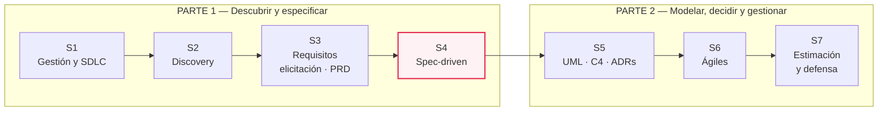
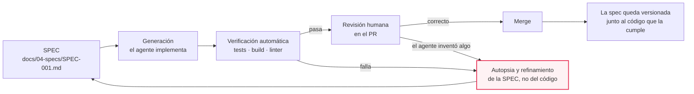
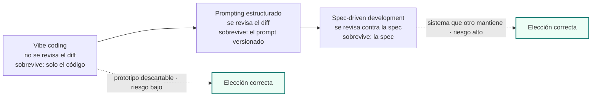
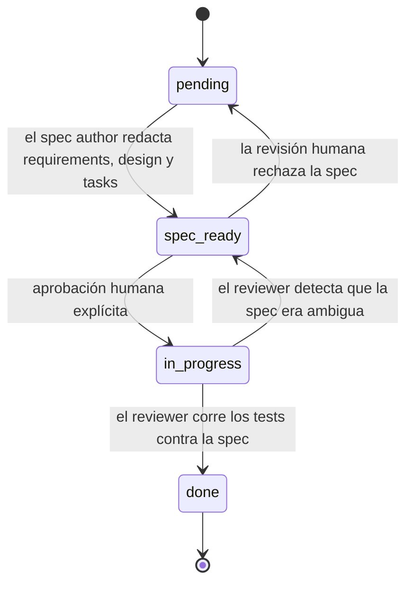
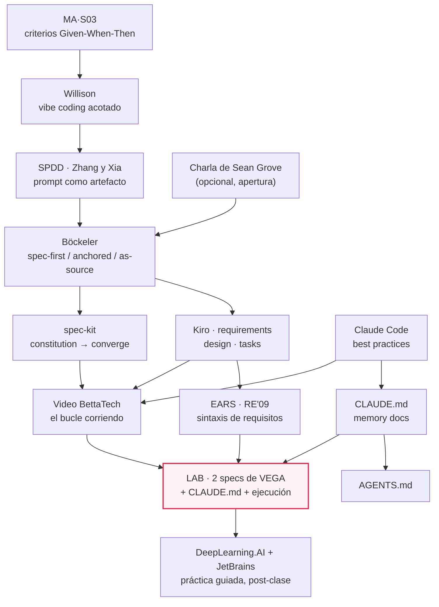
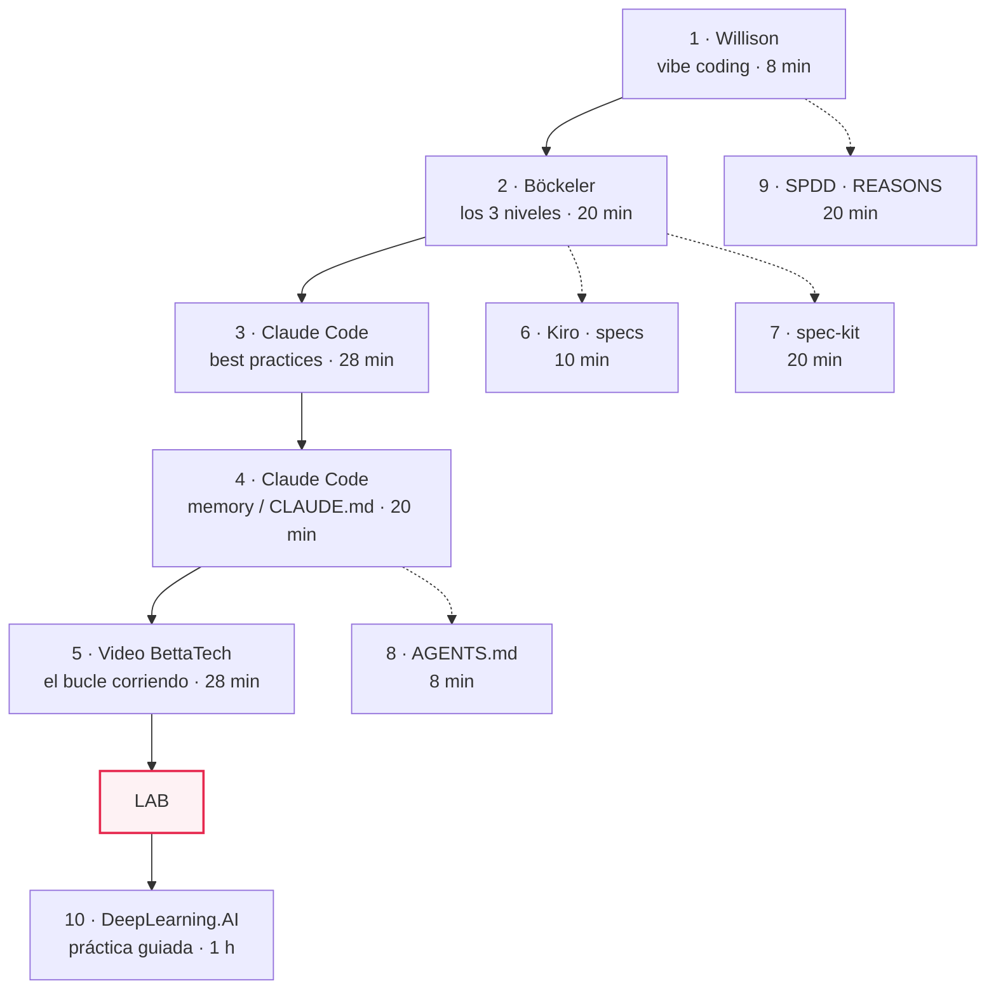

# MA·S04 — Spec-driven development

**Módulo:** A — Ingeniería de Software para AI Engineers *(módulo extra, transversal; se dicta entre el módulo 06 y el 07)*
**Sesión:** 04 de 07 · Parte 1 — Descubrir y especificar
**Fecha:** [Completar por el profesor: fecha]
**Caso hilo conductor:** Proyecto VEGA — Nortia Energía
**Entregables:** `docs/04-specs/` y `CLAUDE.md` en el repositorio `vega-project`

> Es **la sesión más importante del bloque**. Todo lo anterior —charter, discovery, requisitos, PRD— existía para llegar acá: convertir lo que sabés del problema en algo que otro pueda ejecutar sin inventar. Y ese "otro", en 2026, muchas veces es un agente de código.

**Duración estimada**

| Bloque | Tiempo |
|---|---|
| Clase presencial | 180 min |
| Lectura de los recursos imprescindibles | ~1 h 45 min |
| Lectura de los recursos recomendados | ~1 h |
| Recursos opcionales | ~2 h |
| Trabajo fuera de clase (terminar las specs + autopsia + PR) | ~2 h 30 min |
| **Total de estudio fuera de clase** | **≈ 7 h** |

**Reparto propuesto de los 180 minutos de clase**

| Tramo | Minutos | Contenido |
|---|---|---|
| Qué cambió + el espectro | 20 | Secciones 4.1 y 4.2 |
| Anatomía de la spec + alucinación arquitectónica | 30 | Secciones 4.3 y 4.4 |
| `CLAUDE.md` / `AGENTS.md` | 20 | Sección 4.5 |
| Descomposición y bucle de verificación | 15 | Secciones 4.6 y 4.7 |
| Antipatrones | 10 | Sección 4.8 |
| **Lab: dos specs de VEGA + `CLAUDE.md` + ejecución y autopsia** | **80** | Sección 5 |
| Cierre: repaso del PRD | 5 | Sección 5, paso 0 |

> 📝 **Nota para el profesor:** el plan del módulo no fija ni la fecha ni el reparto interno de los 180 minutos; esto es una propuesta funcional. El único bloque que conviene no comprimir es el lab: la autopsia de lo que inventó el agente es donde aterriza la sesión entera, y necesita al menos 20 de esos 80 minutos.

**Artefacto:** [La sesión en versión web](https://claude.ai/code/artifact/bacfdeb3-2174-46ab-aa5b-45d7331edaf2) — el apunte completo como página navegable.

---

## 1. Objetivos de aprendizaje

Al terminar esta sesión vas a poder:

1. **Explicar** qué cambia en el trabajo de un desarrollador cuando el cuello de botella deja de ser escribir código y pasa a ser decir con precisión qué código se quiere, y **defender** esa posición con argumentos y no con entusiasmo.
2. **Ubicar** cualquier práctica de programación asistida en el espectro *vibe coding → prompting estructurado → spec-driven development*, clasificándola por **grado de revisión** y por **qué artefacto sobrevive a la sesión** — y decidir cuál de los tres corresponde a un trabajo concreto.
3. **Escribir** una spec ejecutable completa con sus ocho apartados —contexto, objetivo, alcance explícito, alcance excluido, contrato de interfaces, criterios de aceptación, restricciones técnicas y criterios de verificación— partiendo de una user story y sus criterios Given-When-Then de MA·S03.
4. **Anticipar** la *alucinación arquitectónica*: nombrar las cinco cosas que un agente inventa cuando la spec calla, y **escribir la línea concreta** que la evita.
5. **Configurar** el archivo de contexto persistente de un repositorio —`CLAUDE.md`, e `AGENTS.md` cuando el equipo usa varias herramientas—, sabiendo qué scope corresponde a cada cosa, por qué el archivo tiene que quedar corto y por qué **pedir algo ahí no garantiza que se cumpla**.
6. **Descomponer** una spec grande en unidades que quepan en una sesión de trabajo y terminen con una verificación, distinguiendo cortes válidos de cortes inválidos.
7. **Ejecutar** el bucle spec → generación → revisión → **refinamiento de la spec**, y **explicar por qué se refina la spec y no el código**.
8. **Reconocer y corregir** los tres antipatrones de spec: la que describe implementación en vez de comportamiento, la que no tiene criterio de verificación y la de cuarenta páginas.
9. **Producir** `docs/04-specs/` con dos specs ejecutables y el `CLAUDE.md` del repositorio `vega-project`.

---

## 2. Resumen ejecutivo

En **MA·S01** escribiste el charter de VEGA y aprendiste que un proyecto de IA es experimental antes que determinista. En **MA·S02** metiste una cuña entre el problema y la solución. En **MA·S03** convertiste cuatro entrevistas conflictivas en requisitos, NFR, user stories y criterios de aceptación en Given-When-Then, y descubriste que el criterio de aceptación de una salida de LLM no se escribe con un `==`: se escribe como un **eval**. Hoy ese material se convierte en algo ejecutable.

La pregunta de la sesión es incómoda y hay que hacérsela de frente: **si un agente ya escribe el código, ¿qué queda del trabajo del desarrollador?** La respuesta del bloque es que el cuello de botella se corrió. Generar código es rápido y barato; lo que sigue siendo caro es **decir con precisión qué código se quiere** y **verificar que lo generado es eso**. Y ese "decir con precisión" tiene forma de artefacto versionado —la **spec ejecutable**— y no de prompt desechable en una ventana de chat.

Vas a ver el espectro que va del *vibe coding* al spec-driven development, leído por grado de revisión y no por calidad moral; la anatomía de ocho apartados de una spec; la tesis del bloque —lo que no especificás, el agente lo inventa, y lo inventa con confianza y con coherencia, que es lo que lo hace peligroso—; el archivo de contexto persistente del repositorio; cómo se parte una spec grande; y el bucle de verificación, que es el visual central del bloque entero.

El lab convierte dos historias del PRD en specs, escribe el `CLAUDE.md` de `vega-project`, ejecuta una de esas specs con un agente y hace la autopsia: **qué inventó, y qué línea faltaba para evitarlo.**

### Dónde estás dentro del bloque



---

## 3. Conceptos clave / glosario

> Los términos de MA·S01 (charter, SDLC, triple restricción), MA·S02 (discovery, oportunidad, hipótesis falsable) y MA·S03 (requisito, NFR, user story, INVEST, épica, PRD, Given-When-Then, eval, trazabilidad, MoSCoW, DoR/DoD) se dan por sabidos y no se repiten. Lo mismo con Git, Markdown y Claude Code, que venís usando desde el módulo 01.

### El espectro y sus prácticas

| Término | Definición |
|---|---|
| **Vibe coding** | El caso específico de programación asistida en el que **no se revisa el diff**: se aceptan los cambios sin leerlos, se pegan los errores de vuelta y se deja que el modelo produzca código más allá de lo que uno entiende. No es sinónimo de "programar con IA": si revisás, entendés, testeás y podés explicarle a otro cómo funciona, eso es desarrollo de software (Willison, 2025). |
| **Prompting estructurado** | El escalón intermedio: el prompt deja de ser desechable y pasa a ser un **artefacto de entrega versionado junto al código**, con una estructura fija y revisable. |
| **Spec-driven development (SDD)** | Práctica en la que el artefacto que dirige el trabajo —y que sobrevive a la sesión— es una **especificación versionada** del comportamiento deseado; el código se genera a partir de ella y se verifica contra ella. |
| **Spec ejecutable** | Un documento de spec escrito con la precisión suficiente para que un ejecutor —humano o agente— pueda implementarlo sin preguntarte, y que termina con un criterio de verificación que se puede correr. Analogía: es la diferencia entre "hacé la cena" y una receta con cantidades, tiempos y una foto de cómo tiene que quedar. |
| **Spec-first** | Nivel de la taxonomía de Böckeler: la spec se escribe antes de generar el código y **se descarta después**. Sirvió para arrancar, no para mantener. |
| **Spec-anchored** | La spec **sobrevive** y es el documento vivo de la feature: se actualiza con cada cambio y es lo que se lee para entender qué hace el sistema. |
| **Spec-as-source** | Solo se edita la spec; el código es generado y **no se toca a mano**, igual que no se edita el bytecode de un compilador. |
| **Memory bank** | El conjunto de archivos que guardan el **contexto general del proyecto** —`AGENTS.md`, `project.md`, `architecture.md`— frente a la spec, que describe **una tarea concreta**. La distinción es de Böckeler y es la que ordena qué va en `CLAUDE.md` y qué va en `docs/04-specs/`. |
| **REASONS Canvas** | Estructura de siete dimensiones propuesta para escribir un prompt como artefacto de entrega: abstractas (Requirements, Entities, Approach, Structure), de ejecución (Operations) y de gobierno (Norms, Safeguards). |

### La spec y sus partes

| Término | Definición |
|---|---|
| **Alcance explícito** | Lo que esta unidad de trabajo **sí** produce, enumerado. Es el contrato de entrega. |
| **Alcance excluido** | Lo que esta unidad de trabajo **no** hace, escrito a propósito. Es el apartado más barato de escribir y el que más alucinación evita: cada línea de acá es una decisión que el agente ya no va a tomar por vos. |
| **Contrato de interfaces** | Las firmas, tipos, endpoints, esquemas y nombres de archivo concretos que la implementación tiene que respetar para encajar con lo que ya existe. |
| **Restricción técnica** | Una decisión ya tomada que el ejecutor no puede renegociar: stack, límite de latencia, dependencia prohibida, sistema que no se toca. |
| **Criterio de verificación** | El comando o procedimiento concreto que decide si la implementación está bien: `pytest tests/…`, el build, el linter, una captura de pantalla. Se distingue del criterio de aceptación en que **el criterio de aceptación describe el comportamiento y el criterio de verificación lo comprueba**. |
| **EARS** *(Easy Approach to Requirements Syntax)* | Sintaxis restringida para escribir requisitos, con seis patrones y palabras clave fijas (*When*, *While*, *Where*, *If-Then*). Un requisito EARS se traduce casi uno a uno a un test. Es la alternativa a Given-When-Then: GWT describe **escenarios**, EARS describe **requisitos**. |
| **Constitution** | En el vocabulario de spec-kit, el archivo con los principios y convenciones del proyecto que aplican a todas las specs. Es el mismo rol que cumple el `CLAUDE.md` de scope *project*. |

### Contexto persistente y ejecución

| Término                              | Definición                                                                                                                                                                                                                                                                                                                |
| ------------------------------------ | ------------------------------------------------------------------------------------------------------------------------------------------------------------------------------------------------------------------------------------------------------------------------------------------------------------------------- |
| **`CLAUDE.md`**                      | El archivo de contexto persistente que Claude Code carga automáticamente al arrancar en un directorio: stack, comandos, estructura, convenciones, decisiones vigentes y cosas prohibidas. Analogía: no es el manual del producto, es la nota que le dejás a alguien que empieza mañana y no vas a estar para contestarle. |
| **Scope (de un archivo de memoria)** | El alcance desde el que se carga un archivo de contexto: *managed policy*, *user*, *project* o *local*. Los archivos de los cuatro scopes se **concatenan**, no se pisan.                                                                                                                                                 |
| **`AGENTS.md`**                      | Formato abierto y neutral respecto de la herramienta, que se propone como "README para agentes": el contexto que un agente de código necesita y que el README humano no contiene.                                                                                                                                         |
| **Plan mode**                        | Modo de Claude Code en el que el agente lee archivos y responde preguntas **sin escribir nada**. Separa la fase de exploración y planificación de la de ejecución.                                                                                                                                                        |
| **Harness (arnés)**                  | Automatización que **obliga** a un agente a seguir un flujo de trabajo determinado, en vez de confiar en que lo siga porque se lo pediste. *Harness engineering* es la disciplina de construirlos; SDD es **uno** de los flujos que se pueden automatizar así.                                                            |
| **Memoria externa**                  | Guardar el estado del trabajo en archivos (una lista de tareas, una carpeta `specs/`, un `history.md`) en vez de en la ventana de contexto, para que cada agente reciba solo el **contexto mínimo** que necesita.                                                                                                         |
| **Human in the loop**                | Un punto del flujo donde la máquina se detiene y necesita aprobación humana explícita para seguir. En un flujo SDD, el punto natural está **entre la spec y la implementación**.                                                                                                                                          |
| **Contexto como recurso escaso**     | Principio operativo: la ventana de contexto es finita y la adherencia del modelo baja cuando se llena. Todo lo que metés de más compite con lo que importa.                                                                                                                                                               |

### Los riesgos

| Término | Definición |
|---|---|
| **Alucinación arquitectónica** | *(Tesis de este bloque.)* Lo que pasa cuando la spec deja un hueco: el agente no se detiene a preguntar, lo rellena con la opción más plausible que conoce, y lo hace con confianza y con coherencia en todo el código. El resultado no parece un error: parece una decisión de diseño que nadie tomó. |
| **Trust-then-verify gap** | La brecha entre lo plausible y lo correcto: el agente produce una implementación que se ve bien y que no cubre los casos borde. Es la razón por la que la revisión no se puede saltar. |
| **Sobrecarga de revisión** | El coste humano de revisar output generado, que crece con el volumen. Es el cuello de botella real de un equipo que genera rápido: la capacidad de generación subió, la de revisión no. |
| **Ilusión de control** | La sensación de que, porque escribiste una spec larga y detallada, el agente la va a cumplir entera. La spec reduce la incertidumbre; no la elimina. |
| **Reemplazabilidad del agente** | Propiedad deseable de un flujo de trabajo: si la spec es buena y sobrevive, cambiar de modelo o de herramienta cuesta poco, porque el conocimiento no vive en el chat ni en el código. |

---

## 4. Notas de estudio

### El diagrama de la sesión: el bucle de verificación

Si te llevás una sola imagen de este bloque, que sea ésta. La flecha que la hace distinta de cualquier flujo de desarrollo que ya conocés es la de vuelta: **no vuelve al código, vuelve a la spec.**



Todo lo que sigue explica alguna pieza de este bucle.

---

### 4.1 Qué cambió: el cuello de botella se movió

Durante cincuenta años, el recurso escaso en desarrollo de software fue **producir código correcto**. Todas las prácticas de la disciplina —lenguajes de alto nivel, librerías, frameworks, IDEs, refactoring automático— fueron intentos de bajar ese coste. La ingeniería de requisitos existía, pero como actividad *previa*: se hacía porque escribir el código equivocado era carísimo.

Cuando la generación de código se vuelve rápida y barata, ese equilibrio se rompe. No desaparece el trabajo: **se corre de sitio**. Quedan caras dos cosas:

1. **Decir con precisión qué se quiere.** Un agente no tiene tu contexto, no estuvo en la entrevista con Cristina y no sabe que Diego dijo que el CRM de producción no se toca.
2. **Verificar que lo generado es eso.** Y verificar no se aceleró al mismo ritmo que generar. Ésa es la asimetría central de la sesión, y es también la razón económica por la que el módulo termina, en MA·S07, discutiendo la revisión como el nuevo cuello de botella.

La documentación de buenas prácticas de Claude Code lo dice de forma operativa, y es la línea sobre la que se apoya toda la sesión: **el tiempo invertido en precisar la spec rinde más que el tiempo mirando la implementación**. Y describe cómo es una spec útil: **autocontenida**, que nombra los archivos e interfaces involucrados, que declara qué queda fuera de alcance y que **termina con un paso de verificación end-to-end**. Esos cuatro rasgos son, básicamente, el esqueleto de la sección 4.3.

#### El argumento de fondo: el código es una proyección con pérdida

Ésta es la posición de este bloque, y conviene que la puedas defender:

**El código no contiene la intención. Contiene una de las muchas implementaciones posibles de la intención.** Cuando escribís código tomás decenas de decisiones —qué caso borde importa, qué error se propaga y cuál se traga, qué queda fuera— y el archivo resultante guarda el resultado de esas decisiones pero no las decisiones. No guarda las alternativas que descartaste, ni por qué, ni qué te habían pedido exactamente. Es una **proyección con pérdida** de lo que sabías cuando lo escribiste.

Mientras el que escribía el código era el mismo que tenía la intención en la cabeza, la pérdida se podía tolerar: el conocimiento vivía en la persona. Cuando el que escribe el código es un agente que no va a estar mañana, y encima puede ser otro agente distinto, la pérdida se vuelve el problema principal. Por eso el artefacto que hay que cuidar es la spec, no el código: es el único lugar donde la intención está escrita.

De ahí salen tres consecuencias prácticas que vas a ver en toda la sesión:

- Si el agente se equivoca, **se arregla la spec** (sección 4.7).
- Si la spec es buena, **el agente es reemplazable** (sección 4.7).
- Lo que la spec no dice, **alguien lo va a decidir igual**, y ese alguien va a ser el agente (sección 4.4).

> 💡 **Contexto para ubicar la discusión.** Esta conversación no la inventó el bootcamp: circula en el ecosistema desde hace un par de años y una de sus referencias es la charla *The New Code*, de Sean Grove (OpenAI). La crónica de las keynotes de la AI Engineer World's Fair 2025 publicada por Latent Space, los organizadores del evento, resume esa charla como una defensa de que el Model Spec de OpenAI está subvalorado y hace falta —tocando de frente el episodio de *sycophancy* de 4o—, con el argumento de que el mejor programador va a ser el mejor comunicador, y de que la comunicación bien estructurada, es decir la spec, es el mejor enfoque tanto para *alignment* como para construir cualquier cosa con IA. Es una paráfrasis de terceros y una sola fuente: sirve para ubicar el debate, no para citar a Grove.

**Para profundizar:** [Best practices for Claude Code](https://code.claude.com/docs/en/best-practices) · [Latent Space — *AI Engineering Goes Mainstream*](https://www.latent.space/p/aiewf-2025-keynotes)

---

### 4.2 El espectro: vibe coding → prompting estructurado → SDD

El error más común al contar esto es presentarlo como una escalera moral, de la práctica mala a la buena. **No lo es.** El espectro se ordena por dos ejes, y los dos son descriptivos:

- **Grado de revisión:** cuánto del output se lee, se entiende y se comprueba.
- **Qué artefacto sobrevive a la sesión:** ¿queda solo el código? ¿queda el prompt? ¿queda la spec?



#### Escalón 1 · Vibe coding, con la definición acotada

Simon Willison, en *Not all AI-assisted programming is vibe coding (but vibe coding rocks)* (19 de marzo de 2025), rescata el término del uso indiscriminado en el que ya había caído a las pocas semanas de acuñarse. Karpathy acuñó el término en febrero de 2025, según consigna el propio Willison.

Su definición es útil porque es **una línea, no una escala**: vibe coding es el caso en que **no se revisa el código generado**. Se aceptan los cambios sin leerlos, se pegan los errores de vuelta y se deja que el LLM produzca código más allá de lo que uno entiende. Si en cambio revisás, entendés, testeás y podés explicarle a otro cómo funciona, **eso es desarrollo de software** y el hecho de que lo haya escrito un LLM es irrelevante para la clasificación.

Y ahí está la parte que no se cuenta: Willison sostiene que vibe coding **está bien** en su lugar — prototipos descartables, riesgo bajo, cosas que no tenés que mantener. El problema no es la técnica, es aplicarla donde el coste del error es otro.

> ⚠️ Un prototipo de fin de semana en vibe coding está perfecto. Un asistente que responde a 42 agentes sobre el importe de la factura de 210.000 clientes, no. La pregunta no es "¿está bien vibe codear?", es "**¿quién paga si esto está mal y cuánto?**".

#### Escalón 2 · Prompting estructurado

El escalón intermedio: el prompt deja de ser una frase que escribís y perdés, y pasa a ser un **artefacto de entrega de primera clase, versionado junto al código**. Wei Zhang y Jessie Jie Xia (Thoughtworks), en *Structured-Prompt-Driven Development* (28 de abril de 2026), lo estructuran con el **REASONS Canvas**, siete dimensiones agrupadas en tres familias:

| Familia | Dimensiones | Qué captura |
|---|---|---|
| **Abstractas** | Requirements, Entities, Approach, Structure | Qué hay que construir y con qué forma |
| **De ejecución** | Operations | Cómo se lleva a cabo |
| **De gobierno** | Norms, Safeguards | Qué reglas y qué límites aplican |

Comparte el punto de partida de SDD —que la ambigüedad se paga— y agrega el ciclo cerrado: los cambios fluyen en **las dos direcciones** entre requisitos y código, no solo hacia abajo.

#### Escalón 3 · Spec-driven development, y sus tres niveles

Birgitta Böckeler (Thoughtworks), en *Understanding Spec-Driven-Development: Kiro, spec-kit, and Tessl* (martinfowler.com, 15 de octubre de 2025), probó tres herramientas que se autodenominan SDD y destiló una taxonomía de tres niveles. Es el vocabulario más útil que vas a sacar de la sesión, porque te sirve para clasificar cualquier herramienta nueva que aparezca:

| Nivel | Qué pasa con la spec | Qué se edita a mano | Coste de mantenerla |
|---|---|---|---|
| **Spec-first** | Se escribe antes y **se descarta después** | El código | Ninguno; tampoco hay beneficio a largo plazo |
| **Spec-anchored** | **Sobrevive** y es el documento vivo de la feature | La spec **y** el código, en sincronía | Medio: hay que mantener dos artefactos coherentes |
| **Spec-as-source** | Es **la única** fuente de verdad | Solo la spec; el código es generado | Alto en disciplina: nadie puede tocar el código |

Böckeler señala además el paralelo con el **Model-Driven Development** de los 2000, que prometía lo mismo que *spec-as-source* —modelás, se genera el código— y no cuajó por rigidez y por sobrecarga. No es un argumento para descartar SDD; es un argumento para no creer que *spec-as-source* es el destino inevitable.

> 💡 **Dónde te conviene estar en un proyecto real.** *Spec-anchored* es el punto de equilibrio para casi todo: la spec sobrevive, sirve de documentación y de contrato con el agente, y no te obliga a la disciplina de no tocar nunca el código. Es el nivel que el lab de hoy practica.

Y una distinción que ordena el resto de la sesión: Böckeler separa la **spec de tarea** (una feature concreta) del **memory bank** —los `AGENTS.md`, `project.md`, `architecture.md` que guardan el contexto general del proyecto—. En nuestro repo eso se traduce literalmente: `docs/04-specs/` es spec de tarea, `CLAUDE.md` es memory bank.

**Para profundizar:** [Willison — *Not all AI-assisted programming is vibe coding*](https://simonwillison.net/2025/Mar/19/vibe-coding/) · [Zhang y Xia — *Structured-Prompt-Driven Development*](https://martinfowler.com/articles/structured-prompt-driven/) · [Böckeler — *Understanding Spec-Driven-Development*](https://martinfowler.com/articles/exploring-gen-ai/sdd-3-tools.html)

---

### 4.3 Anatomía de una spec ejecutable

Los ocho apartados se agrupan en tres bloques, y cada bloque responde una pregunta distinta:

| Bloque | Apartados | Pregunta que responde | Quién lo escribe |
|---|---|---|---|
| **Qué y por qué** | 1. Contexto · 2. Objetivo · 3. Alcance explícito · 4. Alcance excluido | ¿Qué hay que lograr y hasta dónde llega esto? | Sale casi entero del PRD de MA·S03 |
| **Cómo se conecta** | 5. Contrato de interfaces · 6. Restricciones técnicas | ¿Con qué tiene que encajar y qué no puede tocar? | Lo escribís vos, mirando el repo |
| **Cómo se comprueba** | 7. Criterios de aceptación · 8. Criterios de verificación | ¿Cómo sabemos que está bien, y cómo lo comprueba una máquina? | Los criterios GWT ya los tenés; el comando lo agregás |

Ese corte no es caprichoso: es el mismo que hace Kiro cuando materializa una spec en **tres archivos** —`requirements.md` (qué y por qué), `design.md` (cómo se conecta) y `tasks.md` (el plan de implementación en tareas discretas y rastreables)—. Si un día trabajás con Kiro, vas a reconocer la estructura.

#### Apartado por apartado

**1 · Contexto.** Por qué existe esta tarea, en tres o cuatro líneas. Dónde encaja en el sistema, qué problema de negocio atiende, qué pasó antes. Sirve para que el ejecutor tome decisiones razonables en lo que no está escrito.
*VEGA:* "El 23 % de los contactos de Nortia son sobre facturación. VEGA responde consultas de los agentes apoyándose en un corpus de 4.100 documentos de la intranet. Cuando la respuesta no está en el corpus, hoy no hay comportamiento definido."
*Error común:* copiar el PRD entero. El contexto es lo mínimo para decidir, no el expediente.

**2 · Objetivo.** Una frase. Qué tiene que ser verdad cuando esto esté terminado.
*VEGA:* "Que VEGA nunca afirme un dato de facturación que no esté respaldado por el corpus, y que declare explícitamente cuándo no sabe."
*Error común:* que el objetivo describa la solución ("implementar un umbral de similitud de 0,7") en vez del resultado.

**3 · Alcance explícito.** La lista de lo que esta unidad **sí** produce. Con nombres de archivo si ya los sabés.
*Error común:* enumerar tareas de implementación en vez de entregables observables.

**4 · Alcance excluido.** La lista de lo que esta unidad **no** hace. **Es el apartado más importante de los ocho** y el que casi nadie escribe. Cada línea de acá es una decisión que el agente ya no va a tomar por vos. Volvemos sobre esto en la sección 4.4.
*VEGA:* "No se modifica el pipeline de retrieval. No se toca el CRM ni se escribe en él. No se implementa el escalado automático a supervisor: solo se marca el flag. No se cambia el prompt del sistema de VEGA."

**5 · Contrato de interfaces.** Las firmas, tipos, endpoints, esquemas y rutas concretas. Es lo que evita que el agente invente una API paralela a la que ya tenés.

```python
# docs/04-specs/SPEC-001.md — apartado 5, contrato de interfaces
# Archivo a modificar: src/vega/answering.py
# Modelos Pydantic ya existentes en src/vega/schemas.py — NO se redefinen:

class Fuente(BaseModel):
    documento_id: str
    fragmento: str

class Respuesta(BaseModel):
    texto: str
    fuentes: list[Fuente]                                  # lista vacía si no hubo evidencia
    confianza: Literal["alta", "media", "insuficiente"]
    escalar_a_humano: bool

# Firma que esta spec introduce:
def responder(consulta: str, contexto: list[Fuente]) -> Respuesta: ...
```

> 💡 Acá se nota que el módulo 01 sigue rindiendo: un modelo de Pydantic **es** un contrato de interfaz legible por un agente. Si tu proyecto tiene tipos, la mitad de este apartado ya está escrita.

**6 · Restricciones técnicas.** Lo que no se negocia. Stack, versiones, límites de rendimiento, dependencias prohibidas, sistemas intocables. Muchas vienen directamente de los NFR y las restricciones de MA·S03.
*VEGA:* "RES-01: no se escribe en el CRM de producción (fuente: Diego Amat). NFR-01: p95 de la respuesta ≤ ___ s. No se agregan dependencias nuevas sin ADR."

**7 · Criterios de aceptación.** Los escenarios Given-When-Then de MA·S03, tal cual. Describen **comportamiento observable desde fuera**.

**8 · Criterios de verificación.** El comando que decide. Ésta es la diferencia entre una spec y un deseo largo: si no hay nada que correr, el que verifica sos vos, a mano, todas las veces.
*VEGA:* "`pytest tests/test_respuesta_insuficiente.py` pasa; `pytest tests/evals/eval_no_alucinar.py` reporta una tasa ≥ ___ sobre los 20 casos de `data/consultas_sin_kb.jsonl`; `ruff check src/` sin errores."

> ⚠️ **La regla que resume el apartado 8:** si no le das al agente una verificación que pueda correr —tests, build, linter, una captura—, **el bucle de verificación sos vos**. Y vos no escalás.

#### La spec de ejemplo, resuelta entera

Copiala como forma, no como contenido: tu SPEC-001 tiene que salir de **tu** PRD.

````markdown
# SPEC-001 · Respuesta cuando la consulta no está en la base de conocimiento

**Historia origen:** US-007 (`docs/03-prd.md`)
**Requisitos:** RF-004, NFR-04, NFR-07
**Estado:** aprobada · **Autor:** equipo 3 · **Ejecutor:** Claude Code

## 1. Contexto
VEGA responde consultas de los 42 agentes de Atención al Cliente de Nortia
apoyándose en un corpus de 4.100 documentos de la intranet. El 23 % de los
contactos son sobre facturación. Hoy, cuando el retrieval no devuelve evidencia
suficiente, el comportamiento no está definido y el modelo responde igual: es el
riesgo número uno del proyecto, porque el agente le repite la respuesta al cliente.

## 2. Objetivo
Que VEGA nunca afirme un dato que no esté respaldado por el corpus, y que
declare explícitamente cuándo no dispone de información suficiente.

## 3. Alcance explícito
- Detección de "evidencia insuficiente" en `src/vega/answering.py`.
- Respuesta de "no dispongo de esta información" con el campo
  `confianza = "insuficiente"` y `fuentes = []`.
- Marcado del flag `escalar_a_humano = True` en ese caso.
- Tests unitarios en `tests/test_respuesta_insuficiente.py`.
- Eval en `tests/evals/eval_no_alucinar.py` con 20 casos etiquetados.

## 4. Alcance excluido
- NO se modifica el pipeline de retrieval ni la estrategia de chunking.
- NO se toca el CRM: ni lectura ni escritura.
- NO se implementa el escalado automático a supervisor; solo se marca el flag.
- NO se cambia el system prompt de VEGA.
- NO se añade UI: el consumidor de `Respuesta` no entra en esta spec.
- NO se crea una capa de servicios ni un repositorio nuevo: la lógica va en el
  módulo que ya existe.

## 5. Contrato de interfaces
Archivo a modificar: `src/vega/answering.py`.
Modelos existentes en `src/vega/schemas.py`, que NO se redefinen: `Fuente`,
`Respuesta` (campos: `texto`, `fuentes`, `confianza`, `escalar_a_humano`).
Firma que esta spec introduce:

    def responder(consulta: str, contexto: list[Fuente]) -> Respuesta: ...

## 6. Restricciones técnicas
- RES-01 · No se escribe en el CRM de producción (fuente: Diego Amat).
- NFR-01 · p95 de la respuesta ≤ ___ s (pendiente de cerrar con Marta Sedano).
- Python 3.12, Pydantic v2. Sin dependencias nuevas sin ADR.
- El texto de la respuesta va en castellano, registro profesional (NFR-09).

## 7. Criterios de aceptación

    Scenario: La respuesta no está en la base de conocimiento
      Given un corpus que no contiene información sobre la consulta
      When el agente consulta a VEGA
      Then la respuesta declara explícitamente que no dispone de información
        And el campo fuentes viene vacío
        And el campo escalar_a_humano viene en true

    Scenario: La evidencia recuperada es parcial
      Given un corpus con un único fragmento relevante y de baja similitud
      When el agente consulta a VEGA
      Then la respuesta cita ese fragmento
        And el campo confianza viene en "media"

## 8. Criterios de verificación
1. `pytest tests/test_respuesta_insuficiente.py` — todos los tests en verde.
2. `pytest tests/evals/eval_no_alucinar.py` — tasa ≥ ___ sobre los 20 casos de
   `data/consultas_sin_kb.jsonl` (calificación binaria por LLM juez, modelo
   distinto del evaluado).
3. `ruff check src/` sin errores.
4. Verificación end-to-end: correr `scripts/demo_consulta.py` con una consulta
   fuera del corpus y comprobar a ojo que la respuesta no inventa nada.
````

> 📝 **Nota para el profesor:** el plan del módulo enumera los ocho apartados pero no fija una plantilla. Ésta es la propuesta —esqueleto más una spec de VEGA resuelta entera, para que el equipo copie la forma—. Si tenés plantilla propia de spec, sustituila y avisá en clase antes del lab.

#### Nota lateral: EARS, la otra notación

Los criterios de aceptación de este bloque van en Given-When-Then, que es lo que practicaste en MA·S03. Pero en el ecosistema SDD vas a cruzarte constantemente con **EARS** (*Easy Approach to Requirements Syntax*), del paper de Mavin, Wilkinson, Harwood y Novak presentado en la 17ª IEEE International Requirements Engineering Conference (2009). Son seis patrones con palabras clave fijas:

| Patrón | Forma | Cuándo |
|---|---|---|
| *Ubiquitous* | "The system shall…" | Siempre vale, sin condición |
| *Event-driven* | "**When** [trigger], the system shall…" | Reacción a un evento |
| *State-driven* | "**While** [state], the system shall…" | Mientras dura un estado |
| *Optional feature* | "**Where** [condition], the system shall…" | Solo si la feature está presente |
| *Unwanted behaviour* | "**If** [evento indeseado], **then** the system shall…" | Manejo de error |
| *Complex* | Combinación de los anteriores | Casos con varias condiciones |

**GWT describe escenarios; EARS describe requisitos.** Comparten la virtud que a nosotros nos interesa: los dos son mecánicamente traducibles a un test, que es exactamente lo que pide el apartado 8. Si tu equipo prefiere EARS para el apartado 7, es una elección legítima — lo que no es legítimo es prosa libre.

**Para profundizar:** [Kiro — *Specs*](https://kiro.dev/docs/specs/) · [Mavin et al. — *Easy Approach to Requirements Syntax (EARS)*, RE'09](https://ccy05327.github.io/SDD/08-PDF/Easy%20Approach%20to%20Requirements%20Syntax%20(EARS).pdf)

---

### 4.4 La ambigüedad se paga en alucinación arquitectónica

> Ésta es la **tesis propia de este bloque**. No es un término del ecosistema ni vas a encontrarlo en la bibliografía: es el nombre que le ponemos acá a un fenómeno que sí está documentado por partes. Usalo, pero sabiendo que es vocabulario nuestro.

Ya sabés qué es una alucinación textual: el modelo afirma un hecho falso. La **alucinación arquitectónica** es el mismo mecanismo aplicado a la **estructura del software**, y es mucho peor por tres razones.

**Primera: el agente no se detiene.** Un humano al que le das una tarea con un hueco te escribe por Slack. Un agente no. Rellena el hueco con la opción más frecuente en lo que aprendió y sigue. No hay señal de que haya tomado una decisión.

**Segunda: lo hace con confianza y con coherencia.** No inventa una capa de servicios rota: inventa una capa de servicios razonable, con nombres consistentes, aplicada en los doce archivos que tocó. **El resultado no parece un error, parece una decisión de diseño.** Y una decisión de diseño que nadie tomó no la detecta la revisión de un PR, porque en la revisión de un PR uno busca bugs, no busca arquitectura que apareció sola.

**Tercera: la unidad de daño es distinta.** Una alucinación textual es una frase. Una alucinación arquitectónica son doce archivos, una convención nueva y, si nadie la ve, una semana de trabajo posterior construido encima.

#### Las cinco cosas que el agente inventa cuando la spec calla

| Qué inventa | Cómo se ve en VEGA | La línea de spec que lo evita |
|---|---|---|
| **La capa de servicios** | Crea `services/answer_service.py` y un repositorio, porque tu repo "parece" que debería tenerlos | "La lógica va en `src/vega/answering.py`. No se crean capas ni módulos nuevos." |
| **El esquema de datos** | Inventa una tabla `escalados` con seis columnas y una migración | "No se crean tablas ni migraciones. El escalado se marca con un flag booleano en la respuesta." |
| **El formato de la API** | Devuelve `{"answer": ..., "sources": [...]}` en vez de tu modelo `Respuesta` | El apartado 5, contrato de interfaces, con los nombres exactos de los campos |
| **La convención de nombres** | Mezcla `snake_case` con `camelCase` y castellano con inglés | Una línea en `CLAUDE.md`: "código y nombres de campo en inglés; textos de cara al usuario en castellano" |
| **El manejo de error** | Se traga la excepción del retrieval y devuelve una respuesta genérica, que es exactamente el bug que la spec quería evitar | "Si el retrieval falla, se propaga la excepción. **No** se devuelve una respuesta con `confianza = 'media'`." |

Fijate en el patrón: **las cinco se evitan con una línea de texto**, y las cinco líneas viven o en el apartado 4 (alcance excluido) o en el 5 (contrato de interfaces). Ése es el argumento económico de la sesión entera: el alcance excluido es el apartado más barato de escribir y el que más caro sale omitir.

#### Qué respalda esto, y qué es posición nuestra

- Böckeler observa en sus pruebas que los agentes **ignoran instrucciones** o, al revés, **se descontrolan siguiéndolas**, generando duplicados de cosas que ya existían. Ése es el fenómeno; el nombre es nuestro.
- La documentación de Claude Code describe el **trust-then-verify gap**: el agente produce una implementación plausible que no cubre los casos borde. Es la versión de comportamiento del mismo problema.
- Que la vacuna sea el apartado de alcance excluido es la posición de este bloque, no un consenso del sector.

> ⚠️ **El corolario incómodo.** "El agente se equivocó" casi nunca es un diagnóstico útil. En la mayoría de los casos, el agente **decidió** —porque tenía que decidir— y vos no habías dicho nada. El lab de hoy está construido para que lo compruebes vos mismo.

---

### 4.5 El archivo de contexto persistente: `CLAUDE.md` y `AGENTS.md`

La spec describe **una tarea**. Pero hay cosas que valen para todas las tareas del repo: el stack, cómo se corren los tests, cómo se llaman las cosas, qué decisiones están vigentes y qué está prohibido. Repetirlas en cada spec es absurdo. Ése es el rol del **memory bank**, y en Claude Code se llama `CLAUDE.md`.

#### Los cuatro scopes y su orden de carga

| Scope | Ubicación | Para qué | Se comparte con |
|---|---|---|---|
| Managed policy | Linux/WSL `/etc/claude-code/CLAUDE.md` · macOS `/Library/Application Support/ClaudeCode/CLAUDE.md` · Windows `C:\Program Files\ClaudeCode\CLAUDE.md` | Instrucciones de toda la organización | Todos los usuarios |
| User | `~/.claude/CLAUDE.md` | Preferencias personales, en todos tus proyectos | Solo vos |
| **Project** | `./CLAUDE.md` o `./.claude/CLAUDE.md` | **Arquitectura, convenciones y flujos del proyecto** | El equipo, por control de versiones |
| Local | `./CLAUDE.local.md` | Preferencias personales de este proyecto | Solo vos (va al `.gitignore`) |

Se cargan **en ese orden**, del scope más amplio al más específico, y se **concatenan**: no se pisan. El archivo más cercano al directorio donde arrancaste se lee último. **El entregable de hoy es el de scope *project***, porque es el único que viaja en el repo y que el resto del equipo —y el equipo revisor— va a leer.

#### Las tres reglas que evitan el 80 % de los problemas

**1 · Menos de 200 líneas.** La documentación lo pone como objetivo explícito, y da la razón: los archivos largos consumen contexto y **bajan la adherencia**. Es contraintuitivo y por eso hay que decirlo fuerte: un `CLAUDE.md` de 400 líneas no hace que el agente cumpla el doble, hace que cumpla la mitad.

**2 · Es contexto, no configuración forzada.** Escribir "nunca escribas en el CRM de producción" en el `CLAUDE.md` **no bloquea** que lo haga. Aumenta mucho la probabilidad de que no lo haga, que no es lo mismo. Para bloquear una acción pase lo que pase hay que salir del archivo y usar un hook `PreToolUse`.

> ⚠️ Ésta es la distinción que más se malinterpreta de toda la sesión, y la que más caro sale en un proyecto real. Si una regla es de cumplimiento obligatorio —tocar producción, borrar datos, gastar dinero—, **el `CLAUDE.md` no es el mecanismo**. Es una guía, no una barrera.

**3 · Escribí lo que el agente no puede deducir leyendo el código.** Los comandos y la estructura los saca solo. Lo que no puede sacar de ningún lado es *por qué* las cosas son así, qué se intentó y se abandonó, y qué está prohibido.

#### Qué va y qué no va

| ✅ Va en `CLAUDE.md` | ❌ No va |
|---|---|
| Stack y versiones | El PRD entero o la documentación de negocio |
| Comandos de build, test y lint, tal cual se escriben | Un tutorial de Python o de Git |
| Estructura del repo y qué vive en cada carpeta | Lo que el agente deduce leyendo el árbol de archivos |
| Convenciones de nombres, idioma del código y de los textos | Cosas obvias ("escribí código limpio") |
| **Decisiones vigentes** y por qué | La historia completa de las decisiones — eso son los ADR de MA·S05 |
| **Cosas prohibidas**, explícitas | Specs de tarea concretas — ésas van en `docs/04-specs/` |
| Cómo se verifica el trabajo | Secretos, tokens, credenciales |

#### `AGENTS.md`: la respuesta a "¿y si mañana usamos otra herramienta?"

`AGENTS.md` es un **formato abierto** que se propone como "README para agentes": un archivo dedicado con el contexto que un agente de código necesita y que el README humano no contiene. Sugiere secciones de descripción del proyecto, comandos de build y test, guías de estilo, instrucciones de testing, consideraciones de seguridad y convenciones de commits y PRs. Salió de la colaboración entre OpenAI Codex, Amp, Jules (Google), Cursor y Factory, y hoy está bajo la tutela de la **Agentic AI Foundation, dentro de la Linux Foundation**. Según el propio sitio del formato, a partir de una búsqueda en GitHub, se usa en más de 60.000 proyectos open source, y lista más de 20 agentes y herramientas compatibles.

Y acá el dato operativo que hay que saberse: **Claude Code lee `CLAUDE.md`, no `AGENTS.md`.** Si tu repo ya tiene un `AGENTS.md`, no lo dupliques —dos copias del mismo contexto divergen en dos semanas—: importalo.

```markdown
<!-- CLAUDE.md -->
@AGENTS.md

## Claude Code

Usá plan mode para cambios bajo `src/billing/`.
```

O, si no necesitás agregar nada específico de Claude, un symlink:

```bash
ln -s AGENTS.md CLAUDE.md    # no imprime nada si salió bien; comprobalo con /context
```

> ⚠️ En Windows el symlink pide privilegios de administrador o Developer Mode. Ahí usá el import `@AGENTS.md`, que funciona igual en todas las plataformas.

#### El `CLAUDE.md` de `vega-project`

Éste es el entregable, escrito. Está por debajo de 200 líneas a propósito.

````markdown
# VEGA — contexto del proyecto

Asistente interno de Nortia Energía para los 42 agentes de Atención al Cliente.
Responde consultas apoyándose en un corpus de 4.100 documentos de la intranet.
No habla nunca con el cliente final: habla con el agente, que decide qué dice.

## Stack

- Python 3.12 · Pydantic v2 · FastAPI
- Tests: pytest · Lint y formato: ruff
- Documentación y diagramas: Markdown + Mermaid, versionados

## Estructura del repo

- `docs/00-charter.md` — charter del proyecto (MA·S01)
- `docs/01-discovery/` — stakeholders, journey, oportunidades (MA·S02)
- `docs/02-requirements.md` — FR, NFR, restricciones, conflictos (MA·S03)
- `docs/03-prd.md` — PRD con criterios de aceptación (MA·S03)
- `docs/04-specs/` — specs ejecutables, una por unidad de trabajo
- `docs/06-adr/` — decisiones de arquitectura
- `src/vega/` — código de aplicación
- `tests/` — tests unitarios · `tests/evals/` — evals de comportamiento del LLM

## Comandos

```bash
pytest                      # toda la suite
pytest tests/evals/         # solo los evals (tardan y cuestan tokens)
ruff check src/ tests/      # lint
ruff format src/ tests/     # formato
```

## Cómo se trabaja acá

1. Toda unidad de trabajo tiene una spec en `docs/04-specs/SPEC-NNN.md`.
2. Antes de implementar: leé la spec entera y proponé un plan. No escribas
   código hasta que el plan esté aprobado.
3. Al terminar: corré los criterios de verificación del apartado 8 de la spec.
   Si no pasan, no está terminado.
4. Si la spec es ambigua, **preguntá**. No completes el hueco con tu criterio:
   una spec ambigua es un bug de la spec.

## Convenciones

- Código, nombres de función y campos de modelo: **en inglés**, `snake_case`.
- Textos de cara al usuario: **en castellano**, registro profesional (NFR-09).
- Todo dato que sale del corpus se devuelve con su `Fuente`. Sin excepción.
- Un módulo nuevo necesita justificación en la spec. Por defecto, se amplía
  un módulo existente.
- Mensajes de commit: `SPEC-NNN: qué cambió`.

## Decisiones vigentes

- La lógica de respuesta vive en `src/vega/answering.py`. No hay capa de
  servicios ni patrón repositorio, y es deliberado. <!-- TODO: ADR en MA·S05 -->
- Los contratos de datos son modelos Pydantic en `src/vega/schemas.py`.
  Ese archivo es la fuente de verdad de los esquemas. <!-- TODO: ADR -->
- Los criterios de comportamiento del LLM se verifican con evals, no con
  aserciones de igualdad. Ver `docs/03-prd.md`. <!-- TODO: ADR -->
- Base vectorial y estrategia de chunking: pendientes. <!-- TODO: ADR en MA·S05 -->

## Cosas prohibidas

- **No escribir nunca en el CRM de producción.** Ni una escritura, ni un test,
  ni "solo para probar". Restricción RES-01, fuente: Diego Amat (IT Manager).
- No agregar dependencias nuevas sin un ADR en `docs/06-adr/`.
- No crear tablas ni migraciones sin que la spec lo pida explícitamente.
- No commitear datos reales de clientes, ni siquiera anonimizados a ojo.
- No modificar `docs/02-requirements.md` ni `docs/03-prd.md` desde una tarea de
  implementación: si un requisito está mal, se abre una discusión, no un commit.
````

> 📝 **Nota para el profesor:** el `CLAUDE.md` de `vega-project` no existía; éste es un default completo y usable, con la prohibición del CRM sacada directamente del stakeholder Diego Amat y con los `TODO` marcados para los ADR que se escriben en MA·S05. Los alumnos deberían regenerarlo con `/init` sobre su propio repo y usar éste como referencia de forma y de longitud, no copiarlo tal cual.

**Para profundizar:** [How Claude remembers your project — `CLAUDE.md`](https://code.claude.com/docs/en/memory) · [AGENTS.md](https://agents.md/)

---

### 4.6 Descomposición: qué tamaño tiene una spec

Una spec de una feature entera no sirve para nada: no entra en el contexto, no se puede revisar de una sentada y cuando falla no sabés qué falló. Hay que partirla. El criterio es:

> **Una unidad de trabajo es lo que entra en una sesión de trabajo y termina con una verificación.**

Tres tests para saber si tu corte está bien:

1. **¿Termina en algo que se puede correr?** Si al final de la unidad no hay un comando que diga sí o no, no es una unidad: es media unidad.
2. **¿Entra en una sesión sin agotar el contexto?** Si el agente tiene que leer treinta archivos para empezar, la spec es demasiado grande o el contrato de interfaces está mal escrito.
3. **¿Un humano puede revisar el resultado de una sentada?** Si el PR resultante son 900 líneas generadas, nadie lo va a revisar de verdad. Lo van a aprobar.

#### Cortes válidos y cortes inválidos

Son **los mismos** que usaste en MA·S03 para partir una épica. No es coincidencia: una spec grande es una épica con otro nombre.

| ✅ Cortes válidos | ❌ Cortes inválidos |
|---|---|
| Por **escenario** o caso de uso ("respuesta encontrada" / "no encontrada") | Por **capa técnica** (backend en una spec, frontend en otra) |
| Por **regla de negocio** (una regla por unidad) | Por **fase** (una spec de análisis, otra de desarrollo, otra de tests) |
| Por **camino feliz vs. casos borde** | Por **persona** ("la spec de Ana", "la spec de Luis") |
| Por **tipo de entrada o de dato** (consultas de facturación / de procedimiento) | Por **archivo** ("todo lo que toca `answering.py`") |
| Por **interfaz**, una a la vez | Por **tamaño arbitrario** ("dos días de trabajo") |

La diferencia entre las dos columnas es siempre la misma: los cortes válidos producen algo **verificable de punta a punta**; los inválidos producen algo que solo se puede verificar cuando llegan las otras piezas.

#### Ejemplo sobre VEGA

Una spec mal cortada: *"Implementar el flujo de respuesta de VEGA"*. Un corte razonable:

| Unidad | Termina cuando | Verificación |
|---|---|---|
| SPEC-001 | VEGA declara que no sabe cuando no hay evidencia | `eval_no_alucinar` supera el umbral |
| SPEC-002 | VEGA desglosa el importe de una factura citando fuentes | `eval_cita_origen` + test de formato |
| SPEC-003 | La respuesta parcial se marca con `confianza = "media"` | Test unitario sobre el clasificador |
| SPEC-004 | El flag `escalar_a_humano` se propaga a la interfaz del agente | Test de integración |

Cuatro specs, cuatro verificaciones, cuatro PRs revisables. Si SPEC-002 sale mal, no te lleva puesto el resto.

> 📝 **Nota para el profesor:** el tamaño de la unidad se plantea acá en términos relativos ("una sesión de trabajo") y no en semanas de calendario, porque el presupuesto y el plazo de VEGA siguen sin comunicarse desde MA·S01. Si en algún momento se fijan, éste es uno de los puntos donde el criterio se puede volver absoluto (por ejemplo, "una unidad no pasa de X días").

---

### 4.7 El bucle de verificación: por qué se refina la spec y no el código

Volvé al diagrama del principio de la sección 4. Las cuatro fases del tramo de ejecución son las que recomienda la documentación de Claude Code:

**explore → plan → implement → commit.**

- **Explore.** El agente lee. Nada más. "Leé `docs/04-specs/` y `docs/03-prd.md` y explicame cómo está estructurado el repo."
- **Plan.** El agente propone qué archivos cambian y cómo, y vos lo corregís **antes** de que escriba una línea. Ésta es la fase que la gente se saltea y la que más tiempo ahorra.
- **Implement.** Recién acá se escribe código.
- **Commit.** Commit descriptivo y PR.

El **plan mode** existe para hacer cumplir esa separación: en plan mode el agente lee archivos y responde preguntas **sin escribir nada**. Es el equivalente de arranque del arnés que vas a ver más abajo.

#### Las dos cosas que hacen que el bucle cierre

**1 · Una verificación que el agente pueda correr solo.** Tests, build, linter, una captura de pantalla. Si no la hay, el humano es el bucle: cada iteración necesita que vos leas el código y decidas. Con verificación automática, el agente itera solo hasta que pasa, y vos revisás una vez, al final.

**2 · Un revisor adversarial con contexto fresco.** Pedirle al mismo agente que acaba de escribir el código que lo revise no sirve: tiene todo su razonamiento en contexto y va a confirmarlo. Un subagente con contexto limpio, cuya única tarea sea buscar en qué no cumple la spec, encuentra cosas que el primero no ve. Es la misma lógica del **LLM juez distinto del evaluado** que viste en MA·S03.

#### Y ahora la parte importante: la flecha de vuelta

Cuando el agente entrega algo que no es lo que querías, hay dos formas de reaccionar. La intuitiva es abrir el archivo y arreglarlo. La correcta es **arreglar la spec y volver a generar**. Tres razones, en orden de peso:

**a) Si arreglás solo el código, el defecto vuelve.** El hueco que produjo el error sigue en la spec. La próxima ejecución —tuya, de otro compañero, del mismo agente en otra sesión— lo va a rellenar igual. Arreglar el código trata el síntoma; arreglar la spec trata la causa.

**b) El código no guarda la intención.** Es la proyección con pérdida de la sección 4.1: el archivo corregido no dice qué te habían pedido ni por qué elegiste esa corrección. Dentro de seis meses, tu corrección va a parecer arbitraria y alguien la va a revertir.

**c) Si la spec es buena, el agente es reemplazable.** Éste es el argumento económico, y es el que convence a un tech lead: mientras el conocimiento del proyecto viva en el chat y en el código generado, cambiar de modelo, de herramienta o de proveedor te cuesta empezar de nuevo. Si vive en la spec, cambiar de agente es cambiar de ejecutor. El curso de DeepLearning.AI y JetBrains dedica una lección entera a esto, con el nombre de *agent replaceability*.

> 💡 **Cómo se ve en la práctica.** No es "no toques el código nunca". Es: **cuando encuentres un problema, preguntate primero qué línea de la spec faltaba.** Si la respuesta es "ninguna, es un bug de implementación", arreglá el código. Si la respuesta es "faltaba decir que el error se propaga", esa línea va a la spec y volvés a generar. En el lab vas a ver que la segunda respuesta es la frecuente.

#### El arnés: cuando el flujo se automatiza

Lo anterior es disciplina: depende de que vos te acuerdes de hacerlo. Un **arnés** (*harness*) lo convierte en una restricción de la herramienta.

El video de la sesión —*Esto es lo que aprendí adaptando Claude Code para SDD*, del canal BettaTech, en español— construye uno sobre Claude Code y lo demuestra en vivo sobre un gestor de notas en Python. Vale la pena por dos motivos: es el único recurso de la sesión que muestra **el bucle completo corriendo**, y arranca haciendo una distinción que ordena todo el tema:

- **Harness engineering** es la disciplina de automatizar un flujo de trabajo con IA. Podés armar un arnés para cascada, para iterativo o para TDD.
- **SDD es uno de esos flujos**, no un sinónimo de "trabajar bien con IA".

El arnés que construye tiene cuatro piezas, y la arquitectura es reutilizable:

| Pieza | Rol |
|---|---|
| **Spec author** | Redacta la spec a partir de la tarea |
| **Implementer** | Implementa contra la spec, con el contexto mínimo necesario |
| **Reviewer** | Valida trazabilidad y corre los tests contra la spec |
| **Líder / orquestador** | Decide a quién invocar según el estado de la tarea |

Y dos decisiones de diseño que conviene robar aunque no armes un arnés:

- **Memoria externa en archivos.** Una lista de tareas en JSON que lee el líder y una carpeta `specs/` por tarea, con el formato de Kiro: `requirements.md` (en notación EARS), `design.md` y `tasks.md`. Cada agente recibe **solo el contexto que necesita**, no la conversación entera. El contexto es escaso: gastarlo en historia irrelevante es gastarlo.
- **Un booleano por tarea: "¿esto usa SDD o no?"** Porque **SDD no se aplica a todo**. Hay trabajo chico donde montar una spec es overkill, y forzarlo es el camino directo al antipatrón de la spec de cuarenta páginas.

La máquina de estados de una tarea, con la aprobación humana obligatoria entre la spec y la implementación:



Fijate en la transición `in_progress --> spec_ready`: **es la flecha de vuelta del bucle**, hecha estado. Y en que la única transición que un humano tiene que autorizar a mano es `spec_ready --> in_progress`. Ése es el punto de human-in-the-loop que el autor defiende explícitamente: no sacar al humano del ciclo y no dejar de revisar los tests.

El video cierra con una posición discutible y que vale la pena discutir en clase: que **las herramientas opinionadas rinden menos que aprender a construirse el arnés propio**.

**Tramos recomendados del video:** 00:36 harness engineering vs. SDD · 04:59 spec author / implementer / reviewer · 06:17 el líder-orquestador y la memoria externa · 10:04 la inspiración en Kiro y los tres archivos · 11:14 el `CLAUDE.md` que apunta al líder · 13:07 notación EARS y por qué cada requisito se traduce a un test · 20:45 el human-in-the-loop · 25:16 el reviewer valida trazabilidad y corre los tests.

> ⚠️ El video declara como prerequisito otro video previo del mismo canal, sobre harness engineering, y ofrece el repositorio de ejemplo del arnés; los dos enlaces están en la descripción del video de YouTube. Si arrancás y sentís que faltan conceptos, hacia 01:45 el autor los resume en un minuto. Los últimos ~45 segundos son promoción de un curso.

**Para profundizar:** [Best practices for Claude Code](https://code.claude.com/docs/en/best-practices) · [BettaTech — *Esto es lo que aprendí adaptando Claude Code para SDD*](https://www.youtube.com/watch?v=ElGlTv2A_bM)

---

### 4.8 Antipatrones

#### 1 · La spec que describe implementación en vez de comportamiento

**Síntoma:** el apartado de criterios de aceptación dice cosas como "se crea un método `check_confidence()` que compara el score con 0,7 y devuelve un booleano".

**Por qué duele:** una spec así no se puede verificar sin abrir el código, con lo cual perdiste la verificación externa; le quita al ejecutor toda la información sobre *qué* tiene que lograr, con lo cual no puede detectar que tu implementación propuesta no cumple el objetivo; y queda obsoleta con el primer refactor.

**Cómo se arregla:** describí lo observable desde fuera. "Cuando la evidencia recuperada es insuficiente, la respuesta declara que no dispone de información y `fuentes` viene vacío." El umbral 0,7 es una decisión de implementación: si de verdad tiene que ser 0,7, va en **restricciones técnicas**, no en criterios de aceptación.

> 💡 El test rápido: **si tu criterio de aceptación se rompe cuando alguien renombra una función sin cambiar el comportamiento, está mal escrito.**

#### 2 · La spec sin criterio de verificación

**Síntoma:** los ocho apartados están, pero el 8 dice "verificar que funciona correctamente".

**Por qué duele:** sin comando que correr, el bucle de verificación sos vos, a mano, en cada iteración. El agente no puede iterar solo, no puede saber cuándo terminó, y el coste de cada vuelta se multiplica por tu tiempo. Es la forma más cara de trabajar que existe.

**Cómo se arregla:** un comando literal, copiable, con su resultado esperado. Si el criterio es sobre comportamiento no determinista del LLM, el comando es un **eval con umbral**, exactamente como en MA·S03.

#### 3 · La spec de cuarenta páginas

**Síntoma:** el equipo, entusiasmado, documenta absolutamente todo. La spec de una feature ocupa más que el PRD.

**Por qué duele, en tres capas:**

- **No entra en contexto.** Y lo que no entra, no se aplica. Es el mismo mecanismo que el `CLAUDE.md` de 400 líneas: cuanto más largo, menos adherencia.
- **Genera sobrecarga de revisión.** Alguien tiene que revisar la spec *y* el código generado. Si la spec es enorme, la revisión se vuelve un trabajo a tiempo completo, y lo que pasa en la práctica es que se deja de revisar. Se aprueba.
- **Produce ilusión de control.** Como la spec es exhaustiva, el equipo asume que el resultado va a ser exacto y baja la guardia justo donde más falta hace.

**Cómo se arregla:** con la sección 4.6 —descomponer— y con el booleano del arnés: **decidir explícitamente qué tareas merecen spec y cuáles no**. Cambiar un texto de un botón no lleva spec. Definir el comportamiento de VEGA ante evidencia insuficiente, sí.

#### 4 · Bonus: el `CLAUDE.md` sobre-especificado

Es el mismo antipatrón aplicado al memory bank, y la documentación de Claude Code lo describe como patrón de fallo: un `CLAUDE.md` sobre-especificado hace que el agente **ignore la mitad**. Está en la lista porque es el error que más equipos cometen la primera semana: escriben trescientas líneas de buenas intenciones y concluyen que "la herramienta no hace caso".

---

### 4.9 El ecosistema de herramientas

Tres nombres que vas a escuchar, y qué hace cada uno. La taxonomía de Böckeler (sección 4.2) es la lente para clasificarlos: mientras leés cada documentación, preguntate **si esa herramienta trata la spec como spec-first, spec-anchored o spec-as-source**.

| Herramienta | Qué es | Qué mirar |
|---|---|---|
| **Kiro** (Amazon) | IDE agéntico donde una spec es un artefacto de **tres archivos**: `requirements.md` (historias con criterios de aceptación en notación estructurada; en las *bugfix specs*, el análisis de bug con comportamiento actual / esperado / que no debe cambiar), `design.md` (arquitectura, diagramas de secuencia, consideraciones de implementación) y `tasks.md` (plan de implementación en tareas discretas y rastreables) | El corte requisitos / diseño / tareas, y la trazabilidad de cada tarea a su requisito |
| **spec-kit** (GitHub) | Toolkit open source, licencia MIT, para hacer SDD **con cualquier agente de código**. El flujo son slash-commands | Que el flujo entero ya está encapsulado en comandos, y que contempla cuatro escenarios: greenfield 0→1, exploración creativa con implementaciones paralelas, mejora iterativa sobre brownfield y modernización de sistemas heredados |
| **Tessl** | Framework de SDD, analizado por Böckeler junto a los otros dos | Es el caso más útil para pensar hasta dónde se puede llevar la idea |

El flujo de spec-kit, como referencia:

```
/speckit.constitution   # principios y convenciones del proyecto
/speckit.specify        # qué se quiere construir
/speckit.plan           # plan técnico de implementación
/speckit.tasks          # lista de tareas accionables
/speckit.implement      # ejecuta las tareas
/speckit.converge       # valida la implementación contra la spec
```

Opcionales: `/speckit.clarify`, `/speckit.analyze`, `/speckit.checklist`.

Dos observaciones que valen más que la lista de comandos:

- **`/speckit.constitution` es el `CLAUDE.md`** con otro nombre. Los principios del proyecto que valen para todas las specs son el memory bank, lo llame como lo llame cada herramienta.
- **`/speckit.converge` es el apartado 8** de nuestra anatomía: validar la implementación **contra la spec**, como fase con entidad propia y no como "y después lo miramos".

> ⚠️ **En el lab no adoptamos ninguna de las tres.** El entregable se escribe a mano con los ocho apartados, porque el objetivo es que entiendas la estructura, no que aprendas una CLI que puede no existir en dieciocho meses. Para instalar spec-kit, mirá la sección de instalación de su README: el comando exacto cambia con las versiones y no lo reproducimos acá.

**Para profundizar:** [Kiro — *Specs*](https://kiro.dev/docs/specs/) · [GitHub Spec Kit](https://github.com/github/spec-kit)

---

### 4.10 La continuidad con MA·S03: un criterio de aceptación ya es media spec

Esto no es una metáfora motivacional: es una correspondencia de campos. El `requirements.md` de una spec **es**, literalmente, el output de MA·S03.

| Lo que produjiste en MA·S03 | Apartado de la spec donde entra |
|---|---|
| El problema y los números del PRD (contexto, personas) | **1. Contexto** |
| El objetivo de la user story ("para que…") | **2. Objetivo** |
| La user story y sus escenarios | **3. Alcance explícito** |
| El apartado "Fuera de alcance" del PRD y los *Won't have this time* de MoSCoW | **4. Alcance excluido** |
| — *(no lo tenías)* | **5. Contrato de interfaces** |
| Las restricciones (RES-01) y los NFR con umbral | **6. Restricciones técnicas** |
| Los criterios Given-When-Then | **7. Criterios de aceptación** |
| Los evals con su método, su población y su umbral | **8. Criterios de verificación** |

**Seis de los ocho apartados ya los tenés escritos.** Lo que agrega hoy la sesión son dos cosas, y las dos son las que el agente no puede deducir: el **contrato de interfaces** —con qué código existente tiene que encajar— y el **alcance excluido** —qué decisiones no le corresponde tomar—.

Y ahí está la respuesta a la pregunta con la que abrió la sesión. Si un agente escribe el código, lo que queda del trabajo del desarrollador es exactamente esto: **saber qué hay que construir, saber con qué tiene que encajar, saber qué no hay que hacer, y saber cómo se comprueba.** Ninguna de las cuatro sale de un modelo.

---

### Mapa de los recursos de la sesión

El orden de consumo tiene dependencias reales: el espectro no se entiende sin la definición acotada de vibe coding, y la autopsia del lab no se puede hacer sin haber visto antes el bucle completo corriendo.



Lo que el diagrama no alcanza a decir:

- **Willison y SPDD son los dos extremos del mismo eje.** Willison define el piso del espectro —no revisar nada— y Zhang y Xia el escalón intermedio —el prompt versionado—. Leerlos juntos es lo que convierte el espectro en algo con evidencia y no en tres palabras en una diapositiva.
- **Böckeler es el índice de las herramientas, no una alternativa a ellas.** Se lee *antes* que Kiro y spec-kit: da los tres niveles con los que después clasificás lo que ves en las docs.
- **Las dos docs de Claude Code se solapan a propósito.** *Best practices* trae qué incluir y qué excluir del `CLAUDE.md` y el flujo explore → plan → implement → commit; *memory* trae los scopes, el orden de carga y el límite de las 200 líneas. Para el lab hacen falta las dos.
- **El video es el único que cierra el bucle.** Todos los demás recursos describen piezas; el video las muestra encadenadas y con la revisión humana en el medio.
- **El curso de DeepLearning.AI va después, no antes.** Es práctica guiada: asignado antes, te da un flujo ya hecho y te saca el ejercicio de construirlo.
- **EARS entra por el video, no por el temario.** Si en clase se proyecta el tramo de 13:07, se explica; si no, queda como lectura opcional y seguimos con Given-When-Then, que es lo que ya practicaste.

> 📝 **Nota para el profesor:** el plan §6.4 pedía cuatro visuales para esta sesión (espectro, anatomía de la spec, bucle y mapa de `CLAUDE.md`) y no existían como archivo. Están producidos acá como Mermaid: el bucle abre la sección 4, el espectro está en 4.2 y la máquina de estados en 4.7. La anatomía de la spec y el mapa de `CLAUDE.md` van como tabla, que para una enumeración de apartados y para un contenido/no-contenido se lee mejor que un diagrama.

---

## 5. Guía práctica: el lab

**Duración:** 80 minutos en clase + trabajo posterior fuera de clase.
**Formato:** los mismos equipos del bloque.
**Herramienta:** **Claude Code**. Es la herramienta cuya documentación de contexto persistente se explica en esta sesión y la que usa el video. Si tu equipo trabaja con **Cursor**, el lab funciona igual: cambia el archivo de contexto, que ahí se resuelve con `AGENTS.md` o con las reglas propias de la herramienta, y cambian los comandos de los pasos 3 y 4.
**Entrega:** pull request contra `main` del repositorio `vega-project` del equipo, con `docs/04-specs/` y `CLAUDE.md`. **El PR lo revisa otro equipo**, no el propio. No es una formalidad: es la demostración práctica de que la revisión es el nuevo cuello de botella.

> 📝 **Nota para el profesor:** la formación de equipos, la herramienta del lab (el plan dice "Claude Code o Cursor") y la forma de entrega vienen sin fijar; esto es un default funcional. La revisión cruzada entre equipos es una propuesta y añade unos 20 minutos fuera de clase, pero es lo que hace que el argumento de la sobrecarga de revisión se sienta en vez de contarse.

### Prerequisitos

- [ ] El repositorio `vega-project` clonado, con `docs/00-charter.md`, `docs/01-discovery/`, `docs/02-requirements.md` y `docs/03-prd.md` dentro.
- [ ] Claude Code instalado y funcionando en tu máquina (lo venís usando desde el módulo 01).
- [ ] Algo de código en `src/` contra lo que ejecutar. Si tu repo todavía es solo documentación, creá un `src/vega/` con un módulo vacío y un `tests/` con un test trivial que pase: el lab necesita un repo, no un proyecto terminado.
- [ ] Los criterios Given-When-Then de MA·S03 a mano. **Son el input literal del paso 2.**

---

### Paso 0 · Chequeo del PRD (5 min)

Antes de empezar, abrí `docs/03-prd.md` y pasale una única pregunta a cada historia:

> **¿Esta historia tiene un criterio de verificación? ¿Hay algo que se pueda correr?**

Si la respuesta es no, **esa historia no se puede especificar todavía**. Marcala y seguí con otra. Es un chequeo de dos minutos que ahorra media hora de lab.

> 📝 **Nota para el profesor:** el plan dice que el PRD se termina fuera de clase antes de MA·S04, pero no si se corrige acá. Este chequeo de 5 minutos es el default: no se rehace el PRD, solo se comprueba que cada historia tenga por dónde verificarse.

---

### Paso 1 · Elegir las dos historias (5 min)

Elegí del PRD las **dos historias de comportamiento del LLM** que MA·S03 te obligó a escribir con criterios Given-When-Then:

1. **Respuesta no encontrada en la base de conocimiento** → `SPEC-001`
2. **Consulta sobre el importe de una factura** → `SPEC-002`

Son las dos con más superficie de invención para el agente —no hay una respuesta "obvia" que deducir del código— y las que mejor conectan con M08, donde los criterios de comportamiento del LLM se convierten en el sistema de evaluación del proyecto.

**Verificación:** las dos historias tienen ID, están en el PRD y cada una tiene al menos un `Scenario` escrito.

> 📝 **Nota para el profesor:** el plan dice "dos historias del PRD" sin nombrarlas. Éstas son el default propuesto. Si preferís que cada equipo elija las suyas, el único requisito que conviene mantener es que **al menos una cubra comportamiento del LLM**: si las dos son CRUD, el lab pierde la mitad de su gracia porque la autopsia no encuentra nada interesante.

---

### Paso 2 · Escribir las dos specs (25 min)

Creá `docs/04-specs/` y dentro `SPEC-001.md` y `SPEC-002.md`, con los ocho apartados de la sección 4.3. Usá la spec resuelta de esa sección como referencia de forma.

Orden de trabajo recomendado, porque es el que menos tiempo pierde:

1. **Copiá lo que ya tenés** (10 min). Apartados 1, 2, 3, 6 y 7 salen del PRD y de `02-requirements.md` casi sin escribir nada nuevo.
2. **Escribí el contrato de interfaces** (8 min). Abrí el código. Si no existe todavía, **inventá la firma acá**: la spec puede definir la interfaz que no existe, y eso es preferible a que la invente el agente.
3. **Escribí el alcance excluido** (5 min). Mínimo cinco líneas. Usá la tabla de las cinco cosas que el agente inventa (sección 4.4) como checklist: por cada fila, preguntate "¿mi spec dice algo de esto?".
4. **Escribí los criterios de verificación** (2 min). Comandos literales. Si un umbral no está cerrado, dejalo como `___` y anotá quién lo decide.

**Verificación:** los dos archivos tienen los ocho apartados con contenido —ninguno vacío—, el apartado 4 tiene al menos cinco líneas y el apartado 8 tiene al menos un comando que podrías copiar y pegar en una terminal.

> 💡 **Atajo si vas corto de tiempo o si la historia no está clara: dejá que el agente te entreviste.** Es el puente directo con la elicitación de MA·S03.
>
> ```text
> Quiero construir [descripción breve]. Entrevistame en detalle usando la
> herramienta AskUserQuestion. Preguntá sobre implementación técnica, UI/UX,
> casos borde, dudas y trade-offs. No hagas preguntas obvias: metete en las
> partes difíciles que puedo no haber considerado. Seguí entrevistando hasta
> cubrir todo, y después escribí una spec completa en SPEC.md.
> ```
>
> Reemplazá `[descripción breve]` por tu historia. Cuando la spec esté escrita, **abrí una sesión nueva para ejecutarla**: el contexto limpio queda entero para la implementación, y la spec hace de puente entre las dos sesiones.

---

### Paso 3 · Escribir el `CLAUDE.md` (20 min)

```bash
cd vega-project          # reemplazar por la ruta real del repo de tu equipo
claude                   # abre la sesión interactiva
```

Ya dentro de la sesión:

```
/init        # analiza el repo y genera un CLAUDE.md inicial con comandos de build,
             # instrucciones de test y convenciones que detecta.
             # Si ya existe un CLAUDE.md, propone mejoras en vez de sobrescribirlo.

/memory      # lista y abre los archivos de memoria para editarlos

/context     # confirma qué archivos se cargaron en esta sesión.
             # El CLAUDE.md tiene que aparecer bajo "Memory files"
```

**El orden importa y es el punto pedagógico del paso:**

1. **`/init` primero**, para no partir de una hoja en blanco. Lo que el agente puede deducir leyendo el código, que lo deduzca él.
2. **Edición a mano después**, para agregar lo que **no puede deducir de ningún lado**: las **decisiones vigentes** y las **cosas prohibidas**. Ahí es donde entra "no escribir nunca en el CRM de producción", que no está en el código de nadie — está en la cabeza de Diego Amat y en tu `02-requirements.md`.
3. **`/context` al final**, para comprobar que cargó de verdad.

**Verificación:**
- `/context` muestra tu `CLAUDE.md` bajo *Memory files*.
- El archivo tiene **menos de 200 líneas**. Contalas: `wc -l CLAUDE.md`.
- Tiene una sección de **cosas prohibidas** con al menos tres entradas.
- Podés señalar al menos dos líneas que `/init` **no** habría podido escribir.

> ⚠️ Si tu `CLAUDE.md` pasa de 200 líneas, no lo dejes "por si acaso". Recortá: lo que sobra no se ignora solo, hace que se ignore también lo que importa.

---

### Paso 4 · Ejecutar una spec (15 min)

Abrí una **sesión nueva** —contexto limpio— y arrancá en plan mode:

```bash
claude --permission-mode plan
```

También se entra con `Shift+Tab` hasta que la barra de estado muestre `⏸ plan mode on`. En plan mode el agente lee archivos y responde preguntas **sin escribir nada**.

1. **Explore.** "Leé `docs/04-specs/SPEC-002.md` y `docs/03-prd.md` y explicame cómo está estructurado el repo y qué archivos tocarías."
2. **Plan.** "Creá un plan de implementación para `SPEC-002`: qué archivos cambian y qué se agrega en cada uno." `Ctrl+G` abre el plan en tu editor para corregirlo **antes** de que el agente siga.
3. **Implement.** Salí de plan mode aprobando el plan o con `Shift+Tab`.
4. **Commit.** Commit descriptivo con el ID de la spec: `SPEC-002: desglose de importe con citación de fuentes`.

**Verificación:** el plan que el agente propuso en el paso 2 menciona los archivos de tu contrato de interfaces y **no** menciona archivos que tu alcance excluido prohibía tocar. Si menciona alguno prohibido, ya tenés el primer hallazgo de la autopsia — anotalo antes de corregir nada.

---

### Paso 5 · La autopsia (10 min · **es el paso que importa**)

Con el diff delante, en equipo, respondé por escrito estas cuatro preguntas. Va a `docs/04-specs/autopsia-SPEC-002.md`.

| # | Pregunta | Qué buscar |
|---|---|---|
| 1 | **¿Qué salió bien?** | Lo que el agente acertó gracias a algo que estaba escrito. Señalá la línea de la spec responsable |
| 2 | **¿Qué inventó?** | Pasá la tabla de las cinco de la sección 4.4: capa de servicios, esquema de datos, formato de API, convención de nombres, manejo de error |
| 3 | **¿Qué línea faltaba?** | Por cada invención, **escribí la línea concreta** que la habría evitado, y en qué apartado va |
| 4 | **¿Era un bug de implementación o un hueco de la spec?** | Ésta separa "arreglar el código" de "arreglar la spec" |

**Verificación:** tenés al menos **tres** inventos identificados con su línea de spec faltante. Si no encontrás ninguno, sospechá: probablemente tu spec era tan chica que no había nada que decidir, o no leíste el diff entero.

---

### Paso 6 · Cerrar el bucle (fuera de clase, ~40 min)

1. Aplicá a `SPEC-002.md` las líneas que escribiste en la columna 3 de la autopsia.
2. Descartá lo generado. Sí, entero: `git checkout .` o borrá la rama.
3. **Volvé a ejecutar la spec corregida en una sesión nueva.**
4. Diffeá los dos resultados y escribí un párrafo: **qué cambió gracias a qué línea**.

Éste es el paso que convierte la sesión en aprendizaje. La diferencia entre las dos ejecuciones es la medida exacta de lo que vale una spec.

**Verificación:** podés señalar al menos un comportamiento que apareció o desapareció **solo** por una línea que agregaste a la spec.

---

### Paso 7 · Entrega y revisión cruzada (fuera de clase, ~20 min)

1. PR contra `main` con `docs/04-specs/` (las dos specs + la autopsia) y `CLAUDE.md`.
2. Otro equipo lo revisa con esta checklist:
   - [ ] Las dos specs tienen los ocho apartados con contenido.
   - [ ] El alcance excluido tiene al menos cinco líneas por spec.
   - [ ] Los criterios de verificación son comandos copiables.
   - [ ] Ningún criterio de aceptación menciona un nombre de función.
   - [ ] El `CLAUDE.md` tiene menos de 200 líneas y una sección de cosas prohibidas.
   - [ ] La autopsia tiene al menos tres inventos con su línea faltante.
3. Al terminar de revisar, escribí una línea en el PR: **cuánto tardaste**. Ese número es el dato que se discute en MA·S07.

---

## 6. Ejercicios

### 🟢 Básico 1 · Ubicar cinco situaciones en el espectro *(~10 min)*

Para cada situación, decidí en qué escalón está —vibe coding, prompting estructurado o SDD— usando los **dos ejes**: grado de revisión y qué artefacto sobrevive. Después decidí si la elección es **correcta para ese contexto** y por qué.

1. Sabrina le pide a Claude un script para reordenar 300 fotos por fecha EXIF, lo corre sin leerlo, funciona, lo borra.
2. Un equipo tiene un `prompts/` versionado en el repo, con un archivo por tarea recurrente, revisados en PR como cualquier código.
3. Martín le pide a Cursor que agregue autenticación al backend de facturación, acepta los cambios sin leer el diff y hace deploy el viernes.
4. Un equipo escribe una spec de ocho apartados, la ejecuta con un agente, mergea y **borra la spec** porque "ya está el código".
5. El equipo de VEGA mantiene `docs/04-specs/` actualizado con cada cambio de comportamiento, y el código se regenera cuando la spec cambia.

**Sabés que lo lograste cuando:** clasificaste las cinco, dos de ellas quedaron etiquetadas como "elección correcta" aunque no sean SDD, y podés nombrar con el vocabulario de Böckeler la diferencia entre la 4 y la 5.

<details>
<summary>💡 Pista</summary>

La 1 y la 3 son la misma práctica con distinto coste del error: eso es exactamente el argumento de Willison. La 4 y la 5 se distinguen por qué pasa con la spec después del merge — releé la tabla de tres niveles de la sección 4.2.
</details>

---

### 🟢 Básico 2 · La spec que se va a alucinar *(~15 min)*

Ésta es la spec entera que un equipo le pasó a un agente:

```markdown
# SPEC-005 · Registro de escalados

Cuando VEGA no puede responder, hay que registrar el escalado para poder
sacar métricas después. Que quede bien hecho y sea mantenible.
```

**(a)** Decí qué apartados de los ocho faltan. **(b)** Por cada una de las cinco filas de la tabla de la sección 4.4, predecí **qué va a inventar el agente** en este caso concreto. **(c)** Escribí las líneas que faltan para evitar cada invención, indicando en qué apartado va cada una. **(d)** Identificá cuál de los tres antipatrones de la sección 4.8 comete además esta spec.

**Sabés que lo lograste cuando:** tenés cinco predicciones concretas —no "algo de la base de datos", sino "va a crear una tabla `escalations` con una migración"— y cada una tiene su línea de contramedida escrita en el apartado correcto.

<details>
<summary>💡 Pista</summary>

"Que quede bien hecho y sea mantenible" es exactamente el tipo de frase que MA·S03 te enseñó a detectar: no es verificable. Y fijate en "para poder sacar métricas después": está prometiendo un consumidor de los datos que la spec no define. Eso es una invitación abierta a que el agente diseñe un esquema.
</details>

---

### 🟡 Intermedio 1 · Partir una spec grande *(~30 min)*

Tu equipo escribió esta spec:

> **SPEC-010 · Flujo completo de consulta de VEGA.** El agente escribe una consulta, VEGA busca en el corpus, filtra por relevancia, arma la respuesta citando fuentes, marca la confianza, escala a humano si hace falta, y registra la interacción para métricas.

**(a)** Partila en unidades usando el criterio de la sección 4.6, y justificá cada corte nombrando el tipo (por escenario, por regla de negocio, por camino feliz vs. borde, por tipo de dato, por interfaz). **(b)** Por cada unidad, escribí **solo** el apartado 8: el criterio de verificación. Si no se te ocurre un comando, el corte está mal. **(c)** Ordená las unidades y justificá el orden con el criterio de MA·S03: riesgo técnico decreciente. **(d)** Escribí un corte alternativo que sea **inválido** y explicá por qué lo es.

**Sabés que lo lograste cuando:** te salieron entre 4 y 6 unidades, cada una tiene un comando de verificación que podrías correr sin que existan las otras, y la primera de tu orden es la que más incertidumbre técnica tiene.

<details>
<summary>💡 Pista</summary>

Contá los verbos del enunciado: busca, filtra, arma, cita, marca, escala, registra. No todos son unidades —algunos son pasos internos de la misma unidad—. El test es el (b): si dos verbos comparten el mismo comando de verificación, van juntos.
</details>

---

### 🟡 Intermedio 2 · De criterio de aceptación a spec, y de GWT a EARS *(~30 min)*

Tomá **un** criterio Given-When-Then que escribiste en MA·S03 —el que quieras, mientras cubra comportamiento del LLM—.

**(a)** Convertilo en una spec completa de ocho apartados. **(b)** Marcá con un color los apartados que salieron directamente de MA·S03 y con otro los que tuviste que escribir hoy; comprobá contra la tabla de la sección 4.10. **(c)** Reescribí el apartado 7 en **notación EARS**, eligiendo el patrón adecuado de los seis. **(d)** En un párrafo: ¿cuál de las dos notaciones deja menos margen de interpretación *para este criterio concreto*, y por qué?

**Sabés que lo lograste cuando:** tus apartados 5 y 8 son los únicos que no tenían origen en MA·S03, y tu versión EARS usa una de las cuatro palabras clave (When / While / Where / If-Then) de forma que el patrón elegido se pueda defender.

<details>
<summary>💡 Pista</summary>

Para el (c): un criterio sobre "qué pasa cuando la evidencia es insuficiente" es un comportamiento indeseado que hay que manejar. Mirá el patrón *unwanted behaviour*. Y para el (d), pensá en cuál de las dos notaciones obliga a nombrar el sujeto de la acción.
</details>

---

### 🔴 Desafío 1 · El bucle completo, con evidencia *(~2 h)*

Es el lab, hecho a conciencia y documentado. Elegí **una** historia de tu PRD que todavía no tenga spec.

1. **Escribí la spec deliberadamente incompleta.** Los ocho apartados, pero con el apartado 4 (alcance excluido) **vacío a propósito** y el contrato de interfaces en prosa en vez de con firmas.
2. **Ejecutala** con el flujo explore → plan → implement → commit, en una sesión limpia. Guardá el diff.
3. **Autopsia**, con las cuatro preguntas del paso 5 del lab. Mínimo tres inventos identificados.
4. **Escribí la versión 2 de la spec**: alcance excluido con cinco o más líneas y contrato de interfaces con firmas reales.
5. **Ejecutala otra vez**, en una sesión nueva, sobre el repo limpio.
6. **Comparación.** Una tabla de tres columnas: *qué inventó en la v1* · *qué línea lo evitó en la v2* · *lo hizo o no lo hizo igual*. Sí: alguna fila va a decir "lo hizo igual". Ésa es la parte honesta del ejercicio y hay que dejarla escrita.
7. **Un párrafo de cierre:** ¿qué te costó más, escribir las líneas que faltaban o descubrirlas? Y: ¿cuál de esas líneas te habrías ahorrado si hubieras escrito el `CLAUDE.md` mejor?

**Sabés que lo lograste cuando:** podés mostrarle a alguien que no estuvo en clase dos diffs del mismo agente sobre la misma historia, y explicarle la diferencia señalando líneas de texto y no líneas de código. Y cuando tu tabla del punto 6 tiene al menos una fila que reconoce que la spec no lo arregló todo.

<details>
<summary>💡 Pista</summary>

El punto 6 es el que separa el ejercicio del entregable. Si todas tus filas dicen "lo arregló", probablemente escribiste la v2 mirando el diff de la v1 y describiste la implementación en vez del comportamiento — eso es el antipatrón 1 disfrazado de éxito. Una v2 honesta contiene reglas generales ("no se crean tablas sin que la spec lo pida"), no correcciones puntuales ("no crees la tabla `escalations`").
</details>

---

### 🔴 Desafío 2 · Tu primer arnés mínimo *(~2 h 30 min)*

Sin frameworks: solo Claude Code, archivos y disciplina. Construí un arnés mínimo que **obligue** al flujo SDD en `vega-project`.

1. **Estado en un archivo.** `docs/04-specs/tasks.json`, con una entrada por tarea: `id`, `titulo`, `estado` (`pending` / `spec_ready` / `in_progress` / `done`), `spec` (ruta) y `usa_sdd` (booleano — no todo lleva spec).
2. **Roles en el `CLAUDE.md`.** Una sección que defina qué hace el agente en cada estado, con una regla dura: **no se pasa de `spec_ready` a `in_progress` sin aprobación humana escrita en el archivo**.
3. **Un `history.md`** donde se vuelca, al cerrar cada tarea, qué se decidió y qué se aprendió.
4. **Corré dos tareas** por el arnés, de punta a punta. Una con `usa_sdd = true` y otra con `usa_sdd = false`.
5. **Escribí la evaluación**, respondiendo tres preguntas: ¿el arnés te ahorró tiempo o te lo costó? ¿en qué momento te dieron ganas de saltártelo, y por qué? ¿la tarea con `usa_sdd = false` habría salido mejor con spec?
6. **Y la pregunta de fondo:** el autor del video sostiene que conviene construirse el arnés propio antes que adoptar una herramienta opinionada. Después de haberlo hecho, ¿estás de acuerdo? Argumentá con lo que te pasó, no con lo que te parece.

**Sabés que lo lograste cuando:** tenés dos tareas cerradas con su rastro en `history.md`, el `CLAUDE.md` sigue por debajo de 200 líneas —sí, con la sección de roles adentro— y tu evaluación del punto 5 incluye al menos una cosa que el arnés te hizo **perder**.

<details>
<summary>💡 Pista</summary>

Lo más difícil no es el JSON: es que el `CLAUDE.md` siga corto. Si tu sección de roles ocupa 80 líneas, estás cayendo en el antipatrón del archivo sobre-especificado y el agente va a empezar a ignorar el resto. Probá describir cada estado en dos líneas y mover el detalle a un archivo aparte que importes con `@`. Y acordate de la regla dura de la sección 4.5: escribir "no pases a `in_progress` sin aprobación" **no lo impide**. Si querés impedirlo de verdad, el mecanismo está fuera del archivo.
</details>

---

## 7. Ruta de estudio sugerida

El orden tiene dependencias reales: el espectro no se sostiene sin la definición acotada de vibe coding, y el video no se aprovecha si no viste antes la anatomía de una spec.



Línea continua = dependencia real, respetá el orden. Línea punteada = complemento, se puede leer cuando quieras después del nodo del que cuelga.

### Antes de clase · ~1 h 45 min *(los imprescindibles)*

| # | Recurso | Tiempo | Con qué pregunta lo leés |
|---|---|---|---|
| 1 | [Willison — *Not all AI-assisted programming is vibe coding*](https://simonwillison.net/2025/Mar/19/vibe-coding/) | 8 min | ¿Lo último que hice con un LLM fue vibe coding según esta definición? |
| 2 | [Böckeler — *Understanding Spec-Driven-Development*](https://martinfowler.com/articles/exploring-gen-ai/sdd-3-tools.html) | 20 min | ¿En cuál de los tres niveles quiero estar en `vega-project`? |
| 3 | [Best practices for Claude Code](https://code.claude.com/docs/en/best-practices) | 28 min | Las cuatro secciones que importan hoy: *verify its work*, *explore first, then plan, then code*, *write an effective CLAUDE.md*, *let Claude interview you* |
| 4 | [How Claude remembers your project — `CLAUDE.md`](https://code.claude.com/docs/en/memory) | 20 min | ¿En qué scope va cada cosa que quiero escribir? |
| 5 | [BettaTech — *Esto es lo que aprendí adaptando Claude Code para SDD*](https://www.youtube.com/watch?v=ElGlTv2A_bM) | 28 min | ¿Qué parte de este arnés puedo replicar solo con archivos? |

> ⚠️ El 4 no se entiende del todo sin el 3, y el video (5) se aprovecha mucho más después de los dos. Respetá el orden. El video parte de un video previo del mismo canal sobre *harness engineering*: hacia 01:45 el autor resume esos conceptos en un minuto, y el enlace al video previo está en la descripción.

### Después de clase · ~1 h *(los recomendados)*

| # | Recurso | Tiempo | Para qué parte del entregable |
|---|---|---|---|
| 6 | [Kiro — *Specs*](https://kiro.dev/docs/specs/) | 10 min | La anatomía de tus dos specs; el corte requisitos / diseño / tareas |
| 7 | [GitHub Spec Kit](https://github.com/github/spec-kit) | 20 min | Ver el flujo encapsulado en comandos, y la idea de *constitution* |
| 8 | [AGENTS.md](https://agents.md/) | 8 min | Si tu equipo usa más de una herramienta |
| 9 | [Zhang y Xia — *Structured-Prompt-Driven Development*](https://martinfowler.com/articles/structured-prompt-driven/) | 20 min | El escalón intermedio del espectro, con el REASONS Canvas |

### Si querés ir más lejos · ~2 h *(los opcionales)*

| # | Recurso | Tiempo | Por qué |
|---|---|---|---|
| 10 | [Mavin et al. — *EARS*, RE'09](https://ccy05327.github.io/SDD/08-PDF/Easy%20Approach%20to%20Requirements%20Syntax%20(EARS).pdf) | 20 min | Los seis patrones. Necesario si tu equipo adopta EARS en vez de GWT |
| 11 | [DeepLearning.AI + JetBrains — *Spec-Driven Development with Coding Agents*](https://www.deeplearning.ai/courses/spec-driven-development-with-coding-agents) | ~1 h + quiz | Práctica guiada. **Después del lab**, no antes |
| 12 | [Sean Grove (OpenAI) — *The New Code*](https://www.youtube.com/watch?v=8rABwKRsec4) | ~20-25 min *(estimación)* | La charla con la que discute buena parte del ecosistema. Como apertura del tema |
| 13 | [Latent Space — *AI Engineering Goes Mainstream*](https://www.latent.space/p/aiewf-2025-keynotes) | ~10 min *(estimación)* | La crónica de las keynotes escrita por los organizadores del evento; ubica la charla anterior en su contexto |

---

## 8. Checklist de autoevaluación

- [ ] Puedo explicar, sin mirar los apuntes, por qué el cuello de botella se movió de generar código a especificar y verificar.
- [ ] Sé definir vibe coding con la definición acotada de Willison, y sé nombrar un caso en el que sea la elección correcta.
- [ ] Puedo ubicar una práctica en el espectro usando los dos ejes —grado de revisión y artefacto que sobrevive— sin usar las palabras "bueno" y "malo".
- [ ] Distingo spec-first, spec-anchored y spec-as-source, y sé decir en cuál está un proyecto mirando qué pasa con la spec después del merge.
- [ ] Enumero los ocho apartados de una spec ejecutable y sé a cuál de los tres bloques pertenece cada uno.
- [ ] Puedo nombrar las cinco cosas que un agente inventa cuando la spec calla, y escribir la línea concreta que evita cada una.
- [ ] Sé por qué el alcance excluido es el apartado más rentable de los ocho.
- [ ] Sé en qué scope va cada cosa de un `CLAUDE.md`, por qué apunta a menos de 200 líneas, y por qué escribir una prohibición ahí **no** la hace obligatoria.
- [ ] Sé qué hacer si el repo usa `AGENTS.md` y la herramienta es Claude Code.
- [ ] Puedo partir una spec grande y justificar cada corte, distinguiendo cortes válidos de inválidos.
- [ ] Puedo explicar las tres razones por las que se refina la spec y no el código, y decir cuál de ellas convencería a un tech lead.
- [ ] Reconozco los tres antipatrones de spec en un documento ajeno y sé cómo corregir cada uno.
- [ ] Puedo explicar por qué seis de los ocho apartados de una spec ya estaban escritos en el PRD de MA·S03, y cuáles son los dos que no.

---

## 9. Preguntas de repaso

1. Un compañero dice: "ahora que los agentes escriben código, escribir specs es perder el tiempo; le pedís lo que querés y listo". Respondele con un argumento y con un ejemplo concreto de VEGA. ¿Qué le mostrarías del lab de hoy para que cambie de opinión?

2. Explicá la diferencia entre un criterio de aceptación y un criterio de verificación, con un ejemplo de VEGA en el que el primero esté bien escrito y el segundo falte. ¿Qué le pasa al equipo que trabaja con esa spec?

3. Tu equipo ejecutó una spec y el agente creó una capa de servicios y una tabla nueva que nadie pidió. Un compañero propone borrar esos archivos y seguir. ¿Qué le respondés? Describí el procedimiento completo que aplicarías y justificá por qué la corrección va donde va.

4. La DPO pide que VEGA no acceda nunca a datos de facturación fuera del contrato del cliente consultado. Un compañero lo escribe en el `CLAUDE.md` y dice que ya está resuelto. ¿Está resuelto? Explicá qué garantiza y qué no garantiza ese archivo, y qué harías vos para que sea de cumplimiento obligatorio.

5. Estás evaluando adoptar una herramienta nueva de SDD que acaba de salir. Nombrá las tres preguntas que le harías a su documentación para clasificarla, y decí qué respuesta te haría descartarla para un proyecto como VEGA.

---

## 10. Recursos adicionales

### Imprescindibles

| Recurso | Tipo | Tiempo |
|---|---|---|
| [Simon Willison — *Not all AI-assisted programming is vibe coding (but vibe coding rocks)* (19 marzo 2025)](https://simonwillison.net/2025/Mar/19/vibe-coding/) | Artículo de autor reconocido | ~8 min |
| [Birgitta Böckeler — *Understanding Spec-Driven-Development: Kiro, spec-kit, and Tessl* (martinfowler.com, 15 octubre 2025)](https://martinfowler.com/articles/exploring-gen-ai/sdd-3-tools.html) | Memo de la serie *Exploring Gen AI* | ~20 min |
| [Anthropic — *Best practices for Claude Code*](https://code.claude.com/docs/en/best-practices) | Documentación oficial | ~25-30 min |
| [Anthropic — *How Claude remembers your project* (`CLAUDE.md`)](https://code.claude.com/docs/en/memory) | Documentación oficial | ~20 min |
| [BettaTech — *Esto es lo que aprendí adaptando Claude Code para SDD*](https://www.youtube.com/watch?v=ElGlTv2A_bM) | Video en español | 28 min |

### Recomendados

| Recurso | Tipo | Tiempo |
|---|---|---|
| [Kiro (AWS) — *Specs*](https://kiro.dev/docs/specs/) | Documentación oficial | ~10 min |
| [GitHub Spec Kit](https://github.com/github/spec-kit) | Repositorio open source (MIT) | ~20 min de exploración |
| [AGENTS.md — el formato abierto](https://agents.md/) | Documentación oficial del formato | ~8 min |
| [Wei Zhang y Jessie Jie Xia — *Structured-Prompt-Driven Development* (martinfowler.com, 28 abril 2026)](https://martinfowler.com/articles/structured-prompt-driven/) | Artículo | ~20 min |

### Opcionales

| Recurso | Tipo | Nota |
|---|---|---|
| [Mavin, Wilkinson, Harwood y Novak — *Easy Approach to Requirements Syntax (EARS)*, 17th IEEE International Requirements Engineering Conference, 2009](https://ccy05327.github.io/SDD/08-PDF/Easy%20Approach%20to%20Requirements%20Syntax%20(EARS).pdf) | Paper | ~20 min. Los seis patrones son lo que se usa en clase |
| [DeepLearning.AI + JetBrains — *Spec-Driven Development with Coding Agents*](https://www.deeplearning.ai/courses/spec-driven-development-with-coding-agents) | Curso online | Dictado por Paul Everitt (JetBrains), 15 lecciones en video más quiz, ~1 h. Práctica guiada **después** del lab |
| [Sean Grove (OpenAI) — *The New Code*](https://www.youtube.com/watch?v=8rABwKRsec4) | Charla | ~20-25 min *(estimación)*. Como apertura del tema |
| [Latent Space — *AI Engineering Goes Mainstream*](https://www.latent.space/p/aiewf-2025-keynotes) | Crónica de las keynotes de la AI Engineer World's Fair 2025, publicada por los organizadores del evento | ~10 min *(estimación)*. La única lectura verificada **sobre** la charla anterior |
| [Gojko Adzic — *Specification by Example* (Manning, 2011)](https://gojko.net/books/specification-by-example/) | Libro | Asignado desde MA·S03. Es el puente conceptual entre criterio de aceptación y spec-driven development, veinte años antes de que existieran los agentes |
