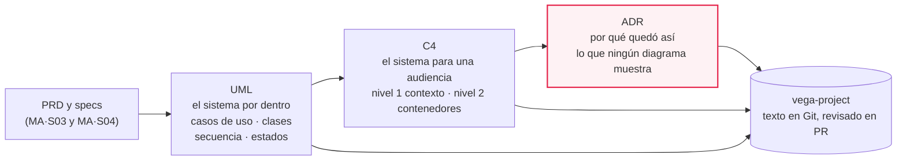
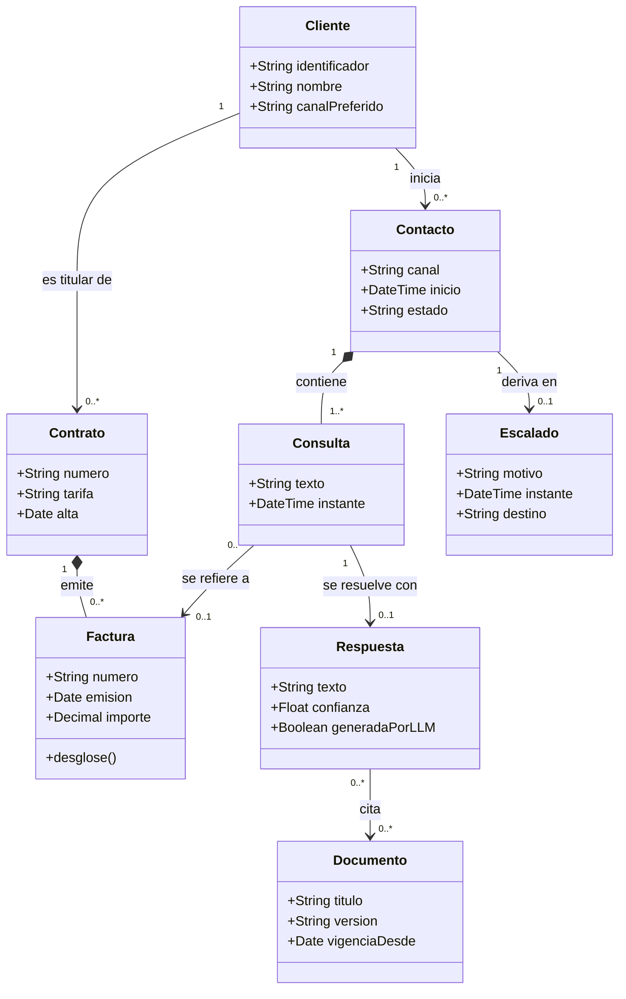
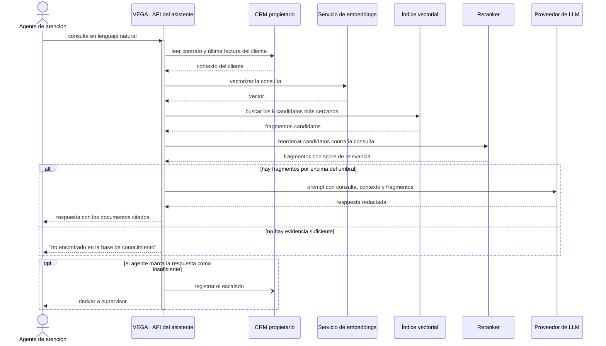
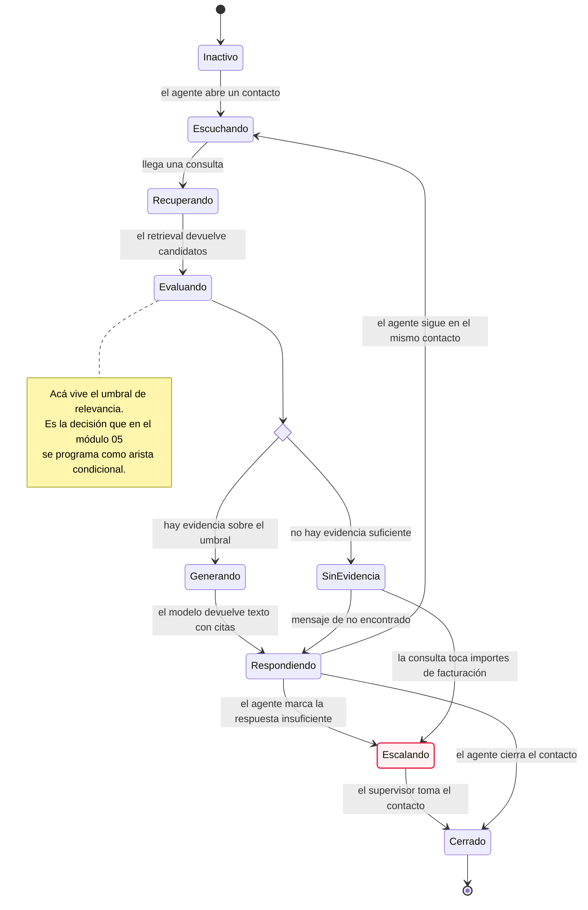
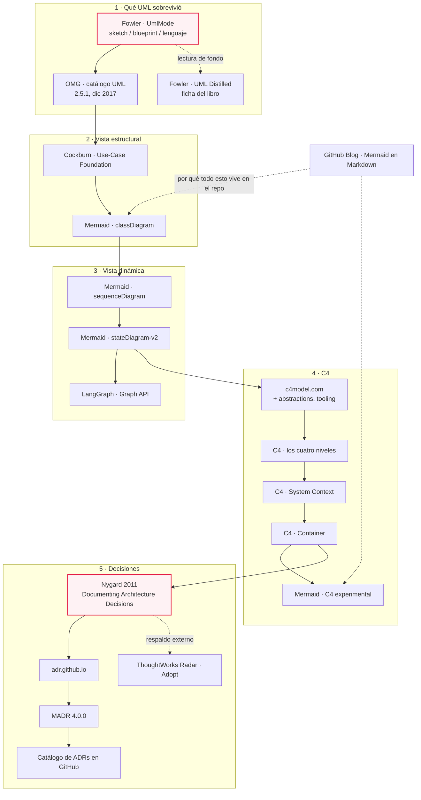
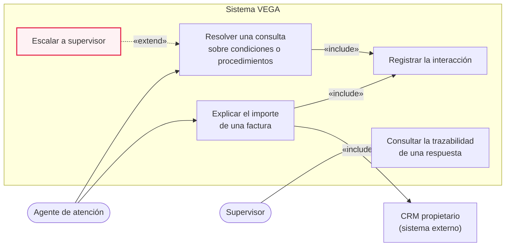
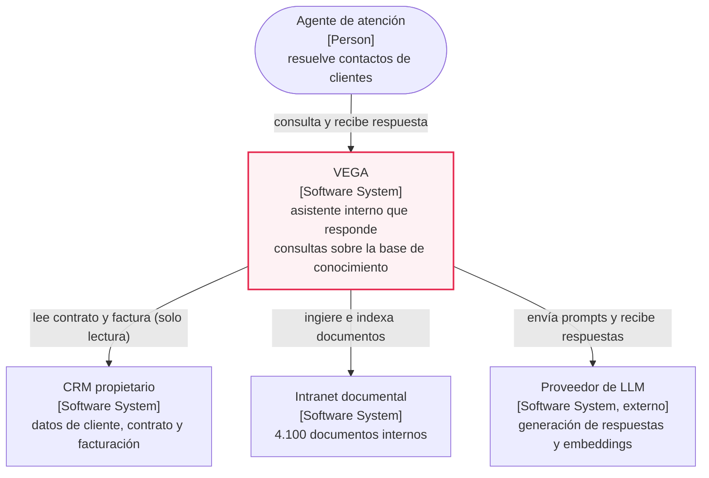
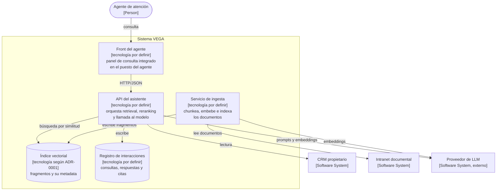

# MA·S05 — Modelado: UML estructural y dinámico, C4 y ADRs

**Módulo:** A — Ingeniería de Software para AI Engineers *(módulo extra, transversal; se dicta entre el módulo 06 y el 07)*
**Sesión:** 05 de 07 · Parte 2 — Modelar, decidir y gestionar
**Fecha:** [Completar por el profesor: fecha]
**Caso hilo conductor:** Proyecto VEGA — Nortia Energía
**Entregables:** `docs/05-diagrams/`, `docs/06-adr/` y `docs/07-c4/` en el repositorio `vega-project`

> Esta es una clase sobre diagramas cuyo material está escrito **en Mermaid, dentro de un repositorio Git**. No es una casualidad ni una coquetería: es el argumento de la sesión ejecutándose delante tuyo. Todo diagrama que tenga que sobrevivir al proyecto se escribe como texto, entra en un commit y se discute en un pull request. Si te encontrás copiando un `.png` a una carpeta compartida, algo salió mal.

**Duración estimada**

| Bloque | Tiempo |
|---|---|
| Clase presencial | 180 min |
| Lectura de los recursos imprescindibles | ~2 h |
| Lectura de los recursos recomendados | ~1 h 05 min |
| Recursos opcionales | ~30 min + el libro |
| Trabajo fuera de clase (cerrar el paquete de diagramas, ADR-0003, PR) | ~2 h 30 min |
| **Total de estudio fuera de clase** | **≈ 5 h 30 min – 6 h** |

**Reparto propuesto de los 180 minutos de clase**

| Tramo | Minutos | Contenido |
|---|---|---|
| Encuadre + qué sobrevivió de UML | 15 | Sección 4.1 |
| Vista estructural: casos de uso + clases + dominio | 25 | Secciones 4.2 a 4.4 |
| Vista dinámica: secuencia + estados + puente a LangGraph | 20 | Secciones 4.5 y 4.6 |
| C4 | 15 | Sección 4.8 |
| ADRs | 15 | Sección 4.9 |
| **Lab** | **100** | Sección 5 — 35 min en parejas paralelas · 15 de puesta en común · 35 de C4 y ADRs en conjunto · 15 de commit y revisión cruzada |
| Cierre: checklist de coherencia contra el PRD | 10 | Sección 5, paso 7 |

> 📝 **Nota para el profesor:** el plan del módulo fija el lab en ~100 minutos pero no la fecha ni el reparto del resto; lo de arriba es una propuesta funcional. El tramo que no conviene comprimir es la puesta en común de 15 minutos: es donde las dos parejas descubren que dibujaron dos sistemas distintos, y esa fricción es la clase.

**Artefacto:** [La sesión en versión web](https://claude.ai/code/artifact/996edf3c-b4e3-405d-8b6f-69de7def2d01) — el apunte completo como página navegable.

---

## 1. Objetivos de aprendizaje

Al terminar esta sesión vas a poder:

1. **Explicar** qué es UML, en qué modo se usa hoy en la industria y qué diagramas siguen vivos, y **elegir** el diagrama adecuado para una pregunta concreta en vez de dibujar por costumbre.
2. **Dibujar** un diagrama de casos de uso con actores, límite del sistema y relaciones `include`/`extend` correctamente aplicadas, y **usarlo** para negociar alcance con alguien que no es técnico.
3. **Construir** el diagrama de clases del dominio de VEGA a partir del PRD, con los cinco tipos de relación y las multiplicidades, y **reconocer** los sistemas donde el diagrama de clases no aporta nada.
4. **Modelar** la vista dinámica en Mermaid: el flujo completo de un RAG como `sequenceDiagram` con fragmentos `alt` y `opt`, y el asistente como `stateDiagram-v2`, **explicando** su correspondencia con el grafo de LangGraph del módulo 05.
5. **Comunicar** la arquitectura con C4 niveles 1 y 2, eligiendo el nivel según la audiencia y sin confundir *container* con contenedor Docker.
6. **Escribir** un ADR completo —contexto, alternativas consideradas, decisión, consecuencias— decidir **qué merece** un ADR y cuál no, y gestionar el ciclo `proposed → accepted → superseded`.
7. **Versionar** todo el paquete —diagramas, C4 y ADRs— como texto en Git y **revisarlo en un pull request**, en vez de exportar imágenes.

---

## 2. Resumen ejecutivo

En **MA·S03** escribiste el PRD de VEGA con requisitos, NFR y criterios de aceptación en Given-When-Then. En **MA·S04** convertiste dos de esas historias en specs ejecutables y escribiste el `CLAUDE.md` del repositorio, donde varias decisiones quedaron anotadas como `TODO`. Hoy se cobran esos `TODO`.

La sesión enseña a **modelar un sistema de IA en diagramas que sirvan para decidir, no para decorar**, y a dejar por escrito por qué el sistema quedó como quedó. El hilo es una escalera de abstracción con tres peldaños. **UML** modela el sistema *por dentro*: de qué está hecho (clases), qué hace y para quién (casos de uso), cómo ocurre (secuencia) y en qué situación está (estados). **C4** modela el sistema *para una audiencia*: qué nivel de zoom lee Marta y cuál lee Diego. Y el **ADR** registra lo que ningún diagrama muestra: por qué esa base vectorial y no otra, y qué pasa si dentro de un año alguien quiere cambiarla.

Los tres artefactos comparten la misma disciplina operativa: son texto, viven en Git, se revisan en un PR y se versionan junto al código. Por eso el entregable no son imágenes sino tres directorios de Markdown.

Para el rol de AI Engineer esto no es burocracia. Un pipeline de RAG y un agente conversacional son exactamente los dos sistemas que peor se explican hablando: el primero es una secuencia de siete pasos con dos ramas, y el segundo es una máquina de estados. Dibujarlos bien es la diferencia entre discutir la arquitectura y discutir malentendidos. Y la máquina de estados que dibujes hoy es, casi línea por línea, el grafo que vas a programar en el módulo 05.

### La escalera de abstracción de la sesión



---

## 3. Conceptos clave / glosario

### UML y notación

| Término | Definición |
|---|---|
| **UML** (Unified Modeling Language) | Lenguaje gráfico estandarizado por la OMG para visualizar, especificar, construir y documentar los artefactos de un sistema de software. Su versión vigente según el catálogo de especificaciones de la OMG es **2.5.1, de diciembre de 2017**. |
| **UML as sketch** | Uso informal de UML: se dibuja lo mínimo para comunicar una idea, priorizando la comunicación por encima de la precisión y la completitud. Es el modo que sobrevivió y el que se enseña acá. |
| **UML as blueprint** | Uso formal: el diagrama como especificación detallada y completa a partir de la cual se implementa. Analogía: el plano de obra frente al boceto en una servilleta. |
| **UML as programming language** | Uso extremo: el diagrama como especificación ejecutable que se transforma automáticamente en código. |
| **Diagrama de estructura** | Familia de diagramas UML que describe de qué está hecho el sistema y cómo se relacionan sus partes, sin hablar del tiempo (clases, objetos, componentes, despliegue, paquetes…). |
| **Diagrama de comportamiento** | Familia de diagramas UML que describe qué hace el sistema a lo largo del tiempo (casos de uso, secuencia, estados, actividad…). |

### Vista estructural

| Término | Definición |
|---|---|
| **Actor** | Rol externo que interactúa con el sistema para obtener algo de él. Es un rol, no una persona: "agente de atención" es un actor, "Iván Ferreras" no. Un sistema externo también puede ser actor. |
| **Caso de uso** | Un objetivo completo que un actor consigue con ayuda del sistema, con valor observable para él. "Explicar el importe de una factura al cliente" es un caso de uso; "validar el token" no. |
| **Escenario** | Un camino concreto a través de un caso de uso: la secuencia de pasos de una ejecución particular, sea la exitosa o una de las alternativas. |
| **Límite del sistema** | La caja que separa lo que el sistema hace de lo que hacen los actores. Dibujarla es la mitad del valor del diagrama, porque muestra qué queda fuera. |
| **`include`** | Relación entre casos de uso: el caso base **siempre** ejecuta el incluido. Se usa para factorizar comportamiento obligatorio y repetido. |
| **`extend`** | Relación entre casos de uso: el caso extensor **puede** ejecutarse, en un punto de extensión concreto del caso base y bajo una condición. Comportamiento opcional. |
| **Clase** | Plantilla de un tipo de objeto del dominio: un nombre, sus atributos y sus operaciones. En un modelo de dominio representa un concepto del negocio, no necesariamente una clase de Python. |
| **Visibilidad** | Quién puede ver un miembro de una clase: público (`+`), privado (`-`), protegido (`#`) o de paquete/interno (`~`). |
| **Asociación** | Relación estructural entre dos clases que se conocen y colaboran, sin implicar propiedad. Analogía: un cliente y su comercial. |
| **Agregación** | Asociación con matiz de "parte de", pero donde la parte sobrevive al todo. Un documento pertenece a una categoría, y si la categoría desaparece el documento sigue existiendo. |
| **Composición** | Asociación de "parte de" fuerte: la parte no existe fuera del todo y muere con él. Una línea de factura no existe sin su factura. |
| **Herencia (generalización)** | "Es un tipo de". La subclase hereda estructura y comportamiento de la superclase. |
| **Dependencia** | Relación débil y transitoria: una clase usa a otra (como parámetro, retorno o variable local) pero no la guarda. Si la usada cambia, la que depende puede romperse. |
| **Realización** | Una clase implementa un contrato definido por una interfaz. |
| **Multiplicidad** | Cuántas instancias de una clase participan en el extremo de una relación: `1`, `0..1`, `1..*`, `*`, `0..n`, `1..n`. |
| **Modelo de dominio** | Diagrama de clases que representa los conceptos del negocio y sus relaciones, sin decisiones de implementación. Es el vocabulario compartido del proyecto. |

### Vista dinámica

| Término | Definición |
|---|---|
| **Línea de vida** | La columna vertical que representa a un participante en un diagrama de secuencia a lo largo del tiempo. El tiempo baja. |
| **Activación** | El rectángulo sobre una línea de vida que indica que ese participante está ejecutando algo en ese tramo. |
| **Mensaje síncrono** | Llamada en la que el emisor se queda esperando la respuesta antes de seguir. |
| **Mensaje asíncrono** | Envío en el que el emisor sigue trabajando sin esperar respuesta. Es la diferencia entre llamar por teléfono y mandar un mensaje. |
| **Fragmento combinado** | Caja que envuelve un tramo del diagrama de secuencia y le da semántica de control: `alt` (ramas excluyentes), `opt` (ocurre o no), `loop` (se repite), `par` (en paralelo). |
| **Estado** | Situación en la que un sistema espera un evento y en la que se comporta de una forma determinada. |
| **Transición** | El paso de un estado a otro, disparado por un evento y posiblemente condicionado por una guarda. |
| **Estado compuesto** | Estado que contiene dentro su propia máquina de estados. Sirve para agrupar y no ahogar el diagrama. |
| **`choice`** | Pseudo-estado de decisión: el flujo se bifurca según una condición evaluada al pasar por ahí. |
| **Máquina de estados** | Modelo de un sistema como un conjunto finito de estados, los eventos que provocan cambios y las transiciones permitidas. Lo que **no** está dibujado, no puede pasar. |

### Herramientas, arquitectura y decisiones

| Término | Definición |
|---|---|
| **Mermaid** | Notación de texto que se renderiza como diagrama. Sus tipos relevantes acá: `classDiagram`, `sequenceDiagram`, `stateDiagram-v2`. Como es texto, se versiona y se diffea. (El criterio Excalidraw / Mermaid / draw.io se fijó en MA·S02.) |
| **Diagrams-as-code** | Práctica de escribir los diagramas como código fuente versionado en lugar de dibujarlos en una herramienta y exportar imágenes. |
| **C4** | Modelo de Simon Brown para visualizar arquitectura de software mediante cuatro niveles de zoom. Es **"notation independent"** y **"tooling independent"**: define abstracciones, no una notación. |
| **System Context (nivel 1)** | Diagrama que muestra un único sistema, las personas que lo usan y los sistemas externos con los que se comunica. Sin detalle técnico. |
| **Container (nivel 2)** | En C4, **"a container is an application or a data store"** — una unidad desplegable y ejecutable por separado. **No** significa contenedor Docker. |
| **Component (nivel 3)** | Los bloques internos de un contenedor y sus responsabilidades. |
| **Code (nivel 4)** | El detalle de implementación de un componente: clases, interfaces, funciones. |
| **Modelado vs. diagramado** | Modelar es mantener un modelo del que salen varias vistas; diagramar es dibujar cada vista a mano. C4 distingue las dos familias de herramientas. |
| **ADR** (Architecture Decision Record) | Documento corto que registra una decisión de arquitectura junto con su contexto y sus consecuencias. Analogía: el acta notarial de una decisión técnica. |
| **Decision log** | El conjunto de todos los ADR de un proyecto, en orden y numerados: la historia de por qué el sistema es como es. |
| **Requisito *architecturally significant*** | Aquel con efecto medible sobre la arquitectura y la calidad del sistema. Es el criterio que separa lo que merece un ADR de lo que no. |
| **MADR** | *Markdown Architectural Decision Records*, la plantilla de ADR más usada hoy. Añade como secciones de primera clase las **alternativas consideradas** y los **decision drivers**. |
| **Decision driver** | Fuerza concreta que empuja la decisión en una dirección: un NFR, una restricción legal, un límite de presupuesto, una política de la organización. |
| **`superseded`** | Estado de un ADR que fue reemplazado por otro posterior. El ADR viejo no se borra ni se edita: se marca. |
| **Y-statement** | Formato compacto de decisión arquitectónica de una sola frase, procedente del linaje académico del ADR. |
| **LangGraph** | Framework que modela un flujo agéntico como un grafo con **State** (estado compartido), **nodes** (funciones que actualizan el estado) y **edges**, incluidas **aristas condicionales** que eligen el siguiente nodo según el estado. Se construye con `StateGraph` y se compila con `.compile()`. Se ve a fondo en el módulo 05. |

> 💡 Términos que ya conocés y acá se dan por sabidos: chunking, embeddings, índice vectorial y reranking (M03·S01); NFR, PRD, user story y Given-When-Then (MA·S03); spec ejecutable y `CLAUDE.md` (MA·S04); Git, commit y pull request (módulo 01).

---

## 4. Notas de estudio

### 4.1 Qué es UML y qué sobrevivió de él

UML es un lenguaje gráfico estandarizado para describir sistemas de software: un conjunto de tipos de diagrama con una notación acordada, de modo que una flecha con rombo relleno signifique lo mismo en Madrid y en Bangalore. Lo mantiene la OMG, y su catálogo de especificaciones muestra dos datos que conviene leer juntos: la versión **1.1 aparece fechada en diciembre de 1997**, y la vigente es la **2.5.1, de diciembre de 2017**. Es decir: el lenguaje lleva años sin moverse. Eso no lo invalida —un estándar que no cambia es un estándar estable—, pero explica por qué lo que se usa hoy es un subconjunto pequeño y por qué nadie está esperando la próxima versión.

**La taxonomía.** UML organiza sus diagramas en dos familias:

*Diagramas de estructura* — describen de qué está hecho el sistema, congelado en el tiempo:
clases · objetos · componentes · estructura compuesta · despliegue · paquetes · perfiles.

*Diagramas de comportamiento* — describen qué hace el sistema a lo largo del tiempo:
casos de uso · actividad · máquina de estados · secuencia · comunicación · visión general de interacción · temporización.

Catorce tipos en esta enumeración. En la industria sobreviven **cuatro**: clases, secuencia, estados y casos de uso. El resto es arqueología: el de comunicación dice lo mismo que el de secuencia y se lee peor; el de temporización solo aparece en sistemas de tiempo real; el de perfiles sirve para extender el propio metamodelo de UML, algo que hace muchísima menos gente de la que cree; el de estructura compuesta y el de visión general de interacción casi no se ven fuera de los libros. El de actividad y el de componentes tienen usos legítimos, pero en un proyecto de IA los cubren mejor un diagrama de secuencia y un C4 nivel 2 respectivamente — por eso este bloque los deja fuera explícitamente.

**Los tres modos de uso.** Martin Fowler, en *UmlMode* (2003), distingue tres formas de usar UML:

| Modo | Qué es | Qué prioriza |
|---|---|---|
| **Sketch** | Un boceto informal, parcial, para comunicar una idea en una pizarra o en un README | Comunicar rápido, por encima de la precisión y la completitud |
| **Blueprint** | Una especificación detallada y formal a partir de la cual se implementa | Precisión y completitud |
| **Programming language** | El diagrama como especificación ejecutable que se transforma en código | Automatización total |

Fowler observaba ya entonces que los cambios de UML 2 hacia mayor precisión favorecían a los dos últimos modos y engordaban el estándar, lo que lo volvía menos atractivo justo para quien lo usa como boceto. Veintitantos años después, el veredicto es claro: **lo que sobrevivió es el modo sketch**. Y de ahí sale el criterio de esta sesión: la notación fina no se recita, se consulta en un cheatsheet mientras se dibuja (sección 4.10). Nadie te va a pedir en una entrevista que recuerdes si el rombo relleno es agregación o composición; te van a pedir que expliques tu arquitectura en cinco minutos.

> ⚠️ El error de encuadre más caro de la sesión es intentar dibujar en modo *blueprint*. Si tu diagrama de clases tiene los cuarenta métodos de cada clase con sus tipos de retorno, no lo va a leer nadie —ni vos dentro de tres semanas— y va a quedar desactualizado en el primer sprint. Un diagrama en modo sketch cabe en una pantalla.

> 💡 **Para profundizar:** [UmlMode — Martin Fowler](https://martinfowler.com/bliki/UmlMode.html) (8 min) y el catálogo de la especificación en [omg.org/spec/UML](https://www.omg.org/spec/UML/) (consulta rápida). La lectura asignada del bloque es *UML Distilled*, 3.ª edición, Addison-Wesley, 2003 — [ficha del libro en el sitio del autor](https://martinfowler.com/books/uml.html). Es un libro fino, de los que se leen en un par de tardes, porque Fowler apuntó deliberadamente a la fracción de UML que era más útil.

---

### 4.2 Diagrama de casos de uso

Un caso de uso es **un objetivo completo que un actor consigue con ayuda del sistema**. La palabra que hace todo el trabajo es "completo": después de ejecutarlo, el actor puede irse a tomar un café satisfecho. "Consultar cómo se calcula el término de potencia de una factura" lo es. "Validar el token de sesión" no lo es: nadie se va a tomar un café por haber validado un token.

**Los tres niveles de alcance.** Un caso de uso se puede escribir a tres alturas distintas, y mezclarlas en un mismo diagrama es lo que produce esos diagramas ilegibles con cuarenta óvalos:

- **Resumen** — abarca varios objetivos de usuario y suele cubrir horas, días o el ciclo de vida completo de algo. *"Gestionar el ciclo de vida de un contacto de atención."*
- **Objetivo de usuario** — el nivel útil, el del café. Una sesión de trabajo, minutos. *"Resolver una consulta sobre el importe de una factura."*
- **Subfunción** — pasos que existen solo porque otro caso los necesita. *"Localizar el contrato del cliente."*

Un buen diagrama se dibuja **al nivel de objetivo de usuario** y deja las subfunciones para dentro del texto de cada caso.

**`include` y `extend`.** Son las dos relaciones entre casos de uso, y casi todos los diagramas que vas a ver en tu vida las usan mal. La regla operativa es corta:

- **`include`** = comportamiento **obligatorio** que se factoriza porque lo comparten varios casos. El caso base siempre lo ejecuta. Se lee: *"Resolver una consulta **incluye** Registrar la interacción"*.
- **`extend`** = comportamiento **opcional** que se dispara en un **punto de extensión** del caso base, bajo una condición. El caso base no sabe que existe. Se lee: *"Escalar a supervisor **extiende** Resolver una consulta, cuando el agente marca la respuesta como insuficiente"*.

La flecha apunta en direcciones contrarias, y ahí está el error habitual: en `include` va del **base al incluido** (el base lo necesita); en `extend` va del **extensor al base** (el extensor sabe a quién se engancha). Si te trabás, aplicá el test: *¿puede el caso base terminar bien sin esto?* Si no puede, es `include`. Si puede, es `extend`.

**El valor real del diagrama.** El diagrama de casos de uso es apenas el índice: el contenido de verdad está en el **caso de uso escrito** —el paso a paso del escenario principal y de las alternativas—. Entonces, ¿para qué sirve el dibujo? Para **negociar alcance con alguien que no es técnico**. Ponés la caja del sistema en el medio, los actores fuera, y señalás con el dedo: *"esto entra en la primera versión, esto no"*. Marta Sedano no va a leer tu PRD de doce páginas, pero sí va a mirar un óvalo que está fuera de la caja y decir "¿cómo que eso no está?". Esa conversación, provocada a propósito y temprano, vale la media hora que cuesta dibujarlo.

> ⚠️ **Mermaid no tiene un tipo de diagrama de casos de uso.** No inventes `useCaseDiagram`: rompe el render y te deja un cartel de error rojo en medio del entregable. Las dos salidas: dibujarlo en Excalidraw (MA·S02), o aproximarlo con un `flowchart LR` donde los actores son nodos a la izquierda, los casos de uso van dentro de un `subgraph` que hace de límite del sistema, y las relaciones se etiquetan a mano con `A -->|"«include»"| B`. En la sección 5, paso 1, tenés el archivo resuelto.

> 💡 **Para profundizar:** *Use-Case Foundation*, documento sobre fundamentos de casos de uso alojado en el sitio de Alistair Cockburn ([PDF](https://alistaircockburn.com/Use%20Case%20Foundation.pdf), 25 min). Para el formato del caso de uso escrito, la referencia clásica es Alistair Cockburn, *Writing Effective Use Cases*.

---

### 4.3 Diagrama de clases

Una clase se dibuja como una caja de tres compartimentos: nombre, atributos y operaciones. En un **modelo de dominio** —que es lo que vas a hacer en el lab— el tercer compartimento suele ir casi vacío, y está bien: lo que interesa son los conceptos del negocio y cómo se conectan, no la API de cada objeto.

**Visibilidad.** Cuatro marcadores delante del miembro: `+` público, `-` privado, `#` protegido, `~` de paquete o interno. En un modelo de dominio se pone todo público y no se piensa más en eso.

**Los cinco tipos de relación.** Esto sí hay que entenderlo, porque cada uno afirma algo distinto sobre el sistema:

| Relación | Qué afirma | Test para distinguirla | Token Mermaid |
|---|---|---|---|
| **Asociación** | A y B se conocen y colaboran | "A tiene/usa un B, y ninguno es parte del otro" | `-->` |
| **Agregación** | B es *parte de* A, pero sobrevive sin A | "Si borro A, ¿B sigue teniendo sentido?" → sí | `o--` |
| **Composición** | B es *parte de* A y muere con A | "Si borro A, ¿B sigue teniendo sentido?" → no | `*--` |
| **Herencia** | B **es un tipo de** A | "¿Puedo usar un B en cualquier lugar donde espero un A?" | `<\|--` |
| **Dependencia** | A usa a B de paso, sin guardarlo | "¿B aparece solo como parámetro, retorno o variable local?" | `..>` |

(Hay una sexta, la **realización**, `..|>`, para "A implementa la interfaz B". Aparece poco en un modelo de dominio.)

Sobre la eterna discusión **agregación vs. composición**: el criterio formal es el **ciclo de vida**. En composición, la parte no existe fuera del todo y se destruye con él; en agregación, no. Una línea de factura es composición de la factura. Un documento de la intranet asociado a una categoría es agregación: si borrás la categoría, el documento sigue ahí.

Dicho eso, seamos honestos: **casi nadie distingue bien esas dos en la práctica, y casi nunca importa**. Si dudás entre rombo hueco y rombo relleno durante más de diez segundos, poné asociación simple y seguí. Lo que sí cambia decisiones es la **multiplicidad**, porque una multiplicidad `1` donde debería haber `0..*` es un bug de diseño que te vas a comer en producción.

**Multiplicidad.** Va en cada extremo de la relación y responde "cuántos": `1` exactamente uno, `0..1` opcional, `1..*` uno o más, `*` cero o más, `0..n` / `1..n` variantes. En Mermaid se escribe **entre comillas**, con el patrón `ClaseA "1" --> "0..*" ClaseB : etiqueta`.

> ⚠️ Gotcha de Mermaid: si te olvidás las comillas de la multiplicidad, el bloque rompe. Y si escribís la flecha de herencia como `<--|` en vez de `<|--`, también. El cheatsheet de la sección 4.10 existe justamente para eso.

> 💡 **Para profundizar:** [Mermaid — Class diagrams](https://mermaid.js.org/syntax/classDiagram.html) (15 min + práctica). Es la tabla oficial de "esta relación se escribe así".

---

### 4.4 Del dominio al diagrama: cómo se extraen las entidades de un PRD

No hay magia acá, hay procedimiento. Y se hace **sobre el PRD que ya escribiste en MA·S03**, no sobre la intuición.

**Paso 1 — Subrayar los sustantivos.** Leé el PRD y las user stories subrayando cada sustantivo del dominio. Vas a terminar con treinta o cuarenta candidatos.

**Paso 2 — Descartar tres cosas.**
- **Sinónimos.** "Consulta", "pregunta" y "petición" son la misma entidad. Elegí un nombre y ponelo en el glosario del proyecto: el modelo de dominio *es* el vocabulario compartido.
- **Atributos disfrazados de entidad.** "Canal", "importe", "fecha de emisión" no son entidades: son campos de otra. El test: *¿tiene identidad propia? ¿Me importa distinguir este de aquel?* El canal de un contacto no tiene identidad propia; la factura sí.
- **Conceptos de la interfaz o de la implementación.** "Pantalla de búsqueda", "endpoint", "tabla" no van en un modelo de dominio.

**Paso 3 — Los verbos son las asociaciones.** "Un cliente **tiene** varios contratos", "un contacto **genera** consultas", "una respuesta **cita** documentos". Cada verbo que conecta dos sustantivos supervivientes es una línea del diagrama, y la etiqueta de la línea es el verbo.

**Paso 4 — Las multiplicidades salen de las frases del PRD.** "Un agente puede escalar el contacto a un supervisor" → `Contacto "1" --> "0..1" Escalado`. Cuando el PRD no lo dice, anotalo: **cada multiplicidad que tuviste que inventar es un requisito implícito que nadie te aclaró**, y eso es material para la próxima conversación con el stakeholder. Es exactamente la técnica de detección de supuestos no declarados de MA·S03, aplicada a un dibujo.

**Aplicado a VEGA.** Las ocho entidades del dominio son: **Contacto, Cliente, Contrato, Factura, Documento, Consulta, Respuesta y Escalado**.



Fijate en tres decisiones que el diagrama **afirma** y que conviene discutir con el equipo, porque no son obvias:

1. `Contacto *-- Consulta` es **composición**: una consulta no existe fuera del contacto que la originó.
2. `Consulta --> "0..1" Respuesta` admite el cero: hay consultas que se quedan sin respuesta. Eso es el NFR de "tasa de respuestas no encontradas" hecho estructura.
3. `Respuesta --> "0..*" Documento` con la etiqueta *cita* es la trazabilidad que pide Cristina Roa, la DPO, dibujada. Si esa línea no estuviera, el sistema no podría justificar de dónde salió una respuesta.

**Cuándo el diagrama de clases estorba.** No siempre es la herramienta correcta, y forzarlo produce un diagrama bonito que no informa ninguna decisión. El criterio: **el diagrama de clases sirve cuando el valor del sistema está en la estructura de los objetos; no sirve cuando está en el flujo de los datos.** Un pipeline de RAG, un ETL o un job de reindexado no tienen "estructura de objetos" interesante: tienen siete pasos encadenados con dos ramas. Si intentás modelar la ingesta de los 4.100 documentos como clases, vas a terminar con `Ingestor`, `Chunker`, `Embedder` y `Indexer` —cuatro cajas con un método cada una— que no dicen absolutamente nada que la frase "se ingiere, se chunkea, se embebe y se indexa" no diga mejor. Ahí el diagrama útil es el de **secuencia** o un **flowchart**.

Regla práctica: si tus clases terminan siendo todas verbos sustantivados y todas tienen un solo método, estás modelando un flujo. Cambiá de diagrama.

---

### 4.5 Diagrama de secuencia: el flujo de un RAG

El diagrama de secuencia responde una pregunta muy concreta: **quién le habla a quién, en qué orden, y qué pasa cuando algo no está.** Los participantes son columnas (las **líneas de vida**), el tiempo baja, y cada flecha horizontal es un mensaje.

Las piezas:

- **`participant`** dibuja una caja; **`actor`** dibuja un monigote. Usá `actor` para los humanos.
- **Mensaje síncrono** (`->>`): el emisor espera. **Respuesta** (`-->>`, punteada): el retorno. **Mensaje asíncrono** (`-)`): el emisor sigue sin esperar — se usa para un evento publicado, un job encolado, un log enviado.
- **Activación**: el rectángulo que muestra "este participante está trabajando ahora". Se marca con `activate`/`deactivate` o con los sufijos `+`/`-` en la flecha.
- **Fragmentos**: `alt … else … end` para ramas excluyentes, `opt … end` para lo que puede no ocurrir, `loop … end` para repetición, `par … and … end` para paralelismo.

El ejercicio central de la vista dinámica es dibujar **el flujo completo de una consulta de VEGA**, que es un RAG con las piezas que ya conocés de M03·S01: recuperación, reranking y llamada al modelo.



Tres cosas que este diagrama hace y una conversación no:

1. **Muestra el número de saltos de red.** Contá las flechas: cada una es latencia. El NFR de latencia p95 de MA·S03 deja de ser un número abstracto y pasa a ser un presupuesto que hay que repartir entre siete llamadas.
2. **Hace visible la rama triste.** El `alt` de "no hay evidencia suficiente" es el criterio de aceptación de la historia "respuesta no encontrada en la KB" que especificaste en MA·S04. Si el diagrama no tiene rama triste, la spec tampoco la tenía.
3. **Marca qué es asíncrono.** El registro del escalado va con `-)` porque el agente no tiene por qué esperar a que el CRM confirme. Esa decisión, dibujada, es discutible; hablada, se pierde.

> ⚠️ Gotchas típicos: (a) meter en el mismo diagrama el camino feliz y cinco excepciones — hacé un diagrama por escenario relevante; (b) confundir "quién llama" con "quién decide" — el umbral de relevancia lo evalúa la API, no el índice; (c) olvidar el `deactivate` y que el rectángulo de activación se coma medio dibujo.

> 💡 **Para profundizar:** [Mermaid — Sequence diagrams](https://mermaid.js.org/syntax/sequenceDiagram.html) (15 min + práctica).

---

### 4.6 Diagrama de estados: el agente es una máquina de estados

Esta es la tesis de la vista dinámica y el visual más importante de la sesión: **un agente conversacional es una máquina de estados.** No "se parece a": *es*. Tiene un conjunto finito de situaciones en las que puede estar, eventos que provocan cambios, y transiciones permitidas. Y —esto es lo que lo vuelve una herramienta de diseño y no de documentación— **lo que no está dibujado no puede pasar**. Cada transición que no dibujaste es un camino que el sistema no tiene que soportar; cada estado sin salida es un cuelgue.

Las piezas de `stateDiagram-v2`: `[*]` es el inicio o el final según la dirección de la flecha; `A --> B: evento` es una transición etiquetada; `state Id { … }` agrupa una submáquina dentro de un estado compuesto; `state Cond <<choice>>` es un punto de decisión.

VEGA, modelado como máquina de estados:



Mirá el estado resaltado: **`Escalando` se alcanza por dos caminos distintos**. Uno es que el agente diga "esto no me sirve"; el otro es una regla dura de negocio —si la consulta toca importes de facturación, no se responde de forma autónoma—. Ese segundo camino es un NFR de MA·S03 convertido en transición. Nadie lo hubiera visto en una lista de requisitos; en el diagrama salta.

**El puente al módulo 05.** LangGraph modela un flujo agéntico con tres componentes: un **State** —una estructura de datos compartida, declarada con un esquema tipo `TypedDict` o Pydantic, que representa el snapshot actual de la aplicación—, **nodes** —funciones que reciben el estado y devuelven una actualización parcial— y **edges**, que pueden ser fijas o **condicionales**, decidiendo qué nodo se ejecuta después en función del estado. El grafo se construye con `StateGraph` y se compila con `.compile()`.

La lectura de este bloque —y conviene que sepas que es *nuestra* lectura, no una cita— es que hay una correspondencia casi uno a uno:

| En tu diagrama de estados | En el grafo que vas a programar en M05 |
|---|---|
| Estado (`Recuperando`, `Generando`) | Nodo del grafo |
| Transición | Edge |
| `<<choice>>` con su condición | Conditional edge |
| Lo que el sistema "sabe" al llegar a un estado | El `State` compartido |

Por eso el diagrama que dibujás hoy no es documentación: es el diseño del grafo. Cuando en el módulo 05 abras `StateGraph`, vas a estar transcribiendo este dibujo.

> ⚠️ Dos gotchas. Uno de notación: `stateDiagram-v2` **no permite transiciones entre estados internos de dos estados compuestos distintos**; si la necesitás, la transición va entre los compuestos. Y uno conceptual: la documentación oficial de LangGraph no se describe a sí misma como una máquina de estados —habla de grafos, estado compartido y paso de mensajes—. La equivalencia de la tabla de arriba es una forma de entenderlo, útil y defendible, pero no la cites como si la dijera LangChain.

> 💡 **Para profundizar:** [Mermaid — State diagrams](https://mermaid.js.org/syntax/stateDiagram.html) (12 min). Y, **después** de haber dibujado tu máquina de estados y no antes, cinco minutos de [LangGraph — Graph API](https://docs.langchain.com/oss/python/langgraph/graph-api) para ver la correspondencia. Si la abrís antes, esto se convierte en una clase de LangGraph.

---

### 4.7 Mermaid en el repo: el diagrama como texto

Acá está el motivo por el que toda la sesión usa Mermaid y no una herramienta de dibujo. **GitHub renderiza Mermaid embebido en Markdown** desde el anuncio de *Include diagrams in your Markdown files with Mermaid* (14 de febrero de 2022): cuando encuentra un bloque de código marcado como `mermaid`, genera un iframe que le pasa la sintaxis cruda a Mermaid.js y la convierte en un diagrama en el navegador del lector, en lugar de servir una imagen estática.

La consecuencia práctica es toda la gracia:

- El diagrama **entra en el commit** junto al código que describe.
- El diagrama **aparece en el diff de un PR** como líneas de texto: se ve exactamente qué cambió, y se puede comentar línea por línea. Un `.png` exportado aparece como "imagen modificada" y no se puede revisar.
- Un LLM lo **genera y lo modifica**, porque es texto. Pedirle a un agente "agregá el estado de escalado por importe de facturación" funciona; pedirle que edite un PNG, no.
- El diagrama **envejece con el código**, porque está en el mismo repositorio y en la misma revisión.

Eso es la **regla del bloque**, fijada en MA·S02: si un diagrama tiene que **sobrevivir al proyecto**, es Mermaid. Si tiene que sobrevivir a **la reunión**, es Excalidraw. Si tiene que ir en un **PDF con logo**, es draw.io.

Y sí: este mismo documento de estudio es un `.md` con bloques Mermaid en un repositorio Git. La clase practica lo que enseña.

> 💡 **Para profundizar:** [Include diagrams in your Markdown files with Mermaid — GitHub Blog](https://github.blog/developer-skills/github/include-diagrams-markdown-files-mermaid/) (6 min).

---

### 4.8 C4: el sistema para una audiencia

**Por qué UML no alcanza para comunicar arquitectura.** Los diagramas UML son buenos describiendo el sistema *por dentro*, y ese es justamente su problema cuando la audiencia está *afuera*. Tres fallas concretas:

1. **Nivel de abstracción equivocado.** UML no tiene un concepto para "esta pieza es una aplicación desplegable" ni para "esto es una base de datos". Tiene clases, componentes y nodos de despliegue, que son o demasiado finos o demasiado infraestructurales. Falta el nivel intermedio, que es exactamente donde ocurren las conversaciones de arquitectura.
2. **Demasiado detalle.** Un diagrama de clases correcto es ilegible para quien no programa, y un diagrama de componentes correcto es ilegible para quien no conoce el sistema.
3. **Audiencia equivocada.** UML asume que el lector sabe leer UML. Marta Sedano, directora de Operaciones, no sabe ni tiene por qué. Y si le mostrás un diagrama que no entiende, no va a decir "no lo entiendo": va a asentir, y vas a perder la única oportunidad de que corrija tu suposición.

**Qué propone C4.** Simon Brown, autor del modelo, lo define en c4model.com como *"an easy to learn, developer friendly approach to software architecture diagramming"*, y lo declara explícitamente **"notation independent"** y **"tooling independent"**. Eso es lo primero que hay que entender: **C4 no es una notación, es una jerarquía de abstracciones**. No compite con UML ni lo reemplaza; podés dibujar C4 con cajas y flechas normales, con UML o con Mermaid, y sigue siendo C4.

El vocabulario y su anidamiento: una **person** usa un **software system**; un software system se compone de uno o más **containers** (aplicaciones y almacenes de datos); cada container contiene **components**; y cada component se implementa con elementos de **code** (clases, interfaces, objetos, funciones).

**Los cuatro niveles y su audiencia:**

| Nivel | Qué muestra | Audiencia (según c4model.com) | En la práctica |
|---|---|---|---|
| **1 · System Context** | Un único sistema, las personas que lo usan y los sistemas externos con los que habla. Sin detalle técnico | *"Everybody, both technical and non-technical people, inside and outside the software development team"* | **Se mantiene siempre.** Es el diagrama que se le enseña a Marta y a Cristina |
| **2 · Container** | La forma de alto nivel de la arquitectura: cómo se reparten las responsabilidades, las decisiones tecnológicas principales y cómo se comunican los contenedores | *"Technical people inside and outside the software development team; including software architects, developers and operations/support staff"* | **Se mantiene siempre.** Es el diagrama que se discute con Diego Amat |
| **3 · Component** | Los bloques internos de un contenedor y sus responsabilidades | Equipo de desarrollo y arquitectos | **Bajo demanda**, solo para el contenedor que lo necesita |
| **4 · Code** | Clases, interfaces, funciones | Quien toca ese código | **Se genera** desde el código, no se mantiene a mano |

Que los niveles 3 y 4 sean opcionales no es una licencia del profesor: el propio sitio lo dice — **"you don't need to use all 4 levels of diagram; only those that add value"** y **"the system context and container diagrams are sufficient for most software development teams"**. Por eso en este bloque se practican el 1 y el 2, y los otros dos quedan en mención.

> ⚠️ **"Container" en C4 no quiere decir Docker.** La definición es literal: **"a container is an application or a data store"** — una aplicación web de servidor, una SPA de cliente, una app móvil, un esquema de base de datos, una carpeta del sistema de archivos, un bucket de almacenamiento. Es una unidad que se ejecuta y se despliega por separado. Que a veces vaya *dentro* de un contenedor Docker es una coincidencia de nombres, y es el malentendido más caro de la sesión.

**Modelado vs. diagramado.** La página de tooling de C4 distingue las herramientas que mantienen un **modelo** (del que se derivan varias vistas) de las que simplemente **dibujan**, y propone criterios de elección explícitos: *"a 'drag and drop' UI or 'diagrams as code'?"*, si los datos se guardan en Git junto al código fuente, y si es *"easy to diff source to use in pull requests?"*. Es exactamente la regla del bloque, dicha por el autor del modelo.

**C4 en Mermaid.** Mermaid soporta cinco palabras clave de C4 —`C4Context`, `C4Container`, `C4Component`, `C4Dynamic`, `C4Deployment`— pero con una advertencia en su propia documentación: *"This is an experimental diagram for now. The syntax and properties can change in future releases."* Traducción operativa para tu entregable: si necesitás que el diagrama renderice hoy **y dentro de seis meses**, dibujá los niveles 1 y 2 con un `flowchart` normal usando el **vocabulario** de C4 (person, software system, container, con la tecnología y la responsabilidad en cada caja). Usá `C4Context` sabiendo que estás en terreno experimental.

> 💡 **Para profundizar:** [c4model.com](https://c4model.com/) (30 min el sitio entero), y en particular [los cuatro niveles](https://c4model.com/diagrams), [System Context](https://c4model.com/diagrams/system-context), [Container](https://c4model.com/diagrams/container), [Abstractions](https://c4model.com/abstractions) y [Tooling](https://c4model.com/tooling). Para la sintaxis: [Mermaid — C4 (experimental)](https://mermaid.js.org/syntax/c4.html).

---

### 4.9 ADRs: la decisión que ningún diagrama muestra

**El problema.** La decisión se toma un martes en una reunión de cuarenta minutos. Se sopesan tres opciones, hay un motivo bueno para elegir la segunda, se implementa y todo funciona. Nueve meses después, la mitad del equipo cambió, nadie recuerda por qué se eligió eso, alguien lo mira y dice "esto está mal hecho", lo revierte, y rompe la cosa que aquella decisión estaba protegiendo. El diagrama de arquitectura muestra *qué* hay. No muestra **qué se descartó y por qué**, y eso es justamente lo que necesita quien va a cambiarlo.

**El formato.** Michael Nygard, en *Documenting Architecture Decisions* (15 de noviembre de 2011), propuso cinco secciones que siguen siendo el estándar:

| Sección | Qué va, según Nygard |
|---|---|
| **Title** | Una frase nominal corta y numerada — *"ADR 1: Deployment on Ruby on Rails 3.0.10"* |
| **Context** | *"the forces at play, including technological, political, social, and project local"*, en lenguaje deliberadamente neutro, describiendo hechos |
| **Decision** | *"This section describes our response to these forces. It is stated in full sentences, with active voice. 'We will …'"* |
| **Status** | `proposed` al proponerse, `accepted` cuando hay acuerdo; `deprecated` o `superseded` cuando otra decisión la reemplaza |
| **Consequences** | *"the resulting context, after applying the decision. All consequences should be listed here, not just the 'positive' ones"* |

Dos indicaciones suyas que la gente ignora y no debería: cada ADR ocupa **una o dos páginas**, y se escribe **en frases completas**, como una conversación con el desarrollador futuro, no en bullets sueltos. Un ADR de doce páginas no lo lee nadie; un ADR en bullets no transmite el razonamiento, que es lo único que vale.

**La plantilla que conviene usar hoy.** MADR (*Markdown Architectural Decision Records*), en su versión **4.0.0, publicada el 17 de septiembre de 2024**, añade como secciones de primera clase lo que en Nygard queda implícito: *Context and Problem Statement*, *Decision Drivers*, ***Considered Options***, *Decision Outcome*, *Consequences*, *Confirmation*, *Pros and Cons of the Options* y *More Information*. Sus estados son `proposed | rejected | accepted | deprecated | … | superseded by ADR-[number]`.

Dos secciones de MADR valen especialmente la pena: **Considered Options**, porque las alternativas descartadas son la mitad del valor del documento, y **Confirmation**, que responde "¿cómo comprobamos después que esta decisión se está cumpliendo?" — que es literalmente el criterio de verificación de una spec de MA·S04, aplicado a una decisión de arquitectura.

**Qué merece un ADR.** La pregunta que más se repite en el lab. El ancla teórica es el concepto de requisito ***architecturally significant***: aquel con efecto medible sobre la arquitectura y la calidad del sistema. El criterio operativo, tres preguntas:

1. **¿Es costosa de revertir?** Cambiar la base vectorial dentro de seis meses implica reindexar 4.100 documentos y reescribir el retrieval. Merece ADR. Cambiar el nombre de una variable, no.
2. **¿Afecta a más de un equipo o a más de un componente?** Si la decisión obliga a otro a hacer algo distinto, merece ADR.
3. **¿Alguien va a preguntar "¿por qué esto es así?" dentro de un año?** Si la respuesta es sí, escribilo ahora, que es cuando todavía te acordás.

Si las tres dan que no, no es un ADR: es un comentario en el código o una línea en el `CLAUDE.md`.

**Los cinco ADR típicos de un proyecto de IA.** Prácticamente todo proyecto de IA con RAG y agentes toma estas cinco decisiones, y prácticamente ninguno las documenta:

1. **Elección de base vectorial** — condiciona el retrieval, la operación y el coste.
2. **Estrategia de chunking** — tamaño, solapamiento y unidad de corte. Sobre los 4.100 documentos de VEGA, es la decisión que más afecta a la calidad de las respuestas.
3. **Modelo y proveedor**, con su criterio de sustitución — porque va a cambiar, y hay que saber de antemano bajo qué condiciones.
4. **Criterio de escalado a humano** — cuándo el sistema deja de responder solo. Es una decisión de producto disfrazada de decisión técnica.
5. **Política de retención de datos personales** — cuánto se guarda, dónde y por cuánto tiempo. Esta es de Cristina Roa aunque la implemente el equipo técnico.

**El ciclo de vida.** Un ADR nace `proposed`, pasa a `accepted` cuando el equipo acuerda, y cuando otra decisión lo reemplaza pasa a `superseded by ADR-XXXX`. **Nunca se borra y nunca se reescribe.** El ADR viejo con su estado cambiado es el registro de que en su momento la decisión tenía sentido, y el nuevo explica qué cambió en el contexto. Borrarlo destruye exactamente la información que el decision log existe para conservar. Y la numeración no se reutiliza jamás: si revertís la 0001, escribís la 0004.

**Dónde viven.** En el repositorio, junto al código. No en un wiki, no en un Drive, no en un canal de Slack. La técnica *Lightweight Architecture Decision Records* está en el anillo **Adopt** del ThoughtWorks Technology Radar desde noviembre de 2017 (entró en Trial en noviembre de 2016), y la recomendación del Radar es explícita: **"We recommend storing these details in source control, instead of a wiki or website, as then they can provide a record that remains in sync with the code itself."** No es una manía: es lo mismo que dijimos de los diagramas en 4.7.

**Convención de nombre**, tomada del catálogo de ADRs de Joel Parker Henderson, que define un ADR como *"a document that captures an important architecture decision made along with its context and consequences"*: número de cuatro dígitos + verbo en imperativo + minúsculas + `.md`. Así:

```
docs/06-adr/
├── 0001-elegir-base-vectorial.md
├── 0002-definir-estrategia-de-chunking.md
└── 0003-definir-criterio-de-escalado-a-humano.md
```

#### Un ADR completo, como modelo

Este es el ADR-0001 de VEGA escrito entero. Leelo como ejemplo de tono y de nivel de detalle, no como la respuesta correcta: en el lab tu equipo puede decidir otra cosa, siempre que el contexto y las consecuencias la sostengan.

````markdown
# ADR-0001: Elegir base vectorial para el retrieval de VEGA

- **Estado:** accepted
- **Fecha:** AAAA-MM-DD
- **Decide:** equipo técnico de VEGA, con visto bueno de IT y de la DPO

## Contexto

VEGA tiene que responder consultas de los agentes de atención sobre un corpus de 4.100
documentos internos (tarifas, condiciones contractuales, procedimientos regulatorios y
circulares), que se actualiza de forma continua pero no masiva. El volumen es pequeño para
los estándares de un sistema de búsqueda semántica.

Las fuerzas en juego:

- El NFR de latencia del PRD fija un objetivo p95 para la respuesta completa; el retrieval
  es solo uno de los siete saltos del flujo, así que su presupuesto de latencia es
  ajustado.
- El NFR de coste por interacción obliga a mirar el coste recurrente de la base, no solo
  el de la primera indexación.
- La asesoría jurídica exige trazabilidad total y una política de retención de datos
  personales; sacar contenido contractual de la infraestructura de Nortia abre una
  conversación de cumplimiento que hoy no está resuelta.
- El equipo de IT está saturado y su responsable pidió expresamente no añadir piezas
  nuevas que haya que operar, y que nada toque el CRM de producción.
- El presupuesto asignado al proyecto es [Completar por el profesor: presupuesto], lo que
  acota qué opciones de servicio gestionado son viables.

## Alternativas consideradas

- **A · Servicio gestionado de base vectorial en la nube.**
  Pros: cero operación, escalado automático, funciones de búsqueda híbrida y reranking ya
  integradas. Contras: pieza nueva en el stack, coste recurrente por índice aunque el
  corpus sea pequeño, y los documentos salen de la infraestructura de Nortia, lo que
  requiere cerrar antes la conversación de cumplimiento.

- **B · Extensión vectorial sobre el motor relacional que Nortia ya opera.**
  Pros: no añade una pieza nueva que operar; los datos no salen de casa; el equipo de IT ya
  tiene backup, monitorización y control de accesos montados; coste marginal cercano a
  cero. Contras: menos funcionalidad de búsqueda lista para usar (el reranking hay que
  resolverlo aparte), y el rendimiento del índice degrada si el corpus crece un orden de
  magnitud.

- **C · Motor vectorial dedicado, autogestionado en la infraestructura de Nortia.**
  Pros: máximo control y mejor rendimiento en corpus grandes; los datos no salen. Contras:
  es exactamente la pieza nueva que IT pidió no añadir; requiere aprender a operarlo y
  asumir su ciclo de parches.

## Decisión

Usaremos la **extensión vectorial del motor relacional que Nortia ya opera** (opción B) como
base vectorial de VEGA. El corpus de 4.100 documentos está muy por debajo del tamaño en el
que esa opción empieza a sufrir, y la decisión elimina de raíz dos riesgos que hoy no
podemos cerrar: la conversación de cumplimiento por sacar documentación contractual fuera,
y la resistencia de IT a operar una pieza más.

El reranking se resolverá como un servicio aparte en el pipeline, no dentro de la base.

## Consecuencias

**Lo que se vuelve fácil.** El despliegue no añade infraestructura nueva: backup,
monitorización y control de accesos son los que IT ya tiene. La conversación con la DPO se
simplifica, porque ningún documento sale del perímetro. El coste recurrente de la base
vectorial deja de ser una partida del business case.

**Lo que se vuelve difícil.** Perdemos las funciones de búsqueda híbrida y reranking
integradas del servicio gestionado: hay que construir y mantener ese paso. La calidad del
retrieval va a depender más de la estrategia de chunking (ver ADR-0002), porque tenemos
menos palancas aguas abajo.

**A qué quedamos atados.** El retrieval queda acoplado a la disponibilidad y a la ventana de
mantenimiento del motor relacional de Nortia. Si el equipo de base de datos hace una
migración, VEGA se ve afectado.

**Qué habrá que revisar.** Si el corpus supera un orden de magnitud el tamaño actual, o si
la latencia p95 del retrieval se acerca a su presupuesto, esta decisión se revisa y se
escribe un ADR nuevo que supersede a este.

**Cómo confirmamos que se cumple.** El eval de retrieval del PRD tiene que mantener su
umbral de recall sobre el conjunto de consultas de referencia, y la latencia p95 del paso de
recuperación se monitoriza desde el primer día del piloto.
````

> 💡 **Para profundizar, en este orden:** [Nygard, *Documenting Architecture Decisions*](https://www.cognitect.com/blog/2011/11/15/documenting-architecture-decisions) (8 min) → [MADR](https://adr.github.io/madr/) (10 min) → [adr.github.io](https://adr.github.io/) (12 min) → [el catálogo de Joel Parker Henderson](https://github.com/joelparkerhenderson/architecture-decision-record) (15 min de consulta, para cuando te quedes mirando el archivo vacío) → [la ficha del ThoughtWorks Radar](https://www.thoughtworks.com/radar/techniques/lightweight-architecture-decision-records) (3 min).

---

### 4.10 Cheatsheet de sintaxis Mermaid

Esta sección está pensada para tenerla al lado mientras dibujás, en pantalla o impresa. En clase la notación **se usa, no se recita**.

**`classDiagram` — visibilidad y relaciones**

| Concepto UML | Token | | Concepto UML | Token |
|---|---|---|---|---|
| Público | `+` | | Herencia | `<\|--` |
| Privado | `-` | | Composición | `*--` |
| Protegido | `#` | | Agregación | `o--` |
| Package / interno | `~` | | Asociación | `-->` |
| Abstracto | `*` (tras el miembro) | | Dependencia | `..>` |
| Estático | `$` (tras el miembro) | | Realización | `..\|>` |

Multiplicidad: **entre comillas** en cada extremo — `ClaseA "1" --> "0..*" ClaseB : etiqueta`. Valores: `1`, `0..1`, `1..*`, `*`, `n`, `0..n`, `1..n`.

**`sequenceDiagram` — mensajes y fragmentos**

| Qué | Token |
|---|---|
| Participante en caja / actor con monigote | `participant X` / `actor X` |
| Mensaje síncrono | `A->>B: mensaje` |
| Respuesta (línea punteada) | `B-->>A: respuesta` |
| Mensaje **asíncrono** | `A-)B: mensaje` (punteado: `A--)B:`) |
| Mensaje perdido / destruido | `A-xB:` , `A--xB:` |
| Activación | `activate X` / `deactivate X`, o sufijos `+` y `-` en la flecha |
| Alternativa | `alt condición … else otra … end` |
| Opcional | `opt condición … end` |
| Bucle | `loop condición … end` |
| Paralelo | `par … and … end` |
| Nota | `Note over A,B: texto` |

**`stateDiagram-v2` — estados y transiciones**

| Qué | Token |
|---|---|
| Apertura del bloque | `stateDiagram-v2` |
| Estado inicial / final | `[*] --> Estado` / `Estado --> [*]` |
| Transición con etiqueta | `A --> B: evento` |
| Estado con descripción | `state Id: texto` o `Id: texto` |
| Estado compuesto | `state Id { … }` |
| Decisión | `state Cond <<choice>>` |
| Bifurcación / unión | `<<fork>>` / `<<join>>` |
| Concurrencia dentro de un compuesto | `--` |
| Nota | `note right of Id … end note` |
| Dirección | `direction LR` |

**Reglas que evitan el bloque roto**, para cualquier tipo de diagrama:

1. IDs en ASCII, sin espacios ni acentos: `IDX`, no `Índice vectorial`.
2. Texto de nodo **entre comillas** si lleva paréntesis, comas, dos puntos, barras o acentos: `CHK["Chunking (1000/200)"]`, no `CHK[Chunking (1000/200)]`.
3. Saltos de línea con `<br/>`, nunca un salto literal dentro de la etiqueta.
4. Nunca uses una palabra reservada como ID: `end`, `graph`, `class`, `style`, `subgraph`, `click`, `default`. `end` es el que más rompe.
5. Etiquetas de flecha entre comillas: `A -->|"si falla"| B`.

> 📝 **Nota para el profesor:** el plan pide este cheatsheet impreso en A4 sobre la mesa durante el lab. Las tres tablas de arriba están pensadas para eso y caben en una página; falta decidir si se lleva en papel o se proyecta en una pantalla lateral.

---

### 4.11 Mapa de los recursos de la sesión



Cuatro cosas que el mapa no dice y conviene saber:

- **Fowler es el prerequisito conceptual de todo el bloque de UML**, incluidos los tres recursos de Mermaid. Sin el modo *sketch* como encuadre, vas a intentar dibujar un diagrama de clases completo y te vas a ahogar en la notación.
- **Los tres recursos de Mermaid son intercambiables en orden**: se consultan mientras dibujás, no se leen antes. Las flechas entre ellos marcan el orden de la clase, no una dependencia real.
- **La documentación de LangGraph es material de cierre, no de clase.** Se abre cinco minutos después de tener la máquina de estados dibujada.
- **`adr.github.io`, MADR y el catálogo de Joel Parker Henderson son tres capas del mismo tema**: el mapa, la plantilla y los ejemplos. Con poco tiempo, después de Nygard el único imprescindible es MADR.

---

## 5. Guía práctica: el paquete de modelado de VEGA, paso a paso

**Prerequisitos**

- El repositorio `vega-project` clonado, con `docs/03-prd.md` y `docs/04-specs/` de las sesiones anteriores.
- Un editor con preview de Mermaid (VS Code con la extensión de Markdown, u Obsidian). Si no tenés ninguno, sirve el editor de GitHub: pegás el bloque en la descripción de un issue y ves el render sin publicarlo.
- Excalidraw sobre Obsidian, si vas a hacer el diagrama de casos de uso a mano (MA·S02).

**Organización del lab (~100 min).** Equipos de cuatro, divididos en dos parejas que trabajan en paralelo. **Pareja A**: casos de uso + modelo de dominio. **Pareja B**: secuencia del flujo de consulta + máquina de estados. A los 35 minutos, puesta en común de 15. Después, los 35 minutos siguientes en conjunto: C4 nivel 1 y 2 más los dos ADR. Los últimos 15, commit, PR y revisión cruzada.

---

### Paso 0 — Rama y estructura

```bash
cd vega-project
git checkout -b modelado-vega
mkdir -p docs/05-diagrams docs/06-adr docs/07-c4
```

**Verificación:** `git status` muestra la rama nueva. Los directorios están vacíos, así que Git todavía no los ve — es normal; van a aparecer con el primer archivo.

---

### Paso 1 — Casos de uso (pareja A, ~15 min)

Creá `docs/05-diagrams/casos-de-uso.md`. Como Mermaid no tiene diagrama de casos de uso, lo aproximamos con un `flowchart`:

````markdown
# VEGA — Diagrama de casos de uso



## Fuera de alcance en la v1

- Responder directamente al cliente final sin un agente humano en el medio.
- Escribir en el CRM de producción.
- Gestionar reclamaciones formales.
````

**Placeholders que reemplazás:** los casos de uso de arriba son una propuesta derivada del PRD; ajustalos a las user stories reales de tu `docs/03-prd.md`. Cada caso de uso del diagrama debería poder señalar una historia.

**Verificación:** (a) todos los óvalos están al nivel de *objetivo de usuario* —ninguno es un paso técnico—; (b) `UC4` está con `extend` porque un contacto puede resolverse sin escalar; (c) la lista de "fuera de alcance" tiene al menos tres ítems: si está vacía, no negociaste nada.

---

### Paso 2 — Modelo de dominio (pareja A, ~20 min)

Creá `docs/05-diagrams/modelo-dominio.md` con el `classDiagram` de las ocho entidades. Tenés el resuelto en la sección 4.4 — **no lo copies sin más**: rehacelo desde tu PRD siguiendo los cuatro pasos (sustantivos → descartes → verbos → multiplicidades), y después compará. Las diferencias que encuentres son las interesantes.

**Verificación:** cada clase del diagrama aparece nombrada en el PRD; ninguna clase tiene un solo método y nombre de verbo sustantivado; toda relación tiene multiplicidad en los dos extremos; y anotaste, en una lista debajo del diagrama, cada multiplicidad que tuviste que inventar porque el PRD no la decía.

---

### Paso 3 — Secuencia del flujo de consulta (pareja B, ~20 min)

Creá `docs/05-diagrams/secuencia-consulta.md` con el `sequenceDiagram` del flujo completo: consulta → contexto del CRM → embedding → índice vectorial → reranking → LLM → respuesta, con un `alt` para "no hay evidencia suficiente" y un `opt` para el escalado. El modelo está en 4.5.

**Verificación:** contá las flechas de ida — ese número es tu presupuesto de latencia repartido; existe la rama triste; el escalado usa flecha asíncrona (`-)`) o justificaste por qué no; y cada participante del diagrama existe de verdad como pieza del sistema (si dibujaste "Base de conocimiento" y "Índice vectorial" como dos cosas, decidí cuál es).

---

### Paso 4 — Máquina de estados (pareja B, ~15 min)

Creá `docs/05-diagrams/estados-asistente.md` con el `stateDiagram-v2` del asistente. El modelo está en 4.6.

**Verificación:** (a) todo estado tiene al menos una transición de entrada y una de salida, salvo el inicial y el final —un estado sin salida es un cuelgue—; (b) hay al menos un `<<choice>>` y su condición está escrita; (c) por cada transición podés nombrar el evento que la dispara; (d) si quitás una transición, podés decir qué comportamiento del sistema desaparece.

---

### Paso 5 — Puesta en común (15 min, todo el equipo)

Cada pareja explica su diagrama en cinco minutos. La pregunta que hay que hacerse en voz alta: **¿la pareja A y la pareja B modelaron el mismo sistema?** Casi nunca pasa a la primera. Los choques típicos: una entidad `Escalado` en el modelo de dominio que no tiene estado correspondiente en la máquina de estados; un participante `Reranker` en la secuencia que no aparece en ninguna parte del modelo estructural. Resolvelos ahora, no en el PR.

---

### Paso 6 — C4 niveles 1 y 2 (~15 min, todo el equipo)

**Nivel 1.** Creá `docs/07-c4/nivel-1-contexto.md`. Este viene resuelto, porque sale directo del caso:

````markdown
# VEGA — C4 nivel 1 · System Context

**Audiencia:** todos, técnicos y no técnicos, dentro y fuera del equipo.


````

**Nivel 2.** Creá `docs/07-c4/nivel-2-contenedores.md`. Este va como **esqueleto**: los contenedores están nombrados por **responsabilidad**, no por producto, y la tecnología va entre corchetes para que la complete tu equipo con lo que decidan en los ADR.

````markdown
# VEGA — C4 nivel 2 · Containers

**Audiencia:** gente técnica dentro y fuera del equipo — arquitectos, desarrolladores y operaciones.


````

**Verificación:** cada contenedor tiene **responsabilidad** escrita, no solo nombre; ninguna flecha entra al CRM que no sea de lectura (es la restricción de Diego Amat); y podés decir en una frase por qué le mostrarías el nivel 1 a Marta y el nivel 2 a Diego.

> 📝 **Nota para el profesor:** el plan del módulo describe el caso pero **no fija el stack técnico de VEGA**, y un diagrama de contenedores afirma una arquitectura concreta. Por eso el nivel 1 va resuelto y el nivel 2 va como esqueleto con la tecnología entre corchetes. Si querés que el nivel 2 salga con productos concretos —framework del backend, motor del índice, cola de ingesta—, hay que fijar el stack antes de la clase; si no, dejarlo abierto funciona bien como ejercicio y engancha con el ADR-0001.

---

### Paso 7 — Los dos ADR (~20 min, todo el equipo)

**ADR-0001** lo tenés resuelto entero en la sección 4.9: leelo, discutilo y decidí si tu equipo mantiene esa decisión o toma otra. Si tomás otra, reescribí contexto, decisión y consecuencias en consecuencia — no sirve cambiar solo la línea de la decisión.

**ADR-0002** lo escribís vos. Creá `docs/06-adr/0002-definir-estrategia-de-chunking.md` con este esqueleto; las alternativas ya están identificadas, falta el razonamiento:

````markdown
# ADR-0002: Definir la estrategia de chunking del corpus de VEGA

- **Estado:** proposed
- **Fecha:** AAAA-MM-DD
- **Decide:** [rol, no nombre propio]

## Contexto

[Los 4.100 documentos de la intranet y su heterogeneidad: circulares de una página junto a
condiciones contractuales de cuarenta. Los NFR que aprietan: la respuesta tiene que citar
la fuente, la cobertura de la base de conocimiento se mide, y el coste de embeddings y de
reindexado entra en el coste por interacción. Escribí hechos, en lenguaje neutro.]

## Decision drivers

- [Citabilidad: un fragmento tiene que poder mostrarse al agente como justificación.]
- [Coste de la reindexación y su frecuencia.]
- [Latencia del retrieval.]
- [Heterogeneidad del corpus.]

## Alternativas consideradas

- **A · Tamaño fijo con solapamiento** (por ejemplo, ventana de N caracteres con solape M).
  Pros / contras: …
- **B · Corte por estructura del documento** (encabezado, apartado, artículo).
  Pros / contras: …
- **C · Estrategia mixta**: documento entero para los cortos, corte estructural para los
  largos.
  Pros / contras: …

## Decisión

Usaremos … porque …

## Consecuencias

[Qué se vuelve fácil, qué se vuelve difícil, a qué quedamos atados, qué habrá que revisar.
Todas las consecuencias, no solo las positivas.]

## Confirmation

[Cómo comprobamos que la decisión se está cumpliendo: qué eval, qué métrica, qué umbral.]
````

**Verificación de cualquier ADR:** entra en una o dos páginas; la decisión está en voz activa y en frases completas ("Usaremos…", no "se usará"); hay al menos una consecuencia **negativa** —si no hay ninguna, no elegiste, justificaste—; y el título del archivo empieza con un verbo en imperativo y cuatro dígitos.

> 📝 **Nota para el profesor:** el plan fija los temas de los dos ADR pero no las decisiones. Acá el ADR-0001 va resuelto entero como modelo de tono y de nivel de detalle, y el 0002 va como esqueleto. Si preferís que el 0001 también se escriba en clase, alcanza con borrar el desarrollo y dejar los encabezados. Queda además un `[Completar por el profesor: presupuesto]` dentro del ADR-0001: el presupuesto y el plazo de VEGA siguen sin comunicarse desde MA·S01, y sin driver económico el ADR de base vectorial se decide solo por criterio técnico y pierde la mitad de su gracia.

---

### Paso 8 — Checklist de coherencia contra el PRD (5-10 min de cierre)

Uno de los criterios de evaluación de MA·S07 es "¿los diagramas reflejan el PRD?". Cerrá el lab pasando este checklist en voz alta:

- [ ] Cada **entidad** del diagrama de clases aparece nombrada en el PRD.
- [ ] Cada **caso de uso** del diagrama corresponde a una user story del backlog.
- [ ] Cada **rama** `alt` de la secuencia corresponde a un criterio Given-When-Then.
- [ ] Cada **ADR** resuelve o está condicionado por un NFR nombrado en el PRD.
- [ ] Cada `TODO` de decisión que quedó en el `CLAUDE.md` de MA·S04 está ahora cubierto por un ADR, o sigue abierto y se anotó como pendiente.

---

### Paso 9 — Commit, PR y revisión cruzada

```bash
git add docs/05-diagrams docs/06-adr docs/07-c4
git commit -m "docs: modelado de VEGA - diagramas, C4 nivel 1-2 y ADR 0001-0002"
git push -u origin modelado-vega
```

Abrí un **pull request contra `main`** y pedile la revisión al otro equipo. La revisión no es un trámite: mirá el diff de los bloques Mermaid línea por línea y comentá sobre la línea concreta, igual que comentarías un `if`. Es la prueba de que el argumento de la sección 4.7 es cierto — y si alguien exportó un PNG, se va a notar enseguida, porque no hay nada que comentar.

**Verificación final:** el PR renderiza los cuatro diagramas y los dos de C4 en la pestaña de "Files changed" sin ningún cartel de error rojo; y hay al menos un comentario de revisión sobre una línea de un bloque Mermaid.

> 📝 **Nota para el profesor:** quedan tres decisiones locales tomadas por defecto en esta guía y que conviene confirmar antes de publicar: **(1)** equipos de cuatro con las mismas parejas que vienen desde MA·S01, rotando roles respecto de MA·S04 para que nadie repita; **(2)** entrega por PR contra `main` con revisión cruzada del otro equipo antes del merge —además de ser la forma de entrega, hace vivir en clase el argumento de que el diagrama se revisa en el PR—; **(3)** los 5-10 minutos de cierre con el checklist de coherencia contra el PRD, que anticipan un criterio de evaluación de MA·S07.

---

## 6. Ejercicios

### 🟢 Básico

**Ejercicio 1 — Elegir el diagrama correcto**

Para cada una de estas seis preguntas, decidí qué diagrama la responde mejor (casos de uso, clases, secuencia, estados, C4 nivel 1, C4 nivel 2) y escribí una frase justificando por qué los otros no sirven:

1. "¿Cuánta latencia acumula una consulta desde que el agente la escribe hasta que ve la respuesta?"
2. "¿Qué pasa si el agente hace una segunda pregunta sin cerrar el contacto?"
3. "¿Qué le enseño a Marta Sedano en la reunión de seguimiento de la semana que viene?"
4. "¿Una factura puede existir sin contrato?"
5. "¿Qué queda fuera de la primera versión?"
6. "¿Dónde se despliega el servicio de ingesta y con qué habla?"

*Sabés que lo lograste cuando:* cada respuesta nombra un solo diagrama, y en al menos dos casos podés explicar el descarte apelando a la **audiencia** y no solo al contenido.

<details>
<summary>Pista</summary>

Dos de las preguntas se responden con vistas dinámicas, dos con vistas estructurales y dos con C4. Para las de C4, la pregunta que decide es quién está sentado del otro lado de la mesa.
</details>

---

**Ejercicio 2 — Depurar un diagrama roto**

Este bloque tiene **cinco errores**: dos de sintaxis Mermaid (que impiden el render) y tres de semántica UML (que renderizan bien pero afirman algo falso o inconsistente con el dominio de VEGA). Encontralos todos y escribí la versión corregida.

```
classDiagram
    class Contacto {
        +String canal
    }
    class Consulta {
        +String texto
    }
    class Respuesta {
        +String texto
    }
    class Documento {
        +String título
    }

    Contacto <--| Consulta
    Consulta "1" --> "1" Respuesta : se resuelve con
    Respuesta 0..* --> 0..* Documento : cita
    Documento *-- Consulta : responde
```

*Sabés que lo lograste cuando:* tu versión renderiza sin errores, la relación entre `Contacto` y `Consulta` refleja que una consulta no existe fuera de su contacto, y podés explicar por qué la multiplicidad original entre `Consulta` y `Respuesta` contradice el NFR de respuestas no encontradas.

<details>
<summary>Pista</summary>

Los errores de sintaxis están en el token de herencia y en las multiplicidades. De los tres semánticos, uno es un tipo de relación mal elegido, otro es una multiplicidad demasiado optimista y el tercero es una flecha que apunta al revés y afirma que un documento se compone de consultas.
</details>

---

### 🟡 Intermedio

**Ejercicio 3 — La secuencia con caché y reintento**

Partí del diagrama de secuencia de la sección 4.5 y agregale dos comportamientos que el sistema real va a necesitar:

1. Una **caché de respuestas** delante del pipeline: si la consulta ya se respondió recientemente para el mismo contexto, se devuelve directamente sin tocar el índice ni el modelo.
2. Un **reintento** de la llamada al proveedor de LLM: si falla, se reintenta hasta dos veces antes de degradar a "no encontrado".

Usá los fragmentos adecuados (`alt`, `opt`, `loop`) y marcá con flecha asíncrona lo que no bloquea al agente. Después, escribí tres líneas contestando: **¿qué le hace cada uno de los dos cambios al NFR de latencia p95 y al de coste por interacción?**

*Sabés que lo lograste cuando:* el diagrama renderiza, la caché está antes del embedding y no después, el reintento está dentro de un `loop` con condición de corte explícita, y tu párrafo distingue el efecto sobre p50 del efecto sobre p95.

<details>
<summary>Pista</summary>

La caché mejora mucho la mediana y poco la cola; el reintento hace justo lo contrario. Y ojo con dónde ponés el `alt` de la caché: si lo ponés después del retrieval, la caché no te ahorra nada.
</details>

---

**Ejercicio 4 — Dos audiencias, dos diagramas**

Preparate una reunión de quince minutos con dos interlocutores distintos y llevá **un diagrama para cada uno**:

- Para **Marta Sedano** (Directora de Operaciones), que quiere bajar el tiempo medio de resolución: el C4 nivel 1 más un guion de tres frases de lo que le vas a decir señalando el dibujo.
- Para **Diego Amat** (IT Manager), que no quiere que nada toque el CRM de producción ni que su equipo mantenga otra cosa: el C4 nivel 2 con las responsabilidades escritas, más las tres preguntas que anticipás que te va a hacer y cómo las responde el diagrama.

*Sabés que lo lograste cuando:* el diagrama de Marta no tiene ni una palabra de tecnología; el de Diego deja visualmente evidente que la flecha hacia el CRM es de solo lectura; y podés explicar por qué mostrarle el nivel 2 a Marta sería un error aunque ella "sea técnica de fondo".

<details>
<summary>Pista</summary>

La audiencia declarada de cada nivel está escrita textualmente en las páginas de C4. Y la pregunta que Diego va a hacer primero es cuántas piezas nuevas tiene que operar su equipo: contá las cajas de dentro del límite del sistema.
</details>

---

### 🔴 Desafío

**Ejercicio 5 — El paquete completo y coherente**

Cerrá el expediente de modelado de VEGA con todo lo que quedó abierto:

1. Terminá los cuatro diagramas de `docs/05-diagrams/` si alguno quedó a medias en el lab.
2. Escribí el **ADR-0003 sobre el criterio de escalado a humano**, entero y con el formato completo. Es el más difícil de los tres porque es una decisión de producto disfrazada de decisión técnica: tiene que conciliar el NFR de tasa de escalado, la exigencia de trazabilidad de Cristina Roa y el temor de Iván Ferreras a que esto termine en un recorte de plantilla.
3. Hacé que el ADR-0003 y la **máquina de estados sean coherentes**: cada condición de escalado que decidas tiene que existir como transición hacia el estado de escalado, y cada transición hacia ese estado tiene que estar justificada en el ADR.
4. Pasá el checklist de coherencia del paso 8 sobre el paquete entero y abrí el PR.

*Sabés que lo lograste cuando:* podés seguir una línea completa desde una oportunidad de MA·S02 → un requisito y su NFR de MA·S03 → una spec de MA·S04 → un diagrama de MA·S05 → un ADR, sin ningún salto; el ADR-0003 tiene al menos dos consecuencias negativas escritas; y la máquina de estados y el ADR no se contradicen en ninguna condición.

<details>
<summary>Pista</summary>

Empezá por el ADR, no por el diagrama: el diagrama es más fácil de ajustar. Y para las consecuencias negativas, preguntate qué pasa con la tasa de escalado si el umbral es conservador —y qué le pasa entonces al objetivo de Marta de bajar el tiempo medio de resolución.
</details>

---

**Ejercicio 6 — Superseder una decisión**

Seis meses después del piloto, el corpus de VEGA creció de 4.100 a 38.000 documentos porque Nortia integró la documentación de dos comercializadoras que compró, y la latencia p95 del retrieval se comió su presupuesto. Alguien propone cambiar la base vectorial.

Escribí el **ADR-0004** que reemplaza al 0001, y modificá el 0001 como corresponde.

*Sabés que lo lograste cuando:* el ADR-0001 **no fue editado en su contenido** —solo cambió su estado a `superseded by ADR-0004`—; el ADR-0004 explica en su contexto **qué cambió respecto del contexto original** y no vuelve a argumentar desde cero; las consecuencias del 0004 incluyen el coste de la migración y del reindexado; y podés defender en una frase por qué la decisión de hace seis meses **no fue un error** aunque hoy se revierta.

<details>
<summary>Pista</summary>

La última condición es la importante y es donde casi todo el mundo falla. Releé la sección "Qué habrá que revisar" del ADR-0001: si la decisión original ya había anticipado el disparador, el 0004 no es una corrección, es el sistema funcionando como se diseñó.
</details>

---

## 7. Ruta de estudio sugerida

Las dependencias reales están en el mapa de la sección 4.11. En términos prácticos: **Fowler primero** (te da el encuadre sin el cual todo lo demás se lee mal), las tres páginas de Mermaid **mientras dibujás y no antes**, y LangGraph **al final**, después de tener tu máquina de estados.

### Bloque imprescindible (~2 h)

| # | Recurso | Tiempo | Por qué acá |
|---|---|---|---|
| 1 | Fowler — *UmlMode* | 8 min | El encuadre de todo el bloque de UML: el modo *sketch* |
| 2 | OMG — catálogo de la especificación UML | 3 min | Versión y fechas. Confirma que el lenguaje está congelado |
| 3 | Mermaid — `classDiagram` | 15 min | Se consulta mientras hacés el modelo de dominio |
| 4 | Mermaid — `sequenceDiagram` | 15 min | Ídem, para el flujo del RAG |
| 5 | Mermaid — `stateDiagram-v2` | 12 min | Ídem, para la máquina de estados |
| 6 | c4model.com (el sitio, incluidas *Abstractions* y *Tooling*) | 30 min | La fuente única de la parte de C4 |
| 7 | C4 — los cuatro niveles | 8 min | La cita que sostiene "en la práctica se mantienen el 1 y el 2" |
| 8 | C4 — System Context | 5 min | El nivel 1 de tu entregable, con su audiencia declarada |
| 9 | C4 — Container | 6 min | El nivel 2, y la desambiguación "container ≠ Docker" |
| 10 | Nygard — *Documenting Architecture Decisions* | 8 min | El texto original del formato ADR |
| 11 | MADR | 10 min | La plantilla que vas a usar en el lab |

### Bloque recomendado (~1 h 05)

| # | Recurso | Tiempo | Por qué |
|---|---|---|---|
| 12 | GitHub Blog — Mermaid en Markdown | 6 min | Por qué todo esto vive en el repo y no en un Drive |
| 13 | Mermaid — C4 (experimental) | 8 min | Leelo **antes** de comprometer un entregable a `C4Context` |
| 14 | adr.github.io | 12 min | El mapa del ecosistema y el criterio *architecturally significant* |
| 15 | Catálogo de ADRs de Joel Parker Henderson | 15 min | Ejemplos resueltos y convención de nombres |
| 16 | ThoughtWorks Radar — Lightweight ADRs | 3 min | El respaldo de "los ADR viven en control de versiones" |
| 17 | LangGraph — Graph API | 20 min | **Solo después** de tener la máquina de estados dibujada |

### Bloque opcional

| # | Recurso | Tiempo | Por qué |
|---|---|---|---|
| 18 | *Use-Case Foundation* (sitio de Cockburn) | 25 min | Si querés la doctrina completa de casos de uso |
| 19 | Fowler — *UML Distilled*, 3.ª ed. | el libro | La lectura asignada del bloque. Corto, se lee en un par de tardes |

---

## 8. Checklist de autoevaluación

- [ ] Puedo explicar los **tres modos de uso de UML** de Fowler y decir en cuál trabajo yo, sin mirar los apuntes.
- [ ] Puedo nombrar los **cuatro diagramas UML que siguen vivos** y dar una razón concreta por la que los demás no.
- [ ] Sé decidir si dos casos de uso se relacionan con `include` o con `extend`, y sé hacia dónde apunta la flecha en cada caso.
- [ ] Puedo extraer las entidades de un dominio desde un PRD siguiendo los cuatro pasos, y sé qué descartar.
- [ ] Distingo composición de agregación con el test del ciclo de vida — y sé cuándo esa distinción no vale el tiempo que le estoy dedicando.
- [ ] Puedo dibujar el flujo de un RAG como diagrama de secuencia, de memoria, con su rama triste.
- [ ] Puedo explicar por qué un agente conversacional **es** una máquina de estados, y en qué se corresponde ese diagrama con un grafo de LangGraph — dejando claro qué parte de esa correspondencia es una lectura y no una cita.
- [ ] Sé qué nivel de C4 le muestro a cada interlocutor, y por qué el nivel 2 sería un error con una audiencia no técnica.
- [ ] Puedo explicar por qué "container" en C4 no significa Docker.
- [ ] Puedo escribir un ADR completo con sus cinco secciones, y aplicar las tres preguntas que deciden si algo merece un ADR o no.
- [ ] Sé qué hacer cuando una decisión registrada se revierte, y por qué no se borra el ADR viejo.
- [ ] Puedo justificar por qué mis diagramas son texto en un repositorio y no imágenes en una carpeta compartida.

---

## 9. Preguntas de repaso

1. Tu equipo tiene dos horas para documentar la arquitectura de un sistema de IA que acaba de entrar en piloto. ¿Qué dibujás, en qué orden y por qué? ¿Qué dejás sin dibujar a propósito?
2. Un compañero te muestra un diagrama de clases con veinte cajas para modelar un pipeline de ingesta de documentos. ¿Qué le decís, y qué le proponés en su lugar?
3. Explicá la diferencia entre un diagrama de secuencia y una máquina de estados usando el mismo sistema como ejemplo. ¿Qué pregunta responde cada uno que el otro no puede responder?
4. ¿Por qué C4 no reemplaza a UML? ¿Y en qué sentido resuelve un problema que UML no resuelve?
5. Te incorporás a un proyecto con dieciocho meses de historia. Encontrás una decisión de arquitectura que te parece claramente equivocada y no hay ningún ADR. ¿Cómo procedés? ¿Y qué harías distinto si sí hubiera un ADR que la explicara?

---

## 10. Recursos adicionales

### Imprescindibles

| Recurso | Tipo | Tiempo |
|---|---|---|
| [UmlMode — Martin Fowler](https://martinfowler.com/bliki/UmlMode.html) | Artículo | 8 min |
| [OMG — Unified Modeling Language, catálogo de la especificación](https://www.omg.org/spec/UML/) | Documentación oficial | 3 min |
| [Mermaid — Class diagrams](https://mermaid.js.org/syntax/classDiagram.html) | Documentación oficial | 15 min |
| [Mermaid — Sequence diagrams](https://mermaid.js.org/syntax/sequenceDiagram.html) | Documentación oficial | 15 min |
| [Mermaid — State diagrams](https://mermaid.js.org/syntax/stateDiagram.html) | Documentación oficial | 12 min |
| [The C4 model for visualising software architecture](https://c4model.com/) | Documentación oficial | 30 min |
| [C4 — Abstractions](https://c4model.com/abstractions) | Documentación oficial | incluido |
| [C4 — Diagrams (los cuatro niveles)](https://c4model.com/diagrams) | Documentación oficial | 8 min |
| [C4 — System Context diagram](https://c4model.com/diagrams/system-context) | Documentación oficial | 5 min |
| [C4 — Container diagram](https://c4model.com/diagrams/container) | Documentación oficial | 6 min |
| [Documenting Architecture Decisions — Michael Nygard](https://www.cognitect.com/blog/2011/11/15/documenting-architecture-decisions) | Artículo fundacional | 8 min |
| [MADR — Markdown Architectural Decision Records](https://adr.github.io/madr/) | Plantilla | 10 min |

### Recomendados

| Recurso | Tipo | Tiempo |
|---|---|---|
| [Include diagrams in your Markdown files with Mermaid — GitHub Blog](https://github.blog/developer-skills/github/include-diagrams-markdown-files-mermaid/) | Artículo de producto | 6 min |
| [C4 — Tooling](https://c4model.com/tooling) | Documentación oficial | incluido en el sitio |
| [Mermaid — C4 diagrams (experimental)](https://mermaid.js.org/syntax/c4.html) | Documentación oficial | 8 min |
| [Architectural Decision Records — adr.github.io](https://adr.github.io/) | Sitio de referencia | 12 min |
| [architecture-decision-record — Joel Parker Henderson](https://github.com/joelparkerhenderson/architecture-decision-record) | Repositorio / catálogo | 15 min |
| [Lightweight Architecture Decision Records — ThoughtWorks Technology Radar](https://www.thoughtworks.com/radar/techniques/lightweight-architecture-decision-records) | Ficha de radar | 3 min |
| [LangGraph — Graph API](https://docs.langchain.com/oss/python/langgraph/graph-api) | Documentación oficial | 20 min |

### Opcionales

| Recurso | Tipo | Tiempo |
|---|---|---|
| [*Use-Case Foundation*](https://alistaircockburn.com/Use%20Case%20Foundation.pdf) — documento sobre fundamentos de casos de uso alojado en el sitio de Alistair Cockburn | PDF | 25 min |
| [*UML Distilled* — ficha del libro](https://martinfowler.com/books/uml.html) · Martin Fowler, 3.ª ed., Addison-Wesley, 2003 | Libro (lectura asignada) | un par de tardes |
| Alistair Cockburn, *Writing Effective Use Cases* | Libro | referencia |

### Para ampliar en video

Estos canales cubren bien el tema de la sesión y valen la pena para seguir por tu cuenta:

- **GOTO Conferences** — charlas completas, entre ellas las de Simon Brown sobre C4.
- **CodelyTV** — arquitectura, DDD y buenas prácticas en castellano, con nivel real. Lo mejor que hay en español para la parte de modelado.
- **ByteByteGo** — diseño de sistemas explicado con diagramas muy limpios; buena fuente de inspiración visual.
- **CodeOpinion** — arquitectura, DDD y mensajería, con enfoque práctico.

> 📝 **Nota para el profesor:** el plan asigna un video por sesión, de menos de veinte minutos. Los canales están nombrados sin enlace porque la charla concreta todavía no está elegida; conviene fijar una y pegar el link antes de publicar el material.
