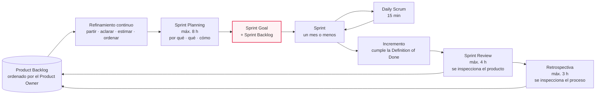
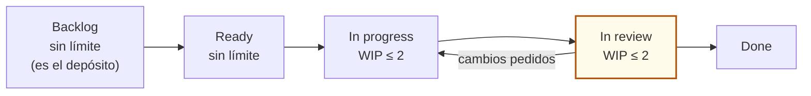
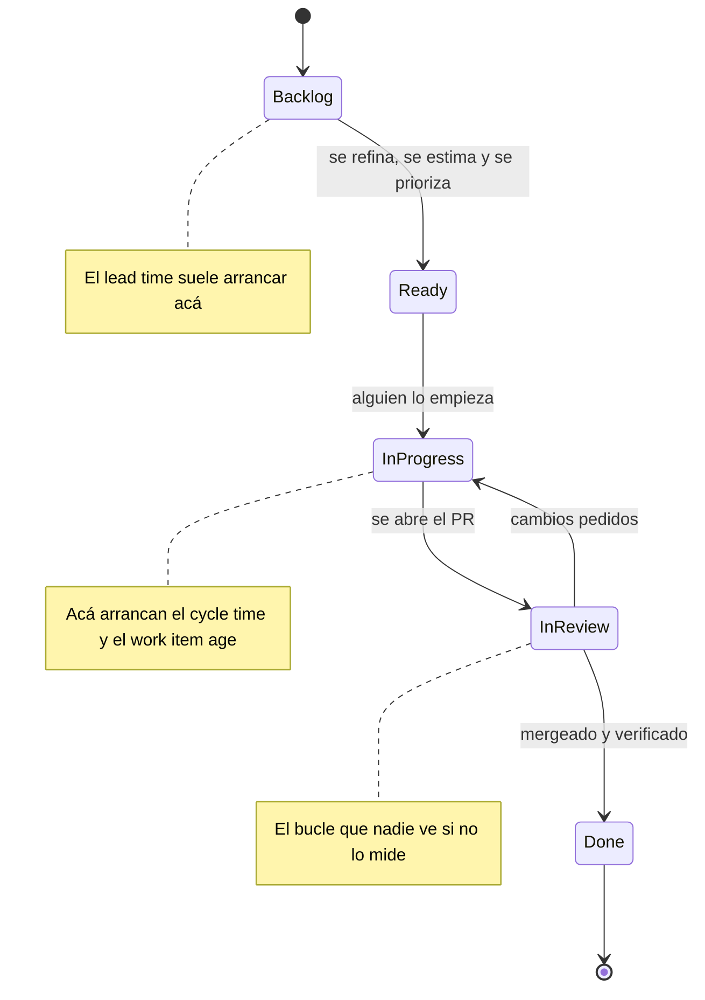
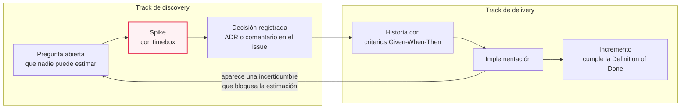
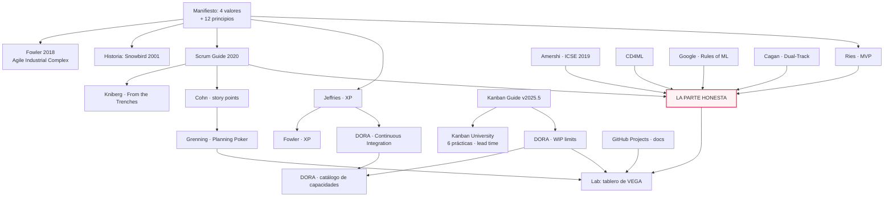
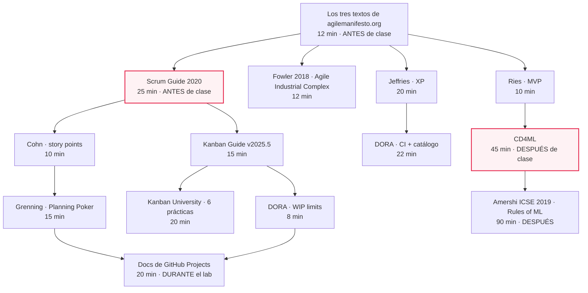

# MA·S06 — Metodologías ágiles

**Módulo:** A — Ingeniería de Software para AI Engineers *(módulo extra, transversal; se dicta entre el módulo 06 y el 07)*
**Sesión:** 06 de 07 · Parte 2 — Modelar, decidir y gestionar
**Fecha:** [Completar por el profesor: fecha]
**Caso hilo conductor:** Proyecto VEGA — Nortia Energía
**Entregable:** tablero de GitHub Projects configurado + sprint 1 planificado (`docs/09-sprint-1.md` en `vega-project`)

> Esta sesión responde a una sola pregunta operativa: **cómo se gestiona el trabajo cuando el alcance va a cambiar sí o sí**. Y en un proyecto de IA hay una vuelta de tuerca: además del alcance, cambia el resultado — no podés prometer el desempeño de una tarea antes de hacerla. Todo lo demás de la clase cuelga de ahí.

**Duración estimada**

| Bloque | Tiempo |
|---|---|
| Clase presencial | 180 min |
| Lectura de los recursos imprescindibles | ~1 h 40 min |
| Lectura de los recursos recomendados | ~1 h 30 min |
| Recursos opcionales | ~2 h 25 min + el libro de Kniberg |
| Trabajo fuera de clase (cerrar el tablero, escribir el sprint 1, arrancar la hoja de costeo de MA·S07) | ~2 h |
| **Total de estudio fuera de clase** | **≈ 5 h – 5 h 30 min** |

**Reparto propuesto de los 180 minutos de clase**

| Tramo | Minutos | Contenido |
|---|---|---|
| Arranque y encuadre del bloque | 5 | Sección 2 |
| El manifiesto y la industria de la certificación | 10 | Secciones 4.1 y 4.2 |
| Cuándo la cascada sigue siendo la respuesta correcta | 4 | Sección 4.3 |
| Scrum (la Scrum Guide se lee de tarea, no en clase) | 9 | Sección 4.4 |
| Estimación relativa y refinamiento | 7 | Sección 4.5 |
| Kanban, WIP y métricas de flujo | 9 | Sección 4.6 |
| XP + Lean y MVP | 6 | Secciones 4.7 y 4.8 |
| **La parte honesta: agilidad en proyectos de IA** | **20** | Sección 4.9 — el corazón de la sesión, no se comprime |
| Corte | 10 | |
| **Lab** | **100** | Sección 5 |

> 📝 **Nota para el profesor:** el plan del módulo fija el lab en ~100 minutos; el resto del reparto es una propuesta. Sumado tal cual, el temario de la sesión pide bastante más que 80 minutos de exposición, así que arriba ya va recortado: el candidato natural para bajar es **Scrum**, porque la Scrum Guide son 13 páginas que el alumno lee de tarea y en clase alcanza con las tres cosas que la guía **no** dice. Lo que no conviene tocar son los 20 minutos de la parte honesta.

**Artefacto:** [La sesión en versión web](https://claude.ai/code/artifact/37dfab48-27c1-4152-a9bf-398d06bb1269) — el apunte completo como página navegable.

---

## 1. Objetivos de aprendizaje

Al terminar esta sesión vas a poder:

1. **Explicar** qué dicen realmente los cuatro valores y los doce principios del Manifiesto Ágil —incluida su frase de cierre, que casi nadie cita— y **distinguir** el ágil como práctica del ágil como producto vendible.
2. **Decidir** cuándo un enfoque secuencial de tipo cascada sigue siendo la respuesta correcta, con criterios de riesgo y no de moda.
3. **Operar** Scrum con precisión: sus tres accountabilities, sus tres artefactos con sus compromisos y sus cinco eventos con sus timeboxes, y **detectar** qué prácticas que "todo el mundo llama Scrum" no están en la guía.
4. **Estimar** un backlog con story points y planning poker, **calcular** la velocidad de un equipo y **explicar** por qué estimar en horas es una trampa.
5. **Montar** un tablero Kanban con estados, políticas explícitas y límites de WIP, y **medir** el flujo con cycle time, throughput, work item age y WIP — sabiendo dónde arranca el cronómetro de cada métrica.
6. **Justificar** qué prácticas de XP siguen siendo las más valiosas apoyándote en evidencia, y **escribir** una Definition of Done que incluya integración continua de verdad.
7. **Diagnosticar** por qué la planificación ágil clásica cruje en un proyecto de IA y **aplicar** las cuatro salidas: spike con timebox, dual-track, backlog de experimentos separado del de producto, y el "done" de un spike definido como decisión tomada.
8. **Planificar** un sprint real sobre el backlog de VEGA: sprint goal, historias con criterios de aceptación, al menos un spike, y un tablero que refleje todo eso.

---

## 2. Resumen ejecutivo

Venís de cinco sesiones que produjeron papel: el charter de **MA·S01**, el discovery y las oportunidades priorizadas de **MA·S02**, los requisitos, NFR y el PRD con criterios Given-When-Then de **MA·S03**, las specs ejecutables y el `CLAUDE.md` de **MA·S04**, y el paquete de diagramas, C4 y ADRs de **MA·S05**. Todo eso describe *qué* hay que construir y *por qué* quedó así. Hoy toca lo otro: **cómo se organiza el trabajo para construirlo**, sabiendo de antemano que el plan va a cambiar.

La sesión arranca en la fuente —el texto del Manifiesto Ágil, que se lee en dos minutos y contradice buena parte de lo que se vende con su nombre—, recorre los tres cuerpos de práctica que se usan de verdad (**Scrum**, **Kanban**, **XP**) más el marco **Lean**, y aterriza en la parte que ningún framework resuelve solo: qué se rompe cuando metés investigación experimental dentro de un sprint con compromiso.

Ahí está el punto de la clase para vos como AI Engineer. El principio 7 del manifiesto dice que el software funcionando es la medida principal de progreso; en un proyecto de IA una semana entera puede producir cero software y muchísimo conocimiento, y eso no es un sprint fallido. Un equipo que no tiene forma de contabilizar ese trabajo termina mintiendo en la daily o escondiendo la investigación dentro de historias infladas. Las cuatro salidas que vas a aprender —spike con timebox, dual-track, dos backlogs, "done" = decisión tomada— existen para que no tengas que elegir entre ser honesto y ser predecible.

El lab convierte todo eso en algo concreto: el backlog de VEGA que salió del PRD, refinado, estimado con planning poker y montado en un tablero de GitHub Projects con límites de WIP, más el sprint planning del sprint 1 con su sprint goal y su spike.

---

## 3. Conceptos clave / glosario

> Los términos que ya se enseñaron en el bloque —INVEST, Given-When-Then, MoSCoW, Definition of Ready, Definition of Done, ADR, hipótesis falsable, riesgos de producto— se dan por sabidos y solo se refrescan en una línea cuando reaparecen.

### El manifiesto y su contexto

| Término | Definición |
|---|---|
| **Manifiesto Ágil** | Documento de 68 palabras firmado en 2001 que enuncia cuatro pares de valores en la forma "A **sobre** B". No es una metodología: es el acuerdo mínimo entre escuelas que ya existían (XP, Scrum, DSDM, Crystal, FDD). |
| **La estructura "A sobre B"** | Los cuatro valores son preferencias, no exclusiones. El propio texto cierra diciendo que lo de la derecha también tiene valor: *"While there is value in the items on the right, we value the items on the left more."* |
| **Agile Industrial Complex** | El nombre que Martin Fowler le puso al negocio de imponer métodos ágiles a equipos desde fuera, con certificaciones y consultoría de por medio. Es exactamente lo contrario del primer valor del manifiesto. |
| **Faux-agile** | Ágil de nombre: la ceremonia está, las prácticas y los valores no. La daily se hace, pero es un reporte de estado a un jefe. |
| **Taylorismo** | Modelo de organización del trabajo en el que un grupo piensa el método y otro lo ejecuta. Es el marco mental que el manifiesto rechaza al pedir que el equipo que hace el trabajo decida cómo hacerlo. |

### Scrum

| Término | Definición |
|---|---|
| **Scrum** | Según la Scrum Guide 2020, *"a lightweight framework that helps people, teams and organizations generate value through adaptive solutions for complex problems"*. Marco, no metodología: define pocas piezas y deja el resto abierto. |
| **Empirismo** | La base de Scrum: las decisiones se toman sobre lo observado, no sobre lo previsto. Se apoya en tres pilares — transparencia, inspección y adaptación. |
| **Accountability** | La palabra que usa la guía en vez de "rol": responsabilidad de la que alguien responde. Son tres — Developers, Product Owner y Scrum Master. |
| **Product Owner** | Responsable de maximizar el valor del producto: desarrolla y comunica el Product Goal, crea y ordena los ítems del product backlog y asegura que sean transparentes y entendibles. Es una persona, no un comité. |
| **Scrum Master** | Responsable de que Scrum se establezca y funcione: coachea la auto-gestión del equipo, remueve impedimentos y asegura que los eventos ocurran dentro de su timebox. No es un jefe de proyecto ni asigna tareas. |
| **Developers** | Quienes crean el incremento usable de cada sprint: arman el plan del sprint backlog, sostienen la calidad vía Definition of Done y adaptan el plan a diario hacia el sprint goal. Incluye a cualquiera que haga trabajo del incremento, no solo a quien programa. |
| **Sprint** | El contenedor de todos los demás eventos. Longitud fija de **un mes o menos**. No se alarga para que entre lo que falta. |
| **Product Backlog** | Lista ordenada y emergente de todo lo que puede hacer falta en el producto. Su compromiso es el **Product Goal**. |
| **Sprint Backlog** | El qué y el cómo del sprint: los ítems seleccionados más el plan para entregarlos. Su compromiso es el **Sprint Goal**. |
| **Incremento** | Un peldaño concreto hacia el Product Goal, usable y sumado a los anteriores. Su compromiso es la **Definition of Done**. |
| **Sprint Goal** | El objetivo único del sprint, expresado como resultado y no como lista de tareas. Es lo que da coherencia al sprint y lo que permite negociar alcance sin negociar propósito. |
| **Timebox** | Duración máxima fijada de antemano para un evento. Se termina cuando se acaba el tiempo, no cuando se acaba el tema. |
| **Refinamiento del backlog** | Actividad continua —no un evento con timebox— de partir, aclarar, estimar y ordenar los ítems del product backlog para que lleguen al planning en condiciones. |
| **Start / stop / continue** | Formato de retrospectiva: qué empezamos a hacer, qué dejamos de hacer, qué seguimos haciendo. La guía define el evento pero no prescribe formato; este es uno de los tres o cuatro que se usan siempre. |

### Estimación

| Término | Definición |
|---|---|
| **Estimación relativa** | Estimar comparando ítems entre sí en vez de contra un reloj. Analogía: es más fácil y más fiable decir "esta caja pesa el doble que aquella" que decir cuántos kilos pesa cada una. |
| **Story point** | Medida del *"overall effort that will be required to fully implement a product backlog item"*. Combina tres factores: cantidad de trabajo, complejidad y riesgo o incertidumbre. |
| **Ratio, no número** | Lo que significa un punto es su relación con los demás: una historia de dos puntos debería costar el doble que una de uno. *"It is the ratios that matter, not the actual numbers."* |
| **Planning poker** | Técnica de estimación en la que el equipo discute brevemente cada ítem y todos revelan su carta **a la vez**. La revelación simultánea existe para evitar el anclaje en la primera opinión dicha en voz alta. |
| **Sesgo de anclaje** | La tendencia a ajustar la propia estimación hacia el primer número que se escucha. Es la razón de ser del mazo de cartas. |
| **Velocidad** | Cantidad de puntos que un equipo termina por sprint, promediada sobre varios sprints. Sirve para proyectar cuánto entra en los próximos sprints de **ese** equipo, y para nada más. |
| **Historia de referencia** | Un ítem ya conocido al que el equipo le asigna un valor de común acuerdo antes de empezar a estimar, para calibrar la escala. Sin referencia, el planning poker no converge. |

### Kanban y flujo

| Término | Definición |
|---|---|
| **Kanban** | Según la Kanban Guide, *"a strategy for optimizing the flow of value through a process"*. No reemplaza tu proceso: se aplica **encima** del que ya tenés. |
| **Work item** | La unidad de trabajo que atraviesa el workflow. Qué cuenta como work item lo define el equipo, y es una de las cosas que hay que dejar escritas. |
| **Definition of Workflow (DoW)** | El acuerdo explícito que hace visible el proceso. Sus seis elementos mínimos: qué es un work item, los puntos de inicio y fin, los estados por los que pasa, cómo se controla el WIP, las políticas explícitas de cada estado y una SLE. |
| **Políticas explícitas** | Las condiciones escritas para que un ítem entre o salga de un estado. Un tablero sin políticas es un tablero decorativo. |
| **SLE (Service Level Expectation)** | Una expectativa de tiempo **con probabilidad asociada**: "el 85 % de los ítems se terminan en 8 días o menos". No es una promesa por ítem. |
| **WIP** | *"The number of work items started but not finished."* El trabajo empezado que todavía no terminó. |
| **Límite de WIP** | Tope de ítems permitidos simultáneamente en un estado. Convierte el tablero en un sistema *pull*: hasta que no sale una tarjeta, no entra la siguiente. |
| **Throughput** | *"The number of work items finished per unit of time."* En la escuela de Kanban University también aparece como *delivery rate*. |
| **Cycle time** | *"The elapsed time between when a work item started and when a work item finished."* |
| **Work item age** | *"The elapsed time between when a work item started and the current date."* Es la única métrica de esta lista que se mira **hoy**, sobre trabajo vivo, y no al cerrar el período. |
| **Lead time** | En la guía del Kanban Method de Kanban University, el tiempo que tarda un work item en atravesar el sistema de principio a fin. Ojo: no todas las escuelas usan este término igual (ver 4.6). |
| **Single-piece flow** | El objetivo de fondo de limitar el WIP: que el trabajo fluya de la idea al cliente con la mínima espera y el mínimo retrabajo. |
| **Context switching** | El coste de saltar entre tareas empezadas. Es lo que el límite de WIP ataca directamente. |

### XP y prácticas de ingeniería

| Término | Definición |
|---|---|
| **XP (Extreme Programming)** | *"A discipline of software development based on values of simplicity, communication, feedback, courage, and respect"*, con trece prácticas concretas. Es la más prescriptiva de las familias ágiles en lo técnico. |
| **Pair programming** | Dos programadores trabajando juntos, sentados al lado, en la misma máquina. En XP no es una técnica ocasional: es cómo se construye todo el software de producción. |
| **TDD (Test-Driven Development)** | Escribir el test antes que el código, y no dar por buena una entrega si no pasa el 100 % de los tests de programador. Es la misma idea que sostiene la spec ejecutable de MA·S04: primero el criterio, después la implementación. |
| **Integración continua (CI)** | Integrar el trabajo a la rama principal al menos a diario, con tests automatizados que corren antes y después del merge y terminan *"in a few minutes or less"*, y con cada commit disparando un build. |
| **Trunk-based development** | Trabajar sobre la rama principal con ramas de vida muy corta. Es la condición práctica de la CI: sin esto, "integración continua" es un servidor de builds sobre ramas que llevan una semana divergiendo. |
| **Propiedad colectiva del código** | *"Any pair of programmers can improve any code at any time."* Nadie es dueño de un módulo, y nadie es cuello de botella de un módulo. |
| **Refactoring (design improvement)** | Mejorar la estructura interna del código sin cambiar su comportamiento observable. |
| **Ritmo sostenible** | Práctica de XP: el equipo trabaja a un ritmo que puede mantener indefinidamente. Las horas extra sistemáticas destruyen la calidad antes que el ánimo. |
| **Capacidad DORA** | Una práctica de ingeniería o de proceso que el programa de investigación DORA cataloga y asocia a resultados de rendimiento. Es la vara para responder qué prácticas tienen medición detrás. |

### Lean, IA y el tablero

| Término | Definición |
|---|---|
| **MVP (Minimum Viable Product)** | *"That version of a new product which allows a team to collect the maximum amount of validated learning about customers with the least effort."* Mínimo **esfuerzo**, no mínimo producto. |
| **Validated learning** | Conocimiento sobre el cliente obtenido con evidencia, no con opinión. Es lo que un MVP produce; el producto es el vehículo. |
| **Spike** | Tarea de investigación **con timebox** cuyo entregable es una respuesta, no una funcionalidad. El término viene de XP. Ya apareció como *research spike* en MA·S02; acá se le pone el timebox y el criterio de cierre. |
| **Timebox de un spike** | El tiempo máximo que se le dedica a la pregunta, acordado antes de empezar. Cuando se acaba, se decide con lo que haya — incluida la decisión de que hace falta otro spike. |
| **Dual-track** | Patrón en el que un mismo equipo corre dos tipos de trabajo en paralelo: un track de discovery que genera ítems de backlog validados y un track de delivery que genera software entregable. |
| **Backlog de experimentos** | Lista separada donde viven los ítems cuyo resultado esperado es conocimiento, no incremento. Es una decisión de este bloque, no una pieza de ningún framework. |
| **Entanglement de modelos** | La propiedad de los componentes de IA de quedar enredados entre sí de forma compleja, con comportamiento de error no monótono, lo que hace que resistan la modularización. |
| **Los tres ejes de cambio** | En una aplicación de ML, lo que cambia no es solo el código: cambian **código, modelo y datos**, y el comportamiento resultante es complejo y difícil de predecir. |
| **GitHub Projects** | *"An adaptable table, board, and roadmap that integrates with your issues and pull requests on GitHub."* Es una capa de planificación sobre los issues, no un repositorio de tareas aparte. |
| **Campo *iteration*** | Tipo de campo de GitHub Projects pensado para planificar semana a semana, con soporte de pausas. Es el campo con el que se representa un sprint. |
| **Swimlane** | Agrupación horizontal del tablero por el valor de un campo. Sirve, por ejemplo, para separar visualmente delivery de discovery. |

---

## 4. Notas de estudio

### El ciclo que ejecuta el lab



Los timeboxes son los de la Scrum Guide 2020 y están referidos a un sprint de un mes; para sprints más cortos se acortan proporcionalmente. El nodo resaltado es el que más se olvida: **el sprint backlog sin sprint goal es una lista de tareas**, y una lista de tareas no se puede renegociar sin renegociar el compromiso.

---

### 4.1 El Manifiesto Ágil: qué decía realmente

En febrero de 2001, según la historia del manifiesto escrita por Jim Highsmith, diecisiete personas se reunieron en The Lodge at Snowbird, en Utah, del 11 al 13 de febrero, "para hablar, esquiar, relajarse y tratar de encontrar terreno común". No venían a inventar una metodología: ya traían la suya —XP, Scrum, DSDM, Crystal, FDD— y lo que buscaban era el mínimo común denominador. Entre los firmantes están Kent Beck, Alistair Cockburn, Ward Cunningham, Martin Fowler, James Grenning, Jim Highsmith, Robert C. Martin, Ken Schwaber, Jeff Sutherland y Dave Thomas.

Lo que salió de ahí son 68 palabras. Los cuatro valores, textuales:

- *"Individuals and interactions **over** processes and tools"*
- *"Working software **over** comprehensive documentation"*
- *"Customer collaboration **over** contract negotiation"*
- *"Responding to change **over** following a plan"*

Y el cierre, que es la frase más importante del documento y la que menos se cita:

> *"While there is value in the items on the right, we value the items on the left more."*

**Leé bien la preposición.** Dice *over*, no *instead of*. El manifiesto no dice que la documentación no sirva, ni que el contrato no importe, ni que planificar sea malo. Dice qué gana cuando hay que elegir. Todo el discurso de "somos ágiles, no documentamos" es una lectura que el propio texto desautoriza en su última línea — y es, además, el permiso explícito que vas a usar en 4.3 para no ser dogmático con la cascada.

**Los doce principios** son la parte operativa y se leen en cuatro minutos. Los que más juego dan en clase:

| # | Qué dice | Por qué importa acá |
|---|---|---|
| 1 | Entrega temprana y continua de software valioso | El "continua" es lo que después se convierte en CI/CD |
| 2 | *"Welcome changing requirements, even late in development"* | Es la premisa de toda la sesión: el alcance va a cambiar |
| 3 | Entregar con frecuencia, de un par de semanas a un par de meses, con preferencia por el plazo corto | De acá sale la longitud típica de un sprint, no de Scrum |
| 7 | *"Working software is the primary measure of progress"* | **El principio que colisiona de frente con un proyecto de IA** (ver 4.9) |
| 10 | *"Simplicity--the art of maximizing the amount of work not done--is essential"* | El trabajo no hecho también es una decisión de diseño |
| 12 | A intervalos regulares el equipo reflexiona sobre cómo ser más efectivo y ajusta su comportamiento | La retrospectiva es un **principio**, no una ceremonia opcional |

> 💡 Ejercicio de dos minutos que conviene hacer en voz alta: leé los doce principios pensando en el último sitio donde trabajaste y contá cuántos se cumplían de verdad. El número suele ser incómodo, y esa incomodidad es el contenido de 4.2.

**Gotcha:** el manifiesto **no creó Scrum ni XP**. Los dos existían antes y siguieron su camino después. Confundirlos lleva al error de discutir "si el ágil funciona" cuando en realidad se está discutiendo si funciona una implementación concreta de Scrum en una empresa concreta.

📎 Fuentes: [Manifesto for Agile Software Development](https://agilemanifesto.org/) · [Principles behind the Agile Manifesto](https://agilemanifesto.org/principles.html) · [History: The Agile Manifesto](https://agilemanifesto.org/history.html)

---

### 4.2 ...y en qué se convirtió: la industria de la certificación

Veinte años después, la palabra "agile" nombra dos cosas distintas: un conjunto de prácticas y un mercado. Esta crítica no hace falta traerla de fuera del movimiento; la hizo uno de los firmantes del manifiesto.

En *The State of Agile Software in 2018* (25 de agosto de 2018), Martin Fowler le pone nombre al problema: **el Agile Industrial Complex**, la maquinaria de imponer métodos a la gente desde fuera del equipo. Su frase es dura: *"The Agile Industrial Complex imposing methods on people is an absolute travesty"*. Y describe el otro síntoma, el **faux-agile**: *"agile that's just the name, but none of the practices and values in place"* — la daily se hace, pero es un reporte de estado; la retro se hace, pero no cambia nada.

El argumento de fondo tiene dos patas y las dos son útiles para tu trabajo:

1. **No hay talle único.** *"There is no one-size-fits-all in software development."* El proceso correcto para un equipo de cuatro personas construyendo un asistente interno no es el correcto para cincuenta personas manteniendo un core bancario.
2. **El equipo que hace el trabajo decide cómo hacerlo.** Es literalmente el primer valor del manifiesto —individuos e interacciones sobre procesos y herramientas—, y es lo contrario del taylorismo, donde un grupo piensa el método y otro lo ejecuta.

> ⚠️ **Gotcha profesional.** Cuando entres a una empresa y te digan "acá somos ágiles", la pregunta útil no es qué framework usan sino **quién eligió el proceso**. Si lo eligió el equipo y lo revisa cada sprint, hay algo. Si vino de una transformación corporativa con un consultor y un tablero de métricas para arriba, tenés faux-agile con nombre y apellido.

Fijate que este bloque de la clase no necesita ninguna estadística de adopción para sostenerse: el argumento lo firma alguien que estuvo en Snowbird.

📎 Fuente: [The State of Agile Software in 2018 — Martin Fowler](https://martinfowler.com/articles/agile-aus-2018.html)

---

### 4.3 Cuándo la cascada sigue siendo la respuesta correcta

En **MA·S01** viste los modelos de ciclo de vida —cascada, iterativo, incremental, espiral, ágil— y ahí ya se dijo que la cascada no es una caricatura. Acá se responde la otra pregunta: **cuándo elegirla a propósito**.

El criterio no es de moda ni de identidad profesional: es de **riesgo**. Un enfoque secuencial —analizar, diseñar, construir, probar, desplegar, con aprobación entre fases— tiene una ventaja concreta y una desventaja concreta. La ventaja: obliga a decidir temprano y deja un rastro documental completo antes de tocar nada. La desventaja: el feedback llega tarde y caro. Cuando el coste de equivocarse tarde es mayor que el coste de decidir temprano con información incompleta, el secuencial gana.

Señales de que estás en ese caso:

| Señal | Por qué empuja hacia lo secuencial |
|---|---|
| **El coste de un error es catastrófico o irreversible** | Software con vidas o dinero irrecuperable de por medio. No hay "lo arreglamos en el próximo sprint" |
| **Hay una aprobación previa obligatoria** | Un regulador, un auditor o un contrato exigen aprobar la especificación **antes** de construir. La aprobación es parte del producto |
| **Los requisitos son genuinamente estables** | Migrar un sistema con comportamiento conocido, implementar un estándar publicado, cumplir una norma que no cambia |
| **La entrega no puede ser incremental** | Firmware que se graba una vez, integraciones con un tercero que solo acepta una entrega, obligaciones con fecha única |
| **Coordinación grande y rígida** | Muchos equipos o proveedores que necesitan un contrato de interfaces congelado para poder trabajar en paralelo |

Y las tres precisiones que evitan el malentendido:

1. **No es todo o nada.** Lo habitual no es "proyecto cascada" vs. "proyecto ágil", sino tramos: un contrato de interfaces congelado por arriba y desarrollo iterativo por debajo. En VEGA, la política de retención de datos personales que exige Cristina Roa se decide una vez y se aprueba antes de construir; la interfaz del asistente se itera con los agentes cada dos semanas.
2. **El permiso lo da el propio manifiesto.** *"There is value in the items on the right"*: seguir un plan tiene valor. Elegir el enfoque por criterio y no por default es exactamente lo contrario del faux-agile.
3. **En IA, el tramo que casi nunca puede ser secuencial es el que toca al modelo.** Podés congelar el contrato de la API, el esquema de datos o la política de retención. No podés congelar por adelantado el desempeño de un retrieval sobre 4.100 documentos, porque no lo conocés hasta medirlo. Es la misma razón por la que en MA·S01 el ciclo de vida de un proyecto de IA se dibujó como PoC → piloto → producción y no como una cascada.

> ⚠️ El error más caro de esta sección es el inverso al que la gente espera: no es "usar cascada", es **usar ágil de nombre en un contexto que exige aprobación previa**. Terminás con las ceremonias de Scrum, cero documentación aprobada y una auditoría que te devuelve el proyecto entero.

---

### 4.4 Scrum, según su propia guía

Scrum tiene una única definición normativa: **la Scrum Guide de noviembre de 2020**, de Ken Schwaber y Jeff Sutherland. Son trece páginas, es gratuita, y **es lectura obligatoria antes de esta clase**. Define Scrum como *"a lightweight framework that helps people, teams and organizations generate value through adaptive solutions for complex problems"*, apoyado en el empirismo: transparencia, inspección y adaptación.

**Scrum en una tabla.** No es un flujo, es una enumeración, así que va como enumeración:

| Bloque | Pieza | Lo esencial |
|---|---|---|
| **Accountabilities** | Developers | Crean el incremento usable, arman el plan del sprint backlog, sostienen la calidad vía Definition of Done y adaptan el plan a diario hacia el sprint goal |
| | Product Owner | Maximiza el valor: desarrolla y comunica el Product Goal, crea y ordena los ítems del product backlog, asegura su transparencia |
| | Scrum Master | Establece Scrum, coachea la auto-gestión, remueve impedimentos, asegura que los eventos ocurran dentro del timebox |
| **Artefactos** | Product Backlog → **Product Goal** | Lista ordenada y emergente de lo que puede hacer falta |
| | Sprint Backlog → **Sprint Goal** | Qué se hace este sprint y cómo |
| | Incremento → **Definition of Done** | El peldaño concreto, usable, hacia el Product Goal |
| **Eventos** | Sprint | Contenedor de todo lo demás. **Un mes o menos**, longitud fija |
| | Sprint Planning | Máx. **8 h** |
| | Daily Scrum | **15 min** |
| | Sprint Review | Máx. **4 h** — se inspecciona el **producto** |
| | Sprint Retrospective | Máx. **3 h** — se inspecciona el **proceso** |

*(Todos los timeboxes están referidos a un sprint de un mes.)*

**Las tres cosas que la guía sí dice y todo el mundo tuerce:**

- **Los eventos son puntos de inspección y adaptación, no reuniones de reporte.** La daily es de los Developers y para los Developers: sirve para ajustar el plan del día hacia el sprint goal. Si alguien reporta avance a un tercero, dejó de ser una daily.
- **El review inspecciona el producto; la retro inspecciona el proceso.** Mezclarlos es el fallo más común: se termina discutiendo una funcionalidad en la retro y el ánimo del equipo en el review.
- **El sizing es de quien hace el trabajo.** *"The Developers who will be doing the work are responsible for the sizing."* El PO ordena; no estima por vos.

**Y ahora la lectura que hay que provocar: qué NO está en la guía.** La Scrum Guide 2020 no menciona **story points**, ni **planning poker**, ni **velocidad**, ni **Definition of Ready** (esta última ausencia ya la verificaste en MA·S03). Nada de eso es Scrum: es práctica agregada, buena, útil y opcional. Saberlo cambia las conversaciones: cuando alguien te diga "eso no es Scrum", ahora podés preguntar en qué página lo leyó.

**Formatos de retrospectiva.** La guía define el evento y su timebox pero no prescribe cómo se corre. Los tres que se usan siempre:

- **Start / stop / continue** — qué empezamos, qué dejamos, qué seguimos. El más rápido y el que mejor produce acciones.
- **Mad / sad / glad** — qué nos enojó, qué nos entristeció, qué nos alegró. Saca lo emocional, útil cuando hay tensión y nadie la nombra.
- **Timeline** — se dibuja la línea de tiempo del sprint y cada uno marca los hitos y los baches. Bueno para sprints largos o con incidentes.

Una retro sin **acciones con dueño y fecha** es una charla. La regla práctica: máximo dos acciones por retro, y la primera cosa que se hace en la retro siguiente es revisarlas.

> 📝 **Nota para el profesor:** el formato *start / stop / continue* se enseña acá porque el plan de **MA·S07** lo usa para la retrospectiva de cierre del bloque. Conviene anunciarlo en clase para que llegue conocido.

📎 Fuentes: [The Scrum Guide (noviembre 2020)](https://scrumguides.org/scrum-guide.html) · [Scrum and XP from the Trenches, 2.ª ed. — Henrik Kniberg](https://www.infoq.com/minibooks/scrum-xp-from-the-trenches-2/)

> 💡 La Scrum Guide te dice **qué** es Scrum; Kniberg te muestra **cómo se ve un martes**. Su libro (2.ª edición, InfoQ, 13 de mayo de 2015, descarga gratuita) relata cómo un equipo real implementó Scrum y XP y fue ajustando el proceso durante un año. Los dos son deliberadamente contradictorios en el detalle, y esa contradicción es didáctica: leer solo la guía te deja dogmático, leer solo a Kniberg te deja sin brújula.

---

### 4.5 Estimación relativa: puntos, cartas y velocidad

#### Qué es un story point

Un story point mide *"the overall effort that will be required to fully implement a product backlog item"*, y ese esfuerzo se descompone en **tres factores**: cantidad de trabajo, complejidad, y **riesgo o incertidumbre**. El tercero es el que hace toda la diferencia en un proyecto de IA, y volvemos sobre él en un minuto.

Lo que importa no es el número sino la razón entre números: *"A user story that is assigned two story points should be twice as much effort as a one-point story"*, y *"it is the ratios that matter, not the actual numbers"*.

**La escala.** La convención de la industria es una secuencia tipo Fibonacci modificada —`1, 2, 3, 5, 8, 13`— más dos cartas especiales: una de "no lo sé" (`?`) y una de "esto es demasiado grande para estimarlo, hay que partirlo" (`∞` o el clásico "camiseta XL"). Los huecos crecientes entre valores no son un capricho: **codifican que la precisión cae con el tamaño**. Nadie puede distinguir de forma útil entre 20 y 21 puntos; sí puede distinguir entre 8 y 13.

#### Por qué estimar en horas es una trampa

Esta es una **posición de este bloque**, y conviene que sepas dónde termina el respaldo y dónde empieza el criterio. Lo respaldado: el punto es una medida relativa que incluye la incertidumbre, y fijar una tabla de conversión punto↔horas es un mal hábito. Lo que agrega el bloque es el motivo por el que hacerlo tiene consecuencias:

1. **Una hora estimada se lee como una promesa.** "Son ocho horas" activa en quien escucha un compromiso de calendario; "son cinco puntos" no.
2. **Las horas esconden la incertidumbre en vez de expresarla.** El tercer factor del punto —riesgo— desaparece cuando el número es una duración: "seis horas" no sabe decir "seis horas si el retrieval anda, dos días si no".
3. **La estimación en horas es individual; la relativa es del equipo.** Cuántas horas tarda algo depende de quién lo haga. Cuánto más grande es una historia que otra, no.
4. **En cuanto existe una tabla de conversión, el punto deja de ser un punto.** Volvés a estimar en horas con un paso extra y la ilusión de estar haciendo otra cosa.

> ⚠️ El síntoma de que tu equipo cayó en la trampa: alguien pregunta "¿cuántas horas es un punto?". La respuesta correcta es que no hay respuesta, y que si la hubiera no harían falta puntos.

#### Planning poker

La técnica es de **James Grenning** —firmante del manifiesto— y su documento (versión 1.1, 19 de enero de 2008) la plantea como salida a la parálisis por análisis en la planificación de release. El procedimiento:

1. El PO presenta el ítem y el equipo lo discute **brevemente**.
2. Cada persona elige una carta y **todos la revelan a la vez**. La simultaneidad es el mecanismo: evita el anclaje en la primera opinión dicha en voz alta.
3. Si las estimaciones divergen mucho, hablan primero **el más alto y el más bajo**. No se promedia: se discute.
4. Se re-estima hasta converger.

**Lo que hay que entender de verdad:** el número es un subproducto. **El producto es la conversación**, y en particular la divergencia. Cuando una persona dice 2 y otra dice 13, casi nunca es que uno estime mal — es que entendieron dos alcances distintos, o uno de los dos sabe algo que el otro no. Ese descubrimiento vale más que la estimación.

En VEGA es literal: una divergencia grande en una historia de RAG casi siempre significa que dos personas entendieron distinto qué cuenta como "respuesta correcta".

#### Velocidad

La velocidad es la suma de puntos de los ítems **terminados** (que cumplen la Definition of Done) por sprint, promediada sobre los últimos sprints. Sirve para una sola cosa: proyectar cuánto trabajo entra en los próximos sprints **de ese equipo**.

Los cuatro abusos clásicos, y por qué cada uno rompe:

| Abuso | Por qué está mal |
|---|---|
| **Comparar la velocidad de dos equipos** | Los puntos son una escala local. Un 5 acá y un 5 allá no miden lo mismo, igual que dos termómetros sin calibrar |
| **Usarla como métrica de productividad** | Los puntos los pone el equipo. Si la velocidad es el objetivo, la escala se infla sola. Es la ley de Goodhart en dos sprints |
| **Fijarse "subir la velocidad" como objetivo del trimestre** | La forma más rápida de subirla es bajar la Definition of Done |
| **Prometer con la velocidad de los dos primeros sprints** | Todavía no hay serie. Un equipo nuevo **no tiene** velocidad: la descubre |

> 💡 Un equipo nuevo no compromete puntos en el sprint 1. Planifica por **sprint goal** y toma las historias que cree que caben. La velocidad se mide al cerrar el sprint, no al abrirlo. Es exactamente lo que vas a hacer en el lab.

#### Refinamiento del backlog

Estimar sin refinar no funciona. El refinamiento es una actividad **continua** —no un evento con timebox— y tiene cuatro movimientos:

1. **Partir** lo que es demasiado grande, con los mismos cortes válidos que viste en MA·S03 (por regla de negocio, por caso feliz vs. casos alternativos, por tipo de dato, por interfaz) y evitando los inválidos (por capa técnica: "el backend" y "el frontend" no son dos historias).
2. **Aclarar** hasta que la historia cumpla INVEST y tenga criterios Given-When-Then escritos.
3. **Estimar**, con quienes van a hacer el trabajo.
4. **Ordenar**, que es responsabilidad del PO.

La regla práctica: llegá al planning con dos sprints de trabajo refinado por delante. Menos, y el planning se convierte en un taller de requisitos. Más, y estás refinando cosas que van a cambiar antes de tocarlas — el principio 10 en acción.

📎 Fuentes: [What Are Story Points? — Mountain Goat Software](https://www.mountaingoatsoftware.com/blog/what-are-story-points) · [Planning Poker (v1.1) — James Grenning](https://wingman-sw.com/papers/PlanningPoker-v1.1.pdf)

---

### 4.6 Kanban: visualizar, limitar, medir

Kanban es *"a strategy for optimizing the flow of value through a process"*. Fijate en la palabra: **estrategia**, no metodología. No te dice qué roles tener ni cada cuánto entregar. Se aplica encima del proceso que ya tenés — incluido Scrum.

La Kanban Guide (**v2025.5, del 1 de mayo de 2025**, con contribución de John Coleman, Daniel Vacanti, Colleen Johnson, Prateek Singh, Julia Wester, Christian Neverdal, Magdalena Firlit, Tom Gilb y Steve Tendon, bajo licencia CC BY-SA 4.0) define **tres prácticas**: definir y visualizar un workflow, gestionar activamente los ítems del workflow, y mejorar el workflow.

La otra escuela —la del Kanban Method, mantenida por Kanban University— lista **seis prácticas**: visualizar; limitar el trabajo en curso; gestionar el flujo; hacer las políticas explícitas; implementar bucles de feedback; y mejorar colaborativamente, evolucionando de forma experimental. Las dos dicen lo mismo con distinto grano.

#### La Definition of Workflow: lo que el tablero no te da solo

Ninguna herramienta te obliga a esto, y es lo que separa un tablero útil de un tablero decorativo. La DoW tiene **seis elementos mínimos**:

1. Qué es un **work item**.
2. Los **puntos de inicio y fin** del workflow (dónde empieza y termina tu responsabilidad).
3. Los **estados** por los que pasa un ítem.
4. Cómo se **controla el WIP**.
5. Las **políticas explícitas** de cada estado.
6. Una **SLE**: una expectativa de tiempo con su probabilidad.

Una DoW mínima para VEGA cabe en unas pocas líneas:

```
Work item:    una historia, un spike, un bug o un chore del backlog de VEGA.
Inicio/fin:   arranca cuando entra en "Ready"; termina cuando entra en "Done".
Ready:        tiene criterios Given-When-Then y estimación en puntos.
In progress:  hay una rama abierta y una persona responsable asignada.
In review:    hay un PR con la spec enlazada (docs/04-specs/).
Done:         criterios GWT verificados + PR mergeado.
Done (spike): pregunta respondida y decisión registrada en el issue o en un ADR.
SLE:          el 85 % de las historias pasa de Ready a Done en 5 días o menos.
```

#### Límites de WIP



El mecanismo es simple: un tope por columna, y *"the team must wait for a card to move to the next column before pulling the highest priority one from the previous column"*. Eso convierte el tablero en un sistema **pull**: el trabajo no se empuja, se tira cuando hay capacidad. El efecto directo es menos context switching; el objetivo de fondo es el **single-piece flow**, que el trabajo vaya de la idea al cliente con mínima espera y mínimo retrabajo.

La condición que casi nadie respeta: los límites de WIP rinden *"particularly when they are combined with the use of visual displays and feedback loops from monitoring"*. Traducido: **un límite de WIP sobre trabajo que no se ve no hace absolutamente nada**. Si el tablero no está actualizado, el límite es un número en una pantalla que nadie mira.

El estado resaltado en amarillo no es casual. **`In review` es donde se acumula el trabajo en los equipos que usan agentes de código**: la velocidad de generación sube y la de revisión no. Es un tema que MA·S07 retoma, y es la razón por la que el segundo límite de WIP va ahí y no en otro lado.

#### Las métricas de flujo, y dónde arranca cada cronómetro

Las cuatro definiciones textuales de la Kanban Guide v2025.5:

| Métrica | Definición | Cuándo se mira |
|---|---|---|
| **WIP** | *"The number of work items started but not finished"* | Ahora mismo |
| **Throughput** | *"The number of work items finished per unit of time"* | Al cerrar el período |
| **Cycle time** | *"The elapsed time between when a work item started and when a work item finished"* | Al cerrar el ítem |
| **Work item age** | *"The elapsed time between when a work item started and the current date"* | **Hoy, sobre trabajo vivo** |

Y la que aporta la otra escuela: **lead time**, en la guía oficial del Kanban Method de Kanban University, es el tiempo que tarda un work item en atravesar el sistema de principio a fin (y ahí el throughput aparece también como *delivery rate*).

**Acá está el lío terminológico, y es contenido, no anécdota.** Las dos guías no usan el mismo vocabulario: la Kanban Guide de `kanbanguides.org` construye sus métricas sobre *cycle time* y no incluye *lead time* entre ellas; Kanban University sí lo define. En la práctica de la industria, la lectura más extendida es que el **lead time** arranca cuando el cliente pide algo (entra al sistema) y el **cycle time** arranca cuando el equipo efectivamente empieza a trabajarlo — pero eso es una convención, no un estándar compartido.

La consecuencia operativa es una sola y es muy concreta:

> ⚠️ **Antes de comparar una métrica de flujo con la de otro equipo, preguntá dónde pone cada uno el punto de inicio del cronómetro.** Un equipo que mide desde que abre el PR y otro que mide desde que el cliente pidió la funcionalidad están midiendo cosas distintas con el mismo nombre.



**El work item age es la métrica más útil en vivo.** Cycle time y throughput te cuentan qué pasó; el work item age te dice qué está pasando. Una tarjeta con doce días de edad en `In progress` es un problema **hoy**, no un dato para la retro. Es la pregunta que conviene hacer en la daily: no "¿en qué estás?", sino "¿cuál es la tarjeta más vieja del tablero y qué la traba?".

📎 Fuentes: [Kanban Guide (v2025.5)](https://kanbanguides.org/english/) · [The Official Guide to The Kanban Method — Kanban University](https://kanban.university/kanban-guide/) · [Work in process limits — DORA](https://dora.dev/capabilities/wip-limits/)

---

### 4.7 XP: qué prácticas siguen teniendo respaldo

XP es *"a discipline of software development based on values of simplicity, communication, feedback, courage, and respect"*. Sus **trece prácticas**, según Ron Jeffries —firmante del manifiesto y uno de los tres autores originales de XP—: whole team, planning game, small releases, customer tests, simple design, pair programming, test-driven development, design improvement (refactoring), continuous integration, collective code ownership, coding standard, metaphor y sustainable pace.

Las cuatro que pide el plan, en palabras de Jeffries:

- **Pair programming** — *"All production software in XP is built by two programmers, sitting side by side, at the same machine."*
- **TDD** — cada vez que alguien libera código, *"every single one of the programmer tests must run correctly. One hundred percent, all the time!"*
- **Integración continua** — *"XP teams build multiple times per day."*
- **Propiedad colectiva del código** — *"Any pair of programmers can improve any code at any time."*

#### La paradoja de XP

Martin Fowler sitúa a XP como *"the dominant agile method in the late 90s and early 00s before Scrum became dominant"*, y le atribuye haber sido el catalizador principal de la atención sobre los métodos ágiles y haber popularizado prácticas que hoy son de uso general: integración continua, refactoring, TDD y la planificación ágil. Ahí está la paradoja que hay que entender: **XP casi desapareció como marca y ganó como conjunto de prácticas.** Nadie dice "hacemos XP"; todo el mundo hace CI y refactoring.

#### ¿Y cuáles tienen medición detrás?

Acá es donde la clase deja de opinar. El catálogo de capacidades de DORA agrupa prácticas con respaldo del programa de investigación:

- Entre las **capacidades técnicas** figuran, entre otras, **continuous integration**, **test automation**, **trunk-based development**, continuous delivery, working in small batches, version control, code maintainability, deployment automation y monitoring and observability.
- Entre las **capacidades de proceso** figuran **work in process limits**, **visual management**, visibility of work in the value stream, streamlining change approval y team experimentation.
- El catálogo incluye además un bloque de capacidades específicas de IA (AI-accessible internal data, clear and communicated AI stance, healthy data ecosystems, platform engineering, user-centric focus).

Es decir: buena parte del núcleo técnico de XP sobrevivió no por gusto, sino porque está medido.

> 💡 **Observación para el debate, no veredicto.** Algunas prácticas de XP —pair programming, por ejemplo— **no aparecen en ese catálogo con ficha propia**. Eso es una observación sobre el catálogo, no una condena de la práctica: que algo no esté catalogado no significa que no funcione, significa que no está ahí. Buena pregunta para discutir en clase: ¿qué prácticas de las que hacés todos los días podrías defender con evidencia y cuáles defendés por experiencia?

#### CI, con umbrales

La ficha de DORA sobre integración continua convierte el eslogan en una definición operacional, y eso es exactamente lo que hace falta para escribir una Definition of Done honesta. El principio de fondo: *"if something takes a lot of time and energy, you should do it more often, forcing you to make it less painful"*. Los requisitos:

- Integrar el trabajo en la rama principal **al menos a diario** (trunk-based development).
- Tests automatizados que corren **antes y después del merge** y que terminan *"in a few minutes or less"*.
- *"Each commit should trigger a build of the software."*

La investigación asocia CI a mayor frecuencia de despliegue, sistemas más estables y software de más calidad, y la señala como la primera prioridad para arrancar el camino hacia continuous delivery.

> ⚠️ Contrastá esto con tu Definition of Done real. Si dice "el código está testeado" pero la suite tarda cuarenta minutos y se corre a mano una vez por semana, no tenés CI: tenés un servidor de builds.

**El puente con MA·S04.** TDD y spec-driven development son la misma idea con distinto teclado: primero se escribe el criterio verificable, después se produce el código que lo satisface. Lo que cambia es quién lo teclea. Y la consecuencia también es la misma: sin un criterio que se pueda ejecutar, el humano **es** el bucle de verificación.

📎 Fuentes: [What is Extreme Programming? — Ron Jeffries](https://ronjeffries.com/xprog/what-is-extreme-programming/) · [Extreme Programming — Martin Fowler](https://martinfowler.com/bliki/ExtremeProgramming.html) · [DORA Capabilities](https://dora.dev/capabilities/) · [Continuous integration — DORA](https://dora.dev/capabilities/continuous-integration/)

---

### 4.8 Lean y MVP: el experimento como unidad de trabajo

La definición original de MVP, de Eric Ries (3 de agosto de 2009), es esta: *"that version of a new product which allows a team to collect the maximum amount of validated learning about customers with the least effort"*.

Leela dos veces, porque casi todo el mundo la usa al revés. Ries desmonta explícitamente la lectura habitual: *"MVP, despite the name, is not about creating minimal products."* El mínimo no está en el producto, está en el **esfuerzo**. Y agrega algo que sorprende: el MVP **impone overhead** — hay que hablar con clientes, instrumentar métricas y analizar resultados. En sus ejemplos hay MVPs que llevaron seis meses y otros donde dos semanas alcanzaron para descubrir que nadie lo quería.

**La traducción a VEGA es directa y vale la pena hacerla explícita:**

- ❌ El MVP **no es** "el chatbot pero feo".
- ✅ El MVP **es** el experimento más barato que responde si el retrieval sobre los 4.100 documentos puede sostener una respuesta sobre facturación con la fiabilidad que la operación necesita.

Si la respuesta es no, ninguna interfaz bonita lo arregla. Y si la respuesta es sí, ya sabés dónde invertir. Esto enlaza directo con las **hipótesis falsables** que escribiste en MA·S02 —"creemos que / lo sabremos si / lo abandonamos si"—: un MVP es una hipótesis falsable con presupuesto.

De acá sale el encuadre que sostiene toda la sección siguiente: **en un proyecto de IA, la unidad de trabajo no siempre es una funcionalidad. A veces es un experimento.**

📎 Fuente: [Minimum Viable Product: a guide — Eric Ries](http://www.startuplessonslearned.com/2009/08/minimum-viable-product-guide.html)

---

### 4.9 Agilidad en proyectos de IA: la parte honesta

Esta es la sección que justifica que la clase exista y no sea un resumen de tres frameworks.

#### Por qué la planificación ágil clásica cruje

Tres fuentes distintas —academia, consultoría de ingeniería y una plataforma— dicen lo mismo desde tres sitios, y esa coincidencia es la que impide que esto suene a opinión.

**1. Los componentes de IA se resisten a la modularización.** El estudio *Software Engineering for Machine Learning: A Case Study* de Microsoft Research (Amershi, Begel, Bird, DeLine, Gall, Kamar, Nagappan, Nushi y Zimmermann; ICSE 2019, track *Software Engineering in Practice*, mayo de 2019, Best Paper Award) describe un workflow de nueve etapas para construir aplicaciones con ML y **tres diferencias fundamentales** respecto del software convencional:

- Los **datos** son mucho más difíciles de descubrir, gestionar y versionar.
- La personalización y reutilización de **modelos** exige habilidades muy distintas de las que suele tener un equipo de software.
- Los componentes de IA **se resisten a la modularización**: los modelos quedan *"entangled in complex ways and experience non-monotonic error behavior"*.

Detenete en la tercera. Si los componentes no se pueden aislar, **una historia no es independiente** — se te cae la "I" del INVEST que aprendiste en MA·S03, y con ella la premisa de que el backlog es una lista de piezas intercambiables. Cambiar el chunking mueve el retrieval, que mueve la calidad de la respuesta, que mueve la tasa de escalado. Cuatro historias "independientes" que en realidad son una.

**2. Hay trabajo cuyo resultado esperado es tirarlo.** *Continuous Delivery for Machine Learning*, de Danilo Sato, Arif Wider y Christoph Windheuser (19 de septiembre de 2019), define CD4ML como *"a software engineering approach in which a cross-functional team produces machine learning applications based on code, data, and models in small and safe increments"*, y aporta dos cosas para esta clase. La primera: una aplicación de ML cambia por **tres ejes** —código, modelo y datos— y su comportamiento *"is often complex and hard to predict"*. La segunda, la más incómoda: el desarrollo del modelo es experimental por naturaleza, *"many of the experiments will not ever make it to production"*, y se espera tirar el código de muchos de ellos.

**3. La planificación empieza antes del modelo.** Las *Rules of Machine Learning* de Google, de Martin Zinkevich, son 43 reglas en cuatro fases. Las que tocan directamente al backlog:

| Regla | Qué dice | Qué implica para tu backlog |
|---|---|---|
| **1** | *"Don't be afraid to launch a product without machine learning"* | Una heurística simple suele capturar buena parte de la ganancia. Es la mejor defensa contra el "hagamos un chatbot" de MA·S02 |
| **2** | Primero diseñar e implementar las **métricas**, antes de formalizar el sistema de ML | Sin métrica no hay criterio de aceptación posible: conecta con los NFR y los evals de MA·S03 |
| **16** | *"Plan to launch and iterate"* | No esperes que el modelo actual sea el último. Planificá el reemplazo desde el día uno |
| **41** | Cuando el rendimiento se estanca, buscá fuentes de información **cualitativamente nuevas** y aceptá plazos más largos | Rendimientos decrecientes: hay un punto donde tunear deja de rendir y hay que cambiar de enfoque |

#### La tesis del bloque

Juntando las tres piezas, la posición de esta clase es la siguiente, y va sin atribuir a nadie porque **ninguna de las fuentes lo dice con estas palabras**:

> **Scrum puro se rompe en un proyecto de IA.** No porque Scrum esté mal, sino porque su unidad de compromiso es el incremento y hay trabajo legítimo que no produce incremento. Un sprint que solo cuenta como "hecho" lo que llega a producción declara fracaso a la mitad del trabajo real de un equipo de IA. Y a un equipo al que se le declara fracaso el trabajo honesto se le enseña rápido a esconderlo dentro de historias infladas.

Ahí es donde el principio 7 del manifiesto —*"working software is the primary measure of progress"*— muestra su límite: es un principio excelente y, aplicado sin matiz a una semana de investigación sobre retrieval, miente.

#### Las cuatro salidas

**a) Spike con timebox.** Un spike es una tarea de investigación cuyo entregable es **una respuesta**, no una funcionalidad. El término viene de XP. Sus cuatro atributos obligatorios:

| Atributo | Qué es | Ejemplo en VEGA |
|---|---|---|
| **Pregunta** | Una sola, cerrada y respondible | "¿Qué tamaño y solapamiento de chunk da recall aceptable sobre las consultas de facturación?" |
| **Timebox** | El tiempo máximo, acordado antes de empezar | 2 días de una persona |
| **Qué se prueba** | Las opciones concretas que entran en el experimento | 3 configuraciones de chunking sobre una muestra de 200 documentos y 30 consultas reales |
| **Criterio de cierre** | Dónde queda registrada la decisión | ADR-0002 pasa de `proposed` a `accepted`, con las alternativas descartadas |

Un spike **no se estima en puntos**: se acota en tiempo. Estimar el esfuerzo de responder una pregunta que no sabés responder es exactamente el problema que el spike vino a resolver. Y cuando el timebox se termina, **se decide con lo que haya** — incluida la decisión legítima de que hace falta otro spike con una pregunta más chica.

> ⚠️ El antipatrón del spike: el spike sin criterio de cierre, que se convierte en investigación permanente. Si no podés escribir de antemano qué evidencia te haría elegir una opción, todavía no tenés un spike: tenés curiosidad.

**b) Dual-track.** El patrón lo describe Marty Cagan (17 de septiembre de 2012): un track de **discovery**, dedicado a *"quickly generating validated product backlog items"*, y un track de **delivery**, dedicado a *"generating releasable software"*.



El malentendido estructural que Cagan aclara explícitamente: **no son dos equipos**. Es un mismo equipo donde *"the product manager, designer and lead engineer are working together, side-by-side, to create and validate backlog items"*. Cuando se parte en dos grupos por rol, aparece el antipatrón que él mismo nombra: *"little mini-waterfalls within their Scrum framework"* — una fase de análisis disfrazada de track de discovery.

Un detalle honesto que vale la pena conocer: **el propio Cagan abandonó después el término "Dual-Track Agile"**, en favor de *Continuous Discovery* y *Continuous Delivery*, porque el nombre enfocaba a los equipos en el proceso en vez de en los principios.

Y el puente hacia atrás: **el discovery que hiciste en MA·S02 no era una fase previa**. Era este track, corriendo en paralelo desde entonces.

**c) Dos backlogs.** *Posición de este bloque.* El backlog de producto contiene ítems cuyo resultado esperado es un incremento; el backlog de experimentos contiene ítems cuyo resultado esperado es **conocimiento**. Mezclarlos tiene dos costes concretos: los experimentos compiten por prioridad con historias usando una vara que no les corresponde (¿cuánto valor entrega un spike? ninguno, y sin embargo desbloquea cuatro historias), y la velocidad se contamina con puntos que no representan incremento.

En la práctica no hacen falta dos herramientas: alcanza con un campo `Tipo` en el tablero (`historia` / `spike` / `bug` / `chore`) y una swimlane que los separe visualmente. Lo que importa es que **se priorizan con criterios distintos**: las historias, por valor y riesgo; los spikes, por **cuánta incertidumbre remueven** de las historias que vienen después.

**d) El "done" de un spike es una decisión tomada.** *Posición de este bloque.* Es coherente con lo que dice CD4ML sobre el código desechable y con la Scrum Guide —cuya Definition of Done es del **incremento**, y un spike no produce incremento— pero nadie lo formula así, y por eso se enuncia como criterio del curso y no como cita.

La regla operativa:

| Tipo de ítem | Done significa |
|---|---|
| Historia | Criterios Given-When-Then verificados y PR mergeado |
| **Spike** | **Pregunta respondida y decisión registrada** — un comentario en el issue o un ADR en `docs/06-adr/` |

Ojo con lo que esto **no** dice: no dice que el spike se cierre "con lo que hayamos aprendido". Dice **decisión**. Un spike que termina en "vimos varias cosas interesantes" no está done: está abandonado. Si el timebox se agotó sin conclusión, la decisión válida es "con la evidencia que tenemos, elegimos X y aceptamos el riesgo Y", o "esta pregunta era demasiado grande, la partimos en estas dos".

📎 Fuentes: [Software Engineering for Machine Learning: A Case Study (Amershi et al., ICSE 2019)](https://www.microsoft.com/en-us/research/publication/software-engineering-for-machine-learning-a-case-study/) · [Continuous Delivery for Machine Learning](https://martinfowler.com/articles/cd4ml.html) · [Rules of Machine Learning — Martin Zinkevich](https://developers.google.com/machine-learning/guides/rules-of-ml) · [Dual-Track Agile — Marty Cagan](https://www.svpg.com/dual-track-agile/)

---

### 4.10 El tablero: GitHub Projects y su letra chica

Un **project** de GitHub es *"an adaptable table, board, and roadmap that integrates with your issues and pull requests on GitHub to help you plan and track your work effectively"*. Es una capa de planificación sobre tus issues, no un sistema aparte: la sincronización con issues y pull requests es bidireccional.

**Las tres layouts, y para qué sirve cada una:**

| Layout | Qué es | Cuándo la usás en el lab |
|---|---|---|
| **Table** | *"A powerful and adaptable spreadsheet comprised of your issues, pull requests, and draft issues"* | **Refinamiento y priorización**: es donde ordenás y cargás puntos en masa |
| **Board** | Reparte los ítems en columnas configurables | **Gestión del sprint**: el flujo diario |
| **Roadmap** | *"A high-level visualization of your project across a configurable timespan"* | Vista de release, fuera del alcance del lab |

Son **vistas del mismo proyecto**, no proyectos distintos. Hacer el refinamiento en la vista de board es la pérdida de tiempo clásica del ejercicio.

**Campos personalizados.** Hasta 50 por proyecto, de tipo texto, número, fecha, *single select* e **iteration** (este último pensado para planificar semana a semana, con soporte de pausas). Los dos que necesitás y no vienen de fábrica: un campo **número** para los story points y un campo **iteration** para el sprint. Sin ellos, el tablero no puede sostener ni la velocidad ni el sprint goal.

**Columnas y límites.** Las columnas del board se definen **agrupando por un campo** —típicamente `Status`, o cualquier otro *single select* o *iteration*—, y arrastrar un ítem entre columnas cambia el valor de ese campo. El límite se setea desde el menú contextual de la columna → **"Set column limit"**, es **único por vista**, y el conteo actual se muestra arriba de la columna y **se resalta cuando se excede**.

Y acá viene la letra chica, textual de la documentación:

> *"Setting a limit does not restrict anyone from adding cards that would exceed the column's limit, nor does it restrict any automations from adding cards."*

> ⚠️ **GitHub no te impide superar el límite de WIP.** Eso no es un defecto de la herramienta: es la naturaleza del límite. Un límite de WIP siempre fue un **acuerdo del equipo con un semáforo al lado**, no un candado. Y enlaza directo con la advertencia de DORA: el límite funciona combinado con visualización y bucles de feedback. Si nadie mira el número rojo, el número rojo no hace nada.

La herramienta tampoco te da la **Definition of Workflow**: las políticas por columna las escribís vos, en el README del proyecto o en la descripción de la vista. Ese es el paso que separa un tablero que gestiona el flujo de un tablero que solo lo muestra.

📎 Fuentes: [About Projects](https://docs.github.com/en/issues/planning-and-tracking-with-projects/learning-about-projects/about-projects) · [Changing the layout of a view](https://docs.github.com/en/issues/planning-and-tracking-with-projects/customizing-views-in-your-project/changing-the-layout-of-a-view) · [Customizing the board layout](https://docs.github.com/en/issues/planning-and-tracking-with-projects/customizing-views-in-your-project/customizing-the-board-layout)

---

### 4.11 Mapa de los recursos de la sesión

Los recursos no son independientes: hay un orden que hace que la última pieza —la parte de IA— se lea como consecuencia y no como opinión suelta.



Seis cosas que el mapa no alcanza a decir:

- **La Scrum Guide y Kniberg son deliberadamente contradictorios en el detalle.** La guía es la norma; Kniberg es un equipo real desviándose de ella con criterio. Leer solo uno te deja dogmático o sin brújula.
- **Cohn y Grenning se solapan a propósito.** Cohn define *qué* es un punto; Grenning define *cómo* se acuerda. En el lab hace falta lo segundo, pero sin lo primero el equipo termina estimando horas con cartas.
- **Las dos guías de Kanban compiten entre sí, y ese conflicto *es* el contenido.** No hay una definición única de "lead time" en la industria.
- **El catálogo de DORA es el árbitro del subtema de XP.** Se lee **después** de Jeffries, no antes: primero qué proponía XP, después cuál de esas prácticas tiene medición detrás.
- **Amershi, CD4ML y Rules of ML dicen lo mismo desde tres sitios distintos.** Con uno alcanza para el argumento; los tres juntos son lo que impide que suene a opinión. Si tenés tiempo para uno solo, leé **CD4ML**: es el único que dice explícitamente que se espera tirar el código de muchos experimentos.
- **La doc de GitHub se consume durante el lab, no antes.** Tres páginas, en este orden: *About Projects* → *Changing the layout* → *Customizing the board layout*.

---

## 5. Guía práctica: el tablero y el sprint 1 de VEGA, paso a paso

**Prerequisitos**

- El repositorio `vega-project` en GitHub, con `docs/03-prd.md` (backlog de user stories y criterios GWT de MA·S03) y `docs/06-adr/` (los ADR de MA·S05).
- Cuenta de GitHub para cada integrante, con acceso de escritura al repo.
- La Scrum Guide leída. En serio: son 13 páginas y el lab asume que las leíste.

**Organización del lab (~100 min).** Equipos de cuatro, los mismos de MA·S05. Un GitHub Project por equipo, asociado al repositorio `vega-project`. Reparto sugerido: 20' refinamiento y priorización · 20' planning poker · 20' montaje del tablero y DoW · 30' sprint planning · 10' entrega y cierre.

> 📝 **Nota para el profesor:** el proyecto se crea a nombre de un usuario o de una organización, y eso decide quién puede editar el tablero. El default de esta guía es **una organización por cohorte, con un proyecto por equipo**; si no existe, un proyecto personal del owner del repo con el resto del equipo como colaboradores. Conviene decidirlo antes de clase: resolverlo en vivo cuesta unos quince minutos del lab.

---

### Paso 1 — Crear el proyecto y sus campos (~10 min)

En GitHub: **Projects → New project → Board**. Nombralo `VEGA — equipo N`. Después, **Settings → Fields**, y creá estos cinco campos:

| Campo | Tipo | Valores / uso |
|---|---|---|
| `Status` | single select | `Backlog` · `Ready` · `In progress` · `In review` · `Done`. Es el campo que define las columnas del board |
| `Points` | number | Story points. Se suma para calcular la velocidad al cerrar el sprint |
| `Sprint` | iteration | Una iteración por sprint. Permite filtrar la vista del sprint activo |
| `Tipo` | single select | `historia` · `spike` · `bug` · `chore`. Es lo que separa delivery de discovery |
| `Prioridad` | single select | `Must` · `Should` · `Could` · `Won't` (MoSCoW, visto en MA·S03) |

**Verificación:** en la vista de tabla ves las cinco columnas nuevas, y al crear un ítem de prueba podés setear las cinco. Si `Sprint` no te ofrece fechas, no lo creaste como `iteration`.

---

### Paso 2 — Cargar y refinar el backlog en vista *table* (~20 min)

Cambiá la vista a **table** (los tres puntos de la vista → *Change layout* → *Table*). El refinamiento se hace acá, no en el board: es donde se ordena y se cargan puntos en masa.

Trabajá sobre **el backlog de tu equipo**, el que salió del PRD de MA·S03. El de abajo es un **backlog de referencia**: usalo solo para completar huecos, para comparar granularidad o si tu PRD quedó corto.

**Backlog de referencia de VEGA — 12 historias**

| ID | Historia | Prioridad | Nota de refinamiento |
|---|---|---|---|
| US-001 | Como agente, quiero preguntar en lenguaje natural sobre condiciones y procedimientos y recibir una respuesta redactada | Must | La historia núcleo. Ojo: es candidata a ser demasiado grande |
| US-002 | Como agente, quiero ver de qué documento y fragmento salió cada respuesta | Must | Habilita la trazabilidad que pide Cristina Roa |
| US-003 | Como agente, quiero que VEGA diga que no lo sabe cuando no hay evidencia suficiente, en vez de inventar | Must | Ya tiene spec ejecutable de MA·S04 |
| US-004 | Como agente, quiero pedir el desglose del importe de una factura concreta y obtener los conceptos explicados | Must | Ya tiene spec ejecutable de MA·S04. Depende de US-005 |
| US-005 | Como sistema, quiero leer contrato y facturación del CRM **en solo lectura** | Must | Restricción dura de Diego Amat: nada escribe en el CRM de producción |
| US-006 | Como agente, quiero escalar el contacto a un supervisor arrastrando el contexto de la conversación | Should | Depende del criterio de escalado, que es un ADR abierto |
| US-007 | Como sistema, quiero registrar cada consulta, respuesta y fuentes citadas | Must | NFR de trazabilidad y retención |
| US-008 | Como DPO, quiero consultar qué respondió el sistema en un contacto concreto y con qué fuentes | Should | Es la interfaz del registro de US-007 |
| US-009 | Como sistema, quiero ingerir e indexar los 4.100 documentos de la intranet | Must | Bloqueada por SPK-001 |
| US-010 | Como responsable de contenidos, quiero que un documento modificado se reindexe sin reprocesar todo el corpus | Should | Impacta el coste operativo de MA·S07 |
| US-011 | Como agente, quiero marcar una respuesta como útil o inútil e indicar por qué | Should | Es la fuente de datos del eval continuo (M08) |
| US-012 | Como responsable de operaciones, quiero ver latencia p95 y coste por consulta del último día | Could | Sin esto, la regla 2 de las *Rules of ML* queda incumplida |

**Backlog de experimentos — 3 spikes**

| ID | Pregunta | Timebox | Done cuando |
|---|---|---|---|
| SPK-001 | ¿Qué tamaño y solapamiento de chunk da recall aceptable sobre las consultas de facturación? | 2 días | ADR-0002 pasa de `proposed` a `accepted`, con las alternativas descartadas |
| SPK-002 | ¿Con qué señal medible se decide escalar a un humano, y con qué umbral? | 2 días | Se escribe el ADR-0003 con el criterio y su consecuencia sobre la tasa de escalado |
| SPK-003 | ¿El CRM expone una API de solo lectura utilizable, o hay que replicar los datos? | 1 día | Decisión registrada en el issue, con el coste de cada opción y la posición de Diego Amat |

**Cómo se refina cada ítem** (los cuatro movimientos de 4.5):

1. **Partir** lo que no cabe en un sprint. US-001 es el sospechoso obvio: partila por regla de negocio o por tipo de consulta, nunca por capa técnica.
2. **Aclarar**: cada historia entra a `Ready` solo si tiene criterios Given-When-Then. Los de MA·S03 son los que se reusan tal cual.
3. **Estimar**: paso 4.
4. **Ordenar**: paso 3.

**Verificación:** todos los ítems están cargados como issues del repo (no como *draft issues* sueltos, para que el sincronizado con los PR funcione); ninguna historia describe una capa técnica; y cada `Must` tiene sus criterios GWT escritos.

---

### Paso 3 — Priorizar (~5 min, dentro del bloque anterior)

Dos criterios, en este orden:

1. **MoSCoW** sobre el valor, que es lo que viste en MA·S03.
2. Dentro de los `Must`, **riesgo técnico decreciente** — la posición del bloque desde MA·S03: en IA se ataca primero lo que puede matar el proyecto, no lo que más valor promete. Por eso SPK-001 va arriba de US-009: si el chunking no funciona, indexar 4.100 documentos es tirar dinero.

**Verificación:** podés explicar en una frase por qué el ítem #1 está antes que el #2, y esa frase no es "porque es más importante".

---

### Paso 4 — Planning poker (~20 min)

**Antes de repartir cartas, calibrá.** Elegí una historia que todo el mundo entienda —US-003 sirve, porque tiene spec escrita— y acordá que vale **2 puntos**. Sin historia de referencia, el planning poker no converge: cada uno estima contra una escala propia.

**Escala:** `1, 2, 3, 5, 8, 13, ?, ∞`. El `?` es "no entiendo la historia"; el `∞` es "esto no se puede estimar, hay que partirlo o convertirlo en spike".

**El procedimiento**, ítem por ítem:

1. El PO del equipo lee la historia y sus criterios de aceptación. Máximo dos minutos.
2. Preguntas de aclaración. **No** se propone solución todavía.
3. Todos eligen carta y la revelan **a la vez**.
4. Si hay convergencia (valores adyacentes), se toma el más alto y se sigue.
5. Si hay divergencia, hablan **el más alto y el más bajo**, en ese orden. Se re-estima. **No se promedia nunca.**
6. Máximo tres rondas por ítem. Si a la tercera no converge, el ítem no está entendido: sale a refinamiento o se le antepone un spike.

**Los spikes no se estiman.** Llevan `Points` vacío y timebox en el cuerpo del issue.

**Verificación:** (a) todos los ítems de `Ready` tienen `Points` cargado, salvo los spikes; (b) tenés anotada al menos **una divergencia grande y qué destapó** — ese es el entregable real de este paso; (c) ningún número salió de un promedio; (d) si alguien preguntó cuántas horas es un punto, la respuesta que dieron fue la de la sección 4.5.

> 💡 Herramienta: cartas de verdad si el profesor las trae, o cualquier app de planning poker. También funciona contar hasta tres y mostrar dedos. Lo único que no funciona es que cada uno diga su número en voz alta por turnos: eso es exactamente lo que la técnica evita.

---

### Paso 5 — Montar el board, los límites y la Definition of Workflow (~20 min)

Volvé a la vista **board** (o creá una segunda vista con ese layout: son dos vistas del mismo proyecto).

**5.1 — Columnas.** Agrupá por `Status`. Vas a tener las cinco columnas del paso 1.

**5.2 — Límites de WIP.** Menú contextual de la columna → **"Set column limit"**:

| Columna | Límite | Por qué |
|---|---|---|
| `Backlog` | sin límite | Es el depósito, no una etapa del flujo |
| `Ready` | sin límite | Ídem, aunque conviene vigilar que no crezca sin control |
| `In progress` | **2** | Trabajo empezado y no terminado. Acá muerde el pull |
| `In review` | **2** | El punto de acumulación real. Ver 4.6 |
| `Done` | sin límite | |

**5.3 — Swimlanes.** Agrupá horizontalmente por `Tipo` para que discovery y delivery se vean separados en el mismo tablero. Es la traducción visual de la sección 4.9.c.

**5.4 — La Definition of Workflow.** Esto no lo da GitHub: escribilo en la descripción de la vista o en `docs/09-sprint-1.md`. Usá el modelo de 4.6 y **adaptá la SLE a tu equipo** (si no tenés datos todavía, escribí la que creas y anotá que es una hipótesis a verificar al cerrar el sprint).

**Verificación:** (a) arrastrar una tarjeta entre columnas cambia el valor de `Status`; (b) al meter una tercera tarjeta en `In progress` el conteo se resalta — y **no te lo impide**, que es justo lo que dice la doc; (c) hay una política escrita por cada estado; (d) alguien del equipo puede explicar qué pasa cuando el límite se excede, y la respuesta involucra a personas, no a la herramienta.

---

### Paso 6 — Sprint planning del sprint 1 (~30 min)

**Parámetros del sprint** (defaults de esta guía): sprint de **2 semanas**, equipo de **4 personas al 60 % de dedicación**, y **sin compromiso de puntos**. Un equipo nuevo no tiene velocidad: la descubre. Se planifica por sprint goal y se toman las historias que el equipo cree que caben.

**6.1 — Escribí el sprint goal.** Un objetivo, en una frase, como resultado y no como lista. Ejemplo de referencia:

> *"Que un agente pueda hacer una pregunta sobre condiciones y procedimientos y reciba una respuesta con sus fuentes citadas —o un 'no lo sé' honesto— sobre un subconjunto acotado de la base documental."*

El test del sprint goal: **si a mitad de sprint tenés que sacar una historia, ¿el objetivo sigue en pie?** Si sacar cualquier historia lo rompe, no es un objetivo: es una lista disfrazada.

**6.2 — Elegí las historias.** Las que sirven al goal, en orden de prioridad, hasta donde el equipo crea que llega. Seteales el campo `Sprint` a la iteración 1 y movelas a `Ready`.

**6.3 — Meté al menos un spike.** El del sprint 1 es **SPK-001, la estrategia de chunking sobre los 4.100 documentos**: quedó como ADR-0002 en MA·S05 sin resolver, bloquea a US-009 y nadie puede estimarlo sin probarlo. El issue del spike lleva los cuatro atributos de 4.9.a:

```markdown
# SPK-001 · Estrategia de chunking sobre el corpus de VEGA

**Pregunta:** ¿qué tamaño y solapamiento de chunk da recall aceptable
sobre las consultas de facturación?

**Timebox:** 2 días de una persona. Se cierra el jueves a las 18:00 con
lo que haya.

**Qué se prueba:** 3 configuraciones sobre una muestra de 200 documentos
representativos y 30 consultas reales de facturación.

**Criterio de decisión:** se elige la configuración con mejor recall@5
que no supere el presupuesto de latencia del NFR.

**Done cuando:** ADR-0002 pasa de `proposed` a `accepted`, con la
decisión, las alternativas descartadas y sus consecuencias.

**Points:** — (los spikes no se estiman)
```

**6.4 — Definition of Done del sprint.** Escribila con umbrales, no con adjetivos. Un modelo que ya incorpora la definición operacional de CI de 4.7:

```markdown
## Definition of Done — sprint 1

Una **historia** está done cuando:
- [ ] Todos sus criterios Given-When-Then están verificados.
- [ ] Hay tests automatizados y la suite completa corre en menos de 5 minutos.
- [ ] El trabajo está integrado en la rama principal (no lleva más de un día
      divergiendo).
- [ ] Cada commit disparó un build y el build está verde.
- [ ] El PR fue revisado por alguien que no lo escribió.
- [ ] La spec de `docs/04-specs/` está actualizada si el comportamiento cambió.

Un **spike** está done cuando:
- [ ] La pregunta tiene una respuesta escrita.
- [ ] Hay una **decisión registrada** en el issue o en un ADR de `docs/06-adr/`.
- [ ] Si el timebox se agotó sin evidencia concluyente, la decisión registrada
      dice con qué se sigue y qué riesgo se acepta.
```

**Verificación:** el sprint goal cabe en una frase y sobrevive a que saques una historia; hay al menos un spike con sus cuatro atributos; la DoD tiene al menos un umbral numérico; y ninguna tarjeta del sprint está en `In progress` todavía (el sprint no empezó).

---

### Paso 7 — Entrega y cierre (~10 min)

Creá `docs/09-sprint-1.md` en el repo y commitealo:

```markdown
# VEGA — Sprint 1

**Equipo:** …
**Duración:** 2 semanas · del [fecha] al [fecha]
**Enlace al tablero:** …

## Sprint goal
…

## Definition of Workflow
…una línea de política por estado, más la SLE…

## Definition of Done
…

## Historias del sprint
| ID | Historia | Puntos | Prioridad |
|---|---|---|---|

**Puntos totales:** N — **no comprometidos**. Este equipo todavía no tiene
velocidad; se mide al cerrar el sprint.

## Spike del sprint
…SPK-001, con sus cuatro atributos…

## Riesgos y dependencias abiertas
…
```

```bash
cd vega-project
git add docs/09-sprint-1.md
git commit -m "docs: sprint 1 de VEGA - goal, backlog, DoW y DoD"
git push
```

**Entrega:** enlace al GitHub Project + el commit de `docs/09-sprint-1.md`.

**Cierre y trabajo para MA·S07.** La próxima sesión es estimación, costeo y defensa del expediente completo, y **la hoja de costeo no se construye en el aula**: cada equipo llega con ella llena, con las partidas de equipo, inferencia e infraestructura, en escenario conservador y escenario agresivo. Plantilla: `[Completar por el profesor: enlace o archivo de la plantilla de costeo]`.

> 📝 **Nota para el profesor:** en esta guía quedaron tomadas por defecto siete decisiones locales que conviene confirmar antes de publicar. **(1)** Equipos de cuatro, los mismos de MA·S05, con un GitHub Project por equipo. **(2)** Entrega por enlace al proyecto más `docs/09-sprint-1.md` commiteado. **(3)** Sprint de 2 semanas, equipo al 60 % de dedicación y **sprint 1 sin compromiso de puntos** — si preferís que comprometan un número, hay que darles una capacidad; la alternativa honesta es esta. **(4)** El backlog de referencia de 12 historias + 3 spikes está marcado como ejemplo: cada equipo trabaja sobre el suyo, salido del PRD de MA·S03. **(5)** El spike del sprint 1 es el de chunking (ADR-0002 de MA·S05); el segundo candidato es el criterio de escalado a humano. **(6)** Los cinco estados, los dos límites en 2 y la escala Fibonacci modificada con calibración en 2 puntos son defaults para que el lab arranque sin discusión de setup. **(7)** La cuenta de GitHub bajo la que se crean los proyectos. Además, sigue sin comunicarse el **presupuesto y el plazo de VEGA** —pendiente desde MA·S01—: sin plazo, la priorización del backlog pierde una de sus dos varas.

---

## 6. Ejercicios

### 🟢 Básico

**Ejercicio 1 — Auditoría del manifiesto**

Leé los doce principios y, para el último equipo donde trabajaste (o para tu equipo del bootcamp), escribí una tabla de tres columnas: principio · se cumplía sí/no/a medias · la evidencia concreta en la que te basás. Después, elegí **los dos que más caros salían de incumplir** y escribí un párrafo explicando qué costaba exactamente su ausencia.

*Sabés que lo lograste cuando:* cada "sí" tiene una evidencia observable detrás (algo que pasaba, no algo que se decía), y podés explicar el principio 10 —maximizar el trabajo no hecho— con un ejemplo real de algo que se construyó y no hacía falta.

<details>
<summary>Pista</summary>

El principio 12 es el más fácil de auditar y el que más gente falla: no alcanza con que la retro exista, tiene que haber cambiado algo del comportamiento del equipo como consecuencia. Y el 7 es el que en un equipo de IA vas a querer discutir en vez de responder — guardate esa discusión para el ejercicio 4.
</details>

---

**Ejercicio 2 — Lo que no está en la guía**

Tenés esta lista de doce afirmaciones sobre Scrum. Marcá cuáles están en la Scrum Guide 2020, cuáles no, y para las que no, escribí de dónde salieron (práctica agregada, invención de la empresa, confusión con Kanban…).

1. El sprint dura dos semanas.
2. El Daily Scrum tiene un timebox de 15 minutos.
3. Cada historia se estima en story points.
4. El Scrum Master asigna las tareas del sprint.
5. La Sprint Review tiene un timebox de 4 horas para un sprint de un mes.
6. Existe una Definition of Ready.
7. El Sprint Backlog tiene como compromiso el Sprint Goal.
8. Hay que calcular la velocidad del equipo cada sprint.
9. El Product Owner es una persona, no un comité.
10. Se usa planning poker para estimar.
11. El incremento tiene como compromiso la Definition of Done.
12. Si el sprint goal se vuelve obsoleto, el sprint se puede cancelar.

*Sabés que lo lograste cuando:* separaste correctamente al menos cinco afirmaciones que **no** están en la guía, y en ningún caso confundiste "no está en la guía" con "está mal".

<details>
<summary>Pista</summary>

Cuatro de las que no están son prácticas de estimación. Otra es una confusión de rol muy común y muy dañina. Y una de las que suenan a invención sí está en la guía, palabra por palabra.
</details>

---

### 🟡 Intermedio

**Ejercicio 3 — Un tablero que mide de verdad**

Tomá el tablero que montaste en el lab y agregale lo que le falta para poder responder preguntas de flujo:

1. Escribí la **Definition of Workflow** completa con sus seis elementos, incluida una SLE con probabilidad.
2. Definí, para tu equipo y por escrito, **dónde arranca el cronómetro** de tu cycle time y dónde arrancaría el de tu lead time. Justificá la elección.
3. Simulá dos semanas: inventá diez tarjetas con fechas de entrada y salida de cada estado, y calculá **throughput**, **cycle time promedio** y el **work item age** de las que quedaron abiertas.
4. Escribí las **dos acciones** que sacarías de esos números, en formato start / stop / continue.

*Sabés que lo lograste cuando:* tu SLE está expresada como "X % en N días o menos"; podés explicar por qué el cycle time promedio miente si una sola tarjeta se quedó veinte días atascada; y al menos una de tus dos acciones toca un límite de WIP o una política de columna, no la voluntad de la gente.

<details>
<summary>Pista</summary>

Para el punto 3, dibujá primero la línea de tiempo de cada tarjeta en una tabla: entrada a Ready, entrada a In progress, entrada a In review, entrada a Done. Con esas cuatro fechas salen todas las métricas. Y para el punto 4, mirá la columna donde las tarjetas pasan más tiempo, no la que tiene más tarjetas.
</details>

---

**Ejercicio 4 — Convertir historias en spikes**

Estas cuatro historias del backlog de VEGA están mal formuladas para un contexto de IA: prometen un resultado que nadie puede comprometer antes de investigar.

1. "Como agente, quiero que VEGA acierte el 95 % de las consultas sobre tarifas."
2. "Como sistema, quiero elegir el modelo de embeddings óptimo para el corpus."
3. "Como agente, quiero que la respuesta llegue en menos de 2 segundos."
4. "Como DPO, quiero que el sistema nunca exponga datos personales en la respuesta."

Para cada una: decidí si es historia, spike, o una historia **precedida** por un spike. Cuando corresponda spike, escribilo entero con sus cuatro atributos (pregunta, timebox, qué se prueba, criterio de cierre) y, si queda una historia detrás, reescribila para que sea comprometible.

*Sabés que lo lograste cuando:* al menos dos de los cuatro terminan como "spike + historia reescrita"; ninguna de tus preguntas de spike se puede responder con sí o no sin evidencia; y podés explicar, para el caso 4, por qué "nunca" no es un criterio de aceptación verificable — usando lo que aprendiste sobre NFR y evals en MA·S03.

<details>
<summary>Pista</summary>

La pregunta que separa historia de spike: **¿el equipo puede comprometerse a que esto esté hecho, o solo a intentarlo?** Si la respuesta depende de cómo se comporte un modelo que todavía no midieron, hay un spike delante. Y ojo con el caso 3: la latencia es medible antes de construir el sistema completo, pero solo si primero decidís sobre qué arquitectura la medís.
</details>

---

### 🔴 Desafío

**Ejercicio 5 — El sprint 1 completo, defendible ante el comité**

Cerrá el entregable de la sesión y dejalo listo para MA·S07, donde el expediente entero se defiende ante el comité de dirección de Nortia.

1. **Backlog completo y refinado**: todas las historias del PRD cargadas, partidas donde hacía falta, con criterios GWT y estimadas. Ningún ítem con `?` sin resolver.
2. **Tablero operativo**: cinco estados, dos límites de WIP, swimlanes por `Tipo` y la DoW escrita con su SLE.
3. **Sprint 1 planificado**: sprint goal que sobreviva a quitarle una historia, historias seleccionadas, DoD con umbrales, y **al menos un spike** con sus cuatro atributos.
4. **La trazabilidad, de punta a punta**: elegí **una** historia del sprint y documentá su línea completa — oportunidad de MA·S02 → requisito y NFR de MA·S03 → spec de MA·S04 → diagrama o ADR de MA·S05 → ítem del tablero con su criterio de aceptación. Sin saltos.
5. **La defensa del spike**: escribí medio folio explicándole a **Marta Sedano** —que quiere bajar el tiempo medio de resolución un 30 % y cuyo bonus depende del coste por contacto— por qué dos días del sprint 1 se van en un spike que no produce ninguna funcionalidad. Sin jerga.

*Sabés que lo lograste cuando:* la línea de trazabilidad del punto 4 no tiene ningún eslabón inventado en el momento; el texto del punto 5 no usa las palabras "spike", "sprint" ni "backlog" y aun así se entiende; y podés decir qué pasaría con el sprint si el spike da un resultado negativo — porque eso también es un resultado.

<details>
<summary>Pista</summary>

Para el punto 5, el argumento que funciona con Marta no es metodológico sino económico: comparale el coste de dos días de investigación contra el coste de indexar 4.100 documentos con una estrategia equivocada y descubrirlo en el piloto. Y para el cierre, acordate de que el "done" del spike es una **decisión**: un resultado negativo bien registrado ahorra las historias que venían detrás.
</details>

---

**Ejercicio 6 — Rediseñar el proceso de un equipo faux-agile**

Un equipo de seis personas en una empresa de energía hace Scrum de dos semanas. Los síntomas: la daily dura 35 minutos y la conduce el jefe de proyecto; el 40 % de las historias se arrastra de un sprint al siguiente; la velocidad se compara en un panel con la de otros dos equipos; en la retro se anotan acciones que nunca se revisan; y las historias de investigación se estiman en puntos y se cierran "a medias" cuando termina el sprint.

Escribí un plan de tres sprints para arreglarlo. Para cada cambio: qué cambia, **con qué principio, práctica o métrica de esta sesión lo justificás**, qué resistencia esperás y de quién, y **cómo vas a saber que funcionó** (qué métrica, medida cómo).

*Sabés que lo lograste cuando:* ningún cambio tuyo consiste en "que la gente se comprometa más"; al menos uno ataca el arrastre de historias con un límite de WIP y no con una arenga; tu plan distingue lo que es un problema de proceso de lo que es un problema de poder; y podés nombrar cuál de los cambios es el que más probablemente falle y por qué.

<details>
<summary>Pista</summary>

Empezá por el síntoma más medible —el 40 % de arrastre— porque es el que te da el argumento para todo lo demás. El panel comparativo de velocidad no es un problema de Scrum: es un problema de para qué se está usando un número local. Y la daily conducida por el jefe de proyecto es literalmente el caso que Fowler describe.
</details>

---

## 7. Ruta de estudio sugerida

Las dependencias reales están en el mapa de 4.11. En una frase: **el manifiesto y la Scrum Guide van antes de clase; Kanban y XP se leen alrededor de la clase; la parte de IA se lee después, cuando ya tenés el tablero montado y el problema se te hizo evidente.**



### Antes de clase — imprescindible (~37 min)

| # | Recurso | Tiempo | Por qué acá |
|---|---|---|---|
| 1 | Manifesto for Agile Software Development | 2 min | Son 68 palabras. Leé la última línea dos veces |
| 2 | Principles behind the Agile Manifesto | 4 min | El material del ejercicio 1 |
| 3 | History: The Agile Manifesto | 6 min | Quién, cuándo y por qué. Evita repetir mal la historia |
| 4 | The Scrum Guide (noviembre 2020) | 25 min | 13 páginas. **El lab la asume leída** |

### Alrededor de la clase — recomendado (~1 h 40)

| # | Recurso | Tiempo | Por qué |
|---|---|---|---|
| 5 | Fowler — *The State of Agile Software in 2018* | 12 min | La mitad "en qué se convirtió" del primer bloque |
| 6 | Mountain Goat — *What Are Story Points?* | 10 min | Los tres términos del subtema de estimación en una lectura corta |
| 7 | Grenning — *Planning Poker* (v1.1) | 15 min | El procedimiento que vas a ejecutar en el lab |
| 8 | Kanban Guide (v2025.5) | 15 min | La DoW y las cuatro métricas con definición exacta |
| 9 | Kanban University — *The Official Guide to The Kanban Method* | 20 min | Las seis prácticas y el otro vocabulario de flujo |
| 10 | DORA — *Work in process limits* | 8 min | El respaldo de lo que montás, y la advertencia del visual management |
| 11 | Jeffries — *What is Extreme Programming?* | 20 min | XP entero, por uno de sus autores |
| 12 | GitHub Projects — las tres páginas | 20 min | **Durante el lab**, en el orden del paso 1 al 5 |

### Después de clase — la parte honesta (~2 h 40)

| # | Recurso | Tiempo | Por qué |
|---|---|---|---|
| 13 | Cagan — *Dual-Track Agile* | 8 min | Corto y con el arrepentimiento del autor incluido |
| 14 | **Sato, Wider y Windheuser — *CD4ML*** | 45 min | **Si solo leés uno de este bloque, es este** |
| 15 | Amershi et al. — *Software Engineering for ML* | 30 min | El respaldo académico de por qué la modularidad falla |
| 16 | Zinkevich — *Rules of Machine Learning* | 60 min | No se lee de corrido: se consulta por reglas. Empezá por la 1, la 2, la 16 y la 41 |
| 17 | Fowler — *Extreme Programming* (bliki) | 5 min | El encuadre histórico en cinco minutos |
| 18 | DORA — *Continuous integration* | 12 min | Para escribir una Definition of Done con umbrales |

### Opcional

| # | Recurso | Tiempo | Por qué |
|---|---|---|---|
| 19 | DORA — catálogo de capacidades | 10 min | Para navegarlo y ver qué más hay medido |
| 20 | Kniberg — *Scrum and XP from the Trenches*, 2.ª ed. | 2–3 h por capítulos | La mejor preparación práctica para el sprint planning. No se lee entero |

---

## 8. Checklist de autoevaluación

- [ ] Puedo enunciar los **cuatro valores del manifiesto** y explicar por qué la preposición "sobre" no significa "en vez de", sin mirar los apuntes.
- [ ] Puedo explicar qué es el **Agile Industrial Complex** y el **faux-agile**, y dar la pregunta que uso para detectar el segundo en una entrevista de trabajo.
- [ ] Sé nombrar **tres situaciones concretas** en las que un enfoque secuencial es la respuesta correcta, y justificarlas por riesgo.
- [ ] Puedo listar las **tres accountabilities, los tres artefactos con sus compromisos y los cinco eventos con sus timeboxes** de Scrum.
- [ ] Sé decir **cuatro cosas que la gente llama Scrum y no están en la Scrum Guide**, sin sonar a que están mal.
- [ ] Puedo explicar qué mide un **story point**, sus tres factores, y por qué convertirlos a horas rompe la técnica.
- [ ] Sé para qué sirve la **velocidad** y puedo nombrar tres formas de abusar de ella.
- [ ] Puedo montar un tablero con **límites de WIP** y explicar por qué el límite no sirve si el trabajo no se ve.
- [ ] Sé definir **WIP, throughput, cycle time y work item age**, y sé qué preguntar antes de comparar una métrica de flujo con otro equipo.
- [ ] Puedo defender con evidencia **qué prácticas de XP siguen siendo las más valiosas** — y decir dónde termina la evidencia.
- [ ] Puedo explicar por qué un **MVP no es "el producto pero feo"** y traducir eso a un experimento concreto de VEGA.
- [ ] Puedo explicar **por qué la planificación ágil clásica cruje en un proyecto de IA** con al menos dos razones de fondo, dejando claro qué parte de esa conclusión es posición del curso.
- [ ] Sé escribir un **spike** con sus cuatro atributos y sé qué significa que un spike esté "done".
- [ ] Puedo explicar **dual-track** sin caer en el error de convertirlo en dos equipos.

---

## 9. Preguntas de repaso

1. Entrás a un equipo que "hace Scrum". En tu primera semana, ¿qué tres cosas mirás para saber si es Scrum, faux-agile o algo distinto y perfectamente válido? ¿Qué preguntas hacés, y a quién?
2. Tu Product Owner te pide un compromiso de fecha para una funcionalidad de IA cuyo desempeño todavía no midieron. ¿Qué le respondés? Armá la respuesta de forma que no sea ni una promesa falsa ni un "no se puede saber".
3. Explicá la diferencia entre lead time y cycle time, y por qué esa diferencia genera confusión entre equipos. ¿Qué preguntarías antes de aceptar una comparación de métricas de flujo entre dos equipos?
4. Un director te pide subir la velocidad del equipo un 20 % para el próximo trimestre. ¿Qué le decís, qué le proponés medir en su lugar, y cómo lo argumentás sin dar una clase de agilismo?
5. Tenés un sprint de dos semanas y una tarea de investigación que puede llevar dos días o toda la vida. ¿Cómo la metés en el sprint sin mentir en el compromiso y sin esconderla dentro de otra historia? Contá qué escribís exactamente en el ticket.

---

## 10. Recursos adicionales

### Imprescindibles

| Recurso | Tipo | Tiempo |
|---|---|---|
| [Manifesto for Agile Software Development](https://agilemanifesto.org/) | Texto fundacional | 2 min |
| [Principles behind the Agile Manifesto](https://agilemanifesto.org/principles.html) | Texto fundacional | 4 min |
| [History: The Agile Manifesto](https://agilemanifesto.org/history.html) | Documentación primaria | 6 min |
| [The Scrum Guide (noviembre 2020)](https://scrumguides.org/scrum-guide.html) | Guía normativa | 25 min |
| [Kanban Guide (v2025.5)](https://kanbanguides.org/english/) | Guía normativa | 15 min |
| [What Are Story Points? — Mountain Goat Software](https://www.mountaingoatsoftware.com/blog/what-are-story-points) | Artículo | 10 min |
| [Minimum Viable Product: a guide — Eric Ries](http://www.startuplessonslearned.com/2009/08/minimum-viable-product-guide.html) | Artículo fundacional | 10 min |
| [Dual-Track Agile — Marty Cagan](https://www.svpg.com/dual-track-agile/) | Artículo | 8 min |
| [About Projects — GitHub Docs](https://docs.github.com/en/issues/planning-and-tracking-with-projects/learning-about-projects/about-projects) | Documentación oficial | 10 min |
| [Changing the layout of a view — GitHub Docs](https://docs.github.com/en/issues/planning-and-tracking-with-projects/customizing-views-in-your-project/changing-the-layout-of-a-view) | Documentación oficial | 4 min |
| [Customizing the board layout — GitHub Docs](https://docs.github.com/en/issues/planning-and-tracking-with-projects/customizing-views-in-your-project/customizing-the-board-layout) | Documentación oficial | 6 min |

### Recomendados

| Recurso | Tipo | Tiempo |
|---|---|---|
| [The State of Agile Software in 2018 — Martin Fowler](https://martinfowler.com/articles/agile-aus-2018.html) | Transcripción de charla | 12 min |
| [Planning Poker (v1.1) — James Grenning](https://wingman-sw.com/papers/PlanningPoker-v1.1.pdf) | Paper corto (PDF) | 15 min |
| [The Official Guide to The Kanban Method — Kanban University](https://kanban.university/kanban-guide/) | Documentación primaria | 20 min |
| [Work in process limits — DORA](https://dora.dev/capabilities/wip-limits/) | Ficha de capacidad | 8 min |
| [What is Extreme Programming? — Ron Jeffries](https://ronjeffries.com/xprog/what-is-extreme-programming/) | Artículo de referencia | 20 min |
| [Extreme Programming — Martin Fowler (bliki)](https://martinfowler.com/bliki/ExtremeProgramming.html) | Entrada de bliki | 5 min |
| [Continuous integration — DORA](https://dora.dev/capabilities/continuous-integration/) | Ficha de capacidad | 12 min |
| [Continuous Delivery for Machine Learning — Sato, Wider y Windheuser](https://martinfowler.com/articles/cd4ml.html) | Artículo largo | 45 min |

### Opcionales

| Recurso | Tipo | Tiempo |
|---|---|---|
| [Software Engineering for Machine Learning: A Case Study — Amershi et al., ICSE 2019](https://www.microsoft.com/en-us/research/publication/software-engineering-for-machine-learning-a-case-study/) | Paper académico | 30 min |
| [Rules of Machine Learning — Martin Zinkevich (Google)](https://developers.google.com/machine-learning/guides/rules-of-ml) | Guía de referencia | 60 min, consultable por reglas |
| [DORA Capabilities (catálogo)](https://dora.dev/capabilities/) | Catálogo | 10 min |
| [Scrum and XP from the Trenches, 2.ª ed. — Henrik Kniberg](https://www.infoq.com/minibooks/scrum-xp-from-the-trenches-2/) | Libro corto gratuito | 2–3 h por capítulos |
| [MoSCoW — Agile Business Consortium](https://www.agilebusiness.org/) | Referencia (ya usada en MA·S03) | consulta |

### Para ampliar en video

Estos canales cubren bien el tema de la sesión y valen la pena para seguir por tu cuenta:

- **Continuous Delivery / Modern Software Engineering (Dave Farley)** — la recomendación más fuerte del bloque para esta sesión: desmonta con rigor tanto la cascada dogmática como el agilismo de certificado, y es el mejor contrapunto para discutir en clase.
- **Jerónimo Palacios** — en español. Scrum y Kanban sin el humo habitual del sector, desde la práctica de la formación profesional en ambos marcos.
- **GOTO Conferences** — charlas completas, útiles cuando querés la versión larga y argumentada de un tema en vez del resumen.

> 📝 **Nota para el profesor:** el plan asigna un video por sesión, de menos de veinte minutos. Los canales van nombrados sin enlace porque la charla concreta todavía no está elegida; conviene fijar una y pegar el link antes de publicar. Para esta sesión, el mejor uso es el de contrapunto: cinco minutos de Farley discrepando de algo que se acaba de explicar, y debate.
